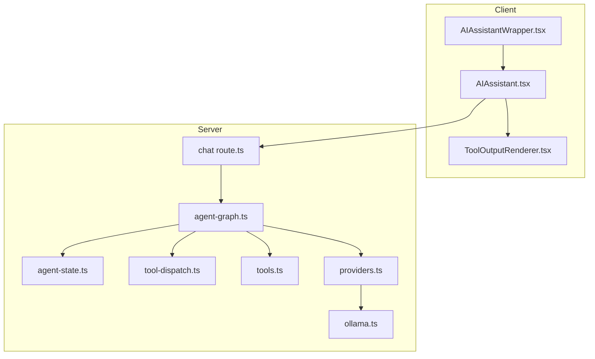
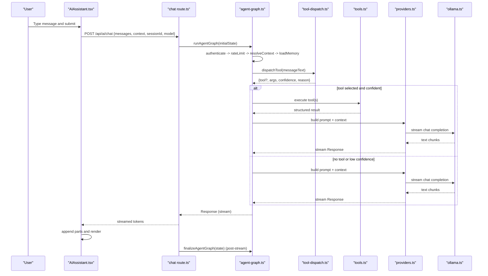
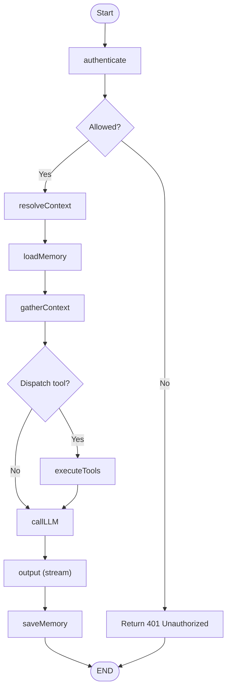
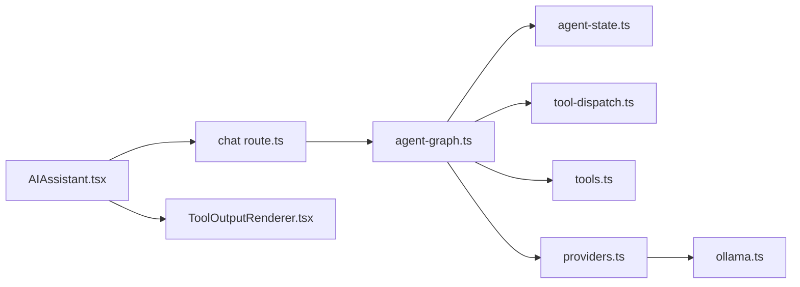

# AI Assistant Interface

<cite>
**Referenced Files in This Document**
- [AIAssistant.tsx](file://apps/portal/components/ai/AIAssistant.tsx)
- [AIAssistantWrapper.tsx](file://apps/portal/components/ai/AIAssistantWrapper.tsx)
- [ToolOutputRenderer.tsx](file://apps/portal/components/ai/ToolOutputRenderer.tsx)
- [route.ts](file://apps/portal/app/api/ai/chat/route.ts)
- [agent-state.ts](file://apps/portal/lib/ai/agent-state.ts)
- [agent-graph.ts](file://apps/portal/lib/ai/agent-graph.ts)
- [tool-dispatch.ts](file://apps/portal/lib/ai/tool-dispatch.ts)
- [tools.ts](file://apps/portal/lib/ai/tools.ts)
- [providers.ts](file://apps/portal/lib/ai/providers.ts)
- [ollama.ts](file://apps/portal/lib/ai/ollama.ts)
</cite>

## Table of Contents

1. [Introduction](#introduction)
2. [Project Structure](#project-structure)
3. [Core Components](#core-components)
4. [Architecture Overview](#architecture-overview)
5. [Detailed Component Analysis](#detailed-component-analysis)
6. [Dependency Analysis](#dependency-analysis)
7. [Performance Considerations](#performance-considerations)
8. [Troubleshooting Guide](#troubleshooting-guide)
9. [Conclusion](#conclusion)
10. [Appendices](#appendices)

## Introduction

This document explains the AI Assistant interface and agent orchestration system used in the portal application. It covers:

- The React chat UI components for message handling, streaming responses, and tool output rendering
- The server-side agent graph that manages conversation flow, state transitions, memory retrieval, tool dispatch, and LLM execution
- Integration with a local Ollama provider (with fallbacks), error handling strategies, and resilience patterns
- Practical guidance for customizing appearance, adding new tools, and implementing specialized flows

## Project Structure

The AI Assistant spans client-side React components and server-side API routes plus an internal agent graph library.



**Diagram sources**

- [AIAssistantWrapper.tsx:1-17](file://apps/portal/components/ai/AIAssistantWrapper.tsx#L1-L17)
- [AIAssistant.tsx:1-389](file://apps/portal/components/ai/AIAssistant.tsx#L1-L389)
- [ToolOutputRenderer.tsx:1-172](file://apps/portal/components/ai/ToolOutputRenderer.tsx#L1-L172)
- [route.ts:1-119](file://apps/portal/app/api/ai/chat/route.ts#L1-L119)
- [agent-graph.ts:119-624](file://apps/portal/lib/ai/agent-graph.ts#L119-L624)
- [agent-state.ts:1-131](file://apps/portal/lib/ai/agent-state.ts#L1-L131)
- [tool-dispatch.ts:1-264](file://apps/portal/lib/ai/tool-dispatch.ts#L1-L264)
- [tools.ts:1-154](file://apps/portal/lib/ai/tools.ts#L1-L154)
- [providers.ts:1-91](file://apps/portal/lib/ai/providers.ts#L1-L91)
- [ollama.ts:1-262](file://apps/portal/lib/ai/ollama.ts#L1-L262)

**Section sources**

- [AIAssistantWrapper.tsx:1-17](file://apps/portal/components/ai/AIAssistantWrapper.tsx#L1-L17)
- [AIAssistant.tsx:1-389](file://apps/portal/components/ai/AIAssistant.tsx#L1-L389)
- [ToolOutputRenderer.tsx:1-172](file://apps/portal/components/ai/ToolOutputRenderer.tsx#L1-L172)
- [route.ts:1-119](file://apps/portal/app/api/ai/chat/route.ts#L1-L119)
- [agent-graph.ts:119-624](file://apps/portal/lib/ai/agent-graph.ts#L119-L624)
- [agent-state.ts:1-131](file://apps/portal/lib/ai/agent-state.ts#L1-L131)
- [tool-dispatch.ts:1-264](file://apps/portal/lib/ai/tool-dispatch.ts#L1-L264)
- [tools.ts:1-154](file://apps/portal/lib/ai/tools.ts#L1-L154)
- [providers.ts:1-91](file://apps/portal/lib/ai/providers.ts#L1-L91)
- [ollama.ts:1-262](file://apps/portal/lib/ai/ollama.ts#L1-L262)

## Core Components

- Client chat UI
  - Floating panel with keyboard accessibility, model selection, quick actions, and streaming status indicators
  - Uses a chat hook to send messages to the server endpoint and render assistant responses
  - Renders tool invocations and their results via a dedicated renderer
- Server orchestration
  - Next.js API route validates requests, authenticates users, initializes agent state, runs the agent graph, and streams the response
  - Agent graph coordinates authentication, rate limiting, context resolution, memory loading, tool dispatch, LLM call, tool execution, memory persistence, and output streaming
  - Tool dispatch uses native Ollama function calling when available, otherwise falls back to JSON parsing with confidence scoring
  - Tools query Supabase data and return structured outputs consumed by the UI renderer
  - Provider layer wraps Ollama HTTP calls with timeouts and error mapping

**Section sources**

- [AIAssistant.tsx:1-389](file://apps/portal/components/ai/AIAssistant.tsx#L1-L389)
- [ToolOutputRenderer.tsx:1-172](file://apps/portal/components/ai/ToolOutputRenderer.tsx#L1-L172)
- [route.ts:1-119](file://apps/portal/app/api/ai/chat/route.ts#L1-L119)
- [agent-graph.ts:119-624](file://apps/portal/lib/ai/agent-graph.ts#L119-L624)
- [agent-state.ts:1-131](file://apps/portal/lib/ai/agent-state.ts#L1-L131)
- [tool-dispatch.ts:1-264](file://apps/portal/lib/ai/tool-dispatch.ts#L1-L264)
- [tools.ts:1-154](file://apps/portal/lib/ai/tools.ts#L1-L154)
- [providers.ts:1-91](file://apps/portal/lib/ai/providers.ts#L1-L91)
- [ollama.ts:1-262](file://apps/portal/lib/ai/ollama.ts#L1-L262)

## Architecture Overview

End-to-end request flow from the chat UI to the LLM and back:



**Diagram sources**

- [AIAssistant.tsx:115-134](file://apps/portal/components/ai/AIAssistant.tsx#L115-L134)
- [route.ts:18-108](file://apps/portal/app/api/ai/chat/route.ts#L18-L108)
- [agent-graph.ts:571-624](file://apps/portal/lib/ai/agent-graph.ts#L571-L624)
- [tool-dispatch.ts:229-247](file://apps/portal/lib/ai/tool-dispatch.ts#L229-L247)
- [tools.ts:12-154](file://apps/portal/lib/ai/tools.ts#L12-L154)
- [providers.ts:22-59](file://apps/portal/lib/ai/providers.ts#L22-L59)
- [ollama.ts:180-227](file://apps/portal/lib/ai/ollama.ts#L180-L227)

## Detailed Component Analysis

### Chat UI: AIAssistant and Wrapper

Responsibilities:

- Manage open/close state, focus trapping, and keyboard shortcuts
- Persist a stable session ID across reloads
- Initialize initial welcome message and integrate with the chat hook
- Render user and assistant messages, including tool-invocation parts
- Provide quick action prompts and model selection
- Show loading and error states

Streaming and tool rendering:

- Streaming is handled by the chat hook; the UI reacts to status changes and appends incoming content
- Tool invocation parts are detected and rendered using ToolOutputRenderer, which formats known tool outputs into department-specific views

Customization points:

- Add more models to the model options list
- Extend quick actions with new prompts
- Customize labels for tool invocations
- Style via Tailwind classes and theme variables

**Section sources**

- [AIAssistant.tsx:32-134](file://apps/portal/components/ai/AIAssistant.tsx#L32-L134)
- [AIAssistant.tsx:136-389](file://apps/portal/components/ai/AIAssistant.tsx#L136-L389)
- [AIAssistantWrapper.tsx:1-17](file://apps/portal/components/ai/AIAssistantWrapper.tsx#L1-L17)

#### Class-like relationships (components)

```mermaid
classDiagram
class AIAssistantWrapper {
+props : { context? : string }
+render()
}
class AIAssistant {
+props : { context? : string, className? : string }
+state : isOpen, input, selectedModel, sessionId
+handleSubmit(e)
+openPanel()
}
class ToolOutputRenderer {
+props : { toolName : string, output : unknown }
+render()
}
AIAssistantWrapper --> AIAssistant : "renders"
AIAssistant --> ToolOutputRenderer : "uses for tool outputs"
```

**Diagram sources**

- [AIAssistantWrapper.tsx:10-16](file://apps/portal/components/ai/AIAssistantWrapper.tsx#L10-L16)
- [AIAssistant.tsx:9-13](file://apps/portal/components/ai/AIAssistant.tsx#L9-L13)
- [ToolOutputRenderer.tsx:10-13](file://apps/portal/components/ai/ToolOutputRenderer.tsx#L10-L13)

### Tool Output Renderer

Responsibilities:

- Map tool names to specific formatters for machine status, shift logs, and delays
- Display errors consistently with icons and colors
- Fallback to pretty-printed JSON for unknown tools

Extensibility:

- Add a new branch for a new tool name and implement a component for its output shape

**Section sources**

- [ToolOutputRenderer.tsx:152-171](file://apps/portal/components/ai/ToolOutputRenderer.tsx#L152-L171)
- [ToolOutputRenderer.tsx:15-54](file://apps/portal/components/ai/ToolOutputRenderer.tsx#L15-L54)
- [ToolOutputRenderer.tsx:56-90](file://apps/portal/components/ai/ToolOutputRenderer.tsx#L56-L90)
- [ToolOutputRenderer.tsx:92-150](file://apps/portal/components/ai/ToolOutputRenderer.tsx#L92-L150)

### API Route: Chat Endpoint

Responsibilities:

- Enforce dynamic rendering and body limits
- Authenticate the user via Supabase
- Validate request schema
- Initialize agent state and run the agent graph
- Stream response back to the client
- Persist assistant memory post-stream using waitUntil or Inngest fallback

Error handling:

- Returns standardized JSON errors with appropriate status codes
- Logs unhandled exceptions and dispatch failures

**Section sources**

- [route.ts:12-16](file://apps/portal/app/api/ai/chat/route.ts#L12-L16)
- [route.ts:18-52](file://apps/portal/app/api/ai/chat/route.ts#L18-L52)
- [route.ts:54-66](file://apps/portal/app/api/ai/chat/route.ts#L54-L66)
- [route.ts:68-108](file://apps/portal/app/api/ai/chat/route.ts#L68-L108)
- [route.ts:111-118](file://apps/portal/app/api/ai/chat/route.ts#L111-L118)

### Agent Graph System

Responsibilities:

- Maintain typed state and node transitions
- Execute nodes in order until completion or error
- Coordinate authentication, rate limiting, context resolution, memory loading, tool dispatch, LLM execution, tool execution, memory persistence, and output streaming
- Wrap each node with observability spans

Key nodes:

- authenticate: verify user
- rateLimit: enforce per-IP limits
- resolveContext: extract department context
- loadMemory: store latest user message and retrieve relevant memories
- gatherContext: decide whether to call a tool via LLM-driven dispatch
- callLLM: generate response with retries and backoff
- executeTools: run selected tools and aggregate results
- saveMemory: persist assistant response after streaming
- output: produce final streaming response

State management:

- Initial state factory sets defaults and next node
- Reducer merges partial updates following last-write-wins semantics

Post-stream finalization:

- Ensures assistant response is stored even if the main response has already been sent

**Section sources**

- [agent-state.ts:33-86](file://apps/portal/lib/ai/agent-state.ts#L33-L86)
- [agent-state.ts:91-131](file://apps/portal/lib/ai/agent-state.ts#L91-L131)
- [agent-graph.ts:548-562](file://apps/portal/lib/ai/agent-graph.ts#L548-L562)
- [agent-graph.ts:571-624](file://apps/portal/lib/ai/agent-graph.ts#L571-L624)
- [agent-graph.ts:119-142](file://apps/portal/lib/ai/agent-graph.ts#L119-L142)
- [agent-graph.ts:144-175](file://apps/portal/lib/ai/agent-graph.ts#L144-L175)
- [agent-graph.ts:177-237](file://apps/portal/lib/ai/agent-graph.ts#L177-L237)
- [agent-graph.ts:247-292](file://apps/portal/lib/ai/agent-graph.ts#L247-L292)
- [agent-graph.ts:294-330](file://apps/portal/lib/ai/agent-graph.ts#L294-L330)
- [agent-graph.ts:426-462](file://apps/portal/lib/ai/agent-graph.ts#L426-L462)
- [agent-graph.ts:464-534](file://apps/portal/lib/ai/agent-graph.ts#L464-L534)

#### Agent Graph Flowchart



**Diagram sources**

- [agent-graph.ts:119-142](file://apps/portal/lib/ai/agent-graph.ts#L119-L142)
- [agent-graph.ts:144-175](file://apps/portal/lib/ai/agent-graph.ts#L144-L175)
- [agent-graph.ts:177-237](file://apps/portal/lib/ai/agent-graph.ts#L177-L237)
- [agent-graph.ts:247-292](file://apps/portal/lib/ai/agent-graph.ts#L247-L292)
- [agent-graph.ts:294-330](file://apps/portal/lib/ai/agent-graph.ts#L294-L330)
- [agent-graph.ts:426-462](file://apps/portal/lib/ai/agent-graph.ts#L426-L462)
- [agent-graph.ts:464-534](file://apps/portal/lib/ai/agent-graph.ts#L464-L534)

### Tool Dispatch and Tools

Tool dispatch:

- Attempts native Ollama function calling first
- Falls back to JSON block parsing with confidence scoring
- Returns a decision with tool name, arguments, confidence, and reasoning

Tools:

- machineStatus: returns machines for a department
- fleetStatus: returns fleet overview with active breakdowns
- shiftLogs: returns daily logs for a department on a date
- delays: returns operational delays for a department on a date

Adding a new tool:

- Define a Zod schema and execute function in tools.ts
- Export it under aiTools
- Optionally add a formatter in ToolOutputRenderer.tsx

**Section sources**

- [tool-dispatch.ts:47-78](file://apps/portal/lib/ai/tool-dispatch.ts#L47-L78)
- [tool-dispatch.ts:84-146](file://apps/portal/lib/ai/tool-dispatch.ts#L84-L146)
- [tool-dispatch.ts:152-211](file://apps/portal/lib/ai/tool-dispatch.ts#L152-L211)
- [tool-dispatch.ts:229-247](file://apps/portal/lib/ai/tool-dispatch.ts#L229-L247)
- [tools.ts:12-33](file://apps/portal/lib/ai/tools.ts#L12-L33)
- [tools.ts:35-86](file://apps/portal/lib/ai/tools.ts#L35-L86)
- [tools.ts:88-116](file://apps/portal/lib/ai/tools.ts#L88-L116)
- [tools.ts:118-146](file://apps/portal/lib/ai/tools.ts#L118-L146)
- [tools.ts:148-154](file://apps/portal/lib/ai/tools.ts#L148-L154)

### Provider Layer and Ollama Integration

Providers:

- Exposes chat and embedding functions wrapping Ollama HTTP calls
- Centralizes logging and error propagation

Ollama client:

- Implements non-streaming and streaming chat completions
- Streams SSE-like JSON lines and yields text chunks
- Embeddings endpoint returns vectors
- Hard timeouts prevent connection leaks in serverless environments

Fallback mechanisms:

- Tool dispatch falls back to JSON parsing if native function calling is unavailable
- Memory persistence falls back to Inngest when waitUntil is not supported

**Section sources**

- [providers.ts:22-59](file://apps/portal/lib/ai/providers.ts#L22-L59)
- [ollama.ts:125-142](file://apps/portal/lib/ai/ollama.ts#L125-L142)
- [ollama.ts:180-227](file://apps/portal/lib/ai/ollama.ts#L180-L227)
- [ollama.ts:233-261](file://apps/portal/lib/ai/ollama.ts#L233-L261)
- [route.ts:71-94](file://apps/portal/app/api/ai/chat/route.ts#L71-L94)

## Dependency Analysis

High-level dependencies between modules:



**Diagram sources**

- [AIAssistant.tsx:115-134](file://apps/portal/components/ai/AIAssistant.tsx#L115-L134)
- [route.ts:4-10](file://apps/portal/app/api/ai/chat/route.ts#L4-L10)
- [agent-graph.ts:548-562](file://apps/portal/lib/ai/agent-graph.ts#L548-L562)
- [agent-state.ts:1-131](file://apps/portal/lib/ai/agent-state.ts#L1-L131)
- [tool-dispatch.ts:1-264](file://apps/portal/lib/ai/tool-dispatch.ts#L1-L264)
- [tools.ts:1-154](file://apps/portal/lib/ai/tools.ts#L1-L154)
- [providers.ts:1-91](file://apps/portal/lib/ai/providers.ts#L1-L91)
- [ollama.ts:1-262](file://apps/portal/lib/ai/ollama.ts#L1-L262)

**Section sources**

- [AIAssistant.tsx:115-134](file://apps/portal/components/ai/AIAssistant.tsx#L115-L134)
- [route.ts:4-10](file://apps/portal/app/api/ai/chat/route.ts#L4-L10)
- [agent-graph.ts:548-562](file://apps/portal/lib/ai/agent-graph.ts#L548-L562)
- [agent-state.ts:1-131](file://apps/portal/lib/ai/agent-state.ts#L1-L131)
- [tool-dispatch.ts:1-264](file://apps/portal/lib/ai/tool-dispatch.ts#L1-L264)
- [tools.ts:1-154](file://apps/portal/lib/ai/tools.ts#L1-L154)
- [providers.ts:1-91](file://apps/portal/lib/ai/providers.ts#L1-L91)
- [ollama.ts:1-262](file://apps/portal/lib/ai/ollama.ts#L1-L262)

## Performance Considerations

- Streaming reduces perceived latency by sending tokens as they arrive
- Hard timeouts on Ollama requests prevent resource leaks in serverless environments
- Parallel memory retrieval improves responsiveness during context assembly
- Post-stream memory persistence avoids blocking the response path
- Rate limiting protects against abuse and ensures fair usage

[No sources needed since this section provides general guidance]

## Troubleshooting Guide

Common issues and resolutions:

- Authentication failures: ensure valid session cookies and correct Supabase configuration
- Invalid request payloads: check schema validation details returned by the API
- Tool dispatch failures: inspect logs for both native and fallback paths; confirm tool definitions match expected schemas
- Ollama connectivity: verify base URL and timeout settings; check for 504 timeouts
- Memory persistence: if waitUntil is unavailable, confirm Inngest job delivery

Operational checks:

- Confirm the presence of required environment variables for Ollama
- Validate department names used in tools exist in the database
- Inspect tool output shapes to ensure the renderer can format them

**Section sources**

- [route.ts:22-44](file://apps/portal/app/api/ai/chat/route.ts#L22-L44)
- [route.ts:97-108](file://apps/portal/app/api/ai/chat/route.ts#L97-L108)
- [tool-dispatch.ts:243-247](file://apps/portal/lib/ai/tool-dispatch.ts#L243-L247)
- [ollama.ts:50-74](file://apps/portal/lib/ai/ollama.ts#L50-L74)
- [route.ts:71-94](file://apps/portal/app/api/ai/chat/route.ts#L71-L94)

## Conclusion

The AI Assistant integrates a responsive React chat UI with a robust server-side agent graph. The system supports streaming responses, structured tool use with confidence-based routing, and resilient integration with a local Ollama provider. Extensibility is straightforward through additional tools, renderers, and model options, while error handling and fallbacks ensure reliability in production.

[No sources needed since this section summarizes without analyzing specific files]

## Appendices

### Customizing Appearance

- Change model options in the component’s model list
- Adjust quick action prompts to guide common workflows
- Update tool invocation labels for clearer feedback
- Apply Tailwind classes and theme variables to match your design system

**Section sources**

- [AIAssistant.tsx:23-30](file://apps/portal/components/ai/AIAssistant.tsx#L23-L30)
- [AIAssistant.tsx:241-265](file://apps/portal/components/ai/AIAssistant.tsx#L241-L265)
- [AIAssistant.tsx:17-21](file://apps/portal/components/ai/AIAssistant.tsx#L17-L21)

### Adding New Tools

Steps:

- Define a Zod input schema and execute function in tools.ts
- Export the tool under aiTools
- If needed, add a formatter in ToolOutputRenderer.tsx for rich display
- Test via quick actions or natural language prompts

**Section sources**

- [tools.ts:12-33](file://apps/portal/lib/ai/tools.ts#L12-L33)
- [tools.ts:148-154](file://apps/portal/lib/ai/tools.ts#L148-L154)
- [ToolOutputRenderer.tsx:152-171](file://apps/portal/components/ai/ToolOutputRenderer.tsx#L152-L171)

### Implementing Specialized Conversation Flows

Approaches:

- Use gatherContextNode to inject clarifying instructions based on dispatch confidence
- Extend resolveContextNode to enrich agent context with additional metadata
- Introduce new nodes in the graph for domain-specific logic before or after LLM calls

**Section sources**

- [agent-graph.ts:247-292](file://apps/portal/lib/ai/agent-graph.ts#L247-L292)
- [agent-graph.ts:144-175](file://apps/portal/lib/ai/agent-graph.ts#L144-L175)
- [agent-graph.ts:548-562](file://apps/portal/lib/ai/agent-graph.ts#L548-L562)
