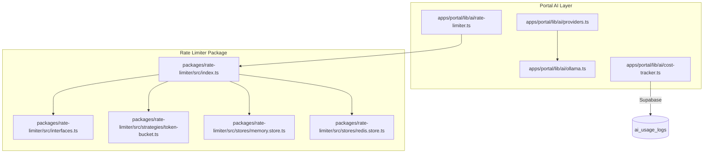
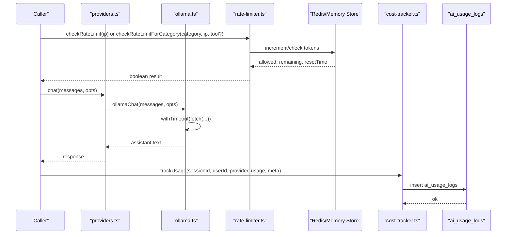
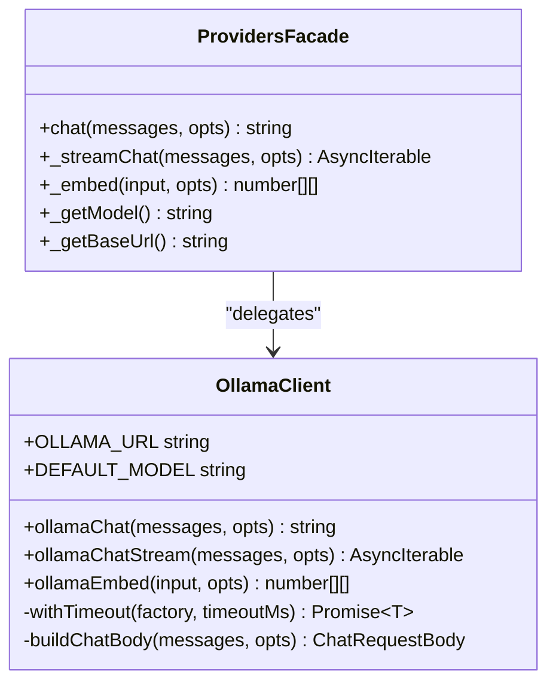
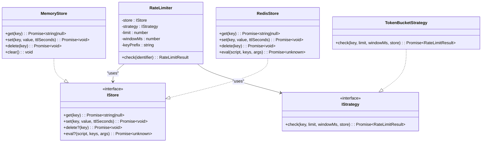
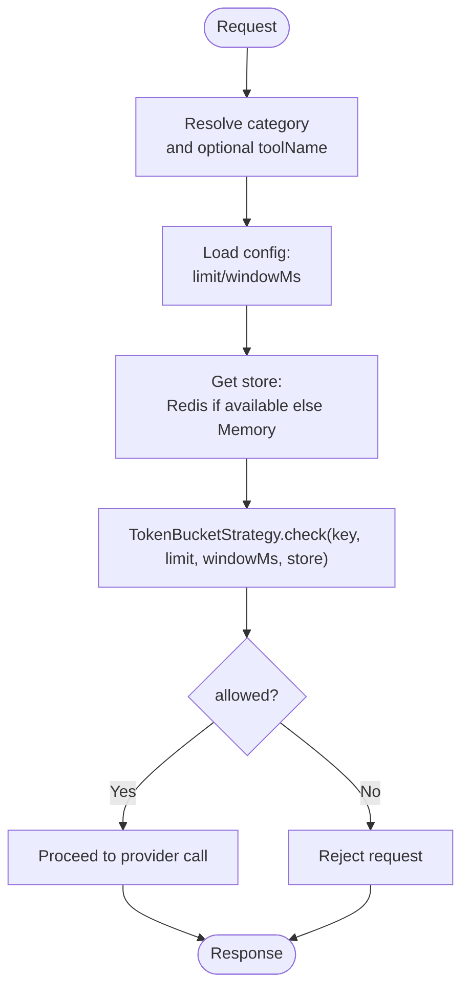
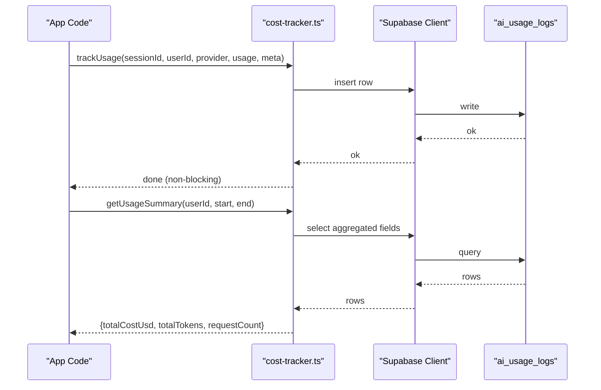
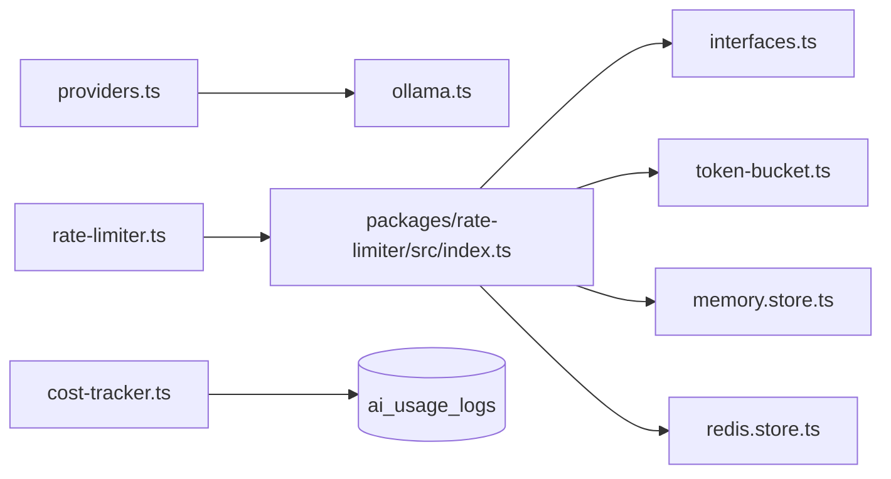

# AI Provider Abstraction

<cite>
**Referenced Files in This Document**
- [providers.ts](file://apps/portal/lib/ai/providers.ts)
- [ollama.ts](file://apps/portal/lib/ai/ollama.ts)
- [rate-limiter.ts](file://apps/portal/lib/ai/rate-limiter.ts)
- [cost-tracker.ts](file://apps/portal/lib/ai/cost-tracker.ts)
- [index.ts](file://packages/rate-limiter/src/index.ts)
- [interfaces.ts](file://packages/rate-limiter/src/interfaces.ts)
- [token-bucket.ts](file://packages/rate-limiter/src/strategies/token-bucket.ts)
- [memory.store.ts](file://packages/rate-limiter/src/stores/memory.store.ts)
- [redis.store.ts](file://packages/rate-limiter/src/stores/redis.store.ts)
</cite>

## Table of Contents

1. [Introduction](#introduction)
2. [Project Structure](#project-structure)
3. [Core Components](#core-components)
4. [Architecture Overview](#architecture-overview)
5. [Detailed Component Analysis](#detailed-component-analysis)
6. [Dependency Analysis](#dependency-analysis)
7. [Performance Considerations](#performance-considerations)
8. [Troubleshooting Guide](#troubleshooting-guide)
9. [Conclusion](#conclusion)
10. [Appendices](#appendices)

## Introduction

This document explains the AI provider abstraction layer and rate limiting system used by the application. It covers:

- The provider interface design and how providers are implemented (current focus on Ollama).
- How to add new AI providers (e.g., OpenAI-compatible endpoints).
- Rate limiting mechanisms, including per-category and per-tool buckets with Redis-backed distributed enforcement and in-memory fallback.
- Cost tracking and usage analytics for observability.
- Configuration patterns, authentication methods, and environment variable management.
- Examples for extending providers, implementing custom rate limiting strategies, and monitoring usage and costs.

## Project Structure

The AI subsystem is primarily located under apps/portal/lib/ai, with a reusable rate limiter package under packages/rate-limiter.

**Diagram sources**

- [providers.ts:1-91](file://apps/portal/lib/ai/providers.ts#L1-L91)
- [ollama.ts:1-262](file://apps/portal/lib/ai/ollama.ts#L1-L262)
- [rate-limiter.ts:1-216](file://apps/portal/lib/ai/rate-limiter.ts#L1-L216)
- [cost-tracker.ts:1-139](file://apps/portal/lib/ai/cost-tracker.ts#L1-L139)
- [index.ts:1-35](file://packages/rate-limiter/src/index.ts#L1-L35)
- [interfaces.ts:1-32](file://packages/rate-limiter/src/interfaces.ts#L1-L32)
- [token-bucket.ts:1-155](file://packages/rate-limiter/src/strategies/token-bucket.ts#L1-L155)
- [memory.store.ts:1-38](file://packages/rate-limiter/src/stores/memory.store.ts#L1-L38)
- [redis.store.ts:1-38](file://packages/rate-limiter/src/stores/redis.store.ts#L1-L38)

**Section sources**

- [providers.ts:1-91](file://apps/portal/lib/ai/providers.ts#L1-L91)
- [ollama.ts:1-262](file://apps/portal/lib/ai/ollama.ts#L1-L262)
- [rate-limiter.ts:1-216](file://apps/portal/lib/ai/rate-limiter.ts#L1-L216)
- [cost-tracker.ts:1-139](file://apps/portal/lib/ai/cost-tracker.ts#L1-L139)
- [index.ts:1-35](file://packages/rate-limiter/src/index.ts#L1-L35)
- [interfaces.ts:1-32](file://packages/rate-limiter/src/interfaces.ts#L1-L32)
- [token-bucket.ts:1-155](file://packages/rate-limiter/src/strategies/token-bucket.ts#L1-L155)
- [memory.store.ts:1-38](file://packages/rate-limiter/src/stores/memory.store.ts#L1-L38)
- [redis.store.ts:1-38](file://packages/rate-limiter/src/stores/redis.store.ts#L1-L38)

## Core Components

- Provider abstraction: A minimal chat/embedding facade that currently targets an Ollama-compatible server via native fetch calls. It exposes chat, streaming chat, and embedding functions with error logging and model/base URL accessors.
- Ollama client: Implements request building, timeouts, streaming parsing, and embeddings against /api/chat and /api/embed.
- Rate limiter: Provides both a simple in-process API (checkRateLimit, checkRateLimitForCategory) and a reusable package with pluggable stores and strategies. Supports token bucket with Lua atomic execution when available, falling back to JS read-modify-write.
- Cost tracker: Logs token usage to a database table for observability; cost estimation is illustrative and can be adapted to real pricing.

Key responsibilities:

- Decouple callers from specific AI services.
- Enforce rate limits per IP/category/tool.
- Track usage for analytics and cost estimation.

**Section sources**

- [providers.ts:1-91](file://apps/portal/lib/ai/providers.ts#L1-L91)
- [ollama.ts:1-262](file://apps/portal/lib/ai/ollama.ts#L1-L262)
- [rate-limiter.ts:1-216](file://apps/portal/lib/ai/rate-limiter.ts#L1-L216)
- [cost-tracker.ts:1-139](file://apps/portal/lib/ai/cost-tracker.ts#L1-L139)

## Architecture Overview

The runtime flow for a chat request includes provider selection, optional rate limiting, HTTP call to the AI service, and usage logging.

**Diagram sources**

- [providers.ts:1-91](file://apps/portal/lib/ai/providers.ts#L1-L91)
- [ollama.ts:1-262](file://apps/portal/lib/ai/ollama.ts#L1-L262)
- [rate-limiter.ts:1-216](file://apps/portal/lib/ai/rate-limiter.ts#L1-L216)
- [cost-tracker.ts:1-139](file://apps/portal/lib/ai/cost-tracker.ts#L1-L139)

## Detailed Component Analysis

### Provider Abstraction (Ollama-first)

- Purpose: Provide a stable interface for chat and embeddings while isolating callers from transport details.
- Current implementation: Targets a local Ollama server using native fetch with strict timeouts and streaming support.
- Extensibility: To add another provider (e.g., OpenAI-compatible), implement equivalent chat/streaming/embedding functions and expose them through a similar facade.

**Diagram sources**

- [providers.ts:1-91](file://apps/portal/lib/ai/providers.ts#L1-L91)
- [ollama.ts:1-262](file://apps/portal/lib/ai/ollama.ts#L1-L262)

**Section sources**

- [providers.ts:1-91](file://apps/portal/lib/ai/providers.ts#L1-L91)
- [ollama.ts:1-262](file://apps/portal/lib/ai/ollama.ts#L1-L262)

### Rate Limiting System

Two layers exist:

- Application-level API in apps/portal/lib/ai/rate-limiter.ts:
  - Simple fixed-window counters with category/tool scoping.
  - Redis-backed store with in-memory fallback.
  - Backward-compatible checkRateLimit(ip) and new checkRateLimitForCategory(category, ip, toolName?).
- Reusable package in packages/rate-limiter:
  - Pluggable strategy/store architecture.
  - TokenBucketStrategy with Lua-based atomic execution when supported.
  - MemoryStore and RedisStore implementations.

**Diagram sources**

- [index.ts:1-35](file://packages/rate-limiter/src/index.ts#L1-L35)
- [interfaces.ts:1-32](file://packages/rate-limiter/src/interfaces.ts#L1-L32)
- [token-bucket.ts:1-155](file://packages/rate-limiter/src/strategies/token-bucket.ts#L1-L155)
- [memory.store.ts:1-38](file://packages/rate-limiter/src/stores/memory.store.ts#L1-L38)
- [redis.store.ts:1-38](file://packages/rate-limiter/src/stores/redis.store.ts#L1-L38)

Application-level rate limiter behavior:

- Categories: chat, embedding, tool.
- Per-tool overrides via an internal registry.
- Key construction differentiates categories and tools.
- Fallback to in-memory if Redis is unavailable.

**Diagram sources**

- [rate-limiter.ts:1-216](file://apps/portal/lib/ai/rate-limiter.ts#L1-L216)
- [token-bucket.ts:1-155](file://packages/rate-limiter/src/strategies/token-bucket.ts#L1-L155)

**Section sources**

- [rate-limiter.ts:1-216](file://apps/portal/lib/ai/rate-limiter.ts#L1-L216)
- [index.ts:1-35](file://packages/rate-limiter/src/index.ts#L1-L35)
- [interfaces.ts:1-32](file://packages/rate-limiter/src/interfaces.ts#L1-L32)
- [token-bucket.ts:1-155](file://packages/rate-limiter/src/strategies/token-bucket.ts#L1-L155)
- [memory.store.ts:1-38](file://packages/rate-limiter/src/stores/memory.store.ts#L1-L38)
- [redis.store.ts:1-38](file://packages/rate-limiter/src/stores/redis.store.ts#L1-L38)

### Cost Tracking and Usage Analytics

- Tracks token usage per request to a database table for observability.
- Provides helpers to aggregate totals over date ranges and retrieve session usage records.
- Designed to be non-blocking; errors are logged but do not fail requests.

**Diagram sources**

- [cost-tracker.ts:1-139](file://apps/portal/lib/ai/cost-tracker.ts#L1-L139)

**Section sources**

- [cost-tracker.ts:1-139](file://apps/portal/lib/ai/cost-tracker.ts#L1-L139)

## Dependency Analysis

- providers.ts depends on ollama.ts for HTTP interactions and error logging.
- rate-limiter.ts uses a Redis client wrapper and implements its own in-memory store and token bucket logic.
- The reusable rate-limiter package defines interfaces and provides multiple strategies and stores, enabling decoupled composition.
- cost-tracker.ts depends on a Supabase client and writes to a dedicated usage table.

**Diagram sources**

- [providers.ts:1-91](file://apps/portal/lib/ai/providers.ts#L1-L91)
- [ollama.ts:1-262](file://apps/portal/lib/ai/ollama.ts#L1-L262)
- [rate-limiter.ts:1-216](file://apps/portal/lib/ai/rate-limiter.ts#L1-L216)
- [index.ts:1-35](file://packages/rate-limiter/src/index.ts#L1-L35)
- [interfaces.ts:1-32](file://packages/rate-limiter/src/interfaces.ts#L1-L32)
- [token-bucket.ts:1-155](file://packages/rate-limiter/src/strategies/token-bucket.ts#L1-L155)
- [memory.store.ts:1-38](file://packages/rate-limiter/src/stores/memory.store.ts#L1-L38)
- [redis.store.ts:1-38](file://packages/rate-limiter/src/stores/redis.store.ts#L1-L38)
- [cost-tracker.ts:1-139](file://apps/portal/lib/ai/cost-tracker.ts#L1-L139)

**Section sources**

- [providers.ts:1-91](file://apps/portal/lib/ai/providers.ts#L1-L91)
- [ollama.ts:1-262](file://apps/portal/lib/ai/ollama.ts#L1-L262)
- [rate-limiter.ts:1-216](file://apps/portal/lib/ai/rate-limiter.ts#L1-L216)
- [index.ts:1-35](file://packages/rate-limiter/src/index.ts#L1-L35)
- [interfaces.ts:1-32](file://packages/rate-limiter/src/interfaces.ts#L1-L32)
- [token-bucket.ts:1-155](file://packages/rate-limiter/src/strategies/token-bucket.ts#L1-L155)
- [memory.store.ts:1-38](file://packages/rate-limiter/src/stores/memory.store.ts#L1-L38)
- [redis.store.ts:1-38](file://packages/rate-limiter/src/stores/redis.store.ts#L1-L38)
- [cost-tracker.ts:1-139](file://apps/portal/lib/ai/cost-tracker.ts#L1-L139)

## Performance Considerations

- Timeouts: All outbound requests use a hard timeout with abort signals to prevent connection leaks in serverless environments.
- Streaming: Streaming responses parse line-delimited JSON chunks and cancel readers on disposal to free resources promptly.
- Rate limiting: Prefer Redis-backed token bucket with Lua scripts for atomicity; fall back to memory store without blocking.
- Observability: Usage tracking is asynchronous and non-fatal to avoid impacting latency.

[No sources needed since this section provides general guidance]

## Troubleshooting Guide

Common issues and remedies:

- Provider connectivity failures:
  - Verify base URL and model availability.
  - Inspect error logs emitted by the provider facade.
- Rate limit rejections:
  - Confirm category and tool name mapping.
  - Check Redis availability; falls back to in-memory which is process-scoped.
- Streaming interruptions:
  - Ensure clients handle generator cancellation; reader.cancel is invoked on completion/disposal.
- Usage tracking gaps:
  - Database write failures are swallowed; verify the database table and permissions.

**Section sources**

- [providers.ts:1-91](file://apps/portal/lib/ai/providers.ts#L1-L91)
- [ollama.ts:1-262](file://apps/portal/lib/ai/ollama.ts#L1-L262)
- [rate-limiter.ts:1-216](file://apps/portal/lib/ai/rate-limiter.ts#L1-L216)
- [cost-tracker.ts:1-139](file://apps/portal/lib/ai/cost-tracker.ts#L1-L139)

## Conclusion

The AI provider abstraction cleanly separates caller code from transport specifics, with a current focus on Ollama. The rate limiting system supports distributed enforcement with Redis and offers flexible strategies and stores. Usage tracking provides essential observability for token consumption and cost estimation. Together, these components enable scalable, observable, and controllable AI integrations.

[No sources needed since this section summarizes without analyzing specific files]

## Appendices

### Adding a New AI Provider (Example: OpenAI-Compatible)

Steps:

- Implement a client module with chat, streaming chat, and embedding functions, including timeouts and error handling.
- Expose a facade similar to the existing one, providing consistent method signatures and configuration accessors.
- Wire up any required environment variables (e.g., API key, base URL) and ensure they are resolved before making requests.
- Add tests for success paths, timeouts, and streaming behavior.

[No sources needed since this section provides general guidance]

### Implementing Custom Rate Limiting Strategies

To add a new strategy:

- Implement the IStrategy interface with a check method returning RateLimitResult.
- Use the provided MemoryStore or RedisStore for persistence.
- Compose via the RateLimiter constructor with your chosen store, strategy, limits, and window.

[No sources needed since this section provides general guidance]

### Monitoring AI Service Usage and Costs

- Log usage after each request using the provided tracking helper.
- Aggregate metrics over time using the summary helper for dashboards and alerts.
- Adjust cost estimation formulas to reflect actual pricing models when integrating paid providers.

[No sources needed since this section provides general guidance]
