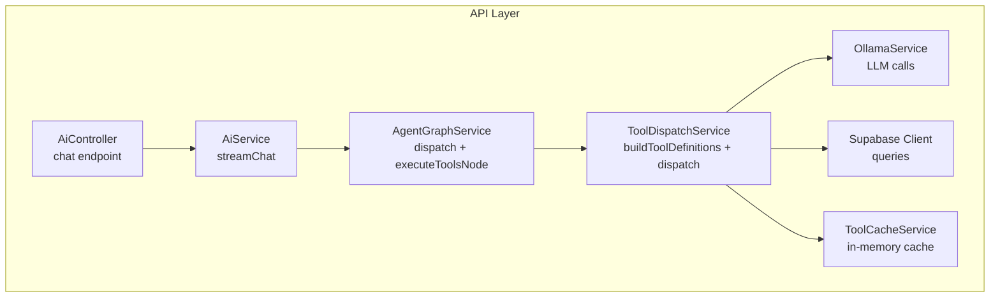
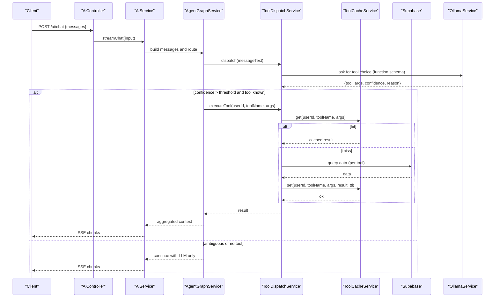
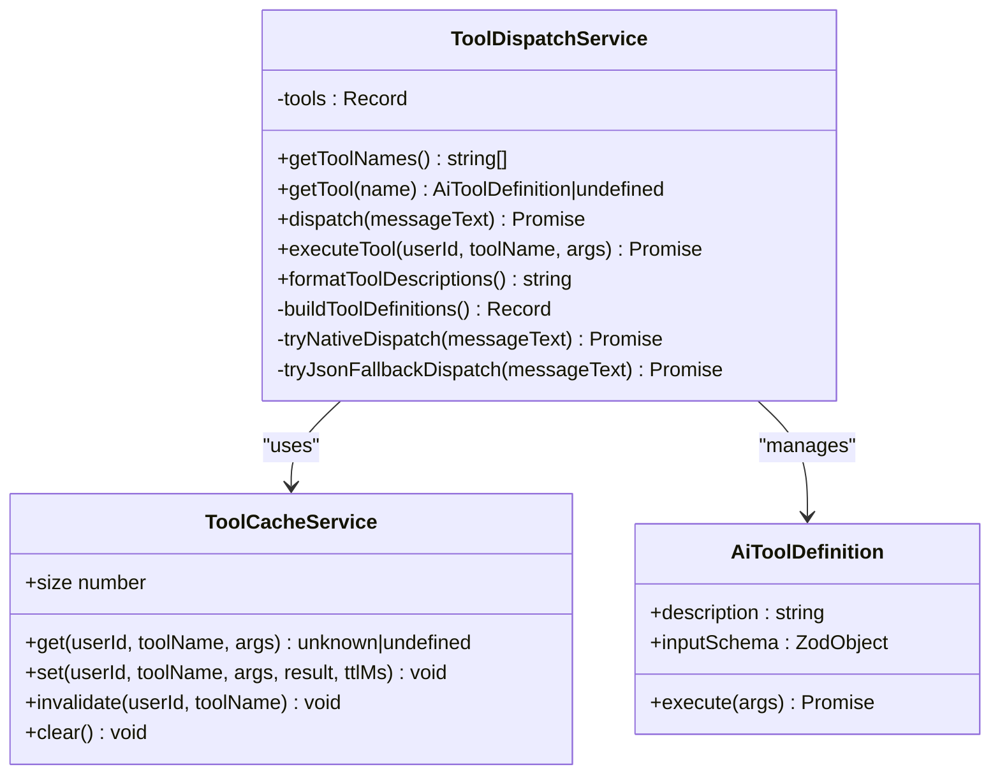
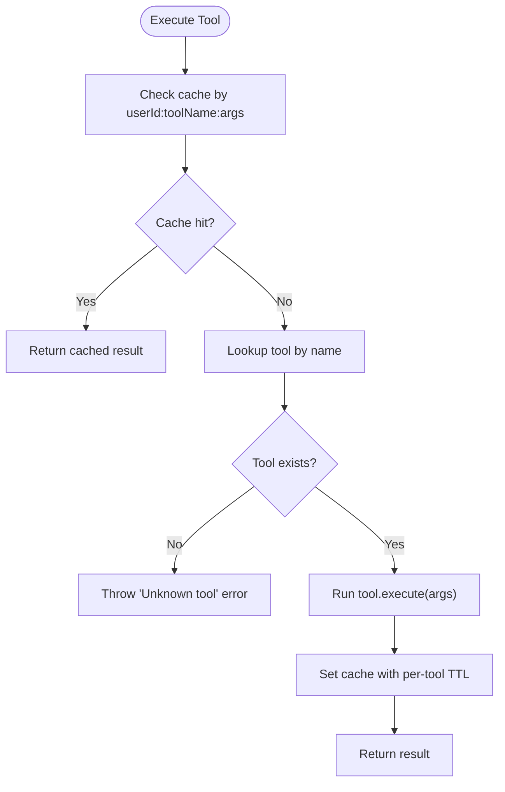
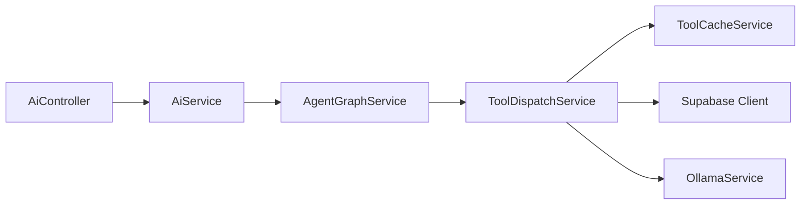

# Tool Definitions & Schema

<cite>
**Referenced Files in This Document**
- [tool-dispatch.service.ts](file://apps/api/src/ai/tools/tool-dispatch.service.ts)
- [tool-cache.service.ts](file://apps/api/src/ai/tools/tool-cache.service.ts)
- [agent-graph.service.ts](file://apps/api/src/ai/agent-graph/agent-graph.service.ts)
- [ai.controller.ts](file://apps/api/src/ai/ai.controller.ts)
- [ai.service.ts](file://apps/api/src/ai/ai.service.ts)
- [schemas.ts](file://apps/api/src/common/schemas.ts)
</cite>

## Table of Contents

1. [Introduction](#introduction)
2. [Project Structure](#project-structure)
3. [Core Components](#core-components)
4. [Architecture Overview](#architecture-overview)
5. [Detailed Component Analysis](#detailed-component-analysis)
6. [Dependency Analysis](#dependency-analysis)
7. [Performance Considerations](#performance-considerations)
8. [Security Considerations](#security-considerations)
9. [Troubleshooting Guide](#troubleshooting-guide)
10. [Conclusion](#conclusion)

## Introduction

This document explains the AI tool definition system used by the application’s assistant to call operational tools such as machine status, fleet status, shift logs, and delays. It covers how tools are defined with descriptions, input schemas using Zod validation, and execution functions; how the dispatcher selects a tool from natural language; how results are cached and returned; and how to create custom tools safely and effectively.

## Project Structure

The tooling lives under the API module and integrates with the agent graph that orchestrates chat flows:

- Tool definitions and dispatch logic: apps/api/src/ai/tools
- Agent graph integration: apps/api/src/ai/agent-graph
- HTTP entrypoints and request validation: apps/api/src/ai and apps/api/src/common

**Diagram sources**

- [ai.controller.ts:13-47](file://apps/api/src/ai/ai.controller.ts#L13-L47)
- [ai.service.ts:48-54](file://apps/api/src/ai/ai.service.ts#L48-L54)
- [agent-graph.service.ts:156-191](file://apps/api/src/ai/agent-graph/agent-graph.service.ts#L156-L191)
- [tool-dispatch.service.ts:22-33](file://apps/api/src/ai/tools/tool-dispatch.service.ts#L22-L33)
- [tool-cache.service.ts:12-47](file://apps/api/src/ai/tools/tool-cache.service.ts#L12-L47)

**Section sources**

- [ai.controller.ts:13-47](file://apps/api/src/ai/ai.controller.ts#L13-L47)
- [ai.service.ts:48-54](file://apps/api/src/ai/ai.service.ts#L48-L54)
- [agent-graph.service.ts:156-191](file://apps/api/src/ai/agent-graph/agent-graph.service.ts#L156-L191)
- [tool-dispatch.service.ts:22-33](file://apps/api/src/ai/tools/tool-dispatch.service.ts#L22-L33)
- [tool-cache.service.ts:12-47](file://apps/api/src/ai/tools/tool-cache.service.ts#L12-L47)

## Core Components

- ToolDispatchService: Defines built-in tools (machineStatus, fleetStatus, shiftLogs, delays), builds LLM-facing function schemas from Zod schemas, dispatches intent via LLM, and executes tools with caching.
- ToolCacheService: In-memory LRU-style cache keyed by user, tool name, and serialized arguments with per-tool TTLs.
- AgentGraphService: Orchestrates chat flow, decides whether to call tools based on LLM confidence, enforces rate limits, and collects results.
- AiController/AiService: HTTP endpoints and streaming orchestration; request validation uses shared Zod schemas.

Key responsibilities:

- Input schema definition with Zod for each tool parameter.
- LLM prompt formatting with tool descriptions and required parameters.
- Safe execution with error handling and caching.
- Rate limiting and context assembly for downstream LLM responses.

**Section sources**

- [tool-dispatch.service.ts:87-180](file://apps/api/src/ai/tools/tool-dispatch.service.ts#L87-L180)
- [tool-cache.service.ts:12-47](file://apps/api/src/ai/tools/tool-cache.service.ts#L12-L47)
- [agent-graph.service.ts:156-191](file://apps/api/src/ai/agent-graph/agent-graph.service.ts#L156-L191)
- [ai.controller.ts:13-47](file://apps/api/src/ai/ai.controller.ts#L13-L47)
- [schemas.ts:113-130](file://apps/api/src/common/schemas.ts#L113-L130)

## Architecture Overview

End-to-end flow for a chat message that triggers a tool:

**Diagram sources**

- [ai.controller.ts:13-47](file://apps/api/src/ai/ai.controller.ts#L13-L47)
- [ai.service.ts:48-54](file://apps/api/src/ai/ai.service.ts#L48-L54)
- [agent-graph.service.ts:156-191](file://apps/api/src/ai/agent-graph/agent-graph.service.ts#L156-L191)
- [tool-dispatch.service.ts:43-76](file://apps/api/src/ai/tools/tool-dispatch.service.ts#L43-L76)
- [tool-cache.service.ts:15-47](file://apps/api/src/ai/tools/tool-cache.service.ts#L15-L47)

## Detailed Component Analysis

### Tool Definition Model

Each tool is defined with:

- description: Human-readable explanation for the LLM.
- inputSchema: A Zod object describing parameters and their constraints.
- execute: An async function that performs work (e.g., database queries) and returns a JSON-serializable result.

Built-in tools:

- machineStatus: Returns machines for a department.
- fleetStatus: Returns fleet overview or specific vehicle details with active breakdown info.
- shiftLogs: Returns daily logs for a department on a given date.
- delays: Returns operational delays for a department on a given date.

**Diagram sources**

- [tool-dispatch.service.ts:22-33](file://apps/api/src/ai/tools/tool-dispatch.service.ts#L22-L33)
- [tool-dispatch.service.ts:87-180](file://apps/api/src/ai/tools/tool-dispatch.service.ts#L87-L180)
- [tool-cache.service.ts:12-47](file://apps/api/src/ai/tools/tool-cache.service.ts#L12-L47)

**Section sources**

- [tool-dispatch.service.ts:87-180](file://apps/api/src/ai/tools/tool-dispatch.service.ts#L87-L180)

### Built-in Tools: Behavior and Data Access

- machineStatus
  - Parameters: departmentName (required).
  - Behavior: Resolves department ID, then lists machines for that department.
  - Output: List of machines or an error if department not found.
- fleetStatus
  - Parameters: fleetCode (optional).
  - Behavior: Queries fleet records and merges active breakdowns; includes timestamp and count.
  - Output: Vehicles with is_down flag and breakdown details when applicable.
- shiftLogs
  - Parameters: departmentName (required), date (optional ISO date).
  - Behavior: Finds department and fetches daily logs for the target date.
  - Output: Array of log entries.
- delays
  - Parameters: departmentName (required), date (optional ISO date).
  - Behavior: Finds department and fetches operational delays for the target date.
  - Output: Array of delay records.

All tools use Supabase client to read from tables like departments, machines, fleet, breakdowns, daily_logs, and operational_delays.

**Section sources**

- [tool-dispatch.service.ts:87-180](file://apps/api/src/ai/tools/tool-dispatch.service.ts#L87-L180)

### Schema Validation Patterns

- Tool input schemas are defined with Zod objects. Each property can include .describe(...) to provide human-readable guidance to the LLM.
- Required vs optional parameters are inferred from Zod shape to populate LLM function parameters’ required list.
- The dispatcher converts Zod shapes into OpenAI-compatible function schemas for the LLM to choose from.

Validation patterns observed:

- String fields with descriptions for LLM guidance.
- Optional fields using .optional().
- No numeric or enum types exposed to the LLM in current tools; all parameters are strings.

Note: While tool inputs are described to the LLM, runtime execution does not re-validate against Zod before calling execute. If stricter enforcement is needed, add explicit validation inside execute or wrap with a validator.

**Section sources**

- [tool-dispatch.service.ts:182-201](file://apps/api/src/ai/tools/tool-dispatch.service.ts#L182-L201)
- [tool-dispatch.service.ts:87-180](file://apps/api/src/ai/tools/tool-dispatch.service.ts#L87-L180)

### Execution Flow and Error Handling

- Dispatch attempts native parsing first, then a fallback path; both parse a JSON block from the LLM response.
- Unknown tool names are rejected with low confidence and a reason.
- executeTool checks cache first, then invokes the tool, and caches the result with a per-tool TTL.
- Errors during tool execution bubble up; callers should handle exceptions and return safe summaries.

**Diagram sources**

- [tool-dispatch.service.ts:56-76](file://apps/api/src/ai/tools/tool-dispatch.service.ts#L56-L76)
- [tool-cache.service.ts:15-47](file://apps/api/src/ai/tools/tool-cache.service.ts#L15-L47)

**Section sources**

- [tool-dispatch.service.ts:43-76](file://apps/api/src/ai/tools/tool-dispatch.service.ts#L43-L76)
- [tool-cache.service.ts:15-47](file://apps/api/src/ai/tools/tool-cache.service.ts#L15-L47)

### Integration With Agent Graph

- The agent graph requests tool dispatch from ToolDispatchService.
- If confidence is low, it asks clarifying questions instead of executing tools.
- When a tool is selected, it enforces per-tool rate limiting and aggregates results into context for subsequent LLM turns.

**Section sources**

- [agent-graph.service.ts:156-191](file://apps/api/src/ai/agent-graph/agent-graph.service.ts#L156-L191)

### Request Validation at the Edge

- Chat endpoints validate payloads using shared Zod schemas before invoking services.
- This ensures consistent input constraints across the API surface.

**Section sources**

- [ai.controller.ts:13-47](file://apps/api/src/ai/ai.controller.ts#L13-L47)
- [schemas.ts:113-130](file://apps/api/src/common/schemas.ts#L113-L130)

## Dependency Analysis

High-level dependencies among core components:

**Diagram sources**

- [ai.controller.ts:13-47](file://apps/api/src/ai/ai.controller.ts#L13-L47)
- [ai.service.ts:48-54](file://apps/api/src/ai/ai.service.ts#L48-L54)
- [agent-graph.service.ts:156-191](file://apps/api/src/ai/agent-graph/agent-graph.service.ts#L156-L191)
- [tool-dispatch.service.ts:22-33](file://apps/api/src/ai/tools/tool-dispatch.service.ts#L22-L33)
- [tool-cache.service.ts:12-47](file://apps/api/src/ai/tools/tool-cache.service.ts#L12-L47)

**Section sources**

- [ai.controller.ts:13-47](file://apps/api/src/ai/ai.controller.ts#L13-L47)
- [ai.service.ts:48-54](file://apps/api/src/ai/ai.service.ts#L48-L54)
- [agent-graph.service.ts:156-191](file://apps/api/src/ai/agent-graph/agent-graph.service.ts#L156-L191)
- [tool-dispatch.service.ts:22-33](file://apps/api/src/ai/tools/tool-dispatch.service.ts#L22-L33)
- [tool-cache.service.ts:12-47](file://apps/api/src/ai/tools/tool-cache.service.ts#L12-L47)

## Performance Considerations

- In-memory caching reduces repeated database reads for identical tool calls within short time windows.
- Per-tool TTLs reflect typical staleness: fleet and shifts may be slightly longer-lived than machine status and delays.
- Rate limiting prevents abuse and protects downstream systems.
- Keep tool outputs small and structured to minimize token usage and improve LLM comprehension.

[No sources needed since this section provides general guidance]

## Security Considerations

- Input validation:
  - Use Zod schemas for all external inputs (already applied at controller layer).
  - For tool parameters, consider adding runtime validation inside execute to enforce strict types and lengths.
- Parameter sanitization:
  - Treat all LLM-provided arguments as untrusted. Validate and sanitize before use in queries or file operations.
- Database access:
  - Prefer read-only clients for tool queries. Ensure row-level security policies restrict access to sensitive data.
- Output sanitization:
  - Avoid returning raw secrets or PII. Normalize outputs to minimal, safe structures.
- Prompt injection:
  - Do not embed user text directly into prompts without bounds. Limit length and strip dangerous content where appropriate.
- Rate limiting and quotas:
  - Enforce per-user and per-tool limits to mitigate abuse.

[No sources needed since this section provides general guidance]

## Troubleshooting Guide

Common issues and remedies:

- Ambiguous intent:
  - Low-confidence dispatch leads to clarification prompts rather than tool calls. Improve tool descriptions and parameter hints.
- Unknown tool requested:
  - The dispatcher rejects unknown tool names. Verify tool registration and spelling.
- Cache misses or stale data:
  - Adjust per-tool TTLs if data freshness requirements change.
- Database errors:
  - Ensure correct table/column names and permissions. Add logging around DB calls for diagnostics.
- Streaming failures:
  - Controller handles errors by writing a final error chunk; check server logs for upstream exceptions.

**Section sources**

- [tool-dispatch.service.ts:43-76](file://apps/api/src/ai/tools/tool-dispatch.service.ts#L43-L76)
- [ai.controller.ts:35-47](file://apps/api/src/ai/ai.controller.ts#L35-L47)

## Conclusion

The tool definition system combines clear descriptions, Zod-based schemas, and focused execution functions to enable reliable, cacheable, and rate-limited tool usage driven by LLM intent detection. By following the patterns outlined here—especially around validation, sanitization, and output shaping—you can extend the system with new tools that integrate seamlessly and securely.
