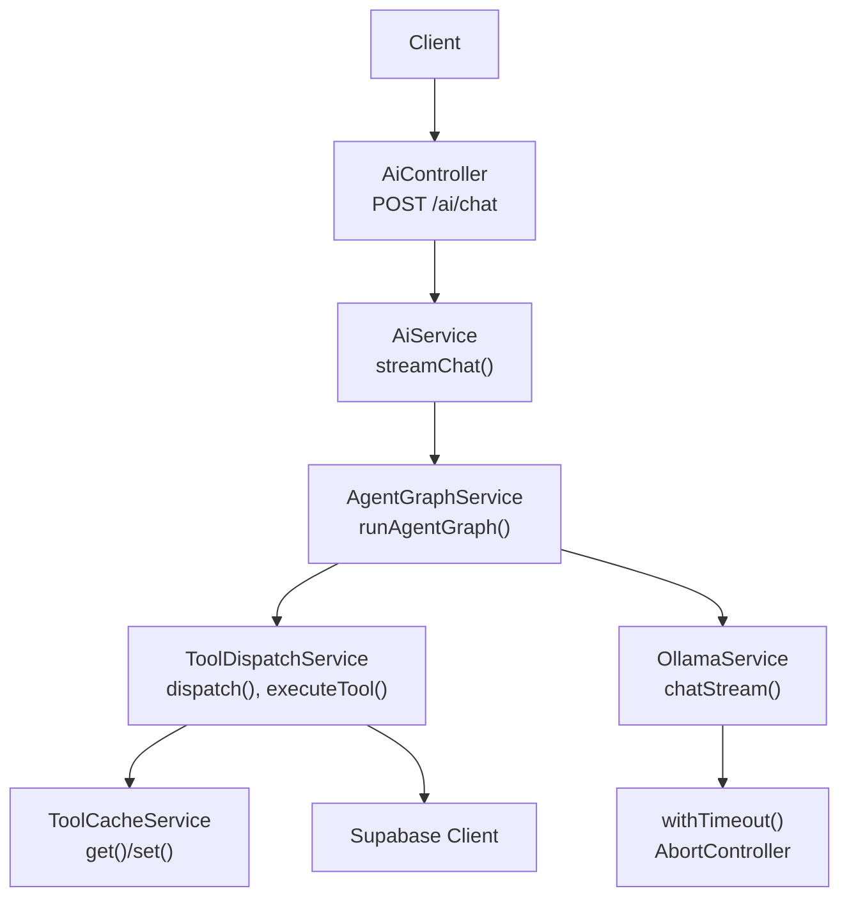
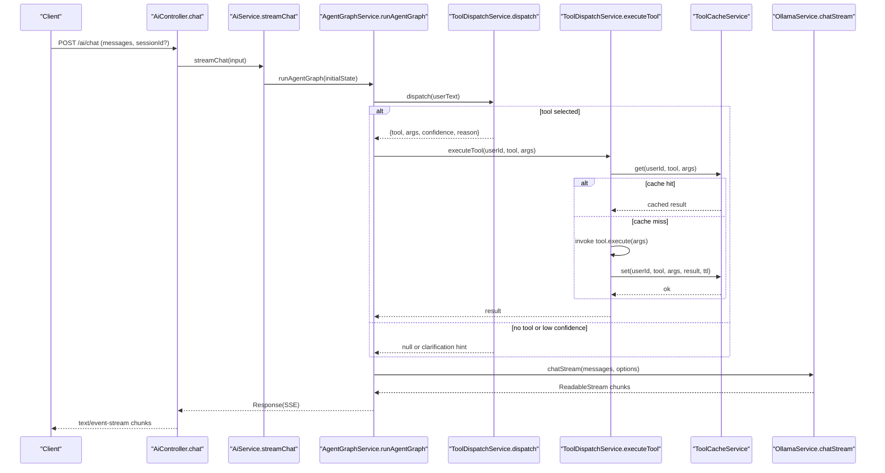
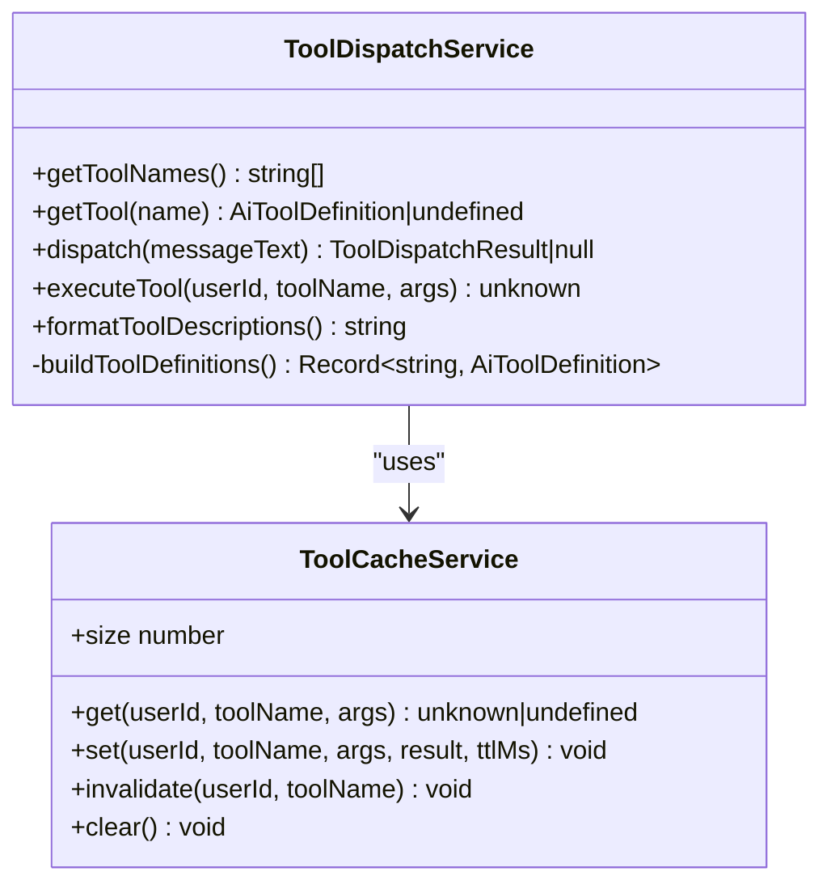
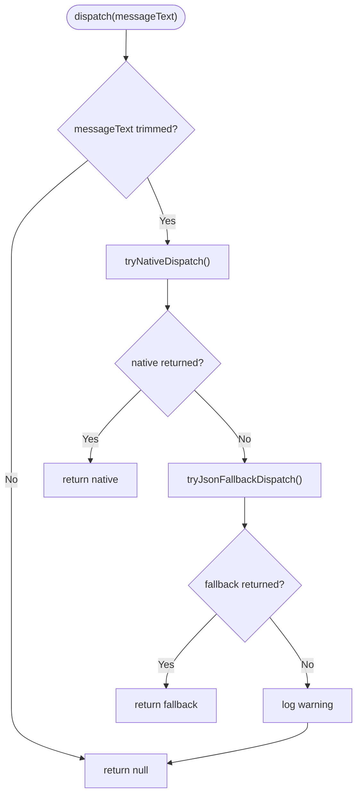
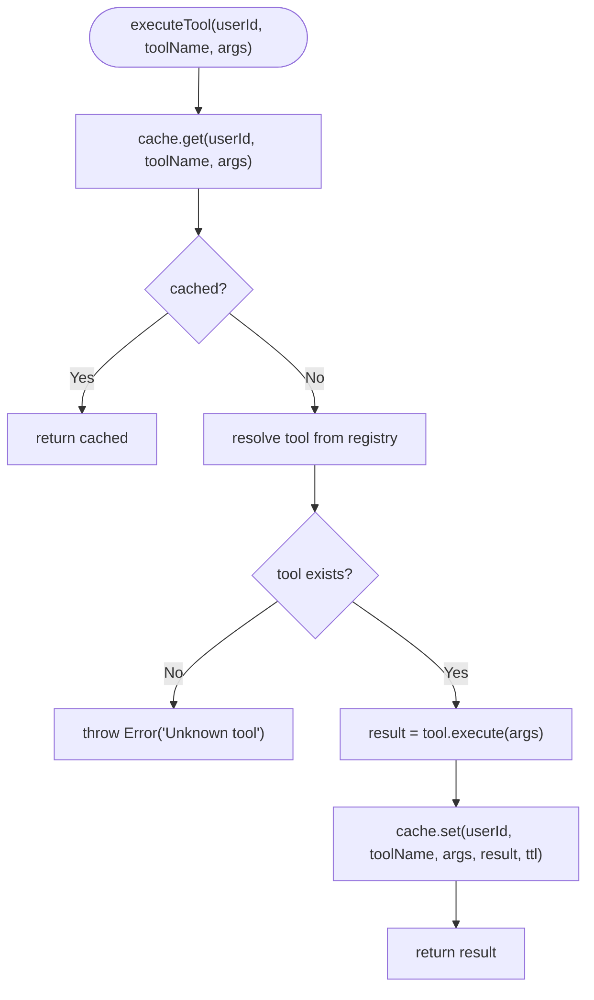
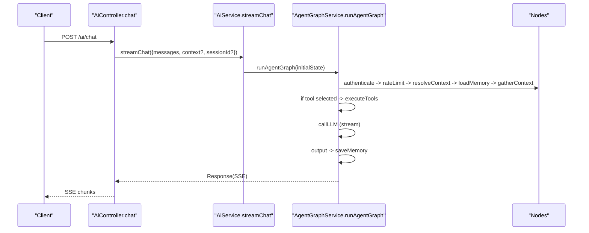
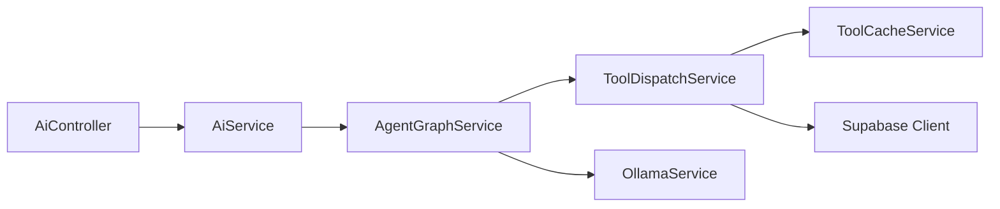

# Tool Dispatch & Execution Pipeline

<cite>
**Referenced Files in This Document**
- [ai.controller.ts](file://apps/api/src/ai/ai.controller.ts)
- [ai.service.ts](file://apps/api/src/ai/ai.service.ts)
- [agent-graph.service.ts](file://apps/api/src/ai/agent-graph/agent-graph.service.ts)
- [tool-dispatch.service.ts](file://apps/api/src/ai/tools/tool-dispatch.service.ts)
- [tool-cache.service.ts](file://apps/api/src/ai/tools/tool-cache.service.ts)
- [ollama.service.ts](file://apps/api/src/ai/ollama/ollama.service.ts)
- [tools.ts](file://apps/portal/lib/tools.ts)
</cite>

## Table of Contents

1. Introduction
2. Project Structure
3. Core Components
4. Architecture Overview
5. Detailed Component Analysis
6. Dependency Analysis
7. Performance Considerations
8. Troubleshooting Guide
9. Conclusion

## Introduction

This document explains the tool dispatch and execution pipeline used by the AI assistant chat flow. It covers how tools are registered, discovered, selected, executed, cached, and integrated with the chat API endpoints. It also details error handling, timeout management, resource cleanup, debugging strategies, and performance optimization including concurrent execution patterns.

## Project Structure

The tooling is implemented primarily in the API application under apps/api/src/ai. The key modules are:

- Controller layer for HTTP endpoints (chat streaming)
- Service orchestration for the agent graph
- Tool dispatch service that selects and executes tools
- In-memory cache for tool results
- Ollama integration for LLM calls and timeouts

**Diagram sources**

- [ai.controller.ts:1-82](file://apps/api/src/ai/ai.controller.ts#L1-L82)
- [ai.service.ts:1-130](file://apps/api/src/ai/ai.service.ts#L1-L130)
- [agent-graph.service.ts:1-316](file://apps/api/src/ai/agent-graph/agent-graph.service.ts#L1-L316)
- [tool-dispatch.service.ts:1-267](file://apps/api/src/ai/tools/tool-dispatch.service.ts#L1-L267)
- [tool-cache.service.ts:1-69](file://apps/api/src/ai/tools/tool-cache.service.ts#L1-L69)
- [ollama.service.ts:139-160](file://apps/api/src/ai/ollama/ollama.service.ts#L139-L160)

**Section sources**

- [ai.controller.ts:1-82](file://apps/api/src/ai/ai.controller.ts#L1-L82)
- [ai.service.ts:1-130](file://apps/api/src/ai/ai.service.ts#L1-L130)
- [agent-graph.service.ts:1-316](file://apps/api/src/ai/agent-graph/agent-graph.service.ts#L1-L316)
- [tool-dispatch.service.ts:1-267](file://apps/api/src/ai/tools/tool-dispatch.service.ts#L1-L267)
- [tool-cache.service.ts:1-69](file://apps/api/src/ai/tools/tool-cache.service.ts#L1-L69)
- [ollama.service.ts:139-160](file://apps/api/src/ai/ollama/ollama.service.ts#L139-L160)

## Core Components

- AiController: Accepts chat requests, validates input, sets SSE headers, and streams tokens to the client.
- AiService: Builds messages and delegates streaming to Ollama; used by legacy flows.
- AgentGraphService: Orchestrates the conversation graph (authenticate, rate limit, memory, context gathering, tool selection, execution, LLM call, output, save).
- ToolDispatchService: Registers built-in tools, selects a tool via LLM-based dispatch, executes tools, and caches results.
- ToolCacheService: In-memory LRU-style cache keyed by user, tool name, and serialized arguments with TTL.
- OllamaService: Provides chat and streaming chat; includes request-level timeout using AbortController.

Key responsibilities:

- Tool registration: Centralized in ToolDispatchService.buildToolDefinitions().
- Tool discovery: getToolNames() and getTool(name) expose registry entries.
- Tool selection: LLM-driven dispatch returns { tool, args, confidence, reason }.
- Tool execution: executeTool(userId, toolName, args) with caching and per-tool rate limiting at the graph level.
- Streaming response: SSE from controller through agent graph to Ollama stream.

**Section sources**

- [ai.controller.ts:1-82](file://apps/api/src/ai/ai.controller.ts#L1-L82)
- [agent-graph.service.ts:1-316](file://apps/api/src/ai/agent-graph/agent-graph.service.ts#L1-L316)
- [tool-dispatch.service.ts:1-267](file://apps/api/src/ai/tools/tool-dispatch.service.ts#L1-L267)
- [tool-cache.service.ts:1-69](file://apps/api/src/ai/tools/tool-cache.service.ts#L1-L69)
- [ollama.service.ts:139-160](file://apps/api/src/ai/ollama/ollama.service.ts#L139-L160)

## Architecture Overview

The end-to-end flow from chat request to tool execution and back to streaming response:

**Diagram sources**

- [ai.controller.ts:13-47](file://apps/api/src/ai/ai.controller.ts#L13-L47)
- [ai.service.ts:48-54](file://apps/api/src/ai/ai.service.ts#L48-L54)
- [agent-graph.service.ts:26-77](file://apps/api/src/ai/agent-graph/agent-graph.service.ts#L26-L77)
- [agent-graph.service.ts:152-206](file://apps/api/src/ai/agent-graph/agent-graph.service.ts#L152-L206)
- [tool-dispatch.service.ts:43-76](file://apps/api/src/ai/tools/tool-dispatch.service.ts#L43-L76)
- [tool-cache.service.ts:15-47](file://apps/api/src/ai/tools/tool-cache.service.ts#L15-L47)
- [ollama.service.ts:139-160](file://apps/api/src/ai/ollama/ollama.service.ts#L139-L160)

## Detailed Component Analysis

### Tool Registration and Discovery

- Built-in tools are defined centrally in ToolDispatchService.buildToolDefinitions(). Each tool has:
  - description: human-readable purpose
  - inputSchema: Zod schema describing parameters
  - execute: async function performing the operation (e.g., database queries)
- Registry accessors:
  - getToolNames(): list all available tool names
  - getTool(name): retrieve a specific tool definition
- Tool descriptions can be formatted for prompts via formatToolDescriptions().

**Diagram sources**

- [tool-dispatch.service.ts:22-85](file://apps/api/src/ai/tools/tool-dispatch.service.ts#L22-L85)
- [tool-cache.service.ts:11-69](file://apps/api/src/ai/tools/tool-cache.service.ts#L11-L69)

**Section sources**

- [tool-dispatch.service.ts:22-85](file://apps/api/src/ai/tools/tool-dispatch.service.ts#L22-L85)
- [tool-cache.service.ts:11-69](file://apps/api/src/ai/tools/tool-cache.service.ts#L11-L69)

### Tool Selection (Dispatch) Flow

- Input: latest user message text
- Native dispatch:
  - Constructs function definitions from tool schemas
  - Calls LLM with system prompt and user text
  - Parses JSON-like response to extract { tool, args, confidence, reason }
  - Validates requested tool exists in registry
- Fallback dispatch:
  - Similar to native but without function definitions; parses raw JSON
- If both fail, logs warning and returns null (no tool selection)

**Diagram sources**

- [tool-dispatch.service.ts:43-54](file://apps/api/src/ai/tools/tool-dispatch.service.ts#L43-L54)
- [tool-dispatch.service.ts:182-233](file://apps/api/src/ai/tools/tool-dispatch.service.ts#L182-L233)
- [tool-dispatch.service.ts:235-265](file://apps/api/src/ai/tools/tool-dispatch.service.ts#L235-L265)

**Section sources**

- [tool-dispatch.service.ts:43-54](file://apps/api/src/ai/tools/tool-dispatch.service.ts#L43-L54)
- [tool-dispatch.service.ts:182-233](file://apps/api/src/ai/tools/tool-dispatch.service.ts#L182-L233)
- [tool-dispatch.service.ts:235-265](file://apps/api/src/ai/tools/tool-dispatch.service.ts#L235-L265)

### Tool Execution and Caching

- Per-request execution path:
  - Check cache via ToolCacheService.get(userId, toolName, args)
  - If miss, resolve tool from registry and invoke execute(args)
  - Store result with tool-specific TTL via ToolCacheService.set(...)
- Rate limiting:
  - Per-tool rate limit check occurs in AgentGraphService.executeToolsNode before calling executeTool
- Error handling:
  - Unknown tool throws an error
  - Tool execution errors are logged and skipped; results array still populated with error markers

**Diagram sources**

- [tool-dispatch.service.ts:56-76](file://apps/api/src/ai/tools/tool-dispatch.service.ts#L56-L76)
- [tool-cache.service.ts:15-47](file://apps/api/src/ai/tools/tool-cache.service.ts#L15-L47)

**Section sources**

- [tool-dispatch.service.ts:56-76](file://apps/api/src/ai/tools/tool-dispatch.service.ts#L56-L76)
- [tool-cache.service.ts:15-47](file://apps/api/src/ai/tools/tool-cache.service.ts#L15-L47)

### Integration with Chat API Endpoints

- AiController.chat:
  - Validates request body
  - Generates or accepts sessionId
  - Streams tokens via SSE to client
- AiService.streamChat:
  - Builds messages with system prompt and filters roles
  - Delegates streaming to OllamaService.chatStream
- AgentGraphService.runAgentGraph:
  - Executes nodes: authenticate -> rateLimit -> resolveContext -> loadMemory -> gatherContext -> callLLM -> executeTools -> saveMemory -> output
  - Integrates tool selection and execution between gatherContext and callLLM

**Diagram sources**

- [ai.controller.ts:13-47](file://apps/api/src/ai/ai.controller.ts#L13-L47)
- [ai.service.ts:48-54](file://apps/api/src/ai/ai.service.ts#L48-L54)
- [agent-graph.service.ts:26-77](file://apps/api/src/ai/agent-graph/agent-graph.service.ts#L26-L77)
- [agent-graph.service.ts:152-206](file://apps/api/src/ai/agent-graph/agent-graph.service.ts#L152-L206)

**Section sources**

- [ai.controller.ts:13-47](file://apps/api/src/ai/ai.controller.ts#L13-L47)
- [ai.service.ts:48-54](file://apps/api/src/ai/ai.service.ts#L48-L54)
- [agent-graph.service.ts:26-77](file://apps/api/src/ai/agent-graph/agent-graph.service.ts#L26-L77)
- [agent-graph.service.ts:152-206](file://apps/api/src/ai/agent-graph/agent-graph.service.ts#L152-L206)

### Custom Tool Registration

To add a new tool:

- Define a new entry in ToolDispatchService.buildToolDefinitions():
  - Provide description, inputSchema (Zod), and execute implementation
- Ensure the tool’s execute handles errors gracefully and returns structured data
- Optionally adjust TTL in executeTool’s ttlMap for tool-specific caching duration

Example references:

- Built-in tool definitions and schema usage
- Tool execution and TTL mapping

**Section sources**

- [tool-dispatch.service.ts:87-180](file://apps/api/src/ai/tools/tool-dispatch.service.ts#L87-L180)
- [tool-dispatch.service.ts:66-76](file://apps/api/src/ai/tools/tool-dispatch.service.ts#L66-L76)

### Execution Context Management

- User identity and session:
  - userId and sessionId are passed into the agent graph state and used for memory storage and cost tracking
- Context accumulation:
  - Memory retrieval and tool results are appended to context for subsequent LLM calls
- Rate limiting:
  - Global chat rate limit and per-tool rate limits applied before execution

References:

- Agent graph state transitions and context updates
- Rate limiter checks in gatherContext and executeTools nodes

**Section sources**

- [agent-graph.service.ts:107-176](file://apps/api/src/ai/agent-graph/agent-graph.service.ts#L107-L176)
- [agent-graph.service.ts:178-206](file://apps/api/src/ai/agent-graph/agent-graph.service.ts#L178-L206)

### Debugging Tool Calls

- Logging points:
  - Tool dispatch warnings when both native and fallback fail
  - Tool execution failures logged with tool name
  - Node failures in agent graph logged with node name
- Observability tips:
  - Inspect dispatch return values (tool, args, confidence, reason)
  - Validate tool schemas and ensure required fields are present
  - Use cache size and invalidation to verify caching behavior

**Section sources**

- [tool-dispatch.service.ts:52-54](file://apps/api/src/ai/tools/tool-dispatch.service.ts#L52-L54)
- [agent-graph.service.ts:49-57](file://apps/api/src/ai/agent-graph/agent-graph.service.ts#L49-L57)
- [agent-graph.service.ts:196-198](file://apps/api/src/ai/agent-graph/agent-graph.service.ts#L196-L198)

### Portal Tools Integration

- The portal exposes productivity tools and external tool configurations:
  - getTools() fetches active tools from the database with fallback to constants
  - EXTERNAL_TOOLS provides n8n and Flowise URLs configurable via environment variables

This complements the backend tool dispatch by providing UI-facing tool listings and links.

**Section sources**

- [tools.ts:26-70](file://apps/portal/lib/tools.ts#L26-L70)
- [tools.ts:81-100](file://apps/portal/lib/tools.ts#L81-L100)

## Dependency Analysis

High-level dependencies among core components:

**Diagram sources**

- [ai.controller.ts:1-82](file://apps/api/src/ai/ai.controller.ts#L1-L82)
- [ai.service.ts:1-130](file://apps/api/src/ai/ai.service.ts#L1-L130)
- [agent-graph.service.ts:1-316](file://apps/api/src/ai/agent-graph/agent-graph.service.ts#L1-L316)
- [tool-dispatch.service.ts:1-267](file://apps/api/src/ai/tools/tool-dispatch.service.ts#L1-L267)
- [tool-cache.service.ts:1-69](file://apps/api/src/ai/tools/tool-cache.service.ts#L1-L69)
- [ollama.service.ts:139-160](file://apps/api/src/ai/ollama/ollama.service.ts#L139-L160)

**Section sources**

- [ai.controller.ts:1-82](file://apps/api/src/ai/ai.controller.ts#L1-L82)
- [ai.service.ts:1-130](file://apps/api/src/ai/ai.service.ts#L1-L130)
- [agent-graph.service.ts:1-316](file://apps/api/src/ai/agent-graph/agent-graph.service.ts#L1-L316)
- [tool-dispatch.service.ts:1-267](file://apps/api/src/ai/tools/tool-dispatch.service.ts#L1-L267)
- [tool-cache.service.ts:1-69](file://apps/api/src/ai/tools/tool-cache.service.ts#L1-L69)
- [ollama.service.ts:139-160](file://apps/api/src/ai/ollama/ollama.service.ts#L139-L160)

## Performance Considerations

- Caching:
  - ToolCacheService uses an in-memory Map with LRU behavior and TTL to reduce repeated I/O
  - Tool-specific TTLs allow short-lived operational data to refresh frequently while avoiding stale responses
- Concurrency:
  - Tool execution currently runs sequentially within executeToolsNode; consider parallelization for independent tools guarded by rate limits
  - Memory retrieval uses Promise.all for concurrent reads
- Timeouts:
  - OllamaService.withTimeout wraps requests with AbortController to enforce deadlines and avoid hanging streams
- Rate Limiting:
  - Global chat rate limit and per-tool rate limit protect downstream services and prevent overload

Recommendations:

- Add concurrency control (e.g., bounded fan-out) for tool execution
- Introduce distributed cache for cross-process sharing if needed
- Instrument latency metrics around dispatch, executeTool, and LLM calls

[No sources needed since this section provides general guidance]

## Troubleshooting Guide

Common issues and resolutions:

- No tool selected:
  - Check dispatch logs for warnings about failed native/fallback parsing
  - Validate LLM response contains expected JSON structure
- Unknown tool error:
  - Ensure tool name matches registry keys exactly
- Rate limit exceeded:
  - Review per-tool rate limit thresholds and adjust if necessary
- Timeouts:
  - Verify OllamaService timeout configuration and network stability
- Cache misses/staleness:
  - Confirm TTL values and invalidate on write-heavy tools if needed

Operational checks:

- Inspect cache size and invalidation behavior
- Validate SSE headers and streaming integrity in the controller

**Section sources**

- [tool-dispatch.service.ts:52-54](file://apps/api/src/ai/tools/tool-dispatch.service.ts#L52-L54)
- [tool-dispatch.service.ts:61-63](file://apps/api/src/ai/tools/tool-dispatch.service.ts#L61-L63)
- [agent-graph.service.ts:186-198](file://apps/api/src/ai/agent-graph/agent-graph.service.ts#L186-L198)
- [ollama.service.ts:139-160](file://apps/api/src/ai/ollama/ollama.service.ts#L139-L160)
- [ai.controller.ts:29-46](file://apps/api/src/ai/ai.controller.ts#L29-L46)

## Conclusion

The tool dispatch and execution pipeline integrates LLM-driven intent detection with a centralized registry of tools, robust caching, and strict rate limiting. The agent graph orchestrates the full conversation lifecycle, ensuring reliable streaming responses and graceful error handling. By following the extension points and performance recommendations outlined here, teams can safely add custom tools and optimize throughput for high-concurrency environments.
