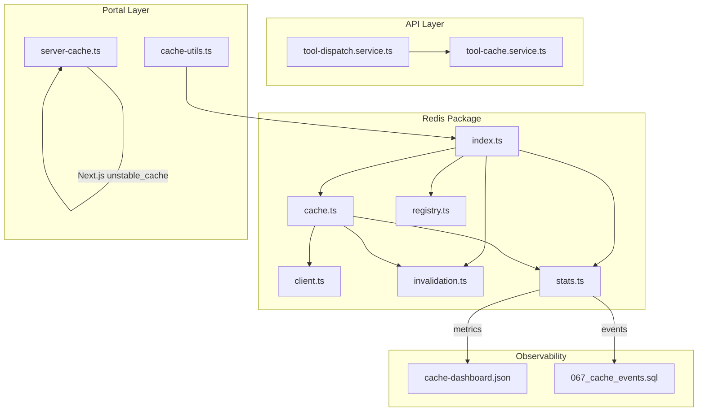
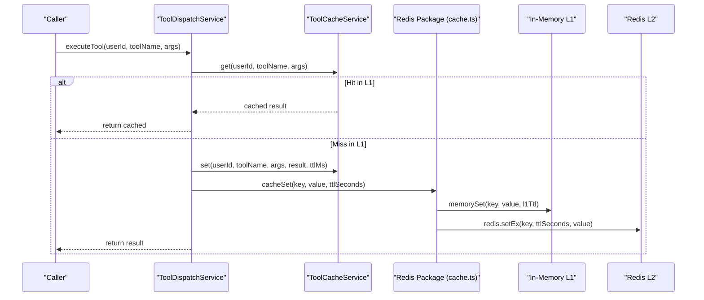
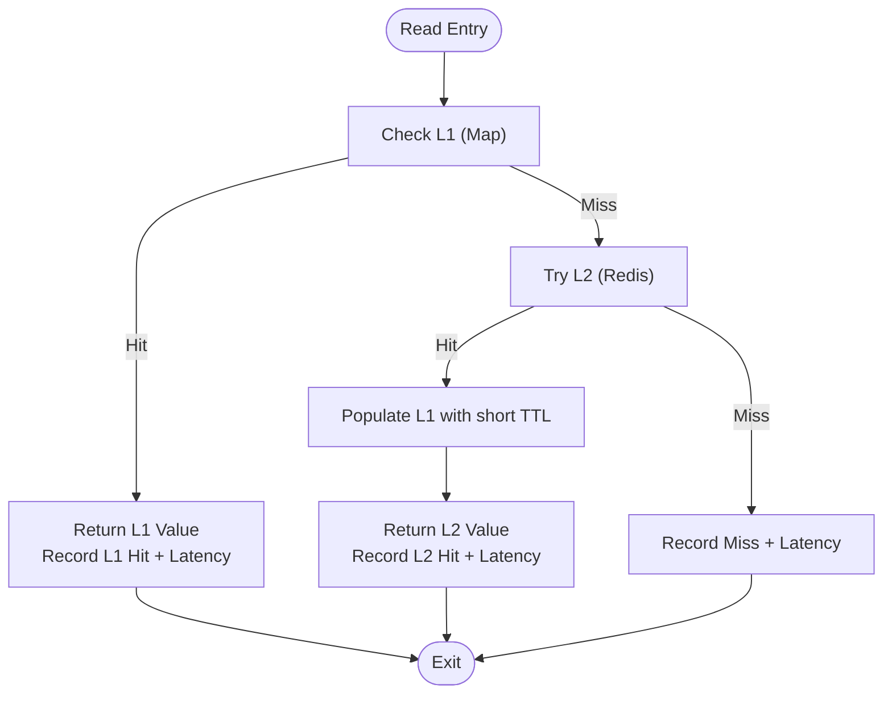
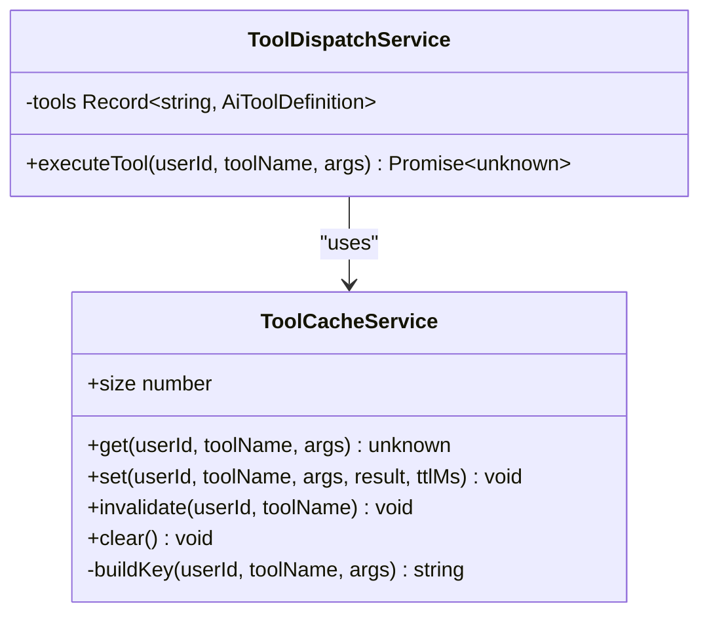
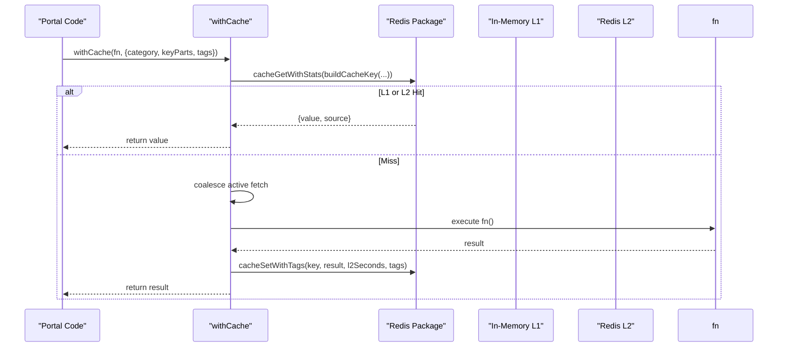
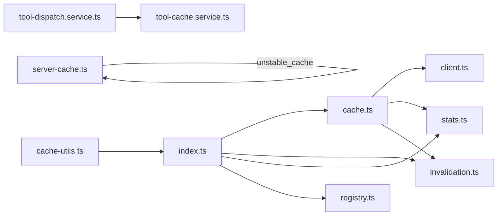

# Tool Result Caching

<cite>
**Referenced Files in This Document**
- [cache.ts](file://packages/redis/src/cache.ts)
- [invalidation.ts](file://packages/redis/src/invalidation.ts)
- [stats.ts](file://packages/redis/src/stats.ts)
- [client.ts](file://packages/redis/src/client.ts)
- [registry.ts](file://packages/redis/src/registry.ts)
- [index.ts](file://packages/redis/src/index.ts)
- [tool-cache.service.ts](file://apps/api/src/ai/tools/tool-cache.service.ts)
- [tool-dispatch.service.ts](file://apps/api/src/ai/tools/tool-dispatch.service.ts)
- [cache-utils.ts](file://apps/portal/lib/cache-utils.ts)
- [server-cache.ts](file://apps/portal/lib/server-cache.ts)
- [cache-dashboard.json](file://infra/observability/grafana-dashboards/cache-dashboard.json)
- [067_cache_events.sql](file://packages/database/migrations/067_cache_events.sql)
</cite>

## Table of Contents

1. [Introduction](#introduction)
2. [Project Structure](#project-structure)
3. [Core Components](#core-components)
4. [Architecture Overview](#architecture-overview)
5. [Detailed Component Analysis](#detailed-component-analysis)
6. [Dependency Analysis](#dependency-analysis)
7. [Performance Considerations](#performance-considerations)
8. [Troubleshooting Guide](#troubleshooting-guide)
9. [Conclusion](#conclusion)
10. [Appendices](#appendices)

## Introduction

This document explains the tool result caching system used across the application. It covers cache key generation strategies, TTL management, invalidation policies, storage backends (in-memory L1 and Redis L2), integration into the tool execution pipeline, configuration for different tool types, custom cache strategies, monitoring, troubleshooting, and consistency/freshness considerations.

## Project Structure

The caching system is implemented as a reusable package and integrated into both API tools and portal server-side code:

- packages/redis: Core caching library with L1/L2 layers, invalidation, stats, client, registry, and public exports.
- apps/api: AI tool execution path using an in-process cache service and per-tool TTLs.
- apps/portal: Server-side utilities that wrap data access with category-based TTLs and tags.
- infra/observability: Grafana dashboard definitions for cache telemetry.
- packages/database: Migration tables for cache observability events and anomalies.

**Diagram sources**

- [index.ts:1-28](file://packages/redis/src/index.ts#L1-L28)
- [cache.ts:1-269](file://packages/redis/src/cache.ts#L1-L269)
- [invalidation.ts:1-114](file://packages/redis/src/invalidation.ts#L1-L114)
- [stats.ts:1-169](file://packages/redis/src/stats.ts#L1-L169)
- [client.ts:1-67](file://packages/redis/src/client.ts#L1-L67)
- [registry.ts:1-34](file://packages/redis/src/registry.ts#L1-L34)
- [tool-cache.service.ts:1-69](file://apps/api/src/ai/tools/tool-cache.service.ts#L1-L69)
- [tool-dispatch.service.ts:1-267](file://apps/api/src/ai/tools/tool-dispatch.service.ts#L1-L267)
- [cache-utils.ts:1-79](file://apps/portal/lib/cache-utils.ts#L1-L79)
- [server-cache.ts:1-27](file://apps/portal/lib/server-cache.ts#L1-L27)
- [cache-dashboard.json:1-21](file://infra/observability/grafana-dashboards/cache-dashboard.json#L1-L21)
- [067_cache_events.sql:1-34](file://packages/database/migrations/067_cache_events.sql#L1-L34)

**Section sources**

- [index.ts:1-28](file://packages/redis/src/index.ts#L1-L28)
- [cache.ts:1-269](file://packages/redis/src/cache.ts#L1-L269)
- [invalidation.ts:1-114](file://packages/redis/src/invalidation.ts#L1-L114)
- [stats.ts:1-169](file://packages/redis/src/stats.ts#L1-L169)
- [client.ts:1-67](file://packages/redis/src/client.ts#L1-L67)
- [registry.ts:1-34](file://packages/redis/src/registry.ts#L1-L34)
- [tool-cache.service.ts:1-69](file://apps/api/src/ai/tools/tool-cache.service.ts#L1-L69)
- [tool-dispatch.service.ts:1-267](file://apps/api/src/ai/tools/tool-dispatch.service.ts#L1-L267)
- [cache-utils.ts:1-79](file://apps/portal/lib/cache-utils.ts#L1-L79)
- [server-cache.ts:1-27](file://apps/portal/lib/server-cache.ts#L1-L27)
- [cache-dashboard.json:1-21](file://infra/observability/grafana-dashboards/cache-dashboard.json#L1-L21)
- [067_cache_events.sql:1-34](file://packages/database/migrations/067_cache_events.sql#L1-L34)

## Core Components

- L1 In-Memory Cache: Fast local Map-backed cache with TTL and simple LRU eviction. Used to accelerate repeated reads within a process.
- L2 Redis Cache: Distributed cache with setEx for TTL and SCAN/SSCAN-based invalidation.
- Tag-Based Invalidation: Keys are associated with tags; invalidation uses SSCAN + UNLINK to avoid blocking.
- Prefix-Based Invalidation: SCAN-based deletion by prefix for safe bulk invalidation.
- Stats and Latency Tracking: Local counters and Redis-backed metrics with latency histograms.
- Registry and Key Builder: Centralized categories and TTL configurations plus deterministic key construction.
- API Tool Cache: Per-process Map cache for tool results with per-tool TTL mapping.
- Portal Cache Utilities: Category-driven wrapper with request coalescing and graceful degradation.
- Next.js RSC Cache: Integration with Next.js Data Cache via unstable_cache for server components.

**Section sources**

- [cache.ts:1-269](file://packages/redis/src/cache.ts#L1-L269)
- [invalidation.ts:1-114](file://packages/redis/src/invalidation.ts#L1-L114)
- [stats.ts:1-169](file://packages/redis/src/stats.ts#L1-L169)
- [registry.ts:1-34](file://packages/redis/src/registry.ts#L1-L34)
- [tool-cache.service.ts:1-69](file://apps/api/src/ai/tools/tool-cache.service.ts#L1-L69)
- [cache-utils.ts:1-79](file://apps/portal/lib/cache-utils.ts#L1-L79)
- [server-cache.ts:1-27](file://apps/portal/lib/server-cache.ts#L1-L27)

## Architecture Overview

The system implements a two-tier cache strategy:

- Reads: Check L1 first; if miss, check L2; on L2 hit, repopulate L1 with short TTL.
- Writes: Write-through to both L1 and L2.
- Invalidation: Tag-based and prefix-based operations use non-blocking Redis commands.
- Observability: Hits, misses, layer source, errors, and latency percentiles are recorded locally and persisted to Redis.

**Diagram sources**

- [tool-dispatch.service.ts:56-76](file://apps/api/src/ai/tools/tool-dispatch.service.ts#L56-L76)
- [tool-cache.service.ts:15-47](file://apps/api/src/ai/tools/tool-cache.service.ts#L15-L47)
- [cache.ts:156-174](file://packages/redis/src/cache.ts#L156-L174)

**Section sources**

- [cache.ts:75-174](file://packages/redis/src/cache.ts#L75-L174)
- [tool-dispatch.service.ts:56-76](file://apps/api/src/ai/tools/tool-dispatch.service.ts#L56-L76)
- [tool-cache.service.ts:15-47](file://apps/api/src/ai/tools/tool-cache.service.ts#L15-L47)

## Detailed Component Analysis

### Redis Package: Core Cache Layer

- L1 Memory Cache:
  - Capacity-limited Map with TTL expiration and simple LRU eviction by removing the oldest entry when full.
  - Short TTL cap for L1 writes to keep memory footprint lean.
- L2 Redis Cache:
  - Uses setEx for TTL control.
  - Graceful fallback when Redis is unavailable.
- Read Path:
  - Checks L1; if miss, checks L2; on L2 hit, populates L1 with short TTL.
  - Records hits/misses and latencies.
- Write Path:
  - Write-through to L1 and L2.
- Request Coalescing:
  - cacheWrap prevents thundering herd by deduplicating concurrent computations for the same key.
- Invalidation:
  - Tag indexing stores keys under sets per tag.
  - cacheInvalidateTags iterates via SSCAN and deletes via UNLINK.
  - cacheInvalidatePrefixes scans via SCAN and deletes via UNLINK.
- Stats:
  - Local counters and Redis-backed histogram of latencies.
  - Provides snapshot retrieval and reset.

**Diagram sources**

- [cache.ts:80-150](file://packages/redis/src/cache.ts#L80-L150)
- [stats.ts:59-104](file://packages/redis/src/stats.ts#L59-L104)

**Section sources**

- [cache.ts:1-269](file://packages/redis/src/cache.ts#L1-L269)
- [invalidation.ts:1-114](file://packages/redis/src/invalidation.ts#L1-L114)
- [stats.ts:1-169](file://packages/redis/src/stats.ts#L1-L169)
- [client.ts:1-67](file://packages/redis/src/client.ts#L1-L67)

### Redis Client and Connection Management

- Singleton client with reconnection handling.
- Prevents thundering herd during connection attempts.
- Resets state on error/end to allow retries.

**Section sources**

- [client.ts:1-67](file://packages/redis/src/client.ts#L1-L67)

### Registry: Categories, TTLs, and Key Building

- Defines categories (e.g., AUTH, METRICS, SHIFT, AI_MEMORY, DEPARTMENT, EQUIPMENT).
- Provides per-category TTL configuration for L1 and L2.
- Deterministic key builder with consistent prefixing.

**Section sources**

- [registry.ts:1-34](file://packages/redis/src/registry.ts#L1-L34)

### API Tool Execution Pipeline

- ToolCacheService:
  - In-process Map cache keyed by userId, toolName, and serialized arguments.
  - Default TTL and per-tool TTL map for machineStatus, fleetStatus, shiftLogs, delays.
  - Simple LRU eviction by dropping the oldest entry at capacity.
- ToolDispatchService:
  - Checks ToolCacheService before executing tool logic.
  - Applies per-tool TTLs when storing results.

**Diagram sources**

- [tool-cache.service.ts:1-69](file://apps/api/src/ai/tools/tool-cache.service.ts#L1-L69)
- [tool-dispatch.service.ts:56-76](file://apps/api/src/ai/tools/tool-dispatch.service.ts#L56-L76)

**Section sources**

- [tool-cache.service.ts:1-69](file://apps/api/src/ai/tools/tool-cache.service.ts#L1-L69)
- [tool-dispatch.service.ts:56-76](file://apps/api/src/ai/tools/tool-dispatch.service.ts#L56-L76)

### Portal Cache Utilities and RSC Integration

- withCache:
  - Builds keys via buildCacheKey(category, ...keyParts).
  - Looks up TTL from CACHE_TTL_REGISTRY.
  - On miss, executes function and caches with tags.
  - Implements request coalescing to prevent duplicate work.
  - Handles DatabaseError by not caching it; supports fallback to stale L1 on generic errors.
- cachedRSC:
  - Wraps Next.js unstable_cache for React Server Components with revalidate and tags support.

**Diagram sources**

- [cache-utils.ts:30-79](file://apps/portal/lib/cache-utils.ts#L30-L79)
- [cache.ts:119-150](file://packages/redis/src/cache.ts#L119-L150)
- [cache.ts:179-189](file://packages/redis/src/cache.ts#L179-L189)
- [registry.ts:18-34](file://packages/redis/src/registry.ts#L18-L34)

**Section sources**

- [cache-utils.ts:1-79](file://apps/portal/lib/cache-utils.ts#L1-L79)
- [server-cache.ts:1-27](file://apps/portal/lib/server-cache.ts#L1-L27)

## Dependency Analysis

- The core cache module depends on:
  - Redis client for persistence and invalidation.
  - Stats module for metrics collection.
  - Invalidation module for tag/prefix-based operations.
- API tool cache is independent of Redis and uses an in-process Map.
- Portal utilities depend on the Redis package and Next.js cache for RSC.

**Diagram sources**

- [index.ts:1-28](file://packages/redis/src/index.ts#L1-L28)
- [cache.ts:1-269](file://packages/redis/src/cache.ts#L1-L269)
- [invalidation.ts:1-114](file://packages/redis/src/invalidation.ts#L1-L114)
- [stats.ts:1-169](file://packages/redis/src/stats.ts#L1-L169)
- [client.ts:1-67](file://packages/redis/src/client.ts#L1-L67)
- [registry.ts:1-34](file://packages/redis/src/registry.ts#L1-L34)
- [tool-dispatch.service.ts:1-267](file://apps/api/src/ai/tools/tool-dispatch.service.ts#L1-L267)
- [tool-cache.service.ts:1-69](file://apps/api/src/ai/tools/tool-cache.service.ts#L1-L69)
- [cache-utils.ts:1-79](file://apps/portal/lib/cache-utils.ts#L1-L79)
- [server-cache.ts:1-27](file://apps/portal/lib/server-cache.ts#L1-L27)

**Section sources**

- [index.ts:1-28](file://packages/redis/src/index.ts#L1-L28)
- [cache.ts:1-269](file://packages/redis/src/cache.ts#L1-L269)
- [invalidation.ts:1-114](file://packages/redis/src/invalidation.ts#L1-L114)
- [stats.ts:1-169](file://packages/redis/src/stats.ts#L1-L169)
- [client.ts:1-67](file://packages/redis/src/client.ts#L1-L67)
- [registry.ts:1-34](file://packages/redis/src/registry.ts#L1-L34)
- [tool-dispatch.service.ts:1-267](file://apps/api/src/ai/tools/tool-dispatch.service.ts#L1-L267)
- [tool-cache.service.ts:1-69](file://apps/api/src/ai/tools/tool-cache.service.ts#L1-L69)
- [cache-utils.ts:1-79](file://apps/portal/lib/cache-utils.ts#L1-L79)
- [server-cache.ts:1-27](file://apps/portal/lib/server-cache.ts#L1-L27)

## Performance Considerations

- Two-tier design reduces remote calls by serving hot paths from L1.
- L1 TTL cap limits memory growth while still accelerating near-term reads.
- Non-blocking invalidation (SSCAN/SCAN + UNLINK) avoids Redis contention.
- Request coalescing prevents thundering herds on cache misses.
- Stats include p95 latency and per-layer hit counts for tuning.

[No sources needed since this section provides general guidance]

## Troubleshooting Guide

Common issues and remedies:

- Redis Unreachable:
  - Reads degrade gracefully; L1 may still serve recent values.
  - Errors are recorded; monitor redisErrors metric.
- Stale Data After Invalidation:
  - Ensure tag-based invalidation is invoked after writes.
  - For L1-only scenarios, evict by prefix where appropriate.
- High Miss Rate:
  - Review TTL settings per category and adjust based on data volatility.
  - Verify key construction consistency across callers.
- Latency Spikes:
  - Inspect p95 latency and Redis error rates.
  - Validate network connectivity and Redis cluster health.

Operational references:

- Metrics endpoints and dashboards:
  - Grafana dashboard queries for hits, misses, and latency heatmaps.
- Event tables for deeper analysis:
  - cache_events and cache_anomalies tables for raw event ingestion and anomaly detection.

**Section sources**

- [stats.ts:120-169](file://packages/redis/src/stats.ts#L120-L169)
- [cache-dashboard.json:1-21](file://infra/observability/grafana-dashboards/cache-dashboard.json#L1-L21)
- [067_cache_events.sql:1-34](file://packages/database/migrations/067_cache_events.sql#L1-L34)

## Conclusion

The tool result caching system combines fast in-memory caching with robust Redis-backed persistence, offering configurable TTLs, flexible invalidation, and comprehensive observability. By integrating into both API tool execution and portal server-side flows, it delivers measurable performance gains while maintaining data freshness through well-defined invalidation policies.

[No sources needed since this section summarizes without analyzing specific files]

## Appendices

### Cache Key Generation Strategies

- Global key builder:
  - Uses category and parts to form deterministic keys with a stable prefix.
- API tool keys:
  - Composed of userId, toolName, and JSON-serialized arguments.

**Section sources**

- [registry.ts:27-34](file://packages/redis/src/registry.ts#L27-L34)
- [tool-cache.service.ts:65-67](file://apps/api/src/ai/tools/tool-cache.service.ts#L65-L67)

### TTL Management

- Registry-driven TTLs:
  - Per-category L1 and L2 seconds configured centrally.
- API tool-specific TTLs:
  - Per-tool TTL map applied when writing results.

**Section sources**

- [registry.ts:18-25](file://packages/redis/src/registry.ts#L18-L25)
- [tool-dispatch.service.ts:66-73](file://apps/api/src/ai/tools/tool-dispatch.service.ts#L66-L73)

### Cache Invalidation Policies

- Tag-based invalidation:
  - Associate keys with tags; invalidate all related keys efficiently.
- Prefix-based invalidation:
  - Safe bulk deletion by prefix using SCAN.

**Section sources**

- [invalidation.ts:17-72](file://packages/redis/src/invalidation.ts#L17-L72)
- [invalidation.ts:79-113](file://packages/redis/src/invalidation.ts#L79-L113)

### Storage Backends

- L1: In-process Map with TTL and simple LRU eviction.
- L2: Redis with setEx for TTL and SCAN/SSCAN for invalidation.

**Section sources**

- [cache.ts:12-56](file://packages/redis/src/cache.ts#L12-L56)
- [cache.ts:156-174](file://packages/redis/src/cache.ts#L156-L174)

### Integration Into Tool Execution Pipeline

- API:
  - ToolDispatchService checks ToolCacheService before executing tool logic and applies per-tool TTLs.
- Portal:
  - withCache wraps data access with category-based TTLs and optional tags.
  - cachedRSC integrates with Next.js Data Cache for server components.

**Section sources**

- [tool-dispatch.service.ts:56-76](file://apps/api/src/ai/tools/tool-dispatch.service.ts#L56-L76)
- [cache-utils.ts:30-79](file://apps/portal/lib/cache-utils.ts#L30-L79)
- [server-cache.ts:12-26](file://apps/portal/lib/server-cache.ts#L12-L26)

### Configuring Cache Behavior for Different Tool Types

- Use registry categories to define TTLs for portal data access patterns.
- Define per-tool TTL maps in the API dispatch service for fine-grained control.

**Section sources**

- [registry.ts:18-25](file://packages/redis/src/registry.ts#L18-L25)
- [tool-dispatch.service.ts:66-73](file://apps/api/src/ai/tools/tool-dispatch.service.ts#L66-L73)

### Implementing Custom Cache Strategies

- Extend registry with new categories and TTLs.
- Build keys deterministically using the provided builder.
- Wrap functions with cacheWrap or withCache for coalesced execution.
- Apply tag-based invalidation after mutations.

**Section sources**

- [registry.ts:1-34](file://packages/redis/src/registry.ts#L1-L34)
- [cache.ts:198-220](file://packages/redis/src/cache.ts#L198-L220)
- [cache-utils.ts:30-79](file://apps/portal/lib/cache-utils.ts#L30-L79)
- [invalidation.ts:40-72](file://packages/redis/src/invalidation.ts#L40-L72)

### Monitoring Cache Performance

- Metrics:
  - Hits, misses, per-layer hits, redisErrors, avg and p95 latency.
- Dashboards:
  - Grafana panels for hits vs misses and latency heatmaps.
- Events:
  - Raw cache events and anomaly tables for deeper analysis.

**Section sources**

- [stats.ts:120-169](file://packages/redis/src/stats.ts#L120-L169)
- [cache-dashboard.json:1-21](file://infra/observability/grafana-dashboards/cache-dashboard.json#L1-L21)
- [067_cache_events.sql:1-34](file://packages/database/migrations/067_cache_events.sql#L1-L34)

### Consistency and Data Freshness

- TTLs ensure eventual staleness; choose shorter L1/L2 TTLs for high-frequency updates.
- Tag-based invalidation guarantees prompt removal of related entries post-mutation.
- Fallback behavior in portal utilities returns stale L1 values when Redis is unreachable.

**Section sources**

- [cache-utils.ts:66-77](file://apps/portal/lib/cache-utils.ts#L66-L77)
- [invalidation.ts:40-72](file://packages/redis/src/invalidation.ts#L40-L72)
- [registry.ts:18-25](file://packages/redis/src/registry.ts#L18-L25)
