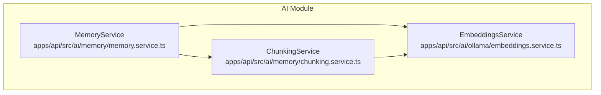
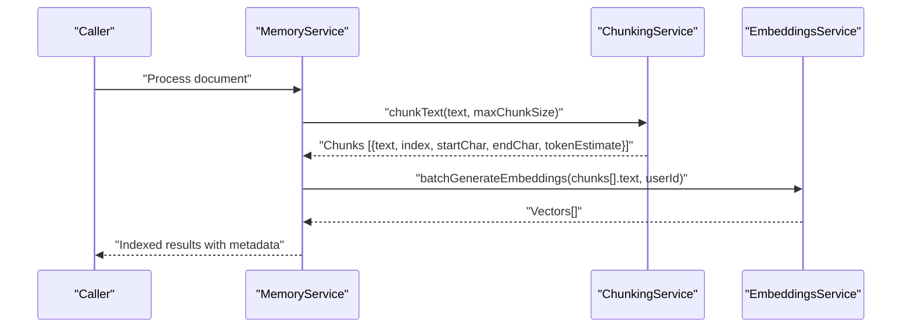
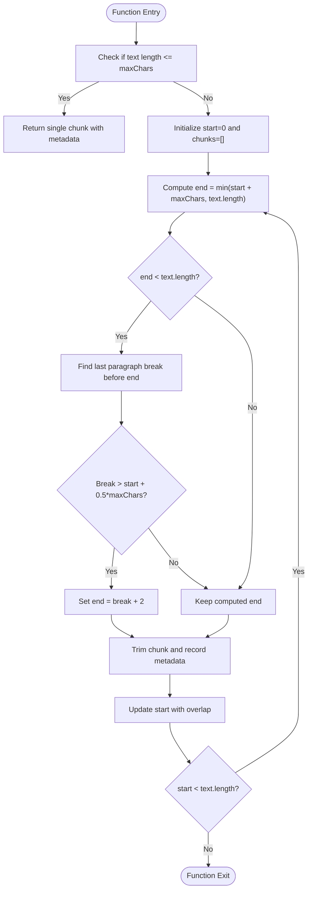
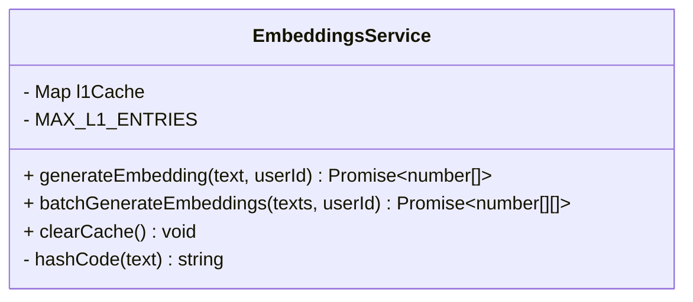

# Document Chunking & Text Processing

<cite>
**Referenced Files in This Document**
- [chunking.service.ts](file://apps/api/src/ai/memory/chunking.service.ts)
- [embeddings.service.ts](file://apps/api/src/ai/ollama/embeddings.service.ts)
- [memory.service.ts](file://apps/api/src/ai/memory/memory.service.ts)
</cite>

## Table of Contents

1. [Introduction](#introduction)
2. [Project Structure](#project-structure)
3. [Core Components](#core-components)
4. [Architecture Overview](#architecture-overview)
5. [Detailed Component Analysis](#detailed-component-analysis)
6. [Dependency Analysis](#dependency-analysis)
7. [Performance Considerations](#performance-considerations)
8. [Troubleshooting Guide](#troubleshooting-guide)
9. [Conclusion](#conclusion)

## Introduction

This document explains the document chunking and text processing system used to prepare content for embedding generation. It covers:

- The chunking algorithm implemented for splitting large documents into manageable segments
- Text segmentation strategies, including paragraph-aware boundaries
- Overlap handling between chunks to preserve context continuity
- Metadata preservation via character offsets and token estimates
- Integration with the embedding pipeline and caching strategy
- Performance considerations, memory management, and guidance on optimal chunk sizes
- Configuration options and extension points for customizing behavior

The goal is to provide both a high-level understanding and code-level details so that developers can configure, extend, and troubleshoot the system effectively.

## Project Structure

The chunking and embedding functionality resides under the API application’s AI module:

- apps/api/src/ai/memory/chunking.service.ts implements the core chunking logic
- apps/api/src/ai/ollama/embeddings.service.ts provides embedding generation with an L1 cache
- apps/api/src/ai/memory/memory.service.ts orchestrates higher-level memory operations (integration point)

**Diagram sources**

- [chunking.service.ts:1-60](file://apps/api/src/ai/memory/chunking.service.ts#L1-L60)
- [embeddings.service.ts:1-79](file://apps/api/src/ai/ollama/embeddings.service.ts#L1-L79)
- [memory.service.ts](file://apps/api/src/ai/memory/memory.service.ts)

**Section sources**

- [chunking.service.ts:1-60](file://apps/api/src/ai/memory/chunking.service.ts#L1-L60)
- [embeddings.service.ts:1-79](file://apps/api/src/ai/ollama/embeddings.service.ts#L1-L79)
- [memory.service.ts](file://apps/api/src/ai/memory/memory.service.ts)

## Core Components

- ChunkingService
  - Splits input text into fixed-size chunks with paragraph-aware boundary adjustment
  - Preserves metadata: index, startChar, endChar, and tokenEstimate per chunk
  - Applies overlap between consecutive chunks to maintain context continuity
- EmbeddingsService
  - Generates embeddings using a local model via Ollama
  - Implements an in-process L1 cache keyed by userId and text hash
  - Supports single and batch embedding generation with cache-first retrieval

Key behaviors:

- Paragraph-aware segmentation improves semantic coherence across chunk boundaries
- Overlap ensures that information near chunk edges is not lost
- Token estimation uses a simple heuristic based on characters per token
- Embedding cache reduces redundant calls and improves throughput

**Section sources**

- [chunking.service.ts:1-60](file://apps/api/src/ai/memory/chunking.service.ts#L1-L60)
- [embeddings.service.ts:1-79](file://apps/api/src/ai/ollama/embeddings.service.ts#L1-L79)

## Architecture Overview

The chunking-to-embedding flow integrates three components:

- MemoryService orchestrates the workflow
- ChunkingService prepares text segments
- EmbeddingsService produces vectors with caching

**Diagram sources**

- [chunking.service.ts:17-54](file://apps/api/src/ai/memory/chunking.service.ts#L17-L54)
- [embeddings.service.ts:30-64](file://apps/api/src/ai/ollama/embeddings.service.ts#L30-L64)
- [memory.service.ts](file://apps/api/src/ai/memory/memory.service.ts)

## Detailed Component Analysis

### ChunkingService

Responsibilities:

- Fixed-size chunking with configurable maximum tokens
- Paragraph-aware boundary detection to improve semantic integrity
- Overlap insertion to reduce boundary effects
- Metadata attachment for traceability and downstream indexing

Algorithm overview:

- Convert token-based size to character-based size using a constant ratio
- If the entire text fits within the limit, return it as a single chunk
- Otherwise, iterate through the text:
  - Compute initial end position based on maxChars
  - Attempt to adjust end to a nearby paragraph break if available and within a reasonable range
  - Trim whitespace and record chunk metadata (index, startChar, endChar, tokenEstimate)
  - Advance start position with overlap applied; ensure progress when overlap would stall

Complexity:

- Time complexity: O(n) where n is the number of characters in the input text
- Space complexity: O(n) for storing chunks and their metadata

Configuration:

- Default maximum chunk size in tokens
- Default overlap in tokens
- Character-to-token conversion factor

Use cases:

- General-purpose text documents (articles, reports)
- Technical documentation with clear paragraph structure
- Any corpus where preserving some context across boundaries is important

Limitations:

- No semantic segmentation beyond paragraph breaks
- Token estimation is approximate and may vary from actual tokenizer counts

Extension points:

- Replace or augment paragraph boundary detection with sentence or heading-aware logic
- Integrate a real tokenizer for accurate token counting
- Add hierarchical chunking by first splitting on headings then applying paragraph-aware chunking within sections

**Diagram sources**

- [chunking.service.ts:17-54](file://apps/api/src/ai/memory/chunking.service.ts#L17-L54)

**Section sources**

- [chunking.service.ts:1-60](file://apps/api/src/ai/memory/chunking.service.ts#L1-L60)

### EmbeddingsService

Responsibilities:

- Generate embeddings for single texts or batches
- Cache results in-memory keyed by userId and text hash
- Provide methods to clear cache and manage memory

Caching strategy:

- L1 cache stores up to a fixed number of entries
- On cache miss, call the underlying Ollama service to generate embeddings
- Batch method pre-checks cache and only requests missing items
- Hash function derives a stable key from text content

Integration:

- Consumed by higher-level services to produce vectors for indexed chunks
- Suitable for local deployment with minimal external dependencies

**Diagram sources**

- [embeddings.service.ts:1-79](file://apps/api/src/ai/ollama/embeddings.service.ts#L1-L79)

**Section sources**

- [embeddings.service.ts:1-79](file://apps/api/src/ai/ollama/embeddings.service.ts#L1-L79)

### MemoryService

Responsibilities:

- Orchestrate chunking and embedding workflows
- Combine chunk metadata with generated vectors for downstream storage or search
- Expose higher-level APIs for ingestion and retrieval

Integration pattern:

- Calls ChunkingService to split documents
- Uses EmbeddingsService to vectorize chunks
- Returns structured results suitable for persistence or querying

Note: This section describes integration patterns without analyzing specific implementation lines.

**Section sources**

- [memory.service.ts](file://apps/api/src/ai/memory/memory.service.ts)

## Dependency Analysis

- ChunkingService depends only on built-in JavaScript features and constants
- EmbeddingsService depends on an Ollama client for embedding generation
- MemoryService coordinates both services and likely persists results elsewhere

**Diagram sources**

- [chunking.service.ts:1-60](file://apps/api/src/ai/memory/chunking.service.ts#L1-L60)
- [embeddings.service.ts:1-79](file://apps/api/src/ai/ollama/embeddings.service.ts#L1-L79)
- [memory.service.ts](file://apps/api/src/ai/memory/memory.service.ts)

**Section sources**

- [chunking.service.ts:1-60](file://apps/api/src/ai/memory/chunking.service.ts#L1-L60)
- [embeddings.service.ts:1-79](file://apps/api/src/ai/ollama/embeddings.service.ts#L1-L79)
- [memory.service.ts](file://apps/api/src/ai/memory/memory.service.ts)

## Performance Considerations

- Chunk size selection
  - Larger chunks reduce the number of embedding calls but risk exceeding model limits and diluting relevance
  - Smaller chunks increase overhead and may fragment context
  - Current defaults use a token-based limit with paragraph-aware adjustments
- Overlap tuning
  - Overlap helps preserve cross-boundary semantics at the cost of additional embeddings
  - Balance overlap against memory and compute constraints
- Caching effectiveness
  - In-process L1 cache significantly reduces repeated work for identical inputs
  - Ensure cache size aligns with expected working set and memory budget
- Token estimation accuracy
  - Heuristic estimation is fast but approximate; consider integrating a real tokenizer for precise accounting
- Batch processing
  - Prefer batch embedding calls to amortize network and model invocation costs
- Memory management
  - Monitor L1 cache growth and periodically clear if necessary
  - Stream or process large documents in segments to avoid excessive memory usage

[No sources needed since this section provides general guidance]

## Troubleshooting Guide

Common issues and resolutions:

- Empty or malformed chunks
  - Verify paragraph break detection logic and ensure input text contains meaningful separators
  - Confirm trimming does not remove all content due to whitespace-only segments
- Excessive memory usage
  - Reduce chunk size or overlap
  - Clear the embedding cache when appropriate
- Slow ingestion
  - Increase batch size for embeddings
  - Warm the L1 cache with frequently accessed content
- Incorrect token accounting
  - Replace heuristic token estimation with a proper tokenizer aligned with the embedding model

Operational tips:

- Log chunk counts and average sizes to monitor distribution
- Track cache hit rates to evaluate reuse effectiveness
- Measure end-to-end latency and throughput during ingestion

**Section sources**

- [chunking.service.ts:17-54](file://apps/api/src/ai/memory/chunking.service.ts#L17-L54)
- [embeddings.service.ts:30-64](file://apps/api/src/ai/ollama/embeddings.service.ts#L30-L64)

## Conclusion

The chunking and text processing system provides a pragmatic approach to preparing documents for embedding generation:

- Fixed-size chunking with paragraph-aware boundaries balances simplicity and semantic coherence
- Overlap preserves context continuity across chunk edges
- Metadata such as character offsets and token estimates supports traceability and downstream indexing
- An in-process L1 cache improves performance for repeated inputs
- The design is extensible to support more advanced segmentation strategies and accurate tokenization

For production deployments, consider:

- Integrating a robust tokenizer for precise token accounting
- Adding sentence or heading-aware segmentation for improved quality
- Implementing hierarchical chunking for long-form documents
- Monitoring and tuning chunk size and overlap based on workload characteristics

[No sources needed since this section summarizes without analyzing specific files]
