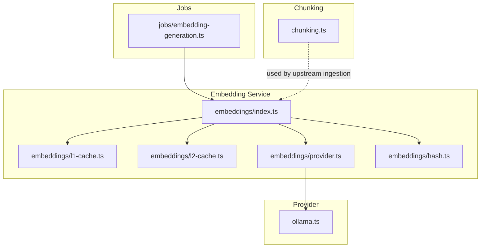
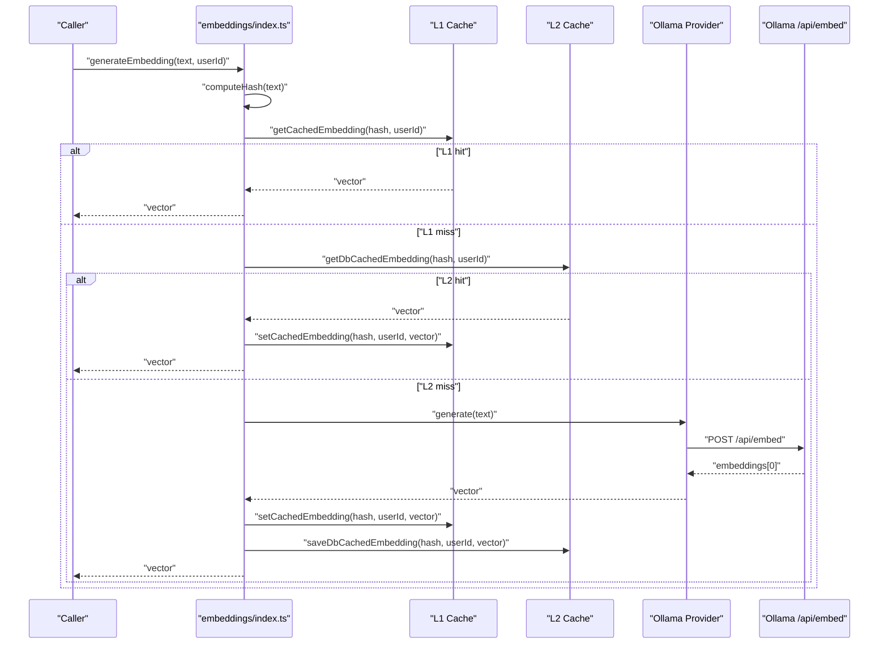
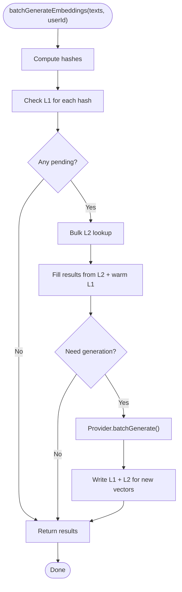
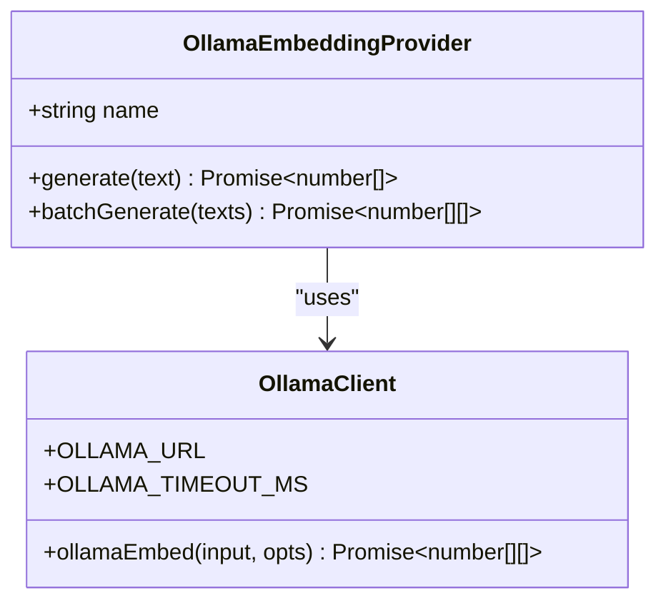
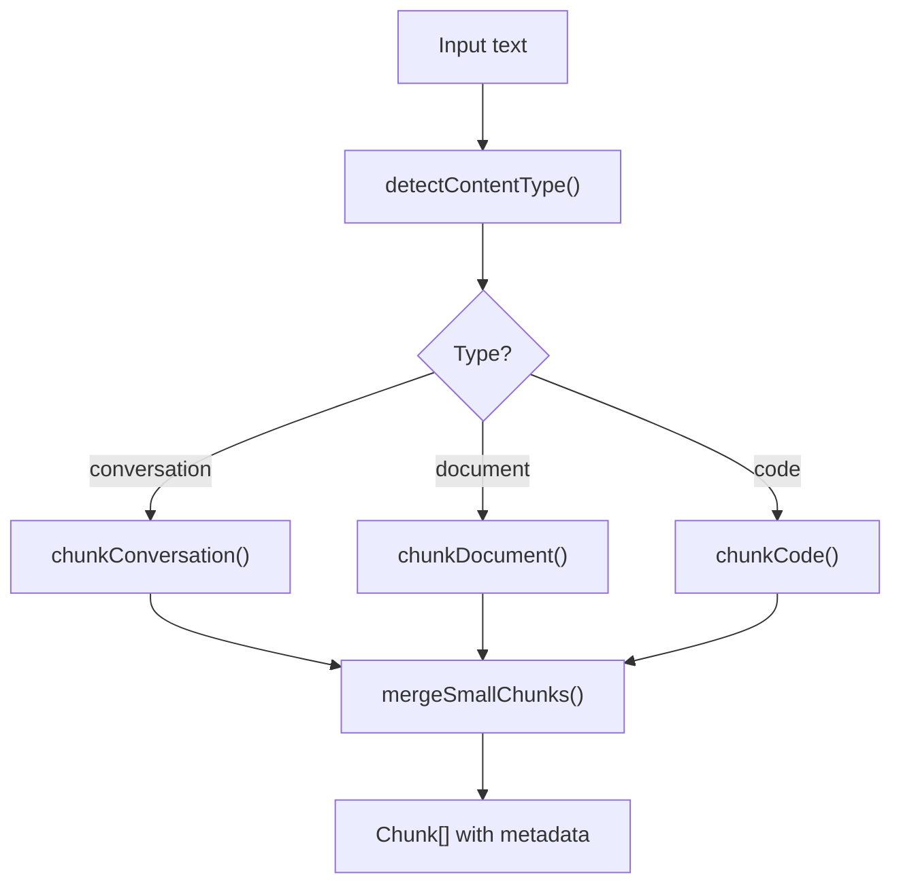
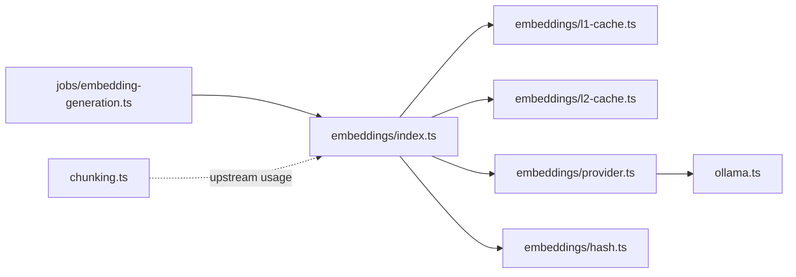

# Embedding Generation & Vector Search

<cite>
**Referenced Files in This Document**
- [index.ts](file://apps/portal/lib/ai/embeddings/index.ts)
- [l1-cache.ts](file://apps/portal/lib/ai/embeddings/l1-cache.ts)
- [l2-cache.ts](file://apps/portal/lib/ai/embeddings/l2-cache.ts)
- [provider.ts](file://apps/portal/lib/ai/embeddings/provider.ts)
- [hash.ts](file://apps/portal/lib/ai/embeddings/hash.ts)
- [ollama.ts](file://apps/portal/lib/ai/ollama.ts)
- [chunking.ts](file://apps/portal/lib/ai/chunking.ts)
- [embedding-generation.ts](file://apps/portal/lib/jobs/embedding-generation.ts)
</cite>

## Table of Contents

1. [Introduction](#introduction)
2. [Project Structure](#project-structure)
3. [Core Components](#core-components)
4. [Architecture Overview](#architecture-overview)
5. [Detailed Component Analysis](#detailed-component-analysis)
6. [Dependency Analysis](#dependency-analysis)
7. [Performance Considerations](#performance-considerations)
8. [Troubleshooting Guide](#troubleshooting-guide)
9. [Conclusion](#conclusion)
10. [Appendices](#appendices)

## Introduction

This document explains the embedding generation and vector search system used to index and retrieve semantic information across documents. It focuses on:

- Multi-level caching (L1 in-memory, L2 persistent) to reduce latency and API costs
- Chunking algorithms for robust text segmentation with metadata preservation
- Provider abstraction layer for embedding services with configuration and error handling
- Batch processing strategies and graceful degradation
- Practical examples for indexing and semantic search workflows
- Monitoring and quality considerations

The implementation is designed for high throughput and resilience, minimizing external calls while preserving accuracy through overlap-aware chunking and consistent hashing.

## Project Structure

The embedding subsystem lives under the portal application’s AI utilities and integrates with a background job pipeline. Key modules:

- Public API and orchestration: generateEmbedding, batchGenerateEmbeddings
- Caching layers: L1 in-process Map, L2 Postgres-backed cache
- Provider abstraction: Ollama-based provider with timeout and error handling
- Hashing: deterministic SHA-256 keys for cache lookups
- Chunking: content-type-aware splitting with overlap and merging
- Background jobs: Inngest-triggered embedding generation

**Diagram sources**

- [index.ts:1-144](file://apps/portal/lib/ai/embeddings/index.ts#L1-L144)
- [l1-cache.ts:1-50](file://apps/portal/lib/ai/embeddings/l1-cache.ts#L1-L50)
- [l2-cache.ts:1-143](file://apps/portal/lib/ai/embeddings/l2-cache.ts#L1-L143)
- [provider.ts:1-38](file://apps/portal/lib/ai/embeddings/provider.ts#L1-L38)
- [hash.ts:1-10](file://apps/portal/lib/ai/embeddings/hash.ts#L1-L10)
- [ollama.ts:1-262](file://apps/portal/lib/ai/ollama.ts#L1-L262)
- [chunking.ts:1-345](file://apps/portal/lib/ai/chunking.ts#L1-L345)
- [embedding-generation.ts:1-42](file://apps/portal/lib/jobs/embedding-generation.ts#L1-L42)

**Section sources**

- [index.ts:1-144](file://apps/portal/lib/ai/embeddings/index.ts#L1-L144)
- [l1-cache.ts:1-50](file://apps/portal/lib/ai/embeddings/l1-cache.ts#L1-L50)
- [l2-cache.ts:1-143](file://apps/portal/lib/ai/embeddings/l2-cache.ts#L1-L143)
- [provider.ts:1-38](file://apps/portal/lib/ai/embeddings/provider.ts#L1-L38)
- [hash.ts:1-10](file://apps/portal/lib/ai/embeddings/hash.ts#L1-L10)
- [ollama.ts:1-262](file://apps/portal/lib/ai/ollama.ts#L1-L262)
- [chunking.ts:1-345](file://apps/portal/lib/ai/chunking.ts#L1-L345)
- [embedding-generation.ts:1-42](file://apps/portal/lib/jobs/embedding-generation.ts#L1-L42)

## Core Components

- Public API
  - Single-text generation with multi-tier cache lookup and provider fallback
  - Batch generation with bulk cache resolution and graceful degradation
- Caching
  - L1: process-scoped Map with user-isolated keys and simple LRU eviction
  - L2: Supabase-backed table with normalized vector parsing and unique conflict handling
- Provider Abstraction
  - Ollama provider with model selection, timeouts, and structured errors
- Hashing
  - Deterministic SHA-256 for stable cache keys
- Chunking
  - Content-type detection and strategy selection
  - Overlap-aware semantic chunking and small-chunk merging
- Jobs
  - Inngest function orchestrating single or batch embedding generation with metrics

**Section sources**

- [index.ts:1-144](file://apps/portal/lib/ai/embeddings/index.ts#L1-L144)
- [l1-cache.ts:1-50](file://apps/portal/lib/ai/embeddings/l1-cache.ts#L1-L50)
- [l2-cache.ts:1-143](file://apps/portal/lib/ai/embeddings/l2-cache.ts#L1-L143)
- [provider.ts:1-38](file://apps/portal/lib/ai/embeddings/provider.ts#L1-L38)
- [hash.ts:1-10](file://apps/portal/lib/ai/embeddings/hash.ts#L1-L10)
- [chunking.ts:1-345](file://apps/portal/lib/ai/chunking.ts#L1-L345)
- [embedding-generation.ts:1-42](file://apps/portal/lib/jobs/embedding-generation.ts#L1-L42)

## Architecture Overview

End-to-end flow for generating embeddings with caching and provider integration:

**Diagram sources**

- [index.ts:29-54](file://apps/portal/lib/ai/embeddings/index.ts#L29-L54)
- [l1-cache.ts:16-28](file://apps/portal/lib/ai/embeddings/l1-cache.ts#L16-L28)
- [l2-cache.ts:26-56](file://apps/portal/lib/ai/embeddings/l2-cache.ts#L26-L56)
- [provider.ts:9-27](file://apps/portal/lib/ai/embeddings/provider.ts#L9-L27)
- [ollama.ts:233-261](file://apps/portal/lib/ai/ollama.ts#L233-L261)

## Detailed Component Analysis

### Embedding Orchestration (Single and Batch)

Responsibilities:

- Compute stable hashes for inputs
- Resolve L1 then L2 caches before calling provider
- Persist new vectors to both caches
- Provide batch mode with bulk DB queries and graceful fallback

Key behaviors:

- Single call path: L1 -> L2 -> Provider -> write-back
- Batch path: L1 scan -> L2 bulk query -> Provider batch -> write-back
- Graceful degradation: if batch fails, falls back to individual calls

**Diagram sources**

- [index.ts:60-143](file://apps/portal/lib/ai/embeddings/index.ts#L60-L143)

**Section sources**

- [index.ts:29-143](file://apps/portal/lib/ai/embeddings/index.ts#L29-L143)

### L1 In-Memory Cache

Characteristics:

- Process-scoped Map keyed by userId:hash
- Simple LRU via re-insertion on access/write
- Fixed capacity with oldest-entry eviction when full
- Clear utility for cache resets

Complexity:

- Get/Set/Clear are O(1) average time
- Eviction scans first key; amortized constant per insertion

**Section sources**

- [l1-cache.ts:1-50](file://apps/portal/lib/ai/embeddings/l1-cache.ts#L1-L50)

### L2 Persistent Cache (Supabase)

Characteristics:

- Table: embedding_cache with fields text_hash, user_id, embedding
- Normalizes vector storage formats (array or string) on read
- Bulk read/write endpoints for performance
- Unique constraint handled gracefully on insert

Error handling:

- Logs context-rich errors for lookup/insert failures
- Ignores duplicate key conflicts (idempotent writes)

**Section sources**

- [l2-cache.ts:1-143](file://apps/portal/lib/ai/embeddings/l2-cache.ts#L1-L143)

### Provider Abstraction Layer

Design:

- Encapsulates Ollama client with model name and dimension constants
- Provides generate and batchGenerate methods
- Returns structured API errors with status codes and context

Configuration:

- Model name and dimensions defined in provider
- Ollama URL and timeout configured via environment variables in the HTTP client

Fallback mechanisms:

- The orchestration layer handles provider failures by logging and propagating errors
- Batch path degrades to sequential calls on failure

**Diagram sources**

- [provider.ts:9-37](file://apps/portal/lib/ai/embeddings/provider.ts#L9-L37)
- [ollama.ts:233-261](file://apps/portal/lib/ai/ollama.ts#L233-L261)

**Section sources**

- [provider.ts:1-38](file://apps/portal/lib/ai/embeddings/provider.ts#L1-L38)
- [ollama.ts:1-262](file://apps/portal/lib/ai/ollama.ts#L1-L262)

### Hashing Utilities

- Deterministic SHA-256 hashing for stable cache keys
- Supports single and batch hash computation

**Section sources**

- [hash.ts:1-10](file://apps/portal/lib/ai/embeddings/hash.ts#L1-L10)

### Chunking Algorithms and Text Segmentation

Strategies:

- Auto-detect content type: conversation, document, code, mixed
- Conversation: split by message boundaries (double newline or horizontal rule), fallback to sentence splitting for long messages
- Document: semantic chunking by paragraphs/sentences with configurable overlap; supports hard splits when boundary preservation is disabled
- Code: heuristic-based function/method splitting with fixed-size fallback
- Merge small chunks to reduce API calls

Metadata preservation:

- Each chunk includes startChar/endChar indices and tokenEstimate
- Useful for reconstructing original positions and estimating cost

**Diagram sources**

- [chunking.ts:37-74](file://apps/portal/lib/ai/chunking.ts#L37-L74)
- [chunking.ts:80-124](file://apps/portal/lib/ai/chunking.ts#L80-L124)
- [chunking.ts:129-170](file://apps/portal/lib/ai/chunking.ts#L129-L170)
- [chunking.ts:329-345](file://apps/portal/lib/ai/chunking.ts#L329-L345)

**Section sources**

- [chunking.ts:1-345](file://apps/portal/lib/ai/chunking.ts#L1-L345)

### Background Job Integration

- Inngest function triggers on an event containing either a single text or an array of texts
- Delegates to batch or single embedding generation
- Records execution metrics and logs errors with context

**Section sources**

- [embedding-generation.ts:1-42](file://apps/portal/lib/jobs/embedding-generation.ts#L1-L42)

## Dependency Analysis

High-level dependencies among core modules:

**Diagram sources**

- [index.ts:1-24](file://apps/portal/lib/ai/embeddings/index.ts#L1-L24)
- [l1-cache.ts:1-50](file://apps/portal/lib/ai/embeddings/l1-cache.ts#L1-L50)
- [l2-cache.ts:1-143](file://apps/portal/lib/ai/embeddings/l2-cache.ts#L1-L143)
- [provider.ts:1-38](file://apps/portal/lib/ai/embeddings/provider.ts#L1-L38)
- [hash.ts:1-10](file://apps/portal/lib/ai/embeddings/hash.ts#L1-L10)
- [ollama.ts:1-262](file://apps/portal/lib/ai/ollama.ts#L1-L262)
- [embedding-generation.ts:1-42](file://apps/portal/lib/jobs/embedding-generation.ts#L1-L42)
- [chunking.ts:1-345](file://apps/portal/lib/ai/chunking.ts#L1-L345)

**Section sources**

- [index.ts:1-24](file://apps/portal/lib/ai/embeddings/index.ts#L1-L24)
- [provider.ts:1-38](file://apps/portal/lib/ai/embeddings/provider.ts#L1-L38)
- [embedding-generation.ts:1-42](file://apps/portal/lib/jobs/embedding-generation.ts#L1-L42)

## Performance Considerations

- Multi-tier caching
  - L1 avoids network and DB overhead for hot keys
  - L2 reduces repeated provider calls across processes and restarts
- Batch operations
  - Bulk L2 reads minimize round-trips
  - Provider batch endpoint reduces serialization and connection overhead
- Timeouts and resource safety
  - Hard timeouts prevent hanging requests and connection leaks
- Token estimation and overlap
  - Conservative char-to-token ratio helps control costs
  - Overlap improves recall at the expense of extra embeddings
- Cache sizing
  - L1 capacity limits memory footprint; consider tuning based on workload
- Idempotent writes
  - Unique constraint handling prevents duplicate rows and unnecessary updates

[No sources needed since this section provides general guidance]

## Troubleshooting Guide

Common issues and diagnostics:

- Provider failures
  - Errors include status codes and context; check logs for “embedding_primary_failed” or “embedding_batch_primary_failed”
  - Verify Ollama availability and model loading
- Database cache issues
  - Lookup/insert exceptions are logged with context; ensure Supabase connectivity and permissions
  - Duplicate key errors are expected and ignored
- Timeouts
  - Requests may time out after configured milliseconds; adjust OLLAMA_TIMEOUT_MS if needed
- Empty responses
  - Provider validates non-empty embeddings; empty responses raise structured errors

Operational tips:

- Use clearEmbeddingCache to reset L1 during maintenance
- Monitor job execution metrics for generate-embedding tasks
- Validate chunk sizes and overlap to balance recall vs. cost

**Section sources**

- [index.ts:43-53](file://apps/portal/lib/ai/embeddings/index.ts#L43-L53)
- [index.ts:136-143](file://apps/portal/lib/ai/embeddings/index.ts#L136-L143)
- [l2-cache.ts:39-88](file://apps/portal/lib/ai/embeddings/l2-cache.ts#L39-L88)
- [l2-cache.ts:106-141](file://apps/portal/lib/ai/embeddings/l2-cache.ts#L106-L141)
- [provider.ts:12-22](file://apps/portal/lib/ai/embeddings/provider.ts#L12-L22)
- [ollama.ts:50-74](file://apps/portal/lib/ai/ollama.ts#L50-L74)
- [embedding-generation.ts:24-41](file://apps/portal/lib/jobs/embedding-generation.ts#L24-L41)

## Conclusion

The embedding system combines efficient chunking, robust multi-tier caching, and a provider abstraction to deliver scalable semantic search capabilities. Its design emphasizes performance, resilience, and cost control while maintaining data integrity and observability.

[No sources needed since this section summarizes without analyzing specific files]

## Appendices

### Configuration Options

- Provider
  - Model name and dimensions are set in the provider module
- Ollama client
  - Base URL and timeout controlled via environment variables
- Chunking
  - Max tokens, overlap tokens, and boundary preservation are configurable

**Section sources**

- [provider.ts:4-6](file://apps/portal/lib/ai/embeddings/provider.ts#L4-L6)
- [ollama.ts:12-15](file://apps/portal/lib/ai/ollama.ts#L12-L15)
- [chunking.ts:30-33](file://apps/portal/lib/ai/chunking.ts#L30-L33)

### Example Workflows

Indexing documents

- Segment input using chunkText with appropriate content type and overlap
- Optionally merge small chunks to reduce API calls
- For each chunk, call generateEmbedding or batchGenerateEmbeddings
- Store vectors and chunk metadata in your vector store alongside source references

Performing semantic searches

- Convert query text to an embedding using generateEmbedding
- Query your vector database for nearest neighbors
- Rank and return top-k results, optionally reranking with additional signals

Optimizing retrieval performance

- Enable L1/L2 caching to avoid redundant computations
- Prefer batchGenerateEmbeddings for large corpora
- Tune overlap and maxChunkSize to balance recall and cost
- Monitor job metrics and cache hit rates

Batch processing

- Use the background job to enqueue single or batch embedding tasks
- Ensure idempotency by relying on cache and unique constraints

Monitoring embedding quality

- Track token estimates and chunk sizes to detect anomalies
- Periodically sample and evaluate similarity distributions
- Log provider errors and timeouts for operational visibility

**Section sources**

- [chunking.ts:61-74](file://apps/portal/lib/ai/chunking.ts#L61-L74)
- [chunking.ts:329-345](file://apps/portal/lib/ai/chunking.ts#L329-L345)
- [index.ts:29-143](file://apps/portal/lib/ai/embeddings/index.ts#L29-L143)
- [embedding-generation.ts:10-41](file://apps/portal/lib/jobs/embedding-generation.ts#L10-L41)
