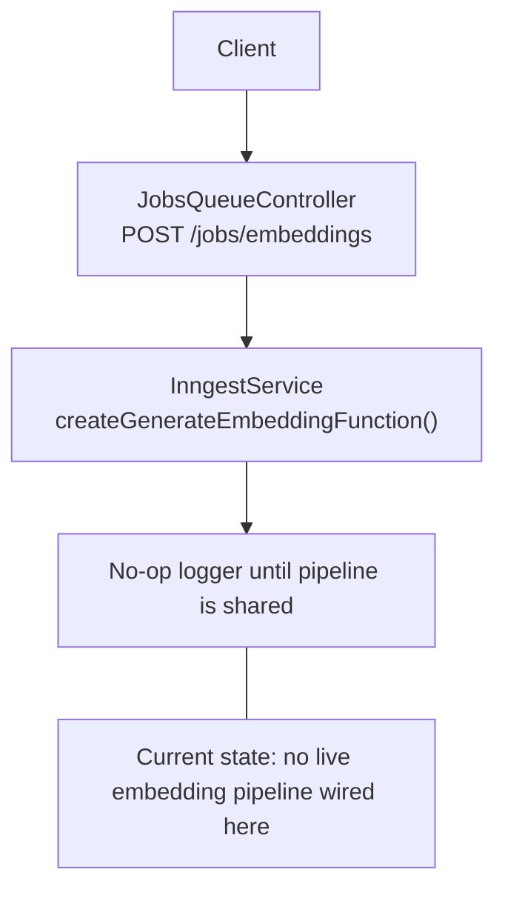
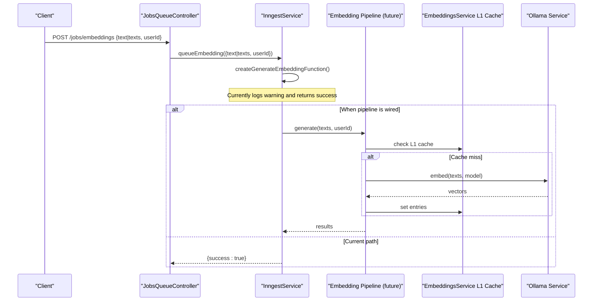
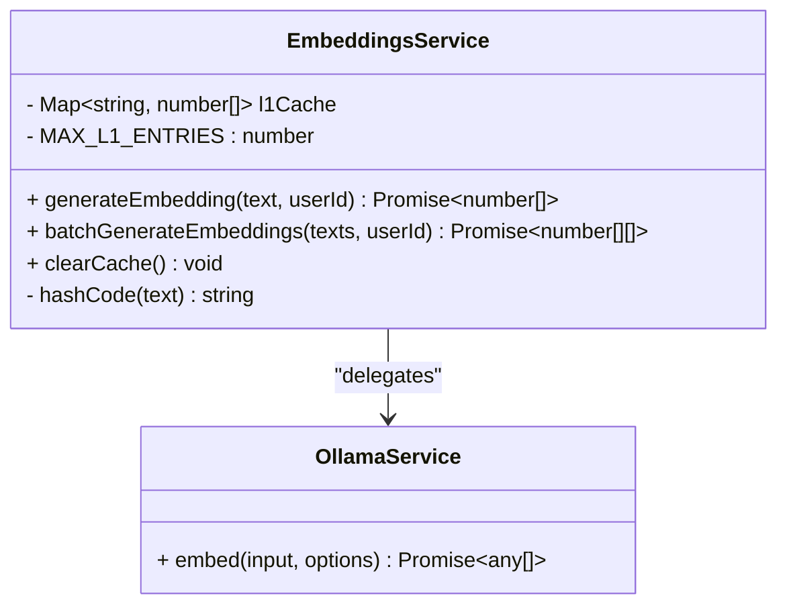
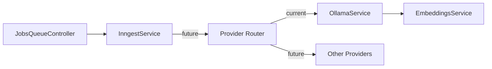

# Embedding Provider Abstraction

<cite>
**Referenced Files in This Document**
- [embeddings.service.ts](file://apps/api/src/ai/ollama/embeddings.service.ts)
- [inngest.service.ts](file://apps/api/src/jobs/inngest.service.ts)
- [jobs-queue.controller.ts](file://apps/api/src/jobs/jobs-queue.controller.ts)
</cite>

## Table of Contents

1. Introduction
2. Project Structure
3. Core Components
4. Architecture Overview
5. Detailed Component Analysis
6. Dependency Analysis
7. Performance Considerations
8. Troubleshooting Guide
9. Conclusion

## Introduction

This document describes the embedding provider abstraction layer as implemented in the repository, focusing on how embedding generation is orchestrated and where extensibility points exist for adding new providers. It explains:

- The current provider selection logic (single active provider)
- Configuration and authentication handling
- Rate limiting considerations
- Fallback mechanisms and graceful degradation
- Health monitoring and circuit breaker patterns
- Load balancing strategies
- How to add a new provider and handle provider-specific errors

The goal is to provide both a conceptual overview and concrete code-level references so that engineers can extend or modify the system safely.

## Project Structure

At present, the embedding pipeline is centered around an Ollama-based implementation with an in-process cache and a job queue entry point. The key files are:

- An embeddings service that encapsulates caching and calls into the Ollama client
- A job controller that exposes an endpoint to enqueue embedding work
- A background job handler that currently acts as a placeholder until the shared pipeline is integrated

**Diagram sources**

- [jobs-queue.controller.ts:1-25](file://apps/api/src/jobs/jobs-queue.controller.ts#L1-L25)
- [inngest.service.ts:246-279](file://apps/api/src/jobs/inngest.service.ts#L246-L279)

**Section sources**

- [jobs-queue.controller.ts:1-25](file://apps/api/src/jobs/jobs-queue.controller.ts#L1-L25)
- [inngest.service.ts:246-279](file://apps/api/src/jobs/inngest.service.ts#L246-L279)

## Core Components

- EmbeddingsService: Provides single and batch embedding generation with an L1 process cache keyed by user and text hash. It delegates to the Ollama client for actual vectorization.
- JobsQueueController: Exposes a POST endpoint to enqueue embedding jobs for authenticated users.
- InngestService: Registers a generate-embedding function; currently logs a warning and returns success without invoking the embedding pipeline.

Key responsibilities:

- Caching strategy and eviction policy
- Batch processing optimization
- Job orchestration and logging
- Extensibility hooks for provider selection and fallbacks

**Section sources**

- [embeddings.service.ts:1-79](file://apps/api/src/ai/ollama/embeddings.service.ts#L1-L79)
- [jobs-queue.controller.ts:1-25](file://apps/api/src/jobs/jobs-queue.controller.ts#L1-L25)
- [inngest.service.ts:246-279](file://apps/api/src/jobs/inngest.service.ts#L246-L279)

## Architecture Overview

The current architecture uses a single active provider (Ollama) behind a thin service facade. The job queue exists but does not yet call into the embedding pipeline.

**Diagram sources**

- [jobs-queue.controller.ts:1-25](file://apps/api/src/jobs/jobs-queue.controller.ts#L1-L25)
- [inngest.service.ts:246-279](file://apps/api/src/jobs/inngest.service.ts#L246-L279)
- [embeddings.service.ts:1-79](file://apps/api/src/ai/ollama/embeddings.service.ts#L1-L79)

## Detailed Component Analysis

### EmbeddingsService

Responsibilities:

- Provide generateEmbedding and batchGenerateEmbeddings APIs
- Maintain an in-process L1 cache with bounded size and simple eviction
- Hash inputs per user to avoid collisions across tenants
- Delegate to the Ollama client for actual embedding computation

Design notes:

- Single-provider coupling to Ollama via constructor injection
- Deterministic cache keys using userId and a stable hash of input text
- Batch path minimizes remote calls by skipping cached items and batching only misses

**Diagram sources**

- [embeddings.service.ts:1-79](file://apps/api/src/ai/ollama/embeddings.service.ts#L1-L79)

Operational characteristics:

- Time complexity: O(n) for batch scan plus one O(k) remote call for k pending texts
- Space complexity: O(c) for cache entries up to MAX_L1_ENTRIES
- Eviction: oldest-first via Map iteration order

**Section sources**

- [embeddings.service.ts:1-79](file://apps/api/src/ai/ollama/embeddings.service.ts#L1-L79)

### JobsQueueController

Responsibilities:

- Accept requests to queue embedding generation for authenticated users
- Forward payload to InngestService.queueEmbedding

Extensibility:

- Can be extended to include provider hints or routing metadata in the request body

**Section sources**

- [jobs-queue.controller.ts:1-25](file://apps/api/src/jobs/jobs-queue.controller.ts#L1-L25)

### InngestService (generate-embedding function)

Responsibilities:

- Register a function triggered by aiGenerateEmbeddingEvent
- Measure duration and log success/failure
- Currently a no-op placeholder until the embedding pipeline is shared

Future wiring:

- Replace the placeholder with a call to the unified embedding pipeline
- Introduce provider selection, fallback, rate limiting, and health checks at this layer

**Section sources**

- [inngest.service.ts:246-279](file://apps/api/src/jobs/inngest.service.ts#L246-L279)

## Dependency Analysis

Current dependencies:

- EmbeddingsService depends on OllamaService
- JobsQueueController depends on InngestService
- InngestService currently has no dependency on the embedding pipeline

Potential future dependencies:

- Unified provider registry and router
- Rate limiter integration
- Circuit breaker and health monitor
- Metrics and tracing instrumentation

**Diagram sources**

- [jobs-queue.controller.ts:1-25](file://apps/api/src/jobs/jobs-queue.controller.ts#L1-L25)
- [inngest.service.ts:246-279](file://apps/api/src/jobs/inngest.service.ts#L246-L279)
- [embeddings.service.ts:1-79](file://apps/api/src/ai/ollama/embeddings.service.ts#L1-L79)

**Section sources**

- [jobs-queue.controller.ts:1-25](file://apps/api/src/jobs/jobs-queue.controller.ts#L1-L25)
- [inngest.service.ts:246-279](file://apps/api/src/jobs/inngest.service.ts#L246-L279)
- [embeddings.service.ts:1-79](file://apps/api/src/ai/ollama/embeddings.service.ts#L1-L79)

## Performance Considerations

- L1 cache reduces repeated calls to the provider for identical inputs within the same process lifetime
- Batch generation coalesces multiple texts into a single provider call when possible
- Eviction policy prevents unbounded memory growth
- Recommendations:
  - Add metrics for cache hit ratio, latency, and error rates
  - Consider distributed cache (e.g., Redis) for multi-instance deployments
  - Implement backpressure and concurrency limits for large batches

[No sources needed since this section provides general guidance]

## Troubleshooting Guide

Common issues and mitigations:

- Empty vectors returned: ensure the provider returns non-empty arrays; guard downstream consumers
- Cache misses due to hashing collisions: verify hash stability and uniqueness guarantees
- Job runs without effect: confirm the generate-embedding function is wired to the pipeline
- Provider errors: implement typed error mapping and retries for transient failures

Operational tips:

- Use clearCache during maintenance windows to force refresh
- Log provider response shapes and durations for diagnostics
- Validate environment configuration for provider credentials and endpoints

**Section sources**

- [embeddings.service.ts:1-79](file://apps/api/src/ai/ollama/embeddings.service.ts#L1-L79)
- [inngest.service.ts:246-279](file://apps/api/src/jobs/inngest.service.ts#L246-L279)

## Conclusion

The repository currently implements a single-provider embedding pipeline backed by Ollama with an in-process cache and a job queue stub. To evolve toward a robust abstraction layer:

- Introduce a provider interface and registry
- Centralize configuration, authentication, and rate limiting
- Add health checks, circuit breakers, and fallbacks
- Support load balancing across multiple providers
- Extend the job handler to invoke the unified pipeline

These changes will improve resilience, scalability, and flexibility while preserving the existing performance optimizations.

[No sources needed since this section summarizes without analyzing specific files]
