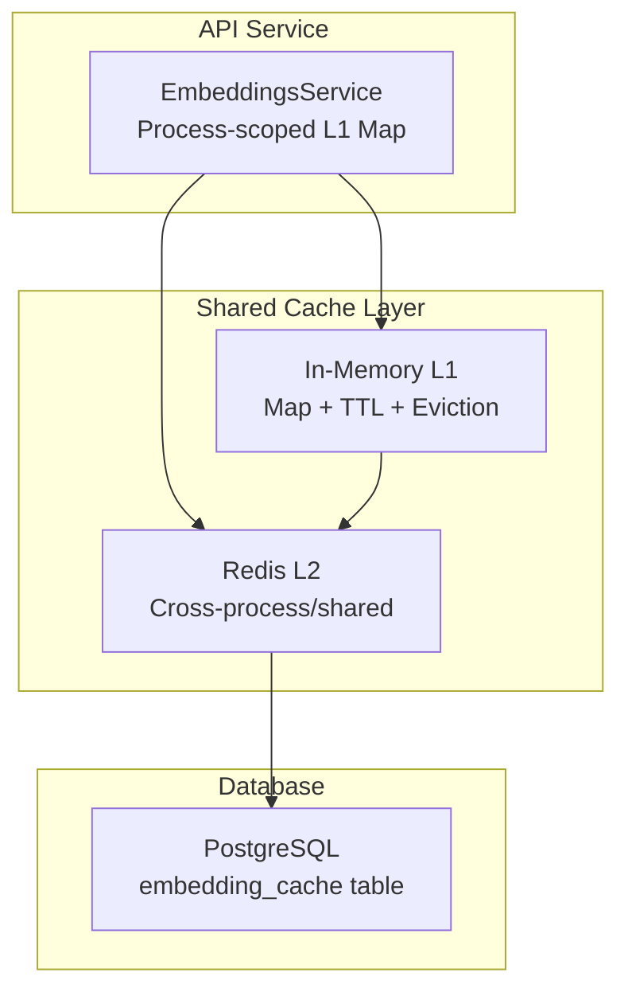
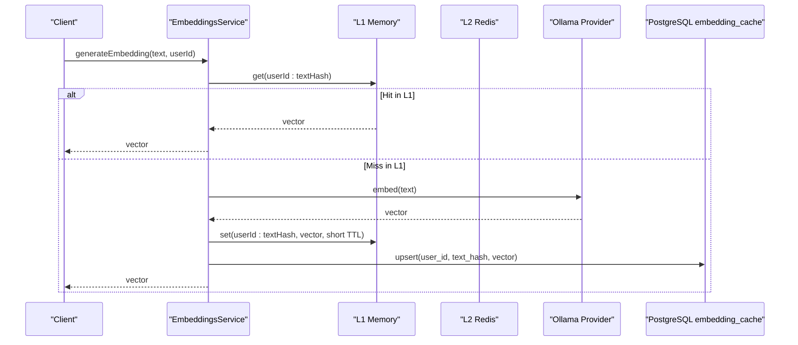
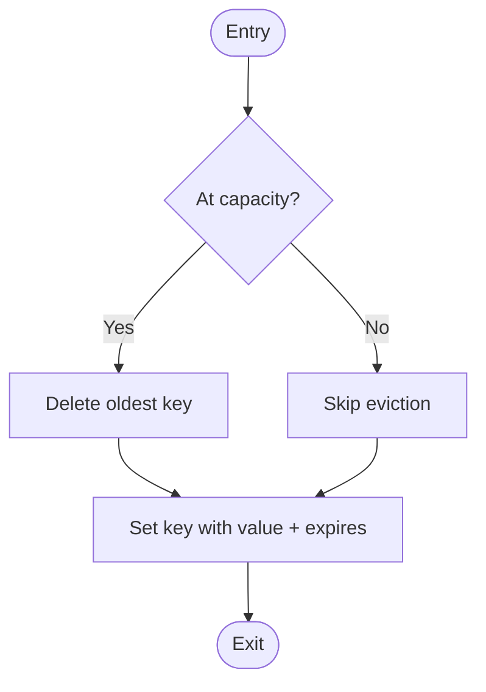
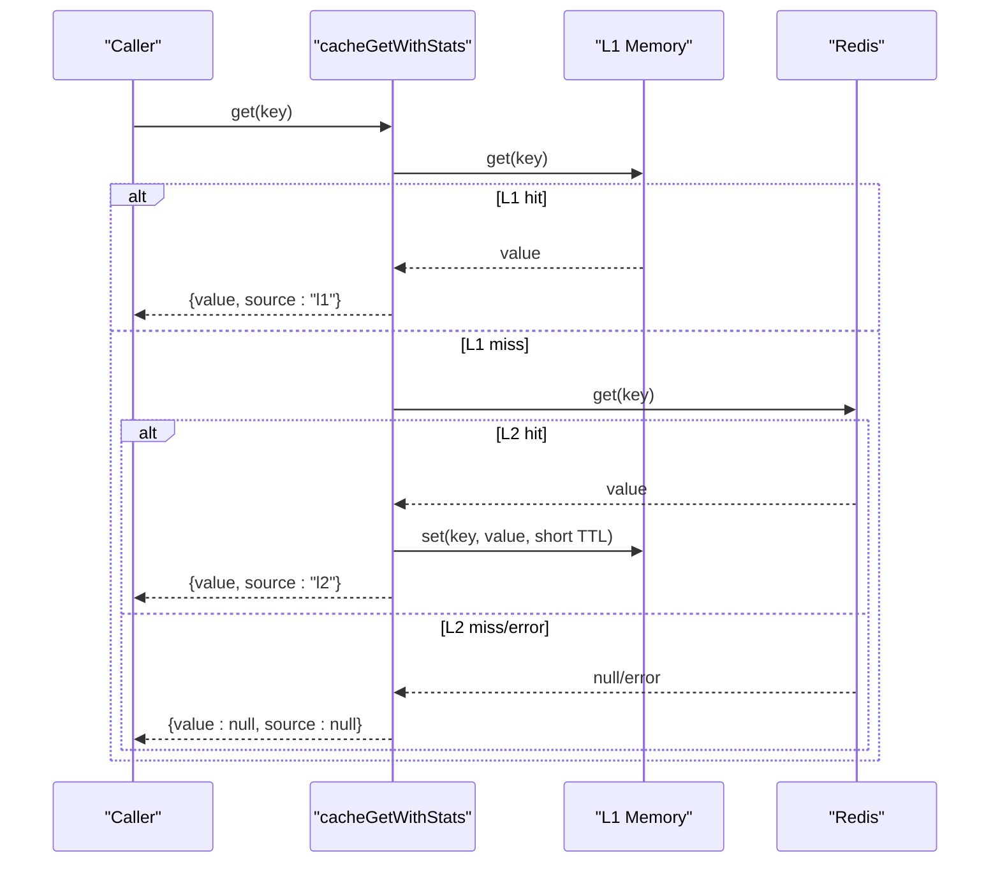
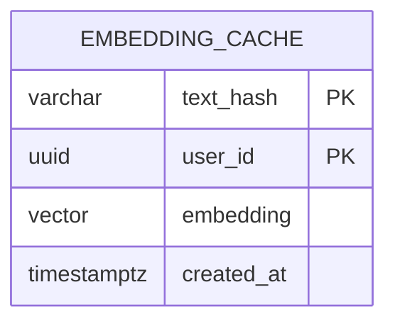
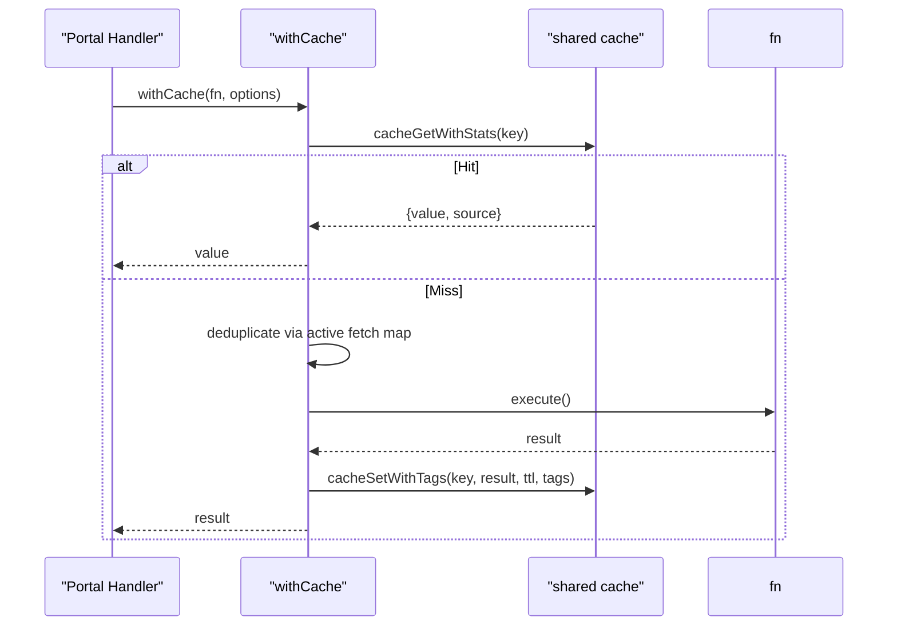
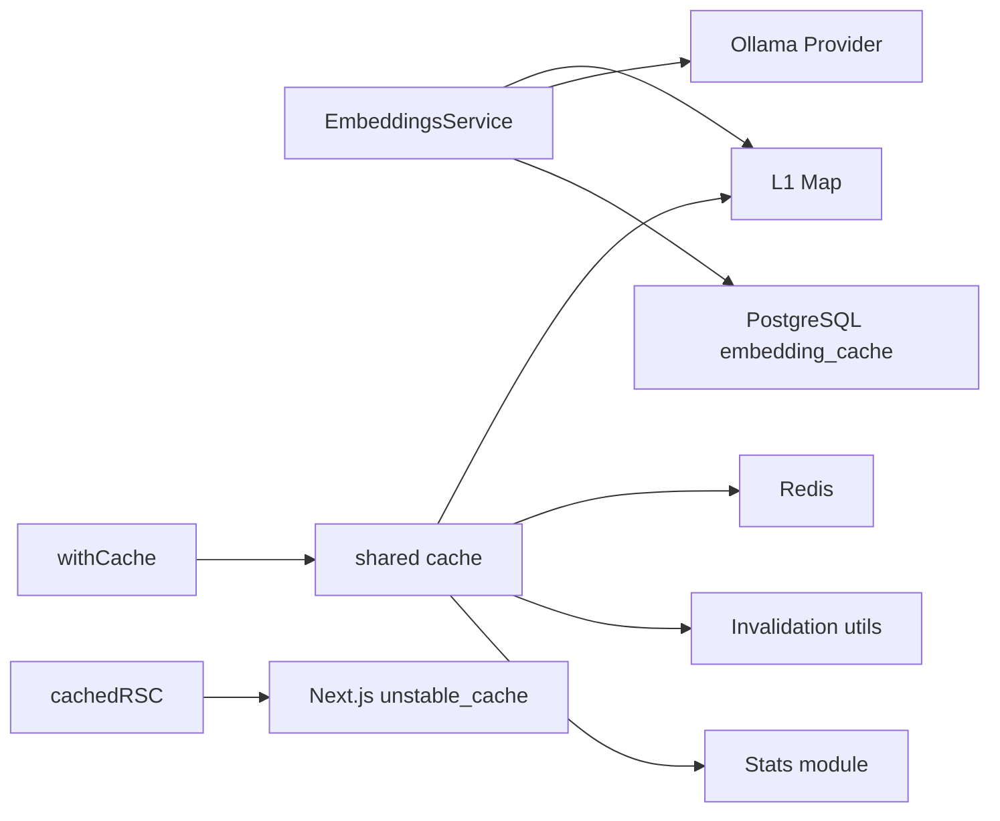

# Multi-Level Caching Strategy

<cite>
**Referenced Files in This Document**
- [embeddings.service.ts](file://apps/api/src/ai/ollama/embeddings.service.ts)
- [cache.ts](file://packages/redis/src/cache.ts)
- [stats.ts](file://packages/redis/src/stats.ts)
- [cache-utils.ts](file://apps/portal/lib/cache-utils.ts)
- [server-cache.ts](file://apps/portal/lib/server-cache.ts)
- [059_embedding_cache.sql](file://packages/supabase/migrations/059_embedding_cache.sql)
- [database-schema.md](file://wiki/concepts/database-schema.md)
- [067_cache_events.sql](file://packages/database/migrations/067_cache_events.sql)
</cite>

## Table of Contents

1. Introduction
2. Project Structure
3. Core Components
4. Architecture Overview
5. Detailed Component Analysis
6. Dependency Analysis
7. Performance Considerations
8. Troubleshooting Guide
9. Conclusion

## Introduction

This document explains the multi-level caching strategy used by the embedding system to accelerate vector generation and retrieval. It covers:

- L1 in-memory cache for ultra-fast, process-scoped access with eviction and TTL
- L2 persistent cache layer using Redis for cross-process and cross-server sharing
- Database-backed user-isolated embedding cache in PostgreSQL for long-term persistence and RLS-based isolation
- Cache hit/miss workflows, fallback mechanisms, request coalescing, invalidation, and warming strategies
- Monitoring metrics, performance characteristics, consistency considerations, and scaling guidance

## Project Structure

The caching implementation spans several layers:

- API service embedding cache (process-scoped Map)
- Shared cache utilities (L1 memory + L2 Redis)
- Portal wrappers integrating with Next.js server-side caching
- PostgreSQL embedding cache table with Row Level Security
- Observability tables for cache events and anomalies

**Diagram sources**

- [embeddings.service.ts:1-80](file://apps/api/src/ai/ollama/embeddings.service.ts#L1-L80)
- [cache.ts:1-269](file://packages/redis/src/cache.ts#L1-L269)
- [059_embedding_cache.sql:1-33](file://packages/supabase/migrations/059_embedding_cache.sql#L1-L33)

**Section sources**

- [embeddings.service.ts:1-80](file://apps/api/src/ai/ollama/embeddings.service.ts#L1-L80)
- [cache.ts:1-269](file://packages/redis/src/cache.ts#L1-L269)
- [059_embedding_cache.sql:1-33](file://packages/supabase/migrations/059_embedding_cache.sql#L1-L33)

## Core Components

- EmbeddingsService L1 cache: A per-process Map keyed by userId plus a text hash, with a fixed capacity and simple head-deletion eviction. Used for single and batch embedding generation.
- Shared L1/L2 cache: A generic cache module providing:
  - L1: In-memory Map with TTL and simple LRU-like eviction at capacity
  - L2: Redis-backed storage with write-through and tag-based indexing/invalidation
  - Request coalescing via active fetch maps to avoid thundering herds
  - Graceful degradation when Redis is unavailable
- Portal wrapper: High-level withCache utility that integrates with shared cache, applies category-based TTLs, tags, and fallback behavior; also supports Next.js unstable_cache for RSC reads.
- PostgreSQL embedding cache: User-isolated table storing 768-dim vectors with RLS policies ensuring users can only read/write their own entries.

**Section sources**

- [embeddings.service.ts:1-80](file://apps/api/src/ai/ollama/embeddings.service.ts#L1-L80)
- [cache.ts:1-269](file://packages/redis/src/cache.ts#L1-L269)
- [cache-utils.ts:1-79](file://apps/portal/lib/cache-utils.ts#L1-L79)
- [server-cache.ts:1-27](file://apps/portal/lib/server-cache.ts#L1-L27)
- [059_embedding_cache.sql:1-33](file://packages/supabase/migrations/059_embedding_cache.sql#L1-L33)

## Architecture Overview

The system uses a layered approach:

- L1 (in-memory): Fastest path, process-scoped, short TTL, bounded size
- L2 (Redis): Shared across processes and servers, longer TTL, tag/prefix invalidation
- DB (PostgreSQL): Persistent, user-isolated embeddings for long-term reuse and analytics

**Diagram sources**

- [embeddings.service.ts:11-28](file://apps/api/src/ai/ollama/embeddings.service.ts#L11-L28)
- [059_embedding_cache.sql:8-15](file://packages/supabase/migrations/059_embedding_cache.sql#L8-L15)

## Detailed Component Analysis

### L1 In-Memory Cache (Process-Scoped Maps)

- EmbeddingsService L1:
  - Key format: userId concatenated with a deterministic text hash
  - Capacity: Fixed maximum entries; evicts oldest entry on overflow
  - Batch support: Checks L1 for all inputs, batches misses, then writes back results
  - Clear operation: Exposed for testing or maintenance
- Shared L1 (generic):
  - TTL per entry; expired entries are lazily removed on read
  - Simple eviction policy: delete first insertion when at capacity
  - Prefix-based deletion helper for targeted invalidation

**Diagram sources**

- [embeddings.service.ts:20-25](file://apps/api/src/ai/ollama/embeddings.service.ts#L20-L25)
- [cache.ts:31-44](file://packages/redis/src/cache.ts#L31-L44)

**Section sources**

- [embeddings.service.ts:1-80](file://apps/api/src/ai/ollama/embeddings.service.ts#L1-L80)
- [cache.ts:11-56](file://packages/redis/src/cache.ts#L11-L56)

### L2 Persistent Cache Layer (Redis)

- Read path:
  - If L1 miss, attempt Redis GET
  - On L2 hit, populate L1 with short TTL to accelerate near-term reads
  - Record stats for hits/misses and latency percentiles
- Write path:
  - Write-through to both L1 (capped TTL) and L2 (configured TTL)
  - Tag-based indexing for later invalidation
- Invalidation:
  - Tag-based and prefix-based invalidation helpers
  - Safe SCAN-based deletion for large-scale invalidation
- Resilience:
  - Graceful fallback if Redis is unreachable
  - Error recording for observability

**Diagram sources**

- [cache.ts:119-150](file://packages/redis/src/cache.ts#L119-L150)

**Section sources**

- [cache.ts:72-150](file://packages/redis/src/cache.ts#L72-L150)
- [cache.ts:156-189](file://packages/redis/src/cache.ts#L156-L189)
- [cache.ts:226-252](file://packages/redis/src/cache.ts#L226-L252)
- [stats.ts:59-118](file://packages/redis/src/stats.ts#L59-L118)

### PostgreSQL Embedding Cache (User-Isolated Persistence)

- Schema:
  - Primary key: (text_hash, user_id)
  - Vector column: VECTOR(768) with dimension constraint
  - Timestamps: created_at
- Security:
  - Row Level Security enabled
  - Policies allow authenticated users to SELECT/INSERT only their own rows
- Purpose:
  - Long-term persistence of embeddings for reuse across sessions and restarts
  - Supports user isolation and auditability

**Diagram sources**

- [059_embedding_cache.sql:8-15](file://packages/supabase/migrations/059_embedding_cache.sql#L8-L15)

**Section sources**

- [059_embedding_cache.sql:1-33](file://packages/supabase/migrations/059_embedding_cache.sql#L1-L33)
- [database-schema.md:335-338](file://wiki/concepts/database-schema.md#L335-L338)

### Portal Integration and Server-Side Caching

- withCache wrapper:
  - Builds keys from category and parts
  - Uses cacheGetWithStats to check L1/L2
  - On miss, executes function and writes result with TTL and optional tags
  - Implements request coalescing via an active fetch map
  - Handles DatabaseError by not caching and rethrowing
  - Provides fallback to retry L1 after error to serve stale data when possible
- Next.js RSC integration:
  - cachedRSC wraps unstable_cache for React Server Components with tags and revalidate options

**Diagram sources**

- [cache-utils.ts:30-78](file://apps/portal/lib/cache-utils.ts#L30-L78)
- [cache.ts:119-150](file://packages/redis/src/cache.ts#L119-L150)

**Section sources**

- [cache-utils.ts:1-79](file://apps/portal/lib/cache-utils.ts#L1-L79)
- [server-cache.ts:1-27](file://apps/portal/lib/server-cache.ts#L1-L27)

## Dependency Analysis

- EmbeddingsService depends on:
  - Process-scoped Map for L1
  - Ollama provider for vector generation
  - Optional DB upsert for persistence
- Shared cache depends on:
  - In-memory Map for L1
  - Redis client for L2
  - Invalidation utilities for tag/prefix operations
  - Stats module for metrics
- Portal integration depends on:
  - Shared cache APIs
  - Next.js unstable_cache for RSC

**Diagram sources**

- [embeddings.service.ts:1-80](file://apps/api/src/ai/ollama/embeddings.service.ts#L1-L80)
- [cache.ts:1-269](file://packages/redis/src/cache.ts#L1-L269)
- [stats.ts:1-168](file://packages/redis/src/stats.ts#L1-L168)
- [server-cache.ts:1-27](file://apps/portal/lib/server-cache.ts#L1-L27)

**Section sources**

- [embeddings.service.ts:1-80](file://apps/api/src/ai/ollama/embeddings.service.ts#L1-L80)
- [cache.ts:1-269](file://packages/redis/src/cache.ts#L1-L269)
- [stats.ts:1-168](file://packages/redis/src/stats.ts#L1-L168)
- [server-cache.ts:1-27](file://apps/portal/lib/server-cache.ts#L1-L27)

## Performance Considerations

- Latency characteristics:
  - L1 hits are sub-millisecond due to in-memory Map access
  - L2 hits add network overhead but still fast; L2 misses incur provider/DB cost
- Eviction and memory limits:
  - L1 has fixed capacity; simple eviction removes oldest entries
  - L1 TTL capped to keep memory footprint lean
- Throughput:
  - Batch embedding generation reduces provider calls
  - Request coalescing prevents thundering herds during cache misses
- Consistency:
  - Write-through ensures L1 and L2 stay consistent
  - Tag/prefix invalidation supports targeted updates
- Scaling:
  - Redis provides cross-process and cross-server sharing
  - PostgreSQL embedding cache persists across restarts and scales with database resources

[No sources needed since this section provides general guidance]

## Troubleshooting Guide

Common issues and resolutions:

- Redis unavailable:
  - System falls back gracefully; requests proceed without L2
  - Errors recorded for observability
- Stale data:
  - Use tag-based or prefix-based invalidation to refresh affected keys
  - For RSC, use tags with revalidateTag to invalidate Next.js Data Cache
- High miss rate:
  - Tune TTLs per category; ensure warm-up strategies are effective
  - Verify key construction and hashing to avoid collisions
- Memory pressure:
  - Monitor L1 size and adjust capacity/TTL as needed
  - Use prefix eviction for targeted cleanup

Operational visibility:

- Metrics:
  - Hits, misses, L1/L2 split, redisErrors, avg/p95 latency
  - Persisted in Redis and local snapshots
- Observability tables:
  - cache_events and cache_anomalies for raw events and detected anomalies

**Section sources**

- [cache.ts:108-113](file://packages/redis/src/cache.ts#L108-L113)
- [cache.ts:226-252](file://packages/redis/src/cache.ts#L226-L252)
- [stats.ts:120-168](file://packages/redis/src/stats.ts#L120-L168)
- [067_cache_events.sql:1-34](file://packages/database/migrations/067_cache_events.sql#L1-L34)

## Conclusion

The embedding system employs a robust multi-level caching strategy:

- L1 in-memory cache delivers ultra-low latency with bounded memory and simple eviction
- L2 Redis enables cross-process sharing, tag-based invalidation, and resilient operation
- PostgreSQL embedding cache ensures long-term persistence and user isolation
- Integrated monitoring and anomaly tracking provide operational insight
  Together, these layers balance speed, consistency, and scalability for high-throughput scenarios.
