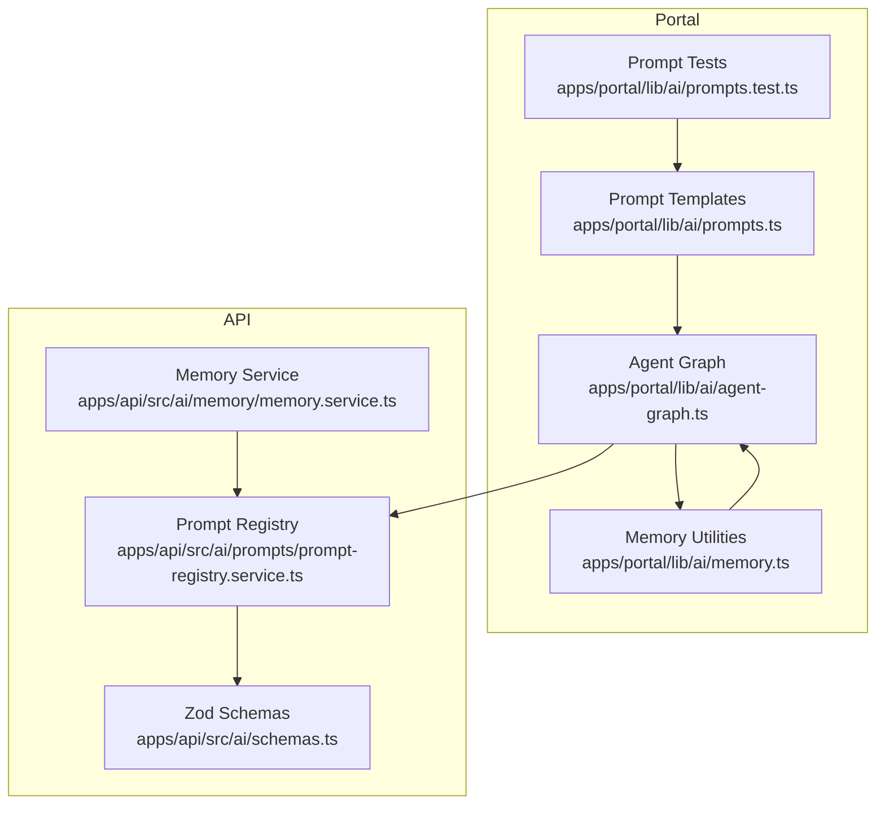
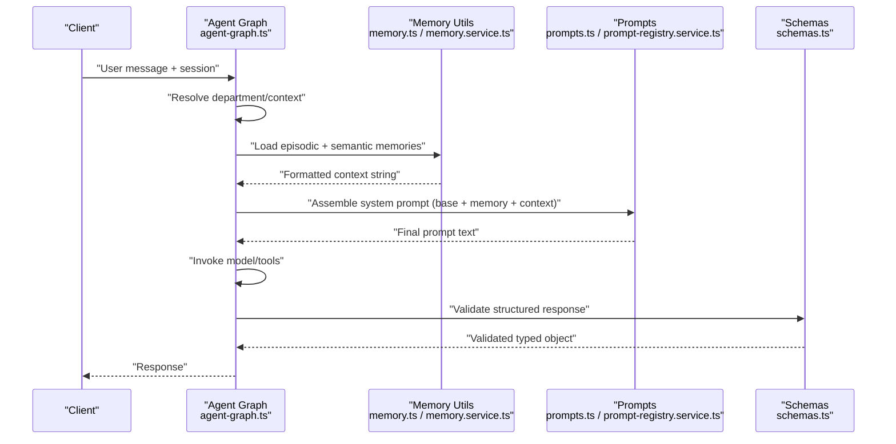
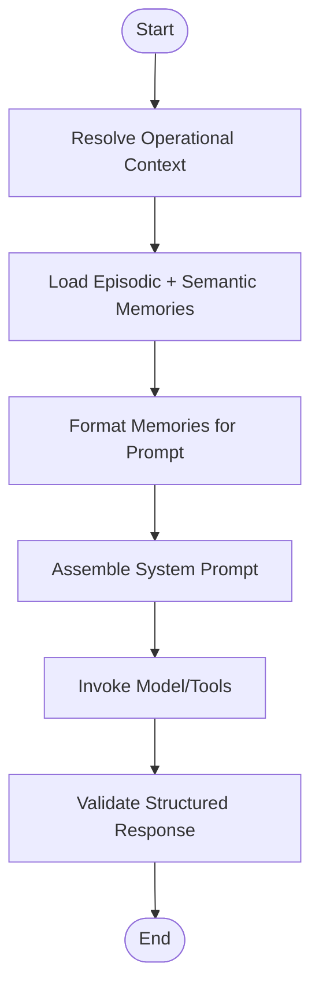
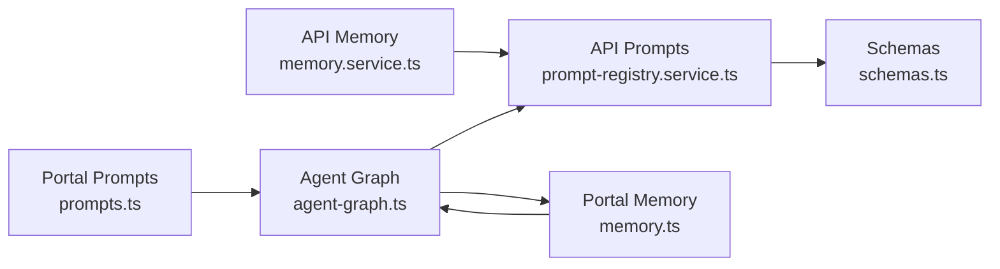

# Prompt Engineering & Schema Management

<cite>
**Referenced Files in This Document**
- [prompt-registry.service.ts](file://apps/api/src/ai/prompts/prompt-registry.service.ts)
- [schemas.ts](file://apps/api/src/ai/schemas.ts)
- [prompts.ts](file://apps/portal/lib/ai/prompts.ts)
- [prompts.test.ts](file://apps/portal/lib/ai/prompts.test.ts)
- [memory.ts](file://apps/portal/lib/ai/memory.ts)
- [memory.service.ts](file://apps/api/src/ai/memory/memory.service.ts)
- [agent-graph.ts](file://apps/portal/lib/ai/agent-graph.ts)
- [response.ts](file://apps/portal/lib/api/response.ts)
</cite>

## Table of Contents

1. [Introduction](#introduction)
2. [Project Structure](#project-structure)
3. [Core Components](#core-components)
4. [Architecture Overview](#architecture-overview)
5. [Detailed Component Analysis](#detailed-component-analysis)
6. [Dependency Analysis](#dependency-analysis)
7. [Performance Considerations](#performance-considerations)
8. [Troubleshooting Guide](#troubleshooting-guide)
9. [Conclusion](#conclusion)
10. [Appendices](#appendices)

## Introduction

This document explains the prompt engineering patterns and schema management used across the AI system. It covers:

- Prompt templating and dynamic context injection for chat and specialized tasks
- Response schema definitions and validation to ensure type safety
- Memory management for conversation context, knowledge base integration, and retention strategies
- Practical examples for creating domain-specific prompts, implementing response validation, and managing conversation memory effectively

The goal is to provide a clear, actionable guide for building robust, maintainable AI features with strong guarantees on input/output shapes and consistent user experiences.

## Project Structure

The AI-related prompt and schema logic spans both the portal (Next.js) and API (NestJS) layers:

- Portal-side prompt templates and tests
- API-side prompt registry and Zod schemas
- Shared memory utilities for episodic and semantic retrieval and formatting
- Agent graph orchestration that wires context resolution, memory loading, and prompt assembly

**Diagram sources**

- [prompts.ts:1-67](file://apps/portal/lib/ai/prompts.ts#L1-L67)
- [prompts.test.ts:1-72](file://apps/portal/lib/ai/prompts.test.ts#L1-L72)
- [memory.ts:1-402](file://apps/portal/lib/ai/memory.ts#L1-L402)
- [agent-graph.ts:119-222](file://apps/portal/lib/ai/agent-graph.ts#L119-L222)
- [prompt-registry.service.ts:1-34](file://apps/api/src/ai/prompts/prompt-registry.service.ts#L1-L34)
- [schemas.ts:1-20](file://apps/api/src/ai/schemas.ts#L1-L20)
- [memory.service.ts:1-208](file://apps/api/src/ai/memory/memory.service.ts#L1-L208)

**Section sources**

- [prompts.ts:1-67](file://apps/portal/lib/ai/prompts.ts#L1-L67)
- [prompt-registry.service.ts:1-34](file://apps/api/src/ai/prompts/prompt-registry.service.ts#L1-L34)
- [schemas.ts:1-20](file://apps/api/src/ai/schemas.ts#L1-L20)
- [memory.ts:1-402](file://apps/portal/lib/ai/memory.ts#L1-L402)
- [memory.service.ts:1-208](file://apps/api/src/ai/memory/memory.service.ts#L1-L208)
- [agent-graph.ts:119-222](file://apps/portal/lib/ai/agent-graph.ts#L119-L222)

## Core Components

- Prompt templates: Centralized, composable templates for chat and domain-specific tasks (maintenance, compliance, shift handoff). Includes tool dispatch guidance and confidence scoring instructions.
- Schema definitions: Zod-based schemas for structured outputs (risk assessment, compliance results), paired with TypeScript types for compile-time safety.
- Memory utilities: Episodic (session-scoped) and semantic (user-scoped) memory storage/retrieval, hybrid search fallbacks, and formatting helpers for prompt injection.
- Agent graph: Orchestrates authentication, rate limiting, department context resolution, memory loading, and prompt assembly before invoking models or tools.

Key responsibilities:

- Ensure prompts are deterministic, testable, and easy to extend
- Enforce strict output contracts via schemas
- Provide robust memory retrieval with graceful fallbacks
- Keep context injection modular and predictable

**Section sources**

- [prompts.ts:1-67](file://apps/portal/lib/ai/prompts.ts#L1-L67)
- [prompt-registry.service.ts:1-34](file://apps/api/src/ai/prompts/prompt-registry.service.ts#L1-L34)
- [schemas.ts:1-20](file://apps/api/src/ai/schemas.ts#L1-L20)
- [memory.ts:1-402](file://apps/portal/lib/ai/memory.ts#L1-L402)
- [memory.service.ts:1-208](file://apps/api/src/ai/memory/memory.service.ts#L1-L208)
- [agent-graph.ts:119-222](file://apps/portal/lib/ai/agent-graph.ts#L119-L222)

## Architecture Overview

The AI flow integrates prompt templating, memory retrieval, and schema validation into a cohesive pipeline:

- The agent graph resolves operational context (e.g., department) and loads relevant memories
- Prompts are assembled by combining base instructions, memory context, and operational context
- For structured tasks, prompts instruct JSON-only responses aligned with Zod schemas
- Responses are validated against schemas to enforce type safety

**Diagram sources**

- [agent-graph.ts:119-222](file://apps/portal/lib/ai/agent-graph.ts#L119-L222)
- [memory.ts:145-215](file://apps/portal/lib/ai/memory.ts#L145-L215)
- [memory.service.ts:59-100](file://apps/api/src/ai/memory/memory.service.ts#L59-L100)
- [prompts.ts:1-67](file://apps/portal/lib/ai/prompts.ts#L1-L67)
- [prompt-registry.service.ts:1-34](file://apps/api/src/ai/prompts/prompt-registry.service.ts#L1-L34)
- [schemas.ts:1-20](file://apps/api/src/ai/schemas.ts#L1-L20)

## Detailed Component Analysis

### Prompt Templating System

- Chat template supports optional memory context and operational context, ensuring predictable ordering and composition
- Tool dispatch template instructs the model to return a JSON decision with confidence scoring and reasoning
- Domain-specific templates (predictive maintenance, safety compliance, shift handoff) emphasize concise, actionable outputs and JSON-only constraints where applicable

Best practices:

- Keep base instructions stable; append contextual sections conditionally
- Use explicit rules for tool selection and confidence thresholds
- Maintain separate templates per domain to reduce coupling

**Section sources**

- [prompts.ts:1-67](file://apps/portal/lib/ai/prompts.ts#L1-L67)
- [prompt-registry.service.ts:1-34](file://apps/api/src/ai/prompts/prompt-registry.service.ts#L1-L34)
- [prompts.test.ts:1-72](file://apps/portal/lib/ai/prompts.test.ts#L1-L72)

### Dynamic Context Injection

- Operational context: Resolved from request context (e.g., department name) and appended to the system prompt
- Memory context: Retrieved via hybrid or semantic search, then formatted into a readable block for injection
- Ordering: Memory context precedes operational context to prioritize past knowledge while still reflecting current state

Implementation highlights:

- Parallel retrieval of episodic and semantic memories improves latency
- Fallback mechanisms ensure resilience when advanced search fails
- Formatting helper standardizes how memories appear in prompts

**Section sources**

- [agent-graph.ts:144-222](file://apps/portal/lib/ai/agent-graph.ts#L144-L222)
- [memory.ts:145-215](file://apps/portal/lib/ai/memory.ts#L145-L215)
- [memory.service.ts:59-100](file://apps/api/src/ai/memory/memory.service.ts#L59-L100)
- [memory.ts:362-373](file://apps/portal/lib/ai/memory.ts#L362-L373)
- [memory.service.ts:140-150](file://apps/api/src/ai/memory/memory.service.ts#L140-L150)

### Response Schema Validation and Type Safety

- Zod schemas define strict structures for risk assessments and compliance results
- Paired TypeScript types enable compile-time safety and IDE support
- Validation ensures LLM outputs conform to expected contracts, reducing downstream errors

Usage pattern:

- Prompts instruct JSON-only outputs matching the schema
- After receiving model output, parse and validate using Zod
- Fail fast with descriptive errors if validation fails

**Section sources**

- [schemas.ts:1-20](file://apps/api/src/ai/schemas.ts#L1-L20)
- [prompt-registry.service.ts:12-33](file://apps/api/src/ai/prompts/prompt-registry.service.ts#L12-L33)

### Memory Management for Conversation Context

- Episodic memory: Session-scoped conversation turns stored with embeddings for retrieval
- Semantic memory: User-scoped facts and preferences persisted for long-term recall
- Hybrid search: Combines semantic similarity, keyword relevance, and temporal signals
- Fallbacks: Graceful degradation to semantic-only search when hybrid fails
- Caching: Conversation history uses caching to reduce repeated DB calls

Retention strategy:

- Pruning function removes old episodic entries beyond a configurable window
- Semantic facts can be overwritten by key to keep a single source of truth

**Section sources**

- [memory.ts:54-135](file://apps/portal/lib/ai/memory.ts#L54-L135)
- [memory.ts:145-215](file://apps/portal/lib/ai/memory.ts#L145-L215)
- [memory.ts:221-270](file://apps/portal/lib/ai/memory.ts#L221-L270)
- [memory.ts:280-341](file://apps/portal/lib/ai/memory.ts#L280-L341)
- [memory.ts:378-402](file://apps/portal/lib/ai/memory.ts#L378-L402)
- [memory.service.ts:29-57](file://apps/api/src/ai/memory/memory.service.ts#L29-L57)
- [memory.service.ts:59-100](file://apps/api/src/ai/memory/memory.service.ts#L59-L100)
- [memory.service.ts:102-138](file://apps/api/src/ai/memory/memory.service.ts#L102-L138)
- [memory.service.ts:152-185](file://apps/api/src/ai/memory/memory.service.ts#L152-L185)

### Knowledge Base Integration

- Embeddings generated via an embedding service and stored alongside content
- Database RPC functions perform hybrid and semantic searches
- Metadata fields allow filtering by user, session, and fact keys

Integration points:

- Supabase client for persistence
- Ollama service for embeddings (API layer)
- Cache utilities for read-heavy operations (portal layer)

**Section sources**

- [memory.ts:1-402](file://apps/portal/lib/ai/memory.ts#L1-L402)
- [memory.service.ts:1-208](file://apps/api/src/ai/memory/memory.service.ts#L1-L208)

### Example Workflows

#### Creating a Domain-Specific Prompt

- Define a focused system prompt for the task (e.g., predictive maintenance)
- Instruct JSON-only output and reference the corresponding schema
- Validate the parsed response using Zod

Steps:

- Add a new template entry under the prompt registry
- Align the prompt’s required fields with the Zod schema
- Update tests to assert presence of key instructions

**Section sources**

- [prompt-registry.service.ts:12-33](file://apps/api/src/ai/prompts/prompt-registry.service.ts#L12-L33)
- [schemas.ts:1-20](file://apps/api/src/ai/schemas.ts#L1-L20)

#### Implementing Response Validation

- Parse the model’s JSON output
- Validate against the appropriate Zod schema
- Return typed data or error details

Validation utility:

- Request body validation helper demonstrates safe parsing and error reporting

**Section sources**

- [response.ts:1-31](file://apps/portal/lib/api/response.ts#L1-L31)
- [schemas.ts:1-20](file://apps/api/src/ai/schemas.ts#L1-L20)

#### Managing Conversation Memory Effectively

- Store recent user messages as episodic memory
- Retrieve relevant memories in parallel (episodic + semantic)
- Format memories for prompt injection
- Prune old episodic entries periodically

Orchestration:

- Agent graph coordinates context resolution and memory loading
- Memory utilities handle storage, retrieval, and formatting

**Section sources**

- [agent-graph.ts:177-222](file://apps/portal/lib/ai/agent-graph.ts#L177-L222)
- [memory.ts:145-215](file://apps/portal/lib/ai/memory.ts#L145-L215)
- [memory.ts:362-373](file://apps/portal/lib/ai/memory.ts#L362-L373)
- [memory.ts:378-402](file://apps/portal/lib/ai/memory.ts#L378-L402)

### Conceptual Overview

[No sources needed since this diagram shows conceptual workflow, not actual code structure]

## Dependency Analysis

**Diagram sources**

- [prompts.ts:1-67](file://apps/portal/lib/ai/prompts.ts#L1-L67)
- [agent-graph.ts:119-222](file://apps/portal/lib/ai/agent-graph.ts#L119-L222)
- [prompt-registry.service.ts:1-34](file://apps/api/src/ai/prompts/prompt-registry.service.ts#L1-L34)
- [schemas.ts:1-20](file://apps/api/src/ai/schemas.ts#L1-L20)
- [memory.ts:1-402](file://apps/portal/lib/ai/memory.ts#L1-L402)
- [memory.service.ts:1-208](file://apps/api/src/ai/memory/memory.service.ts#L1-L208)

**Section sources**

- [prompts.ts:1-67](file://apps/portal/lib/ai/prompts.ts#L1-L67)
- [agent-graph.ts:119-222](file://apps/portal/lib/ai/agent-graph.ts#L119-L222)
- [prompt-registry.service.ts:1-34](file://apps/api/src/ai/prompts/prompt-registry.service.ts#L1-L34)
- [schemas.ts:1-20](file://apps/api/src/ai/schemas.ts#L1-L20)
- [memory.ts:1-402](file://apps/portal/lib/ai/memory.ts#L1-L402)
- [memory.service.ts:1-208](file://apps/api/src/ai/memory/memory.service.ts#L1-L208)

## Performance Considerations

- Parallel memory retrieval reduces latency by fetching episodic and semantic memories concurrently
- Hybrid search provides better relevance but may fall back to semantic-only when unavailable
- Caching conversation history minimizes repeated database queries
- Batch embedding generation accelerates bulk memory writes
- Pruning episodic memories prevents unbounded growth and keeps retrieval efficient

[No sources needed since this section provides general guidance]

## Troubleshooting Guide

Common issues and resolutions:

- Invalid JSON from model: Ensure prompts explicitly require JSON-only output and validate with Zod
- Missing fields in structured responses: Cross-check prompt instructions with schema definitions
- Slow or failed memory retrieval: Verify RPC availability and confirm fallback behavior is engaged
- Stale context: Confirm department resolution and memory formatting steps execute before prompt assembly

Operational checks:

- Validate request bodies early using the provided validation helper
- Log and surface detailed validation errors for faster debugging

**Section sources**

- [response.ts:1-31](file://apps/portal/lib/api/response.ts#L1-L31)
- [memory.ts:145-215](file://apps/portal/lib/ai/memory.ts#L145-L215)
- [memory.service.ts:59-100](file://apps/api/src/ai/memory/memory.service.ts#L59-L100)

## Conclusion

By centralizing prompt templates, enforcing strict response schemas, and integrating robust memory retrieval, the system achieves reliable, type-safe AI interactions. The modular design allows easy extension with new domains and tools while maintaining consistency and performance. Following the patterns outlined here will help you build scalable, maintainable AI features with clear contracts and resilient context handling.

## Appendices

### Quick Reference: Key Patterns

- Compose prompts with optional sections (memory, operational context)
- Use confidence scoring for tool dispatch decisions
- Validate all structured outputs with Zod
- Prefer hybrid search with fallbacks for memory retrieval
- Cache frequently accessed conversation history
- Prune old episodic memories to control storage

**Section sources**

- [prompts.ts:1-67](file://apps/portal/lib/ai/prompts.ts#L1-L67)
- [schemas.ts:1-20](file://apps/api/src/ai/schemas.ts#L1-L20)
- [memory.ts:145-215](file://apps/portal/lib/ai/memory.ts#L145-L215)
- [memory.ts:378-402](file://apps/portal/lib/ai/memory.ts#L378-L402)
