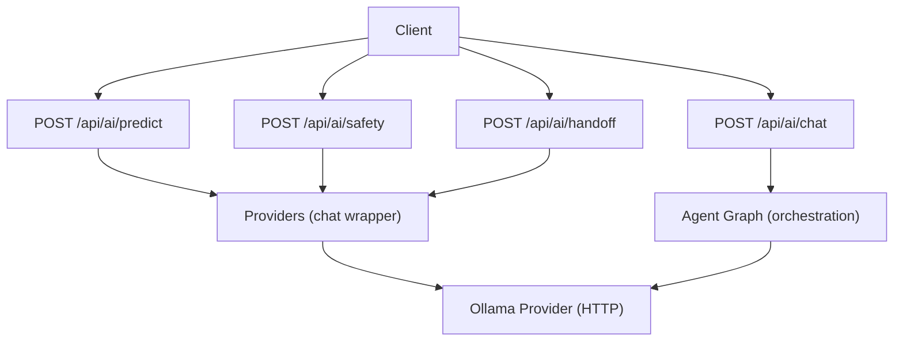
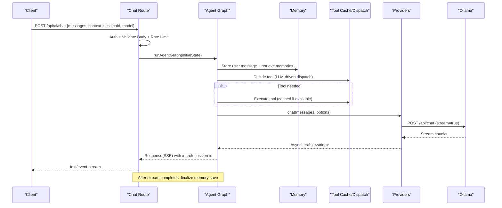
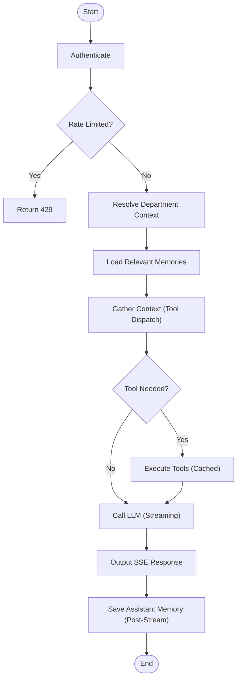
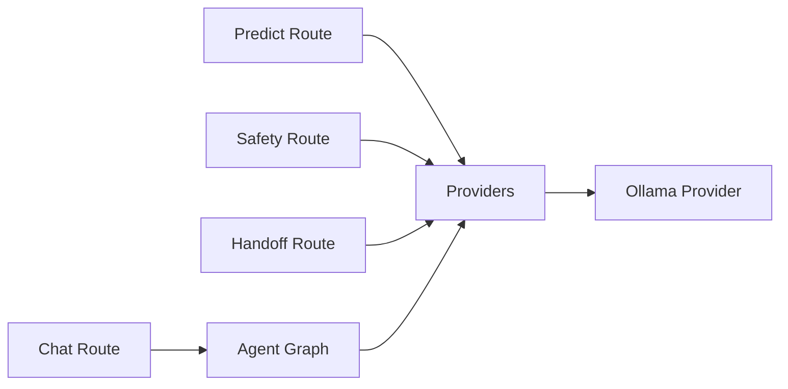

# AI & Machine Learning API

<cite>
**Referenced Files in This Document**
- [apps/portal/app/api/ai/chat/route.ts](file://apps/portal/app/api/ai/chat/route.ts)
- [apps/portal/app/api/ai/predict/route.ts](file://apps/portal/app/api/ai/predict/route.ts)
- [apps/portal/app/api/ai/safety/route.ts](file://apps/portal/app/api/ai/safety/route.ts)
- [apps/portal/app/api/ai/handoff/route.ts](file://apps/portal/app/api/ai/handoff/route.ts)
- [apps/portal/lib/ai/providers.ts](file://apps/portal/lib/ai/providers.ts)
- [apps/portal/lib/ai/ollama.ts](file://apps/portal/lib/ai/ollama.ts)
- [apps/portal/lib/ai/agent-graph.ts](file://apps/portal/lib/ai/agent-graph.ts)
- [apps/portal/lib/ai/agent-state.ts](file://apps/portal/lib/ai/agent-state.ts)
- [apps/portal/lib/api/schemas.ts](file://apps/portal/lib/api/schemas.ts)
</cite>

## Table of Contents

1. Introduction
2. Project Structure
3. Core Components
4. Architecture Overview
5. Detailed Component Analysis
6. Dependency Analysis
7. Performance Considerations
8. Troubleshooting Guide
9. Conclusion

## Introduction

This document provides detailed API documentation for the AI and machine learning endpoints exposed by the portal application. It covers:

- Chat completion with conversation history, message formats, and streaming responses
- Prediction endpoints for safety analysis, incident detection, and operational insights
- AI handoff mechanisms for human intervention and escalation workflows
- Prompt engineering examples, response parsing, and context management
- Model selection, temperature settings, and response formatting options
- Rate limiting, cost optimization, and fallback mechanisms for service failures
- Best practices for prompt design and response validation

The system uses a Next.js App Router for HTTP endpoints and an internal Ollama-compatible provider for chat and embeddings. A stateful agent graph orchestrates authentication, rate limiting, memory retrieval, tool dispatch, LLM calls, and output streaming.

## Project Structure

The AI-related APIs are implemented as Next.js Route Handlers under apps/portal/app/api/ai. Each endpoint validates input, enforces authentication and rate limits, and delegates to shared AI libraries for model execution and orchestration.

**Diagram sources**

- [apps/portal/app/api/ai/chat/route.ts:1-119](file://apps/portal/app/api/ai/chat/route.ts#L1-L119)
- [apps/portal/app/api/ai/predict/route.ts:1-97](file://apps/portal/app/api/ai/predict/route.ts#L1-L97)
- [apps/portal/app/api/ai/safety/route.ts:1-101](file://apps/portal/app/api/ai/safety/route.ts#L1-L101)
- [apps/portal/app/api/ai/handoff/route.ts:1-71](file://apps/portal/app/api/ai/handoff/route.ts#L1-L71)
- [apps/portal/lib/ai/providers.ts:1-91](file://apps/portal/lib/ai/providers.ts#L1-L91)
- [apps/portal/lib/ai/ollama.ts:1-262](file://apps/portal/lib/ai/ollama.ts#L1-L262)
- [apps/portal/lib/ai/agent-graph.ts:1-625](file://apps/portal/lib/ai/agent-graph.ts#L1-L625)

**Section sources**

- [apps/portal/app/api/ai/chat/route.ts:1-119](file://apps/portal/app/api/ai/chat/route.ts#L1-L119)
- [apps/portal/app/api/ai/predict/route.ts:1-97](file://apps/portal/app/api/ai/predict/route.ts#L1-L97)
- [apps/portal/app/api/ai/safety/route.ts:1-101](file://apps/portal/app/api/ai/safety/route.ts#L1-L101)
- [apps/portal/app/api/ai/handoff/route.ts:1-71](file://apps/portal/app/api/ai/handoff/route.ts#L1-L71)

## Core Components

- Chat Completion Endpoint: POST /api/ai/chat
  - Validates messages, supports optional context and session ID, runs an agent graph, and returns a streaming SSE response.
- Predictive Maintenance Endpoint: POST /api/ai/predict
  - Accepts machine data, prompts a model to produce a structured risk assessment, and parses the result against a schema.
- Safety Compliance Endpoint: POST /api/ai/safety
  - Accepts shift logs, prompts a model to evaluate compliance, and returns a structured score and findings.
- Shift Handoff Endpoint: POST /api/ai/handoff
  - Summarizes shift data into a concise handoff report for human operators.

Shared capabilities:

- Authentication via Supabase server client
- Input validation using Zod schemas
- Rate limiting and body size limits
- Streaming via Server-Sent Events (SSE)
- Structured JSON outputs validated by Zod schemas
- Ollama-based model execution with configurable model, temperature, and token limits

**Section sources**

- [apps/portal/app/api/ai/chat/route.ts:1-119](file://apps/portal/app/api/ai/chat/route.ts#L1-L119)
- [apps/portal/app/api/ai/predict/route.ts:1-97](file://apps/portal/app/api/ai/predict/route.ts#L1-L97)
- [apps/portal/app/api/ai/safety/route.ts:1-101](file://apps/portal/app/api/ai/safety/route.ts#L1-L101)
- [apps/portal/app/api/ai/handoff/route.ts:1-71](file://apps/portal/app/api/ai/handoff/route.ts#L1-L71)
- [apps/portal/lib/api/schemas.ts:136-165](file://apps/portal/lib/api/schemas.ts#L136-L165)
- [apps/portal/lib/ai/providers.ts:1-91](file://apps/portal/lib/ai/providers.ts#L1-L91)
- [apps/portal/lib/ai/ollama.ts:1-262](file://apps/portal/lib/ai/ollama.ts#L1-L262)

## Architecture Overview

The chat endpoint orchestrates a multi-step agent graph that authenticates, resolves department context, loads relevant memories, decides whether to call tools, executes them with caching, calls the LLM with retry/backoff, streams the response, and persists assistant memory post-stream.

**Diagram sources**

- [apps/portal/app/api/ai/chat/route.ts:1-119](file://apps/portal/app/api/ai/chat/route.ts#L1-L119)
- [apps/portal/lib/ai/agent-graph.ts:1-625](file://apps/portal/lib/ai/agent-graph.ts#L1-L625)
- [apps/portal/lib/ai/providers.ts:1-91](file://apps/portal/lib/ai/providers.ts#L1-L91)
- [apps/portal/lib/ai/ollama.ts:1-262](file://apps/portal/lib/ai/ollama.ts#L1-L262)

## Detailed Component Analysis

### Chat Completion: POST /api/ai/chat

- Purpose: Conversational AI with conversation history, optional context, and streaming responses.
- Request
  - Method: POST
  - Path: /api/ai/chat
  - Headers: Content-Type: application/json
  - Body fields:
    - messages: array of message objects
      - id: string (required)
      - role: enum ["user", "assistant", "system"] (required)
      - content: string (required, max length enforced)
      - parts: optional array of part objects with type and optional text
    - context: optional string for additional instructions or domain context
    - sessionId: optional string; if omitted, server generates one
    - model: optional string to override default model
- Response
  - Success: 200 with text/event-stream
    - Data format: lines prefixed with chunk index and newline-delimited tokens
    - Header: x-arch-session-id included for tracing and post-stream persistence
  - Errors:
    - 401 Unauthorized if not authenticated
    - 400 Invalid request when body fails validation
    - 429 Rate limited
    - 500 Internal error on processing failure
- Streaming behavior
  - The route returns a ReadableStream wrapped as SSE.
  - Memory finalization occurs after the stream completes, using platform waitUntil or a durable job fallback.

Example usage patterns

- Conversation history: include prior assistant and user messages in the messages array.
- Context injection: pass a context string to guide the model’s behavior per request.
- Model selection: optionally specify a different model name via the model field.

Best practices

- Keep messages concise and well-structured; prefer explicit roles.
- Use context to provide domain-specific guidance without bloating messages.
- For long-running tasks, rely on SSE and handle partial updates gracefully.

**Section sources**

- [apps/portal/app/api/ai/chat/route.ts:1-119](file://apps/portal/app/api/ai/chat/route.ts#L1-L119)
- [apps/portal/lib/ai/agent-graph.ts:1-625](file://apps/portal/lib/ai/agent-graph.ts#L1-L625)
- [apps/portal/lib/ai/agent-state.ts:1-132](file://apps/portal/lib/ai/agent-state.ts#L1-L132)
- [apps/portal/lib/api/schemas.ts:136-153](file://apps/portal/lib/api/schemas.ts#L136-L153)

#### Chat Message Format

- Role-based messages support user, assistant, and system roles.
- Optional parts allow richer payloads while maintaining compatibility with simple content strings.

**Section sources**

- [apps/portal/lib/api/schemas.ts:136-153](file://apps/portal/lib/api/schemas.ts#L136-L153)

#### Streaming Response Format

- Content-Type: text/event-stream
- Each line contains a chunk payload; clients should concatenate text segments until stream ends.
- Session header x-arch-session-id enables correlation and post-stream memory persistence.

**Section sources**

- [apps/portal/lib/ai/agent-graph.ts:496-534](file://apps/portal/lib/ai/agent-graph.ts#L496-L534)

### Predictive Maintenance: POST /api/ai/predict

- Purpose: Analyze machine data to produce a structured risk assessment.
- Request
  - Method: POST
  - Path: /api/ai/predict
  - Body fields:
    - machineData: string describing machine metrics and recent issues
- Response
  - 200 with structured JSON matching the risk assessment schema:
    - risk: enum ["low", "medium", "high"]
    - actions: array of strings
    - timeEstimate: string
    - summary: string
  - On parse failure, returns a safe default structure rather than failing.
- Behavior
  - Uses a system prompt instructing strict JSON-only output.
  - Applies low temperature for deterministic results.

Prompt engineering tips

- Provide clear, contextualized machine data including hours worked, maintenance intervals, and recent anomalies.
- Encourage actionable recommendations and conservative estimates.

Response parsing

- The endpoint validates the model output against a Zod schema and falls back to a safe default if parsing fails.

**Section sources**

- [apps/portal/app/api/ai/predict/route.ts:1-97](file://apps/portal/app/api/ai/predict/route.ts#L1-L97)
- [apps/portal/lib/ai/schemas.ts:1-20](file://apps/portal/lib/ai/schemas.ts#L1-L20)

### Safety Compliance: POST /api/ai/safety

- Purpose: Review shift logs for safety violations and concerns, producing a compliance score and summary.
- Request
  - Method: POST
  - Path: /api/ai/safety
  - Body fields:
    - logData: string containing shift logs
- Response
  - 200 with structured JSON matching the compliance result schema:
    - violations: array of strings
    - concerns: array of strings
    - score: number between 1 and 10
    - summary: string
  - On parse failure, returns a safe default structure.

Prompt engineering tips

- Emphasize scoring criteria and require explicit enumeration of violations and concerns.
- Ask for concise summaries suitable for quick operator review.

**Section sources**

- [apps/portal/app/api/ai/safety/route.ts:1-101](file://apps/portal/app/api/ai/safety/route.ts#L1-L101)
- [apps/portal/lib/ai/schemas.ts:1-20](file://apps/portal/lib/ai/schemas.ts#L1-L20)

### Shift Handoff: POST /api/ai/handoff

- Purpose: Generate a concise handoff report summarizing key accomplishments, ongoing issues, critical alerts, and priorities for the next shift.
- Request
  - Method: POST
  - Path: /api/ai/handoff
  - Body fields:
    - shiftData: string containing shift information
- Response
  - 200 with JSON object containing a content field with the generated report.

Prompt engineering tips

- Instruct the model to be brief and actionable, focusing on items requiring attention during handover.

**Section sources**

- [apps/portal/app/api/ai/handoff/route.ts:1-71](file://apps/portal/app/api/ai/handoff/route.ts#L1-L71)

### Model Selection, Temperature, and Formatting

- Default model is defined centrally and can be overridden at runtime where supported.
- Temperature controls creativity vs. determinism; lower values yield more consistent outputs for structured tasks.
- Max tokens limit response length to control costs and latency.

Configuration points

- Default model and base URL are centralized in the Ollama provider.
- Chat wrappers expose options for model, temperature, and maxTokens.

**Section sources**

- [apps/portal/lib/ai/ollama.ts:1-262](file://apps/portal/lib/ai/ollama.ts#L1-L262)
- [apps/portal/lib/ai/providers.ts:1-91](file://apps/portal/lib/ai/providers.ts#L1-L91)

### Streaming Implementation Details

- Non-streaming chat returns full text; streaming chat yields incremental chunks via an async iterator.
- The agent graph wraps the iterator into a ReadableStream and emits SSE-formatted lines.
- Timeouts protect against unbounded requests in serverless environments.

**Section sources**

- [apps/portal/lib/ai/ollama.ts:125-227](file://apps/portal/lib/ai/ollama.ts#L125-L227)
- [apps/portal/lib/ai/agent-graph.ts:363-462](file://apps/portal/lib/ai/agent-graph.ts#L363-L462)

### Agent Graph Orchestration

- Nodes: authenticate → rateLimit → resolveContext → loadMemory → gatherContext → executeTools → callLLM → output → saveMemory
- Tools are dispatched via an LLM-driven decision process with confidence thresholds.
- Tool results are cached with per-tool TTLs to reduce redundant queries.
- LLM calls include transient error retries with jittered backoff and reduced temperature on retry.

**Diagram sources**

- [apps/portal/lib/ai/agent-graph.ts:1-625](file://apps/portal/lib/ai/agent-graph.ts#L1-L625)

**Section sources**

- [apps/portal/lib/ai/agent-graph.ts:1-625](file://apps/portal/lib/ai/agent-graph.ts#L1-L625)
- [apps/portal/lib/ai/agent-state.ts:1-132](file://apps/portal/lib/ai/agent-state.ts#L1-L132)

## Dependency Analysis

The following diagram shows how routes depend on shared libraries and the Ollama provider.

**Diagram sources**

- [apps/portal/app/api/ai/chat/route.ts:1-119](file://apps/portal/app/api/ai/chat/route.ts#L1-L119)
- [apps/portal/app/api/ai/predict/route.ts:1-97](file://apps/portal/app/api/ai/predict/route.ts#L1-L97)
- [apps/portal/app/api/ai/safety/route.ts:1-101](file://apps/portal/app/api/ai/safety/route.ts#L1-L101)
- [apps/portal/app/api/ai/handoff/route.ts:1-71](file://apps/portal/app/api/ai/handoff/route.ts#L1-L71)
- [apps/portal/lib/ai/providers.ts:1-91](file://apps/portal/lib/ai/providers.ts#L1-L91)
- [apps/portal/lib/ai/ollama.ts:1-262](file://apps/portal/lib/ai/ollama.ts#L1-L262)
- [apps/portal/lib/ai/agent-graph.ts:1-625](file://apps/portal/lib/ai/agent-graph.ts#L1-L625)

**Section sources**

- [apps/portal/app/api/ai/chat/route.ts:1-119](file://apps/portal/app/api/ai/chat/route.ts#L1-L119)
- [apps/portal/app/api/ai/predict/route.ts:1-97](file://apps/portal/app/api/ai/predict/route.ts#L1-L97)
- [apps/portal/app/api/ai/safety/route.ts:1-101](file://apps/portal/app/api/ai/safety/route.ts#L1-L101)
- [apps/portal/app/api/ai/handoff/route.ts:1-71](file://apps/portal/app/api/ai/handoff/route.ts#L1-L71)
- [apps/portal/lib/ai/providers.ts:1-91](file://apps/portal/lib/ai/providers.ts#L1-L91)
- [apps/portal/lib/ai/ollama.ts:1-262](file://apps/portal/lib/ai/ollama.ts#L1-L262)
- [apps/portal/lib/ai/agent-graph.ts:1-625](file://apps/portal/lib/ai/agent-graph.ts#L1-L625)

## Performance Considerations

- Streaming reduces perceived latency and improves responsiveness for long responses.
- Tool caching with per-tool TTLs minimizes redundant database queries.
- Transient error retries with jittered backoff improve resilience without overwhelming downstream services.
- Hard timeouts prevent connection leaks in serverless environments.
- Lower temperatures for structured outputs increase determinism and reduce rework.

[No sources needed since this section provides general guidance]

## Troubleshooting Guide

Common issues and resolutions:

- Unauthorized (401): Ensure valid authentication headers and that the server-side auth check succeeds.
- Invalid request (400): Validate request bodies against the documented schemas; ensure required fields and constraints are met.
- Rate limited (429): Reduce request frequency or adjust rate-limit policies.
- Service unavailable (5xx): Check Ollama availability and network connectivity; monitor timeouts and retry behavior.
- Parsing failures for structured outputs: Inspect model responses and refine prompts to enforce strict JSON-only outputs.

Operational notes:

- Post-stream memory persistence may fall back to a durable job if platform waitUntil is unavailable.
- Logging includes context tags for easier debugging across components.

**Section sources**

- [apps/portal/app/api/ai/chat/route.ts:97-108](file://apps/portal/app/api/ai/chat/route.ts#L97-L108)
- [apps/portal/lib/ai/agent-graph.ts:363-462](file://apps/portal/lib/ai/agent-graph.ts#L363-L462)
- [apps/portal/lib/ai/ollama.ts:125-227](file://apps/portal/lib/ai/ollama.ts#L125-L227)

## Conclusion

The AI & ML API suite provides robust conversational and analytical capabilities tailored for industrial operations. With structured inputs, validated outputs, streaming responses, and resilient orchestration, it balances performance, reliability, and usability. Following the best practices outlined here will help you design effective prompts, manage context efficiently, and maintain high-quality responses under production conditions.

[No sources needed since this section summarizes without analyzing specific files]
