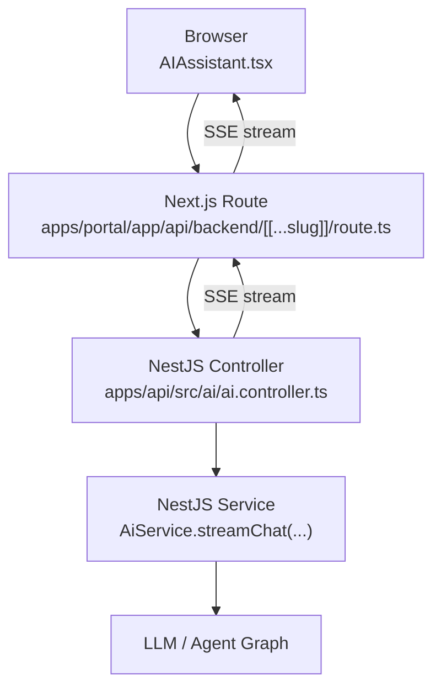
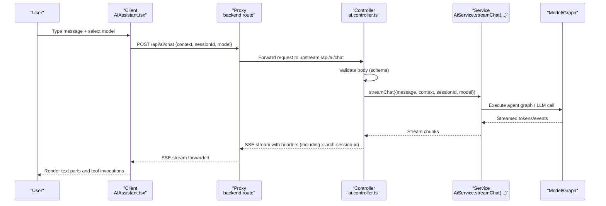
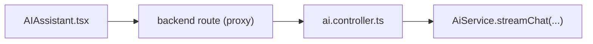

# Chat API

<cite>
**Referenced Files in This Document**
- [AIAssistant.tsx](file://apps/portal/components/ai/AIAssistant.tsx)
- [route.ts](file://apps/portal/app/api/backend/[[...slug]]/route.ts)
- [ai.controller.ts](file://apps/api/src/ai/ai.controller.ts)
</cite>

## Table of Contents

1. [Introduction](#introduction)
2. [Project Structure](#project-structure)
3. [Core Components](#core-components)
4. [Architecture Overview](#architecture-overview)
5. [Detailed Component Analysis](#detailed-component-analysis)
6. [Dependency Analysis](#dependency-analysis)
7. [Performance Considerations](#performance-considerations)
8. [Troubleshooting Guide](#troubleshooting-guide)
9. [Conclusion](#conclusion)
10. [Appendices](#appendices)

## Introduction

This document provides detailed API documentation for the chat endpoint used by the portal’s AI Assistant. It covers request/response schemas, authentication requirements, message formats, conversation history and session handling, streaming responses, tool usage patterns, rate limiting considerations, body size limits, error handling, and best practices for prompt engineering and response parsing.

The chat flow is implemented as a Next.js client component calling a backend route that proxies requests to a NestJS service which streams server-sent events (SSE).

## Project Structure

The chat feature spans three main layers:

- Frontend: A React component that manages UI state, user input, model selection, and SSE consumption via a chat hook.
- Proxy: A Next.js App Router route that forwards requests to the NestJS API under a single origin.
- Backend: A NestJS controller that validates input, orchestrates streaming, and returns SSE with headers including a session identifier.

**Diagram sources**

- [AIAssistant.tsx](file://apps/portal/components/ai/AIAssistant.tsx)
- [route.ts](file://apps/portal/app/api/backend/[[...slug]]/route.ts)
- [ai.controller.ts](file://apps/api/src/ai/ai.controller.ts)

**Section sources**

- [AIAssistant.tsx](file://apps/portal/components/ai/AIAssistant.tsx)
- [route.ts](file://apps/portal/app/api/backend/[[...slug]]/route.ts)
- [ai.controller.ts](file://apps/api/src/ai/ai.controller.ts)

## Core Components

- Frontend chat component:
  - Sends messages to the proxy route at /api/ai/chat.
  - Persists a stable sessionId across reloads using localStorage.
  - Supports model selection and renders multi-part messages including tool invocations.
- Proxy route:
  - Forwards HTTP methods and bodies to the upstream NestJS API configured via environment variables.
  - Preserves streaming by passing through the upstream response body and headers.
- NestJS controller:
  - Validates request body against a schema.
  - Generates or accepts a sessionId.
  - Streams chat responses as SSE and sets appropriate headers, including an x-arch-session-id header.

**Section sources**

- [AIAssistant.tsx](file://apps/portal/components/ai/AIAssistant.tsx)
- [route.ts](file://apps/portal/app/api/backend/[[...slug]]/route.ts)
- [ai.controller.ts](file://apps/api/src/ai/ai.controller.ts)

## Architecture Overview

End-to-end sequence for a chat request:

**Diagram sources**

- [AIAssistant.tsx](file://apps/portal/components/ai/AIAssistant.tsx)
- [route.ts](file://apps/portal/app/api/backend/[[...slug]]/route.ts)
- [ai.controller.ts](file://apps/api/src/ai/ai.controller.ts)

## Detailed Component Analysis

### Endpoint: POST /api/ai/chat

- Path: /api/ai/chat
- Method: POST
- Transport: JSON request; Server-Sent Events (SSE) response
- Authentication: The controller uses a current-user decorator to extract the authenticated user ID from the request. Ensure your client sends valid credentials/tokens expected by the NestJS auth layer.
- Content-Type: application/json
- Response Content-Type: text/event-stream
- Additional Response Headers:
  - Cache-Control: no-cache
  - Connection: keep-alive
  - x-arch-session-id: string (session identifier returned by the backend)

Request Body Schema

- Fields:
  - context: string | undefined — Optional contextual information passed to the assistant.
  - sessionId: string | undefined — Optional session identifier. If omitted, the backend generates one.
  - model: string | undefined — Optional model selector (e.g., gemma4:latest, qwen2.5-coder:7b, huihui_ai/granite3.2-abliterated:2b).
- Validation:
  - The controller validates the body against a schema and returns a 400 Bad Request with details if invalid.

Response Format

- Streaming: The response is an SSE stream. Each event contains incremental content updates.
- Session ID: The response includes x-arch-session-id to correlate subsequent requests within the same conversation.

Example Request

- URL: /api/ai/chat
- Headers:
  - Content-Type: application/json
  - Authorization: <token as required by NestJS auth>
- Body:
  - {
    "context": "Drilling operations today",
    "sessionId": "chat_1710000000_xxxxxxx",
    "model": "gemma4:latest"
    }

Example Response

- Status: 200
- Headers:
  - Content-Type: text/event-stream
  - Cache-Control: no-cache
  - Connection: keep-alive
  - x-arch-session-id: chat_1710000000_xxxxxxx
- Body: SSE events containing streamed tokens and structured parts (text and tool-invocation).

Error Handling

- Invalid request body: 400 Bad Request with validation errors.
- Network/proxy issues: Errors propagated from upstream or proxy.
- Authentication failures: Handled by NestJS auth middleware (not shown here).

Rate Limiting and Body Size Limits

- Rate limiting and body size limits are not enforced in the proxy or controller code shown. They may be applied at infrastructure levels (reverse proxy, platform gateway, or NestJS global guards/middleware). Configure these according to your deployment environment.

Best Practices

- Always include a sessionId to maintain conversation continuity.
- Use the model field to switch between available models.
- Handle SSE properly on the client side; do not buffer entire responses.

**Section sources**

- [ai.controller.ts](file://apps/api/src/ai/ai.controller.ts)
- [route.ts](file://apps/portal/app/api/backend/[[...slug]]/route.ts)

### Frontend Integration: AIAssistant.tsx

Key behaviors:

- Uses a chat hook to send messages to /api/ai/chat.
- Persists sessionId in localStorage for cross-reload continuity.
- Supports multiple models via a dropdown.
- Renders multi-part messages including tool invocations and results.
- Displays loading states and error indicators.

Message Format

- Messages support parts:
  - type: "text" with text content.
  - type: "tool-invocation" with tool name, state, and result.

Session Management

- The component generates a sessionId if none exists and stores it in localStorage.
- Subsequent requests reuse this sessionId unless explicitly overridden.

Streaming Consumption

- The chat hook handles SSE streaming and appends incremental updates to the message list.

**Section sources**

- [AIAssistant.tsx](file://apps/portal/components/ai/AIAssistant.tsx)

### Proxy Route: apps/portal/app/api/backend/[[...slug]]/route.ts

Responsibilities:

- Proxies requests from /api/backend/\* to the upstream NestJS API base URL configured via environment variables.
- Forwards method, query parameters, and body.
- Removes host and content-length headers before forwarding.
- Passes through upstream response status, headers, and body, enabling SSE streaming.

Configuration

- Upstream base URL is read from env.API_BASE_URL or defaults to http://localhost:3004/api.

Streaming Support

- Uses duplex half mode to forward streaming request bodies when needed.

**Section sources**

- [route.ts](file://apps/portal/app/api/backend/[[...slug]]/route.ts)

### Backend Controller: apps/api/src/ai/ai.controller.ts

Responsibilities:

- Defines POST /ai/chat endpoint.
- Validates request body using a schema.
- Accepts or generates sessionId.
- Calls AiService.streamChat to execute the agent graph and stream results.
- Sets SSE headers and returns x-arch-session-id.

Authentication

- Uses a current-user decorator to extract the authenticated user ID from the request.

Validation Errors

- Returns 400 Bad Request with structured error details when validation fails.

**Section sources**

- [ai.controller.ts](file://apps/api/src/ai/ai.controller.ts)

## Dependency Analysis

High-level dependencies:

- Frontend depends on the proxy route path and SSE semantics.
- Proxy depends on environment configuration for upstream API location.
- Controller depends on a schema validator and a service for streaming execution.

**Diagram sources**

- [AIAssistant.tsx](file://apps/portal/components/ai/AIAssistant.tsx)
- [route.ts](file://apps/portal/app/api/backend/[[...slug]]/route.ts)
- [ai.controller.ts](file://apps/api/src/ai/ai.controller.ts)

**Section sources**

- [AIAssistant.tsx](file://apps/portal/components/ai/AIAssistant.tsx)
- [route.ts](file://apps/portal/app/api/backend/[[...slug]]/route.ts)
- [ai.controller.ts](file://apps/api/src/ai/ai.controller.ts)

## Performance Considerations

- Streaming: Prefer SSE for long-running responses to reduce latency and improve UX.
- Session reuse: Reuse sessionId to avoid redundant context building and to enable efficient retrieval of conversation history.
- Model selection: Choose smaller/faster models for interactive use cases; larger models for complex reasoning tasks.
- Header overhead: Avoid unnecessary headers; ensure proxy strips host and content-length as implemented.
- Backpressure: Ensure clients handle backpressure correctly when consuming SSE streams.

[No sources needed since this section provides general guidance]

## Troubleshooting Guide

Common issues and resolutions:

- 400 Bad Request with validation errors:
  - Check request body fields (context, sessionId, model) match expected types.
  - Review error details returned by the controller.
- Missing x-arch-session-id:
  - Confirm the controller sets the header and the proxy forwards it.
- No streaming data:
  - Verify Content-Type is text/event-stream and Cache-Control/Connection headers are present.
  - Ensure the proxy does not buffer or transform the response body.
- Authentication failures:
  - Ensure the client sends valid credentials/tokens expected by the NestJS auth layer.
- Large payloads:
  - If encountering body size limits, check infrastructure-level configurations (reverse proxy, platform gateway).

**Section sources**

- [ai.controller.ts](file://apps/api/src/ai/ai.controller.ts)
- [route.ts](file://apps/portal/app/api/backend/[[...slug]]/route.ts)

## Conclusion

The chat endpoint provides a robust, streaming-first interface for AI-assisted interactions. By leveraging SSE, session identifiers, and validated request bodies, it supports rich conversational experiences with tool usage and multi-part responses. Proper client-side streaming handling and consistent session management are key to a smooth user experience.

[No sources needed since this section summarizes without analyzing specific files]

## Appendices

### Message Formats and Tool Usage

- Text parts:
  - type: "text"
  - text: string
- Tool invocation parts:
  - type: "tool-invocation"
  - toolName: string
  - state: "running" | "result"
  - result: any (present when state is "result")

Examples:

- Multi-part message:
  - Parts array containing both text and tool-invocation entries.
- Tool usage:
  - The assistant can invoke tools during generation; results are rendered after completion.

**Section sources**

- [AIAssistant.tsx](file://apps/portal/components/ai/AIAssistant.tsx)

### Prompt Engineering Best Practices

- Provide concise, specific instructions.
- Include relevant context in the context field to guide the model.
- Use clear role definitions and output format expectations.
- Iterate based on tool outputs to refine prompts.

### Response Parsing Best Practices

- Consume SSE incrementally; avoid buffering entire responses.
- Parse each event and update UI progressively.
- Handle partial tool invocations gracefully; wait for final results before rendering.
- Normalize text parts for display and preserve formatting where appropriate.

[No sources needed since this section provides general guidance]
