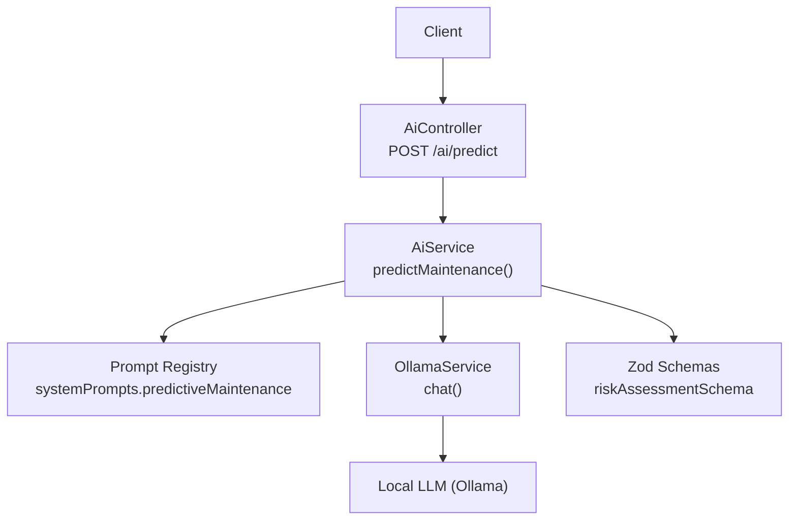
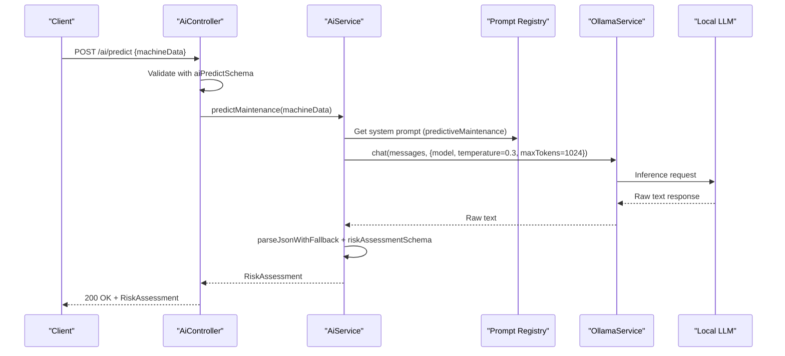
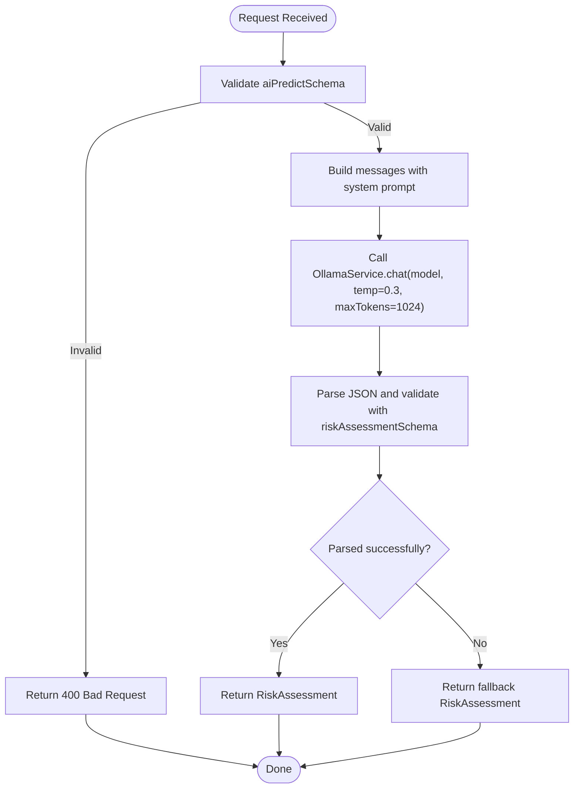
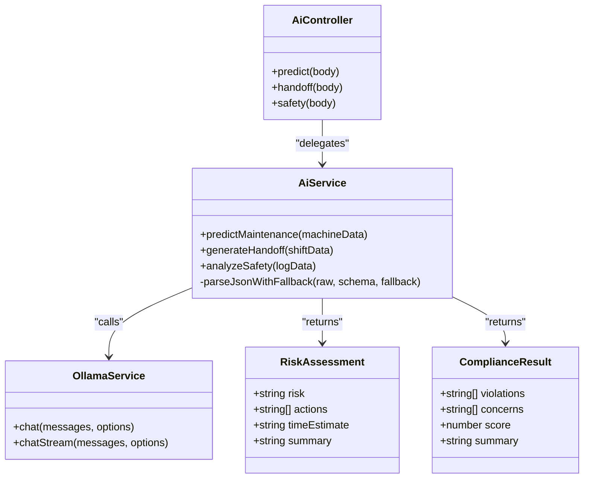
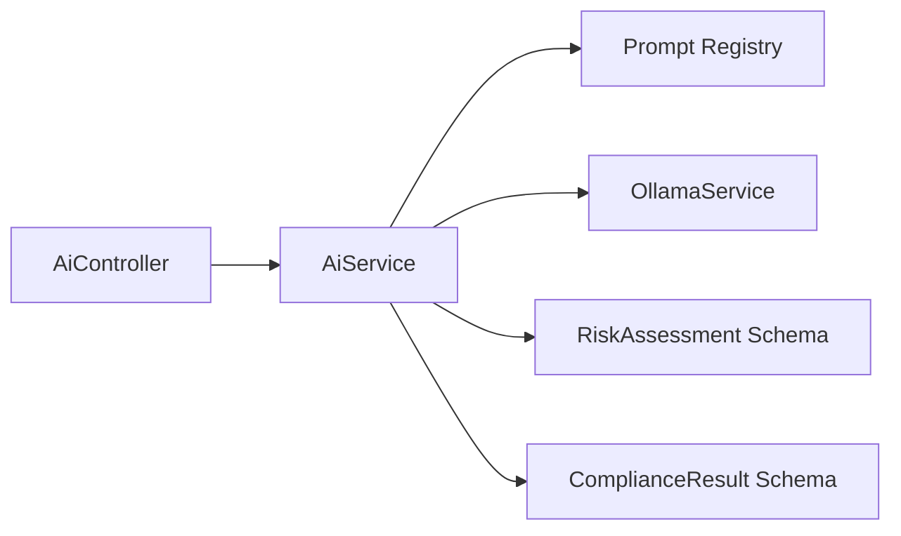

# Predictions API

<cite>
**Referenced Files in This Document**
- [ai.controller.ts](file://apps/api/src/ai/ai.controller.ts)
- [ai.service.ts](file://apps/api/src/ai/ai.service.ts)
- [schemas.ts](file://apps/api/src/common/schemas.ts)
- [schemas.ts](file://apps/api/src/ai/schemas.ts)
- [prompt-registry.service.ts](file://apps/api/src/ai/prompts/prompt-registry.service.ts)
- [ollama.service.ts](file://apps/api/src/ai/ollama/ollama.service.ts)
</cite>

## Table of Contents

1. [Introduction](#introduction)
2. [Project Structure](#project-structure)
3. [Core Components](#core-components)
4. [Architecture Overview](#architecture-overview)
5. [Detailed Component Analysis](#detailed-component-analysis)
6. [Dependency Analysis](#dependency-analysis)
7. [Performance Considerations](#performance-considerations)
8. [Troubleshooting Guide](#troubleshooting-guide)
9. [Conclusion](#conclusion)
10. [Appendices](#appendices)

## Introduction

This document provides detailed API documentation for the prediction endpoints exposed by the AI module. It focuses on machine learning model inference requests, input data formats, and response structures. The primary endpoint is a predictive maintenance risk assessment that accepts textual machine context and returns structured risk information. Operational insights generation (shift handoff reports) and safety compliance analysis are also included as related AI capabilities.

The system uses an LLM-based approach via Ollama with deterministic parameters to produce stable outputs. Responses are validated against strict schemas and include fallbacks when parsing fails.

## Project Structure

The prediction functionality is implemented within the NestJS API application under the AI module:

- Controller exposes HTTP endpoints for chat, handoff, predict, and safety.
- Service orchestrates prompts, calls the Ollama service, parses and validates responses, and applies fallbacks.
- Schemas define request and response contracts using Zod.
- Prompt registry centralizes system prompts used by the service.
- Ollama client handles model selection and streaming/non-streaming calls.

**Diagram sources**

- [ai.controller.ts:60-69](file://apps/api/src/ai/ai.controller.ts#L60-L69)
- [ai.service.ts:71-89](file://apps/api/src/ai/ai.service.ts#L71-L89)
- [prompt-registry.service.ts:11-11](file://apps/api/src/ai/prompts/prompt-registry.service.ts#L11-L11)
- [ollama.service.ts:123-123](file://apps/api/src/ai/ollama/ollama.service.ts#L123-L123)
- [schemas.ts:3-8](file://apps/api/src/ai/schemas.ts#L3-L8)

**Section sources**

- [ai.controller.ts:1-82](file://apps/api/src/ai/ai.controller.ts#L1-L82)
- [ai.service.ts:1-130](file://apps/api/src/ai/ai.service.ts#L1-L130)
- [schemas.ts:136-138](file://apps/api/src/common/schemas.ts#L136-L138)
- [schemas.ts:3-8](file://apps/api/src/ai/schemas.ts#L3-L8)

## Core Components

- Prediction Endpoint: POST /ai/predict
  - Purpose: Generate predictive maintenance risk assessment from provided machine data.
  - Request body: aiPredictSchema
    - machineData: string (required, min 1, max 50000)
  - Response body: RiskAssessment schema
    - risk: enum ["low", "medium", "high"]
    - actions: array of strings
    - timeEstimate: string
    - summary: string
- Related Endpoints:
  - POST /ai/handoff: Generates shift handoff report from shiftData.
  - POST /ai/safety: Analyzes shift logs for safety compliance; returns ComplianceResult.

Model selection and inference parameters:

- Model: DEFAULT_MODEL (selected by OllamaService).
- Temperature: 0.3 for deterministic outputs.
- Max tokens: 1024.

Validation and fallback:

- Input validation via Zod at controller layer.
- Output parsed and validated via Zod; if parsing fails, a safe fallback object is returned.

Operational insights and trend analysis:

- Handoff endpoint produces operational summaries suitable for shift transitions.
- Safety endpoint identifies violations and concerns, providing a compliance score.

Note: Batch predictions are not natively supported by this endpoint; clients should iterate over items or implement batching at the caller side.

**Section sources**

- [ai.controller.ts:60-69](file://apps/api/src/ai/ai.controller.ts#L60-L69)
- [schemas.ts:136-138](file://apps/api/src/common/schemas.ts#L136-L138)
- [schemas.ts:3-8](file://apps/api/src/ai/schemas.ts#L3-L8)
- [ai.service.ts:71-89](file://apps/api/src/ai/ai.service.ts#L71-L89)
- [ai.service.ts:56-69](file://apps/api/src/ai/ai.service.ts#L56-L69)
- [ai.service.ts:91-109](file://apps/api/src/ai/ai.service.ts#L91-L109)
- [ollama.service.ts:123-123](file://apps/api/src/ai/ollama/ollama.service.ts#L123-L123)

## Architecture Overview

The prediction flow involves request validation, prompt assembly, LLM inference, JSON parsing, schema validation, and fallback handling.

**Diagram sources**

- [ai.controller.ts:60-69](file://apps/api/src/ai/ai.controller.ts#L60-L69)
- [ai.service.ts:71-89](file://apps/api/src/ai/ai.service.ts#L71-L89)
- [prompt-registry.service.ts:11-11](file://apps/api/src/ai/prompts/prompt-registry.service.ts#L11-L11)
- [ollama.service.ts:123-123](file://apps/api/src/ai/ollama/ollama.service.ts#L123-L123)
- [schemas.ts:3-8](file://apps/api/src/ai/schemas.ts#L3-L8)

## Detailed Component Analysis

### Prediction Endpoint: POST /ai/predict

- Path: /ai/predict
- Method: POST
- Authentication: Depends on global API auth configuration (controller uses decorators; authentication behavior is enforced elsewhere).
- Request Body:
  - machineData: string (required, length constraints apply)
- Response Body:
  - risk: enum ["low", "medium", "high"]
  - actions: array of strings
  - timeEstimate: string
  - summary: string
- Behavior:
  - Validates input with aiPredictSchema.
  - Calls AiService.predictMaintenance which constructs messages using system prompts and user-provided machineData.
  - Invokes OllamaService.chat with deterministic settings (temperature 0.3, maxTokens 1024).
  - Parses and validates output with riskAssessmentSchema; falls back to a safe default on parse failure.

**Diagram sources**

- [ai.controller.ts:60-69](file://apps/api/src/ai/ai.controller.ts#L60-L69)
- [ai.service.ts:71-89](file://apps/api/src/ai/ai.service.ts#L71-L89)
- [schemas.ts:136-138](file://apps/api/src/common/schemas.ts#L136-L138)
- [schemas.ts:3-8](file://apps/api/src/ai/schemas.ts#L3-L8)

**Section sources**

- [ai.controller.ts:60-69](file://apps/api/src/ai/ai.controller.ts#L60-L69)
- [ai.service.ts:71-89](file://apps/api/src/ai/ai.service.ts#L71-L89)
- [schemas.ts:136-138](file://apps/api/src/common/schemas.ts#L136-L138)
- [schemas.ts:3-8](file://apps/api/src/ai/schemas.ts#L3-L8)

### Operational Insights: POST /ai/handoff

- Path: /ai/handoff
- Method: POST
- Request Body:
  - shiftData: string (required, length constraints apply)
- Response Body:
  - content: string (handoff report)
- Behavior:
  - Uses system prompt for shift handoff generation.
  - Calls OllamaService.chat with deterministic parameters.

**Section sources**

- [ai.controller.ts:49-58](file://apps/api/src/ai/ai.controller.ts#L49-L58)
- [ai.service.ts:56-69](file://apps/api/src/ai/ai.service.ts#L56-L69)

### Safety Compliance: POST /ai/safety

- Path: /ai/safety
- Method: POST
- Request Body:
  - logData: string (required, length constraints apply)
- Response Body:
  - violations: array of strings
  - concerns: array of strings
  - score: number between 1 and 10
  - summary: string
- Behavior:
  - Uses system prompt for safety compliance analysis.
  - Calls OllamaService.chat with deterministic parameters.
  - Validates output with complianceResultSchema; falls back to a safe default on parse failure.

**Section sources**

- [ai.controller.ts:71-80](file://apps/api/src/ai/ai.controller.ts#L71-L80)
- [ai.service.ts:91-109](file://apps/api/src/ai/ai.service.ts#L91-L109)
- [schemas.ts:12-17](file://apps/api/src/ai/schemas.ts#L12-L17)

### Data Models

**Diagram sources**

- [ai.controller.ts:60-80](file://apps/api/src/ai/ai.controller.ts#L60-L80)
- [ai.service.ts:56-109](file://apps/api/src/ai/ai.service.ts#L56-L109)
- [schemas.ts:3-8](file://apps/api/src/ai/schemas.ts#L3-L8)
- [schemas.ts:12-17](file://apps/api/src/ai/schemas.ts#L12-L17)

## Dependency Analysis

- Controller depends on:
  - Validation schemas (aiPredictSchema, aiHandoffSchema, aiSafetySchema).
  - AiService for business logic.
- Service depends on:
  - Prompt registry for system prompts.
  - OllamaService for LLM inference.
  - Zod schemas for output validation and fallbacks.
- OllamaService configures model selection and token limits.

**Diagram sources**

- [ai.controller.ts:60-80](file://apps/api/src/ai/ai.controller.ts#L60-L80)
- [ai.service.ts:71-109](file://apps/api/src/ai/ai.service.ts#L71-L109)
- [prompt-registry.service.ts:11-11](file://apps/api/src/ai/prompts/prompt-registry.service.ts#L11-L11)
- [ollama.service.ts:123-123](file://apps/api/src/ai/ollama/ollama.service.ts#L123-L123)
- [schemas.ts:3-8](file://apps/api/src/ai/schemas.ts#L3-L8)
- [schemas.ts:12-17](file://apps/api/src/ai/schemas.ts#L12-L17)

**Section sources**

- [ai.controller.ts:1-82](file://apps/api/src/ai/ai.controller.ts#L1-L82)
- [ai.service.ts:1-130](file://apps/api/src/ai/ai.service.ts#L1-L130)
- [prompt-registry.service.ts:11-11](file://apps/api/src/ai/prompts/prompt-registry.service.ts#L11-L11)
- [ollama.service.ts:123-123](file://apps/api/src/ai/ollama/ollama.service.ts#L123-L123)
- [schemas.ts:3-8](file://apps/api/src/ai/schemas.ts#L3-L8)
- [schemas.ts:12-17](file://apps/api/src/ai/schemas.ts#L12-L17)

## Performance Considerations

- Deterministic inference:
  - Temperature set to 0.3 for stability and reduced variance.
  - Max tokens capped at 1024 to limit response size and latency.
- Streaming alternative:
  - Chat endpoint supports streaming; consider adopting streaming for long-running analyses if needed.
- Caching strategies:
  - Implement client-side or server-side caching keyed by normalized inputs (e.g., hash of machineData) to avoid redundant LLM calls.
  - Use short TTLs for volatile contexts and longer TTLs for static historical summaries.
- Batching:
  - No native batch endpoint; callers can aggregate multiple machineData entries and send them sequentially or concurrently with rate limiting.
- Rate limiting and backpressure:
  - Apply per-client rate limits upstream (API gateway or middleware) to protect the LLM backend.
- Concurrency:
  - Parallelize independent requests while respecting provider quotas and local resource constraints.

[No sources needed since this section provides general guidance]

## Troubleshooting Guide

Common issues and resolutions:

- Invalid request body:
  - Symptom: 400 Bad Request with validation errors.
  - Cause: Missing or malformed fields per aiPredictSchema.
  - Resolution: Ensure machineData is present and within length limits.
- Parsing failures:
  - Symptom: Response contains fallback values instead of expected structure.
  - Cause: LLM returned non-JSON or invalid JSON not matching schema.
  - Resolution: Inspect raw response logs; refine prompts or post-process to enforce JSON-only outputs.
- Model availability:
  - Symptom: Timeouts or errors from OllamaService.
  - Cause: Local LLM not running or overloaded.
  - Resolution: Verify Ollama service health and capacity; adjust concurrency and timeouts.

**Section sources**

- [ai.controller.ts:60-69](file://apps/api/src/ai/ai.controller.ts#L60-L69)
- [ai.service.ts:120-128](file://apps/api/src/ai/ai.service.ts#L120-L128)

## Conclusion

The Predictions API provides a robust, schema-validated interface for generating predictive maintenance assessments and related operational insights. With deterministic inference parameters and strong fallback mechanisms, it balances reliability and performance. Clients should implement caching and rate limiting to optimize throughput and resilience.

[No sources needed since this section summarizes without analyzing specific files]

## Appendices

### API Reference Summary

- POST /ai/predict
  - Request: { machineData: string }
  - Response: { risk: "low"|"medium"|"high", actions: string[], timeEstimate: string, summary: string }
- POST /ai/handoff
  - Request: { shiftData: string }
  - Response: { content: string }
- POST /ai/safety
  - Request: { logData: string }
  - Response: { violations: string[], concerns: string[], score: number, summary: string }

**Section sources**

- [ai.controller.ts:49-80](file://apps/api/src/ai/ai.controller.ts#L49-L80)
- [schemas.ts:132-142](file://apps/api/src/common/schemas.ts#L132-L142)
- [schemas.ts:3-8](file://apps/api/src/ai/schemas.ts#L3-L8)
- [schemas.ts:12-17](file://apps/api/src/ai/schemas.ts#L12-L17)
