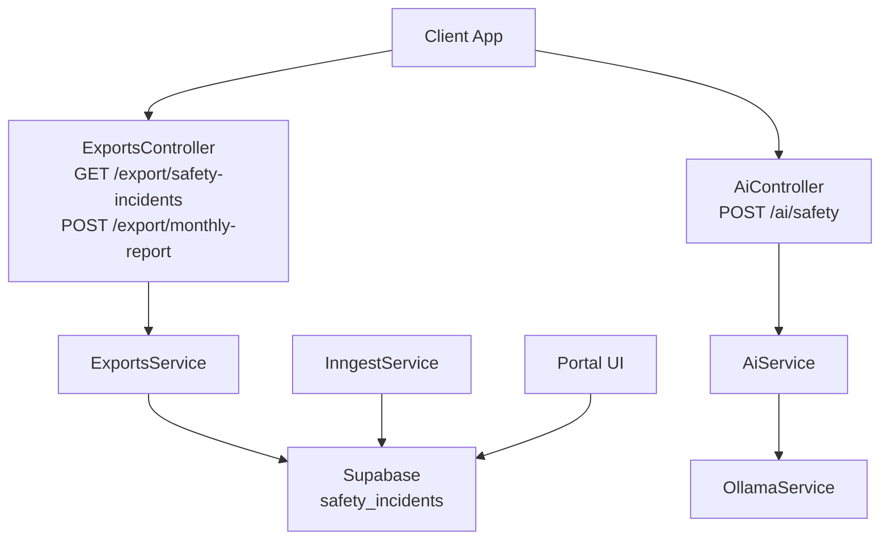
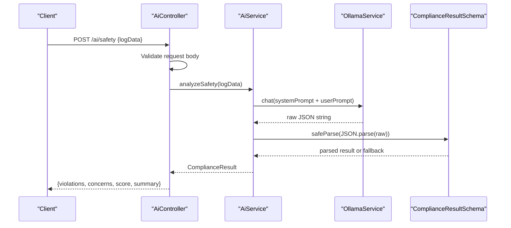
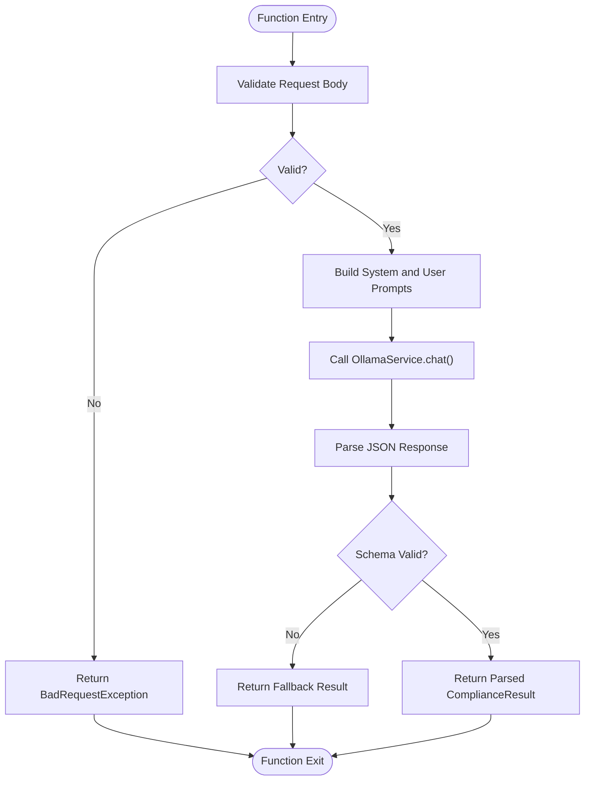
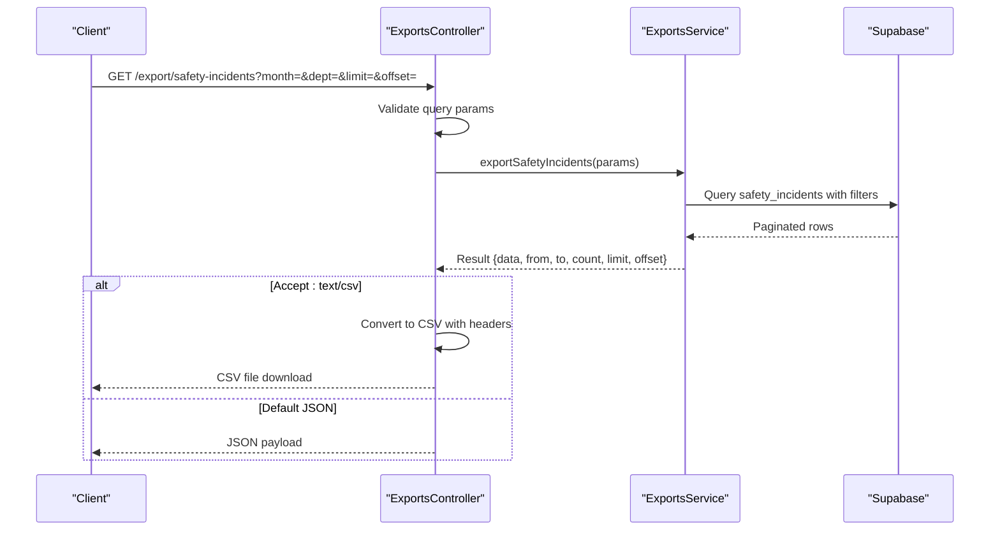
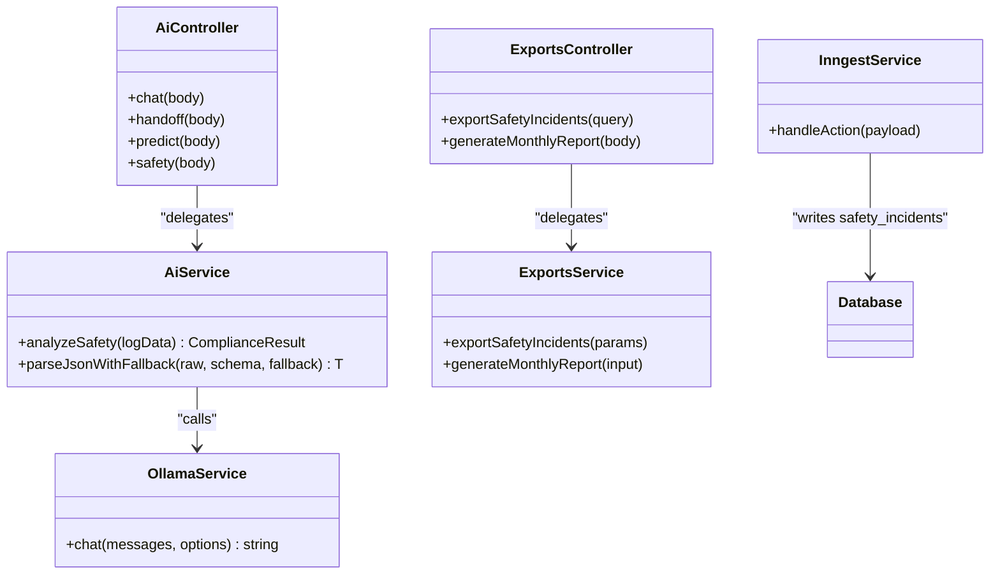

# Safety Analysis API

<cite>
**Referenced Files in This Document**
- [ai.controller.ts](file://apps/api/src/ai/ai.controller.ts)
- [ai.service.ts](file://apps/api/src/ai/ai.service.ts)
- [schemas.ts](file://apps/api/src/ai/schemas.ts)
- [exports.controller.ts](file://apps/api/src/exports/exports.controller.ts)
- [exports.service.ts](file://apps/api/src/exports/exports.service.ts)
- [inngest.service.ts](file://apps/api/src/jobs/inngest.service.ts)
- [database.types.ts](file://packages/supabase/src/database.types.ts)
- [page.tsx](file://apps/portal/app/(hub)/page.tsx)
- [daily-log/page.tsx](file://apps/portal/app/(departments)/[department]/daily-log/page.tsx)
</cite>

## Table of Contents

1. [Introduction](#introduction)
2. [Project Structure](#project-structure)
3. [Core Components](#core-components)
4. [Architecture Overview](#architecture-overview)
5. [Detailed Component Analysis](#detailed-component-analysis)
6. [Dependency Analysis](#dependency-analysis)
7. [Performance Considerations](#performance-considerations)
8. [Troubleshooting Guide](#troubleshooting-guide)
9. [Conclusion](#conclusion)
10. [Appendices](#appendices)

## Introduction

This document provides detailed API documentation for safety analysis endpoints, focusing on:

- Incident detection and export capabilities
- Risk assessment models for predictive maintenance
- Safety compliance checks via AI-driven analysis
- Hazard identification, safety protocol validation, and alert generation
- Analysis parameters, severity scoring, and recommendation outputs
- Examples of safety report generation, violation detection, and compliance monitoring
- Accuracy metrics, false positive handling, and integration with safety workflows

The system exposes REST endpoints for exporting safety incidents and generating monthly PDF reports, as well as an AI-powered endpoint to analyze shift logs for safety compliance and produce structured results including violations, concerns, scores, and summaries.

## Project Structure

Safety-related functionality spans the API layer (NestJS), AI service orchestration, job processing, and portal consumption:

- API controllers expose endpoints for exports and AI analysis
- AI service orchestrates model calls and parses structured responses
- Exports service queries database tables for safety incidents and generates CSV/PDF artifacts
- Jobs service handles idempotent creation of safety incidents from external triggers
- Portal UI consumes safety data and maps severities for alerts and dashboards

**Diagram sources**

- [exports.controller.ts:88-111](file://apps/api/src/exports/exports.controller.ts#L88-L111)
- [exports.service.ts:209-243](file://apps/api/src/exports/exports.service.ts#L209-L243)
- [ai.controller.ts:71-80](file://apps/api/src/ai/ai.controller.ts#L71-L80)
- [ai.service.ts:91-109](file://apps/api/src/ai/ai.service.ts#L91-L109)
- [inngest.service.ts:115-124](file://apps/api/src/jobs/inngest.service.ts#L115-L124)
- [database.types.ts:7723-7735](file://packages/supabase/src/database.types.ts#L7723-L7735)

**Section sources**

- [exports.controller.ts:88-111](file://apps/api/src/exports/exports.controller.ts#L88-L111)
- [ai.controller.ts:71-80](file://apps/api/src/ai/ai.controller.ts#L71-L80)
- [ai.service.ts:91-109](file://apps/api/src/ai/ai.service.ts#L91-L109)
- [exports.service.ts:209-243](file://apps/api/src/exports/exports.service.ts#L209-L243)
- [inngest.service.ts:115-124](file://apps/api/src/jobs/inngest.service.ts#L115-L124)
- [database.types.ts:7723-7735](file://packages/supabase/src/database.types.ts#L7723-L7735)

## Core Components

- Safety Incidents Export Endpoint
  - GET /export/safety-incidents supports filtering by month and department, pagination via limit/offset, and CSV or JSON output based on Accept header.
  - Query parameters: month, dept, limit, offset.
  - Response includes paginated dataset and date range metadata; CSV headers include id, incident_date, incident_type, severity, status, department_id, description.
- Monthly Report Generation
  - POST /export/monthly-report accepts reportData and departmentId, returns a URL to the generated PDF.
- Safety Compliance Analysis
  - POST /ai/safety analyzes shift logs for safety compliance and returns structured JSON with violations, concerns, score, and summary.
- Idempotent Safety Incident Creation
  - Background jobs can create safety incidents using idempotency keys to avoid duplicates.

**Section sources**

- [exports.controller.ts:88-111](file://apps/api/src/exports/exports.controller.ts#L88-L111)
- [exports.controller.ts:113-128](file://apps/api/src/exports/exports.controller.ts#L113-L128)
- [ai.controller.ts:71-80](file://apps/api/src/ai/ai.controller.ts#L71-L80)
- [inngest.service.ts:115-124](file://apps/api/src/jobs/inngest.service.ts#L115-L124)

## Architecture Overview

The safety analysis architecture integrates AI-driven compliance checks with operational exports and background job processing:

- The AI controller routes safety analysis requests to the AI service, which composes prompts and calls the LLM via OllamaService. Responses are validated against schemas and returned as structured objects.
- The exports controller provides data access to safety incidents for reporting and analytics, supporting CSV and JSON formats.
- The jobs service ensures reliable creation of safety incidents with idempotency, preventing duplicate records when triggered by external systems.
- The portal UI consumes safety data and maps severity levels to standardized alert severities for dashboards and notifications.

**Diagram sources**

- [ai.controller.ts:71-80](file://apps/api/src/ai/ai.controller.ts#L71-L80)
- [ai.service.ts:91-109](file://apps/api/src/ai/ai.service.ts#L91-L109)
- [schemas.ts:12-17](file://apps/api/src/ai/schemas.ts#L12-L17)

## Detailed Component Analysis

### Safety Compliance Analysis Endpoint

- Endpoint: POST /ai/safety
- Purpose: Analyze shift logs for safety compliance, identify hazards, validate protocols, and generate recommendations.
- Request Body: logData (string) containing shift logs to be analyzed.
- Response: Structured object with fields:
  - violations: array of strings describing detected violations
  - concerns: array of strings describing potential risks or areas of concern
  - score: number between 1 and 10 representing overall compliance score
  - summary: human-readable summary of findings and recommendations
- Processing Logic:
  - Compose system prompt for safety compliance and user prompt with logData
  - Call LLM via OllamaService with constrained temperature and token limits
  - Parse response using schema validation; return fallback if parsing fails
- Error Handling:
  - Invalid request bodies return BadRequestException with details
  - Parsing failures return a safe fallback structure to ensure consistent API behavior

**Diagram sources**

- [ai.controller.ts:71-80](file://apps/api/src/ai/ai.controller.ts#L71-L80)
- [ai.service.ts:91-109](file://apps/api/src/ai/ai.service.ts#L91-L109)
- [schemas.ts:12-17](file://apps/api/src/ai/schemas.ts#L12-L17)

**Section sources**

- [ai.controller.ts:71-80](file://apps/api/src/ai/ai.controller.ts#L71-L80)
- [ai.service.ts:91-109](file://apps/api/src/ai/ai.service.ts#L91-L109)
- [schemas.ts:12-17](file://apps/api/src/ai/schemas.ts#L12-L17)

### Safety Incidents Export Endpoint

- Endpoint: GET /export/safety-incidents
- Purpose: Retrieve safety incidents for reporting and analysis, supporting CSV and JSON outputs.
- Query Parameters:
  - month: filter by month
  - dept: filter by department ID
  - limit: page size
  - offset: pagination offset
- Output Formats:
  - JSON: returns paginated dataset with metadata (from/to dates, count, limit, offset)
  - CSV: sets Content-Type to text/csv and includes attachment filename with date range
- Data Fields: id, incident_date, incident_type, severity, status, department_id, description
- Implementation Notes:
  - Uses Supabase query builder to filter and paginate safety_incidents
  - Throws error if database query fails
  - Supports optional department filtering

**Diagram sources**

- [exports.controller.ts:88-111](file://apps/api/src/exports/exports.controller.ts#L88-L111)
- [exports.service.ts:209-233](file://apps/api/src/exports/exports.service.ts#L209-L233)
- [database.types.ts:7723-7735](file://packages/supabase/src/database.types.ts#L7723-L7735)

**Section sources**

- [exports.controller.ts:88-111](file://apps/api/src/exports/exports.controller.ts#L88-L111)
- [exports.service.ts:209-233](file://apps/api/src/exports/exports.service.ts#L209-L233)
- [database.types.ts:7723-7735](file://packages/supabase/src/database.types.ts#L7723-L7735)

### Monthly Safety Report Generation

- Endpoint: POST /export/monthly-report
- Purpose: Generate a monthly PDF report from provided reportData and departmentId.
- Request Body:
  - reportData: any (structured data for report content)
  - departmentId: string (required)
- Response: Object with success flag and URL to the generated PDF
- Implementation Notes:
  - Requires authenticated user context
  - Validates presence of departmentId
  - Uses React PDF renderer to construct and upload the report

**Section sources**

- [exports.controller.ts:113-128](file://apps/api/src/exports/exports.controller.ts#L113-L128)
- [exports.service.ts:235-243](file://apps/api/src/exports/exports.service.ts#L235-L243)

### Idempotent Safety Incident Creation

- Purpose: Create safety incidents from external triggers while preventing duplicates via idempotency keys.
- Processing Logic:
  - Check existing record by idempotency_key
  - If exists, bypass creation and return success
  - Otherwise, insert new safety incident record
- Integration Points:
  - Used by background jobs to reliably process incoming events
  - Ensures data consistency across distributed systems

**Section sources**

- [inngest.service.ts:115-124](file://apps/api/src/jobs/inngest.service.ts#L115-L124)

### Severity Mapping and Alert Generation

- Purpose: Map internal severity levels to standardized alert severities for dashboard and notification systems.
- Logic:
  - Critical: includes critical, high, severe
  - Warning: includes warning, medium, moderate
  - Info: default for other cases
- Usage:
  - Applied when aggregating safety incidents into hub alerts
  - Ensures consistent presentation across UI components

**Section sources**

- [page.tsx](<file://apps/portal/app/(hub)/page.tsx#L215-L252>)

## Dependency Analysis

Key dependencies and relationships:

- AiController depends on AiService for safety analysis logic
- AiService depends on OllamaService for LLM interactions and uses schema validators for response parsing
- ExportsController depends on ExportsService for data retrieval and formatting
- InngestService interacts directly with Supabase for idempotent incident creation
- Portal UI consumes safety data and performs client-side severity mapping

**Diagram sources**

- [ai.controller.ts:71-80](file://apps/api/src/ai/ai.controller.ts#L71-L80)
- [ai.service.ts:91-109](file://apps/api/src/ai/ai.service.ts#L91-L109)
- [exports.controller.ts:88-111](file://apps/api/src/exports/exports.controller.ts#L88-L111)
- [exports.service.ts:209-233](file://apps/api/src/exports/exports.service.ts#L209-L233)
- [inngest.service.ts:115-124](file://apps/api/src/jobs/inngest.service.ts#L115-L124)

**Section sources**

- [ai.controller.ts:71-80](file://apps/api/src/ai/ai.controller.ts#L71-L80)
- [ai.service.ts:91-109](file://apps/api/src/ai/ai.service.ts#L91-L109)
- [exports.controller.ts:88-111](file://apps/api/src/exports/exports.controller.ts#L88-L111)
- [exports.service.ts:209-233](file://apps/api/src/exports/exports.service.ts#L209-L233)
- [inngest.service.ts:115-124](file://apps/api/src/jobs/inngest.service.ts#L115-L124)

## Performance Considerations

- Streaming Chat: The chat endpoint streams responses to reduce latency and improve user experience for long-running analyses.
- Pagination: Export endpoints support limit and offset to handle large datasets efficiently.
- Caching: Portal UI uses caching strategies for aggregated alerts to minimize repeated database queries.
- Idempotency: Background jobs use idempotency keys to prevent redundant operations and ensure data consistency.

## Troubleshooting Guide

Common issues and resolutions:

- Invalid Request Bodies: Ensure all required fields are present and properly formatted. The API returns detailed validation errors.
- Database Query Failures: Check network connectivity and database permissions when export endpoints fail.
- AI Response Parsing Errors: If the LLM returns malformed JSON, the system falls back to a safe structure. Review prompts and model settings for improved accuracy.
- Duplicate Incidents: Verify idempotency keys are unique per event source to prevent accidental duplication.

**Section sources**

- [ai.controller.ts:71-80](file://apps/api/src/ai/ai.controller.ts#L71-L80)
- [ai.service.ts:120-128](file://apps/api/src/ai/ai.service.ts#L120-L128)
- [exports.service.ts:222-223](file://apps/api/src/exports/exports.service.ts#L222-L223)
- [inngest.service.ts:115-124](file://apps/api/src/jobs/inngest.service.ts#L115-L124)

## Conclusion

The Safety Analysis API provides comprehensive capabilities for incident management, compliance analysis, and reporting. By combining AI-driven insights with robust data exports and background job processing, the system enables proactive safety monitoring and informed decision-making. The structured response formats and validation mechanisms ensure reliability and consistency across integrations.

## Appendices

### API Reference Summary

#### Safety Compliance Analysis

- Endpoint: POST /ai/safety
- Request: { logData: string }
- Response: { violations: string[], concerns: string[], score: number(1-10), summary: string }
- Use Cases:
  - Hazard identification in shift logs
  - Safety protocol validation
  - Recommendation generation for corrective actions

#### Safety Incidents Export

- Endpoint: GET /export/safety-incidents
- Query Params: month, dept, limit, offset
- Response Formats: JSON or CSV (based on Accept header)
- Use Cases:
  - Compliance monitoring
  - Trend analysis
  - Audit reporting

#### Monthly Safety Report Generation

- Endpoint: POST /export/monthly-report
- Request: { reportData: any, departmentId: string }
- Response: { success: true, url: string }
- Use Cases:
  - Automated report generation
  - Regulatory compliance documentation
  - Management review materials

### Data Models

#### Compliance Result Schema

- violations: Array of strings describing detected violations
- concerns: Array of strings describing potential risks
- score: Number between 1 and 10 representing compliance level
- summary: Human-readable analysis summary

#### Risk Assessment Schema

- risk: Enum value (low, medium, high)
- actions: Array of recommended actions
- timeEstimate: String indicating timeframe for action
- summary: Brief explanation of assessment

**Section sources**

- [schemas.ts:3-8](file://apps/api/src/ai/schemas.ts#L3-L8)
- [schemas.ts:12-17](file://apps/api/src/ai/schemas.ts#L12-L17)
