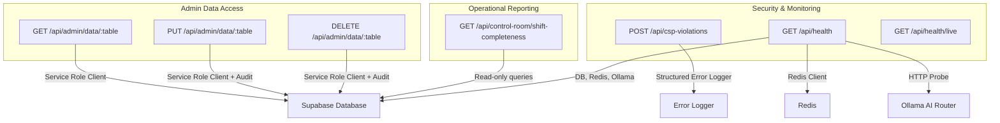
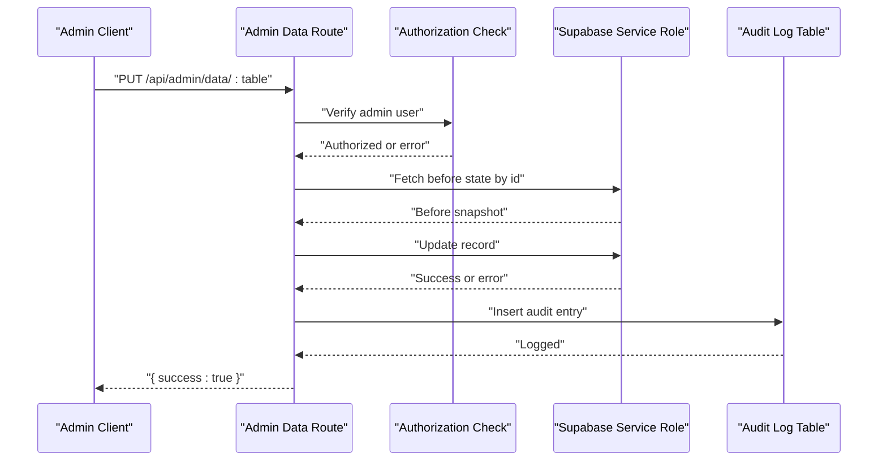
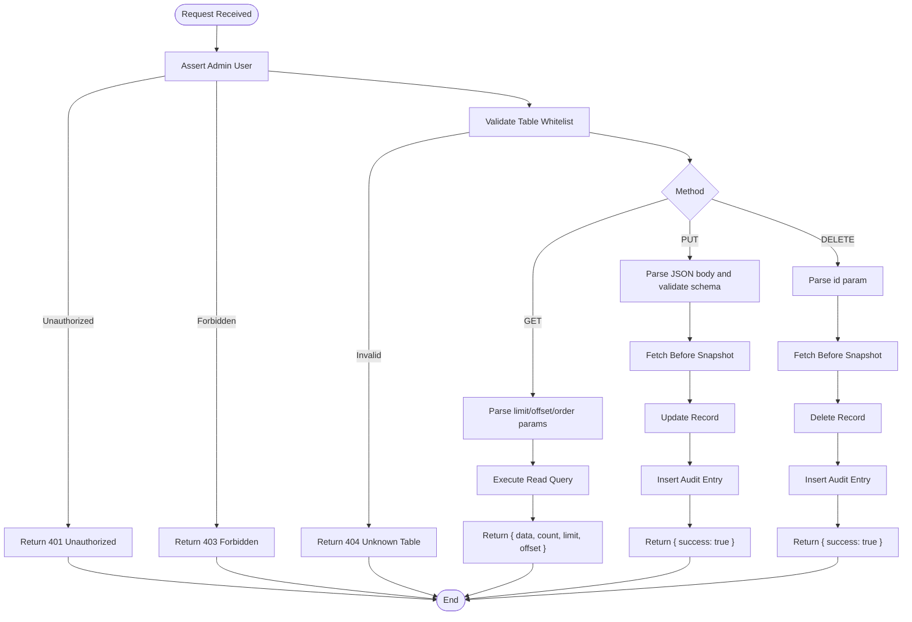
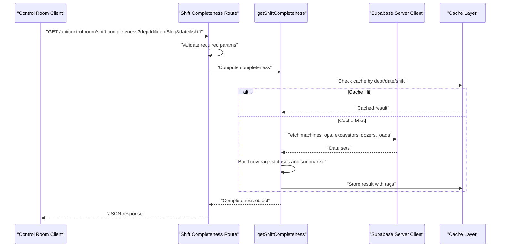
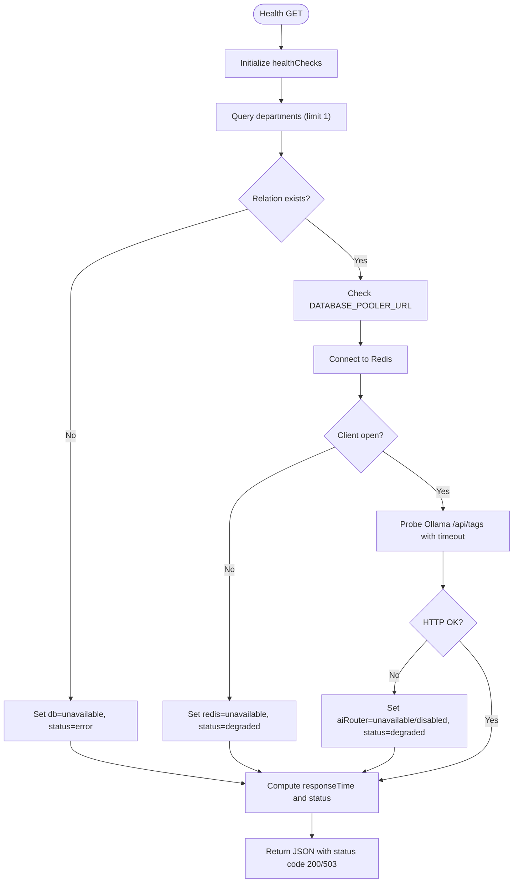
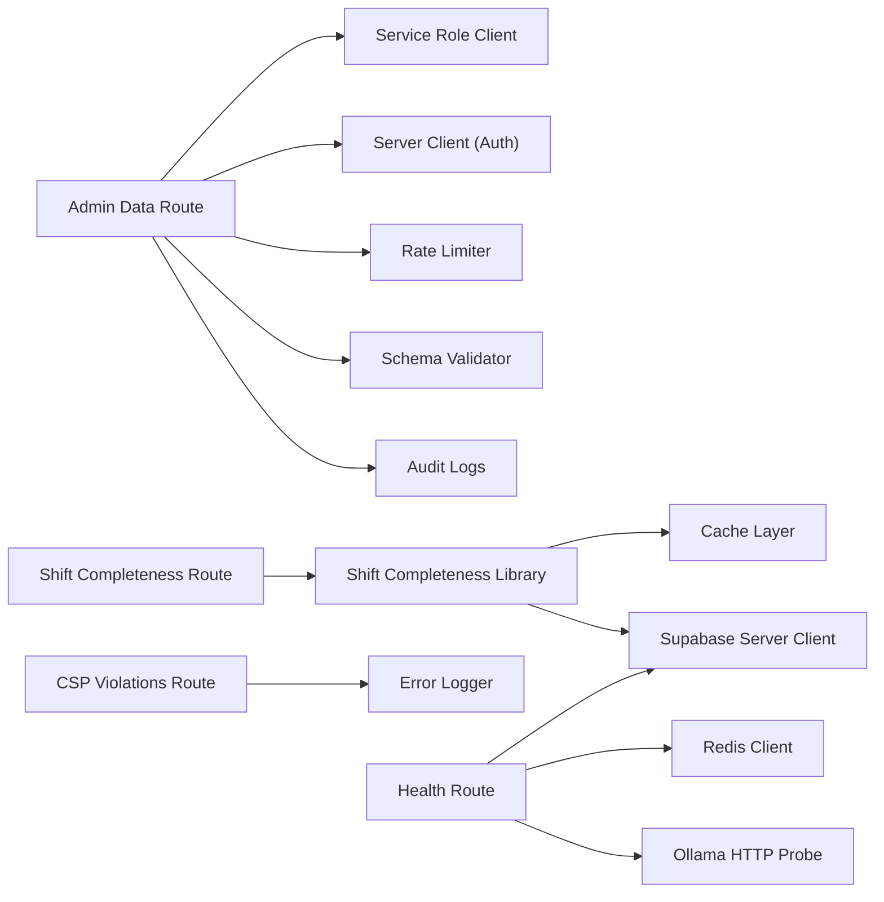

# Administrative API

<cite>
**Referenced Files in This Document**
- [route.ts](file://apps/portal/app/api/admin/data/[table]/route.ts)
- [shift-completeness/route.ts](file://apps/portal/app/api/control-room/shift-completeness/route.ts)
- [shift-completeness.ts](file://apps/portal/lib/shift-completeness.ts)
- [csp-violations/route.ts](file://apps/portal/app/api/csp-violations/route.ts)
- [health/route.ts](file://apps/portal/app/api/health/route.ts)
- [health/live/route.ts](file://apps/portal/app/api/health/live/route.ts)
</cite>

## Table of Contents

1. [Introduction](#introduction)
2. [Project Structure](#project-structure)
3. [Core Components](#core-components)
4. [Architecture Overview](#architecture-overview)
5. [Detailed Component Analysis](#detailed-component-analysis)
6. [Dependency Analysis](#dependency-analysis)
7. [Performance Considerations](#performance-considerations)
8. [Troubleshooting Guide](#troubleshooting-guide)
9. [Conclusion](#conclusion)
10. [Appendices](#appendices)

## Introduction

This document provides comprehensive API documentation for administrative endpoints, focusing on:

- Admin data access with table-specific routing and CRUD operations
- Bulk data operations via pagination and ordering
- Shift completeness calculations for operational reporting
- CSP violation reporting endpoint
- System health checks for monitoring and readiness
- Authorization requirements, audit logging, security considerations, and compliance guidance

The administrative APIs are implemented as Next.js App Router handlers and integrate with Supabase (service role client for admin writes), Redis-based caching, and structured error logging.

## Project Structure

Administrative endpoints are organized under the portal app’s API routes:

- Admin data access: apps/portal/app/api/admin/data/[table]/route.ts
- Shift completeness calculation: apps/portal/app/api/control-room/shift-completeness/route.ts
- CSP violation reporting: apps/portal/app/api/csp-violations/route.ts
- Health checks: apps/portal/app/api/health/route.ts and apps/portal/app/api/health/live/route.ts

**Diagram sources**

- [route.ts:1-228](file://apps/portal/app/api/admin/data/[table]/route.ts#L1-L228)
- [shift-completeness/route.ts:1-40](file://apps/portal/app/api/control-room/shift-completeness/route.ts#L1-L40)
- [csp-violations/route.ts:1-65](file://apps/portal/app/api/csp-violations/route.ts#L1-L65)
- [health/route.ts:1-83](file://apps/portal/app/api/health/route.ts#L1-L83)
- [health/live/route.ts:1-9](file://apps/portal/app/api/health/live/route.ts#L1-L9)

**Section sources**

- [route.ts:1-228](file://apps/portal/app/api/admin/data/[table]/route.ts#L1-L228)
- [shift-completeness/route.ts:1-40](file://apps/portal/app/api/control-room/shift-completeness/route.ts#L1-L40)
- [csp-violations/route.ts:1-65](file://apps/portal/app/api/csp-violations/route.ts#L1-L65)
- [health/route.ts:1-83](file://apps/portal/app/api/health/route.ts#L1-L83)
- [health/live/route.ts:1-9](file://apps/portal/app/api/health/live/route.ts#L1-L9)

## Core Components

- Admin Data Access Endpoint
  - Provides GET, PUT, DELETE operations against a controlled set of operational tables.
  - Enforces admin authorization and rate limiting.
  - Logs updates and deletions to an audit log table.
- Shift Completeness Calculation
  - Computes shift coverage across multiple form tables based on machine types and exemptions.
  - Uses caching to reduce database load and improve response times.
- CSP Violation Reporting
  - Accepts browser CSP reports and logs them for monitoring; returns 204 per spec.
- Health Checks
  - Comprehensive health probe including database, pooler configuration, Redis availability, and optional AI router reachability.
  - Lightweight liveness check for quick probes.

**Section sources**

- [route.ts:1-228](file://apps/portal/app/api/admin/data/[table]/route.ts#L1-L228)
- [shift-completeness.ts:1-324](file://apps/portal/lib/shift-completeness.ts#L1-L324)
- [csp-violations/route.ts:1-65](file://apps/portal/app/api/csp-violations/route.ts#L1-L65)
- [health/route.ts:1-83](file://apps/portal/app/api/health/route.ts#L1-L83)
- [health/live/route.ts:1-9](file://apps/portal/app/api/health/live/route.ts#L1-L9)

## Architecture Overview

The administrative API follows a layered approach:

- Request handling at route level with authorization and input validation
- Business logic encapsulated in library functions (e.g., shift completeness)
- Data access through Supabase clients (service role for admin writes)
- Observability via structured logging and health checks

**Diagram sources**

- [route.ts:111-171](file://apps/portal/app/api/admin/data/[table]/route.ts#L111-L171)

## Detailed Component Analysis

### Admin Data Access: Table-Specific CRUD

- Base path: /api/admin/data/:table
- Allowed tables: Controlled whitelist of operational tables (e.g., machines, daily_logs, production_logs, etc.)
- Methods:
  - GET: List records with pagination and ordering
  - PUT: Update a single record by id
  - DELETE: Delete a single record by id
- Authorization:
  - Requires authenticated user with employee.role = "admin"
- Rate Limiting:
  - All methods wrapped with a rate limiter middleware
- Input Validation:
  - PUT body validated against a schema that expects an id and data fields
- Pagination and Ordering:
  - Query parameters: limit (max 200), offset, order_by, order_dir
- Response Formats:
  - GET: { data, count, limit, offset }
  - PUT/DELETE: { success: true }
  - Errors: { error: string } with appropriate HTTP status codes
- Audit Logging:
  - Updates and deletes insert entries into audit_logs with action, table_name, record_id, old_data, new_data, performed_by

Parameter Specifications:

- Path Parameters
  - table: string (lowercased); must be in the allowed list
- Query Parameters (GET)
  - limit: integer (default 50, max 200)
  - offset: integer (default 0)
  - order_by: string (default created_at)
  - order_dir: "asc" | "desc" (default desc)
- Body (PUT)
  - id: string (required)
  - data: object (fields validated by schema)
- Query Parameter (DELETE)
  - id: string (required)

Response Examples:

- GET Success: { "data": [...], "count": 123, "limit": 50, "offset": 0 }
- PUT Success: { "success": true }
- DELETE Success: { "success": true }
- Unauthorized: { "error": "Unauthorized" }, 401
- Forbidden: { "error": "Forbidden" }, 403
- Unknown Table: { "error": "Unknown table" }, 404
- Missing ID: { "error": "Missing record id" }, 400
- Validation Error: { "error": { ... } }, 400
- Database Error: { "error": "Database query failed" }, 500

Security and Compliance:

- Admin-only access enforced server-side
- Service role client used for privileged writes
- Audit trail maintained for changes
- Rate limiting applied to mitigate abuse

Operational Workflows:

- Retrieve a paginated dataset from a specific table
- Update a record safely with pre/post snapshots logged
- Delete a record with full audit context

**Section sources**

- [route.ts:1-228](file://apps/portal/app/api/admin/data/[table]/route.ts#L1-L228)

#### Admin Data Access Flowchart

**Diagram sources**

- [route.ts:45-228](file://apps/portal/app/api/admin/data/[table]/route.ts#L45-L228)

### Shift Completeness Calculation

- Endpoint: GET /api/control-room/shift-completeness
- Purpose: Compute shift coverage across required forms based on machine types and exemptions
- Required Query Parameters:
  - deptId: string
  - deptSlug: string
  - date: string (YYYY-MM-DD)
  - shift: "day" | "night"
- Authorization:
  - Requires authenticated user (no explicit admin check in this handler)
- Processing Logic:
  - Fetches active machines for the department
  - Determines required form per machine type (excavator, dozer, dumper, others)
  - Aggregates form submissions for the specified date and shift
  - Builds per-machine coverage status including hours worked where applicable
  - Summarizes overall completeness and detailed statuses
- Caching:
  - Results cached by department, date, and shift with tags for invalidation
- Response Format:
  - { complete: boolean, totalRequired: number, totalCovered: number, statuses: [...] }
  - Each status includes machine identifiers, required form metadata, hasEntry flag, exemption flag, and hoursWorked when available

Example Response Fields:

- complete: boolean indicating if all non-exempt machines have required entries
- totalRequired: number of non-exempt machines requiring coverage
- totalCovered: number of covered machines
- statuses: array of per-machine coverage details

**Section sources**

- [shift-completeness/route.ts:1-40](file://apps/portal/app/api/control-room/shift-completeness/route.ts#L1-L40)
- [shift-completeness.ts:1-324](file://apps/portal/lib/shift-completeness.ts#L1-L324)

#### Shift Completeness Sequence Diagram

**Diagram sources**

- [shift-completeness/route.ts:1-40](file://apps/portal/app/api/control-room/shift-completeness/route.ts#L1-L40)
- [shift-completeness.ts:283-324](file://apps/portal/lib/shift-completeness.ts#L283-L324)

### CSP Violation Reporting

- Endpoint: POST /api/csp-violations
- Purpose: Receive browser Content Security Policy violation reports and log them for monitoring
- Behavior:
  - Accepts either raw report or wrapped report structures
  - Logs violations using structured error logger with context and key fields
  - Always returns 204 No Content per CSP specification, even on malformed payloads
- Use Cases:
  - Pre-enforcement monitoring to identify violations before tightening CSP policy
  - Alerting and dashboards for ongoing security posture assessment

Request Payload:

- Optional wrapper: { "csp-report": { ... } } or { cspReport: { ... } }
- Report fields include violated-directive, blocked-uri, document-uri, disposition, and optional script-sample, source-file, line-number, column-number, status-code

Response:

- 204 No Content (always)

**Section sources**

- [csp-violations/route.ts:1-65](file://apps/portal/app/api/csp-violations/route.ts#L1-L65)

### System Health Checks

- Endpoint: GET /api/health
- Purpose: Provide comprehensive system health status including dependencies
- Checks:
  - Database connectivity via a minimal read operation
  - Pooler configuration presence
  - Redis client availability
  - AI Router (Ollama) reachability with timeout
- Status Values:
  - Overall status: healthy | degraded | error
  - Per-component status: ok | unavailable | disabled
- Response Fields:
  - status, db, pooler, redis, aiRouter, responseTime, timestamp
- HTTP Codes:
  - 200 for healthy/degraded
  - 503 for error

Endpoint: GET /api/health/live

- Purpose: Lightweight liveness probe returning a simple ok status
- Response: { status: "ok" } with 200

**Section sources**

- [health/route.ts:1-83](file://apps/portal/app/api/health/route.ts#L1-L83)
- [health/live/route.ts:1-9](file://apps/portal/app/api/health/live/route.ts#L1-L9)

#### Health Check Flowchart

**Diagram sources**

- [health/route.ts:8-83](file://apps/portal/app/api/health/route.ts#L8-L83)

## Dependency Analysis

- Admin Data Access depends on:
  - Supabase service role client for privileged reads/writes
  - Supabase server client for authentication and user lookup
  - Rate limiting middleware
  - Schema validation for update payloads
  - Audit logging table for change tracking
- Shift Completeness depends on:
  - Supabase server client for read-only queries
  - Caching layer with category and tag-based invalidation
- CSP Violations depend on:
  - Structured error logger for observability
- Health Checks depend on:
  - Supabase server client
  - Redis client
  - External HTTP probe to Ollama

**Diagram sources**

- [route.ts:1-228](file://apps/portal/app/api/admin/data/[table]/route.ts#L1-L228)
- [shift-completeness/route.ts:1-40](file://apps/portal/app/api/control-room/shift-completeness/route.ts#L1-L40)
- [shift-completeness.ts:1-324](file://apps/portal/lib/shift-completeness.ts#L1-L324)
- [csp-violations/route.ts:1-65](file://apps/portal/app/api/csp-violations/route.ts#L1-L65)
- [health/route.ts:1-83](file://apps/portal/app/api/health/route.ts#L1-L83)

**Section sources**

- [route.ts:1-228](file://apps/portal/app/api/admin/data/[table]/route.ts#L1-L228)
- [shift-completeness.ts:1-324](file://apps/portal/lib/shift-completeness.ts#L1-L324)
- [csp-violations/route.ts:1-65](file://apps/portal/app/api/csp-violations/route.ts#L1-L65)
- [health/route.ts:1-83](file://apps/portal/app/api/health/route.ts#L1-L83)

## Performance Considerations

- Admin Data Access
  - Pagination limits prevent large responses; enforce maximum limit
  - Ordering defaults to created_at; ensure indexes exist for frequently ordered columns
  - Service role client bypasses RLS; use cautiously and only for admin workflows
- Shift Completeness
  - Parallel fetching of multiple tables reduces latency
  - Caching by department/date/shift improves repeated queries
  - Tag-based invalidation supports targeted cache refresh after writes
- Health Checks
  - Short timeouts for external probes avoid blocking
  - Minimal database query reduces overhead
  - Graceful degradation marks status appropriately without failing fast

[No sources needed since this section provides general guidance]

## Troubleshooting Guide

Common Issues and Resolutions:

- Unauthorized or Forbidden Responses
  - Ensure the caller is authenticated and has employee.role = "admin"
  - Verify session cookies or tokens are valid and not expired
- Unknown Table Errors
  - Confirm the requested table is in the operational whitelist
  - Lowercase the table name in the URL path
- Missing ID Errors
  - For PUT, include id in the request body
  - For DELETE, include id as a query parameter
- Validation Errors
  - Review schema constraints for update payloads
  - Ensure field names and types match expected structure
- Database Errors
  - Check connection strings and permissions for service role client
  - Inspect database schema and row existence
- Cache Staleness
  - Invalidate cache tags after write operations if necessary
  - Monitor cache hit rates and adjust TTLs accordingly
- Health Degradation
  - Investigate Redis connectivity and Ollama availability
  - Review environment variables for pooler and AI router configuration

**Section sources**

- [route.ts:45-228](file://apps/portal/app/api/admin/data/[table]/route.ts#L45-L228)
- [shift-completeness.ts:283-324](file://apps/portal/lib/shift-completeness.ts#L283-L324)
- [health/route.ts:1-83](file://apps/portal/app/api/health/route.ts#L1-L83)

## Conclusion

The administrative API provides secure, auditable, and efficient access to operational data, robust shift completeness calculations, and essential monitoring endpoints. By enforcing admin-only access, leveraging service role privileges judiciously, and implementing caching and structured logging, the system balances performance with security and compliance. Operators should follow the documented workflows, adhere to parameter specifications, and monitor health and audit logs to maintain system integrity.

[No sources needed since this section summarizes without analyzing specific files]

## Appendices

### Security Considerations and Access Controls

- Authorization Enforcement
  - Admin-only endpoints require authenticated users with explicit admin roles
- Privileged Writes
  - Service role client bypasses Row Level Security; restrict usage to admin routes
- Rate Limiting
  - Apply rate limits to prevent abuse and protect backend resources
- Audit Logging
  - Maintain immutable audit trails for updates and deletions
- CSP Monitoring
  - Collect and analyze CSP violations to progressively tighten policies

**Section sources**

- [route.ts:45-171](file://apps/portal/app/api/admin/data/[table]/route.ts#L45-L171)
- [csp-violations/route.ts:1-65](file://apps/portal/app/api/csp-violations/route.ts#L1-L65)

### Compliance Requirements

- Data Integrity
  - Validate inputs and enforce schemas before writes
- Change Tracking
  - Record before/after states for auditability
- Least Privilege
  - Use service role client only where necessary and restrict exposure
- Observability
  - Log errors and metrics for compliance audits
- Availability
  - Implement health checks and graceful degradation

**Section sources**

- [route.ts:111-228](file://apps/portal/app/api/admin/data/[table]/route.ts#L111-L228)
- [health/route.ts:1-83](file://apps/portal/app/api/health/route.ts#L1-L83)
