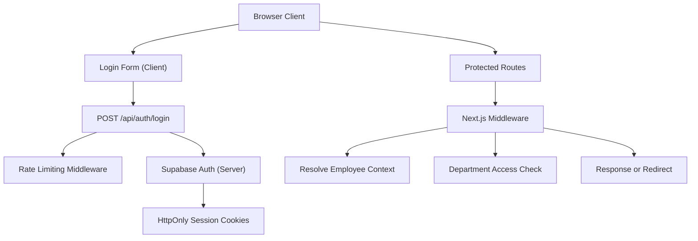
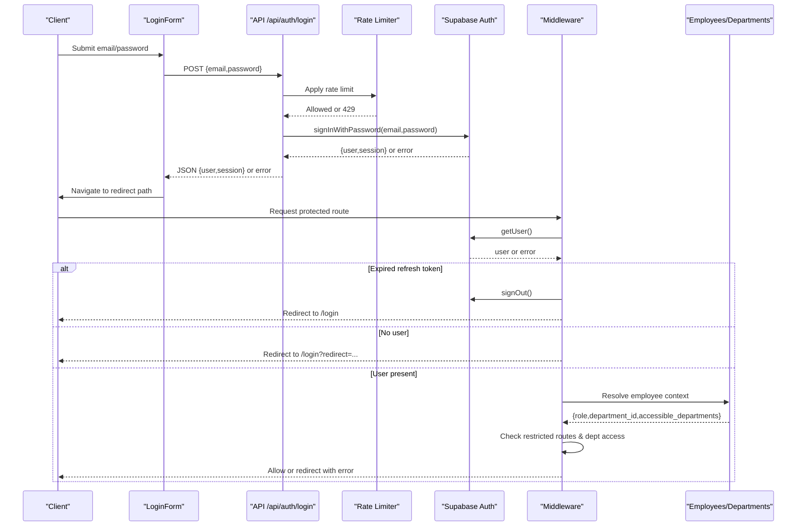
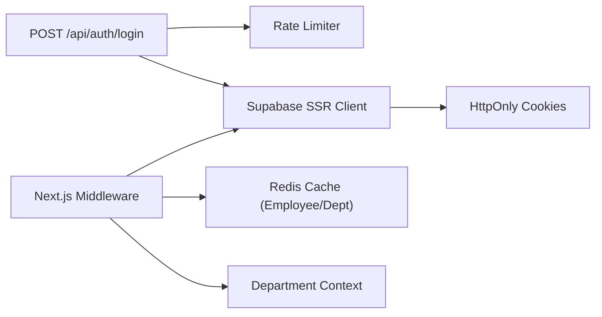

# Authentication API

<cite>
**Referenced Files in This Document**
- [route.ts](file://apps/portal/app/api/auth/login/route.ts)
- [LoginForm.tsx](file://apps/portal/app/(auth)/login/LoginForm.tsx)
- [middleware.ts](file://apps/portal/middleware.ts)
- [rate-limit-middleware.ts](file://apps/portal/lib/api/rate-limit-middleware.ts)
- [server.ts](file://packages/supabase/src/server.ts)
- [middleware.ts](file://packages/supabase/src/middleware.ts)
- [dept-context.ts](file://apps/portal/lib/dept-context.ts)
- [how-does-auth-work.md](file://wiki/queries/how-does-auth-work.md)
- [rls-policy.md](file://wiki/concepts/rls-policy.md)
</cite>

## Table of Contents

1. [Introduction](#introduction)
2. [Project Structure](#project-structure)
3. [Core Components](#core-components)
4. [Architecture Overview](#architecture-overview)
5. [Detailed Component Analysis](#detailed-component-analysis)
6. [Dependency Analysis](#dependency-analysis)
7. [Performance Considerations](#performance-considerations)
8. [Troubleshooting Guide](#troubleshooting-guide)
9. [Conclusion](#conclusion)

## Introduction

This document provides comprehensive API documentation for the authentication endpoints, focusing on the login flow, JWT token handling via Supabase Auth, session management through HttpOnly cookies, and middleware-based authorization with role- and department-scoped access. It also covers rate limiting, error handling, and integration patterns with Supabase Auth.

## Project Structure

The authentication system is implemented using Next.js App Router API routes, server-side Supabase clients, and a global middleware layer that enforces authentication and authorization. The login UI calls a server-side API route which delegates to Supabase Auth and sets secure cookies. Middleware validates sessions, resolves employee context, and enforces role-based and department-scoped access.

**Diagram sources**

- [route.ts:1-75](file://apps/portal/app/api/auth/login/route.ts#L1-L75)
- [LoginForm.tsx:74-145](<file://apps/portal/app/(auth)/login/LoginForm.tsx#L74-L145>)
- [middleware.ts:265-366](file://apps/portal/middleware.ts#L265-L366)
- [rate-limit-middleware.ts:225-290](file://apps/portal/lib/api/rate-limit-middleware.ts#L225-L290)
- [server.ts:49-80](file://packages/supabase/src/server.ts#L49-L80)
- [middleware.ts:4-43](file://packages/supabase/src/middleware.ts#L4-L43)

**Section sources**

- [route.ts:1-75](file://apps/portal/app/api/auth/login/route.ts#L1-L75)
- [LoginForm.tsx:74-145](<file://apps/portal/app/(auth)/login/LoginForm.tsx#L74-L145>)
- [middleware.ts:265-366](file://apps/portal/middleware.ts#L265-L366)
- [rate-limit-middleware.ts:225-290](file://apps/portal/lib/api/rate-limit-middleware.ts#L225-L290)
- [server.ts:49-80](file://packages/supabase/src/server.ts#L49-L80)
- [middleware.ts:4-43](file://packages/supabase/src/middleware.ts#L4-L43)

## Core Components

- Login API Route: Accepts credentials, applies rate limiting, authenticates via Supabase, and returns session data.
- Client Login Form: Validates inputs, posts credentials, handles success/error states, and navigates after successful login.
- Global Middleware: Enforces authentication, redirects unauthenticated users, detects expired refresh tokens, resolves employee context, and enforces role- and department-based access.
- Rate Limiting Middleware: Provides IP/user-based sliding window limits with Redis-backed storage and load-adaptive throttling.
- Supabase Server/Middleware Clients: Create authenticated clients and manage secure cookie settings.

Key responsibilities:

- Input validation and sanitization at the client and server layers.
- Secure cookie configuration (HttpOnly, Secure, SameSite=Lax).
- Role-based authorization and department-scoped access checks.
- Token expiration detection and automatic sign-out flows.

**Section sources**

- [route.ts:1-75](file://apps/portal/app/api/auth/login/route.ts#L1-L75)
- [LoginForm.tsx:74-145](<file://apps/portal/app/(auth)/login/LoginForm.tsx#L74-L145>)
- [middleware.ts:265-366](file://apps/portal/middleware.ts#L265-L366)
- [rate-limit-middleware.ts:225-290](file://apps/portal/lib/api/rate-limit-middleware.ts#L225-L290)
- [server.ts:49-80](file://packages/supabase/src/server.ts#L49-L80)
- [middleware.ts:4-43](file://packages/supabase/src/middleware.ts#L4-L43)

## Architecture Overview

The authentication architecture integrates client-side form submission, server-side API routing, Supabase Auth, and Next.js middleware for authorization.

**Diagram sources**

- [LoginForm.tsx:74-145](<file://apps/portal/app/(auth)/login/LoginForm.tsx#L74-L145>)
- [route.ts:17-74](file://apps/portal/app/api/auth/login/route.ts#L17-L74)
- [rate-limit-middleware.ts:225-290](file://apps/portal/lib/api/rate-limit-middleware.ts#L225-L290)
- [server.ts:49-80](file://packages/supabase/src/server.ts#L49-L80)
- [middleware.ts:265-366](file://apps/portal/middleware.ts#L265-L366)

## Detailed Component Analysis

### Login Endpoint: POST /api/auth/login

- Method: POST
- Content-Type: application/json
- Request body:
  - email: string (employee ID or email address)
  - password: string
- Success response (200):
  - user: Supabase user object
  - session: Supabase session object
- Error responses:
  - 400: Missing fields
  - 401: Invalid credentials or rate-limited by provider
  - 429: Rate limit exceeded (client-facing message indicates retry)
  - 500: Internal error

Behavior:

- Wraps Supabase signInWithPassword with server-side rate limiting.
- Returns generic error messages to avoid account enumeration.
- Sets HttpOnly session cookies via Supabase SSR client.

Security considerations:

- Rate limiting per IP/user with adaptive throttling under high load.
- Input validation ensures both fields are present.
- Avoids leaking provider-specific error details.

**Section sources**

- [route.ts:17-74](file://apps/portal/app/api/auth/login/route.ts#L17-L74)
- [rate-limit-middleware.ts:225-290](file://apps/portal/lib/api/rate-limit-middleware.ts#L225-L290)
- [server.ts:49-80](file://packages/supabase/src/server.ts#L49-L80)

### Client Login Flow

- The login form validates input constraints and posts credentials to the API endpoint.
- On success, it records telemetry and navigates to the intended redirect path.
- On failure, it displays an error message and logs non-PII breadcrumbs.

Redirect handling:

- Only internal page paths are allowed; static assets and external URLs are rejected.

**Section sources**

- [LoginForm.tsx:74-145](<file://apps/portal/app/(auth)/login/LoginForm.tsx#L74-L145>)
- [LoginForm.tsx:18-38](<file://apps/portal/app/(auth)/login/LoginForm.tsx#L18-L38>)

### Middleware Authorization and Session Management

Responsibilities:

- Skip public paths and static files.
- Detect and handle expired refresh tokens by signing out and clearing caches.
- Redirect unauthenticated users to /login with a safe redirect parameter.
- Resolve employee context from the employees table and cache results.
- Enforce role-based restrictions on specific routes.
- Enforce department access based on primary department and cross-department permissions.

Role normalization:

- Unknown or empty roles default to operator.

Token expiration handling:

- Recognizes invalid or missing refresh tokens and triggers sign-out.

Department access:

- Checks top-level segment against known departments.
- Allows admin or users whose primary department or accessible departments include the target.

Error redirection:

- Redirects with query parameters indicating unauthorized or unknown department.

**Section sources**

- [middleware.ts:60-80](file://apps/portal/middleware.ts#L60-L80)
- [middleware.ts:165-189](file://apps/portal/middleware.ts#L165-L189)
- [middleware.ts:200-263](file://apps/portal/middleware.ts#L200-L263)
- [middleware.ts:265-366](file://apps/portal/middleware.ts#L265-L366)

### Role-Based Authorization Patterns

Restricted routes require specific roles:

- access-control: requires access_control or admin
- control-room: requires control_room_operator or admin
- tools: requires admin or supervisor
- admin: requires admin

Cross-department access:

- Users can be granted access to multiple departments without changing their primary department.

**Section sources**

- [middleware.ts:60-65](file://apps/portal/middleware.ts#L60-L65)
- [how-does-auth-work.md:184-222](file://wiki/queries/how-does-auth-work.md#L184-L222)

### Department Access Control

- Department routes are validated against a list of known departments.
- Admins bypass department checks.
- Non-admins must belong to the department or have it listed in accessible_departments.
- Department UUID resolution is cached to reduce database load.

**Section sources**

- [middleware.ts:247-263](file://apps/portal/middleware.ts#L247-L263)
- [dept-context.ts:16-52](file://apps/portal/lib/dept-context.ts#L16-L52)

### Token Refresh Mechanisms

- The middleware detects refresh token errors and signs out the user.
- Supabase SSR client manages HttpOnly cookies and refreshes tokens transparently during requests.
- Safe user retrieval helper avoids crashing on refresh token errors.

Implementation notes:

- Expired refresh token messages trigger sign-out and cache eviction.
- Cookie security flags ensure tokens are not exposed to client scripts.

**Section sources**

- [middleware.ts:71-80](file://apps/portal/middleware.ts#L71-L80)
- [middleware.ts:165-189](file://apps/portal/middleware.ts#L165-L189)
- [server.ts:88-99](file://packages/supabase/src/server.ts#L88-L99)
- [middleware.ts:4-43](file://packages/supabase/src/middleware.ts#L4-L43)

### Integration with Supabase Auth

- Server client uses environment variables for URL and anon key.
- Cookies are set with HttpOnly, Secure (in production), and SameSite=Lax.
- RLS policies enforce row-level isolation by department and role.

**Section sources**

- [server.ts:49-80](file://packages/supabase/src/server.ts#L49-L80)
- [middleware.ts:4-43](file://packages/supabase/src/middleware.ts#L4-L43)
- [rls-policy.md:15-38](file://wiki/concepts/rls-policy.md#L15-L38)

### Security Considerations

Input validation:

- Client-side constraints for length and format.
- Server-side presence checks before calling Supabase.

Rate limiting:

- Sliding window strategy with Redis-backed store and in-memory fallback.
- Adaptive throttling under high CPU load.
- Headers expose remaining quota and reset time.

Secure token storage:

- HttpOnly cookies prevent XSS access.
- Secure flag enforced in production.
- SameSite=Lax mitigates CSRF while allowing navigation-based auth.

Open redirect protection:

- Strict allowlist for redirect targets in middleware and client-side validation.

**Section sources**

- [LoginForm.tsx:74-145](<file://apps/portal/app/(auth)/login/LoginForm.tsx#L74-L145>)
- [LoginForm.tsx:18-38](<file://apps/portal/app/(auth)/login/LoginForm.tsx#L18-L38>)
- [rate-limit-middleware.ts:178-201](file://apps/portal/lib/api/rate-limit-middleware.ts#L178-L201)
- [rate-limit-middleware.ts:225-290](file://apps/portal/lib/api/rate-limit-middleware.ts#L225-L290)
- [middleware.ts:4-43](file://packages/supabase/src/middleware.ts#L4-L43)
- [middleware.ts:8-47](file://apps/portal/middleware.ts#L8-L47)

## Dependency Analysis

The authentication subsystem depends on:

- Next.js App Router API routes for login.
- Supabase SSR client for authenticated requests and cookie management.
- Redis-backed rate limiter for distributed throttling.
- Middleware for session validation and authorization.
- Department context utilities for caching and validation.

**Diagram sources**

- [route.ts:17-74](file://apps/portal/app/api/auth/login/route.ts#L17-L74)
- [rate-limit-middleware.ts:225-290](file://apps/portal/lib/api/rate-limit-middleware.ts#L225-L290)
- [server.ts:49-80](file://packages/supabase/src/server.ts#L49-L80)
- [middleware.ts:265-366](file://apps/portal/middleware.ts#L265-L366)
- [dept-context.ts:16-52](file://apps/portal/lib/dept-context.ts#L16-L52)

**Section sources**

- [route.ts:17-74](file://apps/portal/app/api/auth/login/route.ts#L17-L74)
- [rate-limit-middleware.ts:225-290](file://apps/portal/lib/api/rate-limit-middleware.ts#L225-L290)
- [server.ts:49-80](file://packages/supabase/src/server.ts#L49-L80)
- [middleware.ts:265-366](file://apps/portal/middleware.ts#L265-L366)
- [dept-context.ts:16-52](file://apps/portal/lib/dept-context.ts#L16-L52)

## Performance Considerations

- Department UUID and employee context are cached in Redis to minimize database queries.
- Rate limiter uses Redis when available and falls back to in-memory store.
- Load-adaptive throttling reduces request quotas under high CPU load to maintain stability.
- Middleware performs best-effort metrics recording without blocking auth flows.

[No sources needed since this section provides general guidance]

## Troubleshooting Guide

Common issues and resolutions:

- Invalid credentials: Ensure correct email/employee ID and password; check for rate limiting messages.
- Rate limit exceeded: Wait for the indicated retry period; verify IP/user identity if behind proxies.
- Expired refresh token: Automatic sign-out occurs; re-authenticate to obtain new session cookies.
- Unauthorized department access: Verify employee role and department membership; confirm accessible_departments includes the target department.
- Open redirect blocked: Ensure redirect parameter points to an internal page path.

Operational tips:

- Inspect X-RateLimit headers to understand current quota and reset times.
- Use safe user retrieval helpers to avoid crashes on refresh token errors.
- Confirm cookie flags (HttpOnly, Secure, SameSite) are correctly set in production.

**Section sources**

- [route.ts:38-51](file://apps/portal/app/api/auth/login/route.ts#L38-L51)
- [rate-limit-middleware.ts:263-290](file://apps/portal/lib/api/rate-limit-middleware.ts#L263-L290)
- [middleware.ts:71-80](file://apps/portal/middleware.ts#L71-L80)
- [middleware.ts:265-366](file://apps/portal/middleware.ts#L265-L366)
- [server.ts:88-99](file://packages/supabase/src/server.ts#L88-L99)

## Conclusion

The authentication system combines robust client-side validation, server-side rate limiting, secure cookie management, and strict middleware-based authorization. Role-based and department-scoped access controls ensure fine-grained permissions, while caching and adaptive throttling improve performance and resilience. Integration with Supabase Auth provides reliable session handling and token refresh mechanisms.
