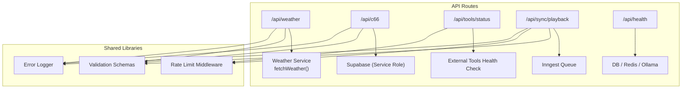
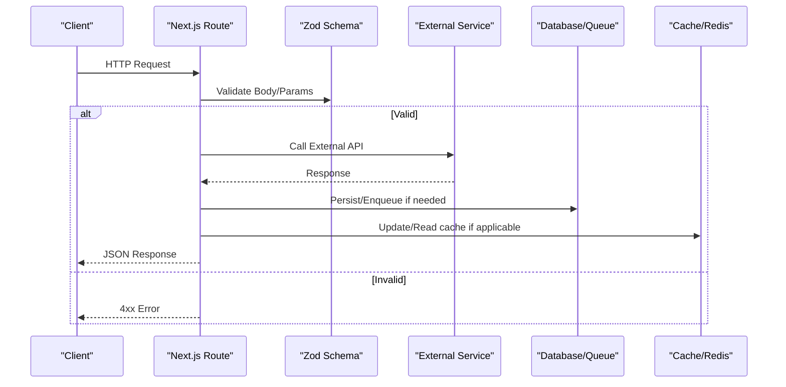
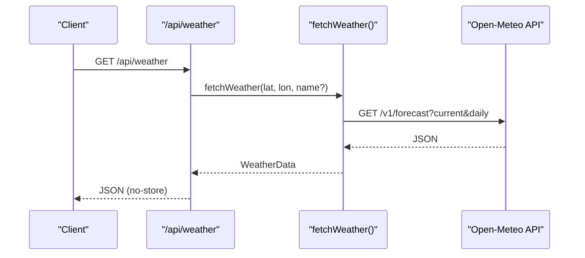
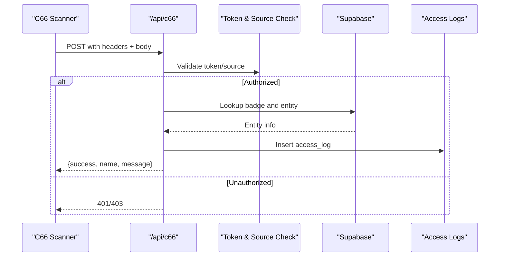
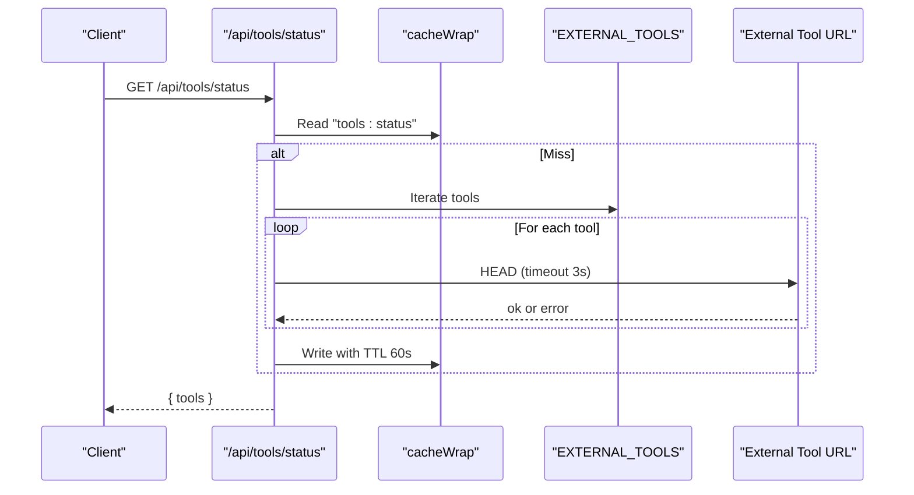
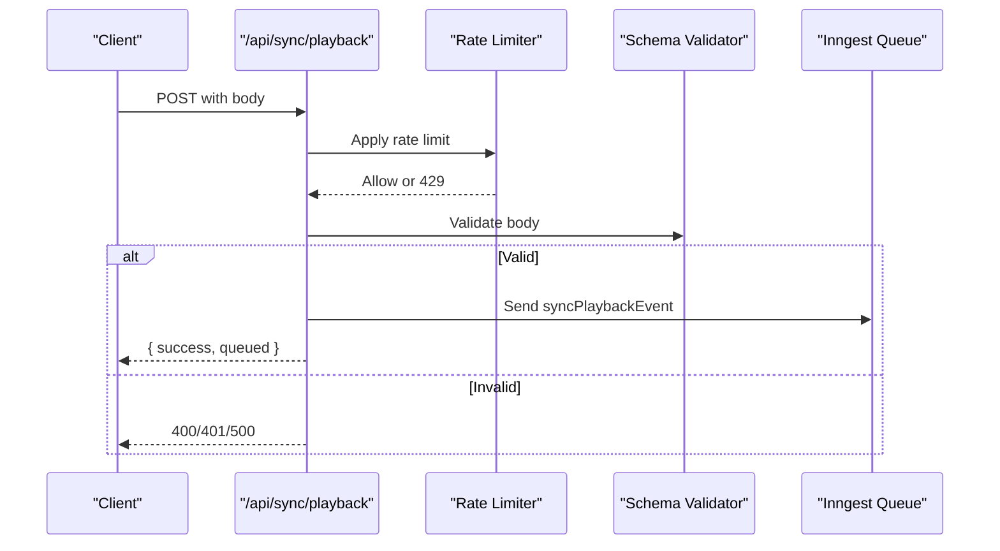
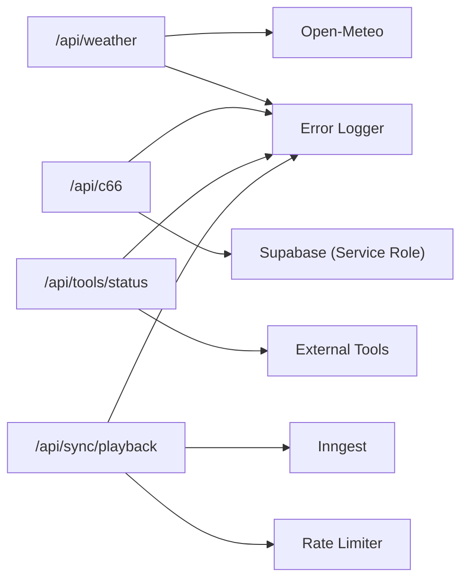

# Integration Services API

<cite>
**Referenced Files in This Document**
- [weather/route.ts](file://apps/portal/app/api/weather/route.ts)
- [weather-api.ts](file://apps/portal/lib/weather-api.ts)
- [c66/route.ts](file://apps/portal/app/api/c66/route.ts)
- [tools/status/route.ts](file://apps/portal/app/api/tools/status/route.ts)
- [tools.ts](file://apps/portal/lib/tools.ts)
- [sync/playback/route.ts](file://apps/portal/app/api/sync/playback/route.ts)
- [schemas.ts](file://apps/portal/lib/api/schemas.ts)
- [rate-limit-middleware.ts](file://apps/portal/lib/api/rate-limit-middleware.ts)
- [error-logger.ts](file://apps/portal/lib/errors/error-logger.ts)
- [health/route.ts](file://apps/portal/app/api/health/route.ts)
</cite>

## Table of Contents

1. Introduction
2. Project Structure
3. Core Components
4. Architecture Overview
5. Detailed Component Analysis
6. Dependency Analysis
7. Performance Considerations
8. Troubleshooting Guide
9. Conclusion

## Introduction

This document provides detailed API documentation for external integration services exposed by the portal application. It covers:

- Weather data endpoints with location parameters, forecast formats, and historical data access notes
- C66 system integration endpoints for legacy system communication and data synchronization
- Tool status endpoints for third-party service monitoring and availability checking
- Playback synchronization endpoints for data replay and testing scenarios
  It also includes integration patterns, error handling strategies, retry mechanisms, rate limiting, caching strategies, and fallback behaviors for external dependencies.

## Project Structure

The integration APIs are implemented as Next.js App Router routes under apps/portal/app/api. Each route encapsulates authentication, validation, middleware (rate limiting, CORS, body limits), and calls to external systems or internal services.

**Diagram sources**

- [weather/route.ts:1-23](file://apps/portal/app/api/weather/route.ts#L1-L23)
- [weather-api.ts:90-143](file://apps/portal/lib/weather-api.ts#L90-L143)
- [c66/route.ts:1-187](file://apps/portal/app/api/c66/route.ts#L1-L187)
- [tools/status/route.ts:1-67](file://apps/portal/app/api/tools/status/route.ts#L1-L67)
- [sync/playback/route.ts:1-71](file://apps/portal/app/api/sync/playback/route.ts#L1-L71)
- [health/route.ts:1-83](file://apps/portal/app/api/health/route.ts#L1-L83)
- [schemas.ts:1-186](file://apps/portal/lib/api/schemas.ts#L1-L186)
- [rate-limit-middleware.ts:1-315](file://apps/portal/lib/api/rate-limit-middleware.ts#L1-L315)
- [error-logger.ts:1-242](file://apps/portal/lib/errors/error-logger.ts#L1-L242)

**Section sources**

- [weather/route.ts:1-23](file://apps/portal/app/api/weather/route.ts#L1-L23)
- [c66/route.ts:1-187](file://apps/portal/app/api/c66/route.ts#L1-L187)
- [tools/status/route.ts:1-67](file://apps/portal/app/api/tools/status/route.ts#L1-L67)
- [sync/playback/route.ts:1-71](file://apps/portal/app/api/sync/playback/route.ts#L1-L71)
- [health/route.ts:1-83](file://apps/portal/app/api/health/route.ts#L1-L83)

## Core Components

- Weather API: Provides current weather and a 5-day forecast for a given location. The endpoint returns no-store cache headers; the underlying service uses server-side revalidation.
- C66 Scanner Endpoint: Accepts scanner payloads, validates them, checks badge identity and authorization, and logs access events.
- Tools Status Endpoint: Probes configured external tools via HEAD requests and caches results briefly.
- Sync Playback Endpoint: Validates and enqueues playback events for later processing.
- Shared Utilities: Validation schemas, rate limiting middleware, and structured error logging.

**Section sources**

- [weather-api.ts:9-35](file://apps/portal/lib/weather-api.ts#L9-L35)
- [weather/route.ts:1-23](file://apps/portal/app/api/weather/route.ts#L1-L23)
- [c66/route.ts:1-187](file://apps/portal/app/api/c66/route.ts#L1-L187)
- [tools/status/route.ts:1-67](file://apps/portal/app/api/tools/status/route.ts#L1-L67)
- [sync/playback/route.ts:1-71](file://apps/portal/app/api/sync/playback/route.ts#L1-L71)
- [schemas.ts:66-119](file://apps/portal/lib/api/schemas.ts#L66-L119)
- [rate-limit-middleware.ts:1-315](file://apps/portal/lib/api/rate-limit-middleware.ts#L1-L315)
- [error-logger.ts:1-242](file://apps/portal/lib/errors/error-logger.ts#L1-L242)

## Architecture Overview

The integration layer follows a consistent pattern:

- Authentication and authorization checks where required
- Request validation against shared Zod schemas
- Middleware wrapping for rate limiting, CORS, and body size limits
- External calls (Open-Meteo, Supabase, Inngest, external tool health checks)
- Structured error logging and standardized responses

[No sources needed since this diagram shows conceptual workflow, not actual code structure]

## Detailed Component Analysis

### Weather Data API

- Endpoint: GET /api/weather
- Purpose: Return current weather and a 5-day forecast for a configurable default location.
- Location Parameters: The route does not accept query parameters; use the service function to fetch for specific coordinates.
- Forecast Format: Includes current conditions and daily forecasts with temperature ranges, precipitation, and WMO-based descriptions/icons.
- Historical Data Access: Not provided by this endpoint. Use the Open-Meteo historical archive directly if needed.

Request

- Method: GET
- Path: /api/weather
- Headers: None required
- Query Parameters: None

Response

- Success: JSON object with current weather and daily forecast fields
- Failure: JSON null payload on error; errors are logged

Caching

- Route response: no-store, max-age=0
- Service-level revalidation: 5 minutes

Integration Notes

- Uses Open-Meteo forecast API
- Throws typed API errors on non-ok responses

Example Flow

**Diagram sources**

- [weather/route.ts:1-23](file://apps/portal/app/api/weather/route.ts#L1-L23)
- [weather-api.ts:90-143](file://apps/portal/lib/weather-api.ts#L90-L143)

**Section sources**

- [weather/route.ts:1-23](file://apps/portal/app/api/weather/route.ts#L1-L23)
- [weather-api.ts:9-35](file://apps/portal/lib/weather-api.ts#L9-L35)
- [weather-api.ts:90-143](file://apps/portal/lib/weather-api.ts#L90-L143)
- [weather-api.ts:145-170](file://apps/portal/lib/weather-api.ts#L145-L170)

### C66 System Integration (Scanner Badge Verification)

- Endpoint: POST /api/c66
- Purpose: Verify scanned badges from legacy scanners, resolve entity identity, authorize access, and log access events.
- Authentication: Requires x-scanner-token header matching configured secret; source must be in allowed list.
- Payload: Supports multiple barcode/code fields; validated via schema.
- Authorization Logic: Checks badge active state and entity status before granting access.
- Logging: Inserts access_logs entries; failures are logged without blocking response.

Headers

- x-scanner-source: Allowed values configured via environment variable
- x-scanner-token: Required secret token

Request Body (validated)

- Fields include optional code/barcode/barcodeData/data/qr_code and metadata such as access_type, gate_location, operator, alcohol_tested, device_id, direction.

Response

- success: boolean
- name: entity display name
- message: human-readable result or denial reason
- Status codes: 200 OK, 400 Bad Request, 401 Unauthorized, 403 Forbidden, 404 Not Found, 500 Internal Server Error

Integration Notes

- Uses Supabase service role client for privileged writes
- Applies CORS and body size limits

Example Flow

**Diagram sources**

- [c66/route.ts:1-187](file://apps/portal/app/api/c66/route.ts#L1-L187)
- [schemas.ts:66-82](file://apps/portal/lib/api/schemas.ts#L66-L82)

**Section sources**

- [c66/route.ts:1-187](file://apps/portal/app/api/c66/route.ts#L1-L187)
- [schemas.ts:66-82](file://apps/portal/lib/api/schemas.ts#L66-L82)

### Tool Status Monitoring

- Endpoint: GET /api/tools/status
- Purpose: Report health and latency of configured external tools.
- Authentication: Requires authenticated user context.
- Health Check: Sends HEAD requests with a short timeout per tool.
- Caching: Results cached for 60 seconds using a cache wrapper.

Request

- Method: GET
- Path: /api/tools/status
- Authentication: User session required

Response

- tools: Array of tool objects including name, displayName, url, description, icon, color, status ("online" | "offline" | "unknown"), and responseTime (ms).

Configuration

- External tools are defined centrally and can be overridden via environment variables.

Example Flow

**Diagram sources**

- [tools/status/route.ts:1-67](file://apps/portal/app/api/tools/status/route.ts#L1-L67)
- [tools.ts:81-101](file://apps/portal/lib/tools.ts#L81-L101)

**Section sources**

- [tools/status/route.ts:1-67](file://apps/portal/app/api/tools/status/route.ts#L1-L67)
- [tools.ts:81-101](file://apps/portal/lib/tools.ts#L81-L101)

### Playback Synchronization

- Endpoint: POST /api/sync/playback
- Purpose: Enqueue a playback event for later processing to replay actions deterministically.
- Authentication: Requires authenticated user context.
- Validation: Enforces idempotencyKey, actionType, payload, departmentId via schema.
- Rate Limiting: Protected by global rate limiter.
- Processing: Sends event to Inngest queue.

Request

- Method: POST
- Path: /api/sync/playback
- Authentication: User session required
- Body: idempotencyKey, actionType, payload, departmentId

Response

- Success: { success: true, queued: true }
- Errors: 400 for missing/invalid fields, 401 unauthorized, 500 internal error

Example Flow

**Diagram sources**

- [sync/playback/route.ts:1-71](file://apps/portal/app/api/sync/playback/route.ts#L1-L71)
- [schemas.ts:98-119](file://apps/portal/lib/api/schemas.ts#L98-L119)
- [rate-limit-middleware.ts:225-290](file://apps/portal/lib/api/rate-limit-middleware.ts#L225-L290)

**Section sources**

- [sync/playback/route.ts:1-71](file://apps/portal/app/api/sync/playback/route.ts#L1-L71)
- [schemas.ts:98-119](file://apps/portal/lib/api/schemas.ts#L98-L119)
- [rate-limit-middleware.ts:225-290](file://apps/portal/lib/api/rate-limit-middleware.ts#L225-L290)

### Health Check

- Endpoint: GET /api/health
- Purpose: Aggregate health of core dependencies (database, pooler, redis, AI router) and overall status.
- Behavior: Returns 200 when healthy, 503 when degraded or error.

Response Fields

- status: "healthy" | "degraded" | "error"
- db, pooler, redis, aiRouter: component statuses
- responseTime: ms
- timestamp: ISO string

**Section sources**

- [health/route.ts:1-83](file://apps/portal/app/api/health/route.ts#L1-L83)

## Dependency Analysis

- Weather API depends on Open-Meteo forecast and geocoding APIs.
- C66 depends on Supabase (service role) for badge/entity lookup and access log writes.
- Tools Status depends on EXTERNAL_TOOLS configuration and performs outbound HEAD checks.
- Playback depends on Inngest for asynchronous processing.
- All endpoints leverage shared validation schemas, rate limiting, and error logging.

**Diagram sources**

- [weather-api.ts:90-143](file://apps/portal/lib/weather-api.ts#L90-L143)
- [c66/route.ts:1-187](file://apps/portal/app/api/c66/route.ts#L1-L187)
- [tools/status/route.ts:1-67](file://apps/portal/app/api/tools/status/route.ts#L1-L67)
- [sync/playback/route.ts:1-71](file://apps/portal/app/api/sync/playback/route.ts#L1-L71)
- [rate-limit-middleware.ts:1-315](file://apps/portal/lib/api/rate-limit-middleware.ts#L1-L315)
- [error-logger.ts:1-242](file://apps/portal/lib/errors/error-logger.ts#L1-L242)

**Section sources**

- [weather-api.ts:90-143](file://apps/portal/lib/weather-api.ts#L90-L143)
- [c66/route.ts:1-187](file://apps/portal/app/api/c66/route.ts#L1-L187)
- [tools/status/route.ts:1-67](file://apps/portal/app/api/tools/status/route.ts#L1-L67)
- [sync/playback/route.ts:1-71](file://apps/portal/app/api/sync/playback/route.ts#L1-L71)
- [rate-limit-middleware.ts:1-315](file://apps/portal/lib/api/rate-limit-middleware.ts#L1-L315)
- [error-logger.ts:1-242](file://apps/portal/lib/errors/error-logger.ts#L1-L242)

## Performance Considerations

- Weather API
  - Route disables caching at the edge; service revalidates every 5 minutes.
  - Geocoding search is cached for 24 hours at the service level.
- Tools Status
  - Aggregated status is cached for 60 seconds to reduce external probe load.
  - Per-tool HEAD requests have a 3-second timeout to avoid long tail latencies.
- Playback
  - Asynchronous enqueue via Inngest decouples request latency from processing time.
  - Rate limiting protects downstream queues and reduces burst pressure.
- C66
  - Minimal DB reads and single insert for access logs; ensure indexes on qr_code and entity lookups.
- General
  - Rate limiter supports Redis-backed distributed counting with in-memory fallback.
  - Load-adaptive throttling halves limits under high CPU load.

[No sources needed since this section provides general guidance]

## Troubleshooting Guide

Common issues and resolutions:

- Weather API failures
  - Symptom: Non-ok response from Open-Meteo leads to typed API error.
  - Action: Inspect upstream availability and consider implementing client-side retries with exponential backoff.
- C66 scanner authorization
  - Symptom: 401/403 due to invalid token or disallowed source.
  - Action: Verify x-scanner-token and x-scanner-source headers; confirm ALLOWED_SCANNER_SOURCES configuration.
- Tools status offline
  - Symptom: status "offline" with responseTime populated.
  - Action: Confirm external tool URLs and network reachability; adjust timeouts if necessary.
- Playback rejected
  - Symptom: 400 for missing fields or 401 unauthorized.
  - Action: Ensure idempotencyKey, actionType, payload, departmentId are present and valid; authenticate user context.
- Rate limiting
  - Symptom: 429 with Retry-After header.
  - Action: Implement client retry with jitter; respect X-RateLimit-\* headers.

Structured error logging

- All endpoints log errors with context (URL, method, userId, sessionId) and forward server errors to Sentry.

**Section sources**

- [weather-api.ts:100-107](file://apps/portal/lib/weather-api.ts#L100-L107)
- [c66/route.ts:24-42](file://apps/portal/app/api/c66/route.ts#L24-L42)
- [tools/status/route.ts:19-46](file://apps/portal/app/api/tools/status/route.ts#L19-L46)
- [sync/playback/route.ts:23-35](file://apps/portal/app/api/sync/playback/route.ts#L23-L35)
- [rate-limit-middleware.ts:263-290](file://apps/portal/lib/api/rate-limit-middleware.ts#L263-L290)
- [error-logger.ts:158-174](file://apps/portal/lib/errors/error-logger.ts#L158-L174)

## Conclusion

The integration services provide robust, secure, and observable interfaces for weather data, legacy scanner verification, external tool monitoring, and controlled data replay. They follow consistent patterns for authentication, validation, rate limiting, caching, and error reporting. Clients should implement resilient retry logic, honor rate limit headers, and handle partial failures gracefully.
