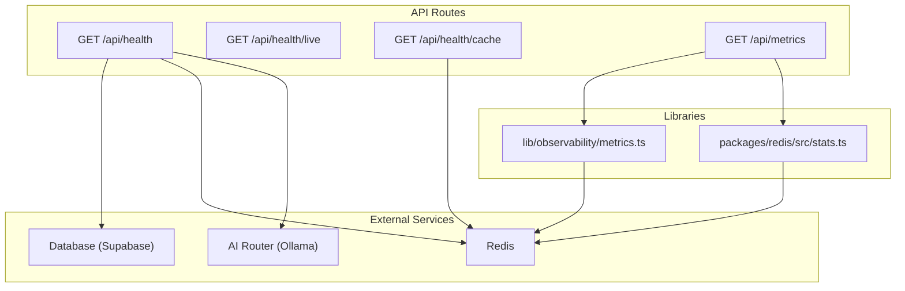
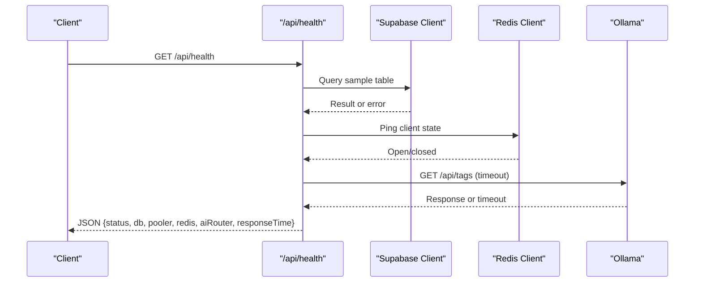
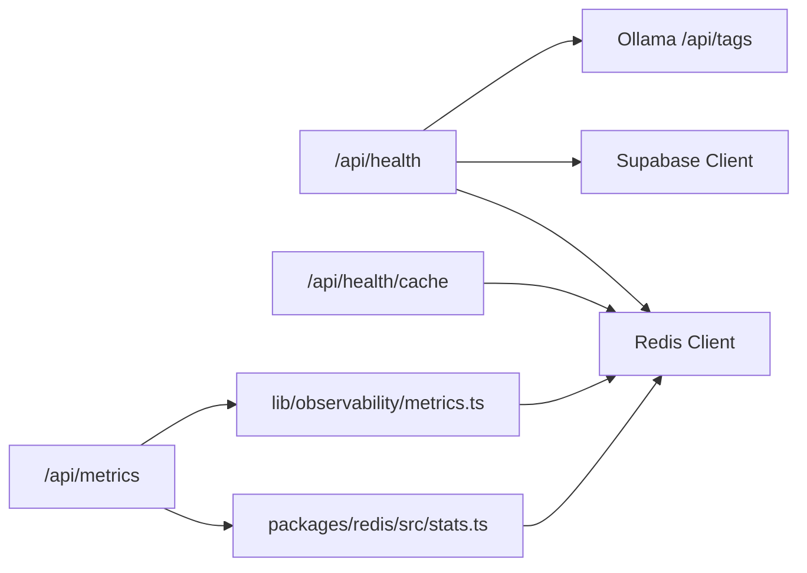

# System Health & Monitoring API

<cite>
**Referenced Files in This Document**
- [route.ts](file://apps/portal/app/api/health/route.ts)
- [route.ts](file://apps/portal/app/api/health/live/route.ts)
- [route.ts](file://apps/portal/app/api/health/cache/route.ts)
- [route.ts](file://apps/portal/app/api/metrics/route.ts)
- [metrics.ts](file://apps/portal/lib/observability/metrics.ts)
- [stats.ts](file://packages/redis/src/stats.ts)
- [prometheus.yml](file://config/prometheus.yml)
- [cache-alerts.yaml](file://infra/observability/prometheus-rules/cache-alerts.yaml)
- [cache-dashboard.json](file://infra/observability/grafana-dashboards/cache-dashboard.json)
</cite>

## Table of Contents

1. [Introduction](#introduction)
2. [Project Structure](#project-structure)
3. [Core Components](#core-components)
4. [Architecture Overview](#architecture-overview)
5. [Detailed Component Analysis](#detailed-component-analysis)
6. [Dependency Analysis](#dependency-analysis)
7. [Performance Considerations](#performance-considerations)
8. [Troubleshooting Guide](#troubleshooting-guide)
9. [Conclusion](#conclusion)
10. [Appendices](#appendices)

## Introduction

This document provides comprehensive API documentation for system health and monitoring endpoints exposed by the application. It covers:

- Health check endpoints for application status, database connectivity, Redis cache availability, and external AI router (Ollama) reachability.
- Live monitoring endpoints for real-time system metrics including cache performance and job/database observability.
- Metrics collection endpoints with Prometheus-compatible text exposition format and custom metric definitions.
- Examples of alerting rules and dashboard panels to operationalize these metrics.
- Performance indicators, threshold configurations, and troubleshooting guidance.
- Best practices for monitoring, metric naming conventions, and alerting strategies.

## Project Structure

The health and monitoring surface is implemented as Next.js App Router routes under apps/portal/app/api, with supporting libraries for metrics aggregation and Redis-backed stats.

**Diagram sources**

- [route.ts:1-83](file://apps/portal/app/api/health/route.ts#L1-L83)
- [route.ts:1-9](file://apps/portal/app/api/health/live/route.ts#L1-L9)
- [route.ts:1-28](file://apps/portal/app/api/health/cache/route.ts#L1-L28)
- [route.ts:1-92](file://apps/portal/app/api/metrics/route.ts#L1-L92)
- [metrics.ts:1-184](file://apps/portal/lib/observability/metrics.ts#L1-L184)
- [stats.ts:1-168](file://packages/redis/src/stats.ts#L1-L168)

**Section sources**

- [route.ts:1-83](file://apps/portal/app/api/health/route.ts#L1-L83)
- [route.ts:1-9](file://apps/portal/app/api/health/live/route.ts#L1-L9)
- [route.ts:1-28](file://apps/portal/app/api/health/cache/route.ts#L1-L28)
- [route.ts:1-92](file://apps/portal/app/api/metrics/route.ts#L1-L92)
- [metrics.ts:1-184](file://apps/portal/lib/observability/metrics.ts#L1-L184)
- [stats.ts:1-168](file://packages/redis/src/stats.ts#L1-L168)

## Core Components

- Health Check Endpoints
  - GET /api/health: Comprehensive liveness/readiness probe covering database, connection pooler, Redis, and AI router. Returns a JSON body with component statuses and response time.
  - GET /api/health/live: Lightweight liveness endpoint returning a simple ok status.
  - GET /api/health/cache: Cache-specific health and performance snapshot including hit rate and Redis connectivity.
- Metrics Endpoint
  - GET /api/metrics: Prometheus-compatible exposition of cache, background job, and database query metrics.

Key behaviors:

- Health checks are dynamic and do not use server-side caching.
- The main health endpoint returns HTTP 200 when healthy or degraded; returns 503 on error states.
- The metrics endpoint uses text/plain with Prometheus exposition version header and no-store cache control.

**Section sources**

- [route.ts:1-83](file://apps/portal/app/api/health/route.ts#L1-L83)
- [route.ts:1-9](file://apps/portal/app/api/health/live/route.ts#L1-L9)
- [route.ts:1-28](file://apps/portal/app/api/health/cache/route.ts#L1-L28)
- [route.ts:1-92](file://apps/portal/app/api/metrics/route.ts#L1-L92)

## Architecture Overview

The monitoring architecture combines in-process counters with optional Redis-backed aggregation for distributed deployments.

**Diagram sources**

- [route.ts:1-83](file://apps/portal/app/api/health/route.ts#L1-L83)

## Detailed Component Analysis

### Health Check Endpoints

#### GET /api/health

Purpose: Application readiness and dependency health.

Behavior:

- Database: Attempts a lightweight read from a known table to validate connectivity and schema presence.
- Pooler: Reports enabled/disabled based on environment configuration.
- Redis: Checks client open state; marks unavailable if closed.
- AI Router (Ollama): Performs a short-lived request to an internal tags endpoint with a timeout.
- Status logic:
  - error: If database is unavailable.
  - degraded: If Redis or AI router are unavailable but app remains partially functional.
  - healthy: All dependencies available.
- Response includes responseTime and timestamp.

HTTP semantics:

- 200 OK: healthy or degraded
- 503 Service Unavailable: error

Response fields:

- status: "healthy" | "error" | "degraded"
- db: "ok" | "unavailable"
- pooler: "ok" | "disabled"
- redis: "ok" | "unavailable"
- aiRouter: "ok" | "unavailable" | "disabled"
- responseTime: number (ms)
- timestamp: ISO string

Example usage:

- Kubernetes liveness/readiness probes
- Load balancer health checks

**Section sources**

- [route.ts:1-83](file://apps/portal/app/api/health/route.ts#L1-L83)

#### GET /api/health/live

Purpose: Minimal liveness probe.

Behavior:

- Always returns 200 with a simple status object.

Use cases:

- Fast path liveness checks without dependency probing.

**Section sources**

- [route.ts:1-9](file://apps/portal/app/api/health/live/route.ts#L1-L9)

#### GET /api/health/cache

Purpose: Cache subsystem health and performance snapshot.

Behavior:

- Retrieves cache statistics and Redis connectivity.
- Computes hitRate from hits and misses.
- Returns status based on Redis connectivity.

Response fields:

- status: "healthy" | "degraded"
- hitRate: number (ratio)
- hits: number
- misses: number
- l1Hits: number
- l2Hits: number
- redisErrors: number
- avgLatencyMs: number
- p95LatencyMs: number
- redisConnected: boolean
- timestamp: ISO string

**Section sources**

- [route.ts:1-28](file://apps/portal/app/api/health/cache/route.ts#L1-L28)
- [stats.ts:1-168](file://packages/redis/src/stats.ts#L1-L168)

### Metrics Collection Endpoint

#### GET /api/metrics

Purpose: Prometheus-compatible metrics exposition.

Content-Type: text/plain; version=0.0.4; charset=utf-8
Cache-Control: no-store, no-cache, must-revalidate

Metrics included:

- Cache metrics
  - portal_cache_hits_total{source="l1"}
  - portal_cache_hits_total{source="l2"}
  - portal_cache_misses_total
  - portal_cache_errors_total
  - portal_cache_latency_ms{metric="avg"}
  - portal_cache_latency_ms{metric="p95"}
- Inngest job metrics
  - portal_inngest_job_executions_total{job_id="<id>"}
  - portal_inngest_job_errors_total{job_id="<id>"}
  - portal_inngest_job_duration_ms_total{job_id="<id>"}
- Database query metrics
  - portal_db_query_executions_total{table="<name>",operation="<op>"}
  - portal_db_query_errors_total{table="<name>",operation="<op>"}
  - portal_db_query_duration_ms_total{table="<name>",operation="<op>"}

Data sources:

- Cache stats via packages/redis stats module.
- Job and DB metrics via lib/observability/metrics.ts which merges local maps with Redis aggregates.

Prometheus scraping:

- Configure scrape targets and paths in config/prometheus.yml.

**Section sources**

- [route.ts:1-92](file://apps/portal/app/api/metrics/route.ts#L1-L92)
- [metrics.ts:1-184](file://apps/portal/lib/observability/metrics.ts#L1-L184)
- [stats.ts:1-168](file://packages/redis/src/stats.ts#L1-L168)
- [prometheus.yml:1-27](file://config/prometheus.yml#L1-L27)

### Observability and Metrics Aggregation

#### lib/observability/metrics.ts

Responsibilities:

- Maintain in-process maps for job and DB metrics.
- Record execution counts, errors, and cumulative durations.
- Sync counters to Redis using hash fields for distributed aggregation.
- Provide merged view across local and Redis data.

Key functions:

- recordJobExecution(jobId, durationMs, success)
- recordDbQuery(tableName, operation, durationMs, success)
- getObservabilityMetrics() -> { jobMetrics, dbMetrics }
- clearObservabilityMetrics()

Redis keys:

- metrics:job:<jobId>
- metrics:db:<tableName>:<operation>

Notes:

- Redis sync is fire-and-forget to avoid impacting request latency.
- Local maps serve as fallback when Redis is unavailable.

**Section sources**

- [metrics.ts:1-184](file://apps/portal/lib/observability/metrics.ts#L1-L184)

#### packages/redis/src/stats.ts

Responsibilities:

- Track cache hits/misses per tier (L1/L2), Redis errors, and latency distribution.
- Compute average and p95 latency over a bounded buffer.
- Persist counters and recent latencies to Redis for cross-process visibility.

Key functions:

- recordCacheHit(source, latencyMs)
- recordCacheMiss(latencyMs)
- recordRedisError()
- getCacheStats() -> { hits, misses, l1Hits, l2Hits, redisErrors, avgLatencyMs, p95LatencyMs }
- resetCacheStats()

Redis keys:

- stats:cache (hash)
- stats:latencies (list, trimmed to last N entries)

**Section sources**

- [stats.ts:1-168](file://packages/redis/src/stats.ts#L1-L168)

## Dependency Analysis

**Diagram sources**

- [route.ts:1-83](file://apps/portal/app/api/health/route.ts#L1-L83)
- [route.ts:1-28](file://apps/portal/app/api/health/cache/route.ts#L1-L28)
- [route.ts:1-92](file://apps/portal/app/api/metrics/route.ts#L1-L92)
- [metrics.ts:1-184](file://apps/portal/lib/observability/metrics.ts#L1-L184)
- [stats.ts:1-168](file://packages/redis/src/stats.ts#L1-L168)

**Section sources**

- [route.ts:1-83](file://apps/portal/app/api/health/route.ts#L1-L83)
- [route.ts:1-28](file://apps/portal/app/api/health/cache/route.ts#L1-L28)
- [route.ts:1-92](file://apps/portal/app/api/metrics/route.ts#L1-L92)
- [metrics.ts:1-184](file://apps/portal/lib/observability/metrics.ts#L1-L184)
- [stats.ts:1-168](file://packages/redis/src/stats.ts#L1-L168)

## Performance Considerations

- Keep health checks lightweight:
  - Use minimal queries and timeouts for external services.
  - Avoid heavy computations in health endpoints.
- Metrics exposition:
  - Ensure Content-Type matches Prometheus expectations.
  - Disable caching headers to prevent stale scrapes.
- Aggregation strategy:
  - Prefer in-process counters for low-latency recording.
  - Use Redis for cross-process aggregation only when necessary.
- Latency tracking:
  - Bound latency buffers to prevent unbounded memory growth.
  - Compute percentiles efficiently on small windows.

[No sources needed since this section provides general guidance]

## Troubleshooting Guide

Common issues and diagnostics:

- Database unavailable:
  - Verify Supabase connectivity and schema existence.
  - Inspect health endpoint db field and overall status.
- Redis disconnected:
  - Check Redis connectivity and network policies.
  - Review cache health endpoint redisConnected and redisErrors.
- AI router unreachable:
  - Validate Ollama URL and network reachability.
  - Confirm /api/tags responds within timeout.
- Metrics not appearing in Prometheus:
  - Confirm scrape target and metrics_path in prometheus.yml.
  - Validate Content-Type and response body format.
- High cache miss rate:
  - Monitor cache-hit ratio and latency distributions.
  - Tune TTLs and revalidation strategies.

Operational references:

- Prometheus scrape configuration: [prometheus.yml:1-27](file://config/prometheus.yml#L1-L27)
- Alerting rules examples: [cache-alerts.yaml:1-21](file://infra/observability/prometheus-rules/cache-alerts.yaml#L1-L21)
- Dashboard panels example: [cache-dashboard.json:1-22](file://infra/observability/grafana-dashboards/cache-dashboard.json#L1-L22)

**Section sources**

- [route.ts:1-83](file://apps/portal/app/api/health/route.ts#L1-L83)
- [route.ts:1-28](file://apps/portal/app/api/health/cache/route.ts#L1-L28)
- [route.ts:1-92](file://apps/portal/app/api/metrics/route.ts#L1-L92)
- [prometheus.yml:1-27](file://config/prometheus.yml#L1-L27)
- [cache-alerts.yaml:1-21](file://infra/observability/prometheus-rules/cache-alerts.yaml#L1-L21)
- [cache-dashboard.json:1-22](file://infra/observability/grafana-dashboards/cache-dashboard.json#L1-L22)

## Conclusion

The system exposes robust health and monitoring APIs that provide actionable insights into application and dependency health, along with Prometheus-compatible metrics for observability. By following the recommended best practices and leveraging the provided alerting rules and dashboards, teams can maintain high reliability and quickly diagnose issues.

[No sources needed since this section summarizes without analyzing specific files]

## Appendices

### API Reference Summary

- GET /api/health
  - Purpose: Readiness and dependency health
  - Response codes: 200 (healthy/degraded), 503 (error)
  - Fields: status, db, pooler, redis, aiRouter, responseTime, timestamp

- GET /api/health/live
  - Purpose: Liveness probe
  - Response code: 200
  - Body: Simple status object

- GET /api/health/cache
  - Purpose: Cache subsystem health and performance
  - Response fields: status, hitRate, hits, misses, l1Hits, l2Hits, redisErrors, avgLatencyMs, p95LatencyMs, redisConnected, timestamp

- GET /api/metrics
  - Purpose: Prometheus-compatible metrics
  - Content-Type: text/plain; version=0.0.4; charset=utf-8
  - Key metrics:
    - portal_cache_hits_total{source="l1|l2"}
    - portal_cache_misses_total
    - portal_cache_errors_total
    - portal_cache_latency_ms{metric="avg|p95"}
    - portal_inngest_job_executions_total{job_id}
    - portal_inngest_job_errors_total{job_id}
    - portal_inngest_job_duration_ms_total{job_id}
    - portal_db_query_executions_total{table,operation}
    - portal_db_query_errors_total{table,operation}
    - portal_db_query_duration_ms_total{table,operation}

**Section sources**

- [route.ts:1-83](file://apps/portal/app/api/health/route.ts#L1-L83)
- [route.ts:1-9](file://apps/portal/app/api/health/live/route.ts#L1-L9)
- [route.ts:1-28](file://apps/portal/app/api/health/cache/route.ts#L1-L28)
- [route.ts:1-92](file://apps/portal/app/api/metrics/route.ts#L1-L92)

### Example Alerting Rules

- Cache Miss Rate Too High
  - Condition: Ratio of misses to total accesses exceeds threshold over a time window.
  - Severity: warning
- Redis Shard Down
  - Condition: Redis node down detected.
  - Severity: critical

References:

- [cache-alerts.yaml:1-21](file://infra/observability/prometheus-rules/cache-alerts.yaml#L1-L21)

### Example Dashboard Panels

- Timeseries: Cache Hits vs Misses
- Heatmap: Request Latency

Reference:

- [cache-dashboard.json:1-22](file://infra/observability/grafana-dashboards/cache-dashboard.json#L1-L22)

### Monitoring Best Practices

- Metric naming conventions:
  - Use domain prefixes (e.g., portal\_).
  - Suffixes: \_total for counters, \_ms for milliseconds, \_seconds for seconds.
  - Labels should be stable and low-cardinality (e.g., source, job_id, table, operation).
- Alerting strategies:
  - Define clear severity levels (warning, critical).
  - Use multi-window evaluations to reduce flapping.
  - Include annotations with actionable context.
- Health checks:
  - Separate liveness (/live) from readiness (/health).
  - Keep readiness checks idempotent and fast.
- Data retention:
  - Bound in-memory buffers and trim Redis lists to prevent unbounded growth.

[No sources needed since this section provides general guidance]
