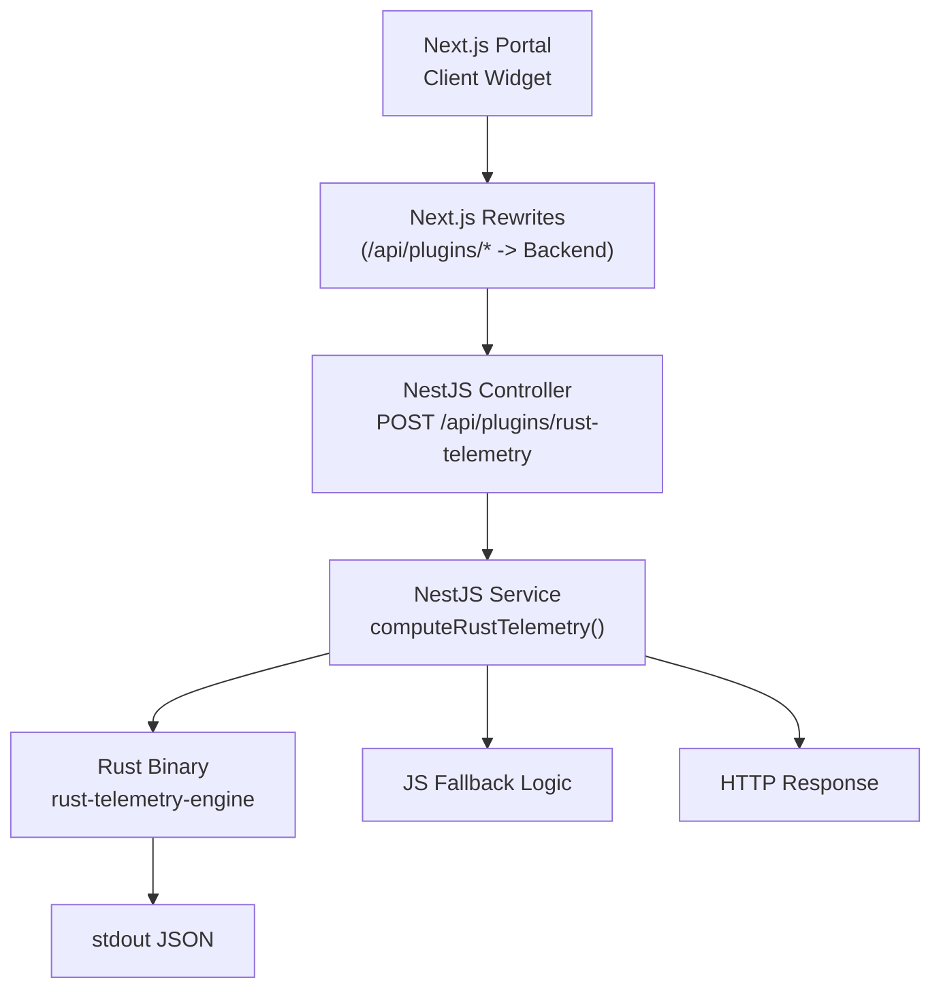
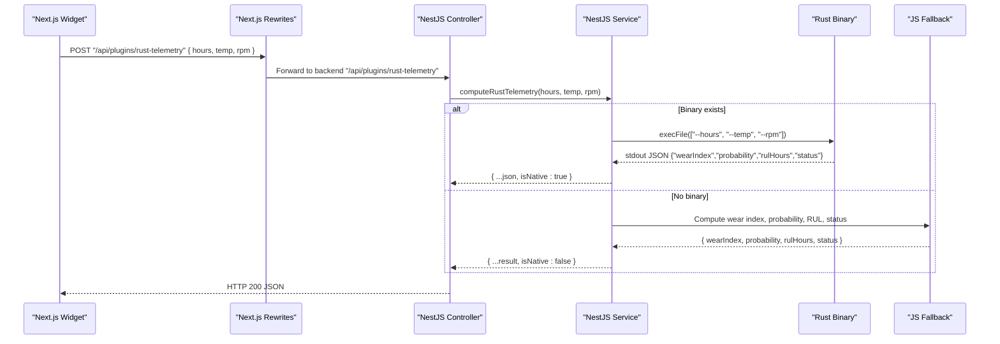
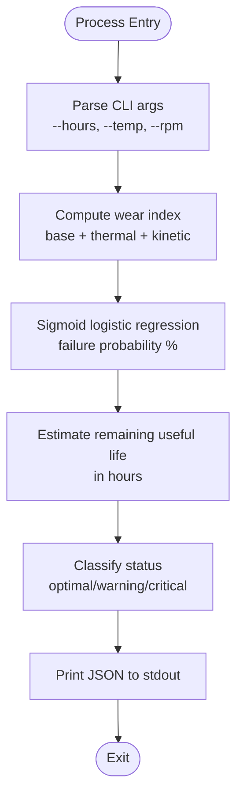
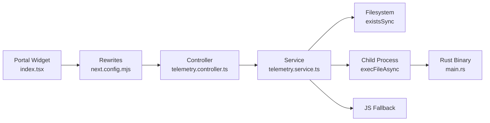

# Rust Telemetry Plugin Interface

<cite>
**Referenced Files in This Document**
- [telemetry.controller.ts](file://apps/api/src/telemetry/telemetry.controller.ts)
- [telemetry.service.ts](file://apps/api/src/telemetry/telemetry.service.ts)
- [index.tsx](file://apps/portal/plugins/rust-telemetry-engine/index.tsx)
- [main.rs](file://apps/portal/plugins/rust-telemetry-engine/src/main.rs)
- [Cargo.toml](file://apps/portal/plugins/rust-telemetry-engine/Cargo.toml)
- [types.ts](file://apps/portal/lib/plugins/types.ts)
- [next.config.mjs](file://apps/portal/next.config.mjs)
- [nginx.conf](file://config/nginx.conf)
</cite>

## Table of Contents

1. [Introduction](#introduction)
2. [Project Structure](#project-structure)
3. [Core Components](#core-components)
4. [Architecture Overview](#architecture-overview)
5. [Detailed Component Analysis](#detailed-component-analysis)
6. [Dependency Analysis](#dependency-analysis)
7. [Performance Considerations](#performance-considerations)
8. [Troubleshooting Guide](#troubleshooting-guide)
9. [Conclusion](#conclusion)

## Introduction

This document describes the high-performance telemetry ingestion endpoint and plugin architecture that integrates a native Rust engine into the Next.js application for real-time machine monitoring. The design exposes a JSON API to accept sensor inputs, delegates heavy computations to a compiled Rust binary via process execution, and returns structured results optimized for high-volume telemetry workloads. A JavaScript fallback ensures resilience when the native binary is unavailable.

The system supports:

- High-throughput telemetry ingestion via a dedicated HTTP endpoint
- Native Rust computation with a minimal CLI contract (JSON over stdout)
- Seamless integration between Next.js rewrites and the NestJS API layer
- Resilient fallback behavior and clear error signaling

## Project Structure

Key components involved in the Rust telemetry plugin interface:

- Next.js portal client calls the /api/plugins/rust-telemetry endpoint
- Next.js rewrites route this call to the backend API service
- NestJS controller exposes the endpoint and delegates to a service
- Service executes the Rust binary or falls back to JS logic
- Rust binary reads CLI arguments and prints a compact JSON result

**Diagram sources**

- [next.config.mjs:59-77](file://apps/portal/next.config.mjs#L59-L77)
- [telemetry.controller.ts:26-35](file://apps/api/src/telemetry/telemetry.controller.ts#L26-L35)
- [telemetry.service.ts:160-210](file://apps/api/src/telemetry/telemetry.service.ts#L160-L210)
- [main.rs:1-69](file://apps/portal/plugins/rust-telemetry-engine/src/main.rs#L1-L69)

**Section sources**

- [next.config.mjs:59-77](file://apps/portal/next.config.mjs#L59-L77)
- [telemetry.controller.ts:26-35](file://apps/api/src/telemetry/telemetry.controller.ts#L26-L35)
- [telemetry.service.ts:160-210](file://apps/api/src/telemetry/telemetry.service.ts#L160-L210)
- [main.rs:1-69](file://apps/portal/plugins/rust-telemetry-engine/src/main.rs#L1-L69)

## Core Components

- Next.js Client Widget: Initiates POST requests to /api/plugins/rust-telemetry with sensor data and renders results.
- Next.js Rewrites: Proxies /api/plugins/rust-telemetry to the backend API service.
- NestJS Controller: Defines the public endpoint and forwards parameters to the service.
- NestJS Service: Executes the Rust binary if available; otherwise runs JS fallback. Parses stdout JSON and returns enriched response.
- Rust Engine: Standalone binary accepting --hours, --temp, --rpm and printing a compact JSON object to stdout.
- Plugin Types: Shared TypeScript interfaces describing plugin metadata, widgets, and workflow nodes.

**Section sources**

- [index.tsx:1-192](file://apps/portal/plugins/rust-telemetry-engine/index.tsx#L1-L192)
- [next.config.mjs:59-77](file://apps/portal/next.config.mjs#L59-L77)
- [telemetry.controller.ts:26-35](file://apps/api/src/telemetry/telemetry.controller.ts#L26-L35)
- [telemetry.service.ts:160-210](file://apps/api/src/telemetry/telemetry.service.ts#L160-L210)
- [main.rs:1-69](file://apps/portal/plugins/rust-telemetry-engine/src/main.rs#L1-L69)
- [types.ts:1-71](file://apps/portal/lib/plugins/types.ts#L1-L71)

## Architecture Overview

End-to-end request flow from client to native computation and response:

**Diagram sources**

- [index.tsx:29-65](file://apps/portal/plugins/rust-telemetry-engine/index.tsx#L29-L65)
- [next.config.mjs:59-77](file://apps/portal/next.config.mjs#L59-L77)
- [telemetry.controller.ts:26-35](file://apps/api/src/telemetry/telemetry.controller.ts#L26-L35)
- [telemetry.service.ts:160-210](file://apps/api/src/telemetry/telemetry.service.ts#L160-L210)
- [main.rs:1-69](file://apps/portal/plugins/rust-telemetry-engine/src/main.rs#L1-L69)

## Detailed Component Analysis

### API Endpoint: POST /api/plugins/rust-telemetry

- Purpose: Accepts sensor inputs and returns computed telemetry metrics using the Rust engine or JS fallback.
- Request body fields:
  - hours: number (optional, default 150.0)
  - temp: number (optional, default 55.0)
  - rpm: number (optional, default 1000.0)
- Response fields:
  - wearIndex: number
  - probability: number
  - rulHours: number
  - status: "optimal" | "warning" | "critical"
  - isNative: boolean (true when Rust binary executed successfully)
- Behavior:
  - If the compiled binary exists at the expected path, execute it with CLI flags and parse stdout JSON.
  - Otherwise, compute equivalent metrics in JS and return with isNative: false.

**Section sources**

- [telemetry.controller.ts:26-35](file://apps/api/src/telemetry/telemetry.controller.ts#L26-L35)
- [telemetry.service.ts:160-210](file://apps/api/src/telemetry/telemetry.service.ts#L160-L210)

### Rust Engine Contract

- Input: CLI arguments --hours, --temp, --rpm (float values).
- Output: Single-line JSON to stdout with keys:
  - wearIndex: number
  - probability: number
  - rulHours: number
  - status: string ("optimal" | "warning" | "critical")
- Build profile: Optimized release settings for performance.

**Diagram sources**

- [main.rs:1-69](file://apps/portal/plugins/rust-telemetry-engine/src/main.rs#L1-L69)
- [Cargo.toml:1-15](file://apps/portal/plugins/rust-telemetry-engine/Cargo.toml#L1-L15)

**Section sources**

- [main.rs:1-69](file://apps/portal/plugins/rust-telemetry-engine/src/main.rs#L1-L69)
- [Cargo.toml:1-15](file://apps/portal/plugins/rust-telemetry-engine/Cargo.toml#L1-L15)

### Next.js Integration and Rewrites

- The portal widget posts to /api/plugins/rust-telemetry.
- Next.js rewrites forward this path to the backend API service URL configured via environment variables.
- This enables the same frontend code to operate against local or remote backend instances without changing endpoints.

**Section sources**

- [index.tsx:29-65](file://apps/portal/plugins/rust-telemetry-engine/index.tsx#L29-L65)
- [next.config.mjs:59-77](file://apps/portal/next.config.mjs#L59-L77)

### Plugin Types and Widgets

- ArchPlugin defines metadata, optional engine hooks, widgets, and workflow configuration.
- The Rust telemetry plugin registers a dashboard widget and workflow node with default configuration values.

**Section sources**

- [types.ts:1-71](file://apps/portal/lib/plugins/types.ts#L1-L71)
- [index.tsx:157-192](file://apps/portal/plugins/rust-telemetry-engine/index.tsx#L157-L192)

### Reverse Proxy Configuration (Optional)

- Nginx can be configured to proxy /api/plugins/rust-telemetry directly to the backend, bypassing Next.js rewrites if desired.

**Section sources**

- [nginx.conf:176-180](file://config/nginx.conf#L176-L180)

## Dependency Analysis

High-level dependencies across layers:

- Next.js portal depends on:
  - Rewrites configuration for routing
  - Plugin types for widget registration
- NestJS API depends on:
  - Child process execution utilities
  - Filesystem checks for binary existence
  - JSON parsing of stdout output
- Rust engine is independent and communicates via CLI and stdout JSON.

**Diagram sources**

- [index.tsx:29-65](file://apps/portal/plugins/rust-telemetry-engine/index.tsx#L29-L65)
- [next.config.mjs:59-77](file://apps/portal/next.config.mjs#L59-L77)
- [telemetry.controller.ts:26-35](file://apps/api/src/telemetry/telemetry.controller.ts#L26-L35)
- [telemetry.service.ts:160-210](file://apps/api/src/telemetry/telemetry.service.ts#L160-L210)
- [main.rs:1-69](file://apps/portal/plugins/rust-telemetry-engine/src/main.rs#L1-L69)

**Section sources**

- [index.tsx:29-65](file://apps/portal/plugins/rust-telemetry-engine/index.tsx#L29-L65)
- [next.config.mjs:59-77](file://apps/portal/next.config.mjs#L59-L77)
- [telemetry.controller.ts:26-35](file://apps/api/src/telemetry/telemetry.controller.ts#L26-L35)
- [telemetry.service.ts:160-210](file://apps/api/src/telemetry/telemetry.service.ts#L160-L210)
- [main.rs:1-69](file://apps/portal/plugins/rust-telemetry-engine/src/main.rs#L1-L69)

## Performance Considerations

- Native vs JS:
  - Rust binary provides deterministic, low-latency computation with minimal overhead.
  - JS fallback ensures availability but may incur higher CPU usage per request.
- Throughput expectations:
  - Each request spawns a short-lived process; throughput is limited by process creation overhead and I/O serialization.
  - For very high volumes, consider pooling or an embedded service approach to reduce process startup costs.
- Resource utilization:
  - Rust binary has near-zero external dependencies and optimized release profile for fast startup and minimal memory footprint.
  - Node side uses child_process.execFileAsync and fs.existsSync; ensure file permissions and paths are correct.
- Serialization format:
  - Compact single-line JSON minimizes parsing overhead and payload size.
- Streaming capabilities:
  - Current implementation is request/response; streaming is not implemented. If needed, adopt a long-lived IPC channel or WebSocket-based pipeline.

[No sources needed since this section provides general guidance]

## Troubleshooting Guide

Common issues and resolutions:

- Binary not found:
  - Ensure the compiled binary exists at the expected path under plugins/rust-telemetry-engine/target/release/rust-telemetry-engine.
  - Verify filesystem permissions and build artifacts presence.
- Incorrect CLI arguments:
  - Confirm that hours, temp, rpm are numeric and passed as strings to the binary.
  - Validate defaults used when fields are missing.
- JSON parse errors:
  - Ensure the Rust binary outputs valid single-line JSON to stdout.
  - Check for extra logs or debug output that could break JSON parsing.
- Network rewrite misconfiguration:
  - Verify NEXT_PUBLIC_API_URL or API_URL environment variable points to the correct backend host.
  - Confirm Next.js rewrites include /api/plugins/rust-telemetry.
- Error handling and recovery:
  - When the binary fails, the service logs a warning and falls back to JS computation.
  - The response includes isNative flag to indicate which path was taken.

**Section sources**

- [telemetry.service.ts:160-210](file://apps/api/src/telemetry/telemetry.service.ts#L160-L210)
- [next.config.mjs:59-77](file://apps/portal/next.config.mjs#L59-L77)
- [main.rs:1-69](file://apps/portal/plugins/rust-telemetry-engine/src/main.rs#L1-L69)

## Conclusion

The Rust telemetry plugin interface delivers a robust, high-performance pathway for real-time machine monitoring within the Next.js ecosystem. By delegating intensive calculations to a native Rust binary and providing a resilient JS fallback, the system balances speed and reliability. The JSON-over-stdout contract keeps inter-process communication simple and efficient. For extreme throughput scenarios, consider moving from process-per-request to a persistent service or embedded runtime to minimize overhead while preserving the benefits of native computation.
