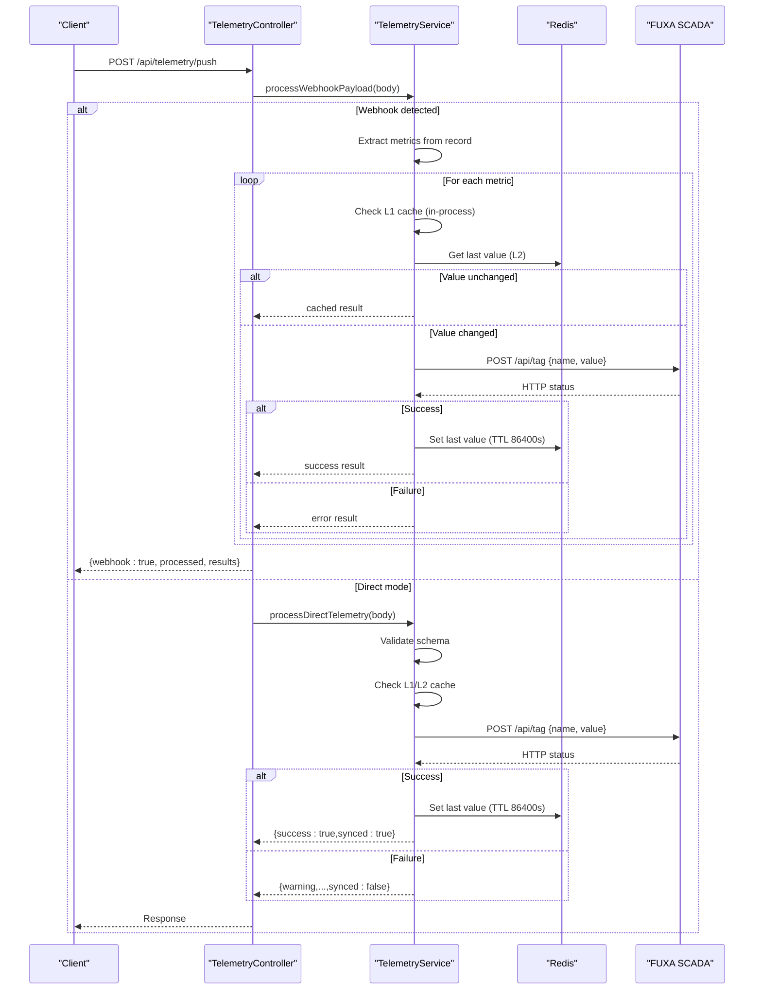

# Telemetry Push Endpoint

<cite>
**Referenced Files in This Document**
- [telemetry.controller.ts](file://apps/api/src/telemetry/telemetry.controller.ts)
- [telemetry.service.ts](file://apps/api/src/telemetry/telemetry.service.ts)
- [schemas.ts](file://apps/api/src/common/schemas.ts)
- [025_machine_telemetry.sql](file://packages/supabase/migrations/025_machine_telemetry.sql)
- [fuxa-integration-plan.md](file://docs/fuxa-integration-plan.md)
</cite>

## Table of Contents

1. [Introduction](#introduction)
2. [Endpoint Overview](#endpoint-overview)
3. [Request Schemas](#request-schemas)
4. [Response Schemas](#response-schemas)
5. [Dual-Mode Operation](#dual-mode-operation)
6. [Caching and Change Detection](#caching-and-change-detection)
7. [Error Handling](#error-handling)
8. [Examples](#examples)
9. [Architecture Overview](#architecture-overview)
10. [Detailed Component Analysis](#detailed-component-analysis)
11. [Performance Considerations](#performance-considerations)
12. [Troubleshooting Guide](#troubleshooting-guide)
13. [Conclusion](#conclusion)

## Introduction

This document provides detailed API documentation for the telemetry push endpoint that supports both direct single tag updates and batch processing from Supabase database webhooks. The endpoint forwards machine metrics to a FUXA SCADA system, with caching and change detection to minimize redundant network calls. It also documents field specifications, validation rules, scoping via department_id, and error responses.

## Endpoint Overview

- Method: POST
- Path: /api/telemetry/push
- Purpose: Accepts either a Supabase database webhook payload for machine_telemetry or a direct single-tag update request. Both modes forward relevant metrics to FUXA SCADA using its HTTP API.

Key behaviors:

- Webhook mode: Detects Supabase payloads and processes multiple metrics at once.
- Direct mode: Validates and processes a single metric update.
- Caching: Uses an in-process map and Redis to avoid sending duplicate values.
- Scoping: Supports optional department_id for cache key scoping.

**Section sources**

- [telemetry.controller.ts:11-25](file://apps/api/src/telemetry/telemetry.controller.ts#L11-L25)
- [telemetry.service.ts:49-114](file://apps/api/src/telemetry/telemetry.service.ts#L49-L114)
- [telemetry.service.ts:116-159](file://apps/api/src/telemetry/telemetry.service.ts#L116-L159)

## Request Schemas

### Mode A: Single Tag Update (Direct)

- Required fields:
  - name: string (non-empty, max length 200)
  - value: number | string (converted to number internally)
- Optional fields:
  - timestamp: ISO datetime string
  - machine_id: UUID
  - department_id: UUID (used for cache key scoping)
  - tags: arbitrary key-value pairs

Validation:

- Enforced by shared schema used during direct processing.

Notes:

- If required fields are missing, the controller returns a bad request error.

**Section sources**

- [schemas.ts:23-30](file://apps/api/src/common/schemas.ts#L23-L30)
- [telemetry.controller.ts:19-24](file://apps/api/src/telemetry/telemetry.controller.ts#L19-L24)
- [telemetry.service.ts:116-125](file://apps/api/src/telemetry/telemetry.service.ts#L116-L125)

### Mode B: Supabase Database Webhook Payload

- Triggered when:
  - table equals "machine_telemetry"
  - record object is present
- Supported fields extracted from record:
  - engine_rpm
  - engine_temp
  - hydraulic_pressure
  - vibration_level
  - fuel_level
  - bit_depth
- Additional identifiers:
  - machine_id: used to build tag names
  - department_id: used for cache key scoping

Behavior:

- For each non-null metric, constructs a tag name as machine*{machine_id}*{metric} and attempts to push to FUXA if changed.

**Section sources**

- [telemetry.service.ts:49-71](file://apps/api/src/telemetry/telemetry.service.ts#L49-L71)
- [025_machine_telemetry.sql:22-43](file://packages/supabase/migrations/025_machine_telemetry.sql#L22-L43)

## Response Schemas

### Direct Mode Response

- success: boolean — true if synced successfully
- synced: boolean — indicates whether the value was forwarded to FUXA
- cached: boolean — true if the value was skipped due to cache hit
- warning: string — present when FUXA is unreachable or returned a non-ok status
- error: object — present on validation failure; contains flattened validation errors and status code 400

Example shape:

- { success: true, synced: true }
- { success: true, synced: true, cached: true }
- { warning: "FUXA SCADA server is unreachable", synced: false }
- { warning: "FUXA SCADA server returned status <code>", synced: false }
- { error: { ... }, status: 400 }

**Section sources**

- [telemetry.service.ts:127-158](file://apps/api/src/telemetry/telemetry.service.ts#L127-L158)

### Webhook Mode Response

- webhook: boolean — always true for webhook payloads
- processed: number — count of metrics attempted
- results: array of per-metric outcomes
  - tag: string — full tag name (e.g., machine\_{id}\_engine_rpm)
  - success: boolean — true if FUXA accepted the update
  - cached: boolean — true if skipped due to cache hit
  - error: string — present when connection failed

Example shape:

- { webhook: true, processed: 6, results: [{ tag: "...", success: true, cached: true }, ...] }

**Section sources**

- [telemetry.service.ts:67-110](file://apps/api/src/telemetry/telemetry.service.ts#L67-L110)

## Dual-Mode Operation

The endpoint automatically detects the input type:

- If the body includes table === "machine_telemetry" and a record object, it treats the request as a Supabase webhook and processes all supported metrics.
- Otherwise, it expects a direct single-tag update with name and value.

Routing logic:

- Controller first checks for webhook pattern; if matched, delegates to webhook processor.
- If not a webhook, validates presence of name and value, then delegates to direct processor.

**Section sources**

- [telemetry.controller.ts:14-24](file://apps/api/src/telemetry/telemetry.controller.ts#L14-L24)
- [telemetry.service.ts:49-51](file://apps/api/src/telemetry/telemetry.service.ts#L49-L51)

## Caching and Change Detection

Two-level caching prevents unnecessary network calls:

- L1: In-process Map keyed by scoped tag name (department_id + tag).
- L2: Redis key telemetry:last:{tag} with TTL of 86400 seconds.

Change detection:

- Before sending to FUXA, compare current numeric value against cached last value.
- On successful FUXA response, update both caches.

Scoping:

- Cache keys are scoped by department_id when provided, enabling multi-tenant isolation within the same process.

**Section sources**

- [telemetry.service.ts:13-15](file://apps/api/src/telemetry/telemetry.service.ts#L13-L15)
- [telemetry.service.ts:32-47](file://apps/api/src/telemetry/telemetry.service.ts#L32-L47)
- [telemetry.service.ts:73-85](file://apps/api/src/telemetry/telemetry.service.ts#L73-L85)
- [telemetry.service.ts:127-137](file://apps/api/src/telemetry/telemetry.service.ts#L127-L137)

## Error Handling

- Missing required fields (direct mode): Returns a bad request error indicating missing name/value.
- Validation failures (direct mode): Returns a structured error object with flattened validation issues and status 400.
- FUXA connectivity issues:
  - Non-ok HTTP status: Returns a warning with the status code and synced set to false.
  - Network failure: Returns a warning indicating the server is unreachable and synced set to false.
- Webhook processing:
  - Connection failures per metric: Results include success: false and error: "Connection failed".

**Section sources**

- [telemetry.controller.ts:19-22](file://apps/api/src/telemetry/telemetry.controller.ts#L19-L22)
- [telemetry.service.ts:117-120](file://apps/api/src/telemetry/telemetry.service.ts#L117-L120)
- [telemetry.service.ts:149-158](file://apps/api/src/telemetry/telemetry.service.ts#L149-L158)
- [telemetry.service.ts:104-106](file://apps/api/src/telemetry/telemetry.service.ts#L104-L106)

## Examples

### Example A: Direct Single Tag Update

- Request:
  - name: "engine_rpm"
  - value: 1200
  - department_id: "<uuid>"
- Expected response:
  - { success: true, synced: true }
  - Or { success: true, synced: true, cached: true } if unchanged

### Example B: Database Webhook Forwarding to FUXA

- Trigger: Supabase inserts into machine_telemetry
- Payload includes:
  - table: "machine_telemetry"
  - record: { machine_id, department_id, engine_rpm, engine_temp, hydraulic_pressure, vibration_level, fuel_level, bit_depth, ... }
- Behavior:
  - Builds tags like machine\_{machine_id}\_engine_rpm
  - Skips null/undefined metrics
  - Applies caching and change detection
  - Returns processed count and per-tag results

[No sources needed since this section provides usage examples without analyzing specific files]

## Architecture Overview

**Diagram sources**

- [telemetry.controller.ts:14-24](file://apps/api/src/telemetry/telemetry.controller.ts#L14-L24)
- [telemetry.service.ts:49-114](file://apps/api/src/telemetry/telemetry.service.ts#L49-L114)
- [telemetry.service.ts:116-159](file://apps/api/src/telemetry/telemetry.service.ts#L116-L159)

## Detailed Component Analysis

### Controller: POST /api/telemetry/push

Responsibilities:

- Route incoming requests to appropriate service methods based on payload structure.
- Enforce presence of required fields for direct mode.
- Return consistent responses for both modes.

Key implementation details:

- Public endpoint (no authentication required).
- Swagger metadata included for API discovery.

**Section sources**

- [telemetry.controller.ts:6-25](file://apps/api/src/telemetry/telemetry.controller.ts#L6-L25)

### Service: TelemetryService

Responsibilities:

- Detect and process Supabase webhook payloads.
- Validate and process direct single-tag updates.
- Implement two-level caching and change detection.
- Forward metrics to FUXA SCADA via HTTP.

Key implementation details:

- Webhook detection uses table and record presence.
- Metric extraction limited to specified fields.
- Tag naming convention: machine*{machine_id}*{metric}.
- Cache scoping by department_id.
- Redis TTL of 86400 seconds for last values.
- Graceful handling of FUXA unavailability.

**Section sources**

- [telemetry.service.ts:17-30](file://apps/api/src/telemetry/telemetry.service.ts#L17-L30)
- [telemetry.service.ts:49-114](file://apps/api/src/telemetry/telemetry.service.ts#L49-L114)
- [telemetry.service.ts:116-159](file://apps/api/src/telemetry/telemetry.service.ts#L116-L159)

### Schema: Shared Validation

Responsibilities:

- Define strict validation rules for direct telemetry updates.
- Ensure data integrity before processing.

Key fields:

- name: non-empty string up to 200 characters.
- value: number or string (coerced to number).
- timestamp: optional ISO datetime.
- machine_id: optional UUID.
- department_id: optional UUID.
- tags: optional arbitrary key-value map.

**Section sources**

- [schemas.ts:23-30](file://apps/api/src/common/schemas.ts#L23-L30)

### Database Schema: Machine Telemetry

Relevant fields for webhook processing:

- engine_rpm
- engine_temp
- hydraulic_pressure
- vibration_level
- fuel_level
- bit_depth

Additional context:

- Department scoping via department_id.
- Indexes and policies support efficient queries and access control.

**Section sources**

- [025_machine_telemetry.sql:22-43](file://packages/supabase/migrations/025_machine_telemetry.sql#L22-L43)
- [025_machine_telemetry.sql:90-96](file://packages/supabase/migrations/025_machine_telemetry.sql#L90-L96)

## Performance Considerations

- Two-level caching reduces outbound calls significantly under high-frequency updates.
- Numeric comparison avoids redundant network traffic.
- Redis TTL ensures stale values do not persist indefinitely.
- Batch processing in webhook mode minimizes overhead per metric.

[No sources needed since this section provides general guidance]

## Troubleshooting Guide

Common issues and resolutions:

- Missing required fields: Ensure name and value are present for direct updates.
- Validation errors: Review flattened error object returned with status 400.
- FUXA unreachable: Check NEXT_PUBLIC_FUXA_URL configuration and network connectivity.
- Non-ok FUXA responses: Inspect warning message containing the HTTP status code.
- Duplicate updates: Verify caching behavior; expect cached: true when values have not changed.

**Section sources**

- [telemetry.controller.ts:19-22](file://apps/api/src/telemetry/telemetry.controller.ts#L19-L22)
- [telemetry.service.ts:117-120](file://apps/api/src/telemetry/telemetry.service.ts#L117-L120)
- [telemetry.service.ts:149-158](file://apps/api/src/telemetry/telemetry.service.ts#L149-L158)
- [telemetry.service.ts:104-106](file://apps/api/src/telemetry/telemetry.service.ts#L104-L106)

## Conclusion

The telemetry push endpoint provides a robust dual-mode interface for ingesting machine metrics, supporting both direct single-tag updates and batch processing from Supabase webhooks. With caching and change detection, it efficiently forwards only meaningful changes to FUXA SCADA while providing clear, actionable responses for clients.

[No sources needed since this section summarizes without analyzing specific files]
