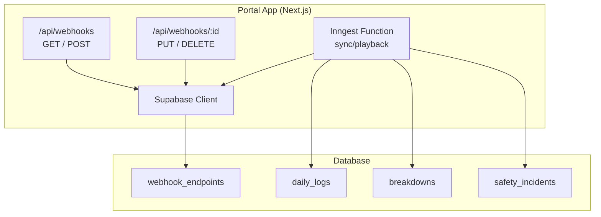
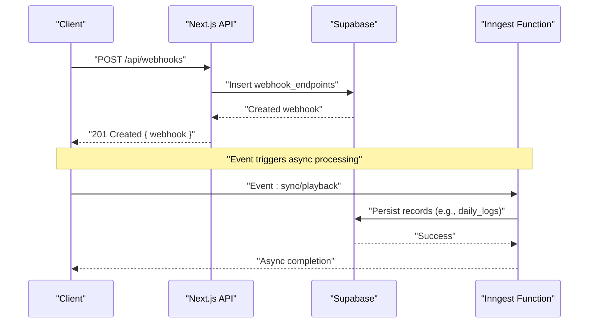
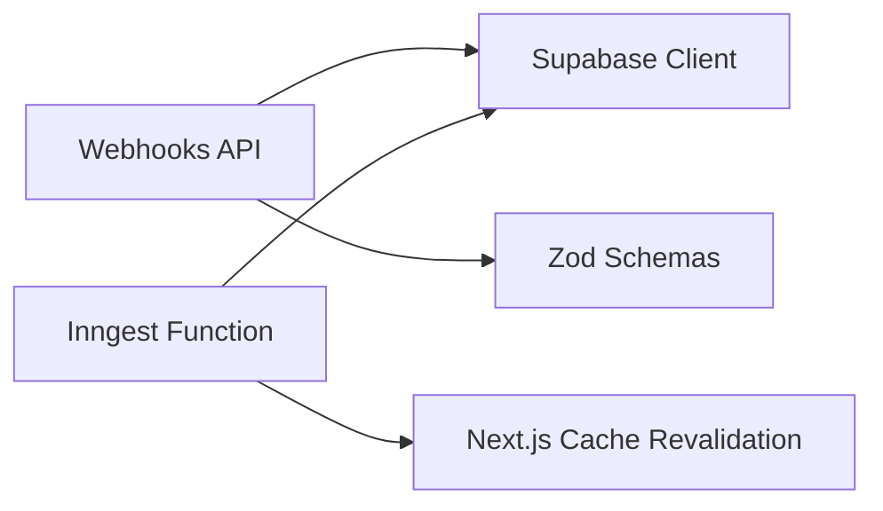

# Webhook Integrations API

<cite>
**Referenced Files in This Document**
- [route.ts](file://apps/portal/app/api/webhooks/route.ts)
- [route.ts](file://apps/portal/app/api/webhooks/[id]/route.ts)
- [schemas.ts](file://apps/portal/lib/api/schemas.ts)
- [sync-playback.ts](file://apps/portal/lib/jobs/sync-playback.ts)
</cite>

## Table of Contents

1. [Introduction](#introduction)
2. [Project Structure](#project-structure)
3. [Core Components](#core-components)
4. [Architecture Overview](#architecture-overview)
5. [Detailed Component Analysis](#detailed-component-analysis)
6. [Dependency Analysis](#dependency-analysis)
7. [Performance Considerations](#performance-considerations)
8. [Troubleshooting Guide](#troubleshooting-guide)
9. [Conclusion](#conclusion)
10. [Appendices](#appendices)

## Introduction

This document provides detailed API documentation for webhook management and delivery endpoints. It covers:

- Webhook CRUD operations with HTTP methods, request/response schemas, and validation rules
- Supported event types and example payload formats
- Security considerations including signing, authentication, and authorization
- Delivery guarantees, retry mechanisms, and failure handling
- Debugging tools and monitoring approaches for webhook delivery issues

The implementation is built on Next.js App Router with Supabase for persistence and Inngest for asynchronous job processing.

## Project Structure

Webhook management endpoints are implemented as Next.js Route Handlers under the portal app. Validation schemas are centralized. Asynchronous processing uses Inngest functions.

**Diagram sources**

- [route.ts:1-167](file://apps/portal/app/api/webhooks/route.ts#L1-L167)
- [route.ts:1-173](file://apps/portal/app/api/webhooks/[id]/route.ts#L1-L173)
- [sync-playback.ts:1-122](file://apps/portal/lib/jobs/sync-playback.ts#L1-L122)

**Section sources**

- [route.ts:1-167](file://apps/portal/app/api/webhooks/route.ts#L1-L167)
- [route.ts:1-173](file://apps/portal/app/api/webhooks/[id]/route.ts#L1-L173)
- [schemas.ts:1-186](file://apps/portal/lib/api/schemas.ts#L1-L186)
- [sync-playback.ts:1-122](file://apps/portal/lib/jobs/sync-playback.ts#L1-L122)

## Core Components

- Webhook Management Endpoints
  - GET /api/webhooks: List webhooks with role-based filtering
  - POST /api/webhooks: Create a new webhook endpoint
  - PUT /api/webhooks/:id: Update an existing webhook
  - DELETE /api/webhooks/:id: Soft-delete a webhook
- Validation Schemas
  - createWebhookSchema: Validates creation payloads
  - updateWebhookSchema: Validates update payloads
- Event Types
  - daily_log.created, daily_log.updated
  - breakdown.created, breakdown.updated, breakdown.completed
  - safety_incident.created, safety_incident.updated, safety_incident.resolved
  - production_log.created, production_log.updated
  - operational_delay.created, operational_delay.updated
- Asynchronous Processing
  - Inngest function sync/playback processes idempotent actions to persist data

**Section sources**

- [route.ts:1-167](file://apps/portal/app/api/webhooks/route.ts#L1-L167)
- [route.ts:1-173](file://apps/portal/app/api/webhooks/[id]/route.ts#L1-L173)
- [schemas.ts:24-42](file://apps/portal/lib/api/schemas.ts#L24-L42)
- [sync-playback.ts:1-122](file://apps/portal/lib/jobs/sync-playback.ts#L1-L122)

## Architecture Overview

High-level flow for webhook lifecycle and delivery:

- Clients authenticate via Supabase Auth and call management endpoints
- Endpoints validate requests using Zod schemas and enforce RBAC based on employee roles
- Webhooks are persisted in the database
- Events trigger Inngest functions which can perform side effects and revalidate UI paths
- Delivery to external endpoints is conceptually handled by an event dispatcher that signs payloads and retries on failures

**Diagram sources**

- [route.ts:95-166](file://apps/portal/app/api/webhooks/route.ts#L95-L166)
- [sync-playback.ts:8-121](file://apps/portal/lib/jobs/sync-playback.ts#L8-L121)

## Detailed Component Analysis

### Webhook Management Endpoints

#### GET /api/webhooks

- Purpose: List all active webhook endpoints visible to the authenticated user
- Authentication: Requires Supabase session; returns 401 if unauthorized
- Authorization: Admins see all; non-admins see only their department or accessible departments
- Response: JSON object containing array of webhooks
- Error Handling: Returns 404 if employee not found; 500 on database errors

Request

- Method: GET
- Headers: Authorization (Bearer token from Supabase)
- Query Parameters: None

Response

- 200 OK: { webhooks: Array<WebhookEndpoint> }
- 401 Unauthorized: { error: "Unauthorized" }
- 404 Not Found: { error: "Employee not found" }
- 500 Internal Server Error: { error: "Database query failed" }

**Section sources**

- [route.ts:39-93](file://apps/portal/app/api/webhooks/route.ts#L39-L93)

#### POST /api/webhooks

- Purpose: Create a new webhook endpoint
- Authentication: Requires Supabase session; returns 401 if unauthorized
- Authorization: Non-admins restricted to their department unless explicitly allowed
- Validation: Uses createWebhookSchema
- Response: Newly created webhook resource
- Side Effects: Revalidates admin and department tool pages

Request

- Method: POST
- Headers: Content-Type: application/json
- Body Schema:
  - url: string (required, valid URL, max length 2048)
  - description: string (optional, max length 500)
  - event_types: string[] (required, min 1, max 20, each string min length 1)
  - department_id: string (UUID, required)
  - secret: string (optional, min length 16)
  - active: boolean (optional, default true)

Response

- 201 Created: { webhook: WebhookEndpoint }
- 400 Bad Request: { error: "invalid input..." }
- 401 Unauthorized: { error: "Unauthorized" }
- 403 Forbidden: { error: "Forbidden" }
- 404 Not Found: { error: "Employee not found" }
- 500 Internal Server Error: { error: "Failed to create webhook" }

**Section sources**

- [route.ts:95-166](file://apps/portal/app/api/webhooks/route.ts#L95-L166)
- [schemas.ts:24-34](file://apps/portal/lib/api/schemas.ts#L24-L34)

#### PUT /api/webhooks/:id

- Purpose: Update an existing webhook endpoint
- Authentication: Requires Supabase session; returns 401 if unauthorized
- Authorization: Non-admins must own or have access to the webhook’s department
- Validation: Uses updateWebhookSchema
- Response: Updated webhook resource
- Side Effects: Revalidates admin and department tool pages

Request

- Method: PUT
- Headers: Content-Type: application/json
- Path Parameter: id (string UUID)
- Body Schema:
  - url: string (optional, valid URL, max length 2048)
  - description: string (optional, max length 500)
  - event_types: string[] (optional, min 1, max 20, each string min length 1)
  - active: boolean (optional)
  - secret: string (optional, min length 16)

Response

- 200 OK: { webhook: WebhookEndpoint }
- 400 Bad Request: { error: "invalid input..." }
- 401 Unauthorized: { error: "Unauthorized" }
- 403 Forbidden: { error: "Forbidden" }
- 404 Not Found: { error: "Webhook not found" }
- 500 Internal Server Error: { error: "Failed to update webhook" }

**Section sources**

- [route.ts:11-96](file://apps/portal/app/api/webhooks/[id]/route.ts#L11-L96)
- [schemas.ts:36-42](file://apps/portal/lib/api/schemas.ts#L36-L42)

#### DELETE /api/webhooks/:id

- Purpose: Soft-delete a webhook endpoint
- Authentication: Requires Supabase session; returns 401 if unauthorized
- Authorization: Non-admins must own or have access to the webhook’s department
- Behavior: Sets deleted_at timestamp instead of removing record
- Response: Success confirmation
- Side Effects: Revalidates admin and department tool pages

Request

- Method: DELETE
- Path Parameter: id (string UUID)

Response

- 200 OK: { success: true }
- 401 Unauthorized: { error: "Unauthorized" }
- 403 Forbidden: { error: "Forbidden" }
- 404 Not Found: { error: "Webhook not found" }
- 500 Internal Server Error: { error: "Failed to delete webhook" }

**Section sources**

- [route.ts:98-172](file://apps/portal/app/api/webhooks/[id]/route.ts#L98-L172)

### Webhook Data Model

Fields used by webhook endpoints:

- id: string (UUID)
- url: string
- description: string | null
- event_types: string[]
- department_id: string | null
- active: boolean
- secret: string | null
- deleted_at: string | null
- created_at: string
- updated_at: string | null

**Section sources**

- [route.ts:24-35](file://apps/portal/app/api/webhooks/route.ts#L24-L35)

### Supported Event Types

- daily_log.created
- daily_log.updated
- breakdown.created
- breakdown.updated
- breakdown.completed
- safety_incident.created
- safety_incident.updated
- safety_incident.resolved
- production_log.created
- production_log.updated
- operational_delay.created
- operational_delay.updated

These event types are defined in the route handler and represent domain events that may trigger webhook deliveries.

**Section sources**

- [route.ts:10-22](file://apps/portal/app/api/webhooks/route.ts#L10-L22)

### Example Payload Formats

While specific payload structures are not defined in the referenced files, typical webhook payloads include:

- event_type: one of the supported event types
- timestamp: ISO 8601 datetime
- data: object containing entity-specific fields (e.g., daily log, breakdown, safety incident)
- metadata: optional fields such as department_id, correlation_id

For idempotent processing examples, refer to the Inngest function which demonstrates structured event handling and idempotency keys.

**Section sources**

- [sync-playback.ts:8-121](file://apps/portal/lib/jobs/sync-playback.ts#L8-L121)

### Signature Verification

Conceptual guidance:

- Use HMAC SHA-256 to sign payloads with a per-webhook secret
- Include signature in header X-Arch-Signature
- Receivers should verify signatures before processing

Note: The repository references HMAC signing in documentation artifacts but does not implement verification logic in the analyzed files.

[No sources needed since this section provides general guidance]

### Retry Mechanisms

Conceptual guidance:

- Implement exponential backoff for failed deliveries
- Limit maximum retries (e.g., up to 5 attempts)
- Record delivery logs for observability

Note: The repository references retry behavior in documentation artifacts but does not implement delivery logic in the analyzed files.

[No sources needed since this section provides general guidance]

### Failure Handling

- Authentication failures return 401
- Authorization failures return 403
- Resource not found returns 404
- Validation errors return 400 with descriptive messages
- Database errors return 500 with generic error messages

**Section sources**

- [route.ts:39-93](file://apps/portal/app/api/webhooks/route.ts#L39-L93)
- [route.ts:95-166](file://apps/portal/app/api/webhooks/route.ts#L95-L166)
- [route.ts:11-96](file://apps/portal/app/api/webhooks/[id]/route.ts#L11-L96)
- [route.ts:98-172](file://apps/portal/app/api/webhooks/[id]/route.ts#L98-L172)

## Dependency Analysis

Component relationships and dependencies:

- Webhook endpoints depend on Supabase client for authentication and persistence
- Endpoints use shared Zod schemas for validation
- Inngest function depends on Supabase client for data operations and revalidates Next.js paths

**Diagram sources**

- [route.ts:1-167](file://apps/portal/app/api/webhooks/route.ts#L1-L167)
- [route.ts:1-173](file://apps/portal/app/api/webhooks/[id]/route.ts#L1-L173)
- [schemas.ts:1-186](file://apps/portal/lib/api/schemas.ts#L1-L186)
- [sync-playback.ts:1-122](file://apps/portal/lib/jobs/sync-playback.ts#L1-L122)

**Section sources**

- [route.ts:1-167](file://apps/portal/app/api/webhooks/route.ts#L1-L167)
- [route.ts:1-173](file://apps/portal/app/api/webhooks/[id]/route.ts#L1-L173)
- [schemas.ts:1-186](file://apps/portal/lib/api/schemas.ts#L1-L186)
- [sync-playback.ts:1-122](file://apps/portal/lib/jobs/sync-playback.ts#L1-L122)

## Performance Considerations

- Rate limiting is applied to webhook endpoints to prevent abuse
- Body size limits protect against large payloads during creation
- Soft deletes avoid expensive cascading operations and preserve history
- Revalidation of UI paths ensures consistent state after mutations

[No sources needed since this section provides general guidance]

## Troubleshooting Guide

Common issues and resolutions:

- 401 Unauthorized: Ensure Supabase session is present and valid
- 403 Forbidden: Verify user has access to the target department or is an admin
- 404 Not Found: Check employee existence and webhook ID validity
- 400 Bad Request: Validate request body against schema constraints
- 500 Internal Server Error: Inspect database connectivity and query errors

Debugging steps:

- Log request context and response status codes
- Monitor Inngest function execution metrics and errors
- Review database queries for performance bottlenecks

**Section sources**

- [route.ts:39-93](file://apps/portal/app/api/webhooks/route.ts#L39-L93)
- [route.ts:95-166](file://apps/portal/app/api/webhooks/route.ts#L95-L166)
- [route.ts:11-96](file://apps/portal/app/api/webhooks/[id]/route.ts#L11-L96)
- [route.ts:98-172](file://apps/portal/app/api/webhooks/[id]/route.ts#L98-L172)
- [sync-playback.ts:109-121](file://apps/portal/lib/jobs/sync-playback.ts#L109-L121)

## Conclusion

The webhook management API provides secure, validated, and role-aware CRUD operations for managing webhook endpoints. While delivery logic is not implemented in the analyzed files, the architecture supports asynchronous processing through Inngest and includes robust error handling and performance safeguards. Integration points for signing, retries, and delivery logging should be added to complete the webhook pipeline.

[No sources needed since this section summarizes without analyzing specific files]

## Appendices

### Security Considerations

- Authentication: All endpoints require Supabase sessions
- Authorization: Role-based access control restricts visibility and modifications
- Input Validation: Zod schemas enforce strict payload constraints
- Secrets: Optional per-webhook secrets for signing payloads
- IP Whitelisting: Not implemented in analyzed files; consider adding middleware for additional security

[No sources needed since this section provides general guidance]
