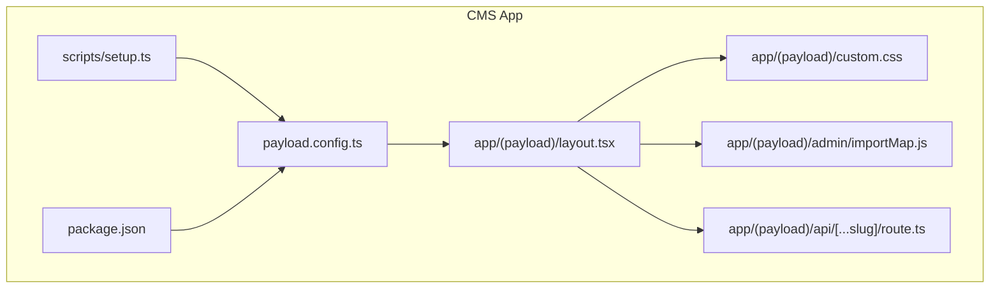
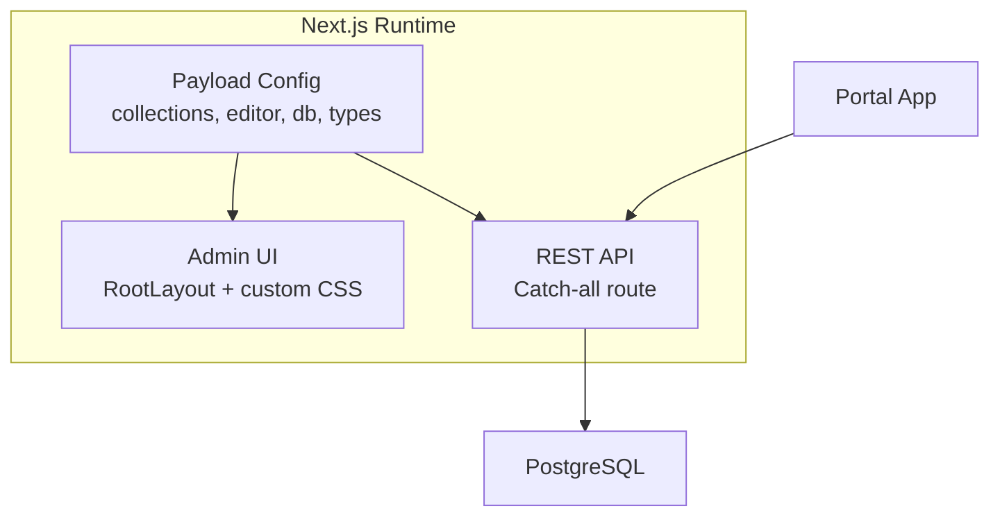
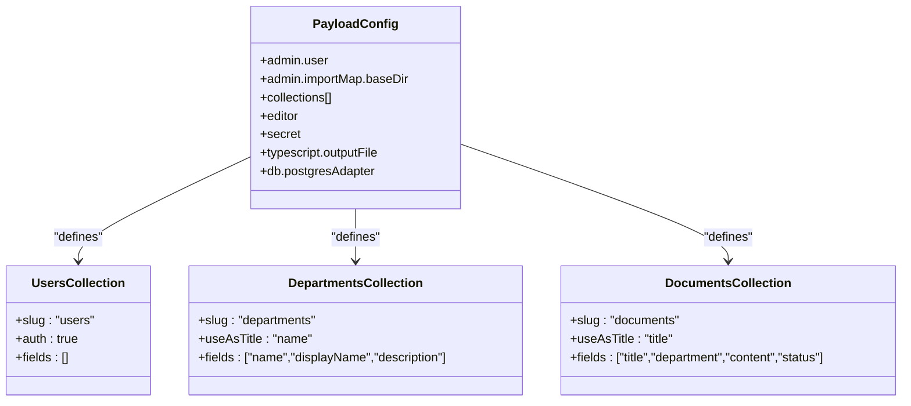
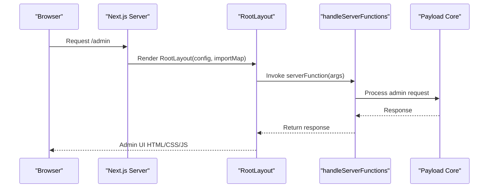
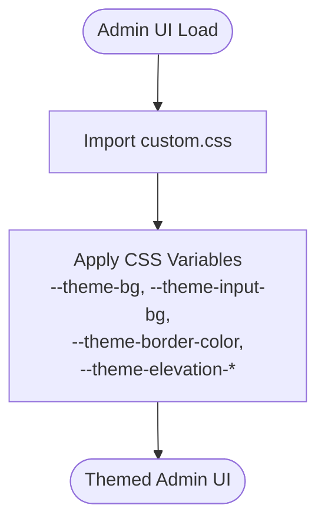
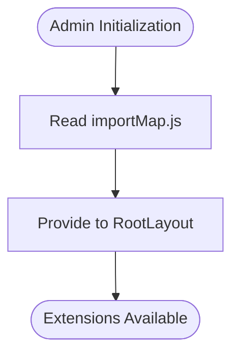
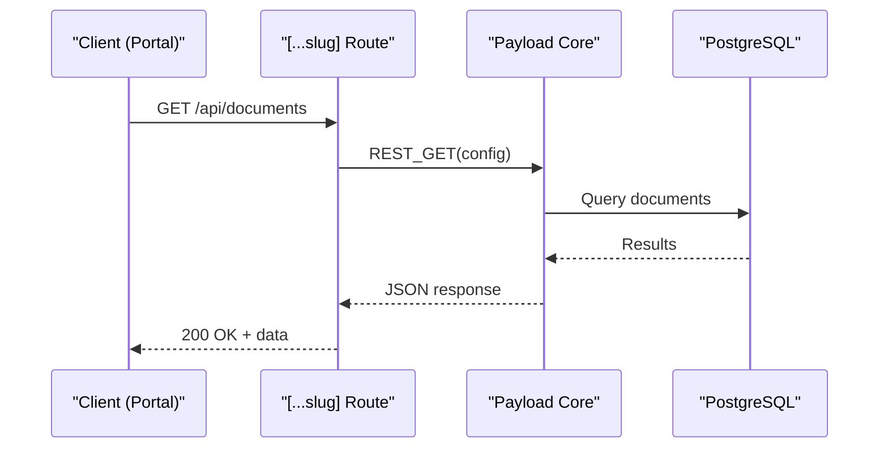
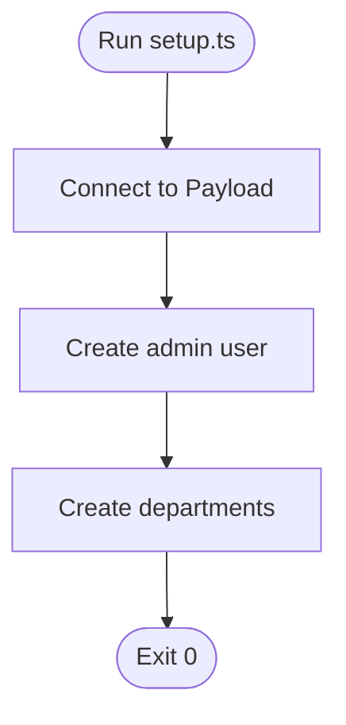
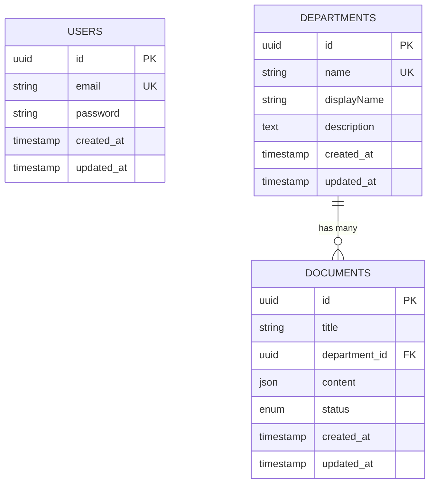
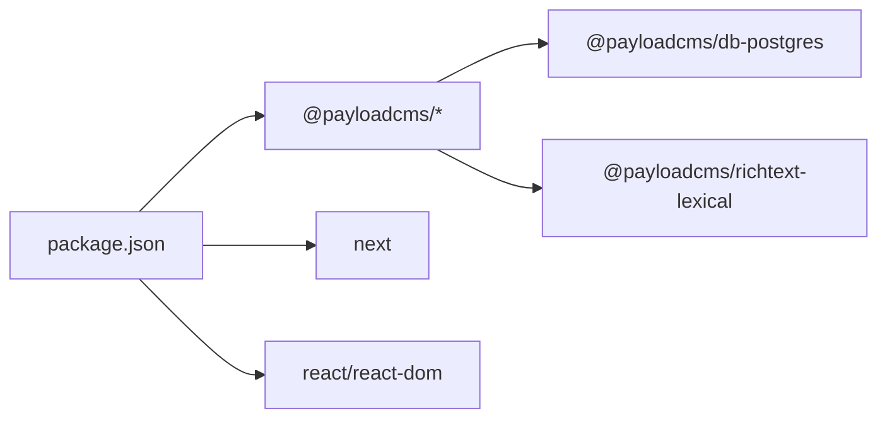

# CMS Application (Payload CMS)

<cite>
**Referenced Files in This Document**
- [payload.config.ts](file://apps/cms/payload.config.ts)
- [next.config.mjs](file://apps/cms/next.config.mjs)
- [layout.tsx](file://apps/cms/app/(payload)/layout.tsx)
- [custom.css](file://apps/cms/app/(payload)/custom.css)
- [importMap.js](file://apps/cms/app/(payload)/admin/importMap.js)
- [route.ts](file://apps/cms/app/(payload)/api/[...slug]/route.ts)
- [setup.ts](file://apps/cms/scripts/setup.ts)
- [package.json](file://apps/cms/package.json)
- [CLAUDE.md](file://CLAUDE.md)
</cite>

## Table of Contents

1. [Introduction](#introduction)
2. [Project Structure](#project-structure)
3. [Core Components](#core-components)
4. [Architecture Overview](#architecture-overview)
5. [Detailed Component Analysis](#detailed-component-analysis)
6. [Dependency Analysis](#dependency-analysis)
7. [Performance Considerations](#performance-considerations)
8. [Troubleshooting Guide](#troubleshooting-guide)
9. [Conclusion](#conclusion)
10. [Appendices](#appendices)

## Introduction

This document explains the Payload CMS application structure and how it integrates with the Next.js-based portal. It covers configuration, content modeling via collections, custom admin interface setup, theming, import maps, API routing, environment variables, and deployment considerations. The goal is to provide a clear understanding for both technical and non-technical readers on how content is modeled, managed, and delivered from the CMS to the main portal application.

## Project Structure

The CMS app is a standalone Next.js application that hosts the Payload admin UI and REST API. Key areas:

- Configuration: Central Payload configuration file defines collections, editor, database adapter, and TypeScript output.
- Admin UI: Next.js App Router layout wires Payload’s RootLayout, server functions, and custom CSS theme.
- API Routes: Catch-all route exposes standard REST endpoints for all collections.
- Scripts: Seed script creates an initial admin user and default departments.
- Dependencies: Package manifest lists Payload runtime, Postgres adapter, Lexical rich text editor, and Next.js integration.

**Diagram sources**

- [payload.config.ts:1-92](file://apps/cms/payload.config.ts#L1-L92)
- [layout.tsx](<file://apps/cms/app/(payload)/layout.tsx#L1-L25>)
- [custom.css](<file://apps/cms/app/(payload)/custom.css#L1-L9>)
- [importMap.js](<file://apps/cms/app/(payload)/admin/importMap.js#L1-L2>)
- [route.ts](<file://apps/cms/app/(payload)/api/[...slug]/route.ts#L1-L15>)
- [setup.ts:1-52](file://apps/cms/scripts/setup.ts#L1-L52)
- [package.json:1-32](file://apps/cms/package.json#L1-L32)

**Section sources**

- [payload.config.ts:1-92](file://apps/cms/payload.config.ts#L1-L92)
- [next.config.mjs:1-9](file://apps/cms/next.config.mjs#L1-L9)
- [layout.tsx:1-25](<file://apps/cms/app/(payload)/layout.tsx#L1-L25>)
- [custom.css:1-9](<file://apps/cms/app/(payload)/custom.css#L1-L9>)
- [importMap.js:1-2](<file://apps/cms/app/(payload)/admin/importMap.js#L1-L2>)
- [route.ts:1-15](<file://apps/cms/app/(payload)/api/[...slug]/route.ts#L1-L15>)
- [setup.ts:1-52](file://apps/cms/scripts/setup.ts#L1-L52)
- [package.json:1-32](file://apps/cms/package.json#L1-L32)

## Core Components

- Payload configuration: Defines admin user collection, collections (users, departments, documents), Lexical editor, secret, TypeScript types output path, and Postgres adapter connection string.
- Next.js integration: Uses withPayload wrapper to enable Payload routes and admin under Next.js.
- Admin layout: Wires RootLayout with config, import map, and server function handler; imports custom CSS for theming.
- Custom CSS: Provides dark-themed CSS variables for background, inputs, borders, and elevation layers.
- Import map: Placeholder export for extending admin with custom components or modules.
- API catch-all: Exposes standard REST methods for all collections.
- Seed script: Creates an admin user and initial department records for quick start.

**Section sources**

- [payload.config.ts:10-91](file://apps/cms/payload.config.ts#L10-L91)
- [next.config.mjs:1-9](file://apps/cms/next.config.mjs#L1-L9)
- [layout.tsx:11-22](<file://apps/cms/app/(payload)/layout.tsx#L11-L22>)
- [custom.css:2-8](<file://apps/cms/app/(payload)/custom.css#L2-L8>)
- [importMap.js:1-2](<file://apps/cms/app/(payload)/admin/importMap.js#L1-L2>)
- [route.ts:10-14](<file://apps/cms/app/(payload)/api/[...slug]/route.ts#L10-L14>)
- [setup.ts:4-46](file://apps/cms/scripts/setup.ts#L4-L46)

## Architecture Overview

The CMS runs as its own Next.js service. The admin panel is served under the Payload route group, while the REST API is exposed through a catch-all route. Content models are defined in the central configuration and persisted to a Postgres database using the provided adapter. The portal can consume these REST endpoints to render content.

**Diagram sources**

- [payload.config.ts:10-91](file://apps/cms/payload.config.ts#L10-L91)
- [layout.tsx:11-22](<file://apps/cms/app/(payload)/layout.tsx#L11-L22>)
- [route.ts:10-14](<file://apps/cms/app/(payload)/api/[...slug]/route.ts#L10-L14>)

## Detailed Component Analysis

### CMS Configuration (payload.config.ts)

- Admin settings:
  - User collection reference set to users.
  - Import map base directory configured for admin extensions.
- Collections:
  - users: Auth-enabled collection with no additional fields.
  - departments: Text fields for name, displayName, description; uses name as title in admin.
  - documents: Title, relationship to departments, rich text content, select status with defaults.
- Editor: Lexical rich text editor enabled globally.
- Secret: Loaded from environment variable.
- Typescript: Generates payload-types.ts at build time.
- Database: Postgres adapter using DATABASE_URL.

**Diagram sources**

- [payload.config.ts:10-80](file://apps/cms/payload.config.ts#L10-L80)

**Section sources**

- [payload.config.ts:10-91](file://apps/cms/payload.config.ts#L10-L91)

### Next.js Integration and Admin Layout

- next.config.mjs wraps Next.js config with withPayload to enable Payload features.
- Admin layout:
  - Imports RootLayout and handleServerFunctions from Payload Next integration.
  - Passes config and importMap to RootLayout.
  - Server function delegates to handleServerFunctions for request handling.
  - Imports custom CSS for theming.

**Diagram sources**

- [next.config.mjs:1-9](file://apps/cms/next.config.mjs#L1-L9)
- [layout.tsx:11-22](<file://apps/cms/app/(payload)/layout.tsx#L11-L22>)

**Section sources**

- [next.config.mjs:1-9](file://apps/cms/next.config.mjs#L1-L9)
- [layout.tsx:1-25](<file://apps/cms/app/(payload)/layout.tsx#L1-L25>)

### Custom CSS Theming

- Dark theme variables define background, input backgrounds, border colors, and elevation layers.
- Imported by the admin layout to style the Payload admin UI consistently.

**Diagram sources**

- [custom.css:2-8](<file://apps/cms/app/(payload)/custom.css#L2-L8>)
- [layout.tsx:5](<file://apps/cms/app/(payload)/layout.tsx#L5>)

**Section sources**

- [custom.css:1-9](<file://apps/cms/app/(payload)/custom.css#L1-L9>)
- [layout.tsx:5](<file://apps/cms/app/(payload)/layout.tsx#L5>)

### Import Map Configuration

- Exported importMap object is passed into RootLayout to allow admin extension points.
- Currently empty, ready for future custom components or modules.

**Diagram sources**

- [importMap.js:1-2](<file://apps/cms/app/(payload)/admin/importMap.js#L1-L2>)
- [layout.tsx:14](<file://apps/cms/app/(payload)/layout.tsx#L14>)

**Section sources**

- [importMap.js:1-2](<file://apps/cms/app/(payload)/admin/importMap.js#L1-L2>)
- [layout.tsx:14](<file://apps/cms/app/(payload)/layout.tsx#L14>)

### API Routes (REST)

- Catch-all route exports standard REST handlers (GET, POST, PATCH, DELETE, OPTIONS) bound to the Payload config.
- Enables CRUD operations across all collections without writing individual handlers.

**Diagram sources**

- [route.ts:10-14](<file://apps/cms/app/(payload)/api/[...slug]/route.ts#L10-L14>)

**Section sources**

- [route.ts:1-15](<file://apps/cms/app/(payload)/api/[...slug]/route.ts#L1-15>)

### Seed Script (Initial Data)

- Creates an admin user with email and password.
- Seeds multiple departments with name, displayName, and description.
- Exits cleanly after completion.

**Diagram sources**

- [setup.ts:4-46](file://apps/cms/scripts/setup.ts#L4-L46)

**Section sources**

- [setup.ts:1-52](file://apps/cms/scripts/setup.ts#L1-L52)

### Content Modeling Approach

- Users: Authentication-only collection.
- Departments: Simple entity with unique name and display metadata.
- Documents: Rich content model with a required relationship to departments and a status field for lifecycle management.

**Diagram sources**

- [payload.config.ts:17-79](file://apps/cms/payload.config.ts#L17-L79)

**Section sources**

- [payload.config.ts:17-79](file://apps/cms/payload.config.ts#L17-L79)

## Dependency Analysis

- Runtime dependencies include Payload core, Next.js integration, Postgres adapter, Lexical editor, React, and Next.js.
- Development dependencies include TypeScript tooling and ESLint.
- The CLAUDE documentation notes that apps/cms is Payload CMS v3 on Postgres.

**Diagram sources**

- [package.json:4-11](file://apps/cms/package.json#L4-L11)
- [CLAUDE.md:84-97](file://CLAUDE.md#L84-L97)

**Section sources**

- [package.json:1-32](file://apps/cms/package.json#L1-L32)
- [CLAUDE.md:84-97](file://CLAUDE.md#L84-L97)

## Performance Considerations

- Use the Postgres adapter with a connection pool configured via DATABASE_URL. Ensure adequate pool sizing for concurrent admin and API usage.
- Leverage the Lexical editor for efficient rich text editing and storage.
- Keep the import map minimal to avoid unnecessary overhead in the admin bundle.
- Consider caching strategies in the portal when consuming CMS REST endpoints to reduce load on the CMS.

[No sources needed since this section provides general guidance]

## Troubleshooting Guide

- Missing environment variables:
  - PAYLOAD_SECRET must be set for secure operation.
  - DATABASE_URL must point to a valid Postgres instance.
- Admin login issues:
  - Run the seed script to create the admin user if missing.
- API not responding:
  - Verify the catch-all route is mounted and Next.js is running with Payload integration.
- Theme not applied:
  - Confirm custom.css is imported by the admin layout and CSS variables are correctly defined.

**Section sources**

- [payload.config.ts:82-90](file://apps/cms/payload.config.ts#L82-L90)
- [setup.ts:4-16](file://apps/cms/scripts/setup.ts#L4-L16)
- [route.ts:10-14](<file://apps/cms/app/(payload)/api/[...slug]/route.ts#L10-L14>)
- [layout.tsx:5](<file://apps/cms/app/(payload)/layout.tsx#L5>)
- [custom.css:2-8](<file://apps/cms/app/(payload)/custom.css#L2-L8>)

## Conclusion

The CMS is a well-structured Payload v3 application integrated with Next.js. It provides a clean separation between configuration, admin UI, API, and seeding logic. The content model centers around departments and documents with rich text support and relationships. With proper environment configuration and optional theming, the CMS can serve as a robust content source for the portal application.

[No sources needed since this section summarizes without analyzing specific files]

## Appendices

### Environment Configuration

- Required variables:
  - PAYLOAD_SECRET: Secret key for Payload security.
  - DATABASE_URL: Connection string for Postgres.
- Optional:
  - NODE_ENV, PORT, HOSTNAME for deployment orchestration.

**Section sources**

- [payload.config.ts:82-90](file://apps/cms/payload.config.ts#L82-L90)

### Deployment Considerations

- Build and run commands are provided in package.json scripts.
- The CMS is a separate Next.js app; ensure it is deployed alongside the portal and API services.
- Nginx reverse proxy can route traffic to the CMS admin and API endpoints as part of the overall stack.

**Section sources**

- [package.json:23-30](file://apps/cms/package.json#L23-L30)
- [CLAUDE.md:84-97](file://CLAUDE.md#L84-L97)
