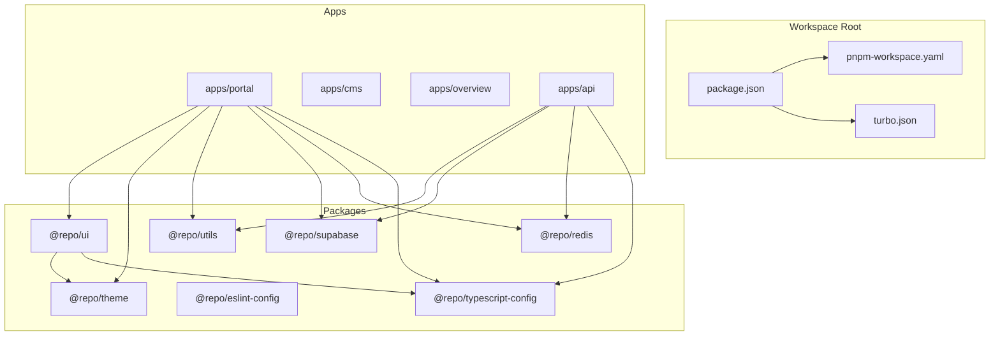
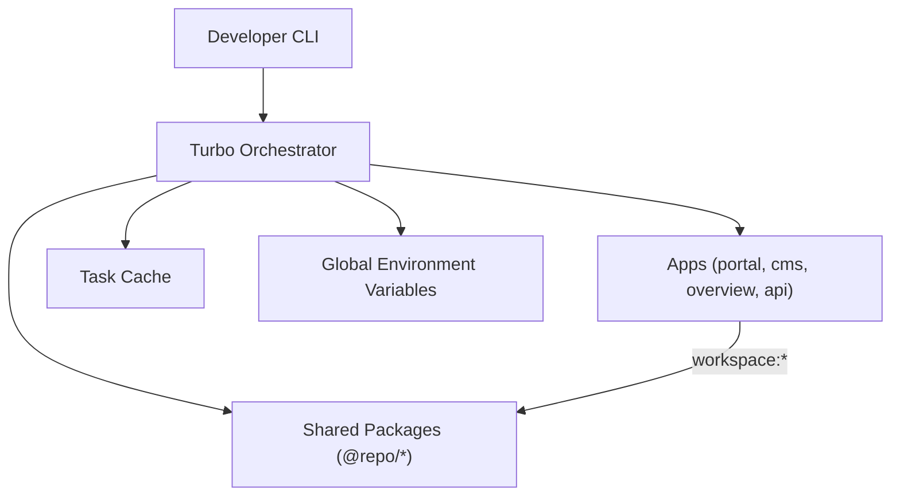
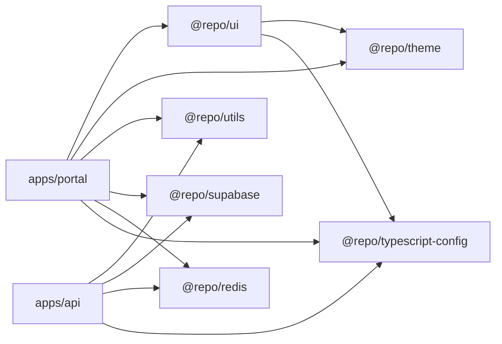

# Monorepo Organization & NX Configuration

<cite>
**Referenced Files in This Document**
- [package.json](file://package.json)
- [pnpm-workspace.yaml](file://pnpm-workspace.yaml)
- [turbo.json](file://turbo.json)
- [apps/portal/package.json](file://apps/portal/package.json)
- [packages/ui/package.json](file://packages/ui/package.json)
- [packages/eslint-config/package.json](file://packages/eslint-config/package.json)
- [packages/typescript-config/package.json](file://packages/typescript-config/package.json)
- [apps/api/package.json](file://apps/api/package.json)
</cite>

## Table of Contents

1. [Introduction](#introduction)
2. [Project Structure](#project-structure)
3. [Core Components](#core-components)
4. [Architecture Overview](#architecture-overview)
5. [Detailed Component Analysis](#detailed-component-analysis)
6. [Dependency Analysis](#dependency-analysis)
7. [Performance Considerations](#performance-considerations)
8. [Troubleshooting Guide](#troubleshooting-guide)
9. [Conclusion](#conclusion)
10. [Appendices](#appendices)

## Introduction

This document explains the monorepo organization and build orchestration for this workspace. The repository uses pnpm workspaces to manage packages and applications, and Turbo to orchestrate builds, caching, and parallel execution across all apps and packages. It also covers how inter-package dependencies are declared and resolved, shared configurations, workspace-wide linting and testing setup, environment variable handling, and examples of running commands across the workspace.

Note: Although the objective mentions NX, this codebase is configured with Turbo rather than NX. Where relevant, we describe how similar concepts map to NX (e.g., namedInputs vs inputs, targetDefaults vs tasks).

## Project Structure

The workspace is organized into two primary areas:

- apps/\*: End-user or service applications (Next.js apps, NestJS API, CMS, overview site)
- packages/\*: Shared libraries and tooling consumed by apps (UI components, theme, TypeScript config, ESLint config, utilities, Redis client, Supabase helpers, etc.)

pnpm workspaces declares these directories as workspace roots, enabling cross-package dependency resolution via workspace:\* protocol.

**Diagram sources**

- [pnpm-workspace.yaml:1-4](file://pnpm-workspace.yaml#L1-L4)
- [apps/portal/package.json:18-22](file://apps/portal/package.json#L18-L22)
- [packages/ui/package.json:12-12](file://packages/ui/package.json#L12-L12)
- [packages/ui/package.json:24-24](file://packages/ui/package.json#L24-L24)
- [apps/api/package.json:30-32](file://apps/api/package.json#L30-L32)

**Section sources**

- [pnpm-workspace.yaml:1-4](file://pnpm-workspace.yaml#L1-L4)
- [package.json:48-49](file://package.json#L48-L49)

## Core Components

- Workspace definition: pnpm-workspace.yaml defines which directories are part of the workspace and provides a catalog of pinned versions for common dependencies.
- Build orchestration: turbo.json defines global dependencies, environment variables, and task definitions for build, lint, test, type-check, and more.
- Application packages: Each app exposes scripts like build, dev, lint, test, and type-check that Turbo can run in parallel and cache.
- Shared packages: Libraries such as @repo/ui, @repo/theme, @repo/utils, @repo/supabase, and @repo/redis are consumed via workspace:\* dependencies.

Key behaviors:

- Parallel execution: Turbo runs independent tasks concurrently by default.
- Incremental builds: Tasks declare inputs and outputs; Turbo caches results when inputs have not changed.
- Dependency graph: Tasks can depend on other tasks in upstream packages using ^task syntax.

**Section sources**

- [pnpm-workspace.yaml:1-33](file://pnpm-workspace.yaml#L1-L33)
- [turbo.json:1-78](file://turbo.json#L1-L78)
- [apps/portal/package.json:66-74](file://apps/portal/package.json#L66-L74)
- [apps/api/package.json:5-16](file://apps/api/package.json#L5-L16)
- [packages/ui/package.json:79-86](file://packages/ui/package.json#L79-L86)

## Architecture Overview

At a high level, the workspace orchestrates multiple Next.js applications, a NestJS API, and shared packages. Turbo coordinates task execution across the dependency graph, while pnpm resolves workspace dependencies.

[No sources needed since this diagram shows conceptual workflow, not actual code structure]

## Detailed Component Analysis

### pnpm Workspaces and Catalogs

- Workspace scope: apps/_ and packages/_ are included.
- Catalogs: Centralized version pinning for frequently used packages ensures consistency across the workspace.

Implications:

- All apps and packages resolve shared dependencies from the catalog.
- Upgrades can be coordinated centrally.

**Section sources**

- [pnpm-workspace.yaml:1-4](file://pnpm-workspace.yaml#L1-L4)
- [pnpm-workspace.yaml:5-26](file://pnpm-workspace.yaml#L5-L26)
- [pnpm-workspace.yaml:27-33](file://pnpm-workspace.yaml#L27-L33)

### Turbo Task Definitions and Caching

- Global dependencies: tsconfig.json, pnpm-workspace.yaml, .npmrc affect cache invalidation globally.
- Global environment variables: NODE*ENV, CI, VERCEL_ENV, OTEL*\* keys, and others are forwarded to tasks.
- Task definitions:
  - build: depends on upstream build and codegen; excludes tests and stories; outputs .next/** and dist/**.
  - type-check: excludes tests and stories; caches tsbuildinfo.
  - lint: excludes tests and stories; caches eslintcache.
  - test: includes Jest/Vitest/Playwright configs; caches coverage.
  - dev: persistent and non-cached.
  - clean: non-cached.

Caching strategy:

- Inputs define what changes invalidate a task’s cache.
- Outputs define artifacts that are cached.
- dependsOn enables topological execution across packages.

**Section sources**

- [turbo.json:3-7](file://turbo.json#L3-L7)
- [turbo.json:8-21](file://turbo.json#L8-L21)
- [turbo.json:22-76](file://turbo.json#L22-L76)

### Application Scripts and Inter-Package Dependencies

- portal app:
  - build, dev, start, lint, test, type-check scripts.
  - Depends on @repo/ui, @repo/theme, @repo/utils, @repo/supabase, @repo/redis, and @repo/typescript-config via workspace:\*.
- api app:
  - NestJS-based build/dev/test/type-check scripts.
  - Depends on @repo/utils, @repo/supabase, @repo/redis, and @repo/typescript-config via workspace:\*.
- ui package:
  - Exposes components and Tailwind/PostCSS configuration via exports.
  - Depends on @repo/theme and @repo/typescript-config.

These dependencies form the graph that Turbo traverses to determine build order and cache invalidation.

**Section sources**

- [apps/portal/package.json:18-22](file://apps/portal/package.json#L18-L22)
- [apps/portal/package.json:66-74](file://apps/portal/package.json#L66-L74)
- [apps/api/package.json:30-32](file://apps/api/package.json#L30-L32)
- [apps/api/package.json:5-16](file://apps/api/package.json#L5-L16)
- [packages/ui/package.json:12-12](file://packages/ui/package.json#L12-L12)
- [packages/ui/package.json:24-24](file://packages/ui/package.json#L24-L24)
- [packages/ui/package.json:39-75](file://packages/ui/package.json#L39-L75)

### Shared Configurations

- ESLint config package: @repo/eslint-config publishes library presets for consistent linting across the workspace.
- TypeScript config package: @repo/typescript-config centralizes TS settings consumed by apps and packages.

Usage pattern:

- Apps and packages reference these packages via workspace:\* in devDependencies and extend their configs in local tooling files.

**Section sources**

- [packages/eslint-config/package.json:1-16](file://packages/eslint-config/package.json#L1-L16)
- [packages/typescript-config/package.json:1-7](file://packages/typescript-config/package.json#L1-L7)

### Environment Variable Handling

- Global env vars are explicitly listed in the orchestrator configuration so they propagate to all tasks.
- Examples include runtime flags, telemetry endpoints, and feature toggles.

Best practices:

- Keep secrets out of the repo; inject them at runtime or CI.
- Use per-app env files where appropriate; ensure only required variables are forwarded globally.

**Section sources**

- [turbo.json:8-21](file://turbo.json#L8-L21)

### Workspace-Wide Linting and Testing Setup

- Linting:
  - Each app and package defines a lint script.
  - The root quality pipeline runs lint across the workspace and enforces formatting and dependency checks.
- Testing:
  - Apps use Jest; e2e tests use Playwright.
  - The orchestrator caches test outputs to speed up repeated runs.

Examples of running commands across the workspace:

- Run all linters: use the root script that invokes the orchestrator.
- Run all tests: use the root script that invokes the orchestrator.
- Type-check all packages/apps: use the root script that invokes the orchestrator.

**Section sources**

- [package.json:72-87](file://package.json#L72-L87)
- [turbo.json:59-68](file://turbo.json#L59-L68)

### Parallel Builds and Incremental Compilation

- Parallelism:
  - Independent tasks execute concurrently by default.
  - Topological ordering respects dependsOn relationships.
- Incremental compilation:
  - Inputs and outputs are declared per task.
  - When inputs do not change, cached outputs are reused.

Operational tips:

- Keep inputs precise to maximize cache hits.
- Avoid including large generated artifacts in inputs.
- Use persistent tasks for long-running dev servers.

**Section sources**

- [turbo.json:36-49](file://turbo.json#L36-L49)
- [turbo.json:54-58](file://turbo.json#L54-L58)
- [turbo.json:69-72](file://turbo.json#L69-L72)

## Dependency Analysis

Inter-package dependencies drive the build graph. Applications consume shared packages via workspace:\* declarations.

**Diagram sources**

- [apps/portal/package.json:18-22](file://apps/portal/package.json#L18-L22)
- [apps/api/package.json:30-32](file://apps/api/package.json#L30-L32)
- [packages/ui/package.json:12-12](file://packages/ui/package.json#L12-L12)
- [packages/ui/package.json:24-24](file://packages/ui/package.json#L24-L24)

**Section sources**

- [apps/portal/package.json:18-22](file://apps/portal/package.json#L18-L22)
- [apps/api/package.json:30-32](file://apps/api/package.json#L30-L32)
- [packages/ui/package.json:12-12](file://packages/ui/package.json#L12-L12)
- [packages/ui/package.json:24-24](file://packages/ui/package.json#L24-L24)

## Performance Considerations

- Narrow inputs: Exclude test and story files from build inputs to reduce unnecessary rebuilds.
- Cache outputs: Ensure outputs are deterministic and minimal (e.g., exclude cache directories).
- Pin versions: Use catalogs to avoid drift and redundant installs.
- Parallelize wisely: Let the orchestrator schedule tasks based on the dependency graph.
- Monitor cache hit rates: Adjust inputs/outputs if cache misses are frequent.

[No sources needed since this section provides general guidance]

## Troubleshooting Guide

Common issues and remedies:

- Missing environment variables:
  - Ensure required variables are present locally or in CI; verify they are allowed in the orchestrator’s globalEnv list.
- Stale cache:
  - Clear task caches if outputs become inconsistent after changing inputs.
- Dependency mismatches:
  - Use workspace:\* for internal packages and keep catalogs updated to align versions.
- Slow builds:
  - Review task inputs/outputs; remove unnecessary files from inputs; ensure outputs are correct.

**Section sources**

- [turbo.json:3-7](file://turbo.json#L3-L7)
- [turbo.json:8-21](file://turbo.json#L8-L21)
- [turbo.json:36-49](file://turbo.json#L36-L49)

## Conclusion

This workspace leverages pnpm workspaces for dependency management and Turbo for orchestration, caching, and parallel execution. By declaring explicit inputs, outputs, and dependencies, the system achieves fast incremental builds and reliable reproducibility. Shared packages centralize logic and configuration, improving consistency across apps. While this repository uses Turbo, the same principles apply to NX with analogous concepts (namedInputs, targetDefaults, project graph).

[No sources needed since this section summarizes without analyzing specific files]

## Appendices

### Command Examples Across the Workspace

- Build all apps and packages respecting dependencies:
  - Use the root script that invokes the orchestrator’s build task.
- Lint everything:
  - Use the root script that invokes the orchestrator’s lint task.
- Run all unit tests:
  - Use the root script that invokes the orchestrator’s test task.
- Type-check all packages/apps:
  - Use the root script that invokes the orchestrator’s type-check task.
- Start development servers:
  - Use per-app dev scripts; the orchestrator marks dev as persistent and non-cached.

**Section sources**

- [package.json:53-87](file://package.json#L53-L87)
- [turbo.json:69-72](file://turbo.json#L69-L72)

### Mapping Concepts to NX (for future migration)

- pnpm workspaces → NX projects defined in project.json files
- Turbo tasks → NX targets in project.json
- Turbo inputs/outputs → NX namedInputs
- Turbo dependsOn → NX target dependencies
- Turbo globalEnv → NX env propagation settings

[No sources needed since this section provides conceptual mapping]
