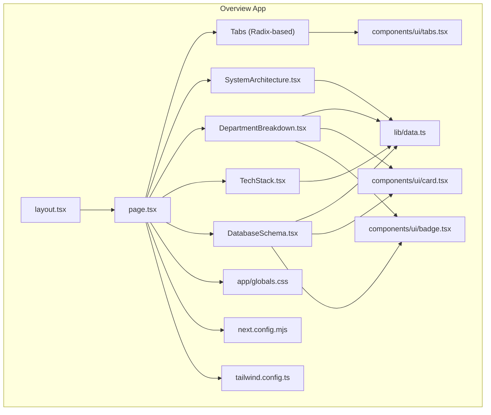
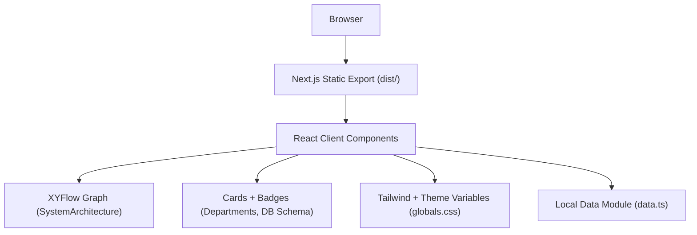
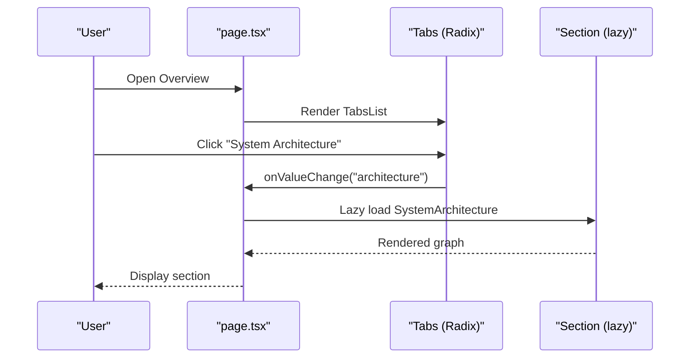
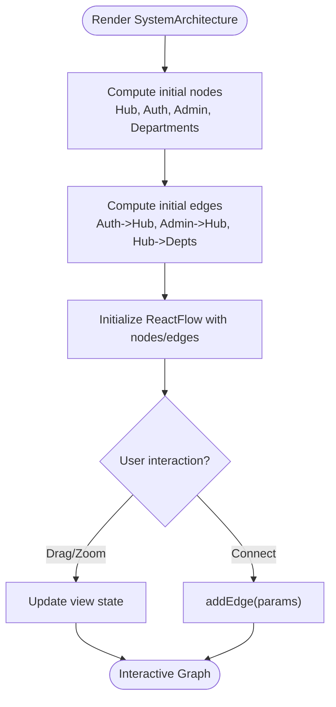
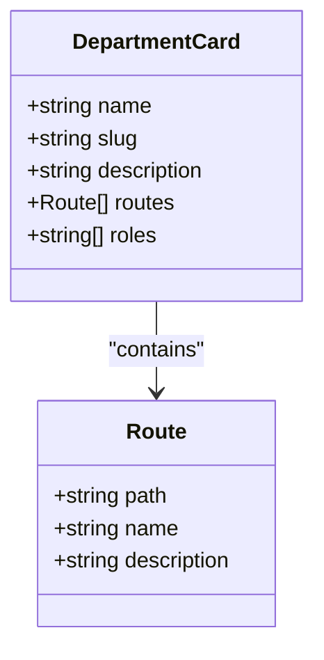
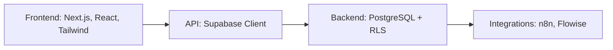
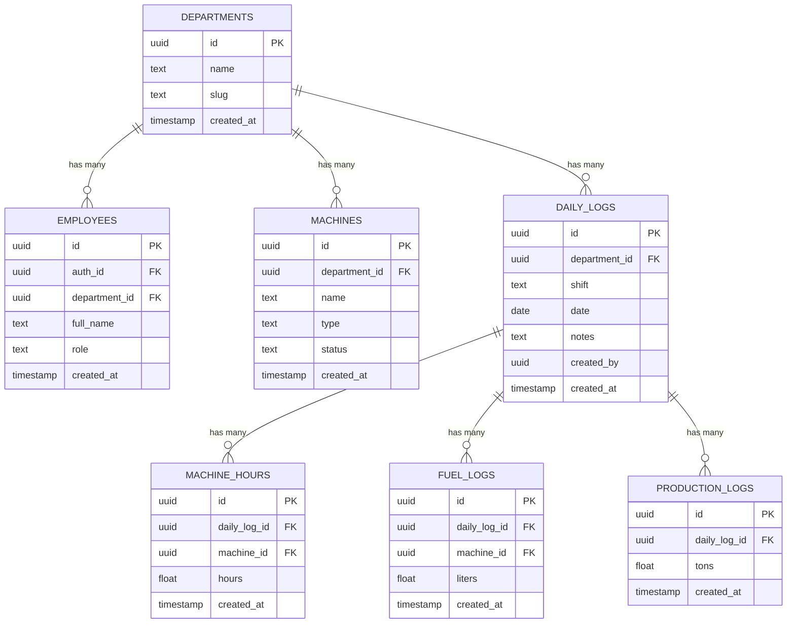
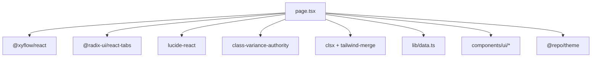

# Overview Application

<cite>
**Referenced Files in This Document**
- [package.json](file://apps/overview/package.json)
- [next.config.mjs](file://apps/overview/next.config.mjs)
- [tailwind.config.ts](file://apps/overview/tailwind.config.ts)
- [globals.css](file://apps/overview/app/globals.css)
- [layout.tsx](file://apps/overview/app/layout.tsx)
- [page.tsx](file://apps/overview/app/page.tsx)
- [SystemArchitecture.tsx](file://apps/overview/app/sections/SystemArchitecture.tsx)
- [DepartmentBreakdown.tsx](file://apps/overview/app/sections/DepartmentBreakdown.tsx)
- [TechStack.tsx](file://apps/overview/app/sections/TechStack.tsx)
- [DatabaseSchema.tsx](file://apps/overview/app/sections/DatabaseSchema.tsx)
- [data.ts](file://apps/overview/lib/data.ts)
- [utils.ts](file://apps/overview/lib/utils.ts)
- [tabs.tsx](file://apps/overview/components/ui/tabs.tsx)
- [card.tsx](file://apps/overview/components/ui/card.tsx)
- [badge.tsx](file://apps/overview/components/ui/badge.tsx)
- [deploy.sh](file://apps/overview/deploy.sh)
</cite>

## Table of Contents

1. [Introduction](#introduction)
2. [Project Structure](#project-structure)
3. [Core Components](#core-components)
4. [Architecture Overview](#architecture-overview)
5. [Detailed Component Analysis](#detailed-component-analysis)
6. [Dependency Analysis](#dependency-analysis)
7. [Performance Considerations](#performance-considerations)
8. [Troubleshooting Guide](#troubleshooting-guide)
9. [Conclusion](#conclusion)
10. [Appendices](#appendices)

## Introduction

The Overview application is a standalone Next.js client-side visualizer that presents the system architecture, department breakdown, technology stack, and database schema of the broader Arch Systems portal. It uses static export to run as a separate but integrated app within the monorepo, rendering interactive diagrams and charts from local data sources. The UI is built with Tailwind CSS, Radix primitives, and custom components, emphasizing responsive design and accessibility.

## Project Structure

The app follows the Next.js App Router layout with:

- A root layout providing metadata and global styles
- A single page orchestrating tabbed sections
- Section components for each visualization area
- A shared data module for departments, tech stack, and database schema
- A small UI component library (tabs, cards, badges)
- Static export configuration for deployment flexibility

**Diagram sources**

- [layout.tsx:1-20](file://apps/overview/app/layout.tsx#L1-L20)
- [page.tsx:1-140](file://apps/overview/app/page.tsx#L1-L140)
- [SystemArchitecture.tsx:1-256](file://apps/overview/app/sections/SystemArchitecture.tsx#L1-L256)
- [DepartmentBreakdown.tsx:1-156](file://apps/overview/app/sections/DepartmentBreakdown.tsx#L1-L156)
- [TechStack.tsx:1-225](file://apps/overview/app/sections/TechStack.tsx#L1-L225)
- [DatabaseSchema.tsx:1-206](file://apps/overview/app/sections/DatabaseSchema.tsx#L1-L206)
- [data.ts:1-559](file://apps/overview/lib/data.ts#L1-L559)
- [tabs.tsx:1-56](file://apps/overview/components/ui/tabs.tsx#L1-L56)
- [card.tsx:1-76](file://apps/overview/components/ui/card.tsx#L1-L76)
- [badge.tsx:1-39](file://apps/overview/components/ui/badge.tsx#L1-L39)
- [globals.css:1-81](file://apps/overview/app/globals.css#L1-L81)
- [next.config.mjs:1-11](file://apps/overview/next.config.mjs#L1-L11)
- [tailwind.config.ts:1-14](file://apps/overview/tailwind.config.ts#L1-L14)

**Section sources**

- [layout.tsx:1-20](file://apps/overview/app/layout.tsx#L1-L20)
- [page.tsx:1-140](file://apps/overview/app/page.tsx#L1-L140)
- [next.config.mjs:1-11](file://apps/overview/next.config.mjs#L1-L11)
- [tailwind.config.ts:1-14](file://apps/overview/tailwind.config.ts#L1-L14)
- [globals.css:1-81](file://apps/overview/app/globals.css#L1-L81)

## Core Components

- Root Layout: Sets document metadata and applies global theme classes.
- Page Shell: Provides header, footer, and tab navigation; lazy-loads section components with Suspense fallbacks.
- System Architecture: Interactive node graph using XYFlow to visualize authentication, hub, admin, and department routing.
- Department Breakdown: Card grid summarizing departments, routes, and required roles with summary statistics.
- Tech Stack: Categorized technology listings and a conceptual architecture overview diagram.
- Database Schema: Table cards with RLS indicators, relationships visualization, and helper function references.

Key responsibilities:

- Data consumption: All sections import structured data from a single source module.
- UI composition: Reusable card and badge components standardize visuals across sections.
- Interactivity: XYFlow provides pan/zoom and edge connections; tabs manage content switching.

**Section sources**

- [page.tsx:1-140](file://apps/overview/app/page.tsx#L1-L140)
- [SystemArchitecture.tsx:1-256](file://apps/overview/app/sections/SystemArchitecture.tsx#L1-L256)
- [DepartmentBreakdown.tsx:1-156](file://apps/overview/app/sections/DepartmentBreakdown.tsx#L1-L156)
- [TechStack.tsx:1-225](file://apps/overview/app/sections/TechStack.tsx#L1-L225)
- [DatabaseSchema.tsx:1-206](file://apps/overview/app/sections/DatabaseSchema.tsx#L1-L206)
- [data.ts:1-559](file://apps/overview/lib/data.ts#L1-L559)
- [card.tsx:1-76](file://apps/overview/components/ui/card.tsx#L1-L76)
- [badge.tsx:1-39](file://apps/overview/components/ui/badge.tsx#L1-L39)

## Architecture Overview

The Overview app is a client-only static site. It renders React Server Components-free pages by exporting static assets. Data is bundled at build time, eliminating runtime dependencies on the main system.

**Diagram sources**

- [next.config.mjs:1-11](file://apps/overview/next.config.mjs#L1-L11)
- [page.tsx:1-140](file://apps/overview/app/page.tsx#L1-L140)
- [SystemArchitecture.tsx:1-256](file://apps/overview/app/sections/SystemArchitecture.tsx#L1-L256)
- [DepartmentBreakdown.tsx:1-156](file://apps/overview/app/sections/DepartmentBreakdown.tsx#L1-L156)
- [DatabaseSchema.tsx:1-206](file://apps/overview/app/sections/DatabaseSchema.tsx#L1-L206)
- [data.ts:1-559](file://apps/overview/lib/data.ts#L1-L559)
- [globals.css:1-81](file://apps/overview/app/globals.css#L1-L81)

## Detailed Component Analysis

### Page Shell and Tab Navigation

- Manages active tab state and lazy loads heavy sections via Suspense.
- Uses a custom Radix-based Tabs primitive for accessible keyboard navigation and focus management.
- Provides consistent header/footer branding and responsive labels.

**Diagram sources**

- [page.tsx:1-140](file://apps/overview/app/page.tsx#L1-L140)
- [tabs.tsx:1-56](file://apps/overview/components/ui/tabs.tsx#L1-L56)
- [SystemArchitecture.tsx:1-256](file://apps/overview/app/sections/SystemArchitecture.tsx#L1-L256)

**Section sources**

- [page.tsx:1-140](file://apps/overview/app/page.tsx#L1-L140)
- [tabs.tsx:1-56](file://apps/overview/components/ui/tabs.tsx#L1-L56)

### System Architecture Visualization

- Builds nodes and edges from department data and renders an interactive XYFlow canvas.
- Custom node types represent Hub, Authentication, Admin, and Departments with color-coded borders and connection handles.
- Includes controls, background grid, mini-map, and legend overlay.

**Diagram sources**

- [SystemArchitecture.tsx:1-256](file://apps/overview/app/sections/SystemArchitecture.tsx#L1-L256)
- [data.ts:1-559](file://apps/overview/lib/data.ts#L1-L559)

**Section sources**

- [SystemArchitecture.tsx:1-256](file://apps/overview/app/sections/SystemArchitecture.tsx#L1-L256)
- [data.ts:1-559](file://apps/overview/lib/data.ts#L1-L559)

### Department Breakdown

- Displays a responsive grid of department cards with route lists and role badges.
- Computes summary metrics such as total departments, routes, unique roles, and average routes per department.

**Diagram sources**

- [DepartmentBreakdown.tsx:1-156](file://apps/overview/app/sections/DepartmentBreakdown.tsx#L1-L156)
- [data.ts:1-559](file://apps/overview/lib/data.ts#L1-L559)
- [card.tsx:1-76](file://apps/overview/components/ui/card.tsx#L1-L76)
- [badge.tsx:1-39](file://apps/overview/components/ui/badge.tsx#L1-L39)

**Section sources**

- [DepartmentBreakdown.tsx:1-156](file://apps/overview/app/sections/DepartmentBreakdown.tsx#L1-L156)
- [data.ts:1-559](file://apps/overview/lib/data.ts#L1-L559)
- [card.tsx:1-76](file://apps/overview/components/ui/card.tsx#L1-L76)
- [badge.tsx:1-39](file://apps/overview/components/ui/badge.tsx#L1-L39)

### Technology Stack

- Presents categorized technologies with descriptions and optional versions.
- Includes a conceptual architecture overview and monorepo structure illustration.

[No sources needed since this diagram shows conceptual workflow, not actual code structure]

**Section sources**

- [TechStack.tsx:1-225](file://apps/overview/app/sections/TechStack.tsx#L1-L225)
- [data.ts:1-559](file://apps/overview/lib/data.ts#L1-L559)

### Database Schema

- Renders table cards with primary key and foreign key indicators and RLS badges.
- Visualizes central-to-child relationships and summarizes RLS helpers.

**Diagram sources**

- [DatabaseSchema.tsx:1-206](file://apps/overview/app/sections/DatabaseSchema.tsx#L1-L206)
- [data.ts:1-559](file://apps/overview/lib/data.ts#L1-L559)

**Section sources**

- [DatabaseSchema.tsx:1-206](file://apps/overview/app/sections/DatabaseSchema.tsx#L1-L206)
- [data.ts:1-559](file://apps/overview/lib/data.ts#L1-L559)

## Dependency Analysis

- External libraries:
  - @xyflow/react for interactive graphs
  - @radix-ui/react-tabs for accessible tab primitives
  - lucide-react for icons
  - class-variance-authority and clsx/tailwind-merge for dynamic class composition
- Internal dependencies:
  - Shared theme via @repo/theme (Tailwind config and CSS variables)
  - Local data module for all visualization inputs
  - Custom UI components for consistent styling

**Diagram sources**

- [package.json:1-36](file://apps/overview/package.json#L1-L36)
- [page.tsx:1-140](file://apps/overview/app/page.tsx#L1-L140)
- [data.ts:1-559](file://apps/overview/lib/data.ts#L1-L559)
- [tabs.tsx:1-56](file://apps/overview/components/ui/tabs.tsx#L1-L56)
- [card.tsx:1-76](file://apps/overview/components/ui/card.tsx#L1-L76)
- [badge.tsx:1-39](file://apps/overview/components/ui/badge.tsx#L1-L39)
- [tailwind.config.ts:1-14](file://apps/overview/tailwind.config.ts#L1-L14)

**Section sources**

- [package.json:1-36](file://apps/overview/package.json#L1-L36)
- [tailwind.config.ts:1-14](file://apps/overview/tailwind.config.ts#L1-L14)
- [utils.ts:1-7](file://apps/overview/lib/utils.ts#L1-L7)

## Performance Considerations

- Static export eliminates server overhead and enables fast CDN delivery.
- Lazy loading of sections reduces initial bundle size and improves Time to Interactive.
- XYFlow minimap and controlled zoom levels optimize large graph interactions.
- Tailwind purging via configured content paths ensures minimal CSS output.

[No sources needed since this section provides general guidance]

## Troubleshooting Guide

- Build issues: Ensure pnpm is installed and workspace dependencies are resolved before building.
- Missing dist folder: Use the provided script to build or serve static files locally.
- Styling conflicts: Verify theme CSS variables are available via globals.css imports and Tailwind config.

**Section sources**

- [deploy.sh:1-134](file://apps/overview/deploy.sh#L1-L134)
- [next.config.mjs:1-11](file://apps/overview/next.config.mjs#L1-L11)
- [globals.css:1-81](file://apps/overview/app/globals.css#L1-L81)

## Conclusion

The Overview application delivers a clear, interactive, and responsive visualization of the Arch Systems architecture, departments, tech stack, and database schema. By leveraging static export, lazy-loaded sections, and a cohesive UI library, it remains lightweight, maintainable, and easy to deploy alongside the rest of the monorepo.

## Appendices

### Deployment Strategy

- Static export produces a dist directory suitable for any static host.
- The included script supports development, building, serving, and copying artifacts to a target directory.

**Section sources**

- [deploy.sh:1-134](file://apps/overview/deploy.sh#L1-L134)
- [next.config.mjs:1-11](file://apps/overview/next.config.mjs#L1-L11)
