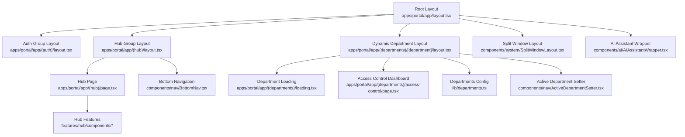
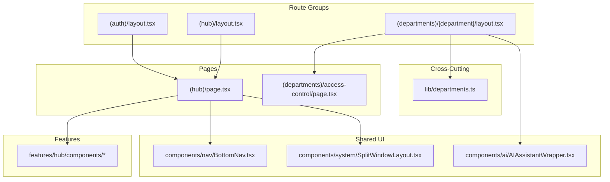
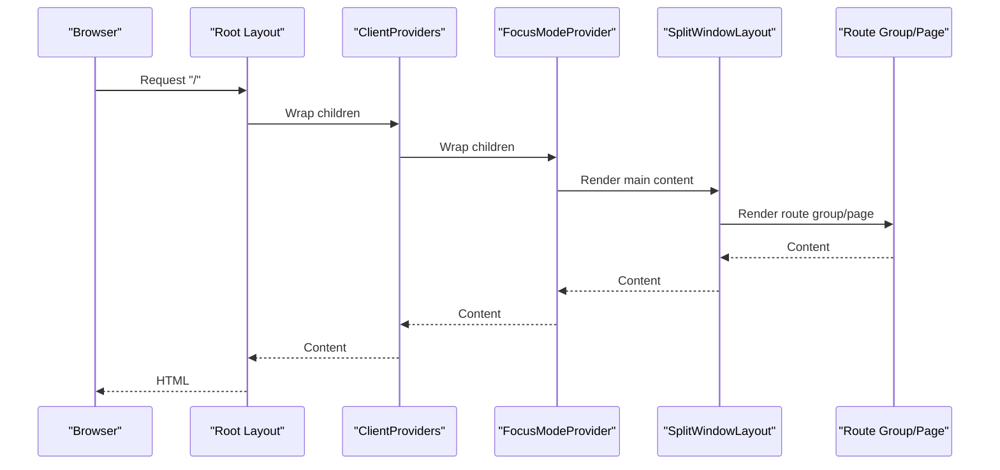
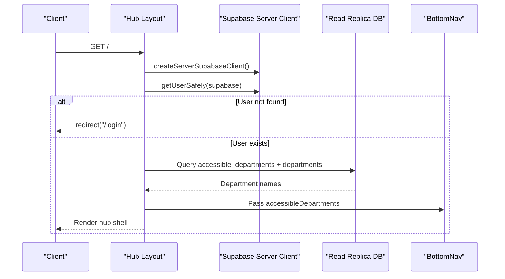
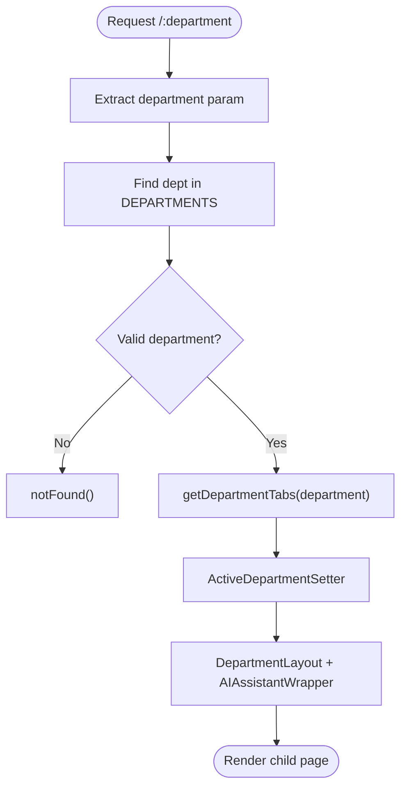
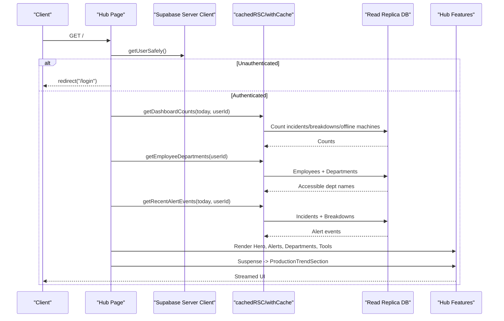
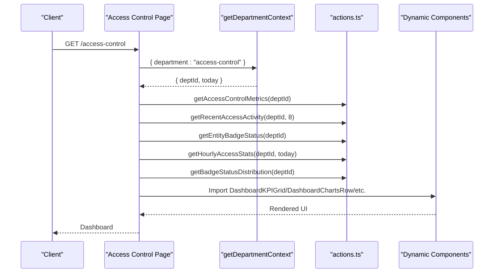
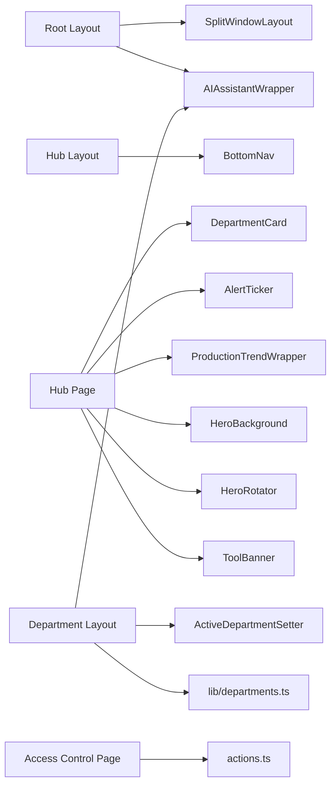

# Portal Application Structure

<cite>
**Referenced Files in This Document**
- [apps/portal/app/layout.tsx](file://apps/portal/app/layout.tsx)
- [apps/portal/app/(auth)/layout.tsx](file://apps/portal/app/(auth)/layout.tsx)
- [apps/portal/app/(hub)/layout.tsx](file://apps/portal/app/(hub)/layout.tsx)
- [apps/portal/app/(hub)/page.tsx](file://apps/portal/app/(hub)/page.tsx)
- [apps/portal/app/(departments)/[department]/layout.tsx](file://apps/portal/app/(departments)/[department]/layout.tsx)
- [apps/portal/app/(departments)/loading.tsx](file://apps/portal/app/(departments)/loading.tsx)
- [apps/portal/app/(departments)/access-control/page.tsx](file://apps/portal/app/(departments)/access-control/page.tsx)
- [apps/portal/lib/departments.ts](file://apps/portal/lib/departments.ts)
- [apps/portal/features/hub/components/DepartmentCard.tsx](file://apps/portal/features/hub/components/DepartmentCard.tsx)
- [apps/portal/features/hub/components/AlertTicker.tsx](file://apps/portal/features/hub/components/AlertTicker.tsx)
- [apps/portal/features/hub/components/ProductionTrendWrapper.tsx](file://apps/portal/features/hub/components/ProductionTrendWrapper.tsx)
- [apps/portal/features/hub/components/HeroBackground.tsx](file://apps/portal/features/hub/components/HeroBackground.tsx)
- [apps/portal/features/hub/components/HeroRotator.tsx](file://apps/portal/features/hub/components/HeroRotator.tsx)
- [apps/portal/features/hub/components/ToolBanner.tsx](file://apps/portal/features/hub/components/ToolBanner.tsx)
- [apps/portal/components/nav/BottomNav.tsx](file://apps/portal/components/nav/BottomNav.tsx)
- [apps/portal/components/system/SplitWindowLayout.tsx](file://apps/portal/components/system/SplitWindowLayout.tsx)
- [apps/portal/components/ai/AIAssistantWrapper.tsx](file://apps/portal/components/ai/AIAssistantWrapper.tsx)
- [apps/portal/components/nav/ActiveDepartmentSetter.tsx](file://apps/portal/components/nav/ActiveDepartmentSetter.tsx)
</cite>

## Table of Contents

1. Introduction
2. Project Structure
3. Core Components
4. Architecture Overview
5. Detailed Component Analysis
6. Dependency Analysis
7. Performance Considerations
8. Troubleshooting Guide
9. Conclusion

## Introduction

This document explains the portal application structure built with Next.js App Router. It focuses on route groups (auth, departments, hub), feature-based organization under features/, shared components under components/, and cross-cutting concerns under lib/. It also details middleware architecture for authentication and routing, layout composition patterns, dynamic department routing, component hierarchy from global layouts to department-specific UIs, state management patterns, and error boundary implementations.

## Project Structure

The portal uses a feature-based layout:

- Route groups:
  - (auth): Authentication-related routes and their layout.
  - (departments): Dynamic department routes and department-specific pages.
  - (hub): Central hub landing page and its layout.
- Features:
  - features/: Feature modules grouped by domain (e.g., hub, analytics, departments).
- Shared UI:
  - components/: Reusable UI components used across the app.
- Cross-cutting concerns:
  - lib/: Utilities, caching, environment, and domain helpers.

**Diagram sources**

- [apps/portal/app/layout.tsx](file://apps/portal/app/layout.tsx)
- [apps/portal/app/(auth)/layout.tsx](<file://apps/portal/app/(auth)/layout.tsx>)
- [apps/portal/app/(hub)/layout.tsx](<file://apps/portal/app/(hub)/layout.tsx>)
- [apps/portal/app/(departments)/[department]/layout.tsx](<file://apps/portal/app/(departments)/[department]/layout.tsx>)
- [apps/portal/app/(departments)/loading.tsx](<file://apps/portal/app/(departments)/loading.tsx>)
- [apps/portal/app/(departments)/access-control/page.tsx](<file://apps/portal/app/(departments)/access-control/page.tsx>)
- [apps/portal/app/(hub)/page.tsx](<file://apps/portal/app/(hub)/page.tsx>)
- [apps/portal/lib/departments.ts](file://apps/portal/lib/departments.ts)
- [apps/portal/components/system/SplitWindowLayout.tsx](file://apps/portal/components/system/SplitWindowLayout.tsx)
- [apps/portal/components/ai/AIAssistantWrapper.tsx](file://apps/portal/components/ai/AIAssistantWrapper.tsx)
- [apps/portal/components/nav/BottomNav.tsx](file://apps/portal/components/nav/BottomNav.tsx)
- [apps/portal/components/nav/ActiveDepartmentSetter.tsx](file://apps/portal/components/nav/ActiveDepartmentSetter.tsx)

**Section sources**

- [apps/portal/app/layout.tsx](file://apps/portal/app/layout.tsx)
- [apps/portal/app/(auth)/layout.tsx](<file://apps/portal/app/(auth)/layout.tsx>)
- [apps/portal/app/(hub)/layout.tsx](<file://apps/portal/app/(hub)/layout.tsx>)
- [apps/portal/app/(departments)/[department]/layout.tsx](<file://apps/portal/app/(departments)/[department]/layout.tsx>)
- [apps/portal/app/(departments)/loading.tsx](<file://apps/portal/app/(departments)/loading.tsx>)
- [apps/portal/app/(departments)/access-control/page.tsx](<file://apps/portal/app/(departments)/access-control/page.tsx>)
- [apps/portal/app/(hub)/page.tsx](<file://apps/portal/app/(hub)/page.tsx>)
- [apps/portal/lib/departments.ts](file://apps/portal/lib/departments.ts)

## Core Components

- Global root layout:
  - Provides theme provider, client providers, performance listeners, offline banner, AI assistant wrapper, header widgets, main content area with split window layout, command bar, viewport boundaries, and accessibility announcer.
- Auth group layout:
  - Minimal container for authentication flows.
- Hub group layout:
  - Server-side user check with redirect to login if not authenticated; fetches accessible departments and renders bottom navigation for mobile.
- Dynamic department layout:
  - Validates department against configuration, sets active department context, provides department tabs, and wraps content with department layout and AI assistant wrapper.
- Hub page:
  - Aggregates dashboard counts, accessible departments, tools, alerts, and production trend data; uses Suspense for streaming heavy sections; filters departments based on user access.
- Access control dashboard page:
  - Demonstrates server-side data fetching via actions and dynamic imports for charting and KPI components.

Key responsibilities:

- Authentication gating at layout level for protected areas.
- Department validation and tab resolution.
- Streaming UX via Suspense and dynamic imports.
- Context setup for active department.

**Section sources**

- [apps/portal/app/layout.tsx](file://apps/portal/app/layout.tsx)
- [apps/portal/app/(auth)/layout.tsx](<file://apps/portal/app/(auth)/layout.tsx>)
- [apps/portal/app/(hub)/layout.tsx](<file://apps/portal/app/(hub)/layout.tsx>)
- [apps/portal/app/(departments)/[department]/layout.tsx](<file://apps/portal/app/(departments)/[department]/layout.tsx>)
- [apps/portal/app/(hub)/page.tsx](<file://apps/portal/app/(hub)/page.tsx>)
- [apps/portal/app/(departments)/access-control/page.tsx](<file://apps/portal/app/(departments)/access-control/page.tsx>)

## Architecture Overview

The portal follows a layered architecture:

- Presentation layer: Route groups and pages render feature components and shared UI.
- Business logic layer: Feature components orchestrate data fetching and display.
- Cross-cutting layer: lib utilities provide caching, environment, and domain helpers.
- Infrastructure integration: Supabase clients for read replicas and server auth.

**Diagram sources**

- [apps/portal/app/(auth)/layout.tsx](<file://apps/portal/app/(auth)/layout.tsx>)
- [apps/portal/app/(hub)/layout.tsx](<file://apps/portal/app/(hub)/layout.tsx>)
- [apps/portal/app/(departments)/[department]/layout.tsx](<file://apps/portal/app/(departments)/[department]/layout.tsx>)
- [apps/portal/app/(hub)/page.tsx](<file://apps/portal/app/(hub)/page.tsx>)
- [apps/portal/app/(departments)/access-control/page.tsx](<file://apps/portal/app/(departments)/access-control/page.tsx>)
- [apps/portal/features/hub/components/DepartmentCard.tsx](file://apps/portal/features/hub/components/DepartmentCard.tsx)
- [apps/portal/features/hub/components/AlertTicker.tsx](file://apps/portal/features/hub/components/AlertTicker.tsx)
- [apps/portal/features/hub/components/ProductionTrendWrapper.tsx](file://apps/portal/features/hub/components/ProductionTrendWrapper.tsx)
- [apps/portal/features/hub/components/HeroBackground.tsx](file://apps/portal/features/hub/components/HeroBackground.tsx)
- [apps/portal/features/hub/components/HeroRotator.tsx](file://apps/portal/features/hub/components/HeroRotator.tsx)
- [apps/portal/features/hub/components/ToolBanner.tsx](file://apps/portal/features/hub/components/ToolBanner.tsx)
- [apps/portal/components/nav/BottomNav.tsx](file://apps/portal/components/nav/BottomNav.tsx)
- [apps/portal/components/system/SplitWindowLayout.tsx](file://apps/portal/components/system/SplitWindowLayout.tsx)
- [apps/portal/components/ai/AIAssistantWrapper.tsx](file://apps/portal/components/ai/AIAssistantWrapper.tsx)
- [apps/portal/lib/departments.ts](file://apps/portal/lib/departments.ts)

## Detailed Component Analysis

### Global Root Layout

- Responsibilities:
  - Theme provider and client providers.
  - Accessibility announcer and skip link.
  - Header with focus mode toggle, system tray pill, and header widgets.
  - Main content wrapped in split window layout.
  - Command bar, viewport boundaries, and background.
- Performance:
  - Preconnect/dns-prefetch for Supabase.
  - Speculation rules for prerendering key routes.
  - Dynamic import for header widgets with loading skeleton.

**Diagram sources**

- [apps/portal/app/layout.tsx](file://apps/portal/app/layout.tsx)

**Section sources**

- [apps/portal/app/layout.tsx](file://apps/portal/app/layout.tsx)

### Auth Group Layout

- Purpose:
  - Container for authentication flows.
- Behavior:
  - Provides minimal layout for login/reset/update-password routes.

**Section sources**

- [apps/portal/app/(auth)/layout.tsx](<file://apps/portal/app/(auth)/layout.tsx>)

### Hub Group Layout

- Responsibilities:
  - Server-side authentication check using Supabase client and getUserSafely.
  - Redirect to login if unauthenticated.
  - Fetch accessible department names and pass to bottom navigation.
- Data flow:
  - Uses read replica client to query employees and departments.

**Diagram sources**

- [apps/portal/app/(hub)/layout.tsx](<file://apps/portal/app/(hub)/layout.tsx>)
- [apps/portal/components/nav/BottomNav.tsx](file://apps/portal/components/nav/BottomNav.tsx)

**Section sources**

- [apps/portal/app/(hub)/layout.tsx](<file://apps/portal/app/(hub)/layout.tsx>)

### Dynamic Department Layout

- Responsibilities:
  - Validate department name against DEPARTMENTS config.
  - Resolve department-specific tabs via getDepartmentTabs.
  - Set active department context and wrap content with DepartmentLayout and AI assistant wrapper.
- Error handling:
  - Calls notFound when department is invalid.

**Diagram sources**

- [apps/portal/app/(departments)/[department]/layout.tsx](<file://apps/portal/app/(departments)/[department]/layout.tsx>)
- [apps/portal/lib/departments.ts](file://apps/portal/lib/departments.ts)
- [apps/portal/components/nav/ActiveDepartmentSetter.tsx](file://apps/portal/components/nav/ActiveDepartmentSetter.tsx)
- [apps/portal/components/ai/AIAssistantWrapper.tsx](file://apps/portal/components/ai/AIAssistantWrapper.tsx)

**Section sources**

- [apps/portal/app/(departments)/[department]/layout.tsx](<file://apps/portal/app/(departments)/[department]/layout.tsx>)
- [apps/portal/lib/departments.ts](file://apps/portal/lib/departments.ts)

### Hub Page

- Responsibilities:
  - Authenticate user and redirect if missing.
  - Aggregate dashboard counts, accessible departments, tools, and alert events.
  - Stream production trend data via Suspense.
  - Filter departments based on user access.
- Caching:
  - Uses cachedRSC and withCache with tags for revalidation.

**Diagram sources**

- [apps/portal/app/(hub)/page.tsx](<file://apps/portal/app/(hub)/page.tsx>)
- [apps/portal/features/hub/components/AlertTicker.tsx](file://apps/portal/features/hub/components/AlertTicker.tsx)
- [apps/portal/features/hub/components/ProductionTrendWrapper.tsx](file://apps/portal/features/hub/components/ProductionTrendWrapper.tsx)
- [apps/portal/features/hub/components/HeroBackground.tsx](file://apps/portal/features/hub/components/HeroBackground.tsx)
- [apps/portal/features/hub/components/HeroRotator.tsx](file://apps/portal/features/hub/components/HeroRotator.tsx)
- [apps/portal/features/hub/components/ToolBanner.tsx](file://apps/portal/features/hub/components/ToolBanner.tsx)
- [apps/portal/features/hub/components/DepartmentCard.tsx](file://apps/portal/features/hub/components/DepartmentCard.tsx)

**Section sources**

- [apps/portal/app/(hub)/page.tsx](<file://apps/portal/app/(hub)/page.tsx>)

### Access Control Dashboard Page

- Responsibilities:
  - Get department context (deptId, today).
  - Fetch metrics, activity, entity status, hourly stats, and badge distribution concurrently.
  - Dynamically import chart and KPI components with skeletons.
- Rendering:
  - Glass cards and grid layouts for KPIs, charts, activity feed, and entity status.

**Diagram sources**

- [apps/portal/app/(departments)/access-control/page.tsx](<file://apps/portal/app/(departments)/access-control/page.tsx>)

**Section sources**

- [apps/portal/app/(departments)/access-control/page.tsx](<file://apps/portal/app/(departments)/access-control/page.tsx>)

### Feature-Based Organization

- Hub features:
  - DepartmentCard, AlertTicker, ProductionTrendWrapper, HeroBackground, HeroRotator, ToolBanner.
- Department features:
  - Control room, engineering breakdowns, safety, satellite monitoring, tools.
- Analytics features:
  - ExportButton, PDFDownloadButton, ProductionTrendChart, ReportTemplate.
- Webhooks features:
  - WebhookManager.

These components are consumed by pages and layouts within their respective route groups.

**Section sources**

- [apps/portal/features/hub/components/DepartmentCard.tsx](file://apps/portal/features/hub/components/DepartmentCard.tsx)
- [apps/portal/features/hub/components/AlertTicker.tsx](file://apps/portal/features/hub/components/AlertTicker.tsx)
- [apps/portal/features/hub/components/ProductionTrendWrapper.tsx](file://apps/portal/features/hub/components/ProductionTrendWrapper.tsx)
- [apps/portal/features/hub/components/HeroBackground.tsx](file://apps/portal/features/hub/components/HeroBackground.tsx)
- [apps/portal/features/hub/components/HeroRotator.tsx](file://apps/portal/features/hub/components/HeroRotator.tsx)
- [apps/portal/features/hub/components/ToolBanner.tsx](file://apps/portal/features/hub/components/ToolBanner.tsx)

### Cross-Cutting Concerns (lib/)

- Departments configuration:
  - DEPARTMENTS array, tab definitions per department, and getDepartmentTabs resolver.
- Caching utilities:
  - cachedRSC and withCache for server-side caching with tags and revalidation.
- Environment and tools:
  - env helpers and tools retrieval.

**Section sources**

- [apps/portal/lib/departments.ts](file://apps/portal/lib/departments.ts)

## Dependency Analysis

High-level dependencies between route groups, pages, features, and shared components:

**Diagram sources**

- [apps/portal/app/layout.tsx](file://apps/portal/app/layout.tsx)
- [apps/portal/app/(hub)/layout.tsx](<file://apps/portal/app/(hub)/layout.tsx>)
- [apps/portal/app/(hub)/page.tsx](<file://apps/portal/app/(hub)/page.tsx>)
- [apps/portal/app/(departments)/[department]/layout.tsx](<file://apps/portal/app/(departments)/[department]/layout.tsx>)
- [apps/portal/app/(departments)/access-control/page.tsx](<file://apps/portal/app/(departments)/access-control/page.tsx>)
- [apps/portal/components/system/SplitWindowLayout.tsx](file://apps/portal/components/system/SplitWindowLayout.tsx)
- [apps/portal/components/ai/AIAssistantWrapper.tsx](file://apps/portal/components/ai/AIAssistantWrapper.tsx)
- [apps/portal/components/nav/BottomNav.tsx](file://apps/portal/components/nav/BottomNav.tsx)
- [apps/portal/components/nav/ActiveDepartmentSetter.tsx](file://apps/portal/components/nav/ActiveDepartmentSetter.tsx)
- [apps/portal/lib/departments.ts](file://apps/portal/lib/departments.ts)
- [apps/portal/features/hub/components/DepartmentCard.tsx](file://apps/portal/features/hub/components/DepartmentCard.tsx)
- [apps/portal/features/hub/components/AlertTicker.tsx](file://apps/portal/features/hub/components/AlertTicker.tsx)
- [apps/portal/features/hub/components/ProductionTrendWrapper.tsx](file://apps/portal/features/hub/components/ProductionTrendWrapper.tsx)
- [apps/portal/features/hub/components/HeroBackground.tsx](file://apps/portal/features/hub/components/HeroBackground.tsx)
- [apps/portal/features/hub/components/HeroRotator.tsx](file://apps/portal/features/hub/components/HeroRotator.tsx)
- [apps/portal/features/hub/components/ToolBanner.tsx](file://apps/portal/features/hub/components/ToolBanner.tsx)

**Section sources**

- [apps/portal/app/layout.tsx](file://apps/portal/app/layout.tsx)
- [apps/portal/app/(hub)/layout.tsx](<file://apps/portal/app/(hub)/layout.tsx>)
- [apps/portal/app/(hub)/page.tsx](<file://apps/portal/app/(hub)/page.tsx>)
- [apps/portal/app/(departments)/[department]/layout.tsx](<file://apps/portal/app/(departments)/[department]/layout.tsx>)
- [apps/portal/app/(departments)/access-control/page.tsx](<file://apps/portal/app/(departments)/access-control/page.tsx>)
- [apps/portal/lib/departments.ts](file://apps/portal/lib/departments.ts)

## Performance Considerations

- Streaming:
  - Use Suspense for heavy sections like production trends to stream after shell paints.
- Dynamic Imports:
  - Lazy-load complex components (charts, KPI grids) with loading skeletons.
- Caching:
  - Leverage cachedRSC and withCache with tags for efficient revalidation and cache busting.
- Preconnect and Speculation Rules:
  - Preconnect to Supabase and configure speculation rules for prerendering key routes.
- Read Replicas:
  - Use read replica clients for database queries to reduce load on primary.

[No sources needed since this section provides general guidance]

## Troubleshooting Guide

- Authentication redirects:
  - If users are redirected to login unexpectedly, verify getUserSafely behavior and cookie presence in protected layouts.
- Department not found:
  - Ensure department names match DEPARTMENTS entries; otherwise, notFound will be triggered.
- Empty department list:
  - Check employee accessible_departments mapping and department IDs; ensure proper filtering in hub page.
- Stale data:
  - Inspect cache tags and revalidate intervals; clear or update tags when underlying tables change.

**Section sources**

- [apps/portal/app/(hub)/layout.tsx](<file://apps/portal/app/(hub)/layout.tsx>)
- [apps/portal/app/(departments)/[department]/layout.tsx](<file://apps/portal/app/(departments)/[department]/layout.tsx>)
- [apps/portal/app/(hub)/page.tsx](<file://apps/portal/app/(hub)/page.tsx>)
- [apps/portal/lib/departments.ts](file://apps/portal/lib/departments.ts)

## Conclusion

The portal leverages Next.js App Router with route groups to separate concerns, feature-based organization for scalability, and robust layout composition for consistent UX. Authentication is enforced at layout levels, while dynamic department routing ensures type-safe navigation and tab resolution. Caching and streaming strategies optimize performance, and shared components maintain consistency across the application.

[No sources needed since this section summarizes without analyzing specific files]
