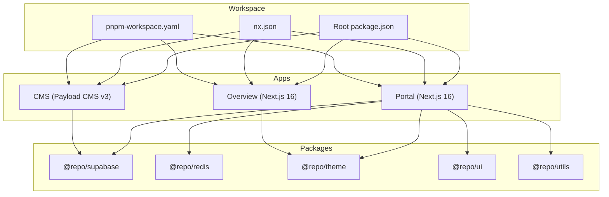
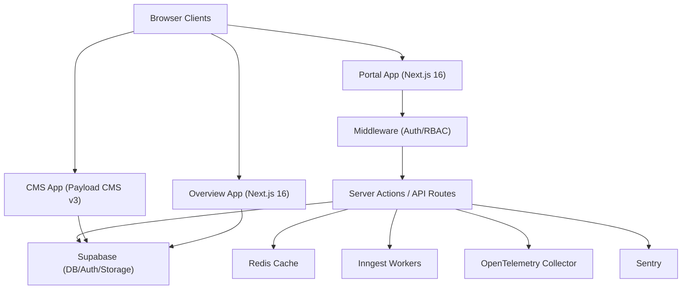
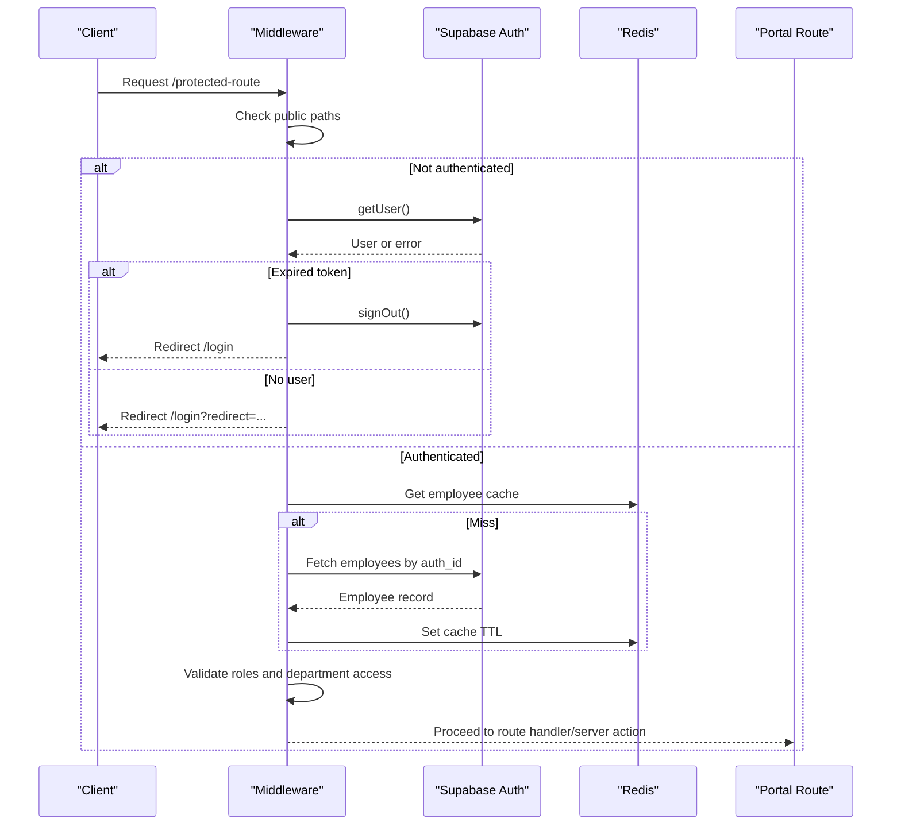
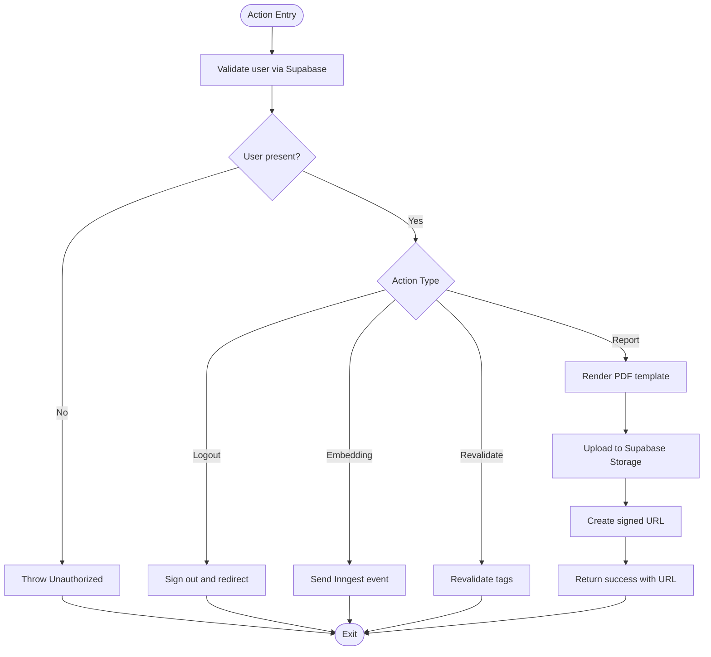
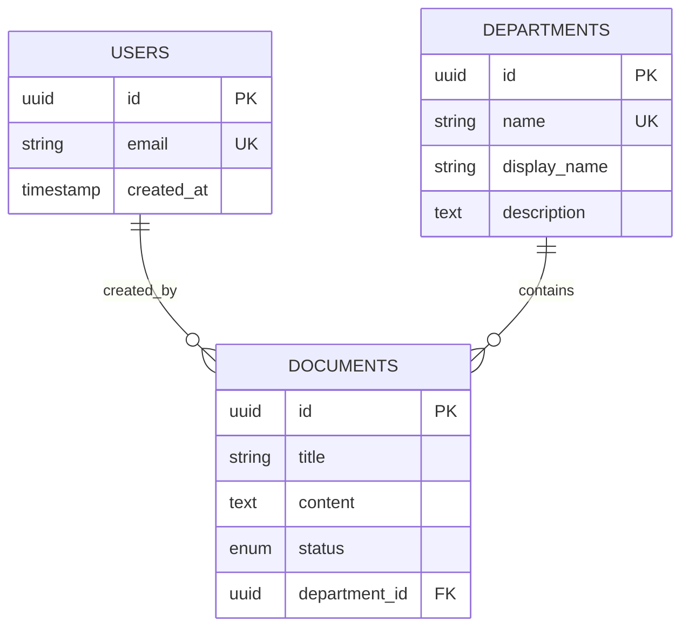
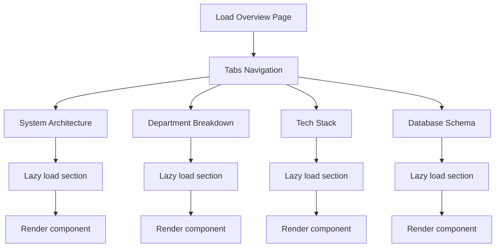
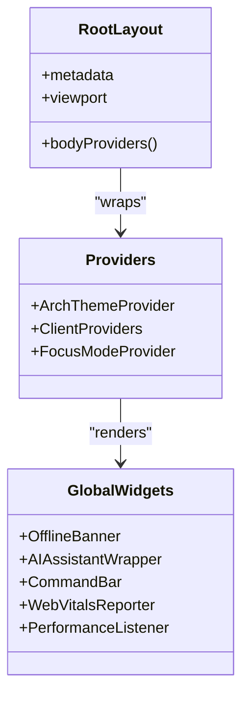
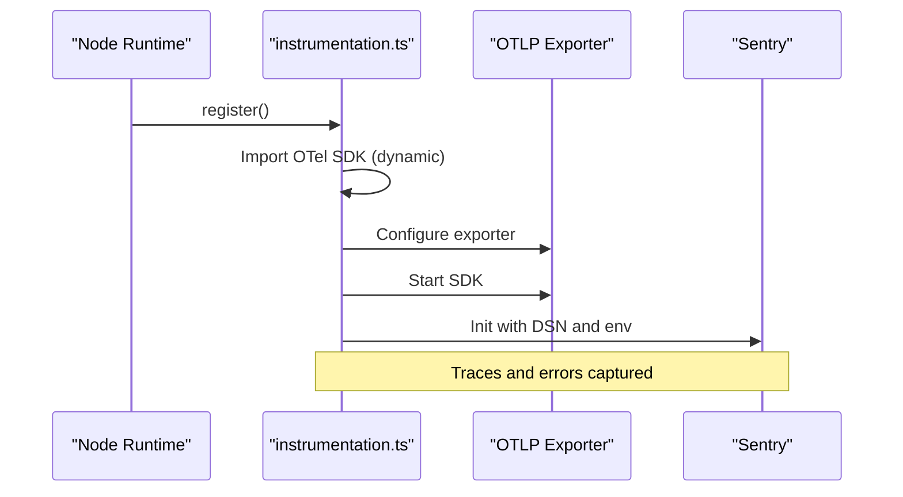
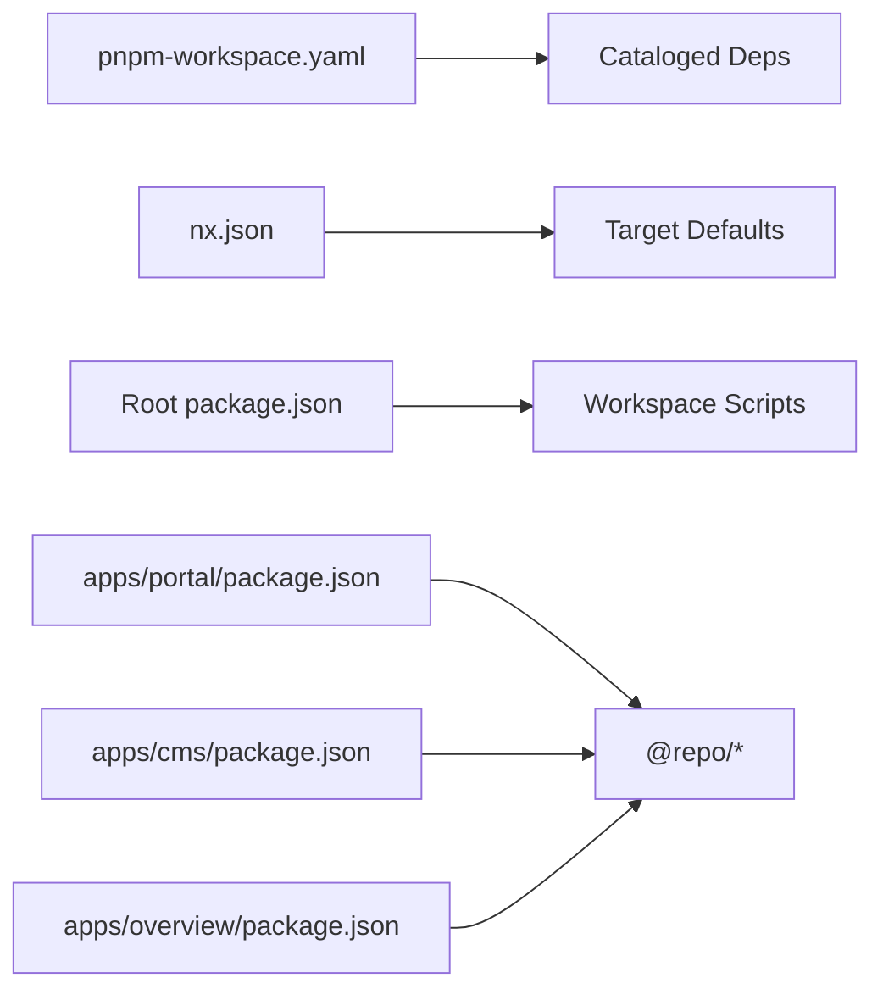

# Architecture & Design

<cite>
**Referenced Files in This Document**
- [README.md](file://README.md)
- [package.json](file://package.json)
- [nx.json](file://nx.json)
- [pnpm-workspace.yaml](file://pnpm-workspace.yaml)
- [apps/portal/package.json](file://apps/portal/package.json)
- [apps/cms/package.json](file://apps/cms/package.json)
- [apps/overview/package.json](file://apps/overview/package.json)
- [apps/portal/next.config.mjs](file://apps/portal/next.config.mjs)
- [apps/portal/app/layout.tsx](file://apps/portal/app/layout.tsx)
- [apps/portal/middleware.ts](file://apps/portal/middleware.ts)
- [apps/portal/instrumentation.ts](file://apps/portal/instrumentation.ts)
- [apps/portal/app/actions.ts](file://apps/portal/app/actions.ts)
- [apps/cms/payload.config.ts](file://apps/cms/payload.config.ts)
- [apps/overview/app/page.tsx](file://apps/overview/app/page.tsx)
- [docker-compose.production.yml](file://docker-compose.production.yml)
</cite>

## Table of Contents

1. Introduction
2. Project Structure
3. Core Components
4. Architecture Overview
5. Detailed Component Analysis
6. Dependency Analysis
7. Performance Considerations
8. Troubleshooting Guide
9. Conclusion

## Introduction

Arch-Mk2 is an industrial operations platform built as a pnpm + Nx monorepo with three Next.js 16 / React 19 applications:

- Portal: the main operational dashboard for multiple departments, featuring authentication, role-based access control, real-time monitoring, and server actions.
- CMS: Payload CMS v3 application providing content management capabilities backed by PostgreSQL.
- Overview: a visualizer showcasing system architecture, department breakdowns, tech stack, and database schema.

The platform integrates Supabase for data and auth, Redis for caching, OpenTelemetry and Sentry for observability, and PWA capabilities for resilience. It follows feature-based organization, server-side rendering patterns via Next.js App Router, and a micro-frontend style separation across apps while sharing packages.

## Project Structure

At the workspace root, the repository uses pnpm workspaces and Nx to orchestrate builds, linting, type-checking, and tests across apps and shared packages. The three applications are isolated under apps/, each with its own Next.js configuration and dependencies. Shared logic lives in packages/.

**Diagram sources**

- [package.json:1-96](file://package.json#L1-L96)
- [nx.json:1-139](file://nx.json#L1-L139)
- [pnpm-workspace.yaml:1-33](file://pnpm-workspace.yaml#L1-L33)
- [apps/portal/package.json:1-76](file://apps/portal/package.json#L1-L76)
- [apps/cms/package.json:1-32](file://apps/cms/package.json#L1-L32)
- [apps/overview/package.json:1-36](file://apps/overview/package.json#L1-L36)

**Section sources**

- [README.md:1-58](file://README.md#L1-L58)
- [package.json:1-96](file://package.json#L1-L96)
- [nx.json:1-139](file://nx.json#L1-L139)
- [pnpm-workspace.yaml:1-33](file://pnpm-workspace.yaml#L1-L33)

## Core Components

- Portal Application
  - Next.js 16 app with React 19, Tailwind UI, Zustand state, Framer Motion animations, MapLibre/Deck.gl mapping, Inngest background jobs, and PWA support.
  - Server-side rendering and API routes; middleware enforces authentication and authorization.
  - Integrates @repo/supabase for typed DB access and @repo/redis for caching.
- CMS Application
  - Payload CMS v3 with Postgres adapter and Lexical rich text editor.
  - Collections include users, departments, and documents with relationships and status workflows.
- Overview Application
  - Client-only visualization app using lazy-loaded sections for architecture, departments, tech stack, and database schema.

Key technology decisions:

- Next.js 16 with App Router for SSR/SSG and server actions.
- React 19 for latest features and performance improvements.
- Nx for build orchestration, caching, and task graph optimization.
- Supabase for relational data, storage, and auth.
- Redis for L1 cache on frequently accessed entities (e.g., employee profile, department UUID).
- OpenTelemetry + Sentry for distributed tracing and error tracking.
- PWA via Workbox for resilient offline experiences.

**Section sources**

- [apps/portal/package.json:1-76](file://apps/portal/package.json#L1-L76)
- [apps/cms/package.json:1-32](file://apps/cms/package.json#L1-L32)
- [apps/overview/package.json:1-36](file://apps/overview/package.json#L1-L36)
- [apps/cms/payload.config.ts:1-92](file://apps/cms/payload.config.ts#L1-L92)

## Architecture Overview

High-level runtime topology:

- Browser clients interact with the Portal and Overview apps served by Next.js.
- Middleware intercepts requests to enforce auth and RBAC before reaching route handlers or server actions.
- Server components and server actions call Supabase APIs for data and storage.
- Redis provides fast read-through caching for identity and lookup data.
- Background jobs (Inngest) process async tasks like embeddings generation.
- Observability layers (OpenTelemetry, Sentry) capture traces and errors.

**Diagram sources**

- [apps/portal/next.config.mjs:1-228](file://apps/portal/next.config.mjs#L1-L228)
- [apps/portal/middleware.ts:1-371](file://apps/portal/middleware.ts#L1-L371)
- [apps/portal/instrumentation.ts:1-61](file://apps/portal/instrumentation.ts#L1-L61)
- [apps/portal/app/actions.ts:1-137](file://apps/portal/app/actions.ts#L1-L137)
- [apps/cms/payload.config.ts:1-92](file://apps/cms/payload.config.ts#L1-L92)
- [apps/overview/app/page.tsx:1-140](file://apps/overview/app/page.tsx#L1-L140)

## Detailed Component Analysis

### Authentication and Authorization Flow

The Portal middleware performs:

- Public path bypass for static assets and manifest files.
- Login page handling with session checks and redirect-on-authenticated behavior.
- Session validation via Supabase client; handles expired refresh tokens by signing out.
- Employee profile resolution with Redis-backed caching.
- Role-based route restrictions and department access checks.
- Safe redirect validation to prevent open redirects.

**Diagram sources**

- [apps/portal/middleware.ts:1-371](file://apps/portal/middleware.ts#L1-L371)

**Section sources**

- [apps/portal/middleware.ts:1-371](file://apps/portal/middleware.ts#L1-L371)

### Server Actions and Data Access

Server actions validate user context, perform business logic, and interact with Supabase:

- Logout clears session and redirects.
- Speculative embedding queue sends events to Inngest without blocking critical flows.
- Tag-based revalidation triggers Next.js cache invalidation.
- Monthly report generation creates PDFs and uploads to Supabase Storage with signed URLs.

**Diagram sources**

- [apps/portal/app/actions.ts:1-137](file://apps/portal/app/actions.ts#L1-L137)

**Section sources**

- [apps/portal/app/actions.ts:1-137](file://apps/portal/app/actions.ts#L1-L137)

### CMS Configuration and Data Model

Payload CMS defines collections for users, departments, and documents:

- Users collection enables auth integration.
- Departments store metadata used by the portal for routing and access control.
- Documents link to departments and include rich text content and status fields.

**Diagram sources**

- [apps/cms/payload.config.ts:1-92](file://apps/cms/payload.config.ts#L1-L92)

**Section sources**

- [apps/cms/payload.config.ts:1-92](file://apps/cms/payload.config.ts#L1-L92)

### Overview Visualizer

The Overview app renders tabbed sections with lazy loading:

- System Architecture
- Department Breakdown
- Tech Stack
- Database Schema

It uses Suspense fallbacks for improved perceived performance.

**Diagram sources**

- [apps/overview/app/page.tsx:1-140](file://apps/overview/app/page.tsx#L1-L140)

**Section sources**

- [apps/overview/app/page.tsx:1-140](file://apps/overview/app/page.tsx#L1-L140)

### Root Layout and Global Providers

The Portal root layout configures fonts, metadata, viewport, preconnect hints, speculation rules, accessibility landmarks, and global providers:

- Theme provider from @repo/theme
- Focus mode and split window layout
- Offline banner, AI assistant wrapper, command bar
- Web Vitals reporting and performance listener

**Diagram sources**

- [apps/portal/app/layout.tsx:1-189](file://apps/portal/app/layout.tsx#L1-L189)

**Section sources**

- [apps/portal/app/layout.tsx:1-189](file://apps/portal/app/layout.tsx#L1-L189)

### Observability and Error Tracking

Observability is initialized at runtime:

- OpenTelemetry Node SDK dynamically imported to avoid bundling native modules.
- OTLP exporter configured via environment variables.
- Sentry initialized for both Node and Edge runtimes with sampling rates.

**Diagram sources**

- [apps/portal/instrumentation.ts:1-61](file://apps/portal/instrumentation.ts#L1-L61)

**Section sources**

- [apps/portal/instrumentation.ts:1-61](file://apps/portal/instrumentation.ts#L1-L61)

## Dependency Analysis

Monorepo dependency orchestration:

- pnpm catalogs centralize versions for React, Tailwind, ESLint, Supabase, etc.
- Nx target defaults define inputs/outputs and caching for build, lint, test, and type-check.
- Apps declare workspace dependencies on shared packages.

**Diagram sources**

- [pnpm-workspace.yaml:1-33](file://pnpm-workspace.yaml#L1-L33)
- [nx.json:1-139](file://nx.json#L1-L139)
- [package.json:1-96](file://package.json#L1-L96)
- [apps/portal/package.json:1-76](file://apps/portal/package.json#L1-L76)
- [apps/cms/package.json:1-32](file://apps/cms/package.json#L1-L32)
- [apps/overview/package.json:1-36](file://apps/overview/package.json#L1-L36)

**Section sources**

- [pnpm-workspace.yaml:1-33](file://pnpm-workspace.yaml#L1-L33)
- [nx.json:1-139](file://nx.json#L1-L139)
- [package.json:1-96](file://package.json#L1-L96)

## Performance Considerations

- Static asset caching headers and immutable caching for \_next/static.
- PWA runtime caching strategies for static assets and API endpoints.
- Image formats AVIF/WebP with long TTL and remote pattern allowlisting for Supabase domains.
- Speculation rules for prerendering key routes.
- Bundle analysis enabled via environment variable.
- ServerExternalPackages excludes heavy native modules from bundling.
- Lazy loading of overview sections reduces initial payload.

[No sources needed since this section provides general guidance]

## Troubleshooting Guide

Common issues and mitigations:

- CSP violations: Non-production uses report-only policy; production enforces strict directives. Review connect-src and frame-ancestors if integrating third-party frames.
- Auth failures: Expired refresh tokens trigger sign-out; ensure cookies are propagated correctly during redirects.
- Rate limiting and health endpoints: Ensure proper cache-control headers and availability.
- Observability gaps: Verify OTEL_EXPORTER_OTLP_ENDPOINT and SENTRY_DSN are set; check instrumentation initialization logs.

**Section sources**

- [apps/portal/next.config.mjs:1-228](file://apps/portal/next.config.mjs#L1-L228)
- [apps/portal/middleware.ts:1-371](file://apps/portal/middleware.ts#L1-L371)
- [apps/portal/instrumentation.ts:1-61](file://apps/portal/instrumentation.ts#L1-L61)

## Conclusion

Arch-Mk2 leverages a modern, scalable architecture combining Next.js 16 SSR, React 19, Nx monorepo orchestration, and clear separation between Portal, CMS, and Overview applications. Strong emphasis on security (middleware-driven auth/RBAC), performance (caching, PWA, speculation rules), and observability (OpenTelemetry, Sentry) ensures reliability in industrial operations contexts. The design supports horizontal scaling through stateless server functions, efficient caching layers, and modular feature organization.
