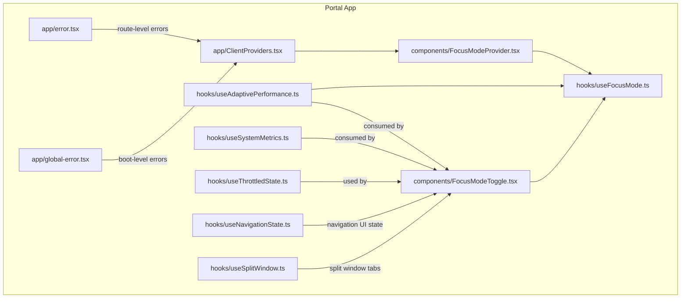
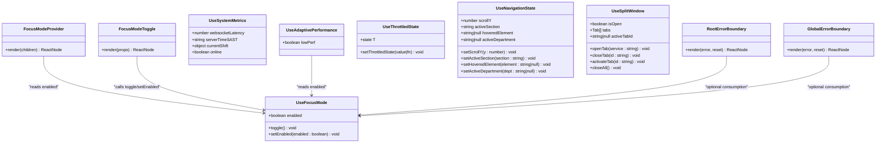
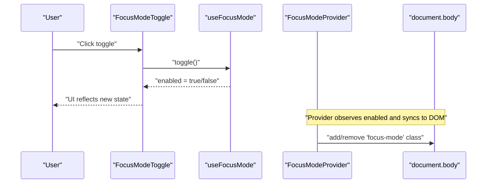
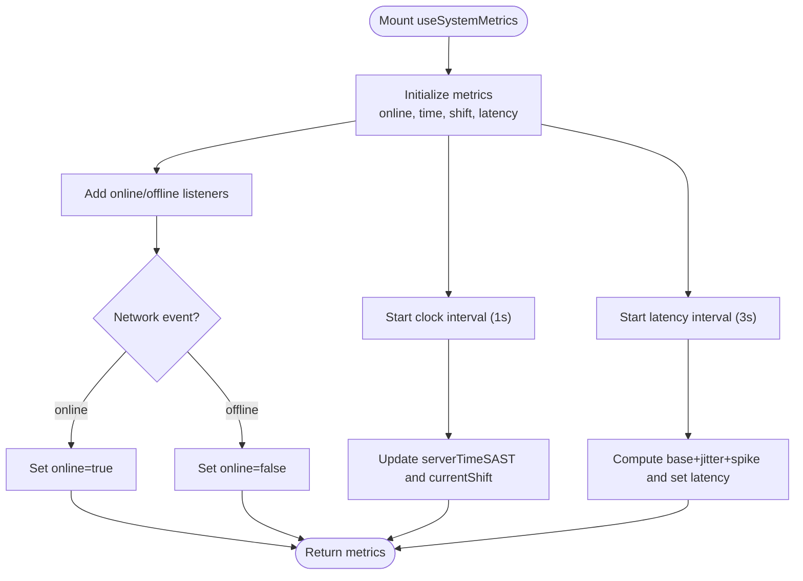
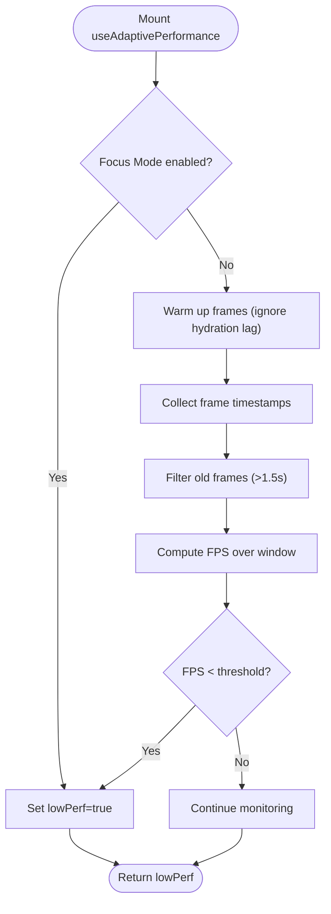
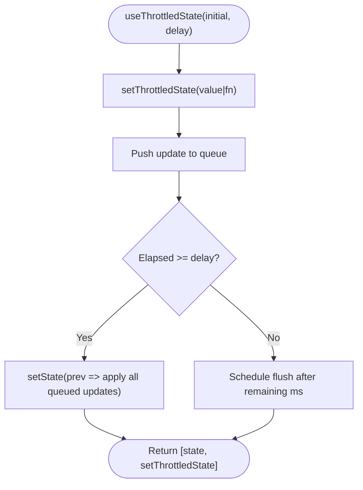
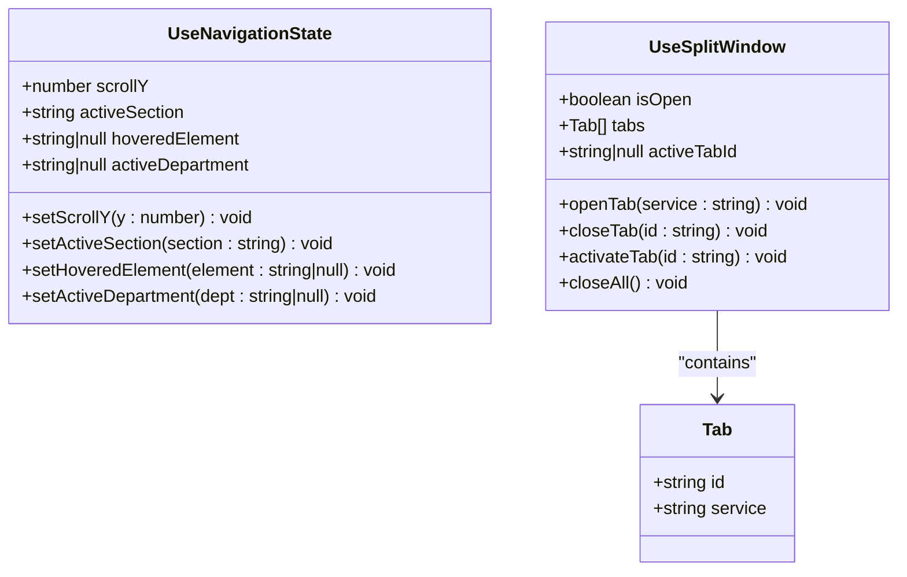
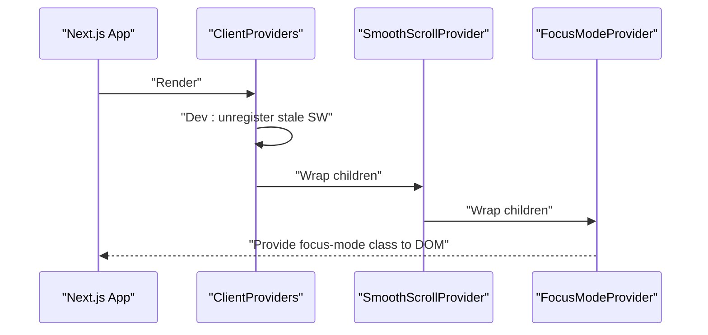
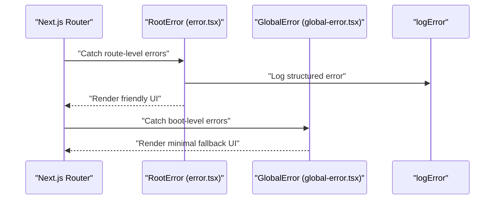
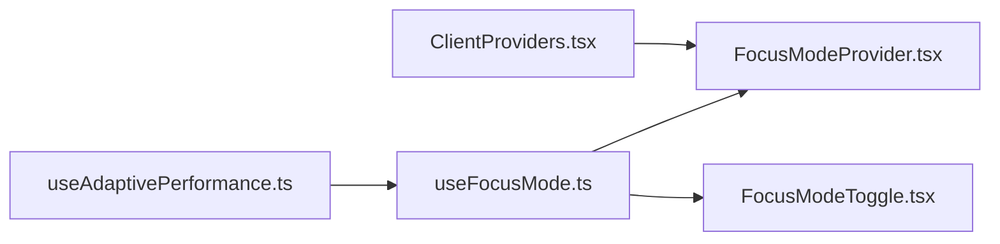

# Client-Side State Management

<cite>
**Referenced Files in This Document**
- [useSystemMetrics.ts](file://apps/portal/hooks/useSystemMetrics.ts)
- [useFocusMode.ts](file://apps/portal/hooks/useFocusMode.ts)
- [FocusModeProvider.tsx](file://apps/portal/components/FocusModeProvider.tsx)
- [ClientProviders.tsx](file://apps/portal/app/ClientProviders.tsx)
- [useThrottledState.ts](file://apps/portal/hooks/useThrottledState.ts)
- [useNavigationState.ts](file://apps/portal/hooks/useNavigationState.ts)
- [useSplitWindow.ts](file://apps/portal/hooks/useSplitWindow.ts)
- [FocusModeToggle.tsx](file://apps/portal/components/FocusModeToggle.tsx)
- [useAdaptivePerformance.ts](file://apps/portal/hooks/useAdaptivePerformance.ts)
- [error.tsx](file://apps/portal/app/error.tsx)
- [global-error.tsx](file://apps/portal/app/global-error.tsx)
</cite>

## Table of Contents

1. [Introduction](#introduction)
2. [Project Structure](#project-structure)
3. [Core Components](#core-components)
4. [Architecture Overview](#architecture-overview)
5. [Detailed Component Analysis](#detailed-component-analysis)
6. [Dependency Analysis](#dependency-analysis)
7. [Performance Considerations](#performance-considerations)
8. [Troubleshooting Guide](#troubleshooting-guide)
9. [Conclusion](#conclusion)

## Introduction

This document explains client-side state management patterns used in the portal application, focusing on:

- Local state with React hooks
- Custom hooks for system and UI metrics (e.g., useSystemMetrics, useAdaptivePerformance)
- Global client state via Zustand stores and provider components (e.g., FocusModeProvider)
- Synchronization between server and client, optimistic updates, and error boundaries
- Patterns for form state and UI state
- Performance considerations for frequent or expensive state updates

The goal is to provide a clear mental model of how state flows through the app, where it lives, and how to extend these patterns safely and efficiently.

## Project Structure

The relevant client-side state code is primarily located under apps/portal:

- hooks/: custom hooks for local and global state behaviors
- components/: providers and UI components that consume or mutate global state
- app/: root-level providers and error boundary files

**Diagram sources**

- [ClientProviders.tsx:1-40](file://apps/portal/app/ClientProviders.tsx#L1-L40)
- [FocusModeProvider.tsx:1-26](file://apps/portal/components/FocusModeProvider.tsx#L1-L26)
- [FocusModeToggle.tsx:1-74](file://apps/portal/components/FocusModeToggle.tsx#L1-L74)
- [useFocusMode.ts:1-24](file://apps/portal/hooks/useFocusMode.ts#L1-L24)
- [useSystemMetrics.ts:1-107](file://apps/portal/hooks/useSystemMetrics.ts#L1-L107)
- [useAdaptivePerformance.ts:1-83](file://apps/portal/hooks/useAdaptivePerformance.ts#L1-L83)
- [useThrottledState.ts:1-67](file://apps/portal/hooks/useThrottledState.ts#L1-L67)
- [useNavigationState.ts:1-24](file://apps/portal/hooks/useNavigationState.ts#L1-L24)
- [useSplitWindow.ts:1-70](file://apps/portal/hooks/useSplitWindow.ts#L1-L70)
- [error.tsx:1-114](file://apps/portal/app/error.tsx#L1-L114)
- [global-error.tsx:1-57](file://apps/portal/app/global-error.tsx#L1-L57)

**Section sources**

- [ClientProviders.tsx:1-40](file://apps/portal/app/ClientProviders.tsx#L1-L40)
- [FocusModeProvider.tsx:1-26](file://apps/portal/components/FocusModeProvider.tsx#L1-L26)
- [FocusModeToggle.tsx:1-74](file://apps/portal/components/FocusModeToggle.tsx#L1-L74)
- [useFocusMode.ts:1-24](file://apps/portal/hooks/useFocusMode.ts#L1-L24)
- [useSystemMetrics.ts:1-107](file://apps/portal/hooks/useSystemMetrics.ts#L1-L107)
- [useAdaptivePerformance.ts:1-83](file://apps/portal/hooks/useAdaptivePerformance.ts#L1-L83)
- [useThrottledState.ts:1-67](file://apps/portal/hooks/useThrottledState.ts#L1-L67)
- [useNavigationState.ts:1-24](file://apps/portal/hooks/useNavigationState.ts#L1-L24)
- [useSplitWindow.ts:1-70](file://apps/portal/hooks/useSplitWindow.ts#L1-L70)
- [error.tsx:1-114](file://apps/portal/app/error.tsx#L1-L114)
- [global-error.tsx:1-57](file://apps/portal/app/global-error.tsx#L1-L57)

## Core Components

- useFocusMode: A Zustand store with persistence for focus mode toggling. Provides enabled state and actions to toggle or set the value.
- FocusModeProvider: A provider component that synchronizes the focus mode state to the DOM by adding/removing a CSS class on the body element.
- FocusModeToggle: A UI control that consumes useFocusMode and triggers toggles; also demonstrates conditional rendering based on state.
- useSystemMetrics: A custom hook that tracks online status, simulated websocket latency, server time in a specific timezone, and current shift. It uses intervals and browser events.
- useAdaptivePerformance: A performance-aware hook that monitors frame timing and degrades rendering when FPS drops below a threshold or when focus mode is active.
- useThrottledState: A utility hook that batches rapid state updates into a single update per delay window, preserving functional updates.
- useNavigationState: A lightweight Zustand store for navigation-related UI state (scroll position, active section, hovered element, active department).
- useSplitWindow: A Zustand store managing a split-window tabbed interface (open/close/activate tabs).
- Error Boundaries: Route-level error.tsx and boot-level global-error.tsx handle user-facing error presentation and logging.

**Section sources**

- [useFocusMode.ts:1-24](file://apps/portal/hooks/useFocusMode.ts#L1-L24)
- [FocusModeProvider.tsx:1-26](file://apps/portal/components/FocusModeProvider.tsx#L1-L26)
- [FocusModeToggle.tsx:1-74](file://apps/portal/components/FocusModeToggle.tsx#L1-L74)
- [useSystemMetrics.ts:1-107](file://apps/portal/hooks/useSystemMetrics.ts#L1-L107)
- [useAdaptivePerformance.ts:1-83](file://apps/portal/hooks/useAdaptivePerformance.ts#L1-L83)
- [useThrottledState.ts:1-67](file://apps/portal/hooks/useThrottledState.ts#L1-L67)
- [useNavigationState.ts:1-24](file://apps/portal/hooks/useNavigationState.ts#L1-L24)
- [useSplitWindow.ts:1-70](file://apps/portal/hooks/useSplitWindow.ts#L1-L70)
- [error.tsx:1-114](file://apps/portal/app/error.tsx#L1-L114)
- [global-error.tsx:1-57](file://apps/portal/app/global-error.tsx#L1-L57)

## Architecture Overview

The client state architecture combines:

- Local state via useState and custom hooks
- Global client state via Zustand stores
- Provider components to bridge state to DOM/CSS classes
- Error boundaries for robust error handling

**Diagram sources**

- [useFocusMode.ts:1-24](file://apps/portal/hooks/useFocusMode.ts#L1-L24)
- [FocusModeProvider.tsx:1-26](file://apps/portal/components/FocusModeProvider.tsx#L1-L26)
- [FocusModeToggle.tsx:1-74](file://apps/portal/components/FocusModeToggle.tsx#L1-L74)
- [useSystemMetrics.ts:1-107](file://apps/portal/hooks/useSystemMetrics.ts#L1-L107)
- [useAdaptivePerformance.ts:1-83](file://apps/portal/hooks/useAdaptivePerformance.ts#L1-L83)
- [useThrottledState.ts:1-67](file://apps/portal/hooks/useThrottledState.ts#L1-L67)
- [useNavigationState.ts:1-24](file://apps/portal/hooks/useNavigationState.ts#L1-L24)
- [useSplitWindow.ts:1-70](file://apps/portal/hooks/useSplitWindow.ts#L1-L70)
- [error.tsx:1-114](file://apps/portal/app/error.tsx#L1-L114)
- [global-error.tsx:1-57](file://apps/portal/app/global-error.tsx#L1-L57)

## Detailed Component Analysis

### Focus Mode Pattern (Global Client State)

- Store: useFocusMode persists enabled state across sessions using zustand/middleware persist.
- Provider: FocusModeProvider applies a CSS class to the body when enabled, enabling theme/layout changes without prop drilling.
- UI: FocusModeToggle exposes an accessible toggle button and icon variant, consuming the store directly.

**Diagram sources**

- [FocusModeToggle.tsx:1-74](file://apps/portal/components/FocusModeToggle.tsx#L1-L74)
- [useFocusMode.ts:1-24](file://apps/portal/hooks/useFocusMode.ts#L1-L24)
- [FocusModeProvider.tsx:1-26](file://apps/portal/components/FocusModeProvider.tsx#L1-L26)

**Section sources**

- [useFocusMode.ts:1-24](file://apps/portal/hooks/useFocusMode.ts#L1-L24)
- [FocusModeProvider.tsx:1-26](file://apps/portal/components/FocusModeProvider.tsx#L1-L26)
- [FocusModeToggle.tsx:1-74](file://apps/portal/components/FocusModeToggle.tsx#L1-L74)

### System Metrics Hook (Local State with Side Effects)

- Tracks online/offline via browser events.
- Updates server time and operational shift at regular intervals.
- Simulates websocket latency with jitter and occasional spikes.

**Diagram sources**

- [useSystemMetrics.ts:1-107](file://apps/portal/hooks/useSystemMetrics.ts#L1-L107)

**Section sources**

- [useSystemMetrics.ts:1-107](file://apps/portal/hooks/useSystemMetrics.ts#L1-L107)

### Adaptive Performance Hook (Conditional Rendering Trigger)

- Monitors frame timing using requestAnimationFrame.
- After a warm-up period, computes average FPS over a sliding window.
- If FPS < threshold or focus mode is enabled, returns a flag to signal degraded rendering.

**Diagram sources**

- [useAdaptivePerformance.ts:1-83](file://apps/portal/hooks/useAdaptivePerformance.ts#L1-L83)
- [useFocusMode.ts:1-24](file://apps/portal/hooks/useFocusMode.ts#L1-L24)

**Section sources**

- [useAdaptivePerformance.ts:1-83](file://apps/portal/hooks/useAdaptivePerformance.ts#L1-L83)
- [useFocusMode.ts:1-24](file://apps/portal/hooks/useFocusMode.ts#L1-L24)

### Throttled State Hook (Batching Rapid Updates)

- Maintains a queue of updates and flushes them within a delay window.
- Supports both direct values and functional updates, ensuring no transitions are lost.
- Useful for high-frequency inputs (e.g., drag, resize, typing) to reduce re-renders.

**Diagram sources**

- [useThrottledState.ts:1-67](file://apps/portal/hooks/useThrottledState.ts#L1-L67)

**Section sources**

- [useThrottledState.ts:1-67](file://apps/portal/hooks/useThrottledState.ts#L1-L67)

### Navigation and Split Window Stores (Zustand)

- useNavigationState: Centralized UI state for navigation interactions (scroll position, active section, hover, active department).
- useSplitWindow: Manages a tabbed split view with open/close/activate semantics and tab uniqueness.

**Diagram sources**

- [useNavigationState.ts:1-24](file://apps/portal/hooks/useNavigationState.ts#L1-L24)
- [useSplitWindow.ts:1-70](file://apps/portal/hooks/useSplitWindow.ts#L1-L70)

**Section sources**

- [useNavigationState.ts:1-24](file://apps/portal/hooks/useNavigationState.ts#L1-L24)
- [useSplitWindow.ts:1-70](file://apps/portal/hooks/useSplitWindow.ts#L1-L70)

### Client Providers and Bootstrapping

- ClientProviders sets up client-only providers and performs development-time cleanup of stale service workers.
- FocusModeProvider bridges Zustand state to DOM classes.

**Diagram sources**

- [ClientProviders.tsx:1-40](file://apps/portal/app/ClientProviders.tsx#L1-L40)
- [FocusModeProvider.tsx:1-26](file://apps/portal/components/FocusModeProvider.tsx#L1-L26)

**Section sources**

- [ClientProviders.tsx:1-40](file://apps/portal/app/ClientProviders.tsx#L1-L40)
- [FocusModeProvider.tsx:1-26](file://apps/portal/components/FocusModeProvider.tsx#L1-L26)

### Error Boundaries (Route and Boot-Level)

- Route-level error.tsx: Presents user-friendly messages, logs structured errors, and shows dev-only context.
- Boot-level global-error.tsx: Renders a minimal fallback page during critical failures and provides a reload action.

**Diagram sources**

- [error.tsx:1-114](file://apps/portal/app/error.tsx#L1-L114)
- [global-error.tsx:1-57](file://apps/portal/app/global-error.tsx#L1-L57)

**Section sources**

- [error.tsx:1-114](file://apps/portal/app/error.tsx#L1-L114)
- [global-error.tsx:1-57](file://apps/portal/app/global-error.tsx#L1-L57)

## Dependency Analysis

- useAdaptivePerformance depends on useFocusMode to react to focus mode changes.
- FocusModeProvider depends on useFocusMode to synchronize DOM classes.
- FocusModeToggle depends on useFocusMode for interactive state changes.
- ClientProviders orchestrates client-only initialization and provider composition.

**Diagram sources**

- [useFocusMode.ts:1-24](file://apps/portal/hooks/useFocusMode.ts#L1-L24)
- [FocusModeProvider.tsx:1-26](file://apps/portal/components/FocusModeProvider.tsx#L1-L26)
- [FocusModeToggle.tsx:1-74](file://apps/portal/components/FocusModeToggle.tsx#L1-L74)
- [useAdaptivePerformance.ts:1-83](file://apps/portal/hooks/useAdaptivePerformance.ts#L1-L83)
- [ClientProviders.tsx:1-40](file://apps/portal/app/ClientProviders.tsx#L1-L40)

**Section sources**

- [useFocusMode.ts:1-24](file://apps/portal/hooks/useFocusMode.ts#L1-L24)
- [FocusModeProvider.tsx:1-26](file://apps/portal/components/FocusModeProvider.tsx#L1-L26)
- [FocusModeToggle.tsx:1-74](file://apps/portal/components/FocusModeToggle.tsx#L1-L74)
- [useAdaptivePerformance.ts:1-83](file://apps/portal/hooks/useAdaptivePerformance.ts#L1-L83)
- [ClientProviders.tsx:1-40](file://apps/portal/app/ClientProviders.tsx#L1-L40)

## Performance Considerations

- Throttle frequent updates: use useThrottledState for high-frequency inputs to avoid excessive re-renders and layout recalculations.
- Debounce vs throttle: prefer throttling for continuous streams (e.g., scrolling, dragging) and debouncing for delayed actions (e.g., search input).
- Minimize global state churn: keep frequently changing data local when possible; only promote to global stores if multiple components need it.
- Avoid heavy computations in render paths: compute derived values lazily or memoize where appropriate.
- Use adaptive degradation: leverage useAdaptivePerformance to conditionally disable expensive visuals when FPS drops.
- Optimize provider scope: wrap only necessary subtrees with providers to limit re-renders.
- Clean up side effects: ensure intervals and event listeners are removed in effect cleanup functions.

[No sources needed since this section provides general guidance]

## Troubleshooting Guide

- Stale service workers in development: ClientProviders unregisters existing registrations and reloads to prevent caching issues.
- Unexpected focus mode behavior: Verify FocusModeProvider is mounted and that the body class is applied; check for conflicting styles.
- High CPU usage from timers: Ensure intervals in useSystemMetrics are cleared on unmount; consider reducing tick frequency if not needed.
- Frequent re-renders: Identify components subscribing to large Zustand slices; select only required fields (e.g., useFocusMode((s) => s.enabled)).
- Error pages not showing: Confirm error.tsx and global-error.tsx are correctly placed and that errors are thrown or caught appropriately.

**Section sources**

- [ClientProviders.tsx:1-40](file://apps/portal/app/ClientProviders.tsx#L1-L40)
- [FocusModeProvider.tsx:1-26](file://apps/portal/components/FocusModeProvider.tsx#L1-L26)
- [useSystemMetrics.ts:1-107](file://apps/portal/hooks/useSystemMetrics.ts#L1-L107)
- [useFocusMode.ts:1-24](file://apps/portal/hooks/useFocusMode.ts#L1-L24)
- [error.tsx:1-114](file://apps/portal/app/error.tsx#L1-L114)
- [global-error.tsx:1-57](file://apps/portal/app/global-error.tsx#L1-L57)

## Conclusion

The portal’s client-side state strategy blends local React state, custom hooks, and global Zustand stores, coordinated by provider components and guarded by robust error boundaries. The patterns demonstrated here—timers and event-driven state, throttled updates, adaptive performance, and persistent global preferences—provide a scalable foundation for building responsive, maintainable interfaces. Extend these patterns thoughtfully by keeping state close to its consumers, batching frequent updates, and surfacing meaningful UI feedback during asynchronous operations.

[No sources needed since this section summarizes without analyzing specific files]
