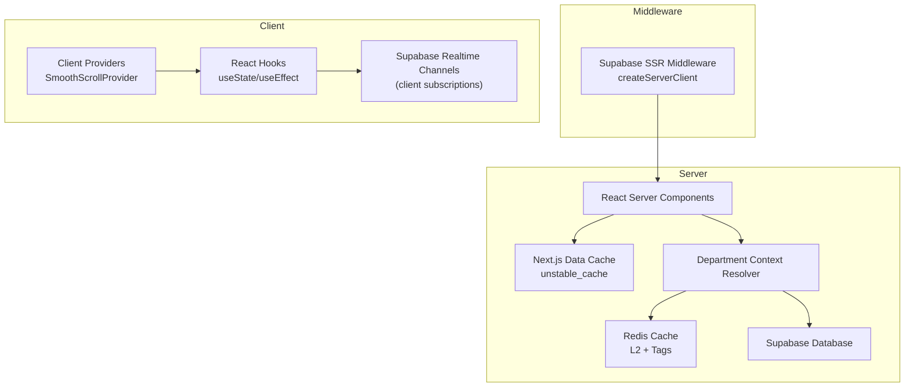
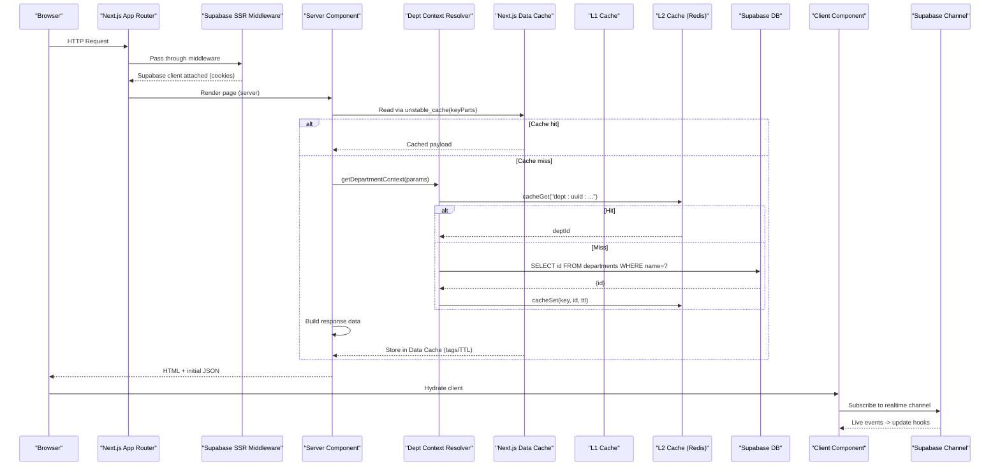
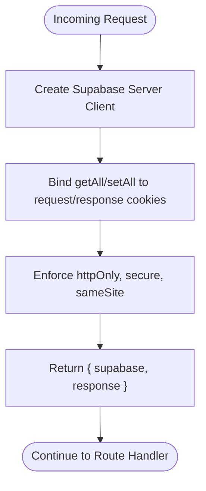
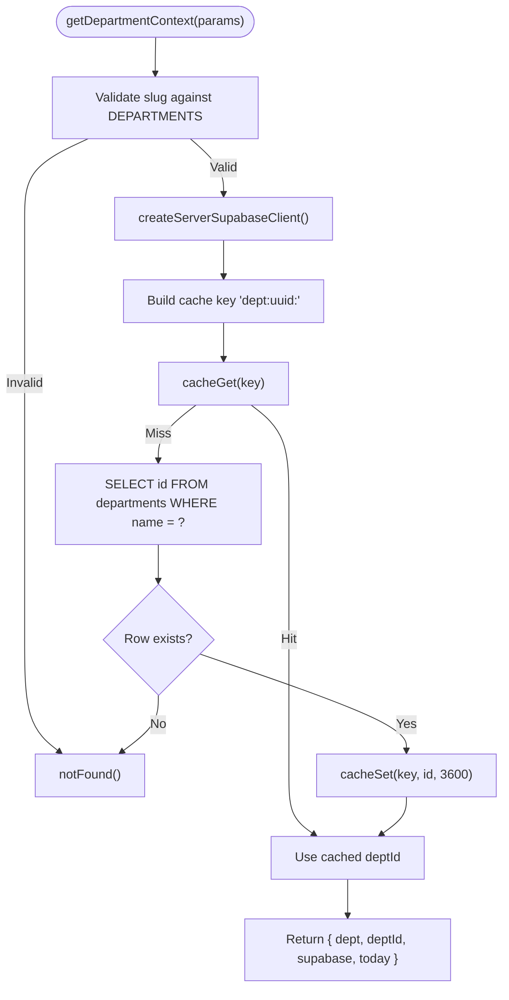
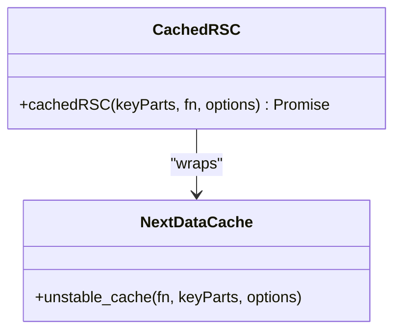
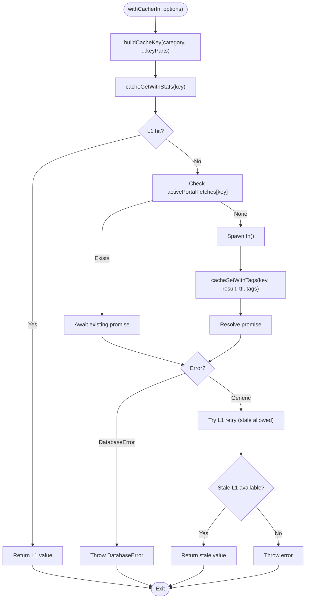
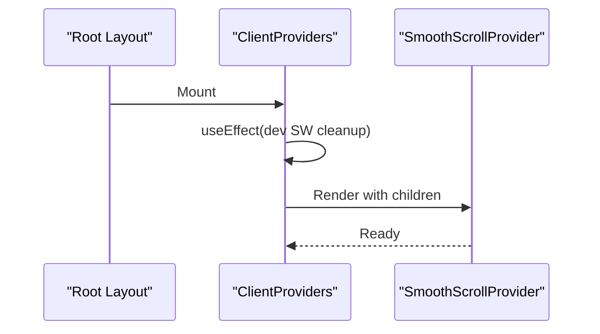
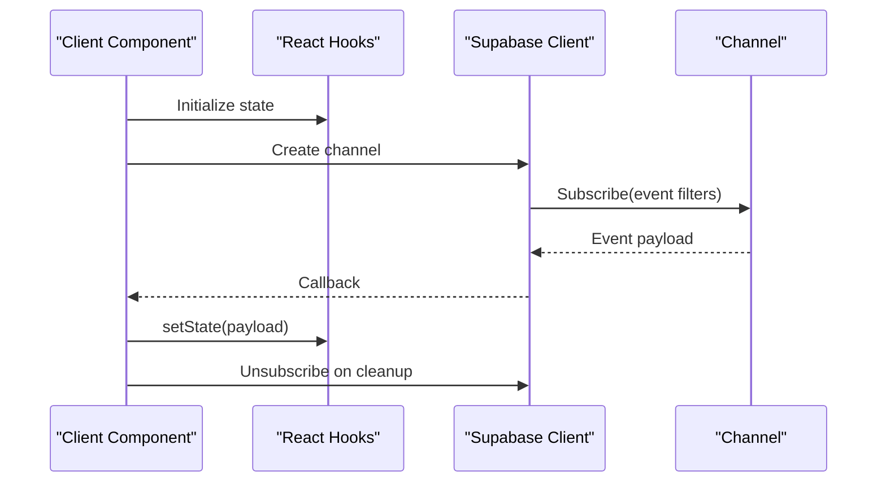
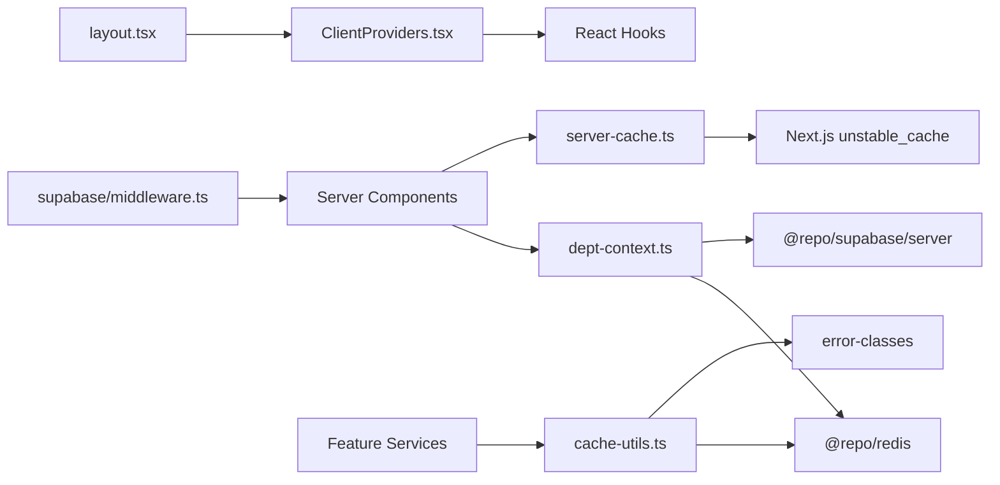

# Data Flow & State Management

<cite>
**Referenced Files in This Document**
- [apps/portal/lib/dept-context.ts](file://apps/portal/lib/dept-context.ts)
- [apps/portal/lib/cache-utils.ts](file://apps/portal/lib/cache-utils.ts)
- [apps/portal/lib/server-cache.ts](file://apps/portal/lib/server-cache.ts)
- [apps/portal/app/layout.tsx](file://apps/portal/app/layout.tsx)
- [apps/portal/app/ClientProviders.tsx](file://apps/portal/app/ClientProviders.tsx)
- [packages/supabase/src/middleware.ts](file://packages/supabase/src/middleware.ts)
</cite>

## Table of Contents

1. Introduction
2. Project Structure
3. Core Components
4. Architecture Overview
5. Detailed Component Analysis
6. Dependency Analysis
7. Performance Considerations
8. Troubleshooting Guide
9. Conclusion

## Introduction

This document explains the end-to-end data flow and state management patterns used across the portal application. It covers:

- Server-side rendering with React Server Components (RSC) and Next.js caching
- Client-side state initialization and providers
- Authentication middleware using Supabase SSR client
- Department context resolution with Redis-backed lookups
- Multi-level caching strategies (Next.js Data Cache, L1/L2 caches)
- Real-time synchronization via Supabase channels (conceptual overview)
- Error handling patterns and performance optimizations for data fetching and updates

## Project Structure

The portal app is organized around a root layout that composes global providers and UI chrome, while feature-specific pages resolve department context and fetch data through layered caching utilities. The authentication middleware integrates Supabase cookies to maintain session state across requests.

**Diagram sources**

- [apps/portal/lib/server-cache.ts:12-26](file://apps/portal/lib/server-cache.ts#L12-L26)
- [apps/portal/lib/dept-context.ts:16-52](file://apps/portal/lib/dept-context.ts#L16-L52)
- [apps/portal/lib/cache-utils.ts:30-78](file://apps/portal/lib/cache-utils.ts#L30-78)
- [packages/supabase/src/middleware.ts:4-43](file://packages/supabase/src/middleware.ts#L4-L43)
- [apps/portal/app/ClientProviders.tsx:14-39](file://apps/portal/app/ClientProviders.tsx#L14-L39)

**Section sources**

- [apps/portal/app/layout.tsx:75-189](file://apps/portal/app/layout.tsx#L75-L189)
- [apps/portal/app/ClientProviders.tsx:14-39](file://apps/portal/app/ClientProviders.tsx#L14-L39)
- [packages/supabase/src/middleware.ts:4-43](file://packages/supabase/src/middleware.ts#L4-L43)
- [apps/portal/lib/server-cache.ts:12-26](file://apps/portal/lib/server-cache.ts#L12-L26)
- [apps/portal/lib/dept-context.ts:16-52](file://apps/portal/lib/dept-context.ts#L16-L52)
- [apps/portal/lib/cache-utils.ts:30-78](file://apps/portal/lib/cache-utils.ts#L30-78)

## Core Components

- Root Layout: Composes theme, providers, accessibility helpers, and global UI elements. It also injects preconnect/dns-prefetch hints for Supabase and prerender rules for navigation.
- Client Providers: Initializes client-only features such as smooth scrolling and development service worker cleanup.
- Authentication Middleware: Creates a Supabase server client bound to request/response cookies, enforcing secure cookie attributes.
- Department Context Resolver: Validates department slugs, resolves UUID from database, caches lookup in Redis, and returns a consistent context object for server components.
- Server Cache Wrapper: Wraps RSC data fetches with Next.js unstable_cache, enabling tag-based revalidation and TTL control.
- Portal Cache Utility: Provides a robust withCache wrapper integrating L1/L2 cache layers, active-request deduplication, error classification, and fallback behavior.

**Section sources**

- [apps/portal/app/layout.tsx:75-189](file://apps/portal/app/layout.tsx#L75-L189)
- [apps/portal/app/ClientProviders.tsx:14-39](file://apps/portal/app/ClientProviders.tsx#L14-L39)
- [packages/supabase/src/middleware.ts:4-43](file://packages/supabase/src/middleware.ts#L4-L43)
- [apps/portal/lib/dept-context.ts:16-52](file://apps/portal/lib/dept-context.ts#L16-L52)
- [apps/portal/lib/server-cache.ts:12-26](file://apps/portal/lib/server-cache.ts#L12-L26)
- [apps/portal/lib/cache-utils.ts:30-78](file://apps/portal/lib/cache-utils.ts#L30-78)

## Architecture Overview

The data lifecycle spans multiple layers:

- Request enters Next.js; middleware attaches Supabase client via cookies.
- Server components execute, optionally using cachedRSC to leverage Next.js Data Cache.
- Department context resolver validates slug, queries Supabase for UUID, and stores result in Redis with tags/TTL.
- Feature services use withCache to read/write L1/L2 caches, deduplicate concurrent requests, and handle errors gracefully.
- Client components initialize state via hooks and can subscribe to Supabase realtime channels for live updates.

**Diagram sources**

- [packages/supabase/src/middleware.ts:4-43](file://packages/supabase/src/middleware.ts#L4-L43)
- [apps/portal/lib/server-cache.ts:12-26](file://apps/portal/lib/server-cache.ts#L12-L26)
- [apps/portal/lib/dept-context.ts:16-52](file://apps/portal/lib/dept-context.ts#L16-L52)
- [apps/portal/lib/cache-utils.ts:30-78](file://apps/portal/lib/cache-utils.ts#L30-78)

## Detailed Component Analysis

### Authentication Middleware Flow

- Purpose: Attach a Supabase server client to each request by reading/writing cookies securely.
- Behavior:
  - Creates a Supabase server client bound to request cookies.
  - Ensures HttpOnly, Secure (production), SameSite=Lax on cookies.
  - Returns both the client instance and a mutable response proxy for cookie propagation.

**Diagram sources**

- [packages/supabase/src/middleware.ts:4-43](file://packages/supabase/src/middleware.ts#L4-L43)

**Section sources**

- [packages/supabase/src/middleware.ts:4-43](file://packages/supabase/src/middleware.ts#L4-L43)

### Department Context Resolution

- Purpose: Provide a validated, cached department context to server components.
- Behavior:
  - Validates slug against known departments.
  - Resolves UUID from Supabase if not present in Redis.
  - Caches UUID with TTL and returns a stable context object.
  - Throws not found when invalid or missing.

**Diagram sources**

- [apps/portal/lib/dept-context.ts:16-52](file://apps/portal/lib/dept-context.ts#L16-L52)

**Section sources**

- [apps/portal/lib/dept-context.ts:16-52](file://apps/portal/lib/dept-context.ts#L16-L52)

### Server-Side Rendering and Next.js Data Cache

- Purpose: Reduce repeated work during server rendering and enable tag-based revalidation.
- Behavior:
  - Wraps async fetch functions with unstable_cache.
  - Requires non-empty key parts.
  - Supports revalidate TTL and tags for fine-grained invalidation.

**Diagram sources**

- [apps/portal/lib/server-cache.ts:12-26](file://apps/portal/lib/server-cache.ts#L12-L26)

**Section sources**

- [apps/portal/lib/server-cache.ts:12-26](file://apps/portal/lib/server-cache.ts#L12-L26)

### Multi-Level Caching Strategy (withCache)

- Purpose: Provide resilient, high-performance data access with L1/L2 caches, active-request deduplication, and graceful degradation.
- Behavior:
  - Builds keys via buildCacheKey(category, ...keyParts).
  - Reads L1 first; if miss, attempts L2.
  - On miss, executes function and writes to L2 with tags and TTL.
  - Deduplicates concurrent identical fetches per key.
  - Re-throws DatabaseError without caching.
  - Falls back to L1 on generic errors if stale value available.
  - Gracefully degrades when Redis is unreachable.

**Diagram sources**

- [apps/portal/lib/cache-utils.ts:30-78](file://apps/portal/lib/cache-utils.ts#L30-78)

**Section sources**

- [apps/portal/lib/cache-utils.ts:30-78](file://apps/portal/lib/cache-utils.ts#L30-78)

### Client-Side State Initialization and Providers

- Purpose: Initialize client-only behaviors and provide context to the component tree.
- Behavior:
  - Dynamically imports SmoothScrollProvider to avoid SSR.
  - In development, unregisters stale service workers and reloads to ensure fresh assets.
  - Renders children within provider hierarchy.

**Diagram sources**

- [apps/portal/app/ClientProviders.tsx:14-39](file://apps/portal/app/ClientProviders.tsx#L14-L39)

**Section sources**

- [apps/portal/app/ClientProviders.tsx:14-39](file://apps/portal/app/ClientProviders.tsx#L14-L39)

### Real-Time Data Synchronization (Conceptual)

- Concept: Client components subscribe to Supabase realtime channels to receive live updates and reconcile local state via React hooks.
- Typical pattern:
  - On mount, create a channel subscription scoped to relevant entities or departments.
  - On event, update local state (e.g., useState/useReducer) to reflect changes.
  - On unmount, unsubscribe to prevent leaks.
- Note: This section describes a conceptual integration point; specific implementation files are not referenced here.

[No sources needed since this diagram shows conceptual workflow, not actual code structure]

## Dependency Analysis

High-level dependencies among core modules:

- Root layout depends on ClientProviders and global UI components.
- Middleware depends on Supabase SSR client and Next.js request/response.
- Department context depends on Supabase server client, Redis cache, and utility functions.
- Server cache depends on Next.js unstable_cache.
- Portal cache utility depends on Redis package for L1/L2 operations and error classes.

**Diagram sources**

- [apps/portal/app/layout.tsx:75-189](file://apps/portal/app/layout.tsx#L75-L189)
- [apps/portal/app/ClientProviders.tsx:14-39](file://apps/portal/app/ClientProviders.tsx#L14-L39)
- [packages/supabase/src/middleware.ts:4-43](file://packages/supabase/src/middleware.ts#L4-L43)
- [apps/portal/lib/dept-context.ts:16-52](file://apps/portal/lib/dept-context.ts#L16-L52)
- [apps/portal/lib/server-cache.ts:12-26](file://apps/portal/lib/server-cache.ts#L12-L26)
- [apps/portal/lib/cache-utils.ts:30-78](file://apps/portal/lib/cache-utils.ts#L30-78)

**Section sources**

- [apps/portal/app/layout.tsx:75-189](file://apps/portal/app/layout.tsx#L75-L189)
- [apps/portal/app/ClientProviders.tsx:14-39](file://apps/portal/app/ClientProviders.tsx#L14-L39)
- [packages/supabase/src/middleware.ts:4-43](file://packages/supabase/src/middleware.ts#L4-L43)
- [apps/portal/lib/dept-context.ts:16-52](file://apps/portal/lib/dept-context.ts#L16-L52)
- [apps/portal/lib/server-cache.ts:12-26](file://apps/portal/lib/server-cache.ts#L12-L26)
- [apps/portal/lib/cache-utils.ts:30-78](file://apps/portal/lib/cache-utils.ts#L30-78)

## Performance Considerations

- Prefer Next.js Data Cache for expensive server computations and large payloads; use tags for targeted revalidation.
- Use withCache for cross-cutting data access to benefit from L1/L2 caching, active-request deduplication, and fallbacks.
- Keep cache keys deterministic and granular to minimize invalidation scope.
- Apply appropriate TTLs based on data volatility; shorter for frequently changing data, longer for static references.
- Avoid caching transient database errors; let them propagate to clients for proper feedback.
- Leverage prerender hints and preconnect/dns-prefetch for external endpoints like Supabase.
- For real-time updates, prefer lightweight channel subscriptions and batched state updates to reduce re-renders.

[No sources needed since this section provides general guidance]

## Troubleshooting Guide

Common issues and resolutions:

- Missing or invalid department slug:
  - Symptom: 404 during server render.
  - Cause: Slug not found in registry or UUID not present in database.
  - Action: Verify slug mapping and department records; check Redis cache for stale entries.
- Database errors not cached:
  - Symptom: Repeated failures on subsequent requests.
  - Cause: withCache intentionally does not cache DatabaseError instances.
  - Action: Inspect upstream database connectivity and query correctness.
- Redis unreachable:
  - Symptom: Increased latency or fallback to direct DB calls.
  - Cause: L2 cache unavailable.
  - Action: Monitor Redis health; rely on L1 fallback where possible; consider circuit breakers.
- Stale service workers in development:
  - Symptom: Outdated assets after rebuilds.
  - Cause: Registered service workers not updated.
  - Action: Development cleanup automatically unregisters stale workers and reloads.

**Section sources**

- [apps/portal/lib/dept-context.ts:16-52](file://apps/portal/lib/dept-context.ts#L16-L52)
- [apps/portal/lib/cache-utils.ts:30-78](file://apps/portal/lib/cache-utils.ts#L30-78)
- [apps/portal/app/ClientProviders.tsx:14-39](file://apps/portal/app/ClientProviders.tsx#L14-L39)

## Conclusion

The portal employs a layered approach to data flow and state management:

- Server-side rendering leverages Next.js Data Cache and tag-based revalidation.
- Department context resolution ensures fast, reliable lookups with Redis-backed caching.
- A robust withCache utility provides multi-level caching, deduplication, and graceful degradation.
- Authentication middleware secures sessions via properly configured cookies.
- Client-side state is initialized through providers and can be kept in sync with Supabase realtime channels.
  Together, these patterns deliver responsive, resilient, and maintainable data experiences across the application.
