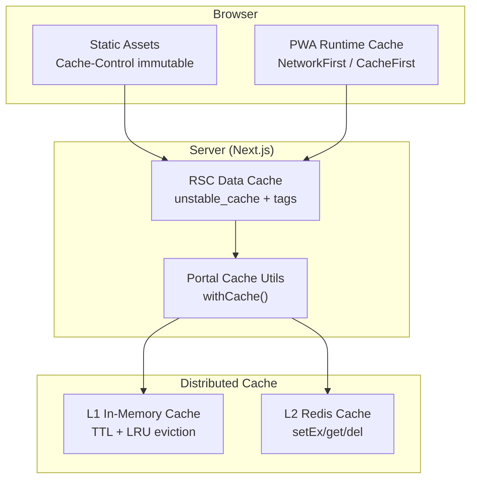
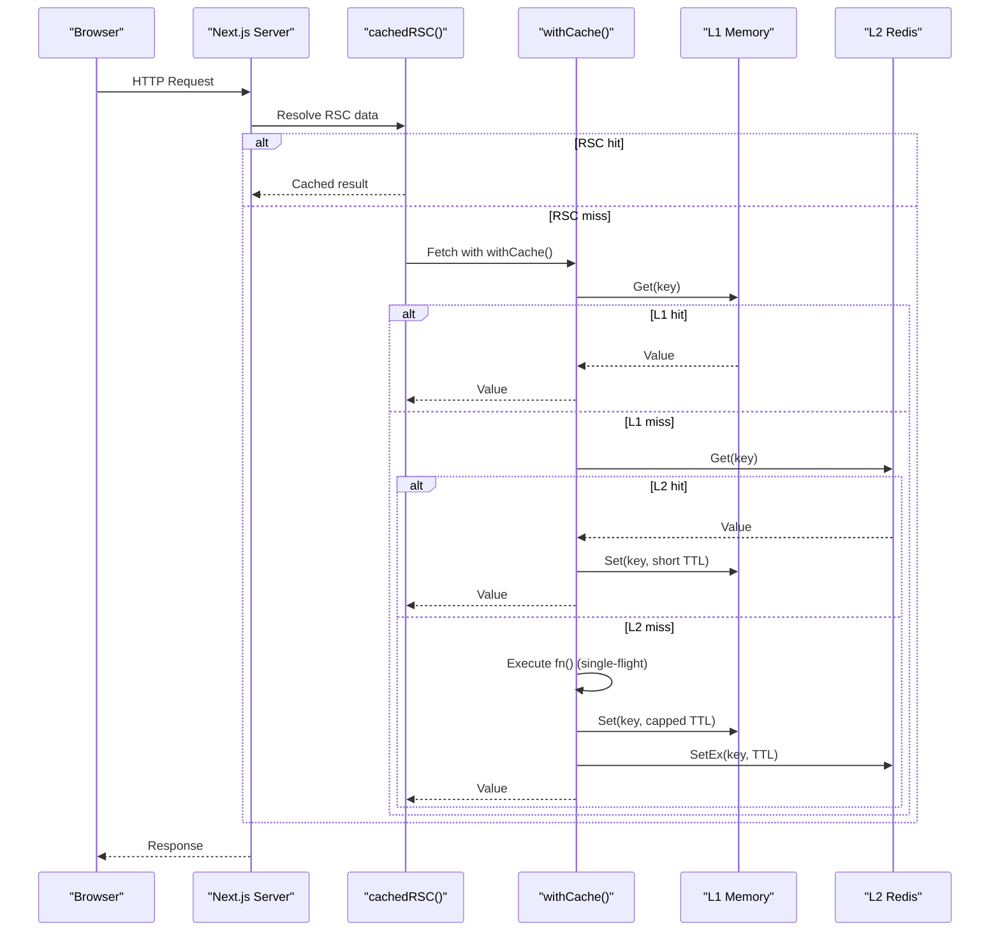
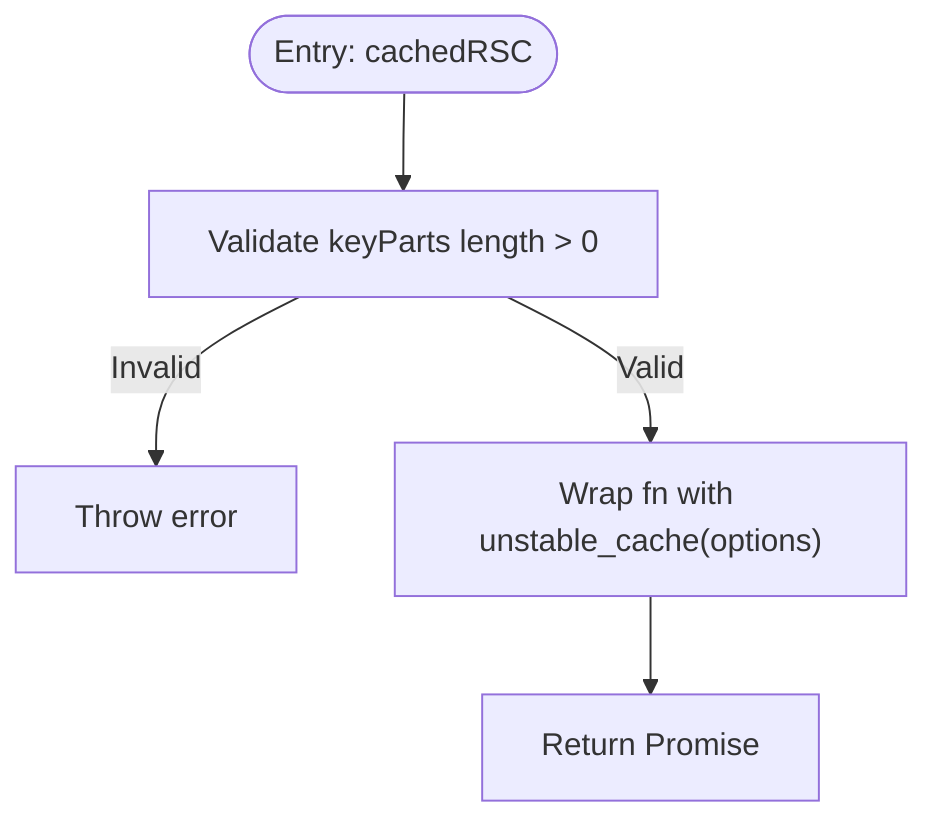
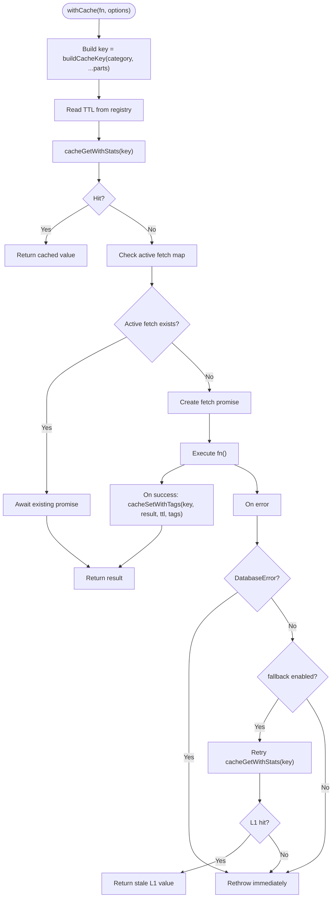
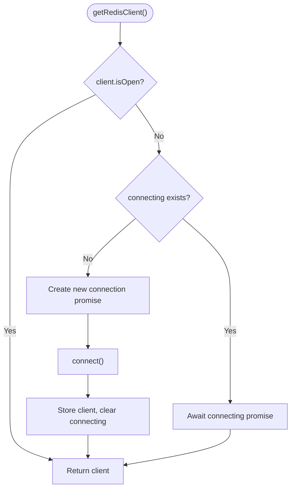
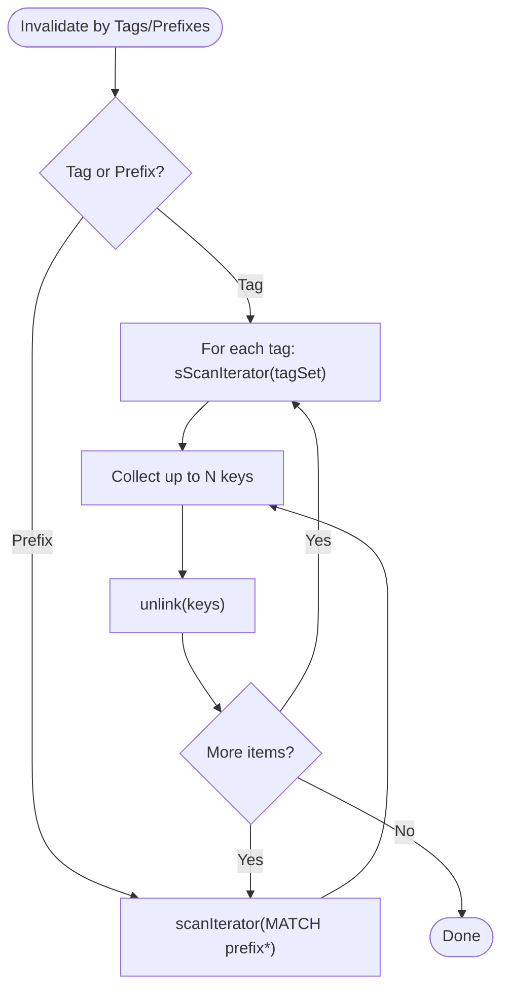
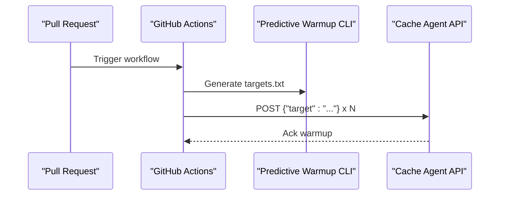
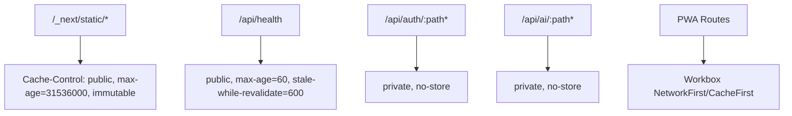
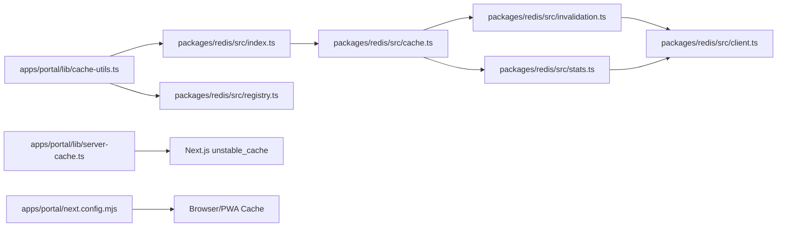

# Multi-Level Caching Strategy

<cite>
**Referenced Files in This Document**
- [server-cache.ts](file://apps/portal/lib/server-cache.ts)
- [cache-utils.ts](file://apps/portal/lib/cache-utils.ts)
- [cache-utils.test.ts](file://apps/portal/lib/cache-utils.test.ts)
- [cache.ts](file://packages/redis/src/cache.ts)
- [client.ts](file://packages/redis/src/client.ts)
- [invalidation.ts](file://packages/redis/src/invalidation.ts)
- [registry.ts](file://packages/redis/src/registry.ts)
- [stats.ts](file://packages/redis/src/stats.ts)
- [index.ts](file://packages/redis/src/index.ts)
- [next.config.mjs](file://apps/portal/next.config.mjs)
- [proxy.ts](file://apps/portal/proxy.ts)
- [pr-cache-warmup.yml](file://ci/workflows/pr-cache-warmup.yml)
</cite>

## Table of Contents

1. Introduction
2. Project Structure
3. Core Components
4. Architecture Overview
5. Detailed Component Analysis
6. Dependency Analysis
7. Performance Considerations
8. Troubleshooting Guide
9. Conclusion
10. Appendices

## Introduction

This document explains the multi-level caching strategy implemented across the application, covering:

- The cache hierarchy from React Server Components (Next.js Data Cache) to Redis and browser caches
- Cache invalidation patterns using tags and prefixes
- Cache warming strategies via CI workflows
- Cache utilities implementation for key generation, TTL management, and single-flight request coalescing
- Distributed caching with Redis integration
- Server-side caching with Next.js unstable_cache
- Examples of cache key generation, TTL policies, cache busting techniques, and performance monitoring for cache effectiveness

## Project Structure

The caching system spans several layers:

- Browser layer: PWA runtime caching and static asset caching via Next.js headers
- Server layer: Next.js Data Cache for RSC reads
- Application layer: In-memory L1 cache and distributed L2 cache (Redis)
- Invalidation layer: Tag-based and prefix-based invalidation
- Observability layer: Local and Redis-backed metrics for hits, misses, latency percentiles



**Diagram sources**

- [next.config.mjs:129-191](file://apps/portal/next.config.mjs#L129-L191)
- [server-cache.ts:12-26](file://apps/portal/lib/server-cache.ts#L12-L26)
- [cache-utils.ts:30-78](file://apps/portal/lib/cache-utils.ts#L30-L78)
- [cache.ts:80-174](file://packages/redis/src/cache.ts#L80-L174)

**Section sources**

- [next.config.mjs:129-191](file://apps/portal/next.config.mjs#L129-L191)
- [server-cache.ts:12-26](file://apps/portal/lib/server-cache.ts#L12-L26)
- [cache-utils.ts:30-78](file://apps/portal/lib/cache-utils.ts#L30-L78)
- [cache.ts:80-174](file://packages/redis/src/cache.ts#L80-L174)

## Core Components

- Next.js RSC cache wrapper: Provides a typed wrapper around unstable_cache for server-side data caching with revalidate and tags support.
- Portal cache utility: A higher-level withCache that builds keys, applies TTL registry, performs single-flight coalescing, and handles fallbacks on errors.
- Redis package: Implements L1 in-memory cache with TTL/LRU, L2 Redis operations, tag/prefix invalidation, and stats recording.
- Client singleton: Manages Redis connection lifecycle and prevents thundering herds during connect.
- Registry: Centralized categories and TTL configuration plus deterministic key builder.
- Stats: Records hits/misses/errors and latency percentiles locally and in Redis.

**Section sources**

- [server-cache.ts:12-26](file://apps/portal/lib/server-cache.ts#L12-L26)
- [cache-utils.ts:30-78](file://apps/portal/lib/cache-utils.ts#L30-L78)
- [cache.ts:80-174](file://packages/redis/src/cache.ts#L80-L174)
- [client.ts:16-54](file://packages/redis/src/client.ts#L16-L54)
- [registry.ts:18-33](file://packages/redis/src/registry.ts#L18-L33)
- [stats.ts:59-104](file://packages/redis/src/stats.ts#L59-L104)

## Architecture Overview

The system implements a three-tier caching approach:

- Tier 1: Browser cache (static assets and PWA runtime)
- Tier 2: Next.js Data Cache for RSC reads
- Tier 3: Application-level cache (L1 in-memory + L2 Redis)



**Diagram sources**

- [server-cache.ts:12-26](file://apps/portal/lib/server-cache.ts#L12-L26)
- [cache-utils.ts:30-78](file://apps/portal/lib/cache-utils.ts#L30-L78)
- [cache.ts:80-174](file://packages/redis/src/cache.ts#L80-L174)

## Detailed Component Analysis

### React Server Component Cache Wrapper

- Purpose: Provide a simple API over Next.js unstable_cache for RSC reads with optional revalidate TTL and tag-based revalidation.
- Behavior: Validates non-empty key parts; forwards options to unstable_cache; returns Promise<T>.



**Diagram sources**

- [server-cache.ts:12-26](file://apps/portal/lib/server-cache.ts#L12-L26)

**Section sources**

- [server-cache.ts:12-26](file://apps/portal/lib/server-cache.ts#L12-L26)

### Portal Cache Utility (withCache)

- Key generation: Uses buildCacheKey(category, ...keyParts).
- TTL selection: Reads CACHE_TTL_REGISTRY[category].l2Seconds for L2 TTL; L1 TTL is managed internally by the Redis package.
- Single-flight coalescing: Prevents duplicate concurrent executions per key.
- Error handling: DatabaseError is not cached and rethrown immediately; generic errors can fall back to stale L1 if available.
- Graceful degradation: If Redis is unreachable, falls back to direct execution and retries L1 after failure.



**Diagram sources**

- [cache-utils.ts:30-78](file://apps/portal/lib/cache-utils.ts#L30-L78)
- [cache-utils.test.ts:54-85](file://apps/portal/lib/cache-utils.test.ts#L54-L85)

**Section sources**

- [cache-utils.ts:30-78](file://apps/portal/lib/cache-utils.ts#L30-L78)
- [cache-utils.test.ts:54-85](file://apps/portal/lib/cache-utils.test.ts#L54-L85)

### Redis Package: L1/L2 Cache Operations

- L1 In-Memory Cache: Map-backed with TTL expiration and simple LRU eviction at capacity.
- L2 Redis Cache: setEx/get/del with safe client access.
- Write-through: Writes to both L1 (capped TTL) and L2 (configured TTL).
- Single-flight: Global activeFetches map ensures only one execution per key.
- Invalidation helpers: Delete by key, pattern (deprecated), tag-based, and prefix-based invalidation.

```mermaid
classDiagram
class CacheLayer {
+cacheGet(key) T|null
+cacheGetWithStats(key) {value, source}
+cacheSet(key, value, ttl) void
+cacheSetWithTags(key, value, ttl, tags) void
+cacheWrap(key, fn, ttl) T
+cacheDelete(key) void
+cacheEvictL1ByPrefix(prefix) void
+clearMemoryCache() void
}
class Invalidation {
+indexCacheKeyByTags(key, tags) void
+cacheInvalidateTags(tags) number
+cacheInvalidatePrefixes(prefixes) number
}
class Stats {
+recordCacheHit(source, latencyMs) void
+recordCacheMiss(latencyMs) void
+recordRedisError() void
+getCacheStats() Snapshot
+resetCacheStats() void
}
CacheLayer --> Invalidation : "uses"
CacheLayer --> Stats : "records"
```

**Diagram sources**

- [cache.ts:80-174](file://packages/redis/src/cache.ts#L80-L174)
- [invalidation.ts:17-113](file://packages/redis/src/invalidation.ts#L17-L113)
- [stats.ts:59-104](file://packages/redis/src/stats.ts#L59-L104)

**Section sources**

- [cache.ts:80-174](file://packages/redis/src/cache.ts#L80-L174)
- [invalidation.ts:17-113](file://packages/redis/src/invalidation.ts#L17-L113)
- [stats.ts:59-104](file://packages/redis/src/stats.ts#L59-L104)

### Redis Client Singleton

- Ensures a single open Redis client instance.
- Prevents thundering herd during connect by awaiting an in-flight connection.
- Resets state on error/end events to allow retry on next call.



**Diagram sources**

- [client.ts:16-54](file://packages/redis/src/client.ts#L16-L54)

**Section sources**

- [client.ts:16-54](file://packages/redis/src/client.ts#L16-L54)

### Cache Key Generation and TTL Management

- Categories: AUTH, METRICS, SHIFT, AI_MEMORY, DEPARTMENT, EQUIPMENT.
- Key format: arch:<category>:<parts...>
- TTL registry: Per-category l1Seconds and l2Seconds; portal uses l2Seconds for L2 writes.

Examples:

- Category: department, parts: ["engineering"] → key: arch:dept:engineering
- Category: auth, parts: ["user:123"] → key: arch:auth:user:123

TTL examples:

- AUTH: l1=60s, l2=3600s
- METRICS: l1=15s, l2=300s
- SHIFT: l1=30s, l2=120s
- AI_MEMORY: l1=10s, l2=60s
- DEPARTMENT: l1=60s, l2=3600s
- EQUIPMENT: l1=30s, l2=300s

**Section sources**

- [registry.ts:1-33](file://packages/redis/src/registry.ts#L1-L33)
- [cache-utils.ts:30-78](file://apps/portal/lib/cache-utils.ts#L30-L78)

### Cache Invalidation Patterns

- Tag-based invalidation: Associate keys with tags; invalidate all keys by scanning sets and unlinking in batches.
- Prefix-based invalidation: Scan keys matching a prefix and unlink in batches.
- L1 consistency: L1 entries are evicted by prefix when needed.



**Diagram sources**

- [invalidation.ts:40-113](file://packages/redis/src/invalidation.ts#L40-L113)
- [cache.ts:243-250](file://packages/redis/src/cache.ts#L243-L250)

**Section sources**

- [invalidation.ts:40-113](file://packages/redis/src/invalidation.ts#L40-L113)
- [cache.ts:243-250](file://packages/redis/src/cache.ts#L243-L250)

### Cache Warming Strategies

- CI predictive warmup: On pull requests, generate build targets and pre-warm cache via an internal agent endpoint.
- Typical flow: Checkout code, install dependencies, run turbo dry-run, generate targets, POST warmup requests.



**Diagram sources**

- [pr-cache-warmup.yml:1-32](file://ci/workflows/pr-cache-warmup.yml#L1-L32)

**Section sources**

- [pr-cache-warmup.yml:1-32](file://ci/workflows/pr-cache-warmup.yml#L1-L32)

### Browser Cache Integration

- Static assets: Immutable long-lived cache via Cache-Control headers.
- PWA runtime: Workbox strategies (CacheFirst for static assets, NetworkFirst for API and general routes).
- Health endpoints: Short TTL with stale-while-revalidate to absorb upstream traffic.
- Auth/AI APIs: Private, no-store to avoid caching sensitive responses.



**Diagram sources**

- [next.config.mjs:129-191](file://apps/portal/next.config.mjs#L129-L191)

**Section sources**

- [next.config.mjs:129-191](file://apps/portal/next.config.mjs#L129-L191)

### Middleware Usage Example

- The middleware demonstrates a practical use of cacheGet/cacheSet for resolving department UUIDs with a 1-hour TTL.

**Section sources**

- [proxy.ts:118-135](file://apps/portal/proxy.ts#L118-L135)

## Dependency Analysis

The following diagram shows how components depend on each other:



**Diagram sources**

- [cache-utils.ts:1-7](file://apps/portal/lib/cache-utils.ts#L1-L7)
- [index.ts:1-27](file://packages/redis/src/index.ts#L1-L27)
- [cache.ts:1-6](file://packages/redis/src/cache.ts#L1-L6)
- [invalidation.ts:1-11](file://packages/redis/src/invalidation.ts#L1-L11)
- [stats.ts:1-2](file://packages/redis/src/stats.ts#L1-L2)
- [client.ts:1-6](file://packages/redis/src/client.ts#L1-L6)
- [registry.ts:1-8](file://packages/redis/src/registry.ts#L1-L8)
- [server-cache.ts:1-2](file://apps/portal/lib/server-cache.ts#L1-L2)
- [next.config.mjs:129-191](file://apps/portal/next.config.mjs#L129-L191)

**Section sources**

- [cache-utils.ts:1-7](file://apps/portal/lib/cache-utils.ts#L1-L7)
- [index.ts:1-27](file://packages/redis/src/index.ts#L1-L27)
- [cache.ts:1-6](file://packages/redis/src/cache.ts#L1-L6)
- [invalidation.ts:1-11](file://packages/redis/src/invalidation.ts#L1-L11)
- [stats.ts:1-2](file://packages/redis/src/stats.ts#L1-L2)
- [client.ts:1-6](file://packages/redis/src/client.ts#L1-L6)
- [registry.ts:1-8](file://packages/redis/src/registry.ts#L1-L8)
- [server-cache.ts:1-2](file://apps/portal/lib/server-cache.ts#L1-L2)
- [next.config.mjs:129-191](file://apps/portal/next.config.mjs#L129-L191)

## Performance Considerations

- L1 TTL cap: L1 TTL is capped at 30 seconds to keep memory footprint lean while still accelerating near-term reads.
- L2 TTL alignment: Use category-specific TTLs from the registry to balance freshness and throughput.
- Single-flight coalescing: Prevents thundering herds on cache misses by deduplicating concurrent requests per key.
- Non-blocking invalidation: SCAN/SSCAN and UNLINK avoid blocking Redis and reduce tail latencies.
- Fire-and-forget stats: Recording stats asynchronously avoids impacting critical paths.

[No sources needed since this section provides general guidance]

## Troubleshooting Guide

Common issues and remedies:

- Redis unavailable: The safe client wrapper returns null; reads degrade gracefully to direct execution and may retry L1 for stale values.
- Stale data after updates: Ensure tag-based or prefix-based invalidation is invoked after mutations.
- High miss rate: Verify key construction and TTL settings; consider increasing L2 TTL for stable datasets.
- Memory pressure: Monitor L1 size and adjust eviction thresholds if necessary.
- Latency spikes: Inspect p95 latency and redisErrors from stats; check Redis connectivity and network conditions.

**Section sources**

- [cache.ts:62-69](file://packages/redis/src/cache.ts#L62-L69)
- [cache.ts:108-113](file://packages/redis/src/cache.ts#L108-L113)
- [stats.ts:120-150](file://packages/redis/src/stats.ts#L120-L150)

## Conclusion

This multi-level caching strategy combines browser, server, and distributed caches to deliver low-latency reads, strong consistency where required, and robust invalidation mechanisms. With centralized key building, TTL management, single-flight coalescing, and comprehensive observability, the system balances performance and correctness across dynamic and static content.

[No sources needed since this section summarizes without analyzing specific files]

## Appendices

### Cache Utilities API Summary

- withCache(fn, options): Builds key, checks L1/L2, executes fn on miss, caches result, supports single-flight and fallback.
- cacheGetWithStats(key): Returns value and source ("l1", "l2", or null).
- cacheSetWithTags(key, value, ttl, tags): Write-through to L1/L2 and index tags.
- cacheInvalidateTags(tags): Invalidate all keys associated with tags.
- cacheInvalidatePrefixes(prefixes): Invalidate all keys matching prefixes.
- getCacheStats(): Retrieve aggregated cache metrics.

**Section sources**

- [cache-utils.ts:30-78](file://apps/portal/lib/cache-utils.ts#L30-L78)
- [cache.ts:119-189](file://packages/redis/src/cache.ts#L119-L189)
- [invalidation.ts:40-113](file://packages/redis/src/invalidation.ts#L40-L113)
- [stats.ts:120-150](file://packages/redis/src/stats.ts#L120-L150)

### Cache Bust Techniques

- Static assets: Use hashed filenames and immutable Cache-Control headers to bust browser caches automatically.
- PWA: Update workbox-generated filenames and force service worker updates to refresh runtime caches.
- API responses: For sensitive routes, apply private, no-store headers to prevent caching.

**Section sources**

- [next.config.mjs:129-191](file://apps/portal/next.config.mjs#L129-L191)
