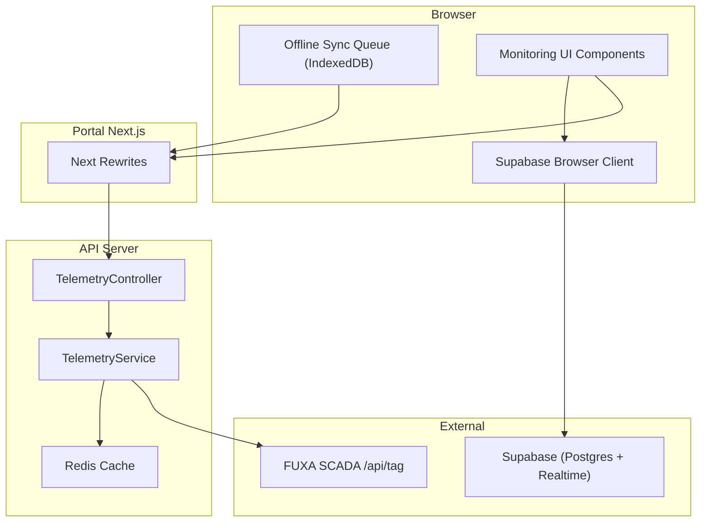
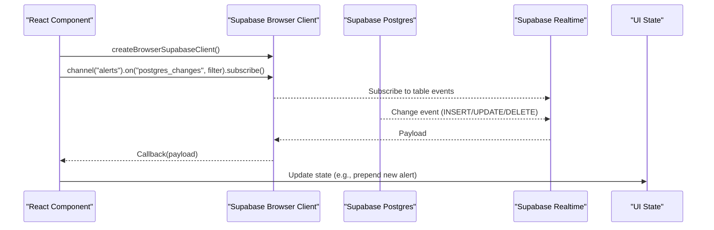
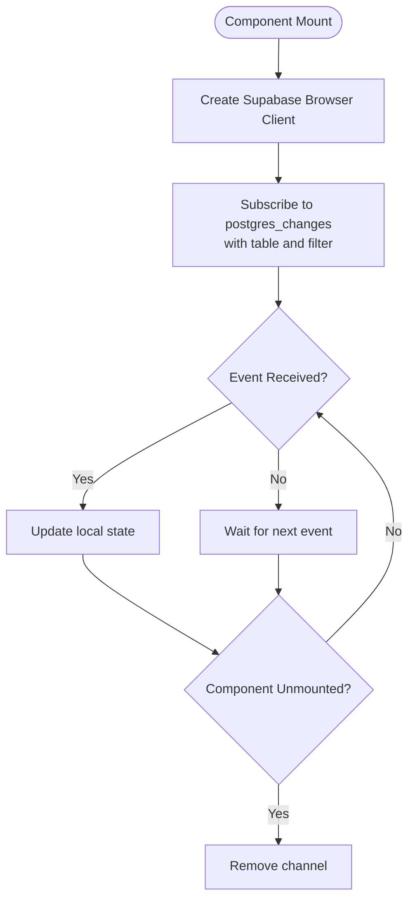
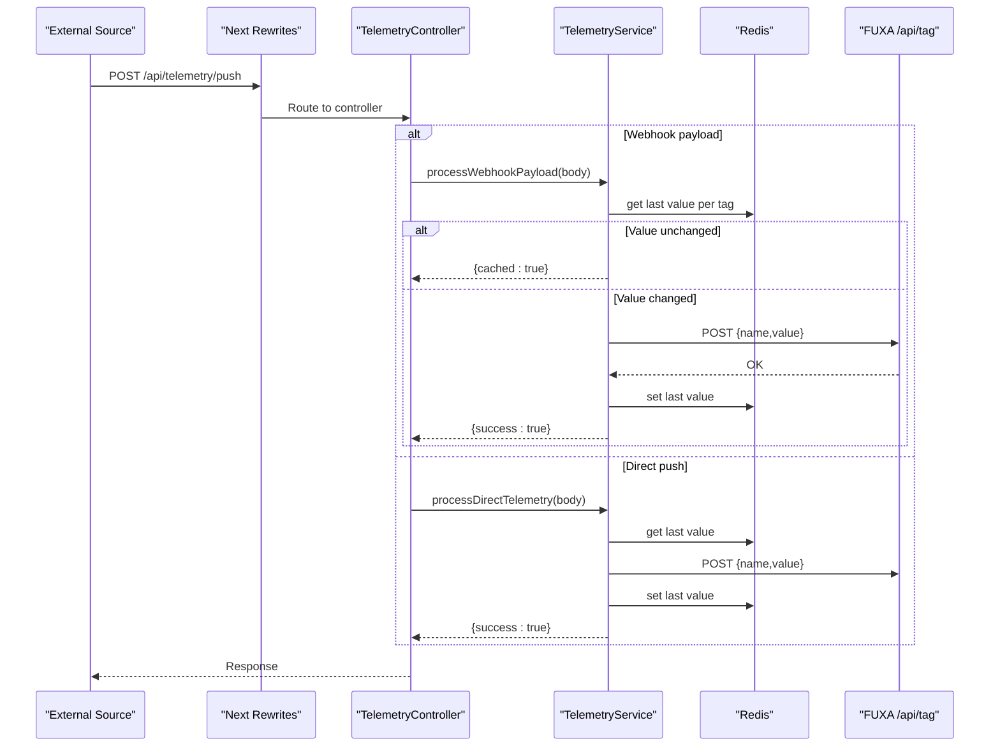
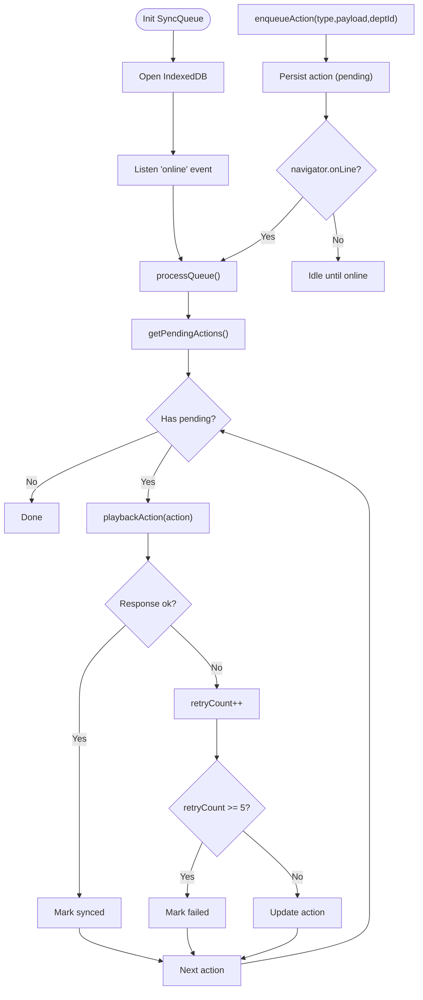
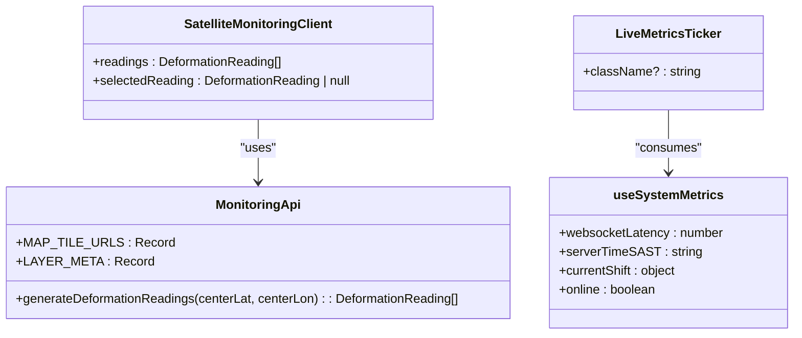
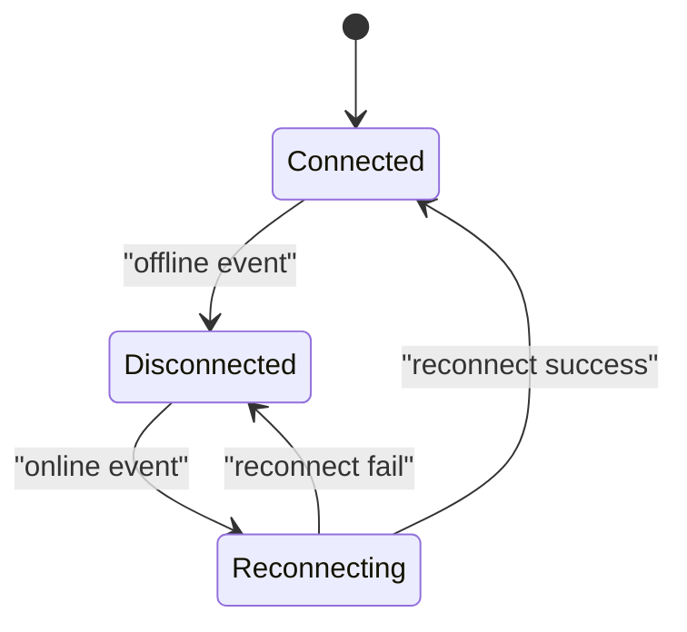
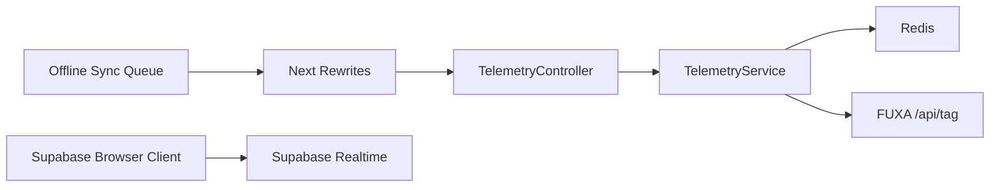

# Real-time Data Synchronization

<cite>
**Referenced Files in This Document**
- [client.ts](file://packages/supabase/src/client.ts)
- [how-does-auth-work.md](file://wiki/queries/how-does-auth-work.md)
- [how-to-fetch-data.md](file://wiki/queries/how-to-fetch-data.md)
- [telemetry.controller.ts](file://apps/api/src/telemetry/telemetry.controller.ts)
- [telemetry.service.ts](file://apps/api/src/telemetry/telemetry.service.ts)
- [next.config.mjs](file://apps/portal/next.config.mjs)
- [nginx.conf](file://config/nginx.conf)
- [sync-queue.ts](file://apps/portal/lib/sync/sync-queue.ts)
- [OfflineBanner.tsx](file://apps/portal/components/OfflineBanner.tsx)
- [useSystemMetrics.ts](file://apps/portal/hooks/useSystemMetrics.ts)
- [LiveMetricsTicker.tsx](file://apps/portal/components/system/LiveMetricsTicker.tsx)
- [SatelliteMonitoringClient.tsx](file://apps/portal/components/monitoring/SatelliteMonitoringClient.tsx)
- [monitoring-api.ts](file://apps/portal/lib/monitoring-api.ts)
</cite>

## Table of Contents

1. [Introduction](#introduction)
2. [Project Structure](#project-structure)
3. [Core Components](#core-components)
4. [Architecture Overview](#architecture-overview)
5. [Detailed Component Analysis](#detailed-component-analysis)
6. [Dependency Analysis](#dependency-analysis)
7. [Performance Considerations](#performance-considerations)
8. [Troubleshooting Guide](#troubleshooting-guide)
9. [Conclusion](#conclusion)

## Introduction

This document explains real-time data synchronization patterns across the application, focusing on:

- Supabase channels for live database updates via WebSocket
- Telemetry ingestion endpoints and processing pipeline
- Live monitoring components and dashboards
- Connection lifecycle management, reconnection strategies, and offline support
- Examples for real-time dashboard updates, satellite monitoring streaming, and performance optimization for high-frequency updates

The system combines client-side subscriptions to Supabase, server-side telemetry ingestion with caching, and a browser-native offline queue with replay to ensure resilient, low-latency user experiences.

## Project Structure

Real-time features span multiple layers:

- Client-side Supabase browser client for live subscriptions
- API layer endpoints for telemetry ingestion and playback
- Offline-first sync queue using IndexedDB
- Monitoring UI components that render live metrics and satellite data

**Diagram sources**

- [client.ts:1-41](file://packages/supabase/src/client.ts#L1-L41)
- [telemetry.controller.ts:1-36](file://apps/api/src/telemetry/telemetry.controller.ts#L1-L36)
- [telemetry.service.ts:1-195](file://apps/api/src/telemetry/telemetry.service.ts#L1-L195)
- [next.config.mjs:59-77](file://apps/portal/next.config.mjs#L59-L77)
- [sync-queue.ts:1-229](file://apps/portal/lib/sync/sync-queue.ts#L1-L229)

**Section sources**

- [client.ts:1-41](file://packages/supabase/src/client.ts#L1-L41)
- [next.config.mjs:59-77](file://apps/portal/next.config.mjs#L59-L77)
- [nginx.conf:137-190](file://config/nginx.conf#L137-L190)

## Core Components

- Supabase Browser Client: Creates a browser client configured for cookie-based session persistence and environment-aware URL resolution. Used by components to subscribe to real-time database changes.
- Telemetry Ingestion Endpoints: Accept webhook payloads from Supabase Database Webhooks or direct tag updates; apply multi-level caching and forward to FUXA SCADA.
- Offline Sync Queue: A browser-native queue persisted in IndexedDB that records mutations and replays them when online, ensuring eventual consistency.
- Monitoring UI: Displays live metrics, network status, and satellite deformation readings; integrates with map layers and alert summaries.

**Section sources**

- [client.ts:1-41](file://packages/supabase/src/client.ts#L1-L41)
- [telemetry.controller.ts:1-36](file://apps/api/src/telemetry/telemetry.controller.ts#L1-L36)
- [telemetry.service.ts:1-195](file://apps/api/src/telemetry/telemetry.service.ts#L1-L195)
- [sync-queue.ts:1-229](file://apps/portal/lib/sync/sync-queue.ts#L1-L229)
- [SatelliteMonitoringClient.tsx:1-83](file://apps/portal/components/monitoring/SatelliteMonitoringClient.tsx#L1-L83)

## Architecture Overview

End-to-end flows for real-time updates and telemetry ingestion:

**Diagram sources**

- [client.ts:1-41](file://packages/supabase/src/client.ts#L1-L41)
- [how-does-auth-work.md:73-122](file://wiki/queries/how-does-auth-work.md#L73-L122)
- [how-to-fetch-data.md:144-199](file://wiki/queries/how-to-fetch-data.md#L144-L199)

## Detailed Component Analysis

### Supabase Channels and Real-time Subscriptions

- The browser client is created with cookie-based auth storage and dynamic URL normalization for local vs production hosts.
- Components subscribe to specific tables with filters and handle INSERT/UPDATE/DELETE events to update UI state reactively.
- Lifecycle: subscribe on mount, unsubscribe on unmount to avoid leaks.

**Diagram sources**

- [client.ts:1-41](file://packages/supabase/src/client.ts#L1-L41)
- [how-does-auth-work.md:73-122](file://wiki/queries/how-does-auth-work.md#L73-L122)
- [how-to-fetch-data.md:144-199](file://wiki/queries/how-to-fetch-data.md#L144-L199)

**Section sources**

- [client.ts:1-41](file://packages/supabase/src/client.ts#L1-L41)
- [how-does-auth-work.md:73-122](file://wiki/queries/how-does-auth-work.md#L73-L122)
- [how-to-fetch-data.md:144-199](file://wiki/queries/how-to-fetch-data.md#L144-L199)

### Telemetry Ingestion Pipeline

- Endpoints accept two forms:
  - Supabase Database Webhook payload for machine_telemetry table
  - Direct single-tag push with name/value validation
- Processing applies L1 in-process cache and L2 Redis cache to deduplicate identical values before calling FUXA SCADA.
- Rust plugin fallback computes wear/probability if native binary is present.

**Diagram sources**

- [telemetry.controller.ts:1-36](file://apps/api/src/telemetry/telemetry.controller.ts#L1-L36)
- [telemetry.service.ts:1-195](file://apps/api/src/telemetry/telemetry.service.ts#L1-L195)
- [next.config.mjs:59-77](file://apps/portal/next.config.mjs#L59-L77)
- [nginx.conf:167-175](file://config/nginx.conf#L167-L175)

**Section sources**

- [telemetry.controller.ts:1-36](file://apps/api/src/telemetry/telemetry.controller.ts#L1-L36)
- [telemetry.service.ts:1-195](file://apps/api/src/telemetry/telemetry.service.ts#L1-L195)
- [next.config.mjs:59-77](file://apps/portal/next.config.mjs#L59-L77)
- [nginx.conf:167-175](file://config/nginx.conf#L167-L175)

### Offline Support and Replay Engine

- The offline queue persists actions in IndexedDB with idempotency keys and retry counters.
- On online events, it processes pending actions by replaying them to a backend playback endpoint.
- Failed attempts increment retryCount and mark as failed after threshold.

**Diagram sources**

- [sync-queue.ts:1-229](file://apps/portal/lib/sync/sync-queue.ts#L1-L229)

**Section sources**

- [sync-queue.ts:1-229](file://apps/portal/lib/sync/sync-queue.ts#L1-L229)

### Live Monitoring Components

- SatelliteMonitoringClient composes a map view and an alert summary panel, driven by deformation readings generated from monitoring utilities.
- LiveMetricsTicker displays connection health, simulated websocket latency, server time, and shift info.
- useSystemMetrics tracks online/offline status, server time, and simulated latency.

**Diagram sources**

- [SatelliteMonitoringClient.tsx:1-83](file://apps/portal/components/monitoring/SatelliteMonitoringClient.tsx#L1-L83)
- [useSystemMetrics.ts:1-107](file://apps/portal/hooks/useSystemMetrics.ts#L1-L107)
- [monitoring-api.ts:1-398](file://apps/portal/lib/monitoring-api.ts#L1-L398)

**Section sources**

- [SatelliteMonitoringClient.tsx:1-83](file://apps/portal/components/monitoring/SatelliteMonitoringClient.tsx#L1-L83)
- [useSystemMetrics.ts:1-107](file://apps/portal/hooks/useSystemMetrics.ts#L1-L107)
- [monitoring-api.ts:1-398](file://apps/portal/lib/monitoring-api.ts#L1-L398)

### Reconnection Strategies and Connection Lifecycle

- Supabase channels are subscribed/unsubscribed within component lifecycles to manage connections efficiently.
- Network availability is tracked globally; UI reflects online/offline states and can trigger queue replay.
- The offline banner provides feedback during offline periods and auto-dismisses after successful reconnection.

[No sources needed since this diagram shows conceptual workflow, not actual code structure]

**Section sources**

- [OfflineBanner.tsx:1-45](file://apps/portal/components/OfflineBanner.tsx#L1-L45)
- [useSystemMetrics.ts:1-107](file://apps/portal/hooks/useSystemMetrics.ts#L1-L107)
- [LiveMetricsTicker.tsx:1-56](file://apps/portal/components/system/LiveMetricsTicker.tsx#L1-L56)

## Dependency Analysis

- Portal routes rewrite telemetry and sync paths to the API server, enabling unified routing through Nginx and Next.js.
- TelemetryService depends on Redis for last-value caching and external FUXA SCADA for tag updates.
- Supabase client configuration ensures correct host resolution and secure cookie-based sessions.

**Diagram sources**

- [next.config.mjs:59-77](file://apps/portal/next.config.mjs#L59-L77)
- [nginx.conf:167-175](file://config/nginx.conf#L167-L175)
- [telemetry.controller.ts:1-36](file://apps/api/src/telemetry/telemetry.controller.ts#L1-L36)
- [telemetry.service.ts:1-195](file://apps/api/src/telemetry/telemetry.service.ts#L1-L195)
- [client.ts:1-41](file://packages/supabase/src/client.ts#L1-L41)
- [sync-queue.ts:1-229](file://apps/portal/lib/sync/sync-queue.ts#L1-L229)

**Section sources**

- [next.config.mjs:59-77](file://apps/portal/next.config.mjs#L59-L77)
- [nginx.conf:167-175](file://config/nginx.conf#L167-L175)
- [telemetry.controller.ts:1-36](file://apps/api/src/telemetry/telemetry.controller.ts#L1-L36)
- [telemetry.service.ts:1-195](file://apps/api/src/telemetry/telemetry.service.ts#L1-L195)
- [client.ts:1-41](file://packages/supabase/src/client.ts#L1-L41)
- [sync-queue.ts:1-229](file://apps/portal/lib/sync/sync-queue.ts#L1-L229)

## Performance Considerations

- Deduplication at service level:
  - L1 in-process Map avoids redundant calls when values are identical within the process lifetime.
  - L2 Redis cache prevents cross-instance duplicate writes and reduces FUXA load.
- Client-side throttling:
  - Use throttled state updates to batch frequent UI updates and reduce render churn.
- Efficient subscriptions:
  - Filter Supabase channels by table and row-level conditions to minimize payload size.
- Streaming basemaps:
  - Use WMTS tile providers with appropriate zoom levels and caching headers to optimize map rendering.

[No sources needed since this section provides general guidance]

## Troubleshooting Guide

- Telemetry ingestion failures:
  - Check Redis connectivity and last-value cache behavior.
  - Validate FUXA endpoint reachability and authorization headers.
- Offline sync issues:
  - Inspect IndexedDB store for pending actions and retry counts.
  - Verify playback endpoint responses and idempotency handling.
- Supabase subscription problems:
  - Ensure proper channel cleanup on unmount.
  - Confirm environment variables for Supabase URL and anon key resolve correctly.

**Section sources**

- [telemetry.service.ts:1-195](file://apps/api/src/telemetry/telemetry.service.ts#L1-L195)
- [sync-queue.ts:1-229](file://apps/portal/lib/sync/sync-queue.ts#L1-L229)
- [client.ts:1-41](file://packages/supabase/src/client.ts#L1-L41)

## Conclusion

The system implements robust real-time synchronization through Supabase channels, resilient telemetry ingestion with multi-level caching, and an offline-first queue with replay. Monitoring components provide live insights into system health and satellite deformation data. Together, these patterns deliver responsive, reliable dashboards suitable for high-frequency operational data.
