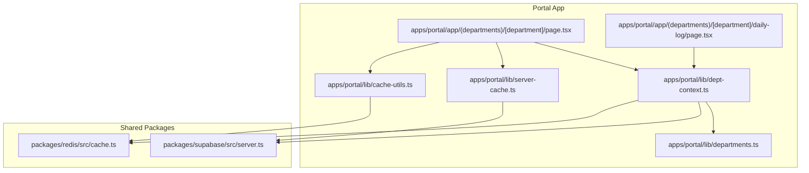
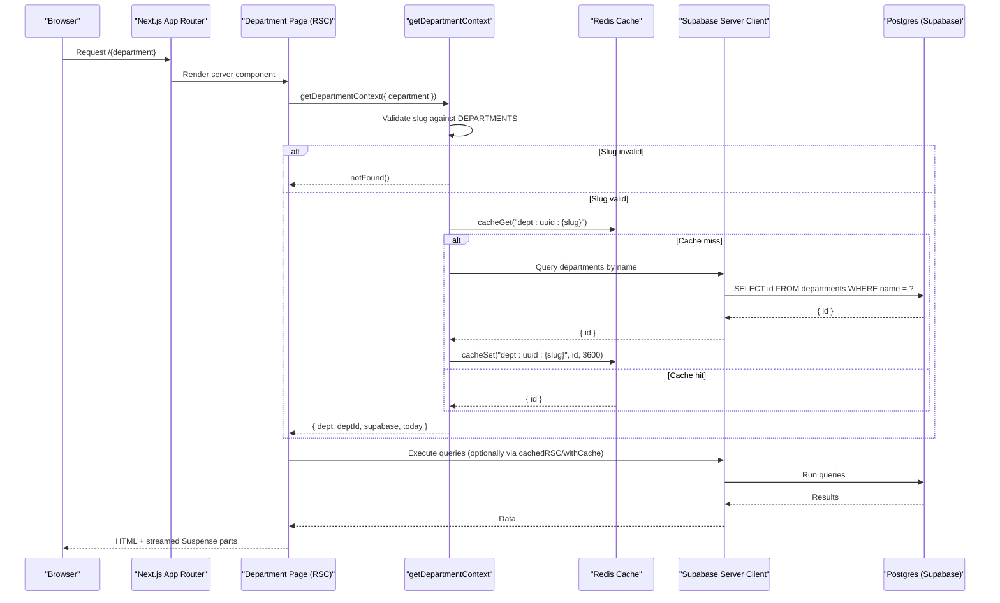
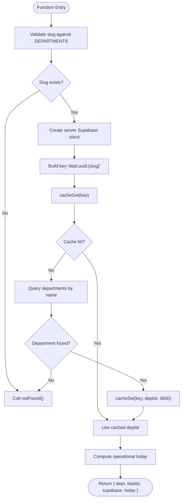
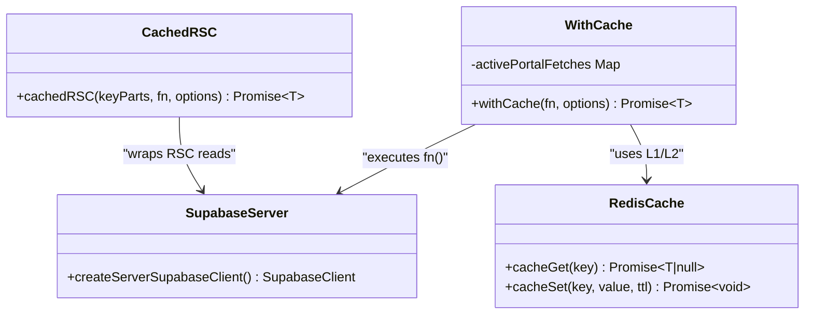
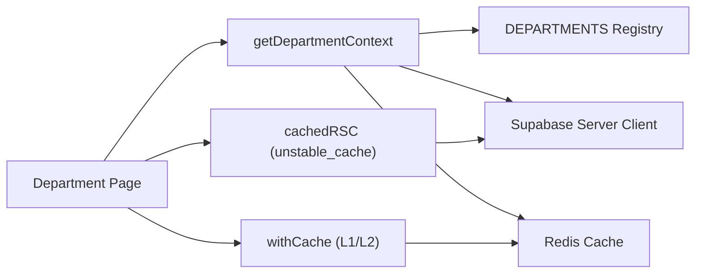

# Server-Side Data Fetching

<cite>
**Referenced Files in This Document**
- [page.tsx](file://apps/portal/app/(departments)/[department]/page.tsx)
- [daily-log/page.tsx](file://apps/portal/app/(departments)/[department]/daily-log/page.tsx)
- [dept-context.ts](file://apps/portal/lib/dept-context.ts)
- [server-cache.ts](file://apps/portal/lib/server-cache.ts)
- [cache-utils.ts](file://apps/portal/lib/cache-utils.ts)
- [departments.ts](file://apps/portal/lib/departments.ts)
- [server.ts](file://packages/supabase/src/server.ts)
- [cache.ts](file://packages/redis/src/cache.ts)
</cite>

## Table of Contents

1. [Introduction](#introduction)
2. [Project Structure](#project-structure)
3. [Core Components](#core-components)
4. [Architecture Overview](#architecture-overview)
5. [Detailed Component Analysis](#detailed-component-analysis)
6. [Dependency Analysis](#dependency-analysis)
7. [Performance Considerations](#performance-considerations)
8. [Troubleshooting Guide](#troubleshooting-guide)
9. [Conclusion](#conclusion)

## Introduction

This document explains server-side data fetching patterns used by the portal application built on Next.js App Router and React Server Components (RSC). It focuses on:

- How server components fetch data from Supabase
- The department context resolution process via getDepartmentContext
- Server-side caching strategies using Redis and Next.js unstable_cache
- Error handling with notFound() for invalid departments
- Best practices for database queries in server components, including parallelization and tag-based revalidation

## Project Structure

The relevant code is organized under apps/portal for the portal application and packages for shared libraries:

- apps/portal/app/(departments)/[department]/page.tsx — main department dashboard page demonstrating RSC data fetching
- apps/portal/app/(departments)/[department]/daily-log/page.tsx — example of parallel server-side queries
- apps/portal/lib/dept-context.ts — resolves department context, validates slug, caches UUID lookup
- apps/portal/lib/server-cache.ts — wrapper around Next.js unstable_cache for RSC reads
- apps/portal/lib/cache-utils.ts — portal-specific cache wrapper with L1/L2 fallbacks and dedupe
- packages/supabase/src/server.ts — server-side Supabase client creation
- packages/redis/src/cache.ts — Redis cache operations with L1 (in-memory) and L2 (Redis) layers

**Diagram sources**

- [page.tsx](<file://apps/portal/app/(departments)/[department]/page.tsx#L1-L433>)
- [daily-log/page.tsx](<file://apps/portal/app/(departments)/[department]/daily-log/page.tsx#L1-L148>)
- [dept-context.ts:1-68](file://apps/portal/lib/dept-context.ts#L1-L68)
- [server-cache.ts:1-27](file://apps/portal/lib/server-cache.ts#L1-L27)
- [cache-utils.ts:1-79](file://apps/portal/lib/cache-utils.ts#L1-L79)
- [departments.ts:1-310](file://apps/portal/lib/departments.ts#L1-L310)
- [server.ts:49-99](file://packages/supabase/src/server.ts#L49-L99)
- [cache.ts:58-99](file://packages/redis/src/cache.ts#L58-L99)

**Section sources**

- [page.tsx](<file://apps/portal/app/(departments)/[department]/page.tsx#L1-L433>)
- [daily-log/page.tsx](<file://apps/portal/app/(departments)/[department]/daily-log/page.tsx#L1-L148>)
- [dept-context.ts:1-68](file://apps/portal/lib/dept-context.ts#L1-L68)
- [server-cache.ts:1-27](file://apps/portal/lib/server-cache.ts#L1-L27)
- [cache-utils.ts:1-79](file://apps/portal/lib/cache-utils.ts#L1-L79)
- [departments.ts:1-310](file://apps/portal/lib/departments.ts#L1-L310)
- [server.ts:49-99](file://packages/supabase/src/server.ts#L49-L99)
- [cache.ts:58-99](file://packages/redis/src/cache.ts#L58-L99)

## Core Components

- Department Context Resolver: Validates the department slug against a static registry, resolves the UUID from Supabase, caches it in Redis, and returns a ready-to-use Supabase client plus operational date.
- Server Cache Wrapper: Wraps Next.js unstable_cache to enable tag-based revalidation and TTL control for RSC reads.
- Portal Cache Utility: Provides L1/L2 caching with stats, error handling, and request deduplication for expensive queries.
- Supabase Server Client: Creates a server-side Supabase client bound to the current request cookies and environment variables.

Key responsibilities:

- Route-level pages orchestrate data fetching using RSC and Suspense boundaries.
- getDepartmentContext centralizes department validation and ID resolution.
- cachedRSC and withCache provide layered caching strategies.

**Section sources**

- [dept-context.ts:1-68](file://apps/portal/lib/dept-context.ts#L1-L68)
- [server-cache.ts:1-27](file://apps/portal/lib/server-cache.ts#L1-L27)
- [cache-utils.ts:1-79](file://apps/portal/lib/cache-utils.ts#L1-L79)
- [server.ts:49-99](file://packages/supabase/src/server.ts#L49-L99)

## Architecture Overview

The data flow begins at the Next.js App Router route handler (a server component), which calls getDepartmentContext to validate the department and resolve its UUID. The function uses Redis to cache UUID lookups and returns a Supabase client configured for server-side requests. Pages then perform direct Supabase queries, optionally wrapped in cachedRSC and withCache for performance and revalidation.

**Diagram sources**

- [page.tsx](<file://apps/portal/app/(departments)/[department]/page.tsx#L98-L116>)
- [dept-context.ts:16-52](file://apps/portal/lib/dept-context.ts#L16-L52)
- [server.ts:49-80](file://packages/supabase/src/server.ts#L49-L80)
- [cache.ts:80-99](file://packages/redis/src/cache.ts#L80-L99)

## Detailed Component Analysis

### getDepartmentContext Flow

Responsibilities:

- Validate the department slug against the static DEPARTMENTS registry.
- Create a server-side Supabase client.
- Resolve the department UUID using Redis cache first; if missing, query Supabase and cache the result.
- Return a consistent context object including the resolved department metadata, UUID, Supabase client, and operational date.

Error handling:

- If the slug is not found in the registry or the database lookup fails, call notFound() to render the 404 page.

Caching:

- Uses Redis to cache the mapping from department slug to UUID for one hour.

Integration with Next.js:

- Wrapped with React’s cache to memoize results within a single request.

**Diagram sources**

- [dept-context.ts:16-52](file://apps/portal/lib/dept-context.ts#L16-L52)
- [departments.ts:23-168](file://apps/portal/lib/departments.ts#L23-L168)
- [server.ts:49-80](file://packages/supabase/src/server.ts#L49-L80)
- [cache.ts:80-99](file://packages/redis/src/cache.ts#L80-L99)

**Section sources**

- [dept-context.ts:1-68](file://apps/portal/lib/dept-context.ts#L1-L68)
- [departments.ts:1-310](file://apps/portal/lib/departments.ts#L1-L310)
- [server.ts:49-99](file://packages/supabase/src/server.ts#L49-L99)
- [cache.ts:58-99](file://packages/redis/src/cache.ts#L58-L99)

### Server Component Data Fetching Patterns

Patterns demonstrated in the department dashboard and daily log pages:

- Early routing based on department type to skip unnecessary queries.
- Parallel queries using Promise.all for independent datasets.
- Select only needed fields and use head:true counts where appropriate.
- Wrap expensive or frequently accessed queries with cachedRSC and withCache.
- Use Suspense boundaries to stream UI while heavy data loads.

Examples:

- Dashboard page orchestrates context resolution and renders specialized dashboards for satellite and safety departments without extra queries.
- Control room summary grid uses cachedRSC and withCache with tags for table-level revalidation.
- Daily log page performs parallel queries for reference data and incidents.

Best practices:

- Prefer server components for initial data loading.
- Keep queries narrow and targeted.
- Use tags to invalidate related data efficiently.
- Avoid redundant queries by leveraging React’s cache and request deduplication.

**Section sources**

- [page.tsx](<file://apps/portal/app/(departments)/[department]/page.tsx#L98-L116>)
- [page.tsx](<file://apps/portal/app/(departments)/[department]/page.tsx#L254-L343>)
- [daily-log/page.tsx](<file://apps/portal/app/(departments)/[department]/daily-log/page.tsx#L1-L148>)
- [server-cache.ts:1-27](file://apps/portal/lib/server-cache.ts#L1-L27)
- [cache-utils.ts:1-79](file://apps/portal/lib/cache-utils.ts#L1-L79)

### Server-Side Caching Strategies

Two complementary strategies are used:

- Next.js unstable_cache via cachedRSC:
  - Integrates with Next.js Data Cache.
  - Supports revalidate TTL and tags-based revalidation.
  - Ideal for RSC reads that should be globally deduplicated per key.

- Portal withCache utility:
  - Builds keys and looks up TTL from a registry.
  - Checks L1 (in-memory) then L2 (Redis).
  - On cache miss, executes fn(), writes to L2 with tags, and deduplicates concurrent requests.
  - Re-throws DatabaseError immediately (not cached).
  - Graceful degradation when Redis is unreachable by retrying L1 and returning stale values if available.

**Diagram sources**

- [server-cache.ts:1-27](file://apps/portal/lib/server-cache.ts#L1-L27)
- [cache-utils.ts:1-79](file://apps/portal/lib/cache-utils.ts#L1-L79)
- [cache.ts:58-99](file://packages/redis/src/cache.ts#L58-L99)
- [server.ts:49-80](file://packages/supabase/src/server.ts#L49-L80)

**Section sources**

- [server-cache.ts:1-27](file://apps/portal/lib/server-cache.ts#L1-L27)
- [cache-utils.ts:1-79](file://apps/portal/lib/cache-utils.ts#L1-L79)
- [cache.ts:58-99](file://packages/redis/src/cache.ts#L58-L99)

### Integration with Next.js App Router

- Route handlers are async server components that accept params as a Promise and await them.
- They call getDepartmentContext early to validate and prepare context.
- They compose UI with Suspense boundaries for streaming partial content.
- They leverage dynamic imports for heavy components to reduce initial payload.

**Section sources**

- [page.tsx](<file://apps/portal/app/(departments)/[department]/page.tsx#L1-L433>)

## Dependency Analysis

High-level dependencies between modules:

- Department pages depend on getDepartmentContext for validation and UUID resolution.
- getDepartmentContext depends on DEPARTMENTS registry, Supabase server client, and Redis cache.
- Server cache utilities depend on Next.js unstable_cache and Redis cache.
- Supabase server client depends on request cookies and environment configuration.

**Diagram sources**

- [page.tsx](<file://apps/portal/app/(departments)/[department]/page.tsx#L1-L433>)
- [dept-context.ts:1-68](file://apps/portal/lib/dept-context.ts#L1-L68)
- [server-cache.ts:1-27](file://apps/portal/lib/server-cache.ts#L1-L27)
- [cache-utils.ts:1-79](file://apps/portal/lib/cache-utils.ts#L1-L79)
- [server.ts:49-99](file://packages/supabase/src/server.ts#L49-L99)
- [cache.ts:58-99](file://packages/redis/src/cache.ts#L58-L99)

**Section sources**

- [page.tsx](<file://apps/portal/app/(departments)/[department]/page.tsx#L1-L433>)
- [dept-context.ts:1-68](file://apps/portal/lib/dept-context.ts#L1-L68)
- [server-cache.ts:1-27](file://apps/portal/lib/server-cache.ts#L1-L27)
- [cache-utils.ts:1-79](file://apps/portal/lib/cache-utils.ts#L1-L79)
- [server.ts:49-99](file://packages/supabase/src/server.ts#L49-L99)
- [cache.ts:58-99](file://packages/redis/src/cache.ts#L58-L99)

## Performance Considerations

- Prefer server components for initial data fetching to eliminate client-side network overhead.
- Use parallel queries (Promise.all) for independent datasets to minimize total latency.
- Narrow select projections and use head:true for counts to reduce payload size.
- Apply tag-based revalidation to keep related data fresh without full-page reloads.
- Leverage L1/L2 caching to avoid repeated database hits and reduce Redis load.
- Deduplicate concurrent requests for the same key to prevent thundering herds.
- Stream UI with Suspense to improve perceived performance.

## Troubleshooting Guide

Common issues and resolutions:

- Invalid department slug:
  - Symptom: 404 page rendered.
  - Cause: Slug not found in DEPARTMENTS registry or not present in the database.
  - Resolution: Ensure the slug matches a registered department and exists in the departments table.

- Redis unavailability:
  - Symptom: Queries bypass cache and run directly against the database.
  - Behavior: withCache falls back to executing fn() and may return stale L1 values if available.
  - Resolution: Monitor Redis health and ensure graceful degradation paths are tested.

- Refresh token errors on server:
  - Symptom: AuthApiError during getUser.
  - Behavior: getUserSafely returns null instead of crashing.
  - Resolution: Handle unauthenticated flows gracefully in server components.

- Stale data after updates:
  - Symptom: UI shows outdated information.
  - Cause: Cache TTL not expired or tags not invalidated.
  - Resolution: Use revalidateTag to invalidate specific tables or resources after mutations.

**Section sources**

- [dept-context.ts:16-52](file://apps/portal/lib/dept-context.ts#L16-L52)
- [cache-utils.ts:30-78](file://apps/portal/lib/cache-utils.ts#L30-L78)
- [server.ts:88-99](file://packages/supabase/src/server.ts#L88-L99)

## Conclusion

The portal leverages React Server Components to fetch data directly from Supabase with robust caching and error handling. The getDepartmentContext function provides a centralized, cache-backed mechanism to validate departments and resolve IDs. Layered caching via Next.js unstable_cache and Redis ensures efficient data delivery, while Suspense and dynamic imports optimize user experience. Following these patterns yields scalable, maintainable server-side data fetching aligned with Next.js App Router best practices.
