# Deployment & Infrastructure Architecture

<cite>
**Referenced Files in This Document**
- [docker-compose.portal.yml](file://docker-compose.portal.yml)
- [docker-compose.production.yml](file://docker-compose.production.yml)
- [docker-compose.monitoring.yml](file://docker-compose.monitoring.yml)
- [config/nginx.conf](file://config/nginx.conf)
- [vercel.json](file://vercel.json)
- [infra/k8s/cache-agent.yaml](file://infra/k8s/cache-agent.yaml)
- [config/prometheus.yml](file://config/prometheus.yml)
- [infra/observability/grafana-dashboards/cache-dashboard.json](file://infra/observability/grafana-dashboards/cache-dashboard.json)
- [infra/observability/prometheus-rules/cache-alerts.yaml](file://infra/observability/prometheus-rules/cache-alerts.yaml)
- [scripts/deploy.sh](file://scripts/deploy.sh)
- [scripts/setup-production-environment.sh](file://scripts/setup-production-environment.sh)
- [ci/workflows/policy-evaluation.yml](file://ci/workflows/policy-evaluation.yml)
- [ci/scripts/rollback.sh](file://ci/scripts/rollback.sh)
- [apps/portal/lib/env.ts](file://apps/portal/lib/env.ts)
- [config/generate-certs.sh](file://config/generate-certs.sh)
</cite>

## Table of Contents

1. Introduction
2. Project Structure
3. Core Components
4. Architecture Overview
5. Detailed Component Analysis
6. Dependency Analysis
7. Performance Considerations
8. Troubleshooting Guide
9. Conclusion
10. Appendices

## Introduction

This document describes the deployment and infrastructure architecture for multi-environment operations, covering:

- Local development with Docker Compose
- Production hosting on Vercel for the Next.js portal
- Kubernetes configuration for cache agents
- Nginx reverse proxy and SSL termination
- Monitoring stack with Prometheus and Grafana
- CI/CD pipeline, environment variable management, SSL handling, scaling, disaster recovery, backups, and alerting

## Project Structure

The repository provides composable Docker Compose files for different environments, a production-grade Nginx reverse proxy configuration, Kubernetes manifests for cache agents, and observability assets (Prometheus scrape config, Grafana dashboards, and alert rules). A comprehensive deployment script orchestrates local/staging/production workflows, while a separate setup script automates production host preparation.

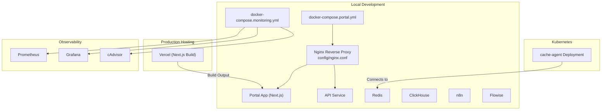

**Diagram sources**

- [docker-compose.portal.yml:1-56](file://docker-compose.portal.yml#L1-L56)
- [docker-compose.monitoring.yml:1-54](file://docker-compose.monitoring.yml#L1-L54)
- [config/nginx.conf:1-218](file://config/nginx.conf#L1-L218)
- [vercel.json:1-7](file://vercel.json#L1-L7)
- [infra/k8s/cache-agent.yaml:1-32](file://infra/k8s/cache-agent.yaml#L1-L32)

**Section sources**

- [docker-compose.portal.yml:1-56](file://docker-compose.portal.yml#L1-L56)
- [docker-compose.production.yml:1-106](file://docker-compose.production.yml#L1-L106)
- [docker-compose.monitoring.yml:1-54](file://docker-compose.monitoring.yml#L1-L54)
- [config/nginx.conf:1-218](file://config/nginx.conf#L1-L218)
- [vercel.json:1-7](file://vercel.json#L1-L7)
- [infra/k8s/cache-agent.yaml:1-32](file://infra/k8s/cache-agent.yaml#L1-L32)

## Core Components

- Docker Compose stacks:
  - Portal stack: builds and runs the Next.js portal and API services behind Nginx with health checks and persistent volumes.
  - Production overrides: adds restart policies, resource limits, health checks, and secure defaults for tools like n8n, Flowise, Redis, and ClickHouse.
  - Monitoring stack: Prometheus, Grafana, and cAdvisor with dedicated network and data volumes.
- Nginx reverse proxy:
  - TLS termination, security headers, upstream routing to portal and API, WebSocket support, static asset caching, and a /healthz probe.
- Kubernetes cache agent:
  - Deployment manifest defining replicas, container image, ports, environment variables, and resource requests/limits.
- Observability:
  - Prometheus scrape targets include internal services and self-monitoring.
  - Grafana dashboard JSON for cache telemetry.
  - Alert rules for cache miss rate and Redis shard availability.
- CI/CD:
  - GitHub Actions workflow for policy evaluation gate.
  - Rollback helper script for Kubernetes rollouts.
- Environment management:
  - Runtime validation and fail-fast behavior for required variables in production.
  - Certificate generation helper for local dev.

**Section sources**

- [docker-compose.portal.yml:1-56](file://docker-compose.portal.yml#L1-L56)
- [docker-compose.production.yml:1-106](file://docker-compose.production.yml#L1-L106)
- [docker-compose.monitoring.yml:1-54](file://docker-compose.monitoring.yml#L1-L54)
- [config/nginx.conf:1-218](file://config/nginx.conf#L1-L218)
- [infra/k8s/cache-agent.yaml:1-32](file://infra/k8s/cache-agent.yaml#L1-L32)
- [config/prometheus.yml:1-27](file://config/prometheus.yml#L1-L27)
- [infra/observability/grafana-dashboards/cache-dashboard.json:1-22](file://infra/observability/grafana-dashboards/cache-dashboard.json#L1-L22)
- [infra/observability/prometheus-rules/cache-alerts.yaml:1-21](file://infra/observability/prometheus-rules/cache-alerts.yaml#L1-L21)
- [ci/workflows/policy-evaluation.yml:1-17](file://ci/workflows/policy-evaluation.yml#L1-L17)
- [ci/scripts/rollback.sh:1-9](file://ci/scripts/rollback.sh#L1-L9)
- [apps/portal/lib/env.ts:157-225](file://apps/portal/lib/env.ts#L157-L225)
- [config/generate-certs.sh:1-5](file://config/generate-certs.sh#L1-L5)

## Architecture Overview

The system supports multiple deployment targets:

- Local development: Docker Compose brings up portal, API, Nginx, Redis, ClickHouse, n8n, Flowise, Prometheus, Grafana, and cAdvisor.
- Production hosting: The Next.js portal is built and served via Vercel; backend APIs and tooling can be hosted separately or integrated as needed.
- Kubernetes: Cache agents run as a replicated Deployment connecting to a Redis cluster.
- Observability: Prometheus scrapes metrics from services; Grafana visualizes dashboards and evaluates alert rules.

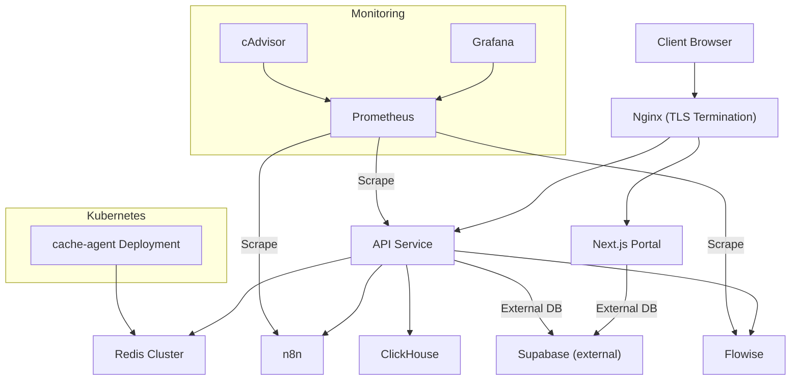

**Diagram sources**

- [config/nginx.conf:1-218](file://config/nginx.conf#L1-L218)
- [docker-compose.portal.yml:1-56](file://docker-compose.portal.yml#L1-L56)
- [docker-compose.production.yml:1-106](file://docker-compose.production.yml#L1-L106)
- [docker-compose.monitoring.yml:1-54](file://docker-compose.monitoring.yml#L1-L54)
- [config/prometheus.yml:1-27](file://config/prometheus.yml#L1-L27)
- [infra/k8s/cache-agent.yaml:1-32](file://infra/k8s/cache-agent.yaml#L1-L32)

## Detailed Component Analysis

### Multi-Environment Strategy: Docker Compose (Local) and Vercel (Production)

- Local development:
  - docker-compose.portal.yml defines the portal and API services with health checks and env_file references.
  - docker-compose.production.yml overlays production-safe settings for tools (restart policies, resource limits, health checks, logging rotation).
  - docker-compose.monitoring.yml provisions Prometheus, Grafana, and cAdvisor with isolated networking and persistent volumes.
- Production hosting:
  - vercel.json configures the Next.js build command, output directory, and framework detection for Vercel.
  - The deployment script supports local/staging/production modes, including systemd-based service management for server-side deployments.

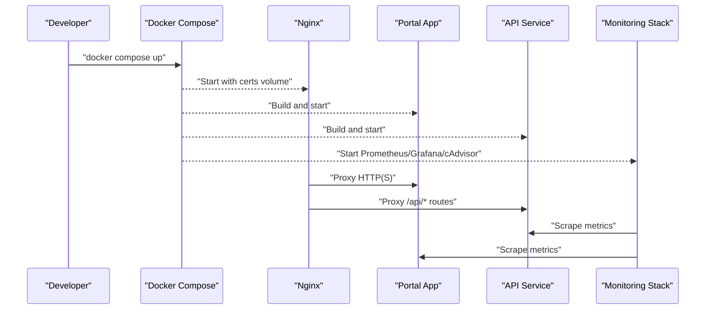

**Diagram sources**

- [docker-compose.portal.yml:1-56](file://docker-compose.portal.yml#L1-L56)
- [docker-compose.production.yml:1-106](file://docker-compose.production.yml#L1-L106)
- [docker-compose.monitoring.yml:1-54](file://docker-compose.monitoring.yml#L1-L54)
- [config/nginx.conf:1-218](file://config/nginx.conf#L1-L218)
- [vercel.json:1-7](file://vercel.json#L1-L7)

**Section sources**

- [docker-compose.portal.yml:1-56](file://docker-compose.portal.yml#L1-L56)
- [docker-compose.production.yml:1-106](file://docker-compose.production.yml#L1-L106)
- [docker-compose.monitoring.yml:1-54](file://docker-compose.monitoring.yml#L1-L54)
- [vercel.json:1-7](file://vercel.json#L1-L7)
- [scripts/deploy.sh:1-1277](file://scripts/deploy.sh#L1-L1277)

### Kubernetes Configuration for Cache Agents

- The cache-agent Deployment specifies:
  - Replicas: 3
  - Container image: amca-cache-agent:latest
  - Port: 3008
  - Environment variable REDIS_URLS pointing to redis-cluster:6379
  - Resource requests/limits for CPU and memory
- This enables horizontal scaling and resilience for cache operations against a Redis cluster.

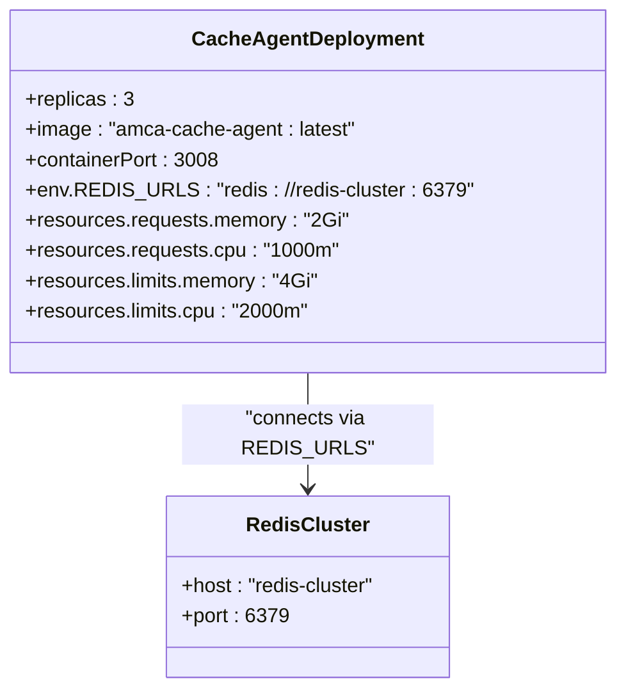

**Diagram sources**

- [infra/k8s/cache-agent.yaml:1-32](file://infra/k8s/cache-agent.yaml#L1-L32)

**Section sources**

- [infra/k8s/cache-agent.yaml:1-32](file://infra/k8s/cache-agent.yaml#L1-L32)

### Nginx Reverse Proxy Setup

- Features:
  - HTTP to HTTPS redirect
  - TLS termination with certificate paths mounted into the container
  - Security headers (HSTS, X-Frame-Options, etc.)
  - Upstreams for portal and api backends with keepalive connections
  - Health check endpoint (/healthz) proxied to the API live probe
  - Route mapping for migrated API endpoints to the NestJS API backend
  - WebSocket upgrade support for HMR
  - Static asset caching with immutable headers
- Certificates are expected at /etc/nginx/certs/fullchain.pem and privkey.pem.

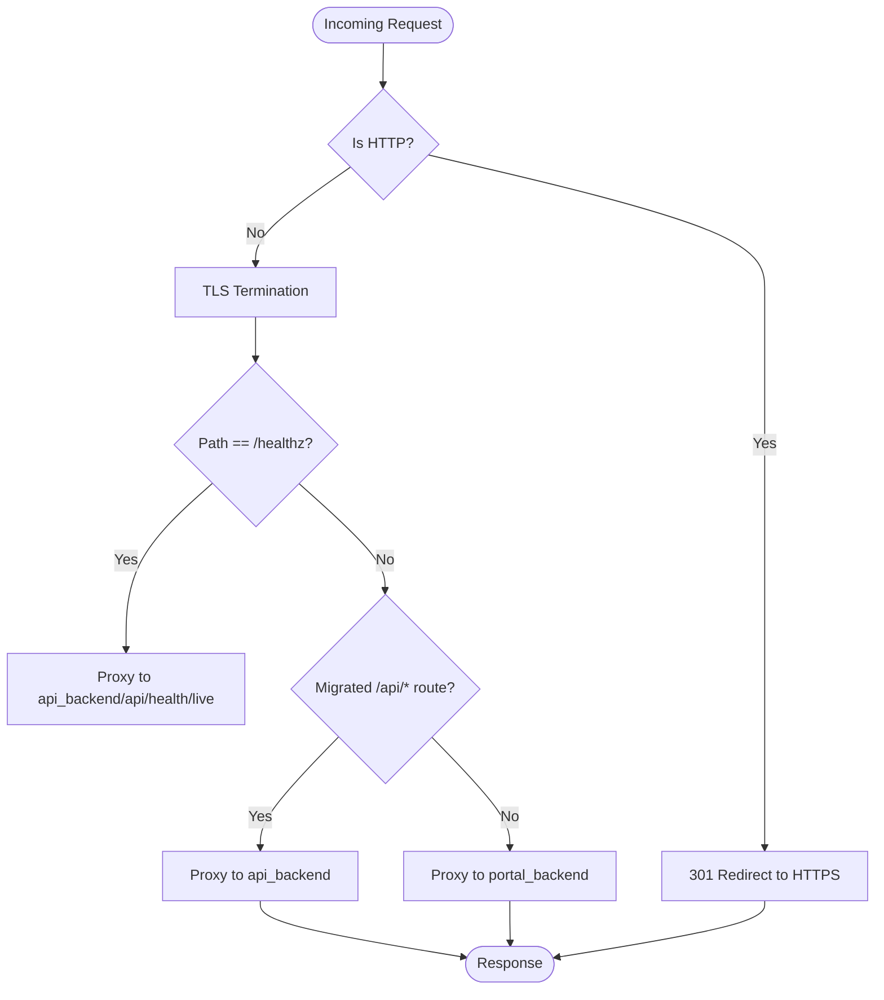

**Diagram sources**

- [config/nginx.conf:1-218](file://config/nginx.conf#L1-L218)

**Section sources**

- [config/nginx.conf:1-218](file://config/nginx.conf#L1-L218)

### Monitoring Infrastructure: Prometheus and Grafana

- Prometheus:
  - Scrape interval and evaluation interval configured globally
  - Jobs for kiro-agent, n8n, langfuse, and self-scraping
- Grafana:
  - Dashboard JSON for AMCA cache telemetry (hits vs misses, latency heatmap)
- Alert Rules:
  - CacheMissRateTooHigh: warns when cache miss rate exceeds 40% over 5 minutes
  - RedisShardDown: critical alert if a Redis shard is down

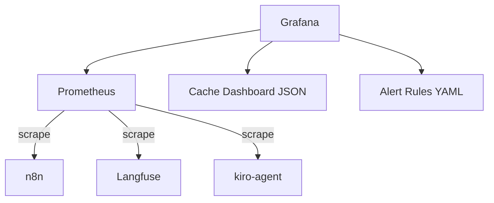

**Diagram sources**

- [config/prometheus.yml:1-27](file://config/prometheus.yml#L1-L27)
- [infra/observability/grafana-dashboards/cache-dashboard.json:1-22](file://infra/observability/grafana-dashboards/cache-dashboard.json#L1-L22)
- [infra/observability/prometheus-rules/cache-alerts.yaml:1-21](file://infra/observability/prometheus-rules/cache-alerts.yaml#L1-L21)

**Section sources**

- [config/prometheus.yml:1-27](file://config/prometheus.yml#L1-L27)
- [infra/observability/grafana-dashboards/cache-dashboard.json:1-22](file://infra/observability/grafana-dashboards/cache-dashboard.json#L1-L22)
- [infra/observability/prometheus-rules/cache-alerts.yaml:1-21](file://infra/observability/prometheus-rules/cache-alerts.yaml#L1-L21)

### CI/CD Pipeline

- Policy Evaluation Gate:
  - GitHub Actions workflow triggers on push to main branch
  - Executes policy checks (placeholder steps for circular tag dependencies and telemetry simulation)
- Rollback Helper:
  - Script issues Kubernetes rollout undo commands for cache-agent and policy-engine deployments

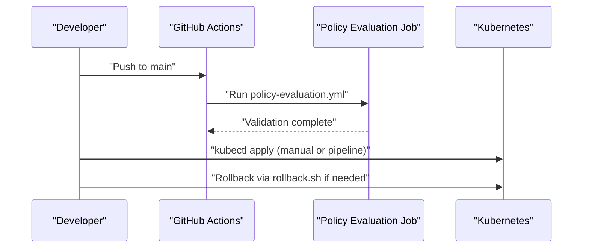

**Diagram sources**

- [ci/workflows/policy-evaluation.yml:1-17](file://ci/workflows/policy-evaluation.yml#L1-L17)
- [ci/scripts/rollback.sh:1-9](file://ci/scripts/rollback.sh#L1-L9)

**Section sources**

- [ci/workflows/policy-evaluation.yml:1-17](file://ci/workflows/policy-evaluation.yml#L1-L17)
- [ci/scripts/rollback.sh:1-9](file://ci/scripts/rollback.sh#L1-L9)

### Environment Variable Management

- Runtime validation:
  - The portal’s environment module parses and validates variables using a schema
  - In production, missing required variables cause a fatal error with details
  - Non-critical warnings are logged but do not block startup
- Deployment scripts:
  - Validate presence of .env files per mode (local/staging/production)
  - Enforce non-localhost URLs for production Supabase configuration
  - Provide guidance and safety checks for secrets

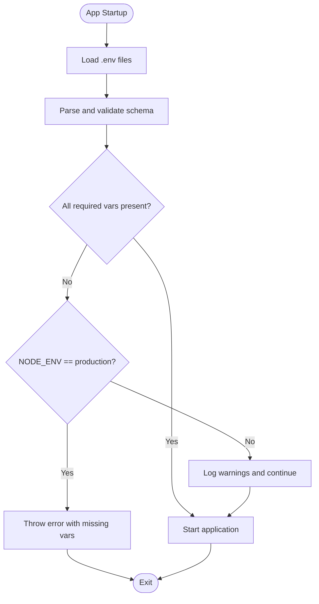

**Diagram sources**

- [apps/portal/lib/env.ts:157-225](file://apps/portal/lib/env.ts#L157-L225)
- [scripts/deploy.sh:380-431](file://scripts/deploy.sh#L380-L431)

**Section sources**

- [apps/portal/lib/env.ts:157-225](file://apps/portal/lib/env.ts#L157-L225)
- [scripts/deploy.sh:380-431](file://scripts/deploy.sh#L380-L431)

### SSL Certificate Handling

- Local development:
  - generate-certs.sh creates self-signed certificates (CN=localhost) for Nginx
  - docker-compose.portal.yml mounts ./certs into /etc/nginx/certs
- Production:
  - Replace self-signed certs with CA-signed certificates in the same mount path
  - Nginx configuration expects fullchain.pem and privkey.pem

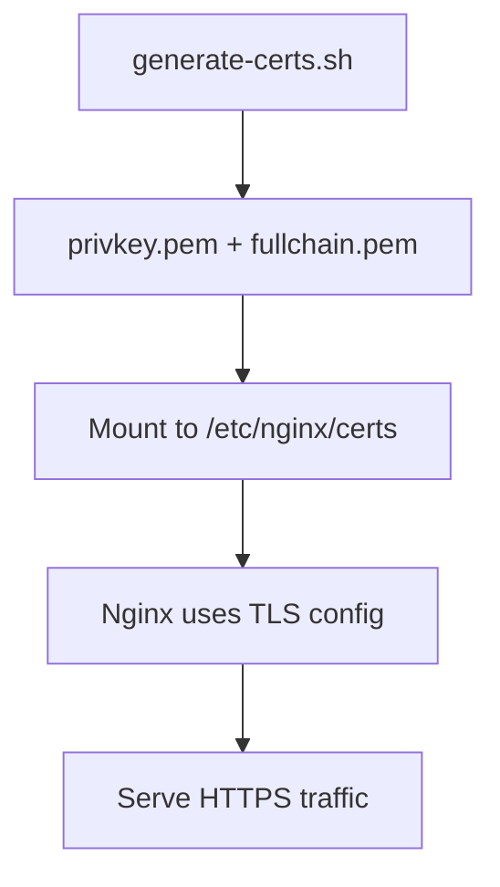

**Diagram sources**

- [config/generate-certs.sh:1-5](file://config/generate-certs.sh#L1-L5)
- [docker-compose.portal.yml:40-56](file://docker-compose.portal.yml#L40-L56)
- [config/nginx.conf:72-90](file://config/nginx.conf#L72-L90)

**Section sources**

- [config/generate-certs.sh:1-5](file://config/generate-certs.sh#L1-L5)
- [docker-compose.portal.yml:40-56](file://docker-compose.portal.yml#L40-L56)
- [config/nginx.conf:72-90](file://config/nginx.conf#L72-L90)

### Scaling Considerations

- Horizontal scaling:
  - Kubernetes cache-agent Deployment sets replicas to 3 for high availability
  - Nginx upstreams use keepalive connections to improve performance
- Resource constraints:
  - Docker Compose production overrides define CPU/memory limits and reservations for services
  - Kubernetes resources specify requests and limits for cache agents
- Observability:
  - Prometheus scraping intervals set to 15s for timely metric collection
  - Grafana dashboards and alert rules provide visibility into cache performance and cluster health

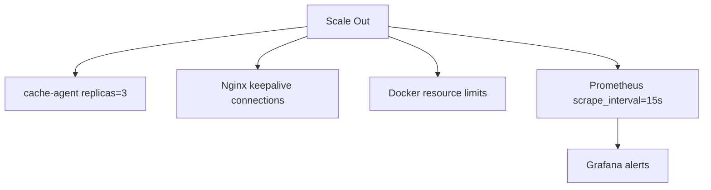

**Diagram sources**

- [infra/k8s/cache-agent.yaml:1-32](file://infra/k8s/cache-agent.yaml#L1-L32)
- [config/nginx.conf:42-51](file://config/nginx.conf#L42-L51)
- [docker-compose.production.yml:21-33](file://docker-compose.production.yml#L21-L33)
- [config/prometheus.yml:1-4](file://config/prometheus.yml#L1-L4)

**Section sources**

- [infra/k8s/cache-agent.yaml:1-32](file://infra/k8s/cache-agent.yaml#L1-L32)
- [config/nginx.conf:42-51](file://config/nginx.conf#L42-L51)
- [docker-compose.production.yml:21-33](file://docker-compose.production.yml#L21-L33)
- [config/prometheus.yml:1-4](file://config/prometheus.yml#L1-L4)

## Dependency Analysis

- Compose dependencies:
  - Nginx depends on portal and api services
  - Monitoring stack runs independently on its own network
- Kubernetes dependency:
  - cache-agent connects to Redis cluster via environment variable
- Observability dependencies:
  - Prometheus scrapes multiple services; Grafana consumes Prometheus data and loads dashboards/alerts

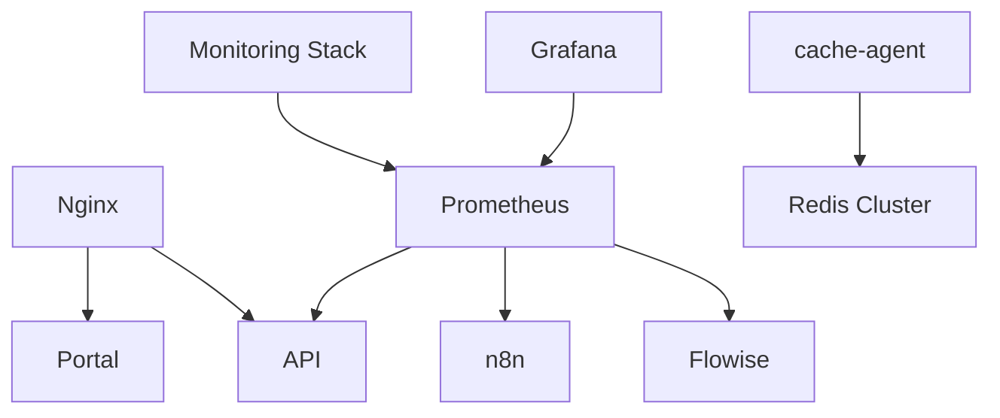

**Diagram sources**

- [docker-compose.portal.yml:40-56](file://docker-compose.portal.yml#L40-L56)
- [docker-compose.monitoring.yml:1-54](file://docker-compose.monitoring.yml#L1-L54)
- [config/prometheus.yml:1-27](file://config/prometheus.yml#L1-L27)
- [infra/k8s/cache-agent.yaml:1-32](file://infra/k8s/cache-agent.yaml#L1-L32)

**Section sources**

- [docker-compose.portal.yml:40-56](file://docker-compose.portal.yml#L40-L56)
- [docker-compose.monitoring.yml:1-54](file://docker-compose.monitoring.yml#L1-L54)
- [config/prometheus.yml:1-27](file://config/prometheus.yml#L1-L27)
- [infra/k8s/cache-agent.yaml:1-32](file://infra/k8s/cache-agent.yaml#L1-L32)

## Performance Considerations

- Nginx optimizations:
  - sendfile, tcp_nopush, tcp_nodelay, keepalive_timeout tuned
  - Gzip compression enabled for common content types
  - Static asset caching with long-lived immutable headers
- Docker resource limits:
  - CPU and memory caps prevent noisy neighbor issues
- Prometheus scrape cadence:
  - 15-second intervals balance freshness and overhead
- Kubernetes resource requests/limits:
  - Ensure sufficient headroom for cache agents under load

[No sources needed since this section provides general guidance]

## Troubleshooting Guide

- Health checks:
  - Nginx exposes /healthz; it proxies to the API live probe for deeper checks
  - Docker Compose healthchecks verify service readiness
- Logs:
  - Nginx access/error logs rotated via json-file driver options
  - Services log to stdout/stderr; monitor via docker logs or systemd journal
- Common issues:
  - Missing environment variables in production will cause the app to fail fast
  - Self-signed certificates must be placed in the correct mount path for Nginx
  - Port conflicts resolved by the deployment script before starting services

**Section sources**

- [config/nginx.conf:54-69](file://config/nginx.conf#L54-L69)
- [docker-compose.portal.yml:15-20](file://docker-compose.portal.yml#L15-L20)
- [docker-compose.production.yml:28-38](file://docker-compose.production.yml#L28-L38)
- [apps/portal/lib/env.ts:157-189](file://apps/portal/lib/env.ts#L157-L189)
- [config/generate-certs.sh:1-5](file://config/generate-certs.sh#L1-L5)

## Conclusion

The repository provides a robust, composable infrastructure for local development, production hosting, and Kubernetes-based cache agents. Nginx serves as a secure reverse proxy with TLS termination and advanced routing. Prometheus and Grafana deliver comprehensive observability, supported by targeted alert rules. The deployment scripts streamline environment setup, validation, and lifecycle management, while CI/CD pipelines enforce policy gates and enable safe rollbacks.

[No sources needed since this section summarizes without analyzing specific files]

## Appendices

### Disaster Recovery Procedures

- Backups:
  - Production deployment script creates a backup archive of key artifacts before deploying
  - Persistent volumes for Redis and ClickHouse ensure data durability
- Rollback:
  - Kubernetes rollback script undoes recent changes for cache-agent and policy-engine
- Restore:
  - Reapply previous known-good configurations and restore data from backups

**Section sources**

- [scripts/deploy.sh:612-633](file://scripts/deploy.sh#L612-L633)
- [docker-compose.production.yml:19-27](file://docker-compose.production.yml#L19-L27)
- [ci/scripts/rollback.sh:1-9](file://ci/scripts/rollback.sh#L1-L9)

### Monitoring and Alerting Configuration

- Prometheus jobs:
  - Targets include kiro-agent, n8n, langfuse, and self-scraping
- Grafana:
  - Cache telemetry dashboard shows hits vs misses and latency heatmaps
- Alerts:
  - Cache miss rate threshold and Redis shard availability

**Section sources**

- [config/prometheus.yml:5-27](file://config/prometheus.yml#L5-L27)
- [infra/observability/grafana-dashboards/cache-dashboard.json:1-22](file://infra/observability/grafana-dashboards/cache-dashboard.json#L1-L22)
- [infra/observability/prometheus-rules/cache-alerts.yaml:1-21](file://infra/observability/prometheus-rules/cache-alerts.yaml#L1-L21)

### Production Environment Setup

- Automated setup script:
  - Validates prerequisites, prepares environment files, configures systemd service, starts essential services, and performs health checks
- Notes:
  - Supports Rocky Linux/RHEL compatibility considerations
  - Emphasizes secret management and avoiding committing .env files

**Section sources**

- [scripts/setup-production-environment.sh:1-777](file://scripts/setup-production-environment.sh#L1-L777)
