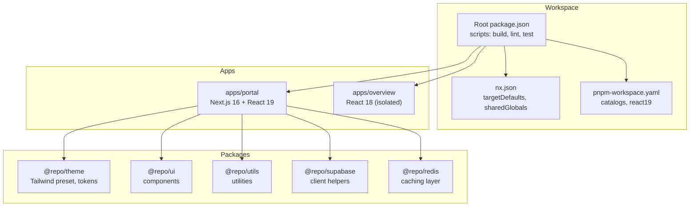
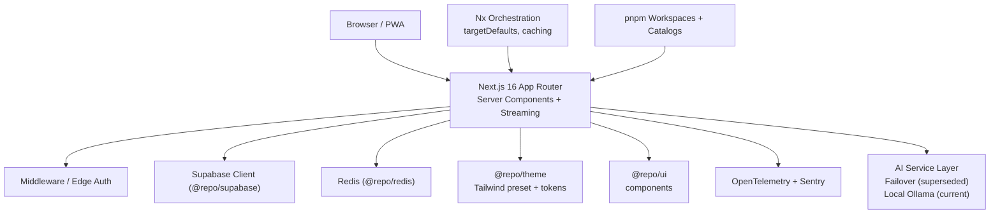
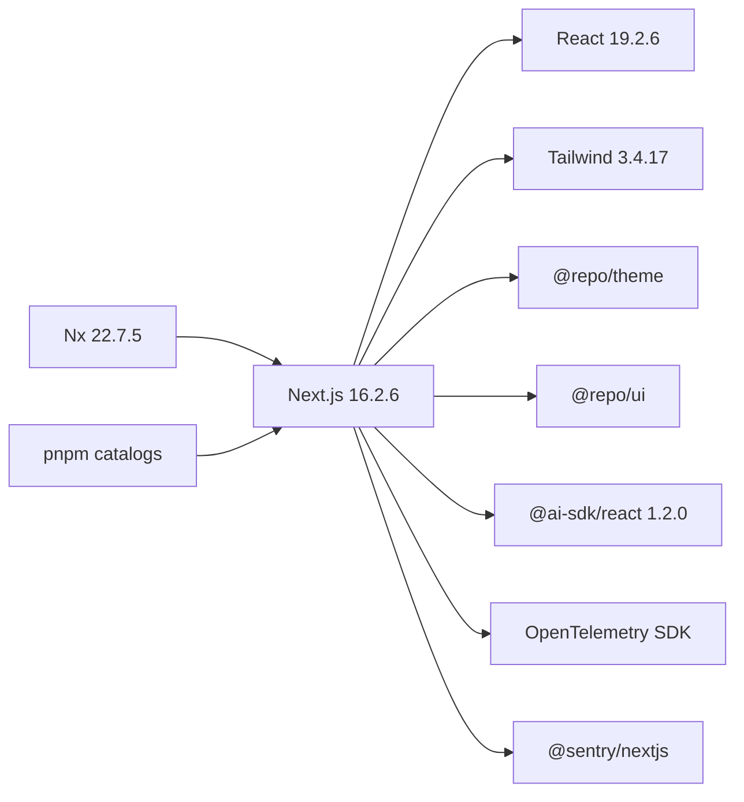

# Technology Stack & Decisions

<cite>
**Referenced Files in This Document**
- [package.json](file://package.json)
- [nx.json](file://nx.json)
- [pnpm-workspace.yaml](file://pnpm-workspace.yaml)
- [apps/portal/package.json](file://apps/portal/package.json)
- [apps/portal/next.config.mjs](file://apps/portal/next.config.mjs)
- [apps/portal/tailwind.config.ts](file://apps/portal/tailwind.config.ts)
- [packages/theme/package.json](file://packages/theme/package.json)
- [wiki/concepts/adr-001-nextjs-app-router.md](file://wiki/concepts/adr-001-nextjs-app-router.md)
- [wiki/concepts/adr-008-nx-monorepo.md](file://wiki/concepts/adr-008-nx-monorepo.md)
- [wiki/concepts/adr-004-tailwind-design-system.md](file://wiki/concepts/adr-004-tailwind-design-system.md)
- [wiki/concepts/adr-006-multi-provider-ai.md](file://wiki/concepts/adr-006-multi-provider-ai.md)
- [wiki/concepts/adr-007-react-19-adoption.md](file://wiki/concepts/adr-007-react-19-adoption.md)
</cite>

## Table of Contents

1. Introduction
2. Project Structure
3. Core Components
4. Architecture Overview
5. Detailed Component Analysis
6. Dependency Analysis
7. Performance Considerations
8. Troubleshooting Guide
9. Conclusion

## Introduction

This section documents the technology stack and architectural decisions that shape the project’s runtime, build orchestration, styling system, and AI integration strategy. It explains why Next.js 16 with App Router was chosen over traditional React patterns, why Nx is used for monorepo orchestration, how Tailwind CSS enforces design consistency, and how multi-provider AI integration was designed (and later superseded by a local-first approach). Trade-offs, migration considerations, version compatibility, and impacts on development workflow and performance are covered to help both technical and non-technical readers understand the rationale and consequences of these choices.

## Project Structure

The repository is a pnpm workspace orchestrated by Nx. The primary application is under apps/portal, built with Next.js 16 and React 19. Shared assets and utilities live under packages/, including a theme package that centralizes design tokens and Tailwind configuration. Build targets and caching rules are defined centrally in nx.json, while pnpm catalogs enforce consistent versions across apps and packages.

**Diagram sources**

- [package.json:50-88](file://package.json#L50-L88)
- [nx.json:47-134](file://nx.json#L47-L134)
- [pnpm-workspace.yaml:1-33](file://pnpm-workspace.yaml#L1-L33)
- [apps/portal/package.json:1-76](file://apps/portal/package.json#L1-L76)
- [packages/theme/package.json:1-46](file://packages/theme/package.json#L1-L46)

**Section sources**

- [package.json:1-96](file://package.json#L1-L96)
- [nx.json:1-139](file://nx.json#L1-L139)
- [pnpm-workspace.yaml:1-33](file://pnpm-workspace.yaml#L1-L33)
- [apps/portal/package.json:1-76](file://apps/portal/package.json#L1-L76)
- [packages/theme/package.json:1-46](file://packages/theme/package.json#L1-L46)

## Core Components

- Next.js 16 with App Router and React Server Components (RSC): Chosen for server-side rendering, streaming, nested layouts, and minimal client bundles. RSC enables direct data access without an intermediate API layer for many use cases.
- Nx Monorepo Orchestration: Replaced Turborepo to stabilize testing, improve cache control, and provide interactive dependency graphs. Target defaults define build dependencies and environment signatures.
- Tailwind CSS Design System: Centralized via @repo/theme with CSS variables and automated enforcement of forbidden patterns. Ensures consistent styling and small CSS payloads.
- Multi-Provider AI Strategy (Superseded): Originally designed as cascading failover across Groq, OpenRouter, and Together AI; later superseded by a local Ollama strategy for offline capability at remote sites.

Key trade-offs:

- Next.js App Router vs Pages Router: Better streaming and nested layouts vs learning curve and ecosystem adaptation.
- Nx vs Turborepo: Improved stability and fine-grained caching vs migration effort and new CLI habits.
- Tailwind vs CSS-in-JS or Modules: Bundle efficiency and RSC compatibility vs HTML verbosity and utility class learning curve.
- Multi-provider AI vs single provider: Higher availability and cost optimization vs complexity and key management overhead.

**Section sources**

- [wiki/concepts/adr-001-nextjs-app-router.md:1-88](file://wiki/concepts/adr-001-nextjs-app-router.md#L1-L88)
- [wiki/concepts/adr-008-nx-monorepo.md:1-61](file://wiki/concepts/adr-008-nx-monorepo.md#L1-L61)
- [wiki/concepts/adr-004-tailwind-design-system.md:1-126](file://wiki/concepts/adr-004-tailwind-design-system.md#L1-L126)
- [wiki/concepts/adr-006-multi-provider-ai.md:1-157](file://wiki/concepts/adr-006-multi-provider-ai.md#L1-L157)

## Architecture Overview

High-level architecture aligning framework, orchestration, styling, and AI layers:

**Diagram sources**

- [apps/portal/next.config.mjs:1-228](file://apps/portal/next.config.mjs#L1-L228)
- [apps/portal/package.json:1-76](file://apps/portal/package.json#L1-L76)
- [nx.json:47-134](file://nx.json#L47-L134)
- [pnpm-workspace.yaml:1-33](file://pnpm-workspace.yaml#L1-L33)
- [packages/theme/package.json:1-46](file://packages/theme/package.json#L1-L46)

## Detailed Component Analysis

### Next.js 16 with App Router

Rationale:

- Server-side rendering reduces initial JavaScript payload and improves SEO and perceived performance.
- App Router provides nested layouts, streaming, and RSC by default, enabling efficient data fetching and progressive loading.
- Next.js 16.2.6 pairs with React 19.2.6, unlocking Actions, use() hook, and improved hydration.

Trade-offs:

- Positive: Reduced bundle sizes, simplified data fetching, nested layouts, streaming, middleware-based auth, future-proof alignment.
- Negative: Learning curve for RSC patterns, ecosystem maturity gaps, debugging complexity around server/client boundaries.

Migration considerations:

- Prefer RSC for data-heavy pages; mark only interactive components as client components.
- Use path aliases consistently and isolate apps where necessary (e.g., overview app remains on React 18).

Performance characteristics:

- Smaller client bundles due to server-rendered pages.
- Streaming improves time-to-interactive for heavy dashboards.
- Security headers and CSP configured for production hardening.

**Section sources**

- [wiki/concepts/adr-001-nextjs-app-router.md:1-88](file://wiki/concepts/adr-001-nextjs-app-router.md#L1-L88)
- [apps/portal/next.config.mjs:1-228](file://apps/portal/next.config.mjs#L1-L228)
- [apps/portal/package.json:33-42](file://apps/portal/package.json#L33-L42)
- [wiki/concepts/adr-007-react-19-adoption.md:1-144](file://wiki/concepts/adr-007-react-19-adoption.md#L1-L144)

### Nx Monorepo Orchestration

Rationale:

- Stabilized Jest environments and reduced hangs under parallel runs.
- Fine-grained cache inputs/outputs for code generation and token validation.
- Interactive graphing and strict topological execution order.

Trade-offs:

- Positive: Reliable testing, precise caching, advanced CLI features, better dependency graph visualization.
- Negative: Migration effort from Turborepo and team retraining on Nx commands.

Migration considerations:

- Migrate global scripts to nx run-many targets.
- Define targetDependencies explicitly (e.g., build depends on ^build and ^codegen).
- Centralize environment variable signatures in sharedGlobals to invalidate caches correctly.

Development workflow impact:

- Faster builds via targeted caching.
- Predictable CI behavior with stable task orchestration.

**Section sources**

- [wiki/concepts/adr-008-nx-monorepo.md:1-61](file://wiki/concepts/adr-008-nx-monorepo.md#L1-L61)
- [nx.json:47-134](file://nx.json#L47-L134)
- [package.json:50-88](file://package.json#L50-L88)

### Tailwind CSS Design System

Rationale:

- Utility-first CSS ensures rapid iteration and type-safe styling.
- Centralized tokens via @repo/theme enable consistent theming and small CSS bundles.
- No CSS-in-JS avoids breaking RSC and eliminates runtime overhead.

Trade-offs:

- Positive: Bundle efficiency, RSC compatibility, design consistency, developer velocity, automated compliance checks.
- Negative: Utility class learning curve and JSX verbosity.

Implementation highlights:

- Tailwind preset exported from @repo/theme.
- Forbidden patterns enforced via pre-commit hooks and DeepEval metrics.
- Light mode default simplifies styling and aligns with macOS Sonoma visual language.

**Section sources**

- [wiki/concepts/adr-004-tailwind-design-system.md:1-126](file://wiki/concepts/adr-004-tailwind-design-system.md#L1-L126)
- [apps/portal/tailwind.config.ts:1-2](file://apps/portal/tailwind.config.ts#L1-L2)
- [packages/theme/package.json:1-46](file://packages/theme/package.json#L1-L46)

### Multi-Provider AI Integration Strategy (Superseded)

Original design:

- Cascading failover across Groq (primary), OpenRouter (secondary), and Together AI (tertiary).
- Automatic retries with timeouts and error handling to ensure high availability.
- Standardized prompt templates for operational contexts.

Trade-offs:

- Positive: High availability, best-of-breed capabilities, cost optimization, no vendor lock-in.
- Negative: Complexity, testing overhead, latency variability, multiple API keys to manage.

Current direction:

- Superseded by local Ollama strategy for offline execution at remote mining locations.

**Section sources**

- [wiki/concepts/adr-006-multi-provider-ai.md:1-157](file://wiki/concepts/adr-006-multi-provider-ai.md#L1-L157)

### React 19 Adoption Strategy

Rationale:

- Access to latest features (RSC stable, Actions, use() hook) and improved hydration.
- Aligns with Next.js 15+ optimizations and long-term React direction.

Trade-offs:

- Positive: Performance improvements, smaller bundles, future-proofing.
- Negative: Ecosystem gaps (some packages adapting), testing updates required, team learning curve.

Isolation strategy:

- apps/overview remains on React 18 temporarily to avoid chart library incompatibilities.
- Strict rule: no cross-app component sharing between React 19 and React 18 apps.

**Section sources**

- [wiki/concepts/adr-007-react-19-adoption.md:1-144](file://wiki/concepts/adr-007-react-19-adoption.md#L1-L144)
- [pnpm-workspace.yaml:27-33](file://pnpm-workspace.yaml#L27-L33)

## Dependency Analysis

Version compatibility matrix and relationships:

- Framework and Runtime
  - Next.js: 16.2.6
  - React: 19.2.6 (catalog:react19)
  - Node: >=22 (engine), Volta pins 24.15.0

- Styling and UI
  - Tailwind CSS: 3.4.17 (catalog)
  - @repo/theme: Tailwind preset + tokens
  - @repo/ui: Shared components

- AI and Observability
  - @ai-sdk/react: 1.2.0
  - OpenTelemetry SDK and exporters
  - Sentry Next.js integration

- Monorepo and Tooling
  - pnpm workspaces + catalogs
  - Nx 22.7.5 for orchestration and caching

**Diagram sources**

- [apps/portal/package.json:33-42](file://apps/portal/package.json#L33-L42)
- [pnpm-workspace.yaml:5-26](file://pnpm-workspace.yaml#L5-L26)
- [nx.json:1-20](file://nx.json#L1-L20)
- [packages/theme/package.json:17-19](file://packages/theme/package.json#L17-L19)

**Section sources**

- [apps/portal/package.json:1-76](file://apps/portal/package.json#L1-L76)
- [pnpm-workspace.yaml:1-33](file://pnpm-workspace.yaml#L1-L33)
- [nx.json:1-139](file://nx.json#L1-L139)
- [packages/theme/package.json:1-46](file://packages/theme/package.json#L1-L46)

## Performance Considerations

- Server-side rendering and streaming reduce initial payload and improve interactivity for dashboards.
- PWA enabled in CI/production with Workbox caching strategies for static assets and selective API endpoints.
- Security headers and CSP hardened for production; report-only mode in development aids safe rollout.
- Image formats optimized (AVIF/WebP) with CDN-friendly TTLs.
- Nx caching minimizes rebuild times by targeting specific inputs/outputs and invalidating on environment changes.

[No sources needed since this section provides general guidance]

## Troubleshooting Guide

Common issues and mitigations:

- Test runner hangs under parallel execution: Resolved by migrating to Nx with explicit target defaults and environment signatures.
- Token generation and style linting stale caches: Addressed by custom cache inputs/outputs for codegen and token validation tasks.
- RSC vs client boundary confusion: Mark only interactive components as client components; keep data fetching in server components.
- CSP violations in development: Use report-only policy to capture violations without blocking requests.

**Section sources**

- [wiki/concepts/adr-008-nx-monorepo.md:1-61](file://wiki/concepts/adr-008-nx-monorepo.md#L1-L61)
- [nx.json:47-134](file://nx.json#L47-L134)
- [apps/portal/next.config.mjs:58-165](file://apps/portal/next.config.mjs#L58-L165)

## Conclusion

The stack balances modern performance and developer experience with operational reliability:

- Next.js 16 App Router delivers SSR, streaming, and minimal client payloads suited for complex dashboards.
- Nx stabilizes builds and tests while enabling precise caching and dependency-aware orchestration.
- Tailwind with centralized tokens ensures consistent, efficient styling aligned with RSC constraints.
- AI integration evolved toward local-first execution to meet offline requirements at remote sites.

These decisions collectively improve performance, maintainability, and resilience while introducing manageable trade-offs in learning curves and migration effort.

[No sources needed since this section summarizes without analyzing specific files]
