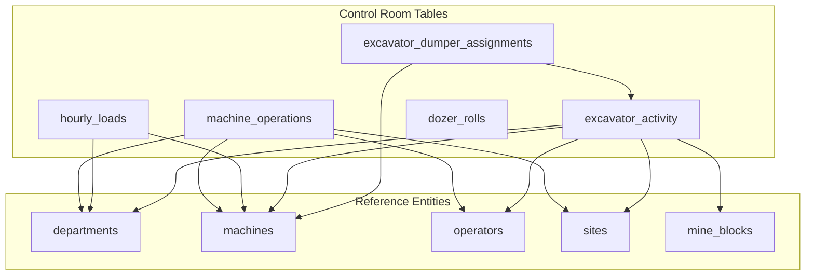
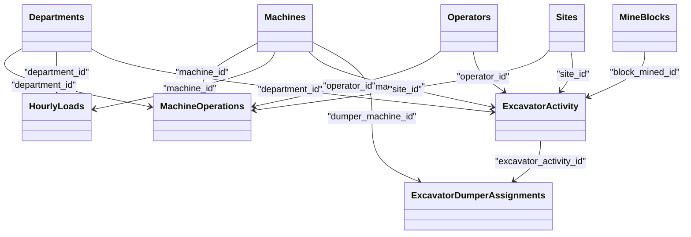

# Control Room Tables

<cite>
**Referenced Files in This Document**
- [002_control_room_tables.sql](file://packages/database/migrations/002_control_room_tables.sql)
- [008_excavator_activity_redesign.sql](file://packages/database/migrations/008_excavator_activity_redesign.sql)
- [010_schema_optimization.sql](file://packages/database/migrations/010_schema_optimization.sql)
- [014_schema_refinement.sql](file://packages/database/migrations/014_schema_refinement.sql)
- [020_partition_time_series.sql](file://packages/database/migrations/020_partition_time_series.sql)
- [SCHEMA.md](file://wiki/SCHEMA.md)
- [control-room.service.ts](file://apps/api/src/control-room/control-room.service.ts)
</cite>

## Table of Contents

1. [Introduction](#introduction)
2. [Project Structure](#project-structure)
3. [Core Components](#core-components)
4. [Architecture Overview](#architecture-overview)
5. [Detailed Component Analysis](#detailed-component-analysis)
6. [Dependency Analysis](#dependency-analysis)
7. [Performance Considerations](#performance-considerations)
8. [Troubleshooting Guide](#troubleshooting-guide)
9. [Conclusion](#conclusion)
10. [Appendices](#appendices)

## Introduction

This document provides comprehensive data model documentation for Control Room tables focused on Machine Operations, Hourly Loads, and Excavator Activity. It explains the complex relationships between excavator activities and dumper assignments, details generated columns such as hours_worked and total_loads, describes time-based indexing strategies for shift operations, and outlines unique constraints that ensure data integrity for machine scheduling. It also includes examples of performance calculations and cycle time analysis queries.

## Project Structure

The Control Room schema is defined across several database migrations and documented in a central schema reference. The key files include:

- Core Control Room tables and policies (machine_operations, hourly_loads, excavator_activity, dozer_rolls)
- Excavator redesign adding site/block mapping and dumper assignment child table
- Schema optimization with indexes and constraints
- Time-series partitioning for hourly_loads and daily_logs
- Centralized schema documentation



**Diagram sources**

- [002_control_room_tables.sql:85-106](file://packages/database/migrations/002_control_room_tables.sql#L85-L106)
- [002_control_room_tables.sql:155-193](file://packages/database/migrations/002_control_room_tables.sql#L155-L193)
- [002_control_room_tables.sql:334-350](file://packages/database/migrations/002_control_room_tables.sql#L334-L350)
- [008_excavator_activity_redesign.sql:63-74](file://packages/database/migrations/008_excavator_activity_redesign.sql#L63-L74)

**Section sources**

- [002_control_room_tables.sql:85-106](file://packages/database/migrations/002_control_room_tables.sql#L85-L106)
- [002_control_room_tables.sql:155-193](file://packages/database/migrations/002_control_room_tables.sql#L155-L193)
- [002_control_room_tables.sql:334-350](file://packages/database/migrations/002_control_room_tables.sql#L334-L350)
- [008_excavator_activity_redesign.sql:63-74](file://packages/database/migrations/008_excavator_activity_redesign.sql#L63-L74)
- [SCHEMA.md:239-310](file://wiki/SCHEMA.md#L239-L310)

## Core Components

This section documents the three primary Control Room tables and their roles:

- Machine Operations: tracks per-machine operational shifts with start/end times and computed hours worked.
- Hourly Loads: records per-hour load counts for dumpers over a 12-hour shift window with a generated total.
- Excavator Activity: captures excavator performance metrics including passes, loads, average cycle time, and optional material and tonnage estimates.

Key attributes and constraints are summarized below.

- Machine Operations
  - Purpose: Shift-level operation tracking with operator and site context.
  - Key fields: department_id, machine_id, operator_id, site_id, shift_date, shift_type, start_time, end_time.
  - Generated column: hours_worked computed from end_time minus start_time when both are present.
  - Unique constraint: ensures no duplicate operation entries for the same machine/date/shift/start_time.

- Hourly Loads
  - Purpose: Per-shift hourly load counting for dumpers.
  - Key fields: department_id, machine_id, load_date, shift_type, hour_01 through hour_12.
  - Generated column: total_loads computed as sum of hour_01 to hour_12.
  - Unique constraint: one row per machine/date/shift combination.

- Excavator Activity
  - Purpose: Detailed excavator cycle tracking with dumper assignments via a child table.
  - Key fields: department_id, machine_id, operator_id, site_id, block_mined_id, activity_date, shift_type, passes, loads, avg_cycle_time_seconds, material_type, estimated_tonnes.
  - Unique constraint: one record per machine/date/shift.

**Section sources**

- [002_control_room_tables.sql:85-106](file://packages/database/migrations/002_control_room_tables.sql#L85-L106)
- [002_control_room_tables.sql:155-193](file://packages/database/migrations/002_control_room_tables.sql#L155-L193)
- [002_control_room_tables.sql:334-350](file://packages/database/migrations/002_control_room_tables.sql#L334-L350)
- [SCHEMA.md:239-310](file://wiki/SCHEMA.md#L239-L310)

## Architecture Overview

The Control Room architecture centers around three operational tables linked to shared reference entities (departments, machines, operators, sites, mine blocks). Excavator Activity has a child relationship to Dumper Assignments, enabling many-to-one mapping of dumpers to an excavator’s shift.

```mermaid
erDiagram
departments {
uuid id PK
text name UK
text display_name
}
machines {
uuid id PK
uuid department_id FK
text name
text machine_type
uuid site_id FK
}
operators {
uuid id PK
text full_name
text employee_code UK
}
sites {
uuid id PK
text name
text site_code UK
}
mine_blocks {
uuid id PK
text name
text code UK
uuid site_id FK
}
machine_operations {
uuid id PK
uuid department_id FK
uuid machine_id FK
uuid operator_id FK
uuid site_id FK
date shift_date
text shift_type
time start_time
time end_time
numeric hours_worked
}
hourly_loads {
uuid id PK
uuid department_id FK
uuid machine_id FK
date load_date
text shift_type
integer hour_01..hour_12
integer total_loads
}
excavator_activity {
uuid id PK
uuid department_id FK
uuid machine_id FK
uuid operator_id FK
uuid site_id FK
uuid block_mined_id FK
date activity_date
text shift_type
integer passes
integer loads
integer avg_cycle_time_seconds
text material_type
numeric estimated_tonnes
}
excavator_dumper_assignments {
uuid id PK
uuid excavator_activity_id FK
uuid dumper_machine_id FK
text material_type
integer total_loads
numeric total_bcm
}
departments ||--o{ machines : "owns"
machines ||--o{ machine_operations : "operated_by"
operators ||--o{ machine_operations : "assigned_to"
sites ||--o{ machines : "location"
sites ||--o{ mine_blocks : "contains"
departments ||--o{ excavator_activity : "records"
machines ||--o{ excavator_activity : "used_by"
operators ||--o{ excavator_activity : "assigned_to"
sites ||--o{ excavator_activity : "located_at"
mine_blocks ||--o{ excavator_activity : "mined_in"
excavator_activity ||--o{ excavator_dumper_assignments : "has_assignments"
machines ||--o{ excavator_dumper_assignments : "dumper"
```

**Diagram sources**

- [002_control_room_tables.sql:85-106](file://packages/database/migrations/002_control_room_tables.sql#L85-L106)
- [002_control_room_tables.sql:155-193](file://packages/database/migrations/002_control_room_tables.sql#L155-L193)
- [002_control_room_tables.sql:334-350](file://packages/database/migrations/002_control_room_tables.sql#L334-L350)
- [008_excavator_activity_redesign.sql:63-74](file://packages/database/migrations/008_excavator_activity_redesign.sql#L63-L74)
- [SCHEMA.md:239-310](file://wiki/SCHEMA.md#L239-L310)

## Detailed Component Analysis

### Machine Operations

- Purpose: Track per-machine operational shifts with precise timing and operator/site context.
- Key fields:
  - department_id, machine_id, operator_id, site_id
  - shift_date, shift_type (day/night)
  - start_time, end_time
  - created_by (audit)
- Generated column:
  - hours_worked: computed from end_time minus start_time when both exist; otherwise null.
- Constraints:
  - UNIQUE(machine_id, shift_date, shift_type, start_time) prevents overlapping or duplicate operations for the same machine/time slot.
- Indexes:
  - Composite indexes for department + date + shift pattern support dashboard queries.
  - Additional indexes on machine_id, operator_id, site_id improve join performance.

Example usage patterns:

- Compute total hours worked per machine per day by aggregating hours_worked grouped by machine_id and shift_date.
- Validate shift coverage by checking presence of rows per machine per shift.

**Section sources**

- [002_control_room_tables.sql:85-106](file://packages/database/migrations/002_control_room_tables.sql#L85-L106)
- [010_schema_optimization.sql:19-22](file://packages/database/migrations/010_schema_optimization.sql#L19-L22)
- [014_schema_refinement.sql:183-185](file://packages/database/migrations/014_schema_refinement.sql#L183-L185)
- [SCHEMA.md:239-260](file://wiki/SCHEMA.md#L239-L260)

### Hourly Loads

- Purpose: Record per-hour load counts for dumpers within a 12-hour shift window (day or night).
- Key fields:
  - department_id, machine_id
  - load_date, shift_type (day/night)
  - hour_01 through hour_12 (integer counts)
- Generated column:
  - total_loads: sum of hour_01 to hour_12.
- Constraints:
  - UNIQUE(machine_id, load_date, shift_type) ensures one row per machine/day/shift.
- Partitioning:
  - Converted to a partitioned table by load_date with monthly partitions and RLS policies applied at the parent level.
- Indexes:
  - Composite indexes on department_id + load_date DESC and machine_id + load_date DESC optimize dashboard and reporting queries.
  - Index on shift_type supports filtering by shift.

Example usage patterns:

- Sum total_loads per machine per shift to compute daily production totals.
- Compare day vs night totals for the same machine using shift_type grouping.

**Section sources**

- [002_control_room_tables.sql:155-193](file://packages/database/migrations/002_control_room_tables.sql#L155-L193)
- [020_partition_time_series.sql:24-52](file://packages/database/migrations/020_partition_time_series.sql#L24-L52)
- [020_partition_time_series.sql:74-76](file://packages/database/migrations/020_partition_time_series.sql#L74-L76)
- [014_schema_refinement.sql:187-189](file://packages/database/migrations/014_schema_refinement.sql#L187-L189)
- [SCHEMA.md:261-276](file://wiki/SCHEMA.md#L261-L276)

### Excavator Activity

- Purpose: Capture detailed excavator performance metrics per shift, including passes, loads, average cycle time, material type, and estimated tonnes.
- Key fields:
  - department_id, machine_id, operator_id
  - site_id, block_mined_id
  - activity_date, shift_type (day/night)
  - passes, loads, avg_cycle_time_seconds, material_type, estimated_tonnes
- Constraints:
  - UNIQUE(machine_id, activity_date, shift_type) ensures one record per machine/day/shift.
- Indexes:
  - Composite indexes on department_id + activity_date DESC + shift_type support dashboards.
  - Indexes on machine_id, operator_id, site_id improve joins and filters.

Example usage patterns:

- Calculate average cycle time per machine per shift by averaging avg_cycle_time_seconds.
- Estimate tonnes moved by multiplying loads by bin_factor from machines where applicable.

**Section sources**

- [002_control_room_tables.sql:334-350](file://packages/database/migrations/002_control_room_tables.sql#L334-L350)
- [008_excavator_activity_redesign.sql:55-58](file://packages/database/migrations/008_excavator_activity_redesign.sql#L55-L58)
- [010_schema_optimization.sql:27-29](file://packages/database/migrations/010_schema_optimization.sql#L27-L29)
- [014_schema_refinement.sql:199-201](file://packages/database/migrations/014_schema_refinement.sql#L199-L201)
- [SCHEMA.md:277-297](file://wiki/SCHEMA.md#L277-L297)

### Excavator Dumper Assignments

- Purpose: Child table linking excavator activities to assigned dumpers, capturing per-material-type load counts and volume metrics.
- Key fields:
  - excavator_activity_id (FK to excavator_activity)
  - dumper_machine_id (FK to machines)
  - material_type, total_loads, total_bcm
- Constraints:
  - UNIQUE(excavator_activity_id, dumper_machine_id, material_type) prevents duplicate assignments for the same excavator/dumper/material combination.
- Indexes:
  - Indexes on excavator_activity_id and dumper_machine_id support efficient lookups and joins.

Relationship overview:

- One excavator_activity can have multiple dumper assignments (one-to-many).
- Each assignment references a specific dumper machine and material type.

**Section sources**

- [008_excavator_activity_redesign.sql:63-74](file://packages/database/migrations/008_excavator_activity_redesign.sql#L63-L74)
- [014_schema_refinement.sql:168-170](file://packages/database/migrations/014_schema_refinement.sql#L168-L170)
- [SCHEMA.md:299-310](file://wiki/SCHEMA.md#L299-L310)

## Dependency Analysis

The Control Room tables depend on shared reference entities and enforce strict uniqueness and foreign key constraints to maintain data integrity.



**Diagram sources**

- [002_control_room_tables.sql:85-106](file://packages/database/migrations/002_control_room_tables.sql#L85-L106)
- [002_control_room_tables.sql:155-193](file://packages/database/migrations/002_control_room_tables.sql#L155-L193)
- [002_control_room_tables.sql:334-350](file://packages/database/migrations/002_control_room_tables.sql#L334-L350)
- [008_excavator_activity_redesign.sql:63-74](file://packages/database/migrations/008_excavator_activity_redesign.sql#L63-L74)

**Section sources**

- [002_control_room_tables.sql:85-106](file://packages/database/migrations/002_control_room_tables.sql#L85-L106)
- [002_control_room_tables.sql:155-193](file://packages/database/migrations/002_control_room_tables.sql#L155-L193)
- [002_control_room_tables.sql:334-350](file://packages/database/migrations/002_control_room_tables.sql#L334-L350)
- [008_excavator_activity_redesign.sql:63-74](file://packages/database/migrations/008_excavator_activity_redesign.sql#L63-L74)

## Performance Considerations

- Generated Columns:
  - hours_worked and total_loads are computed at write time, reducing runtime calculation overhead and ensuring consistency.
- Indexing Strategy:
  - Composite indexes on department_id + date DESC + shift_type accelerate dashboard queries and shift completeness checks.
  - Foreign key indexes on machine_id, operator_id, site_id improve join performance.
- Partitioning:
  - hourly_loads is partitioned by load_date with monthly partitions, improving query performance for recent shifts while maintaining historical data.
- Row Level Security:
  - Policies scoped by department ensure secure access without impacting query performance significantly.

[No sources needed since this section provides general guidance]

## Troubleshooting Guide

Common issues and resolutions:

- Duplicate operation entries:
  - Symptom: Insert fails due to unique constraint violation on machine_operations.
  - Resolution: Ensure start_time differs or adjust shift_type/shift_date to avoid duplicates.
- Missing shift coverage:
  - Symptom: Dashboard shows incomplete shift coverage.
  - Resolution: Verify existence of rows in relevant tables (machine_operations, excavator_activity, hourly_loads) for each machine per shift.
- Incorrect total_loads:
  - Symptom: total_loads does not match expected sum.
  - Resolution: Check hour_01 to hour_12 values; remember total_loads is generated and recalculated automatically.
- Dumper assignment conflicts:
  - Symptom: Insert/update fails due to unique constraint on excavator_dumper_assignments.
  - Resolution: Ensure unique combination of excavator_activity_id, dumper_machine_id, and material_type.

**Section sources**

- [002_control_room_tables.sql:85-106](file://packages/database/migrations/002_control_room_tables.sql#L85-L106)
- [002_control_room_tables.sql:155-193](file://packages/database/migrations/002_control_room_tables.sql#L155-L193)
- [008_excavator_activity_redesign.sql:63-74](file://packages/database/migrations/008_excavator_activity_redesign.sql#L63-L74)

## Conclusion

The Control Room data model provides robust tracking for machine operations, dumper productivity, and excavator performance. Generated columns simplify derived metrics, while unique constraints and composite indexes ensure data integrity and query efficiency. The partitioning strategy for hourly_loads supports scalable time-series analytics. Together, these design choices enable accurate shift management, performance reporting, and cycle time analysis.

[No sources needed since this section summarizes without analyzing specific files]

## Appendices

### Generated Columns Detail

- hours_worked (machine_operations):
  - Computed from end_time minus start_time when both are present; otherwise null.
- total_loads (hourly_loads):
  - Computed as sum of hour_01 through hour_12.

**Section sources**

- [002_control_room_tables.sql:95-101](file://packages/database/migrations/002_control_room_tables.sql#L95-L101)
- [002_control_room_tables.sql:184-189](file://packages/database/migrations/002_control_room_tables.sql#L184-L189)

### Time-Based Indexing Strategy

- Composite indexes:
  - machine_operations(department_id, shift_date DESC, shift_type)
  - hourly_loads(department_id, load_date DESC)
  - excavator_activity(department_id, activity_date DESC, shift_type)
- Partitioning:
  - hourly_loads partitioned by load_date with monthly partitions and RLS policies applied at the parent level.

**Section sources**

- [014_schema_refinement.sql:183-189](file://packages/database/migrations/014_schema_refinement.sql#L183-L189)
- [014_schema_refinement.sql:199-201](file://packages/database/migrations/014_schema_refinement.sql#L199-L201)
- [020_partition_time_series.sql:24-52](file://packages/database/migrations/020_partition_time_series.sql#L24-L52)
- [020_partition_time_series.sql:74-76](file://packages/database/migrations/020_partition_time_series.sql#L74-L76)

### Unique Constraints for Data Integrity

- machine_operations: UNIQUE(machine_id, shift_date, shift_type, start_time)
- hourly_loads: UNIQUE(machine_id, load_date, shift_type)
- excavator_activity: UNIQUE(machine_id, activity_date, shift_type)
- excavator_dumper_assignments: UNIQUE(excavator_activity_id, dumper_machine_id, material_type)

**Section sources**

- [002_control_room_tables.sql:105-106](file://packages/database/migrations/002_control_room_tables.sql#L105-L106)
- [002_control_room_tables.sql:192-193](file://packages/database/migrations/002_control_room_tables.sql#L192-L193)
- [002_control_room_tables.sql:349-350](file://packages/database/migrations/002_control_room_tables.sql#L349-L350)
- [008_excavator_activity_redesign.sql:73-74](file://packages/database/migrations/008_excavator_activity_redesign.sql#L73-L74)

### Example Queries

- Performance Calculations
  - Total hours worked per machine per day:
    - Aggregate hours_worked grouped by machine_id and shift_date from machine_operations.
  - Daily total loads per dumper:
    - Sum total_loads grouped by machine_id and load_date from hourly_loads.

- Cycle Time Analysis
  - Average cycle time per excavator per shift:
    - Average avg_cycle_time_seconds grouped by machine_id and shift_type from excavator_activity.
  - Estimated tonnes moved per excavator per shift:
    - Multiply loads by bin_factor from machines where applicable, then group by machine_id and shift_type.

- Shift Completeness Logic
  - Service logic determines required forms per machine type and verifies presence of corresponding records for the given department, date, and shift.

**Section sources**

- [control-room.service.ts:77-80](file://apps/api/src/control-room/control-room.service.ts#L77-L80)
- [control-room.service.ts:93-99](file://apps/api/src/control-room/control-room.service.ts#L93-L99)
- [SCHEMA.md:239-310](file://wiki/SCHEMA.md#L239-L310)
