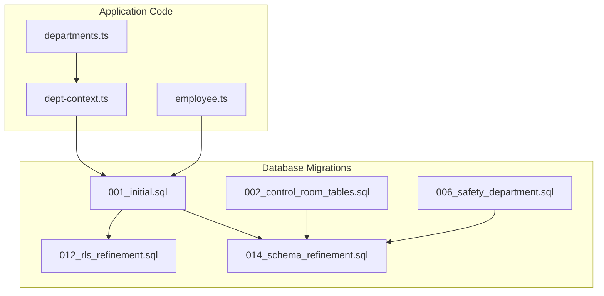
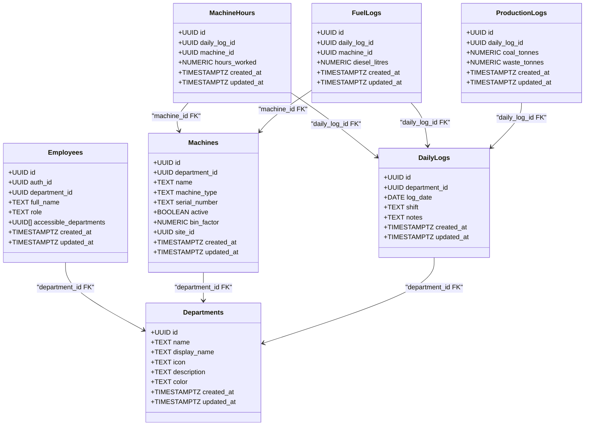
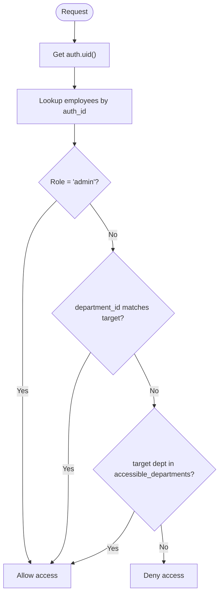
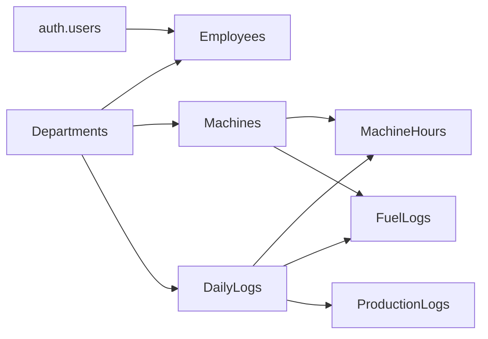

# Core Entities

<cite>
**Referenced Files in This Document**
- [001_initial.sql](file://packages/database/migrations/001_initial.sql)
- [002_control_room_tables.sql](file://packages/database/migrations/002_control_room_tables.sql)
- [006_safety_department.sql](file://packages/database/migrations/006_safety_department.sql)
- [014_schema_refinement.sql](file://packages/database/migrations/014_schema_refinement.sql)
- [012_rls_refinement.sql](file://packages/database/migrations/012_rls_refinement.sql)
- [SCHEMA.md](file://wiki/SCHEMA.md)
- [why-query-returns-empty.md](file://wiki/queries/why-query-returns-empty.md)
- [departments.ts](file://apps/portal/lib/departments.ts)
- [dept-context.ts](file://apps/portal/lib/dept-context.ts)
- [employee.ts](file://apps/portal/lib/employee.ts)
</cite>

## Table of Contents

1. Introduction
2. Project Structure
3. Core Components
4. Architecture Overview
5. Detailed Component Analysis
6. Dependency Analysis
7. Performance Considerations
8. Troubleshooting Guide
9. Conclusion

## Introduction

This document provides comprehensive data model documentation for the core entities in Arch-Mk2: Departments, Employees, and Machines. It explains the UUID primary key pattern, foreign key relationships to auth.users, role-based access control via the employees table, department-scoped data isolation through Row Level Security (RLS), and how these entities form the foundation for all operational data. It also includes typical query patterns and common joins used across the application.

## Project Structure

The database schema is defined as SQL migrations under packages/database/migrations. The initial core tables (departments, employees, machines) are created in the first migration, with subsequent migrations adding operational tables, indexes, constraints, and RLS refinements. Application code resolves departments by slug and maps them to UUIDs, while server-side helpers resolve employee IDs from Supabase Auth users.

**Diagram sources**

- [001_initial.sql:1-122](file://packages/database/migrations/001_initial.sql#L1-L122)
- [002_control_room_tables.sql:1-120](file://packages/database/migrations/002_control_room_tables.sql#L1-L120)
- [006_safety_department.sql:1-70](file://packages/database/migrations/006_safety_department.sql#L1-L70)
- [012_rls_refinement.sql:1-43](file://packages/database/migrations/012_rls_refinement.sql#L1-L43)
- [014_schema_refinement.sql:1-120](file://packages/database/migrations/014_schema_refinement.sql#L1-L120)
- [dept-context.ts:16-52](file://apps/portal/lib/dept-context.ts#L16-L52)
- [employee.ts:9-27](file://apps/portal/lib/employee.ts#L9-L27)
- [departments.ts:1-168](file://apps/portal/lib/departments.ts#L1-L168)

**Section sources**

- [001_initial.sql:1-122](file://packages/database/migrations/001_initial.sql#L1-L122)
- [002_control_room_tables.sql:1-120](file://packages/database/migrations/002_control_room_tables.sql#L1-L120)
- [006_safety_department.sql:1-70](file://packages/database/migrations/006_safety_department.sql#L1-L70)
- [012_rls_refinement.sql:1-43](file://packages/database/migrations/012_rls_refinement.sql#L1-L43)
- [014_schema_refinement.sql:1-120](file://packages/database/migrations/014_schema_refinement.sql#L1-L120)
- [dept-context.ts:16-52](file://apps/portal/lib/dept-context.ts#L16-L52)
- [employee.ts:9-27](file://apps/portal/lib/employee.ts#L9-L27)
- [departments.ts:1-168](file://apps/portal/lib/departments.ts#L1-L168)

## Core Components

This section documents the three core entities: Departments, Employees, and Machines.

### Departments

- Purpose: Organizational units that scope data access and ownership.
- Primary Key: UUID generated via uuid_generate_v4().
- Key Fields:
  - id: UUID PK
  - name: TEXT UNIQUE NOT NULL (slug identifier)
  - display_name: TEXT NOT NULL
  - icon: TEXT NOT NULL
  - description: TEXT
  - color: TEXT NOT NULL
  - created_at: TIMESTAMPTZ DEFAULT NOW()
  - updated_at: TIMESTAMPTZ (added later)
- Constraints:
  - Unique constraint on name
  - Not null constraints on required fields
- Access Control:
  - RLS enabled; select policy filters active records (soft delete support).
- Indexes:
  - PK index on id
- Notes:
  - Soft delete via deleted_at supported by RLS policies.

**Section sources**

- [001_initial.sql:7-23](file://packages/database/migrations/001_initial.sql#L7-L23)
- [012_rls_refinement.sql:11-16](file://packages/database/migrations/012_rls_refinement.sql#L11-L16)
- [014_schema_refinement.sql:88-88](file://packages/database/migrations/014_schema_refinement.sql#L88-L88)

### Employees

- Purpose: Links Supabase Auth users to application roles and department assignments; central to RLS evaluation.
- Primary Key: UUID generated via uuid_generate_v4().
- Key Fields:
  - id: UUID PK
  - auth_id: UUID NOT NULL REFERENCES auth.users(id) ON DELETE CASCADE
  - department_id: UUID REFERENCES departments(id)
  - full_name: TEXT NOT NULL
  - role: TEXT NOT NULL DEFAULT 'operator'
  - accessible_departments: UUID[] DEFAULT '{}'
  - created_at: TIMESTAMPTZ DEFAULT NOW()
  - updated_at: TIMESTAMPTZ (added later)
- Constraints:
  - Foreign key to auth.users with cascade delete
  - Not null constraints on auth_id, full_name, role
- Access Control:
  - RLS enables self-read/update and admin-only insert.
  - Helper functions: user_department_id(), is_admin(), has_department_access(dept_id).
- Indexes:
  - PK index on id
- Notes:
  - Trigger auto-creates an employee row upon new auth.user creation.

**Section sources**

- [001_initial.sql:27-69](file://packages/database/migrations/001_initial.sql#L27-L69)
- [001_initial.sql:308-346](file://packages/database/migrations/001_initial.sql#L308-L346)
- [001_initial.sql:351-373](file://packages/database/migrations/001_initial.sql#L351-L373)
- [012_rls_refinement.sql:18-26](file://packages/database/migrations/012_rls_refinement.sql#L18-L26)
- [014_schema_refinement.sql:89-89](file://packages/database/migrations/014_schema_refinement.sql#L89-L89)

### Machines

- Purpose: Equipment registry scoped per department; foundational for operational metrics.
- Primary Key: UUID generated via uuid_generate_v4().
- Key Fields:
  - id: UUID PK
  - department_id: UUID NOT NULL REFERENCES departments(id) ON DELETE CASCADE
  - name: TEXT NOT NULL
  - machine_type: TEXT NOT NULL
  - serial_number: TEXT
  - active: BOOLEAN NOT NULL DEFAULT true
  - bin_factor: NUMERIC(10,2) (precision added later)
  - site_id: UUID REFERENCES sites(id) (optional assignment)
  - created_at: TIMESTAMPTZ DEFAULT NOW()
  - updated_at: TIMESTAMPTZ (added later)
- Constraints:
  - Foreign key to departments with cascade delete
  - Check constraint on machine_type values
  - Not null constraints on name, machine_type
- Access Control:
  - RLS enforces department-scoped read/write based on role and accessible_departments.
- Indexes:
  - PK index on id
- Notes:
  - Used extensively by daily logs and operational tables.

**Section sources**

- [001_initial.sql:74-122](file://packages/database/migrations/001_initial.sql#L74-L122)
- [014_schema_refinement.sql:52-53](file://packages/database/migrations/014_schema_refinement.sql#L52-L53)
- [014_schema_refinement.sql:60-68](file://packages/database/migrations/014_schema_refinement.sql#L60-L68)
- [014_schema_refinement.sql:90-90](file://packages/database/migrations/014_schema_refinement.sql#L90-L90)

## Architecture Overview

The core entities implement a department-scoped data isolation pattern using RLS. All authenticated users must have an employees record; access is granted if the user is an admin, belongs to the same department, or has cross-department access via accessible_departments. Operational tables inherit this scoping through their own policies or by joining to parent tables like daily_logs.

**Diagram sources**

- [001_initial.sql:7-122](file://packages/database/migrations/001_initial.sql#L7-L122)
- [001_initial.sql:126-303](file://packages/database/migrations/001_initial.sql#L126-L303)

## Detailed Component Analysis

### Departments

- Field definitions and constraints are enforced at the schema level.
- RLS policies ensure only active departments are visible.
- Application code maps URL slugs to UUIDs via the departments table.

Typical queries:

- Resolve department UUID by slug:
  - SELECT id FROM departments WHERE name = $1 AND deleted_at IS NULL;
- List active departments:
  - SELECT id, name, display_name, icon, color FROM departments WHERE deleted_at IS NULL ORDER BY name;

Common join patterns:

- Join employees to departments to determine user’s primary department:
  - SELECT e.id, e.role, d.name FROM employees e JOIN departments d ON e.department_id = d.id WHERE e.auth_id = $1;

**Section sources**

- [001_initial.sql:7-23](file://packages/database/migrations/001_initial.sql#L7-L23)
- [012_rls_refinement.sql:11-16](file://packages/database/migrations/012_rls_refinement.sql#L11-L16)
- [dept-context.ts:32-41](file://apps/portal/lib/dept-context.ts#L32-L41)

### Employees

- Linked to auth.users via auth_id with cascade delete.
- Role-based access control uses role field and helper functions.
- Cross-department access via accessible_departments array.

Typical queries:

- Resolve employee ID from auth user:
  - SELECT id FROM employees WHERE auth_id = $1;
- Check admin status:
  - SELECT EXISTS(SELECT 1 FROM employees WHERE auth_id = $1 AND role = 'admin');
- Verify department access:
  - SELECT EXISTS(SELECT 1 FROM employees WHERE auth_id = $1 AND (role = 'admin' OR department_id = $2 OR $2 = ANY(accessible_departments)));

Common join patterns:

- Join employees to machines to enforce department-scoped reads:
  - SELECT m.\* FROM machines m JOIN employees e ON e.auth_id = auth.uid() WHERE e.role = 'admin' OR e.department_id = m.department_id OR m.department_id = ANY(e.accessible_departments);

**Section sources**

- [001_initial.sql:27-69](file://packages/database/migrations/001_initial.sql#L27-L69)
- [001_initial.sql:308-346](file://packages/database/migrations/001_initial.sql#L308-L346)
- [employee.ts:9-27](file://apps/portal/lib/employee.ts#L9-L27)

### Machines

- Scoped to departments via department_id FK.
- RLS policies restrict access based on role and department membership.
- Additional constraints include machine_type check and numeric precision for bin_factor.

Typical queries:

- List machines for a department:
  - SELECT id, name, machine_type, active FROM machines WHERE department_id = $1 AND active = true;
- Filter by machine type:
  - SELECT id, name FROM machines WHERE department_id = $1 AND machine_type = $2;

Common join patterns:

- Join machines to daily logs and machine hours:
  - SELECT dl.log_date, m.name, mh.hours_worked FROM daily_logs dl JOIN machine_hours mh ON mh.daily_log_id = dl.id JOIN machines m ON m.id = mh.machine_id WHERE dl.department_id = $1;

**Section sources**

- [001_initial.sql:74-122](file://packages/database/migrations/001_initial.sql#L74-L122)
- [014_schema_refinement.sql:52-68](file://packages/database/migrations/014_schema_refinement.sql#L52-L68)

### Department-Scoped Data Isolation Pattern

- RLS policies evaluate current user via auth.uid() and employees table.
- Admin bypasses department checks; operators limited to their department or explicitly allowed departments.
- Helper functions encapsulate access logic for reuse in policies.

**Diagram sources**

- [001_initial.sql:86-122](file://packages/database/migrations/001_initial.sql#L86-L122)
- [001_initial.sql:330-346](file://packages/database/migrations/001_initial.sql#L330-L346)

## Dependency Analysis

Core dependencies:

- Employees depends on auth.users (auth_id FK).
- Machines depends on departments (department_id FK).
- Operational tables depend on departments and/or machines/daily_logs.

**Diagram sources**

- [001_initial.sql:27-122](file://packages/database/migrations/001_initial.sql#L27-L122)
- [001_initial.sql:126-303](file://packages/database/migrations/001_initial.sql#L126-L303)

**Section sources**

- [001_initial.sql:27-122](file://packages/database/migrations/001_initial.sql#L27-L122)
- [001_initial.sql:126-303](file://packages/database/migrations/001_initial.sql#L126-L303)

## Performance Considerations

- Use explicit indexes on frequently filtered columns (e.g., department_id, log_date, shift).
- Leverage composite indexes for dashboard queries (department + date + shift).
- Prefer selecting specific columns instead of SELECT \*.
- Utilize generated columns where appropriate (e.g., hours_worked in machine_operations).
- For large tables, consider partitioning by time (audit_logs, memory_embeddings).

[No sources needed since this section provides general guidance]

## Troubleshooting Guide

Common causes of empty query results:

- Missing employees row for the authenticated user.
- Incorrect department_id or missing cross-department access.
- RLS policies not enabled or misconfigured.
- Soft delete filtering out records.

Diagnostic steps:

- Verify data existence and counts.
- Confirm RLS is enabled on the table.
- Ensure the user has an employees row and correct role/department.
- Check accessible_departments for cross-department access.
- Validate policies and helper functions.

**Section sources**

- [why-query-returns-empty.md:1-242](file://wiki/queries/why-query-returns-empty.md#L1-L242)

## Conclusion

Departments, Employees, and Machines form the foundational layer of Arch-Mk2’s data model. Their UUID primary keys, strict constraints, and robust RLS policies enable secure, department-scoped operations. These entities underpin all operational data, ensuring consistent access control and reliable performance across the application.

[No sources needed since this section summarizes without analyzing specific files]
