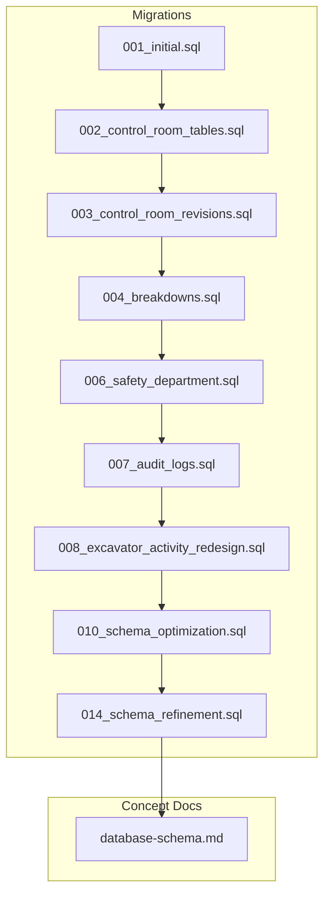
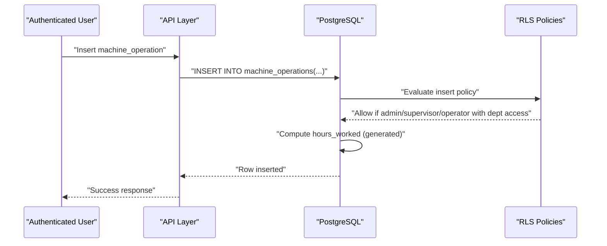
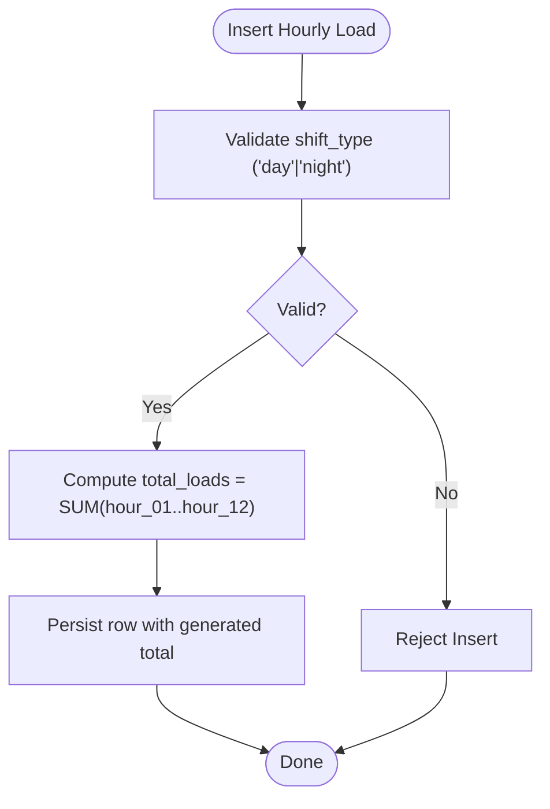
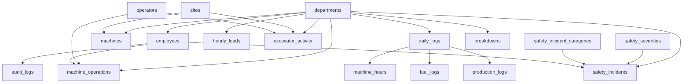

# Database Schema & Tables

<cite>
**Referenced Files in This Document**
- [001_initial.sql](file://packages/database/migrations/001_initial.sql)
- [002_control_room_tables.sql](file://packages/database/migrations/002_control_room_tables.sql)
- [003_control_room_revisions.sql](file://packages/database/migrations/003_control_room_revisions.sql)
- [004_breakdowns.sql](file://packages/database/migrations/004_breakdowns.sql)
- [006_safety_department.sql](file://packages/database/migrations/006_safety_department.sql)
- [007_audit_logs.sql](file://packages/database/migrations/007_audit_logs.sql)
- [008_excavator_activity_redesign.sql](file://packages/database/migrations/008_excavator_activity_redesign.sql)
- [010_schema_optimization.sql](file://packages/database/migrations/010_schema_optimization.sql)
- [014_schema_refinement.sql](file://packages/database/migrations/014_schema_refinement.sql)
- [database-schema.md](file://wiki/concepts/database-schema.md)
</cite>

## Table of Contents

1. [Introduction](#introduction)
2. [Project Structure](#project-structure)
3. [Core Components](#core-components)
4. [Architecture Overview](#architecture-overview)
5. [Detailed Component Analysis](#detailed-component-analysis)
6. [Dependency Analysis](#dependency-analysis)
7. [Performance Considerations](#performance-considerations)
8. [Troubleshooting Guide](#troubleshooting-guide)
9. [Conclusion](#conclusion)

## Introduction

This document provides comprehensive data model documentation for the Arch-Mk2 database schema built on PostgreSQL via Supabase. It details core entities including Departments, Employees, Machines, Daily Logs, Machine Operations, Hourly Loads, Excavator Activity, Safety Incidents, and Breakdowns. The documentation covers entity relationships, field definitions, data types, constraints, indexes, foreign keys, check constraints, generated columns, soft delete patterns, naming conventions, UUID primary keys, TIMESTAMPTZ usage, and enum-like check constraints. It also includes diagrams to illustrate table relationships and the hierarchical structure from departments down to operational metrics.

## Project Structure

The database schema is defined through a series of numbered SQL migrations under packages/database/migrations/. These migrations create and evolve tables, constraints, indexes, triggers, and Row Level Security (RLS) policies. A conceptual overview of the schema is also documented in wiki/concepts/database-schema.md.



**Diagram sources**

- [001_initial.sql:1-373](file://packages/database/migrations/001_initial.sql#L1-L373)
- [002_control_room_tables.sql:1-569](file://packages/database/migrations/002_control_room_tables.sql#L1-L569)
- [003_control_room_revisions.sql:1-270](file://packages/database/migrations/003_control_room_revisions.sql#L1-L270)
- [004_breakdowns.sql:1-120](file://packages/database/migrations/004_breakdowns.sql#L1-L120)
- [006_safety_department.sql:1-143](file://packages/database/migrations/006_safety_department.sql#L1-L143)
- [007_audit_logs.sql:1-46](file://packages/database/migrations/007_audit_logs.sql#L1-L46)
- [008_excavator_activity_redesign.sql:1-171](file://packages/database/migrations/008_excavator_activity_redesign.sql#L1-L171)
- [010_schema_optimization.sql:1-72](file://packages/database/migrations/010_schema_optimization.sql#L1-L72)
- [014_schema_refinement.sql:1-530](file://packages/database/migrations/014_schema_refinement.sql#L1-L530)
- [database-schema.md:1-338](file://wiki/concepts/database-schema.md#L1-L338)

**Section sources**

- [001_initial.sql:1-373](file://packages/database/migrations/001_initial.sql#L1-L373)
- [database-schema.md:1-338](file://wiki/concepts/database-schema.md#L1-L338)

## Core Components

This section summarizes the core entities and their roles within the system.

- Departments: Organizational units that scope access and data isolation.
- Employees: Application users linked to auth.users with role-based access and department membership.
- Machines: Equipment registry per department with optional site assignment and bin factor.
- Daily Logs: Parent log per department per day/shift; child tables include machine hours, fuel logs, production logs.
- Machine Operations: Shift-level operation logs with auto-calculated hours.
- Hourly Loads: 12-hour shift grid for production tracking with generated total loads.
- Excavator Activity: Pass/load/cycle tracking per machine per shift with optional site/block mapping.
- Safety Incidents: Incident reporting with severity levels and investigation workflow.
- Breakdowns: Engineering department breakdown tracking with soft delete and status workflow.

Key schema characteristics:

- Naming conventions: snake_case for tables and columns; consistent use of \_id suffixes for foreign keys.
- Primary keys: UUIDs generated by uuid_generate_v4().
- Timestamps: TIMESTAMPTZ used for created_at, updated_at, and other time fields.
- Enum-like constraints: CHECK constraints enforce allowed values for categorical fields.
- Generated columns: hours_worked in machine_operations; total_loads in hourly_loads.
- Soft deletes: deleted_at columns added across reference and operational tables.

**Section sources**

- [001_initial.sql:1-373](file://packages/database/migrations/001_initial.sql#L1-L373)
- [002_control_room_tables.sql:1-569](file://packages/database/migrations/002_control_room_tables.sql#L1-L569)
- [003_control_room_revisions.sql:1-270](file://packages/database/migrations/003_control_room_revisions.sql#L1-L270)
- [004_breakdowns.sql:1-120](file://packages/database/migrations/004_breakdowns.sql#L1-L120)
- [006_safety_department.sql:1-143](file://packages/database/migrations/006_safety_department.sql#L1-L143)
- [007_audit_logs.sql:1-46](file://packages/database/migrations/007_audit_logs.sql#L1-L46)
- [008_excavator_activity_redesign.sql:1-171](file://packages/database/migrations/008_excavator_activity_redesign.sql#L1-L171)
- [010_schema_optimization.sql:1-72](file://packages/database/migrations/010_schema_optimization.sql#L1-L72)
- [014_schema_refinement.sql:1-530](file://packages/database/migrations/014_schema_refinement.sql#L1-L530)
- [database-schema.md:1-338](file://wiki/concepts/database-schema.md#L1-L338)

## Architecture Overview

The schema follows a hierarchical structure rooted at departments, with employees providing user-scoped access control. Operational tables are scoped by department_id and often by date/shift dimensions. Reference tables (sites, operators, delay_categories, safety_severities, safety_incident_categories) support dropdowns and categorization. Time-series tables (daily_logs, machine_hours, fuel_logs, production_logs, hourly_loads, excavator_activity, dozer_rolls) capture operational metrics.

```mermaid
erDiagram
DEPARTMENTS {
uuid id PK
text name UK
text display_name
text icon
text description
text color
timestamptz created_at
timestamptz updated_at
timestamptz deleted_at
}
EMPLOYEES {
uuid id PK
uuid auth_id FK
uuid department_id FK
text full_name
text role
uuid[] accessible_departments
timestamptz created_at
timestamptz updated_at
timestamptz deleted_at
}
SITES {
uuid id PK
text name UK
text site_code UK
boolean active
timestamptz created_at
timestamptz updated_at
timestamptz deleted_at
}
OPERATORS {
uuid id PK
text full_name
text employee_code UK
text role
boolean active
timestamptz created_at
timestamptz updated_at
timestamptz deleted_at
}
MACHINES {
uuid id PK
uuid department_id FK
text name
text machine_type
text serial_number
boolean active
numeric bin_factor
uuid site_id FK
timestamptz created_at
timestamptz updated_at
timestamptz deleted_at
}
DAILY_LOGS {
uuid id PK
uuid department_id FK
date log_date
text shift
text notes
timestamptz created_at
timestamptz updated_at
}
MACHINE_HOURS {
uuid id PK
uuid daily_log_id FK
uuid machine_id FK
numeric hours_worked
timestamptz created_at
timestamptz updated_at
}
FUEL_LOGS {
uuid id PK
uuid daily_log_id FK
uuid machine_id FK
numeric diesel_litres
timestamptz created_at
timestamptz updated_at
}
PRODUCTION_LOGS {
uuid id PK
uuid daily_log_id FK
numeric coal_tonnes
numeric waste_tonnes
timestamptz created_at
timestamptz updated_at
}
MACHINE_OPERATIONS {
uuid id PK
uuid department_id FK
uuid machine_id FK
uuid operator_id FK
uuid site_id FK
date shift_date
text shift_type
time start_time
time end_time
numeric hours_worked
uuid created_by FK
timestamptz created_at
timestamptz updated_at
}
HOURLY_LOADS {
uuid id PK
uuid department_id FK
uuid machine_id FK
date load_date
text shift_type
integer hour_01..hour_12
integer total_loads
timestamptz created_at
timestamptz updated_at
}
EXCAVATOR_ACTIVITY {
uuid id PK
uuid department_id FK
uuid machine_id FK
uuid operator_id FK
uuid site_id FK
uuid block_mined_id FK
date activity_date
text shift_type
integer passes
integer loads
integer avg_cycle_time_seconds
text material_type
numeric estimated_tonnes
timestamptz created_at
timestamptz updated_at
}
SAFETY_SEVERITIES {
uuid id PK
text level UK
integer weight
text color
integer sort_order
timestamptz created_at
timestamptz updated_at
}
SAFETY_INCIDENT_CATEGORIES {
uuid id PK
text name UK
text description
text color
text icon
integer sort_order
timestamptz created_at
timestamptz updated_at
}
SAFETY_INCIDENTS {
uuid id PK
uuid department_id FK
date incident_date
text shift_type
uuid category_id FK
uuid severity_id FK
text incident_type
text description
text location
integer injured_parties
uuid reported_by FK
uuid reviewed_by FK
text root_cause
text corrective_action
text status
timestamptz closed_at
timestamptz created_at
timestamptz updated_at
}
BREAKDOWNS {
uuid id PK
uuid department_id FK
text fleet_id
text machine_type
date date_in
time time_in
date date_out
time time_out
text reason
text repair_notes
text status
boolean missing_book_in
uuid created_by FK
uuid completed_by FK
timestamptz deleted_at
timestamptz created_at
timestamptz updated_at
}
AUDIT_LOGS {
uuid id PK
text action
text table_name
uuid record_id
jsonb old_data
jsonb new_data
uuid performed_by FK
uuid department_id FK
inet ip_address
text user_agent
timestamptz created_at
}
DEPARTMENTS ||--o{ EMPLOYEES : "primary dept"
DEPARTMENTS ||--o{ MACHINES : "owns"
DEPARTMENTS ||--o{ DAILY_LOGS : "has"
DAILY_LOGS ||--o{ MACHINE_HOURS : "contains"
DAILY_LOGS ||--o{ FUEL_LOGS : "contains"
DAILY_LOGS ||--o{ PRODUCTION_LOGS : "contains"
DEPARTMENTS ||--o{ MACHINE_OPERATIONS : "scoped"
DEPARTMENTS ||--o{ HOURLY_LOADS : "scoped"
DEPARTMENTS ||--o{ EXCAVATOR_ACTIVITY : "scoped"
DEPARTMENTS ||--o{ SAFETY_INCIDENTS : "scoped"
DEPARTMENTS ||--o{ BREAKDOWNS : "scoped"
SITES ||--o{ MACHINES : "assigned"
SITES ||--o{ EXCAVATOR_ACTIVITY : "site"
OPERATORS ||--o{ MACHINE_OPERATIONS : "operator"
OPERATORS ||--o{ EXCAVATOR_ACTIVITY : "operator"
SAFETY_SEVERITIES ||--o{ SAFETY_INCIDENTS : "severity"
SAFETY_INCIDENT_CATEGORIES ||--o{ SAFETY_INCIDENTS : "category"
EMPLOYEES ||--o{ MACHINE_OPERATIONS : "created_by"
EMPLOYEES ||--o{ SAFETY_INCIDENTS : "reported_by/reviewed_by"
EMPLOYEES ||--o{ AUDIT_LOGS : "performed_by"
```

**Diagram sources**

- [001_initial.sql:1-373](file://packages/database/migrations/001_initial.sql#L1-L373)
- [002_control_room_tables.sql:1-569](file://packages/database/migrations/002_control_room_tables.sql#L1-L569)
- [003_control_room_revisions.sql:1-270](file://packages/database/migrations/003_control_room_revisions.sql#L1-L270)
- [004_breakdowns.sql:1-120](file://packages/database/migrations/004_breakdowns.sql#L1-L120)
- [006_safety_department.sql:1-143](file://packages/database/migrations/006_safety_department.sql#L1-L143)
- [007_audit_logs.sql:1-46](file://packages/database/migrations/007_audit_logs.sql#L1-L46)
- [008_excavator_activity_redesign.sql:1-171](file://packages/database/migrations/008_excavator_activity_redesign.sql#L1-L171)
- [010_schema_optimization.sql:1-72](file://packages/database/migrations/010_schema_optimization.sql#L1-L72)
- [014_schema_refinement.sql:1-530](file://packages/database/migrations/014_schema_refinement.sql#L1-L530)

## Detailed Component Analysis

### Departments

- Purpose: Top-level organizational unit for data isolation and RLS scoping.
- Key fields: id (UUID PK), name (TEXT UNIQUE), display_name, icon, description, color, timestamps.
- Constraints: UNIQUE(name); RLS allows SELECT for authenticated users; INSERT/UPDATE restricted to seeded data only.
- Indexes: Automatic PK index; unique index on name.
- Notes: Soft delete column added later; updated_at maintained via trigger.

**Section sources**

- [001_initial.sql:7-23](file://packages/database/migrations/001_initial.sql#L7-L23)
- [010_schema_optimization.sql:6-12](file://packages/database/migrations/010_schema_optimization.sql#L6-L12)
- [014_schema_refinement.sql:88-95](file://packages/database/migrations/014_schema_refinement.sql#L88-L95)

### Employees

- Purpose: Links auth.users to department roles; central to RLS policies.
- Key fields: id (UUID PK), auth_id (FK to auth.users), department_id (FK to departments), full_name, role, accessible_departments (UUID[]), timestamps.
- Constraints: Role validated via CHECK; RLS allows self/admin access; INSERT admin-only.
- Indexes: Explicit index on department_id; PK index.
- Notes: Auto-created on signup via trigger; soft delete and updated_at supported.

**Section sources**

- [001_initial.sql:27-70](file://packages/database/migrations/001_initial.sql#L27-L70)
- [010_schema_optimization.sql:16-17](file://packages/database/migrations/010_schema_optimization.sql#L16-L17)
- [010_schema_optimization.sql:47-53](file://packages/database/migrations/010_schema_optimization.sql#L47-L53)
- [014_schema_refinement.sql:89-90](file://packages/database/migrations/014_schema_refinement.sql#L89-L90)

### Machines

- Purpose: Equipment registry per department with optional site assignment and bin factor.
- Key fields: id (UUID PK), department_id (FK), name, machine_type, serial_number, active, bin_factor, site_id (FK to sites), timestamps.
- Constraints: machine_type validated via CHECK; RLS scoped by department; UPDATE/INSERT restricted to admin/supervisor.
- Indexes: department_id, site_id; PK index.
- Notes: Soft delete and updated_at supported; bin_factor used for dump trucks.

**Section sources**

- [001_initial.sql:74-122](file://packages/database/migrations/001_initial.sql#L74-L122)
- [008_excavator_activity_redesign.sql:8-9](file://packages/database/migrations/008_excavator_activity_redesign.sql#L8-L9)
- [010_schema_optimization.sql:17-18](file://packages/database/migrations/010_schema_optimization.sql#L17-L18)
- [014_schema_refinement.sql:60-68](file://packages/database/migrations/014_schema_refinement.sql#L60-L68)
- [014_schema_refinement.sql:90-91](file://packages/database/migrations/014_schema_refinement.sql#L90-L91)

### Daily Logs and Children (Machine Hours, Fuel Logs, Production Logs)

- Daily Logs: Parent container per department/day/shift; append-only pattern enforced by RLS (no DELETE policy).
  - Fields: id (UUID PK), department_id (FK), log_date (DATE), shift (CHECK 'day'/'night'), notes, timestamps.
  - Unique constraint: (department_id, log_date, shift).
- Machine Hours: Per-machine hours within a daily log; hours_worked NUMERIC(10,2).
- Fuel Logs: Diesel consumption per machine within a daily log; diesel_litres NUMERIC(10,2).
- Production Logs: Coal and waste tonnage per daily log; coal_tonnes/waste_tonnes NUMERIC(12,2).
- RLS: Child tables inherit department access via parent daily_log join.
- Indexes: Composite indexes for department + date + shift patterns.

**Section sources**

- [001_initial.sql:126-168](file://packages/database/migrations/001_initial.sql#L126-L168)
- [001_initial.sql:173-214](file://packages/database/migrations/001_initial.sql#L173-L214)
- [001_initial.sql:218-258](file://packages/database/migrations/001_initial.sql#L218-L258)
- [001_initial.sql:263-303](file://packages/database/migrations/001_initial.sql#L263-L303)
- [014_schema_refinement.sql:180-181](file://packages/database/migrations/014_schema_refinement.sql#L180-L181)
- [014_schema_refinement.sql:315-367](file://packages/database/migrations/014_schema_refinement.sql#L315-L367)

### Machine Operations

- Purpose: Shift-level machine operation logs with auto-calculated hours.
- Key fields: id (UUID PK), department_id (FK), machine_id (FK), operator_id (FK to operators), site_id (FK to sites), shift_date (DATE), shift_type (CHECK 'day'/'night'), start_time (TIME), end_time (TIME), hours_worked (GENERATED), created_by (FK to employees), timestamps.
- Constraints: UNIQUE(machine_id, shift_date, shift_type, start_time); hours_worked computed from epoch diff / 3600.
- RLS: Department-scoped select/insert; update by creator or supervisor/admin.
- Indexes: department_id, machine_id, site_id, operator_id; composite indexes for dashboard queries.



**Diagram sources**

- [002_control_room_tables.sql:85-151](file://packages/database/migrations/002_control_room_tables.sql#L85-L151)
- [014_schema_refinement.sql:184-185](file://packages/database/migrations/014_schema_refinement.sql#L184-L185)

**Section sources**

- [002_control_room_tables.sql:85-151](file://packages/database/migrations/002_control_room_tables.sql#L85-L151)
- [014_schema_refinement.sql:184-185](file://packages/database/migrations/014_schema_refinement.sql#L184-L185)

### Hourly Loads

- Purpose: 12-hour shift grid for production tracking per machine per day/shift.
- Key fields: id (UUID PK), department_id (FK), machine_id (FK), load_date (DATE), shift_type (CHECK 'day'/'night'), hour_01..hour_12 (INTEGER DEFAULT 0), total_loads (GENERATED sum), timestamps.
- Constraints: UNIQUE(machine_id, load_date, shift_type); total_loads computed from hour_01..hour_12.
- RLS: Department-scoped select/insert/update.
- Indexes: department_id, machine_id; composite indexes for department + date.



**Diagram sources**

- [003_control_room_revisions.sql:15-43](file://packages/database/migrations/003_control_room_revisions.sql#L15-L43)
- [003_control_room_revisions.sql:45-90](file://packages/database/migrations/003_control_room_revisions.sql#L45-L90)

**Section sources**

- [002_control_room_tables.sql:155-241](file://packages/database/migrations/002_control_room_tables.sql#L155-L241)
- [003_control_room_revisions.sql:15-43](file://packages/database/migrations/003_control_room_revisions.sql#L15-L43)
- [003_control_room_revisions.sql:45-90](file://packages/database/migrations/003_control_room_revisions.sql#L45-L90)
- [014_schema_refinement.sql:188-189](file://packages/database/migrations/014_schema_refinement.sql#L188-L189)

### Excavator Activity

- Purpose: Pass/load/cycle tracking per machine per shift with optional site/block mapping.
- Key fields: id (UUID PK), department_id (FK), machine_id (FK), operator_id (FK), site_id (FK to sites), block_mined_id (FK to mine_blocks), activity_date (DATE), shift_type (CHECK 'day'/'night'), passes, loads, avg_cycle_time_seconds, material_type, estimated_tonnes (NUMERIC(12,2)), timestamps.
- Constraints: UNIQUE(machine_id, activity_date, shift_type); CHECK constraints on shift_type.
- RLS: Department-scoped select/insert/update.
- Indexes: department_id, machine_id, operator_id, site_id; composite indexes for department + date + shift.

**Section sources**

- [002_control_room_tables.sql:334-397](file://packages/database/migrations/002_control_room_tables.sql#L334-L397)
- [008_excavator_activity_redesign.sql:55-59](file://packages/database/migrations/008_excavator_activity_redesign.sql#L55-L59)
- [014_schema_refinement.sql:200-201](file://packages/database/migrations/014_schema_refinement.sql#L200-L201)

### Safety Incidents

- Purpose: Incident reporting with severity levels and investigation workflow.
- Key fields: id (UUID PK), department_id (FK), incident_date (DATE), shift_type (CHECK 'day'/'night'), category_id (FK to safety_incident_categories), severity_id (FK to safety_severities), incident_type (CHECK), description, location, injured_parties, reported_by (FK to employees), reviewed_by (FK to employees), root_cause, corrective_action, status (CHECK), closed_at, timestamps.
- Constraints: CHECK constraints on incident_type and status; NOT NULL constraints on required fields.
- RLS: Department-scoped select/insert; update by creator or supervisor/admin.
- Indexes: department_id, category_id, severity_id, incident_date DESC, status; composite indexes for department + date + status.

**Section sources**

- [006_safety_department.sql:51-117](file://packages/database/migrations/006_safety_department.sql#L51-L117)
- [014_schema_refinement.sql:161-166](file://packages/database/migrations/014_schema_refinement.sql#L161-L166)
- [014_schema_refinement.sql:208-209](file://packages/database/migrations/014_schema_refinement.sql#L208-L209)

### Breakdowns

- Purpose: Engineering department breakdown book-in/book-out workflow with soft delete.
- Key fields: id (UUID PK), department_id (FK), fleet_id (TEXT), machine_type (TEXT), date_in (DATE), time_in (TIME), date_out (DATE), time_out (TIME), reason (TEXT), repair_notes (TEXT), status (CHECK 'active'/'completed'), missing_book_in (BOOLEAN), created_by (FK to auth.users), completed_by (FK to auth.users), deleted_at (TIMESTAMPTZ), timestamps.
- Constraints: CHECK on status; soft delete via deleted_at.
- RLS: Department-scoped select/insert/update; delete admin-only.
- Indexes: department_id, status WHERE deleted_at IS NULL, fleet_id, date_in DESC; composite indexes for department + date + status.

**Section sources**

- [004_breakdowns.sql:7-120](file://packages/database/migrations/004_breakdowns.sql#L7-L120)
- [014_schema_refinement.sql:212-213](file://packages/database/migrations/014_schema_refinement.sql#L212-L213)

### Audit Logs

- Purpose: Central audit trail for insert/update/delete operations.
- Key fields: id (UUID PK), action (CHECK 'insert'/'update'/'delete'), table_name (TEXT), record_id (UUID), old_data (JSONB), new_data (JSONB), performed_by (FK to employees), department_id (FK to departments), ip_address (INET), user_agent (TEXT), created_at (TIMESTAMPTZ).
- RLS: SELECT by admin or department membership; INSERT open to authenticated.
- Indexes: table_name + record_id, performed_by, department_id, created_at DESC; composite index for department + created_at.

**Section sources**

- [007_audit_logs.sql:4-46](file://packages/database/migrations/007_audit_logs.sql#L4-L46)
- [014_schema_refinement.sql:220-221](file://packages/database/migrations/014_schema_refinement.sql#L220-L221)

## Dependency Analysis

The schema exhibits clear hierarchical dependencies:

- Departments anchor all department-scoped tables.
- Employees provide user identity and role-based access for RLS.
- Sites and Operators serve as reference tables for machines and operations.
- Daily Logs act as parents for machine_hours, fuel_logs, and production_logs.
- Safety Incidents depend on safety_severities and safety_incident_categories.
- Breakdowns are department-scoped and soft-deleted.



**Diagram sources**

- [001_initial.sql:1-373](file://packages/database/migrations/001_initial.sql#L1-L373)
- [002_control_room_tables.sql:1-569](file://packages/database/migrations/002_control_room_tables.sql#L1-L569)
- [003_control_room_revisions.sql:1-270](file://packages/database/migrations/003_control_room_revisions.sql#L1-L270)
- [004_breakdowns.sql:1-120](file://packages/database/migrations/004_breakdowns.sql#L1-L120)
- [006_safety_department.sql:1-143](file://packages/database/migrations/006_safety_department.sql#L1-L143)
- [007_audit_logs.sql:1-46](file://packages/database/migrations/007_audit_logs.sql#L1-L46)
- [008_excavator_activity_redesign.sql:1-171](file://packages/database/migrations/008_excavator_activity_redesign.sql#L1-L171)
- [010_schema_optimization.sql:1-72](file://packages/database/migrations/010_schema_optimization.sql#L1-L72)
- [014_schema_refinement.sql:1-530](file://packages/database/migrations/014_schema_refinement.sql#L1-L530)

**Section sources**

- [001_initial.sql:1-373](file://packages/database/migrations/001_initial.sql#L1-L373)
- [002_control_room_tables.sql:1-569](file://packages/database/migrations/002_control_room_tables.sql#L1-L569)
- [003_control_room_revisions.sql:1-270](file://packages/database/migrations/003_control_room_revisions.sql#L1-L270)
- [004_breakdowns.sql:1-120](file://packages/database/migrations/004_breakdowns.sql#L1-L120)
- [006_safety_department.sql:1-143](file://packages/database/migrations/006_safety_department.sql#L1-L143)
- [007_audit_logs.sql:1-46](file://packages/database/migrations/007_audit_logs.sql#L1-L46)
- [008_excavator_activity_redesign.sql:1-171](file://packages/database/migrations/008_excavator_activity_redesign.sql#L1-L171)
- [010_schema_optimization.sql:1-72](file://packages/database/migrations/010_schema_optimization.sql#L1-L72)
- [014_schema_refinement.sql:1-530](file://packages/database/migrations/014_schema_refinement.sql#L1-L530)

## Performance Considerations

- Indexing strategy:
  - All foreign key columns have explicit indexes for join performance.
  - Composite indexes align with common query patterns (department + date + shift/status).
  - Partitioning applied to time-series tables (hourly_loads, daily_logs, machine_hours, fuel_logs) to improve scale.
- Numeric precision:
  - NUMERIC types with appropriate precision applied to hours_worked, diesel_litres, coal_tonnes, waste_tonnes, estimated_tonnes, bin_factor, area_covered_sqm, material_moved_tonnes, total_bcm.
- Materialized views and read replicas:
  - Pre-computed aggregations refreshed via pg_cron; streaming replication configured for SELECT routing.
- Connection pooling:
  - PgBouncer in transaction mode configured to cap database connections.

[No sources needed since this section provides general guidance]

## Troubleshooting Guide

Common issues and resolutions:

- RLS policy denials:
  - Ensure the authenticated user has an employees record with matching department_id or admin role; verify accessible_departments array if cross-department access is expected.
- Duplicate inserts:
  - Check unique constraints such as (department_id, log_date, shift) for daily_logs and (machine_id, load_date, shift_type) for hourly_loads.
- Missing updated_at:
  - Verify triggers exist for updated_at on tables that have the column; migration 014 ensures triggers are present.
- Soft delete visibility:
  - Queries should filter out rows where deleted_at IS NOT NULL unless explicitly required; breakdowns uses a partial index on status WHERE deleted_at IS NULL.

**Section sources**

- [001_initial.sql:136-168](file://packages/database/migrations/001_initial.sql#L136-L168)
- [003_control_room_revisions.sql:45-90](file://packages/database/migrations/003_control_room_revisions.sql#L45-L90)
- [014_schema_refinement.sql:108-138](file://packages/database/migrations/014_schema_refinement.sql#L108-L138)
- [004_breakdowns.sql:27-30](file://packages/database/migrations/004_breakdowns.sql#L27-L30)

## Conclusion

The Arch-Mk2 database schema is well-structured, secure, and optimized for operational mining workflows. It leverages UUIDs, TIMESTAMPTZ, CHECK constraints, generated columns, soft deletes, and comprehensive RLS policies to ensure data integrity and department-scoped access. Indexing and partitioning strategies support scalability, while detailed comments and consistent naming conventions aid maintainability.

[No sources needed since this section summarizes without analyzing specific files]
