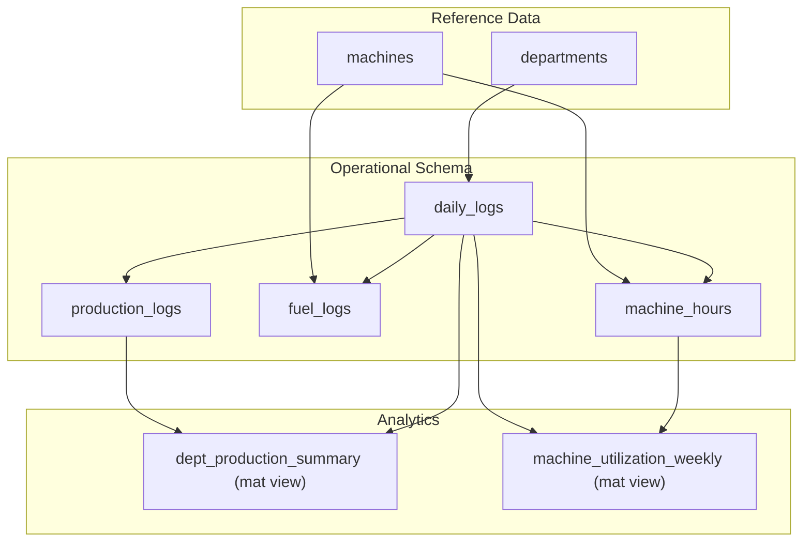
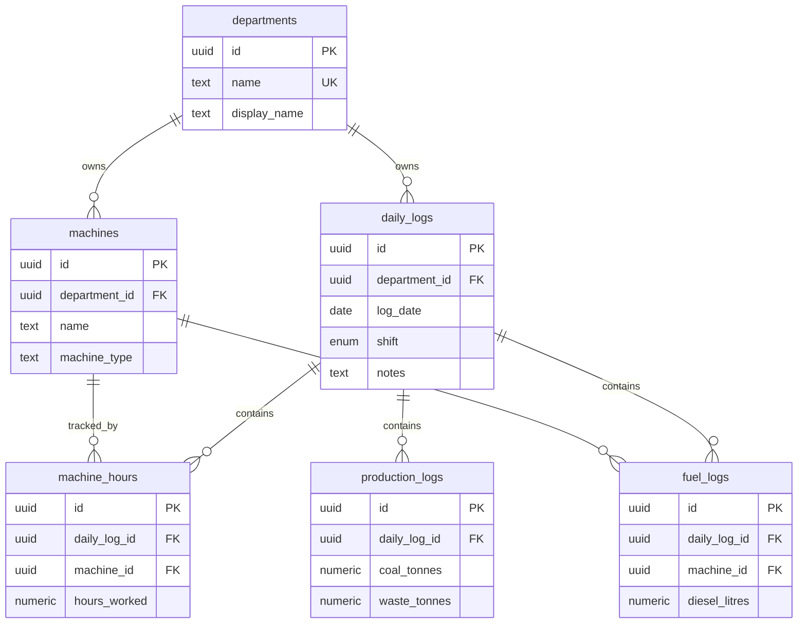
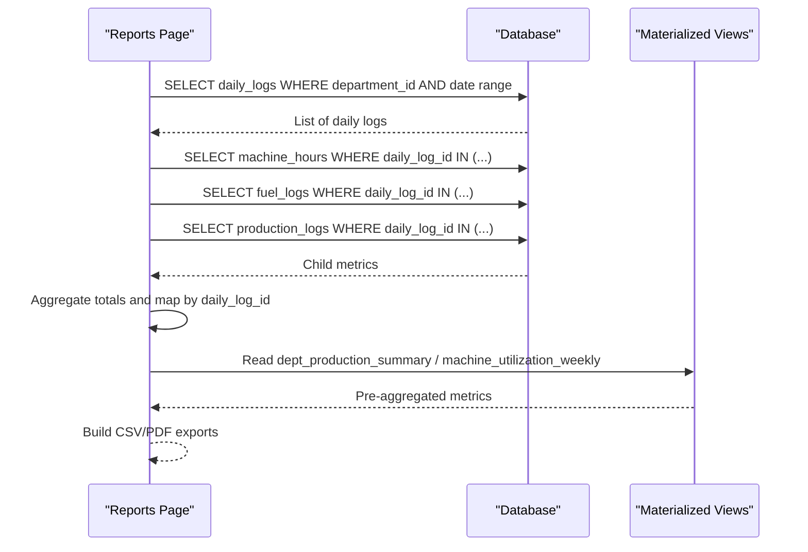
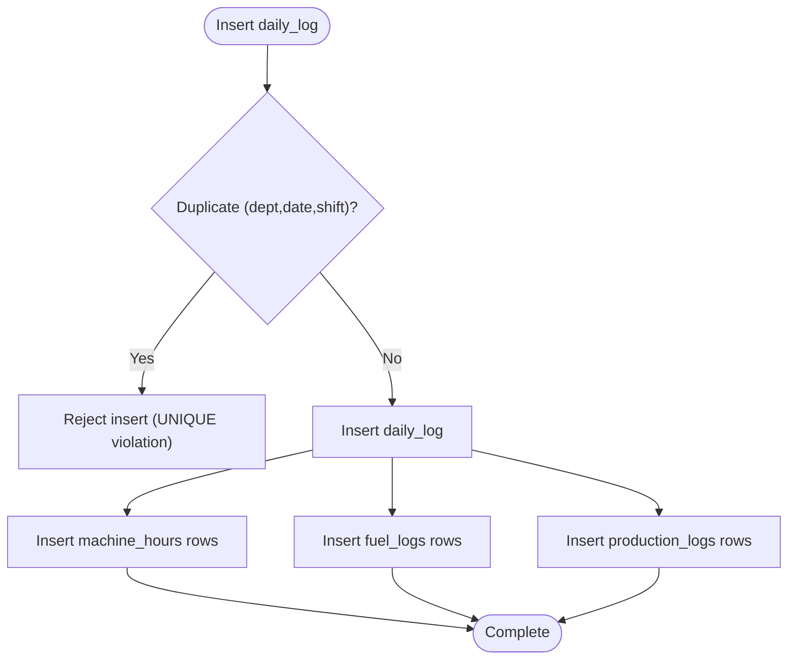

# Operational Tables

<cite>
**Referenced Files in This Document**
- [001_initial.sql](file://packages/database/migrations/001_initial.sql)
- [014_schema_refinement.sql](file://packages/database/migrations/014_schema_refinement.sql)
- [016_schema_enhancements.sql](file://packages/database/migrations/016_schema_enhancements.sql)
- [021_missing_indexes.sql](file://packages/database/migrations/021_missing_indexes.sql)
- [022_materialized_views.sql](file://packages/database/migrations/022_materialized_views.sql)
- [database-schema.md](file://wiki/concepts/database-schema.md)
- [SCHEMA.md](file://wiki/SCHEMA.md)
- [reports/page.tsx](file://apps/portal/app/(departments)/[department]/reports/page.tsx)
</cite>

## Table of Contents

1. Introduction
2. Project Structure
3. Core Components
4. Architecture Overview
5. Detailed Component Analysis
6. Dependency Analysis
7. Performance Considerations
8. Troubleshooting Guide
9. Conclusion

## Introduction

This document describes the operational data model centered on Daily Logs and its child tables: Machine Hours, Fuel Logs, and Production Logs. It explains how daily logs act as parent containers for shift-specific operational data, documents uniqueness constraints that prevent duplicate entries per department/date/shift, specifies numeric precision requirements for key fields, and provides examples of reporting queries and aggregation patterns used for production analytics.

## Project Structure

The operational schema is defined across database migrations and documented in wiki files. The core tables are created in the initial migration and later refined with precision constraints, indexes, and security policies. Materialized views provide pre-aggregated metrics for dashboards.

**Diagram sources**

- [001_initial.sql:125-303](file://packages/database/migrations/001_initial.sql#L125-L303)
- [022_materialized_views.sql:20-78](file://packages/database/migrations/022_materialized_views.sql#L20-L78)

**Section sources**

- [001_initial.sql:125-303](file://packages/database/migrations/001_initial.sql#L125-L303)
- [database-schema.md:68-89](file://wiki/concepts/database-schema.md#L68-L89)
- [SCHEMA.md:190-238](file://wiki/SCHEMA.md#L190-L238)

## Core Components

- daily_logs: Parent container for a department’s shift on a given date. Enforces uniqueness by (department_id, log_date, shift). Append-only by default; updates/deletes require explicit policies.
- machine_hours: Per-machine hours worked within a daily log context.
- fuel_logs: Diesel consumption per machine within a daily log context.
- production_logs: Coal and waste tonnage recorded per daily log.

Key relationships:

- machine_hours.daily_log_id → daily_logs.id
- fuel_logs.daily_log_id → daily_logs.id
- production_logs.daily_log_id → daily_logs.id
- machine_hours.machine_id → machines.id
- fuel_logs.machine_id → machines.id

Numeric precision:

- hours_worked: NUMERIC(10,2)
- diesel_litres: NUMERIC(10,2)
- coal_tonnes: NUMERIC(12,2)
- waste_tonnes: NUMERIC(12,2)

Uniqueness constraint:

- UNIQUE(department_id, log_date, shift) on daily_logs prevents duplicate shifts per department per day.

Security:

- Row-level security (RLS) policies restrict access to each table based on employee roles and department membership. Child tables inherit access control via joins to daily_logs.

**Section sources**

- [001_initial.sql:125-303](file://packages/database/migrations/001_initial.sql#L125-L303)
- [014_schema_refinement.sql:18-31](file://packages/database/migrations/014_schema_refinement.sql#L18-L31)
- [014_schema_refinement.sql:179-181](file://packages/database/migrations/014_schema_refinement.sql#L179-L181)
- [016_schema_enhancements.sql:34-38](file://packages/database/migrations/016_schema_enhancements.sql#L34-L38)
- [database-schema.md:68-89](file://wiki/concepts/database-schema.md#L68-L89)
- [SCHEMA.md:190-238](file://wiki/SCHEMA.md#L190-L238)

## Architecture Overview

Daily logs encapsulate shift-level operations. Each child table records specific metrics tied to a daily log. Reporting layers aggregate these metrics into summaries and utilization views.

**Diagram sources**

- [001_initial.sql:7-82](file://packages/database/migrations/001_initial.sql#L7-L82)
- [001_initial.sql:125-303](file://packages/database/migrations/001_initial.sql#L125-L303)
- [016_schema_enhancements.sql:34-38](file://packages/database/migrations/016_schema_enhancements.sql#L34-L38)

## Detailed Component Analysis

### daily_logs

- Purpose: Shift-level container for a department’s operational data.
- Constraints:
  - PRIMARY KEY(id)
  - NOT NULL(department_id, log_date, shift)
  - CHECK(shift IN ('day','night')) migrated to native ENUM type
  - UNIQUE(department_id, log_date, shift)
- Indexes:
  - Composite index optimized for dashboard queries: (department_id, log_date DESC, shift)
- Security:
  - RLS policies allow select/insert/update/delete based on role and department access.
- Audit columns:
  - created_at, updated_at, created_by, updated_by added in later refinements.

Typical usage:

- Create one row per department per calendar date and shift before recording child metrics.

**Section sources**

- [001_initial.sql:125-168](file://packages/database/migrations/001_initial.sql#L125-L168)
- [014_schema_refinement.sql:179-181](file://packages/database/migrations/014_schema_refinement.sql#L179-L181)
- [016_schema_enhancements.sql:34-38](file://packages/database/migrations/016_schema_enhancements.sql#L34-L38)
- [database-schema.md:68-89](file://wiki/concepts/database-schema.md#L68-L89)

### machine_hours

- Purpose: Records hours worked per machine within a daily log.
- Key fields:
  - daily_log_id (FK to daily_logs)
  - machine_id (FK to machines)
  - hours_worked: NUMERIC(10,2), NOT NULL, DEFAULT 0
- Indexes:
  - Composite indexes for common query patterns:
    - (machine_id, daily_log_id)
    - (daily_log_id, machine_id)
- Security:
  - RLS policies enforce access through daily_logs and employee department membership.

Aggregation example (conceptual):

- Sum hours_worked grouped by machine or by daily_log_id for shift totals.

**Section sources**

- [001_initial.sql:172-214](file://packages/database/migrations/001_initial.sql#L172-L214)
- [014_schema_refinement.sql:21-22](file://packages/database/migrations/014_schema_refinement.sql#L21-L22)
- [021_missing_indexes.sql:17-21](file://packages/database/migrations/021_missing_indexes.sql#L17-L21)

### fuel_logs

- Purpose: Tracks diesel consumption per machine within a daily log.
- Key fields:
  - daily_log_id (FK to daily_logs)
  - machine_id (FK to machines)
  - diesel_litres: NUMERIC(10,2), NOT NULL, DEFAULT 0
- Indexes:
  - Composite indexes for common query patterns:
    - (machine_id, daily_log_id)
    - (daily_log_id, machine_id)
- Security:
  - RLS policies enforce access through daily_logs and employee department membership.

Aggregation example (conceptual):

- Sum diesel_litres grouped by machine or by daily_log_id for shift totals.

**Section sources**

- [001_initial.sql:217-258](file://packages/database/migrations/001_initial.sql#L217-L258)
- [014_schema_refinement.sql:25-26](file://packages/database/migrations/014_schema_refinement.sql#L25-L26)
- [021_missing_indexes.sql:27-31](file://packages/database/migrations/021_missing_indexes.sql#L27-L31)

### production_logs

- Purpose: Records coal and waste tonnage per daily log.
- Key fields:
  - daily_log_id (FK to daily_logs)
  - coal_tonnes: NUMERIC(12,2), NOT NULL, DEFAULT 0
  - waste_tonnes: NUMERIC(12,2), NOT NULL, DEFAULT 0
- Security:
  - RLS policies enforce access through daily_logs and employee department membership.

Aggregation example (conceptual):

- Sum coal_tonnes and waste_tonnes grouped by department or by daily_log_id for shift totals.

**Section sources**

- [001_initial.sql:262-303](file://packages/database/migrations/001_initial.sql#L262-L303)
- [014_schema_refinement.sql:29-31](file://packages/database/migrations/014_schema_refinement.sql#L29-L31)

### Reporting and Aggregation Patterns

- Department report page aggregates totals from child tables and maps them back to daily logs for export and PDF generation.
- Materialized views pre-compute monthly production summaries and weekly machine utilization.

**Diagram sources**

- [reports/page.tsx](<file://apps/portal/app/(departments)/[department]/reports/page.tsx#L471-L534>)
- [022_materialized_views.sql:20-78](file://packages/database/migrations/022_materialized_views.sql#L20-L78)

**Section sources**

- [reports/page.tsx](<file://apps/portal/app/(departments)/[department]/reports/page.tsx#L471-L534>)
- [022_materialized_views.sql:20-78](file://packages/database/migrations/022_materialized_views.sql#L20-L78)

## Dependency Analysis

- Foreign keys:
  - machine_hours.daily_log_id → daily_logs.id
  - fuel_logs.daily_log_id → daily_logs.id
  - production_logs.daily_log_id → daily_logs.id
  - machine_hours.machine_id → machines.id
  - fuel_logs.machine_id → machines.id
- Unique constraint:
  - daily_logs(department_id, log_date, shift) ensures no duplicate shift entries per department per day.
- Indexes:
  - daily_logs(department_id, log_date DESC, shift) supports dashboard queries.
  - machine_hours and fuel_logs composite indexes support machine-centric aggregations over time windows.

**Diagram sources**

- [001_initial.sql:125-134](file://packages/database/migrations/001_initial.sql#L125-L134)
- [001_initial.sql:172-303](file://packages/database/migrations/001_initial.sql#L172-L303)

**Section sources**

- [001_initial.sql:125-134](file://packages/database/migrations/001_initial.sql#L125-L134)
- [014_schema_refinement.sql:179-181](file://packages/database/migrations/014_schema_refinement.sql#L179-L181)
- [021_missing_indexes.sql:17-31](file://packages/database/migrations/021_missing_indexes.sql#L17-L31)

## Performance Considerations

- Use composite indexes aligned with query patterns:
  - daily_logs(department_id, log_date DESC, shift) for dashboard lists.
  - machine_hours(machine_id, daily_log_id) and (daily_log_id, machine_id) for machine-centric reports.
  - fuel_logs(machine_id, daily_log_id) and (daily_log_id, machine_id) for fuel consumption reports.
- Prefer materialized views for heavy aggregations:
  - dept_production_summary for monthly coal/waste totals.
  - machine_utilization_weekly for 7-day hours worked and utilization percentage.
- Numeric precision:
  - hours_worked and diesel_litres at 2 decimal places.
  - coal_tonnes and waste_tonnes at 2 decimal places with higher total digits to accommodate large volumes.

[No sources needed since this section provides general guidance]

## Troubleshooting Guide

Common issues and resolutions:

- Duplicate shift entry error:
  - Symptom: Insert fails due to UNIQUE constraint on daily_logs(department_id, log_date, shift).
  - Resolution: Ensure only one daily_log exists per department per date and shift; update existing record instead of inserting duplicates.
- Access denied on child tables:
  - Symptom: RLS policy denies access to machine_hours/fuel_logs/production_logs.
  - Resolution: Verify employee role and department membership; ensure the referenced daily_log belongs to an accessible department.
- Precision mismatch:
  - Symptom: Values rejected due to NUMERIC precision limits.
  - Resolution: Round inputs to 2 decimal places for hours_worked/diesel_litres and 2 decimal places for coal_tonnes/waste_tonnes.

**Section sources**

- [001_initial.sql:125-134](file://packages/database/migrations/001_initial.sql#L125-L134)
- [014_schema_refinement.sql:18-31](file://packages/database/migrations/014_schema_refinement.sql#L18-L31)
- [014_schema_refinement.sql:315-367](file://packages/database/migrations/014_schema_refinement.sql#L315-L367)

## Conclusion

The operational data model centers on daily_logs as append-only, unique-shift containers for departmental operations. Child tables capture machine hours, fuel consumption, and production outputs with well-defined numeric precision. Composite indexes and materialized views optimize reporting and analytics workflows while RLS policies maintain secure, department-scoped access.
