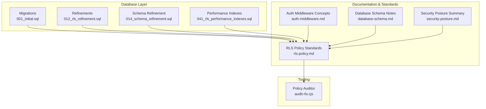
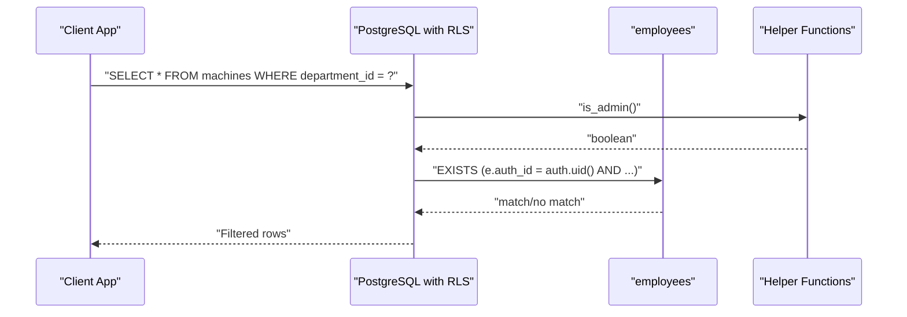
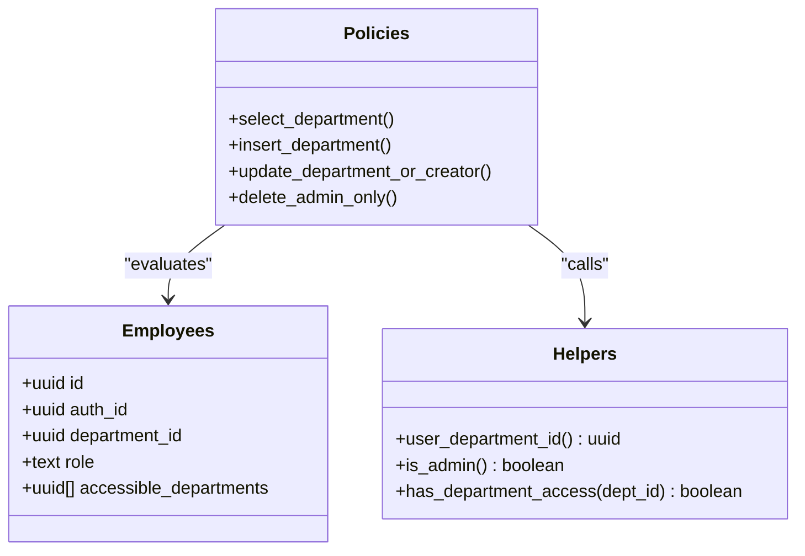
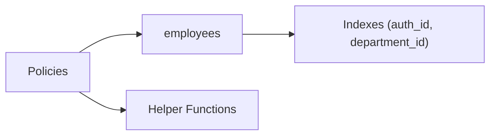

# Row Level Security Policies

<cite>
**Referenced Files in This Document**
- [001_initial.sql](file://packages/database/migrations/001_initial.sql)
- [012_rls_refinement.sql](file://packages/database/migrations/012_rls_refinement.sql)
- [014_schema_refinement.sql](file://packages/database/migrations/014_schema_refinement.sql)
- [041_rls_performance_indexes.sql](file://packages/database/migrations/041_rls_performance_indexes.sql)
- [rls-policy.md](file://wiki/concepts/rls-policy.md)
- [auth-middleware.md](file://wiki/concepts/auth-middleware.md)
- [database-schema.md](file://wiki/concepts/database-schema.md)
- [security-posture.md](file://wiki/breakdown/security-posture.md)
- [why-query-returns-empty.md](file://wiki/queries/why-query-returns-empty.md)
- [how-does-auth-work.md](file://wiki/queries/how-does-auth-work.md)
- [audit-rls.cjs](file://tools/audit-rls.cjs)
</cite>

## Table of Contents

1. Introduction
2. Project Structure
3. Core Components
4. Architecture Overview
5. Detailed Component Analysis
6. Dependency Analysis
7. Performance Considerations
8. Troubleshooting Guide
9. Conclusion

## Introduction

This document explains the Row Level Security (RLS) implementation that enforces department isolation and role-based access control across all application tables. It covers the security model, policy patterns, helper functions, cross-department access via an array field, admin bypass mechanisms, and performance considerations for debugging and optimizing RLS policies.

## Project Structure

The RLS system is implemented primarily through database migrations and supported by documentation and tooling:

- Migrations define tables, enable RLS, create policies, and add helper functions.
- Documentation codifies standards, templates, and examples.
- Tooling audits policies to catch overly permissive or missing isolation logic.

**Diagram sources**

- [001_initial.sql:1-373](file://packages/database/migrations/001_initial.sql#L1-L373)
- [012_rls_refinement.sql:1-97](file://packages/database/migrations/012_rls_refinement.sql#L1-L97)
- [014_schema_refinement.sql:1-530](file://packages/database/migrations/014_schema_refinement.sql#L1-L530)
- [041_rls_performance_indexes.sql:1-28](file://packages/database/migrations/041_rls_performance_indexes.sql#L1-L28)
- [rls-policy.md:1-150](file://wiki/concepts/rls-policy.md#L1-L150)
- [auth-middleware.md:51-82](file://wiki/concepts/auth-middleware.md#L51-L82)
- [database-schema.md:33-49](file://wiki/concepts/database-schema.md#L33-L49)
- [security-posture.md:46-77](file://wiki/breakdown/security-posture.md#L46-L77)
- [audit-rls.cjs:72-229](file://tools/audit-rls.cjs#L72-L229)

**Section sources**

- [001_initial.sql:1-373](file://packages/database/migrations/001_initial.sql#L1-L373)
- [012_rls_refinement.sql:1-97](file://packages/database/migrations/012_rls_refinement.sql#L1-L97)
- [014_schema_refinement.sql:1-530](file://packages/database/migrations/014_schema_refinement.sql#L1-L530)
- [041_rls_performance_indexes.sql:1-28](file://packages/database/migrations/041_rls_performance_indexes.sql#L1-L28)
- [rls-policy.md:1-150](file://wiki/concepts/rls-policy.md#L1-L150)
- [auth-middleware.md:51-82](file://wiki/concepts/auth-middleware.md#L51-L82)
- [database-schema.md:33-49](file://wiki/concepts/database-schema.md#L33-L49)
- [security-posture.md:46-77](file://wiki/breakdown/security-posture.md#L46-L77)
- [audit-rls.cjs:72-229](file://tools/audit-rls.cjs#L72-L229)

## Core Components

- Helper functions used by policies:
  - user_department_id(): returns the current employee’s department UUID.
  - is_admin(): checks if the current employee has the admin role.
  - has_department_access(dept_id): checks admin role, primary department, or accessible_departments array membership.
- Policy patterns:
  - SELECT: EXISTS clause joining employees with auth.uid(), allowing admin, same department, or any department in accessible_departments.
  - INSERT: WITH CHECK ensuring the new row’s department matches the user’s allowed scope.
  - UPDATE: USING similar to SELECT; some tables restrict updates to creator/admin or specific roles.
  - DELETE: Typically admin-only; omitted for append-only or audit tables.
- Cross-department access:
  - employees.accessible_departments (UUID[]) enables read/write where permitted by policy.
- Admin bypass:
  - Policies check role = 'admin' to allow full-scope operations.

Examples of policy usage are standardized and documented in the RLS standards and migration files.

**Section sources**

- [001_initial.sql:307-346](file://packages/database/migrations/001_initial.sql#L307-L346)
- [012_rls_refinement.sql:1-97](file://packages/database/migrations/012_rls_refinement.sql#L1-L97)
- [014_schema_refinement.sql:224-367](file://packages/database/migrations/014_schema_refinement.sql#L224-L367)
- [rls-policy.md:25-92](file://wiki/concepts/rls-policy.md#L25-L92)
- [auth-middleware.md:51-82](file://wiki/concepts/auth-middleware.md#L51-L82)
- [database-schema.md:33-49](file://wiki/concepts/database-schema.md#L33-L49)

## Architecture Overview

The RLS architecture centers on the employees table as the identity and authorization anchor. Policies evaluate each row against the authenticated user’s identity and department context.

**Diagram sources**

- [001_initial.sql:84-121](file://packages/database/migrations/001_initial.sql#L84-L121)
- [012_rls_refinement.sql:28-36](file://packages/database/migrations/012_rls_refinement.sql#L28-L36)
- [014_schema_refinement.sql:296-367](file://packages/database/migrations/014_schema_refinement.sql#L296-L367)
- [001_initial.sql:307-346](file://packages/database/migrations/001_initial.sql#L307-L346)

## Detailed Component Analysis

### Security Model and Roles

- Role hierarchy and permissions are enforced at the database layer via policies.
- Typical roles:
  - admin: full access across departments and admin features.
  - supervisor: read/write within department and additional management capabilities.
  - operator: read within department and limited write operations.
- Cross-department access is granted via the accessible_departments array without changing the primary department.

**Diagram sources**

- [001_initial.sql:27-69](file://packages/database/migrations/001_initial.sql#L27-L69)
- [001_initial.sql:84-121](file://packages/database/migrations/001_initial.sql#L84-L121)
- [001_initial.sql:307-346](file://packages/database/migrations/001_initial.sql#L307-L346)
- [014_schema_refinement.sql:296-367](file://packages/database/migrations/014_schema_refinement.sql#L296-L367)

**Section sources**

- [security-posture.md:46-77](file://wiki/breakdown/security-posture.md#L46-L77)
- [auth-middleware.md:72-82](file://wiki/concepts/auth-middleware.md#L72-L82)
- [how-does-auth-work.md:184-222](file://wiki/queries/how-does-auth-work.md#L184-L222)

### Helper Functions

- user_department_id(): SECURITY DEFINER function returning the current user’s department UUID.
- is_admin(): SECURITY DEFINER function checking admin role.
- has_department_access(dept_id): SECURITY DEFINER function evaluating admin, primary department, or accessible_departments.

These functions are invoked by policies to centralize access logic and ensure consistent enforcement.

**Section sources**

- [001_initial.sql:307-346](file://packages/database/migrations/001_initial.sql#L307-L346)
- [rls-policy.md:94-133](file://wiki/concepts/rls-policy.md#L94-L133)

### Policy Patterns Across Tables

- SELECT policies use EXISTS with employees join and auth.uid(), allowing admin, same department, or accessible_departments.
- INSERT policies enforce department scoping using WITH CHECK.
- UPDATE policies often mirror SELECT scope or restrict to creator/admin depending on table semantics.
- DELETE policies are typically admin-only; some tables omit delete policies for append-only or audit scenarios.

Examples include:

- departments: active-only select policy.
- employees: self-or-admin select/update; admin-only insert.
- machines: department-scoped select; admin/supervisor insert/update.
- daily_logs: department-scoped select/insert; update/delete restrictions.
- machine_hours/fuel_logs/production_logs: parent daily_log-based update/delete controls.

**Section sources**

- [012_rls_refinement.sql:12-50](file://packages/database/migrations/012_rls_refinement.sql#L12-L50)
- [001_initial.sql:17-22](file://packages/database/migrations/001_initial.sql#L17-L22)
- [001_initial.sql:37-69](file://packages/database/migrations/001_initial.sql#L37-L69)
- [001_initial.sql:84-121](file://packages/database/migrations/001_initial.sql#L84-L121)
- [001_initial.sql:136-166](file://packages/database/migrations/001_initial.sql#L136-L166)
- [001_initial.sql:181-197](file://packages/database/migrations/001_initial.sql#L181-L197)
- [014_schema_refinement.sql:296-367](file://packages/database/migrations/014_schema_refinement.sql#L296-L367)

### Cross-Department Access via accessible_departments

- The employees.accessible_departments array allows users to view data in multiple departments without changing their primary department.
- Policies check department_id = ANY(accessible_departments) alongside admin and primary department conditions.

**Section sources**

- [database-schema.md:33-49](file://wiki/concepts/database-schema.md#L33-L49)
- [auth-middleware.md:80-82](file://wiki/concepts/auth-middleware.md#L80-L82)
- [001_initial.sql:90-99](file://packages/database/migrations/001_initial.sql#L90-L99)
- [001_initial.sql:142-151](file://packages/database/migrations/001_initial.sql#L142-L151)

### Admin Bypass Mechanisms

- Policies frequently check role = 'admin' to grant full-scope access.
- Some operations (e.g., delete) are restricted to admin-only via explicit policies.

**Section sources**

- [001_initial.sql:112-121](file://packages/database/migrations/001_initial.sql#L112-L121)
- [014_schema_refinement.sql:228-270](file://packages/database/migrations/014_schema_refinement.sql#L228-L270)

### Example Policies by Operation and Role

- SELECT:
  - Department-scoped with admin and accessible_departments support.
- INSERT:
  - Restricted to admin/supervisor or department-scoped based on table.
- UPDATE:
  - Mirrors SELECT scope or restricts to creator/admin.
- DELETE:
  - Admin-only; omitted for append-only or audit tables.

For concrete examples, see the referenced migration sections and standards template.

**Section sources**

- [rls-policy.md:40-92](file://wiki/concepts/rls-policy.md#L40-L92)
- [001_initial.sql:84-121](file://packages/database/migrations/001_initial.sql#L84-L121)
- [014_schema_refinement.sql:296-367](file://packages/database/migrations/014_schema_refinement.sql#L296-L367)

## Dependency Analysis

Policies depend on:

- employees table for identity and department context.
- Helper functions for centralized checks.
- indexes for performance (see Performance section).

**Diagram sources**

- [001_initial.sql:307-346](file://packages/database/migrations/001_initial.sql#L307-L346)
- [041_rls_performance_indexes.sql:14-27](file://packages/database/migrations/041_rls_performance_indexes.sql#L14-L27)

**Section sources**

- [001_initial.sql:307-346](file://packages/database/migrations/001_initial.sql#L307-L346)
- [041_rls_performance_indexes.sql:1-28](file://packages/database/migrations/041_rls_performance_indexes.sql#L1-L28)

## Performance Considerations

- Root cause of slowness: RLS functions like has_department_access() execute per-row checks against employees(auth_id). Without an index, this causes sequential scans.
- Critical indexes added:
  - employees(auth_id) — stops full table scan inside RLS policy.
  - departments(name) — middleware slug lookup optimization.
  - employees(department_id) — department-scoped employee queries.
- Additional composite indexes exist for common dashboard query patterns to improve filtering and sorting.

Recommendations:

- Always ensure indexes on columns referenced in RLS EXISTS clauses.
- Prefer helper functions to reduce duplication and maintain consistency.
- Use soft-delete filters consistently to avoid scanning deleted rows.

**Section sources**

- [041_rls_performance_indexes.sql:1-28](file://packages/database/migrations/041_rls_performance_indexes.sql#L1-L28)
- [014_schema_refinement.sql:144-221](file://packages/database/migrations/014_schema_refinement.sql#L144-L221)

## Troubleshooting Guide

Common issues and diagnostics:

- Empty results under normal client but not service role indicate RLS filtering.
- Verify accessible_departments contains the target department UUIDs.
- Check whether the user’s employee record exists and role is correct.
- Confirm migrations are applied and RLS enabled in production.
- Investigate missing indexes causing timeouts or slow queries.

Useful checks:

- Evaluate helper functions directly in SQL Editor.
- Review policy definitions for unintended permissiveness (USING true/WITH CHECK true).
- Run the policy auditor to detect suspicious policies.

**Section sources**

- [why-query-returns-empty.md:168-242](file://wiki/queries/why-query-returns-empty.md#L168-L242)
- [how-does-auth-work.md:226-252](file://wiki/queries/how-does-auth-work.md#L226-L252)
- [audit-rls.cjs:189-229](file://tools/audit-rls.cjs#L189-L229)

## Conclusion

The RLS system provides robust department isolation and role-based access control through consistent policy patterns and helper functions. Cross-department access is supported via an array field, while admin bypass ensures necessary administrative capabilities. Proper indexing and auditing tools help maintain performance and security posture. Adhering to the documented standards and templates ensures scalable and secure evolution of the system.
