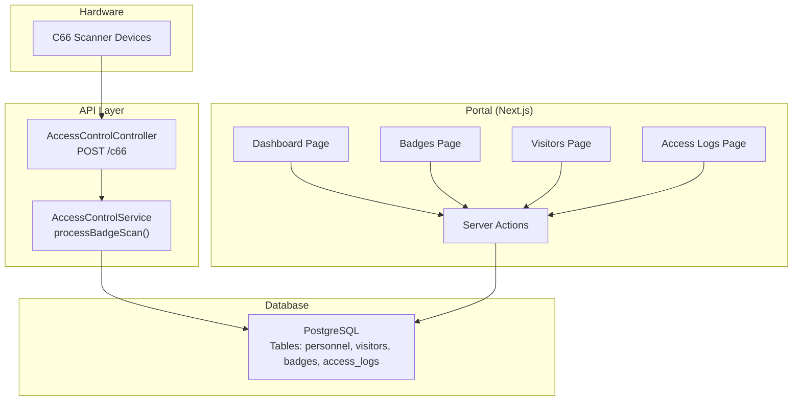
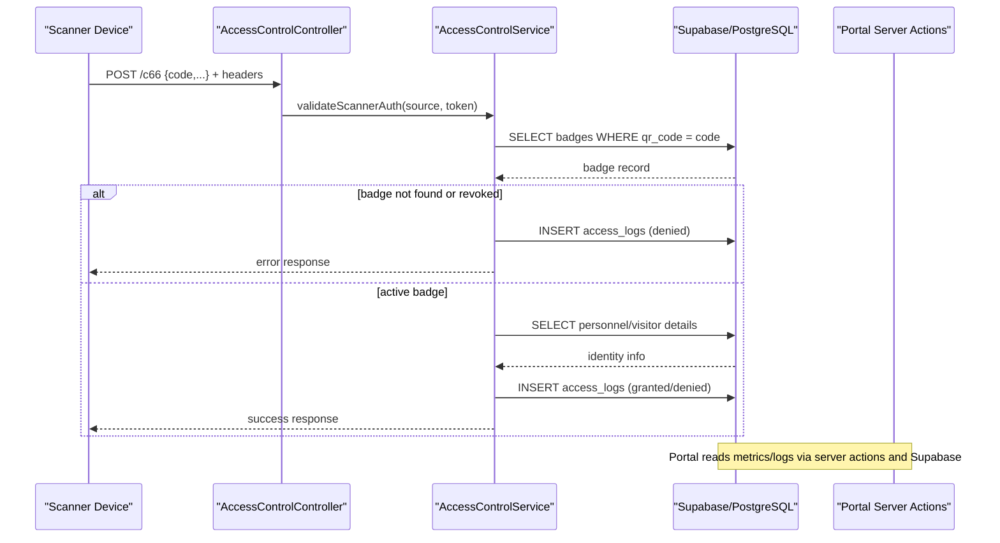
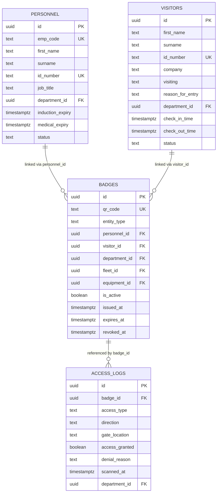
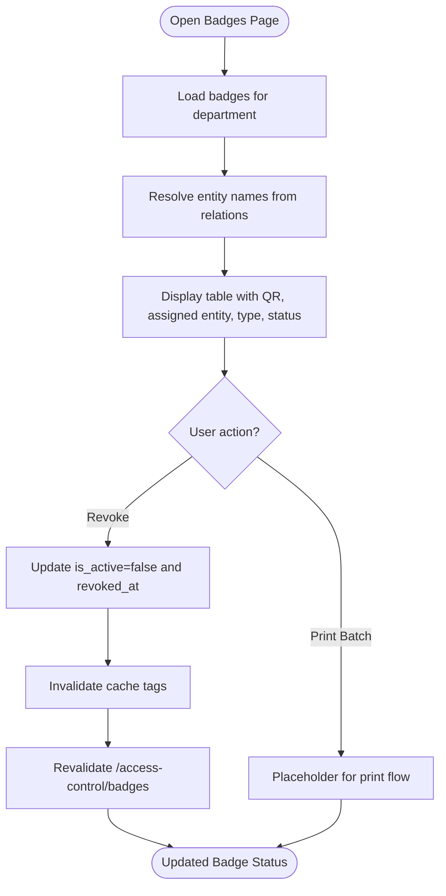
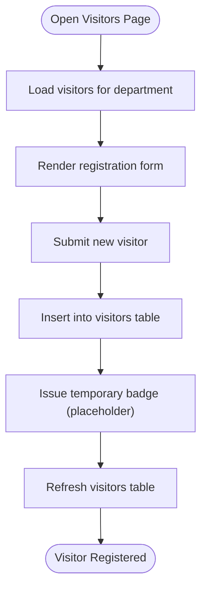
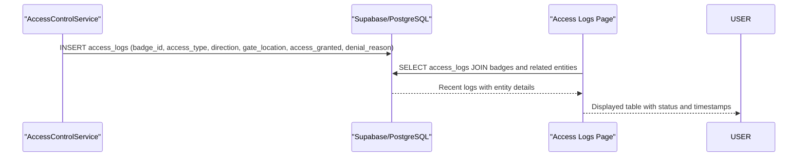
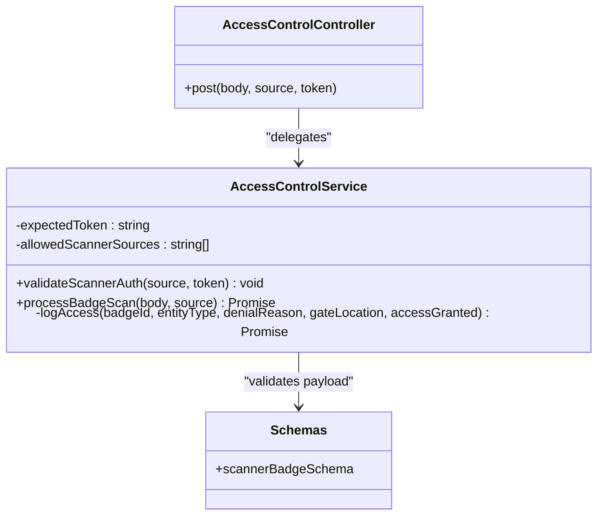
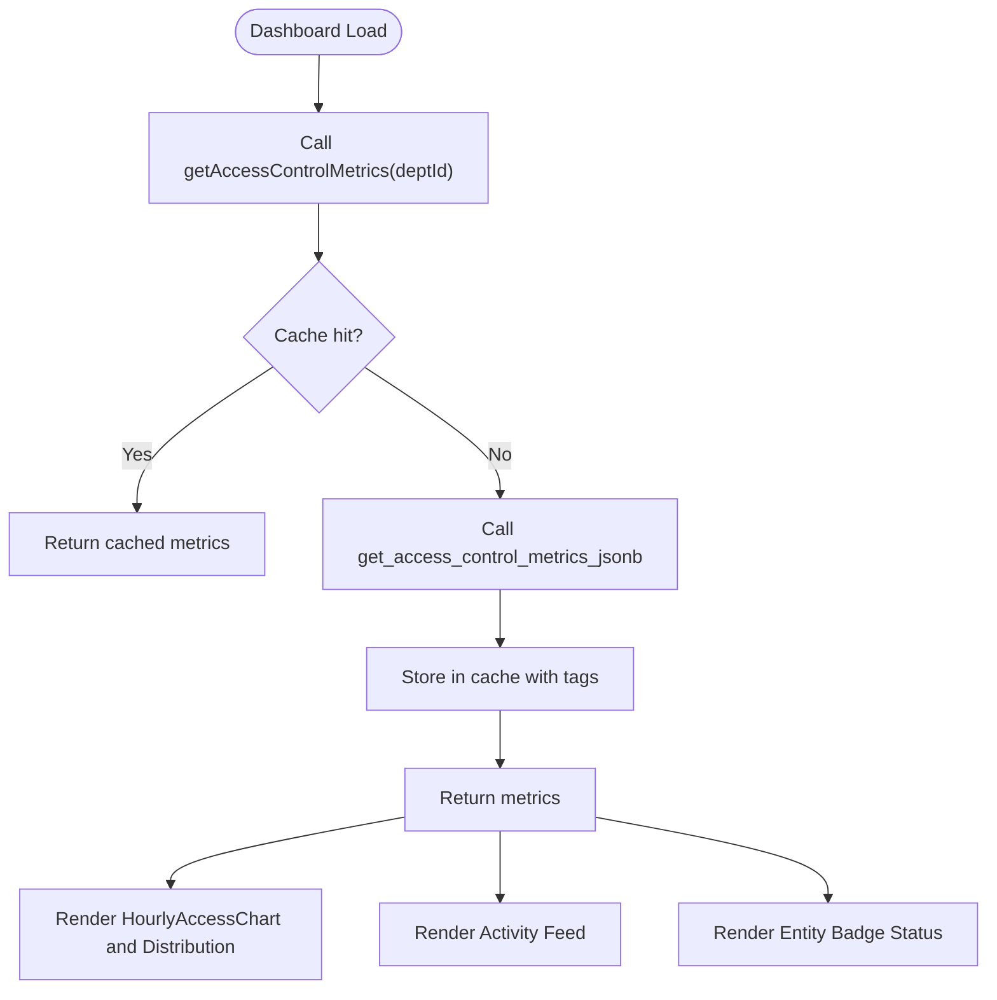
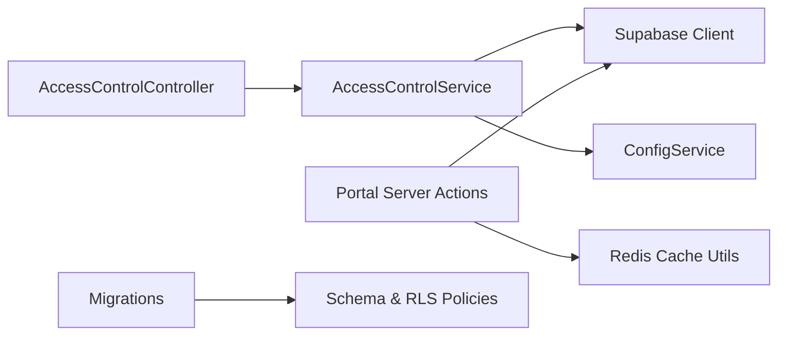
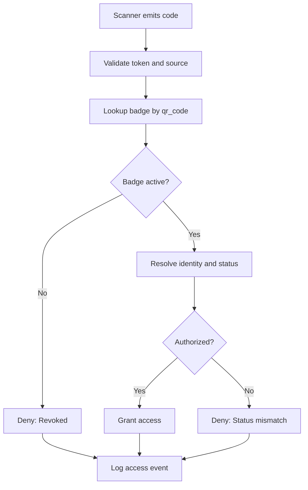

# Access Control Department

<cite>
**Referenced Files in This Document**
- [028_access_control_system.sql](file://packages/database/migrations/028_access_control_system.sql)
- [034_access_control_schema_updates.sql](file://packages/database/migrations/034_access_control_schema_updates.sql)
- [access-control.service.ts](file://apps/api/src/access-control/access-control.service.ts)
- [access-control.controller.ts](file://apps/api/src/access-control/access-control.controller.ts)
- [schemas.ts (portal)](file://apps/portal/lib/api/schemas.ts)
- [schemas.ts (api)](file://apps/api/src/common/schemas.ts)
- [page.tsx (dashboard)](file://apps/portal/app/(departments)/access-control/page.tsx)
- [actions.ts](file://apps/portal/app/(departments)/access-control/actions.ts)
- [page.tsx (badges)](file://apps/portal/app/(departments)/access-control/badges/page.tsx)
- [page.tsx (visitors)](file://apps/portal/app/(departments)/access-control/visitors/page.tsx)
- [page.tsx (access logs)](file://apps/portal/app/(departments)/access-control/access-logs/page.tsx)
- [DashboardActivityFeed.tsx](file://apps/portal/app/(departments)/access-control/components/DashboardActivityFeed.tsx)
- [route.ts (c66 Next.js API)](file://apps/portal/app/api/c66/route.ts)
- [access-control-department.md](file://wiki/entities/access-control-department.md)
</cite>

## Table of Contents

1. Introduction
2. Project Structure
3. Core Components
4. Architecture Overview
5. Detailed Component Analysis
6. Dependency Analysis
7. Performance Considerations
8. Troubleshooting Guide
9. Conclusion
10. Appendices

## Introduction

This document provides comprehensive documentation for the Access Control department system within the project. It covers badge management workflows, visitor tracking, security logs and audit trails, QR code integration, data models, permission hierarchies, real-time monitoring capabilities, badge issuance processes, visitor registration workflow, security incident reporting, hardware integrations, and compliance reporting features. The system integrates a web portal for administration and dashboards with an API layer that accepts scanner events from hardware devices.

## Project Structure

The Access Control feature spans:

- Database migrations defining core tables and Row Level Security policies
- A NestJS API service handling hardware scanner events
- A Next.js portal providing dashboards, badge management, visitor management, and access logs
- Shared schemas for validating scanner payloads

**Diagram sources**

- [access-control.controller.ts:1-25](file://apps/api/src/access-control/access-control.controller.ts#L1-L25)
- [access-control.service.ts:1-135](file://apps/api/src/access-control/access-control.service.ts#L1-L135)
- [page.tsx (dashboard)](<file://apps/portal/app/(departments)/access-control/page.tsx#L1-L120>)
- [actions.ts](<file://apps/portal/app/(departments)/access-control/actions.ts#L1-L446>)
- [page.tsx (badges)](<file://apps/portal/app/(departments)/access-control/badges/page.tsx#L1-L209>)
- [page.tsx (visitors)](<file://apps/portal/app/(departments)/access-control/visitors/page.tsx#L1-L222>)
- [page.tsx (access logs)](<file://apps/portal/app/(departments)/access-control/access-logs/page.tsx#L1-L102>)
- [028_access_control_system.sql:1-93](file://packages/database/migrations/028_access_control_system.sql#L1-L93)
- [034_access_control_schema_updates.sql:1-140](file://packages/database/migrations/034_access_control_schema_updates.sql#L1-L140)

**Section sources**

- [access-control.controller.ts:1-25](file://apps/api/src/access-control/access-control.controller.ts#L1-L25)
- [access-control.service.ts:1-135](file://apps/api/src/access-control/access-control.service.ts#L1-L135)
- [page.tsx (dashboard)](<file://apps/portal/app/(departments)/access-control/page.tsx#L1-L120>)
- [actions.ts](<file://apps/portal/app/(departments)/access-control/actions.ts#L1-L446>)
- [page.tsx (badges)](<file://apps/portal/app/(departments)/access-control/badges/page.tsx#L1-L209>)
- [page.tsx (visitors)](<file://apps/portal/app/(departments)/access-control/visitors/page.tsx#L1-L222>)
- [page.tsx (access logs)](<file://apps/portal/app/(departments)/access-control/access-logs/page.tsx#L1-L102>)
- [028_access_control_system.sql:1-93](file://packages/database/migrations/028_access_control_system.sql#L1-L93)
- [034_access_control_schema_updates.sql:1-140](file://packages/database/migrations/034_access_control_schema_updates.sql#L1-L140)

## Core Components

- Badge Management: CRUD and status operations for QR-based credentials linked to entities (personnel, visitors, fleet, equipment). Includes revocation and listing by department.
- Visitor Tracking: Registration form and table view for visitors with check-in/out timestamps and statuses.
- Access Logs and Audit Trails: Real-time and historical records of scan events including direction, gate location, and denial reasons.
- Hardware Integration: Secure endpoint accepting scanner payloads with token validation and source allowlisting.
- Dashboard and Monitoring: KPIs, charts, activity feed, and entity badge status aggregated via server actions and database RPCs.

Key implementation references:

- Badge listing and revocation: [getBadgesForDepartment](<file://apps/portal/app/(departments)/access-control/actions.ts#L397-L420>), [\_revokeBadge](<file://apps/portal/app/(departments)/access-control/actions.ts#L378-L395>)
- Visitor listing: [getVisitorsForDepartment](<file://apps/portal/app/(departments)/access-control/actions.ts#L422-L445>)
- Access logs query: [Access Logs page](<file://apps/portal/app/(departments)/access-control/access-logs/page.tsx#L1-L102>)
- Scanner processing: [AccessControlService.processBadgeScan:33-110](file://apps/api/src/access-control/access-control.service.ts#L33-L110)

**Section sources**

- [actions.ts](<file://apps/portal/app/(departments)/access-control/actions.ts#L1-L446>)
- [page.tsx (badges)](<file://apps/portal/app/(departments)/access-control/badges/page.tsx#L1-L209>)
- [page.tsx (visitors)](<file://apps/portal/app/(departments)/access-control/visitors/page.tsx#L1-L222>)
- [page.tsx (access logs)](<file://apps/portal/app/(departments)/access-control/access-logs/page.tsx#L1-L102>)
- [access-control.service.ts:1-135](file://apps/api/src/access-control/access-control.service.ts#L1-L135)

## Architecture Overview

The system uses a layered architecture:

- Hardware scanners send POST requests to the API controller with required headers and payload.
- The controller delegates to the service which validates input, checks badge state, resolves identity, and writes access logs.
- The portal provides administrative UIs and dashboards using server actions and Supabase client calls.
- Database schema enforces constraints and RLS policies scoped by roles and departments.

**Diagram sources**

- [access-control.controller.ts:1-25](file://apps/api/src/access-control/access-control.controller.ts#L1-L25)
- [access-control.service.ts:1-135](file://apps/api/src/access-control/access-control.service.ts#L1-L135)
- [actions.ts](<file://apps/portal/app/(departments)/access-control/actions.ts#L1-L446>)
- [028_access_control_system.sql:1-93](file://packages/database/migrations/028_access_control_system.sql#L1-L93)

## Detailed Component Analysis

### Data Models and Permission Hierarchies

Core tables and relationships:

- personnel: Employee registry with department linkage and expiry fields
- visitors: Visitor registry with name split, ID number, reason for entry, and department linkage
- badges: QR credential mapping to entities; supports multiple entity types and department scoping
- access_logs: Immutable log of access attempts with direction, gate location, and denial reasons

Indexes and performance:

- Unique index on badges.qr_code for fast lookup
- Indexes on access_logs.scanned_at and access_logs.gate_location for efficient queries

Row Level Security (RLS):

- Read/write policies restrict access to authenticated users with roles admin or access_control
- Additional policies allow department-scoped read access for badges based on employee.department_id

**Diagram sources**

- [028_access_control_system.sql:1-93](file://packages/database/migrations/028_access_control_system.sql#L1-L93)
- [034_access_control_schema_updates.sql:1-140](file://packages/database/migrations/034_access_control_schema_updates.sql#L1-L140)

**Section sources**

- [028_access_control_system.sql:1-93](file://packages/database/migrations/028_access_control_system.sql#L1-L93)
- [034_access_control_schema_updates.sql:1-140](file://packages/database/migrations/034_access_control_schema_updates.sql#L1-L140)

### Badge Issuance and Management Workflow

- Listing badges per department includes relations to personnel, visitors, fleet, and equipment.
- Revoking a badge updates is_active and revoked_at, invalidates cache tags, and revalidates the badges path.
- The Badges page provides a UI to list active badges and placeholders for QR preview/printing.

**Diagram sources**

- [page.tsx (badges)](<file://apps/portal/app/(departments)/access-control/badges/page.tsx#L1-L209>)
- [actions.ts](<file://apps/portal/app/(departments)/access-control/actions.ts#L378-L420>)

**Section sources**

- [page.tsx (badges)](<file://apps/portal/app/(departments)/access-control/badges/page.tsx#L1-L209>)
- [actions.ts](<file://apps/portal/app/(departments)/access-control/actions.ts#L378-L420>)

### Visitor Registration and Tracking Workflow

- Visitors page includes a registration form and a table showing today’s visitors with status and timestamps.
- Server action retrieves visitors filtered by department and orders by check-in time.

**Diagram sources**

- [page.tsx (visitors)](<file://apps/portal/app/(departments)/access-control/visitors/page.tsx#L1-L222>)
- [actions.ts](<file://apps/portal/app/(departments)/access-control/actions.ts#L422-L445>)

**Section sources**

- [page.tsx (visitors)](<file://apps/portal/app/(departments)/access-control/visitors/page.tsx#L1-L222>)
- [actions.ts](<file://apps/portal/app/(departments)/access-control/actions.ts#L422-L445>)

### Access Logs and Audit Trails

- Access logs are written whenever a scanner event is processed, capturing whether access was granted or denied and reasons for denial.
- The Access Logs page displays recent entries with resolved entity names and statuses.

**Diagram sources**

- [access-control.service.ts:112-133](file://apps/api/src/access-control/access-control.service.ts#L112-L133)
- [page.tsx (access logs)](<file://apps/portal/app/(departments)/access-control/access-logs/page.tsx#L1-L102>)

**Section sources**

- [access-control.service.ts:112-133](file://apps/api/src/access-control/access-control.service.ts#L112-L133)
- [page.tsx (access logs)](<file://apps/portal/app/(departments)/access-control/access-logs/page.tsx#L1-L102>)

### QR Code Integration and Hardware Scanning

- Scanner payloads are validated against shared schemas supporting multiple field names for codes and optional metadata like access_type, gate_location, operator, alcohol_tested, device_id, and direction.
- The API controller requires a scanner token header and optionally validates the scanner source against an allowlist.
- The service resolves the badge, checks activation, determines authorization based on entity status, and logs the result.

**Diagram sources**

- [access-control.controller.ts:1-25](file://apps/api/src/access-control/access-control.controller.ts#L1-L25)
- [access-control.service.ts:1-135](file://apps/api/src/access-control/access-control.service.ts#L1-L135)
- [schemas.ts (api):80-96](file://apps/api/src/common/schemas.ts#L80-L96)
- [schemas.ts (portal):70-82](file://apps/portal/lib/api/schemas.ts#L70-L82)

**Section sources**

- [access-control.controller.ts:1-25](file://apps/api/src/access-control/access-control.controller.ts#L1-L25)
- [access-control.service.ts:1-135](file://apps/api/src/access-control/access-control.service.ts#L1-L135)
- [schemas.ts (api):80-96](file://apps/api/src/common/schemas.ts#L80-L96)
- [schemas.ts (portal):70-82](file://apps/portal/lib/api/schemas.ts#L70-L82)

### Real-Time Monitoring and Dashboards

- The dashboard aggregates metrics via a database RPC and caches results with Redis tags for performance.
- Charts include hourly access stats and badge status distribution.
- Activity feed shows recent access events with icons and status badges.

**Diagram sources**

- [page.tsx (dashboard)](<file://apps/portal/app/(departments)/access-control/page.tsx#L1-L120>)
- [actions.ts](<file://apps/portal/app/(departments)/access-control/actions.ts#L90-L140>)
- [DashboardActivityFeed.tsx](<file://apps/portal/app/(departments)/access-control/components/DashboardActivityFeed.tsx#L1-L117>)

**Section sources**

- [page.tsx (dashboard)](<file://apps/portal/app/(departments)/access-control/page.tsx#L1-L120>)
- [actions.ts](<file://apps/portal/app/(departments)/access-control/actions.ts#L90-L140>)
- [DashboardActivityFeed.tsx](<file://apps/portal/app/(departments)/access-control/components/DashboardActivityFeed.tsx#L1-L117>)

### Security Incident Reporting

- Denial reasons captured in access_logs enable incident detection (e.g., expired credentials, tailgate alerts).
- The activity feed highlights critical statuses with distinct icons and color coding.

Implementation references:

- Denial reason classification in activity feed: [DashboardActivityFeed.tsx](<file://apps/portal/app/(departments)/access-control/components/DashboardActivityFeed.tsx#L24-L29>)
- Status mapping in actions: [getRecentAccessActivity](<file://apps/portal/app/(departments)/access-control/actions.ts#L183-L192>)

**Section sources**

- [DashboardActivityFeed.tsx](<file://apps/portal/app/(departments)/access-control/components/DashboardActivityFeed.tsx#L1-L117>)
- [actions.ts](<file://apps/portal/app/(departments)/access-control/actions.ts#L183-L192>)

## Dependency Analysis

- Controller depends on service for business logic and configuration.
- Service depends on Supabase client and config for scanner authentication and logging.
- Portal server actions depend on Supabase client and caching utilities.
- Migrations define schema and RLS policies enforcing role-based access.

**Diagram sources**

- [access-control.controller.ts:1-25](file://apps/api/src/access-control/access-control.controller.ts#L1-L25)
- [access-control.service.ts:1-135](file://apps/api/src/access-control/access-control.service.ts#L1-L135)
- [actions.ts](<file://apps/portal/app/(departments)/access-control/actions.ts#L1-L446>)
- [028_access_control_system.sql:1-93](file://packages/database/migrations/028_access_control_system.sql#L1-L93)
- [034_access_control_schema_updates.sql:1-140](file://packages/database/migrations/034_access_control_schema_updates.sql#L1-L140)

**Section sources**

- [access-control.controller.ts:1-25](file://apps/api/src/access-control/access-control.controller.ts#L1-L25)
- [access-control.service.ts:1-135](file://apps/api/src/access-control/access-control.service.ts#L1-L135)
- [actions.ts](<file://apps/portal/app/(departments)/access-control/actions.ts#L1-L446>)
- [028_access_control_system.sql:1-93](file://packages/database/migrations/028_access_control_system.sql#L1-L93)
- [034_access_control_schema_updates.sql:1-140](file://packages/database/migrations/034_access_control_schema_updates.sql#L1-L140)

## Performance Considerations

- Caching: Metrics and distributions are cached with Redis tags keyed by department and table dependencies to reduce database load.
- Indexes: Optimized indexes on badges.qr_code, access_logs.scanned_at, and access_logs.gate_location improve scanning and querying performance.
- Aggregation: Hourly access stats are computed in-memory after fetching daily logs to avoid complex SQL aggregation overhead.

[No sources needed since this section provides general guidance]

## Troubleshooting Guide

Common issues and resolutions:

- Unauthorized scanner token: Ensure x-scanner-token matches configured SCANNER_API_KEY.
- Unauthorized scanner source: Verify x-scanner-source is included in ALLOWED_SCANNER_SOURCES.
- Empty code payload: Validate scanner payload contains one of the supported code fields.
- Unrecognized badge: Confirm qr_code exists in badges table and is active.
- Revoked badge: Check is_active flag and revoked_at timestamp.

Implementation references:

- Token and source validation: [AccessControlService.validateScannerAuth:23-31](file://apps/api/src/access-control/access-control.service.ts#L23-L31)
- Payload parsing and errors: [AccessControlService.processBadgeScan:33-67](file://apps/api/src/access-control/access-control.service.ts#L33-L67)
- Next.js API route tests for scanner auth: [route.test.ts:85-136](file://apps/portal/app/api/c66/route.test.ts#L85-L136)

**Section sources**

- [access-control.service.ts:23-67](file://apps/api/src/access-control/access-control.service.ts#L23-L67)
- [route.test.ts:85-136](file://apps/portal/app/api/c66/route.test.ts#L85-L136)

## Conclusion

The Access Control department system provides robust badge management, visitor tracking, secure hardware integration, and comprehensive auditing through detailed access logs. Role-based permissions and department scoping ensure data isolation and security. The dashboard offers actionable insights and real-time visibility into site access patterns. Future enhancements can expand QR generation and printing workflows, integrate additional sensors, and enrich incident reporting with automated alerts.

[No sources needed since this section summarizes without analyzing specific files]

## Appendices

### Compliance Reporting Features

- Access logs capture all scan events with timestamps, locations, and outcomes suitable for audits.
- RLS policies enforce least privilege access to sensitive data.
- Badge lifecycle (issued, active, revoked) is fully tracked for accountability.

References:

- Access logs schema and indexes: [028_access_control_system.sql:45-61](file://packages/database/migrations/028_access_control_system.sql#L45-L61)
- RLS policies for access control roles: [028_access_control_system.sql:69-92](file://packages/database/migrations/028_access_control_system.sql#L69-L92)
- Expanded badges and visitors schema with department scoping: [034_access_control_schema_updates.sql:1-140](file://packages/database/migrations/034_access_control_schema_updates.sql#L1-L140)

**Section sources**

- [028_access_control_system.sql:45-92](file://packages/database/migrations/028_access_control_system.sql#L45-L92)
- [034_access_control_schema_updates.sql:1-140](file://packages/database/migrations/034_access_control_schema_updates.sql#L1-L140)

### Conceptual Overview

The conceptual workflow for badge scanning and access decisions involves:

- Scanner sends code and metadata
- System validates token and source
- System looks up badge and checks activation
- System resolves identity and evaluates authorization rules
- System logs outcome and returns decision

[No sources needed since this diagram shows conceptual workflow, not actual code structure]

### Related Documentation

- Access Control Department overview and completeness status: [access-control-department.md:1-72](file://wiki/entities/access-control-department.md#L1-L72)

**Section sources**

- [access-control-department.md:1-72](file://wiki/entities/access-control-department.md#L1-L72)
