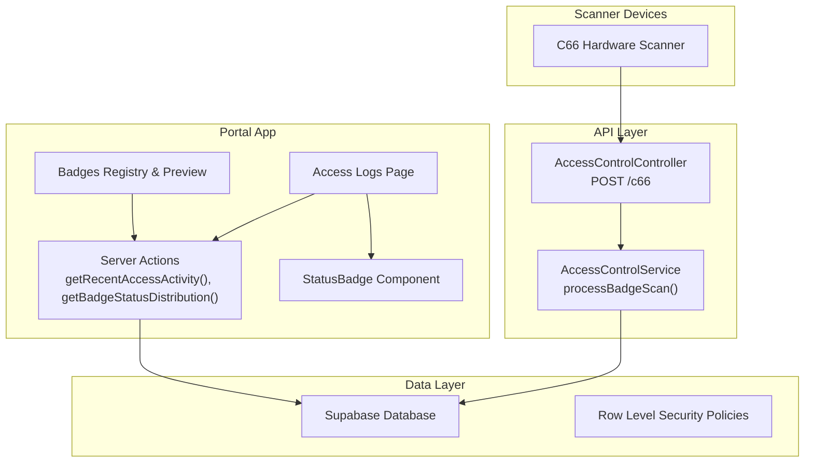
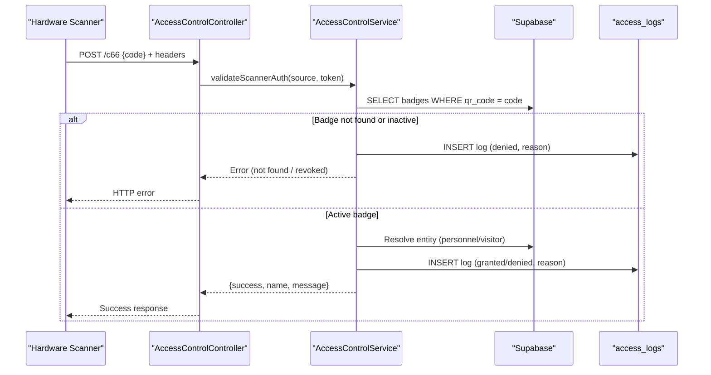
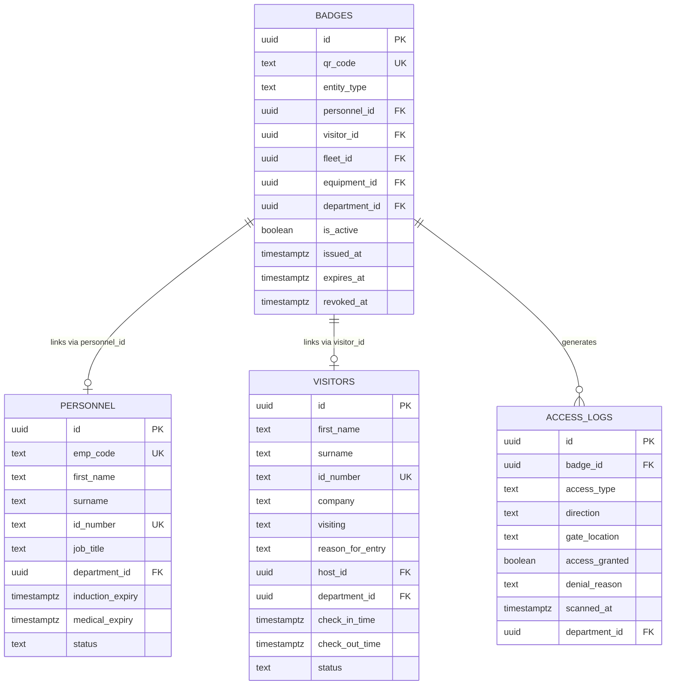
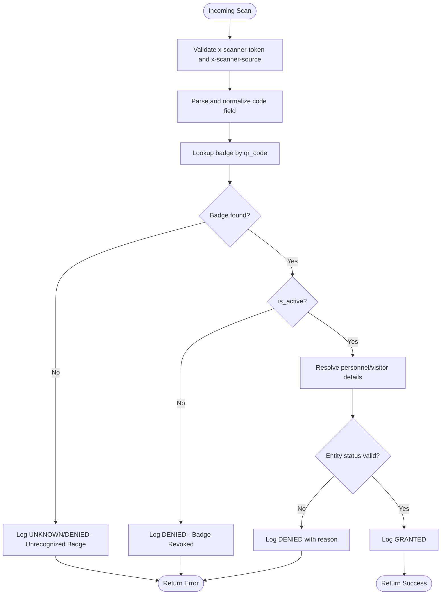
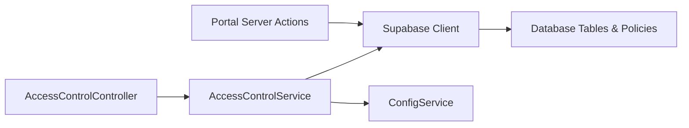

# Badge Management System

<cite>
**Referenced Files in This Document**
- [access-control.service.ts](file://apps/api/src/access-control/access-control.service.ts)
- [access-control.controller.ts](file://apps/api/src/access-control/access-control.controller.ts)
- [actions.ts](file://apps/portal/app/(departments)/access-control/actions.ts)
- [028_access_control_system.sql](file://packages/database/migrations/028_access_control_system.sql)
- [034_access_control_schema_updates.sql](file://packages/database/migrations/034_access_control_schema_updates.sql)
- [040_access_control_production_fixes.sql](file://packages/database/migrations/040_access_control_production_fixes.sql)
- [044_access_control_dashboard.sql](file://packages/database/migrations/044_access_control_dashboard.sql)
- [055_access_control_metrics_rpc.sql](file://packages/database/migrations/055_access_control_metrics_rpc.sql)
- [StatusBadge.tsx](file://apps/portal/features/access-control/components/StatusBadge.tsx)
- [page.tsx (Access Logs)](file://apps/portal/app/(departments)/access-control/access-logs/page.tsx)
- [page.tsx (Badges)](file://apps/portal/app/(departments)/access-control/badges/page.tsx)
</cite>

## Table of Contents

1. [Introduction](#introduction)
2. [Project Structure](#project-structure)
3. [Core Components](#core-components)
4. [Architecture Overview](#architecture-overview)
5. [Detailed Component Analysis](#detailed-component-analysis)
6. [Dependency Analysis](#dependency-analysis)
7. [Performance Considerations](#performance-considerations)
8. [Troubleshooting Guide](#troubleshooting-guide)
9. [Conclusion](#conclusion)
10. [Appendices](#appendices)

## Introduction

This document describes the badge management system used for access control and identity verification across personnel, visitors, vehicles, and equipment. It covers:

- Badge issuance workflows and lifecycle states
- Status tracking and real-time updates
- Data model including entity associations and expiration handling
- QR code generation and printing integration points
- Scanning, validation, and logging flows
- The StatusBadge UI component and its role in dashboards

## Project Structure

The badge system spans a NestJS API service for scanner ingestion, a Next.js portal for administration and monitoring, and database migrations defining the schema and policies.

**Diagram sources**

- [access-control.controller.ts:1-24](file://apps/api/src/access-control/access-control.controller.ts#L1-L24)
- [access-control.service.ts:1-135](file://apps/api/src/access-control/access-control.service.ts#L1-L135)
- [actions.ts](<file://apps/portal/app/(departments)/access-control/actions.ts#L1-L446>)
- [028_access_control_system.sql:1-67](file://packages/database/migrations/028_access_control_system.sql#L1-L67)
- [034_access_control_schema_updates.sql:1-140](file://packages/database/migrations/034_access_control_schema_updates.sql#L1-L140)
- [040_access_control_production_fixes.sql:1-20](file://packages/database/migrations/040_access_control_production_fixes.sql#L1-L20)
- [044_access_control_dashboard.sql:31-64](file://packages/database/migrations/044_access_control_dashboard.sql#L31-L64)
- [055_access_control_metrics_rpc.sql:49-90](file://packages/database/migrations/055_access_control_metrics_rpc.sql#L49-L90)

**Section sources**

- [access-control.controller.ts:1-24](file://apps/api/src/access-control/access-control.controller.ts#L1-L24)
- [access-control.service.ts:1-135](file://apps/api/src/access-control/access-control.service.ts#L1-L135)
- [actions.ts](<file://apps/portal/app/(departments)/access-control/actions.ts#L1-L446>)
- [028_access_control_system.sql:1-67](file://packages/database/migrations/028_access_control_system.sql#L1-L67)
- [034_access_control_schema_updates.sql:1-140](file://packages/database/migrations/034_access_control_schema_updates.sql#L1-L140)
- [040_access_control_production_fixes.sql:1-20](file://packages/database/migrations/040_access_control_production_fixes.sql#L1-L20)
- [044_access_control_dashboard.sql:31-64](file://packages/database/migrations/044_access_control_dashboard.sql#L31-L64)
- [055_access_control_metrics_rpc.sql:49-90](file://packages/database/migrations/055_access_control_metrics_rpc.sql#L49-L90)

## Core Components

- Access Control Service: Validates scanner input, resolves badge identity, enforces authorization rules, and logs access events.
- Access Control Controller: Exposes a public endpoint for hardware scanners with header-based authentication.
- Portal Server Actions: Provide metrics, recent activity, badge status distribution, and CRUD helpers for badges.
- Database Schema and Policies: Define entities (personnel, visitors, badges, access_logs), indexes, and RLS policies.
- StatusBadge Component: Renders standardized status indicators for access outcomes and badge lifecycle states.

**Section sources**

- [access-control.service.ts:1-135](file://apps/api/src/access-control/access-control.service.ts#L1-L135)
- [access-control.controller.ts:1-24](file://apps/api/src/access-control/access-control.controller.ts#L1-L24)
- [actions.ts](<file://apps/portal/app/(departments)/access-control/actions.ts#L1-L446>)
- [028_access_control_system.sql:1-67](file://packages/database/migrations/028_access_control_system.sql#L1-L67)
- [034_access_control_schema_updates.sql:1-140](file://packages/database/migrations/034_access_control_schema_updates.sql#L1-L140)
- [040_access_control_production_fixes.sql:1-20](file://packages/database/migrations/040_access_control_production_fixes.sql#L1-L20)
- [044_access_control_dashboard.sql:31-64](file://packages/database/migrations/044_access_control_dashboard.sql#L31-L64)
- [055_access_control_metrics_rpc.sql:49-90](file://packages/database/migrations/055_access_control_metrics_rpc.sql#L49-L90)
- [StatusBadge.tsx:1-94](file://apps/portal/features/access-control/components/StatusBadge.tsx#L1-L94)

## Architecture Overview

The scanning flow is designed for low-latency decisions at entry points while maintaining comprehensive audit trails.

**Diagram sources**

- [access-control.controller.ts:1-24](file://apps/api/src/access-control/access-control.controller.ts#L1-L24)
- [access-control.service.ts:33-135](file://apps/api/src/access-control/access-control.service.ts#L33-L135)
- [028_access_control_system.sql:45-67](file://packages/database/migrations/028_access_control_system.sql#L45-L67)

## Detailed Component Analysis

### Badge Data Model

The data model centers on badges that link to one of several entity types and include lifecycle fields such as activation and expiration.

Key attributes and constraints:

- Unique scannable identifier per badge (qr_code).
- Entity association via foreign keys to personnel, visitors, fleet, and equipment.
- Lifecycle flags and timestamps: is_active, issued_at, expires_at, revoked_at.
- Department linkage for dashboard filtering and RLS.

Indexes and performance:

- Indexes on qr_code, department_id, is_active, expires_at, fleet_id, equipment_id.
- Partial index on active badges by expiry for efficient KPIs.

RLS policies:

- Restricted write operations to roles admin and access_control.
- Read access scoped by role or department membership.

**Diagram sources**

- [028_access_control_system.sql:1-67](file://packages/database/migrations/028_access_control_system.sql#L1-L67)
- [034_access_control_schema_updates.sql:44-140](file://packages/database/migrations/034_access_control_schema_updates.sql#L44-L140)
- [040_access_control_production_fixes.sql:1-20](file://packages/database/migrations/040_access_control_production_fixes.sql#L1-L20)
- [044_access_control_dashboard.sql:31-64](file://packages/database/migrations/044_access_control_dashboard.sql#L31-L64)

**Section sources**

- [028_access_control_system.sql:1-67](file://packages/database/migrations/028_access_control_system.sql#L1-L67)
- [034_access_control_schema_updates.sql:1-140](file://packages/database/migrations/034_access_control_schema_updates.sql#L1-L140)
- [040_access_control_production_fixes.sql:1-20](file://packages/database/migrations/040_access_control_production_fixes.sql#L1-L20)
- [044_access_control_dashboard.sql:31-64](file://packages/database/migrations/044_access_control_dashboard.sql#L31-L64)

### Badge Issuance Workflow

Issuance involves creating a badge record with a unique qr_code and linking it to an entity (personnel, visitor, vehicle/fleet, or equipment). The portal provides server actions to query and manage badges within a department context.

Steps:

- Create a new badge row with qr_code and entity association.
- Set issued_at and expires_at; optionally set revoked_at upon revocation.
- Denormalize department_id for fast dashboard queries and RLS enforcement.
- Use server actions to list badges and perform revocation.

Implementation references:

- Badge listing and revocation are implemented in server actions.
- Dashboard metrics rely on a single RPC returning JSONB aggregations.

**Section sources**

- [actions.ts](<file://apps/portal/app/(departments)/access-control/actions.ts#L378-L420>)
- [034_access_control_schema_updates.sql:44-140](file://packages/database/migrations/034_access_control_schema_updates.sql#L44-L140)
- [040_access_control_production_fixes.sql:1-20](file://packages/database/migrations/040_access_control_production_fixes.sql#L1-L20)
- [055_access_control_metrics_rpc.sql:49-90](file://packages/database/migrations/055_access_control_metrics_rpc.sql#L49-L90)

### QR Code Generation and Printing Integration

The portal includes a “QR Preview Engine” widget intended to display the scannable matrix code for physical printing or mobile sync. While the rendering placeholder is present, the integration point is clearly defined for future implementation.

Integration points:

- Select a badge from the registry to preview its QR code.
- Print batch functionality is exposed as a button action.
- Revoke all action is available for bulk lifecycle management.

**Section sources**

- [page.tsx (Badges)](<file://apps/portal/app/(departments)/access-control/badges/page.tsx#L158-L208>)

### Badge Scanning, Validation, and Real-Time Updates

Scanning flow:

- Scanner sends POST to /c66 with a code payload and required headers.
- Controller validates scanner token and source.
- Service parses and normalizes the code, looks up the badge, checks is_active, resolves entity details, and writes an access log.
- Response indicates success or denial with a reason.

Real-time updates:

- Recent access activity is fetched via server actions and displayed in the Access Logs page.
- Status mapping translates denial reasons into user-friendly labels.

**Diagram sources**

- [access-control.controller.ts:11-24](file://apps/api/src/access-control/access-control.controller.ts#L11-L24)
- [access-control.service.ts:33-135](file://apps/api/src/access-control/access-control.service.ts#L33-L135)
- [028_access_control_system.sql:45-67](file://packages/database/migrations/028_access_control_system.sql#L45-L67)

**Section sources**

- [access-control.controller.ts:1-24](file://apps/api/src/access-control/access-control.controller.ts#L1-L24)
- [access-control.service.ts:1-135](file://apps/api/src/access-control/access-control.service.ts#L1-L135)
- [page.tsx (Access Logs)](<file://apps/portal/app/(departments)/access-control/access-logs/page.tsx#L58-L102>)
- [actions.ts](<file://apps/portal/app/(departments)/access-control/actions.ts#L146-L208>)

### Status Tracking and Lifecycle Management

Lifecycle states and transitions:

- Active: is_active true and not expired.
- Expiring Soon: expires_at near threshold (computed by metrics RPC).
- Expired: expires_at in the past.
- Revoked: is_active false and revoked_at set.

Dashboard metrics:

- A single RPC aggregates counts for active, expiring soon, expired, and revoked badges, plus per-entity breakdowns.
- Server actions consume this RPC to render charts and tables.

**Section sources**

- [055_access_control_metrics_rpc.sql:49-90](file://packages/database/migrations/055_access_control_metrics_rpc.sql#L49-L90)
- [actions.ts](<file://apps/portal/app/(departments)/access-control/actions.ts#L329-L372>)

### StatusBadge Component

The StatusBadge component renders consistent visual indicators for access outcomes and badge lifecycle states. It supports multiple statuses including Granted, Denied, Expired Credential, Tailgate Alert, Active, Expiring Soon, Expired, Revoked, and Draft.

Usage:

- Applied in access logs and dashboards to provide immediate visual feedback.
- Accepts size variants for compact or standard layouts.

**Section sources**

- [StatusBadge.tsx:1-94](file://apps/portal/features/access-control/components/StatusBadge.tsx#L1-L94)
- [page.tsx (Access Logs)](<file://apps/portal/app/(departments)/access-control/access-logs/page.tsx#L58-L102>)

## Dependency Analysis

High-level dependencies:

- Controller depends on Service for business logic.
- Service depends on Supabase client and configuration for scanner auth and data access.
- Portal server actions depend on Supabase client and caching utilities.
- Database layer defines schema, indexes, and RLS policies.

**Diagram sources**

- [access-control.controller.ts:1-24](file://apps/api/src/access-control/access-control.controller.ts#L1-L24)
- [access-control.service.ts:1-21](file://apps/api/src/access-control/access-control.service.ts#L1-L21)
- [actions.ts](<file://apps/portal/app/(departments)/access-control/actions.ts#L1-L12>)
- [028_access_control_system.sql:63-67](file://packages/database/migrations/028_access_control_system.sql#L63-L67)

**Section sources**

- [access-control.controller.ts:1-24](file://apps/api/src/access-control/access-control.controller.ts#L1-L24)
- [access-control.service.ts:1-21](file://apps/api/src/access-control/access-control.service.ts#L1-L21)
- [actions.ts](<file://apps/portal/app/(departments)/access-control/actions.ts#L1-L12>)
- [028_access_control_system.sql:63-67](file://packages/database/migrations/028_access_control_system.sql#L63-L67)

## Performance Considerations

- Indexing strategy:
  - Unique index on qr_code for O(1) lookup during scans.
  - Partial index on active badges by expires_at to optimize KPI computations.
  - Indexes on department_id, fleet_id, equipment_id for filtered dashboard queries.
- Metrics aggregation:
  - Single RPC returns JSONB with aggregated counts to reduce round-trips.
- Caching:
  - Server actions wrap metric calls with cache utilities and invalidation tags for consistency.

[No sources needed since this section provides general guidance]

## Troubleshooting Guide

Common issues and resolutions:

- Unauthorized scanner token: Ensure SCANNER_API_KEY matches the device’s configured token.
- Unauthorized scanner source: Verify x-scanner-source is included and allowed by configuration.
- Empty code payload: Confirm scanner sends a non-empty code field normalized by the service.
- Unrecognized badge: Check qr_code uniqueness and correctness; verify the badge exists and is active.
- Revoked badge: Review revoked_at and is_active; reissue if necessary.
- Denial reasons: Inspect denial_reason in access_logs for specifics (e.g., personnel status, visitor status).

Operational tips:

- Use Access Logs page to filter by zone and time.
- Leverage badge status distribution to identify expiring or expired credentials.
- Invalidate caches after badge updates to reflect changes immediately.

**Section sources**

- [access-control.service.ts:23-67](file://apps/api/src/access-control/access-control.service.ts#L23-L67)
- [page.tsx (Access Logs)](<file://apps/portal/app/(departments)/access-control/access-logs/page.tsx#L58-L102>)
- [actions.ts](<file://apps/portal/app/(departments)/access-control/actions.ts#L378-L395>)

## Conclusion

The badge management system provides a robust foundation for secure access control with clear separation of concerns: scanner ingestion via a lightweight API, comprehensive auditing through structured logs, and rich administrative dashboards powered by aggregated metrics. The data model supports multiple entity types and lifecycle states, while RLS ensures appropriate access boundaries. The StatusBadge component unifies status presentation across the UI.

[No sources needed since this section summarizes without analyzing specific files]

## Appendices

### API Endpoint Reference

- Method: POST
- Path: /c66
- Purpose: Process hardware badge scanner input
- Headers:
  - x-scanner-token: Required
  - x-scanner-source: Optional but recommended
- Request body: Contains a code field (normalized from various possible names)
- Responses:
  - Success: Indicates granted access with entity name
  - Error: Unauthorized, Forbidden, Not Found, or Bad Request based on validation and state

**Section sources**

- [access-control.controller.ts:11-24](file://apps/api/src/access-control/access-control.controller.ts#L11-L24)
- [access-control.service.ts:33-50](file://apps/api/src/access-control/access-control.service.ts#L33-L50)
