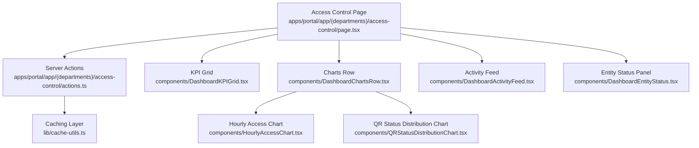
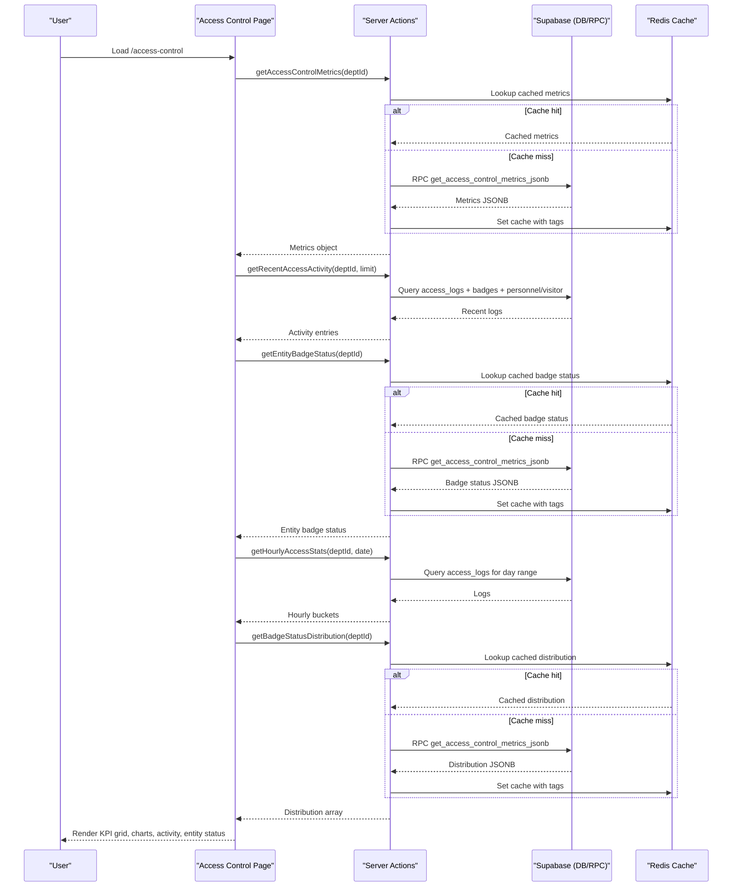
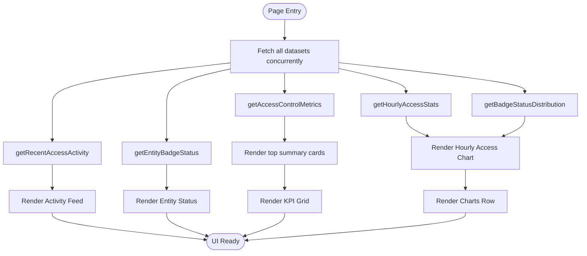
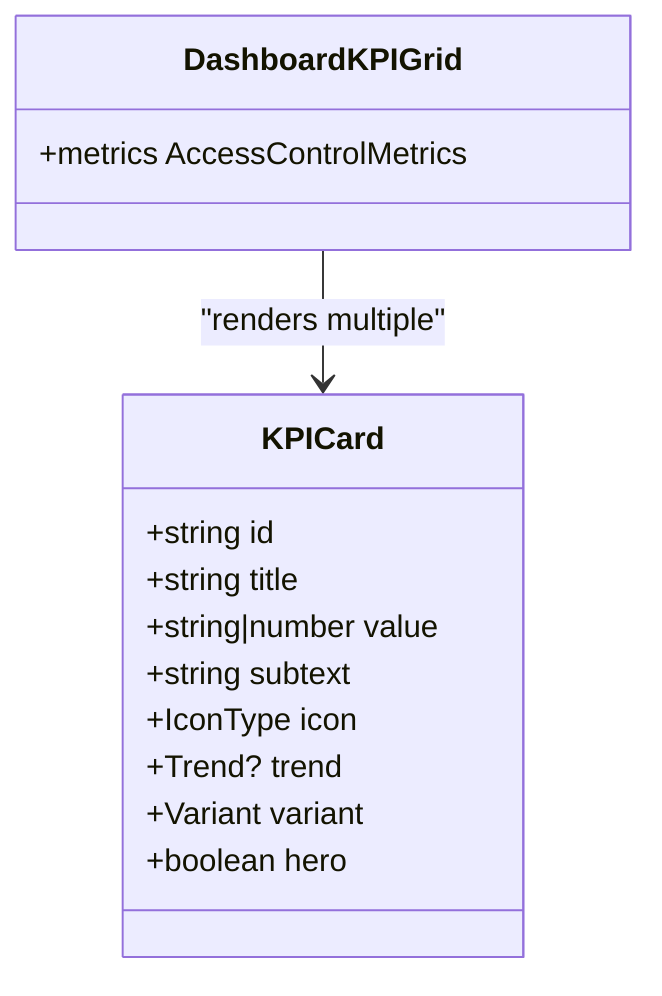
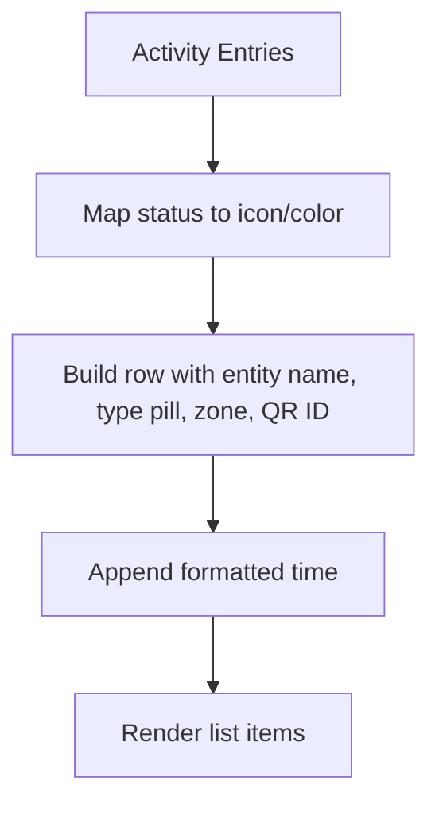
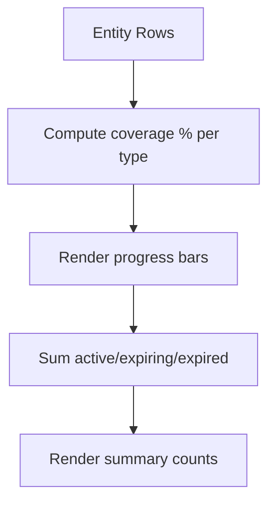
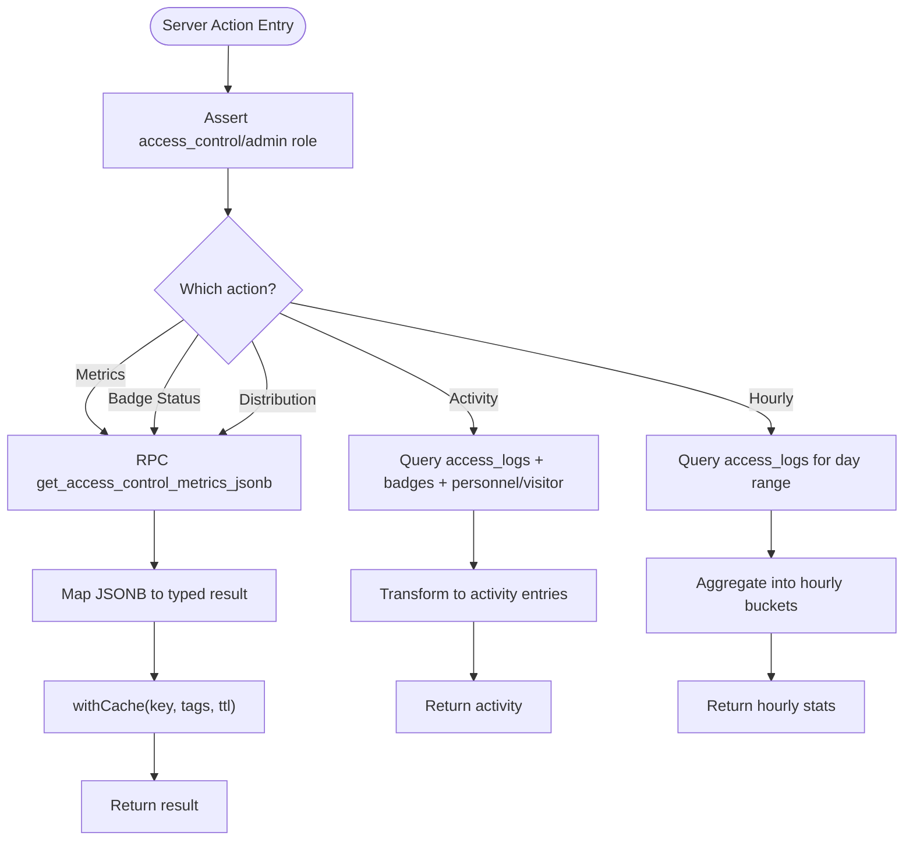
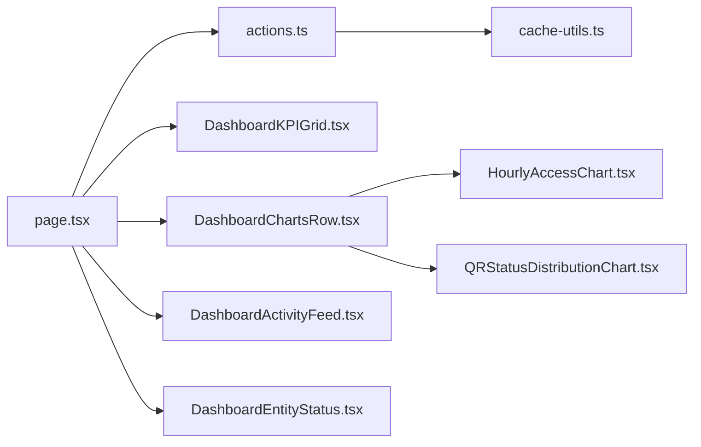

# Dashboard & Analytics

<cite>
**Referenced Files in This Document**
- [page.tsx](file://apps/portal/app/(departments)/access-control/page.tsx)
- [actions.ts](file://apps/portal/app/(departments)/access-control/actions.ts)
- [DashboardKPIGrid.tsx](file://apps/portal/app/(departments)/access-control/components/DashboardKPIGrid.tsx)
- [DashboardChartsRow.tsx](file://apps/portal/app/(departments)/access-control/components/DashboardChartsRow.tsx)
- [HourlyAccessChart.tsx](file://apps/portal/app/(departments)/access-control/components/HourlyAccessChart.tsx)
- [QRStatusDistributionChart.tsx](file://apps/portal/app/(departments)/access-control/components/QRStatusDistributionChart.tsx)
- [DashboardActivityFeed.tsx](file://apps/portal/app/(departments)/access-control/components/DashboardActivityFeed.tsx)
- [DashboardEntityStatus.tsx](file://apps/portal/app/(departments)/access-control/components/DashboardEntityStatus.tsx)
- [cache-utils.ts](file://apps/portal/lib/cache-utils.ts)
- [PerformanceListener.tsx](file://apps/portal/components/PerformanceListener.tsx)
- [useAdaptivePerformance.ts](file://apps/portal/hooks/useAdaptivePerformance.ts)
</cite>

## Table of Contents

1. [Introduction](#introduction)
2. [Project Structure](#project-structure)
3. [Core Components](#core-components)
4. [Architecture Overview](#architecture-overview)
5. [Detailed Component Analysis](#detailed-component-analysis)
6. [Dependency Analysis](#dependency-analysis)
7. [Performance Considerations](#performance-considerations)
8. [Troubleshooting Guide](#troubleshooting-guide)
9. [Conclusion](#conclusion)
10. [Appendices](#appendices)

## Introduction

This document provides comprehensive documentation for the Access Control department dashboard and analytics system. It covers the KPI grid, activity feed, entity status panel, and visualization charts (hourly access patterns and QR status distribution). It also explains the dashboard layout structure, data fetching and caching strategies, real-time update considerations, performance optimizations, responsive design, and guidance for customizing widgets and adding new analytics visualizations.

## Project Structure

The Access Control dashboard is implemented as a Next.js App Router page that composes several client components. Data is fetched via server actions with role checks and database queries/RPCs. Caching is applied at the server layer to reduce database load and improve responsiveness. Charts are rendered client-side using Recharts.



**Diagram sources**

- [page.tsx:1-120](<file://apps/portal/app/(departments)/access-control/page.tsx#L1-L120>)
- [actions.ts:1-446](<file://apps/portal/app/(departments)/access-control/actions.ts#L1-L446>)
- [DashboardKPIGrid.tsx:1-197](<file://apps/portal/app/(departments)/access-control/components/DashboardKPIGrid.tsx#L1-L197>)
- [DashboardChartsRow.tsx:1-64](<file://apps/portal/app/(departments)/access-control/components/DashboardChartsRow.tsx#L1-L64>)
- [HourlyAccessChart.tsx:1-107](<file://apps/portal/app/(departments)/access-control/components/HourlyAccessChart.tsx#L1-L107>)
- [QRStatusDistributionChart.tsx:1-92](<file://apps/portal/app/(departments)/access-control/components/QRStatusDistributionChart.tsx#L1-L92>)
- [DashboardActivityFeed.tsx:1-117](<file://apps/portal/app/(departments)/access-control/components/DashboardActivityFeed.tsx#L1-L117>)
- [DashboardEntityStatus.tsx:1-128](<file://apps/portal/app/(departments)/access-control/components/DashboardEntityStatus.tsx#L1-L128>)
- [cache-utils.ts:1-79](file://apps/portal/lib/cache-utils.ts#L1-L79)

**Section sources**

- [page.tsx:1-120](<file://apps/portal/app/(departments)/access-control/page.tsx#L1-L120>)
- [actions.ts:1-446](<file://apps/portal/app/(departments)/access-control/actions.ts#L1-L446>)
- [cache-utils.ts:1-79](file://apps/portal/lib/cache-utils.ts#L1-L79)

## Core Components

- Access Control Dashboard Page
  - Orchestrates data fetching for metrics, recent activity, entity badge status, hourly stats, and badge distribution.
  - Composes top summary cards, KPI bento grid, charts row, and bottom panels (activity feed and entity status).
- KPI Grid
  - Displays key metrics such as active QR codes, expiring soon, denied attempts today, access events today, expired still assigned, and entity coverage.
  - Supports trend indicators and variant styling for emphasis.
- Charts Row
  - Hosts two client-rendered charts: Hourly Access Pattern and QR Status Distribution.
  - Uses dynamic imports and skeleton loaders for performance.
- Hourly Access Chart
  - Area chart showing granted vs denied access events per hour.
  - Custom tooltip and gradient fills.
- QR Status Distribution Chart
  - Radial bar chart showing counts and percentages for Active, Expiring Soon, Expired, and Revoked QR codes.
  - Includes a legend and percentage calculation in tooltips.
- Activity Feed
  - Lists recent access events with status icons, entity type pills, zone, QR ID, and time.
  - Links to full logs view.
- Entity Status Panel
  - Breakdown by entity type (Employees, Vehicles, Equipment) with totals, active/expiring/expired counts, and coverage progress bars.

**Section sources**

- [page.tsx:1-120](<file://apps/portal/app/(departments)/access-control/page.tsx#L1-L120>)
- [DashboardKPIGrid.tsx:1-197](<file://apps/portal/app/(departments)/access-control/components/DashboardKPIGrid.tsx#L1-L197>)
- [DashboardChartsRow.tsx:1-64](<file://apps/portal/app/(departments)/access-control/components/DashboardChartsRow.tsx#L1-L64>)
- [HourlyAccessChart.tsx:1-107](<file://apps/portal/app/(departments)/access-control/components/HourlyAccessChart.tsx#L1-L107>)
- [QRStatusDistributionChart.tsx:1-92](<file://apps/portal/app/(departments)/access-control/components/QRStatusDistributionChart.tsx#L1-L92>)
- [DashboardActivityFeed.tsx:1-117](<file://apps/portal/app/(departments)/access-control/components/DashboardActivityFeed.tsx#L1-L117>)
- [DashboardEntityStatus.tsx:1-128](<file://apps/portal/app/(departments)/access-control/components/DashboardEntityStatus.tsx#L1-L128>)

## Architecture Overview

The dashboard follows a server-first data flow with client rendering for interactive charts. Server actions enforce roles, query the database (via Supabase), and cache results. The page aggregates multiple datasets concurrently and passes them to presentational components.



**Diagram sources**

- [page.tsx:1-120](<file://apps/portal/app/(departments)/access-control/page.tsx#L1-L120>)
- [actions.ts:1-446](<file://apps/portal/app/(departments)/access-control/actions.ts#L1-L446>)
- [cache-utils.ts:1-79](file://apps/portal/lib/cache-utils.ts#L1-L79)

## Detailed Component Analysis

### Dashboard Page Layout and Data Aggregation

- Concurrent data fetching using Promise.all for metrics, activity, entity status, hourly stats, and distribution.
- Top summary cards display high-level numbers derived from metrics.
- Bento-style KPI grid renders six tiles with trends and variants.
- Charts row hosts two client-rendered charts with skeletons during loading.
- Bottom row splits into activity feed (wider) and entity status (narrower).



**Diagram sources**

- [page.tsx:1-120](<file://apps/portal/app/(departments)/access-control/page.tsx#L1-L120>)

**Section sources**

- [page.tsx:1-120](<file://apps/portal/app/(departments)/access-control/page.tsx#L1-L120>)

### KPI Grid Component

- Renders a responsive grid with hero tile for active QR codes.
- Each tile includes title, value, subtext, icon, optional trend indicator, and variant styling.
- Trends use directional icons and color-coded labels.



**Diagram sources**

- [DashboardKPIGrid.tsx:1-197](<file://apps/portal/app/(departments)/access-control/components/DashboardKPIGrid.tsx#L1-L197>)

**Section sources**

- [DashboardKPIGrid.tsx:1-197](<file://apps/portal/app/(departments)/access-control/components/DashboardKPIGrid.tsx#L1-L197>)

### Charts Row and Visualization Components

- Charts Row dynamically imports chart components and shows skeletons while loading.
- Hourly Access Chart uses an area chart with dual series (granted/denied) and custom tooltip.
- QR Status Distribution Chart uses a radial bar chart with legend and percentage calculations.

```mermaid
classDiagram
class DashboardChartsRow {
+hourlyStats HourlyAccessPoint[]
+distribution BadgeStatusDistribution[]
}
class HourlyAccessChart {
+data {hour : string, granted : number, denied : number}[]
}
class QRStatusDistributionChart {
+data {name : string, value : number, fill : string}[]
}
DashboardChartsRow --> HourlyAccessChart : "renders"
DashboardChartsRow --> QRStatusDistributionChart : "renders"
```

**Diagram sources**

- [DashboardChartsRow.tsx:1-64](<file://apps/portal/app/(departments)/access-control/components/DashboardChartsRow.tsx#L1-L64>)
- [HourlyAccessChart.tsx:1-107](<file://apps/portal/app/(departments)/access-control/components/HourlyAccessChart.tsx#L1-L107>)
- [QRStatusDistributionChart.tsx:1-92](<file://apps/portal/app/(departments)/access-control/components/QRStatusDistributionChart.tsx#L1-L92>)

**Section sources**

- [DashboardChartsRow.tsx:1-64](<file://apps/portal/app/(departments)/access-control/components/DashboardChartsRow.tsx#L1-L64>)
- [HourlyAccessChart.tsx:1-107](<file://apps/portal/app/(departments)/access-control/components/HourlyAccessChart.tsx#L1-L107>)
- [QRStatusDistributionChart.tsx:1-92](<file://apps/portal/app/(departments)/access-control/components/QRStatusDistributionChart.tsx#L1-L92>)

### Activity Feed Component

- Displays recent access events with status icons, entity type pills, zone, QR ID, and timestamp.
- Provides a link to the full access logs page.
- Maps statuses to icons and colors for quick scanning.



**Diagram sources**

- [DashboardActivityFeed.tsx:1-117](<file://apps/portal/app/(departments)/access-control/components/DashboardActivityFeed.tsx#L1-L117>)

**Section sources**

- [DashboardActivityFeed.tsx:1-117](<file://apps/portal/app/(departments)/access-control/components/DashboardActivityFeed.tsx#L1-L117>)

### Entity Status Panel Component

- Shows breakdown by entity type with total, active, expiring, and expired counts.
- Computes coverage percentage and displays progress bars.
- Summarizes totals across types at the bottom.



**Diagram sources**

- [DashboardEntityStatus.tsx:1-128](<file://apps/portal/app/(departments)/access-control/components/DashboardEntityStatus.tsx#L1-L128>)

**Section sources**

- [DashboardEntityStatus.tsx:1-128](<file://apps/portal/app/(departments)/access-control/components/DashboardEntityStatus.tsx#L1-L128>)

### Server Actions and Data Aggregation

- Role enforcement ensures only admin or access_control users can access endpoints.
- Metrics and distributions are retrieved via a single RPC returning JSONB, then mapped to typed structures.
- Recent activity joins access_logs with badges and related entities; statuses are inferred from denial reasons.
- Hourly aggregation builds a 24-hour bucket and increments granted/denied based on timestamps.
- Caching wraps metric-heavy calls with tag-based invalidation and TTL configuration.



**Diagram sources**

- [actions.ts:1-446](<file://apps/portal/app/(departments)/access-control/actions.ts#L1-L446>)
- [cache-utils.ts:1-79](file://apps/portal/lib/cache-utils.ts#L1-L79)

**Section sources**

- [actions.ts:1-446](<file://apps/portal/app/(departments)/access-control/actions.ts#L1-L446>)
- [cache-utils.ts:1-79](file://apps/portal/lib/cache-utils.ts#L1-L79)

## Dependency Analysis

- Page depends on server actions for data and on client components for presentation.
- Client chart components depend on Recharts and are dynamically imported to avoid SSR overhead.
- Server actions depend on Supabase client and Redis caching utilities.
- Error handling uses typed error classes for auth and database errors.



**Diagram sources**

- [page.tsx:1-120](<file://apps/portal/app/(departments)/access-control/page.tsx#L1-L120>)
- [actions.ts:1-446](<file://apps/portal/app/(departments)/access-control/actions.ts#L1-L446>)
- [DashboardKPIGrid.tsx:1-197](<file://apps/portal/app/(departments)/access-control/components/DashboardKPIGrid.tsx#L1-L197>)
- [DashboardChartsRow.tsx:1-64](<file://apps/portal/app/(departments)/access-control/components/DashboardChartsRow.tsx#L1-L64>)
- [HourlyAccessChart.tsx:1-107](<file://apps/portal/app/(departments)/access-control/components/HourlyAccessChart.tsx#L1-L107>)
- [QRStatusDistributionChart.tsx:1-92](<file://apps/portal/app/(departments)/access-control/components/QRStatusDistributionChart.tsx#L1-L92>)
- [DashboardActivityFeed.tsx:1-117](<file://apps/portal/app/(departments)/access-control/components/DashboardActivityFeed.tsx#L1-L117>)
- [DashboardEntityStatus.tsx:1-128](<file://apps/portal/app/(departments)/access-control/components/DashboardEntityStatus.tsx#L1-L128>)
- [cache-utils.ts:1-79](file://apps/portal/lib/cache-utils.ts#L1-L79)

**Section sources**

- [page.tsx:1-120](<file://apps/portal/app/(departments)/access-control/page.tsx#L1-L120>)
- [actions.ts:1-446](<file://apps/portal/app/(departments)/access-control/actions.ts#L1-L446>)
- [cache-utils.ts:1-79](file://apps/portal/lib/cache-utils.ts#L1-L79)

## Performance Considerations

- Dynamic Imports and Skeletons
  - Chart components are dynamically imported with ssr:false and skeleton placeholders to reduce initial bundle size and improve perceived performance.
- Caching Strategy
  - Server actions wrap expensive reads with a caching utility that:
    - Builds keys by category and parts.
    - Looks up TTL from registry.
    - Returns cached values when available.
    - Sets cache with tags on successful writes.
    - Handles DatabaseError without caching and supports fallback to L1 cache if needed.
- Concurrency
  - Page fetches all required datasets concurrently to minimize total latency.
- Adaptive Performance Listener
  - A client component monitors frame render times and applies a low-performance fallback class to the body when budgets are breached.
- Real-Time Update Considerations
  - While the current implementation relies on server-side caching and static page loads, real-time updates can be layered using periodic revalidation or WebSocket integration. For now, the “Live” label indicates intended future behavior.

**Section sources**

- [DashboardChartsRow.tsx:1-64](<file://apps/portal/app/(departments)/access-control/components/DashboardChartsRow.tsx#L1-L64>)
- [cache-utils.ts:1-79](file://apps/portal/lib/cache-utils.ts#L1-L79)
- [page.tsx:1-120](<file://apps/portal/app/(departments)/access-control/page.tsx#L1-L120>)
- [PerformanceListener.tsx:1-28](file://apps/portal/components/PerformanceListener.tsx#L1-L28)
- [useAdaptivePerformance.ts](file://apps/portal/hooks/useAdaptivePerformance.ts)

## Troubleshooting Guide

- Unauthorized Access
  - If a user lacks admin or access_control roles, server actions throw a forbidden error. Ensure the authenticated user has the correct role before accessing the dashboard.
- Database Errors
  - Database-related failures are wrapped in typed errors and not cached. Check the underlying RPC or table queries if metrics or distributions fail to load.
- Cache Misses and Stale Data
  - On cache misses, the system executes the function and sets cache with tags. If Redis is unreachable, it falls back to direct execution and may retry L1 cache. Monitor cache tags for invalidation after write operations.
- Chart Rendering Issues
  - Charts are client-only. Verify that dynamic imports succeed and that data shapes match expected interfaces (e.g., hourly buckets and distribution arrays).
- Activity Feed Formatting
  - Status mapping depends on denial_reason content. If statuses appear incorrect, review the transformation logic and ensure consistent reason strings from the database.

**Section sources**

- [actions.ts:1-446](<file://apps/portal/app/(departments)/access-control/actions.ts#L1-L446>)
- [cache-utils.ts:1-79](file://apps/portal/lib/cache-utils.ts#L1-L79)
- [DashboardActivityFeed.tsx:1-117](<file://apps/portal/app/(departments)/access-control/components/DashboardActivityFeed.tsx#L1-L117>)

## Conclusion

The Access Control dashboard integrates server-side data fetching with client-side visualization to deliver a responsive, informative interface. Strong caching, concurrent data retrieval, and dynamic imports contribute to performance. The modular component architecture facilitates customization and extension. Future enhancements can include real-time updates via WebSockets or periodic revalidation, additional analytics charts, and improved mobile responsiveness.

## Appendices

### Customizing Dashboard Widgets

- Add a New KPI Tile
  - Extend the KPI data array in the KPI grid component with a new entry including id, title, value, subtext, icon, trend, and variant.
  - Ensure the corresponding metric exists in the server action’s returned structure.
- Add a New Chart
  - Create a new client component under the components directory.
  - Dynamically import it in the charts row and pass the necessary data props.
  - Implement responsive container sizing and custom tooltips as needed.
- Modify Activity Feed Columns
  - Adjust the mapping and formatting logic in the activity feed component to include additional fields from the server action response.

### Adding New Analytics Visualizations

- Define Data Shape
  - Specify the expected data structure in the server actions and ensure the database queries or RPCs return compatible data.
- Implement Client Chart
  - Use Recharts primitives (AreaChart, BarChart, PieChart, etc.) with responsive containers and custom tooltips.
  - Apply consistent styling and theme tokens used across the dashboard.
- Integrate Into Layout
  - Update the charts row to include the new component and pass aggregated data.
  - Consider adding skeletons and dynamic imports for performance.

### Real-Time Updates Guidance

- Periodic Refresh
  - Use Next.js revalidatePath or client-side polling to refresh specific sections at intervals.
- WebSocket Integration
  - Introduce a WebSocket client to push live updates for access events and metrics.
  - Invalidate relevant cache tags upon write operations to keep data fresh.

[No sources needed since this section provides general guidance]
