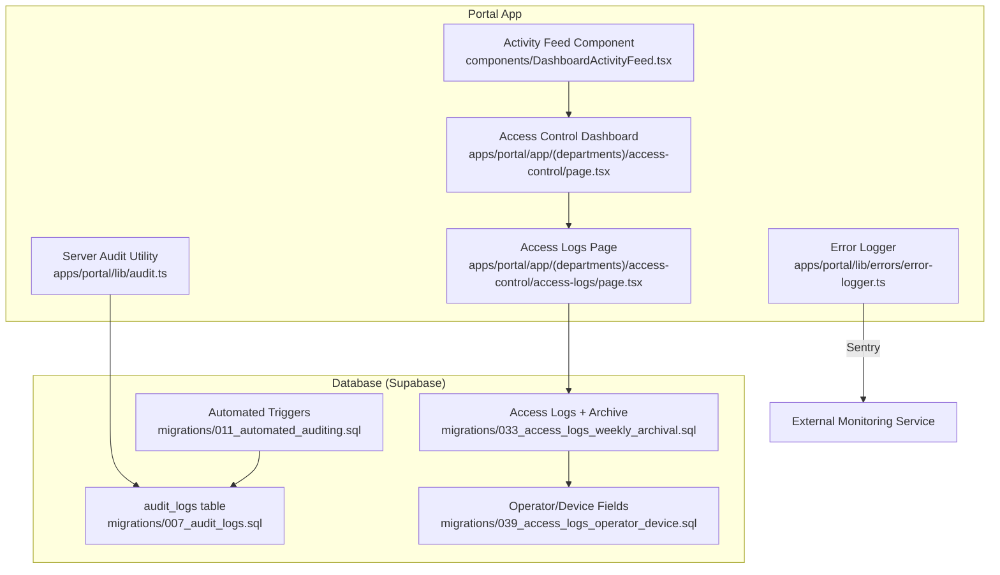
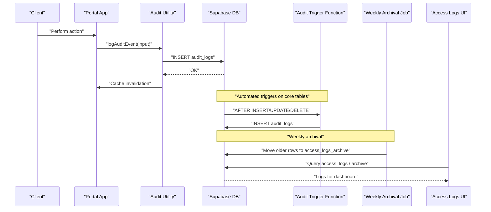
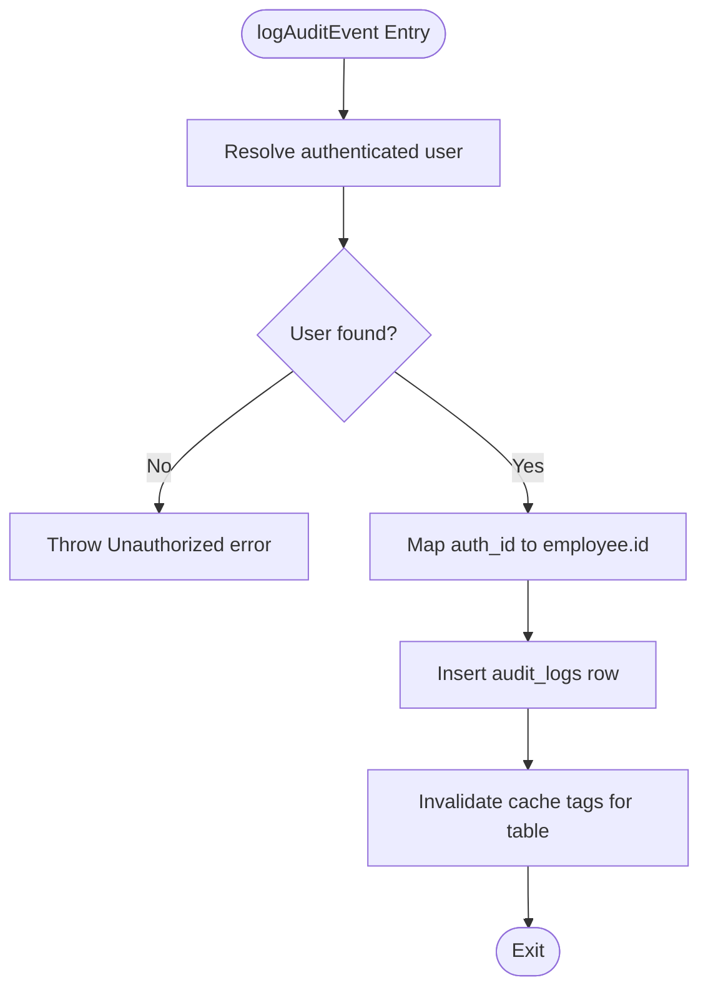
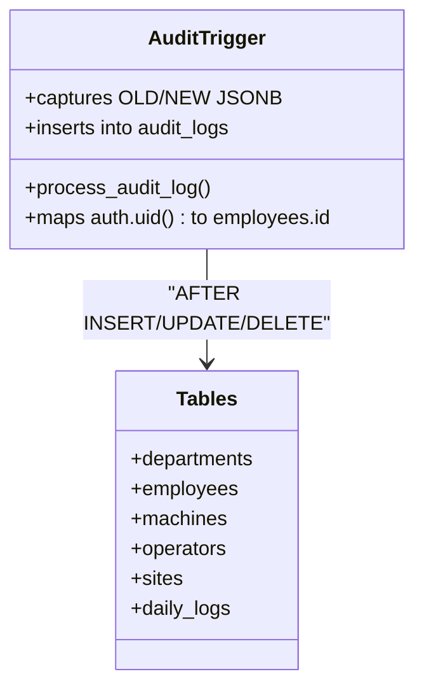
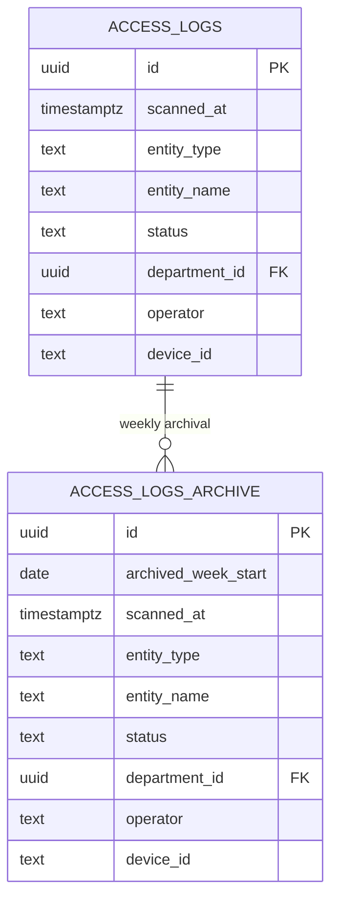
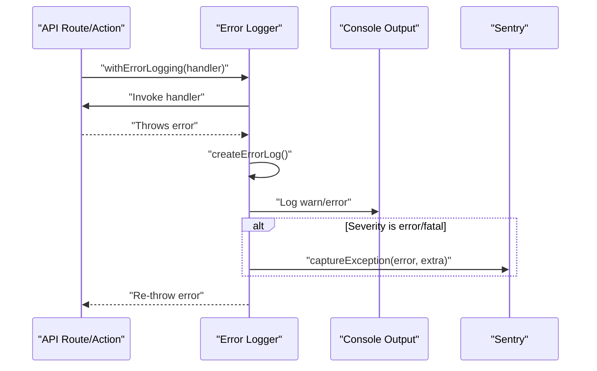
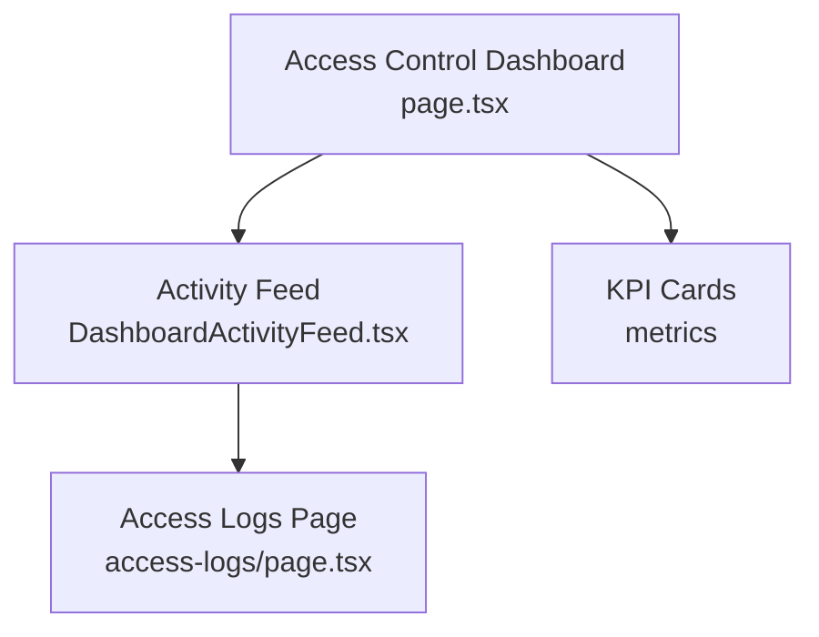
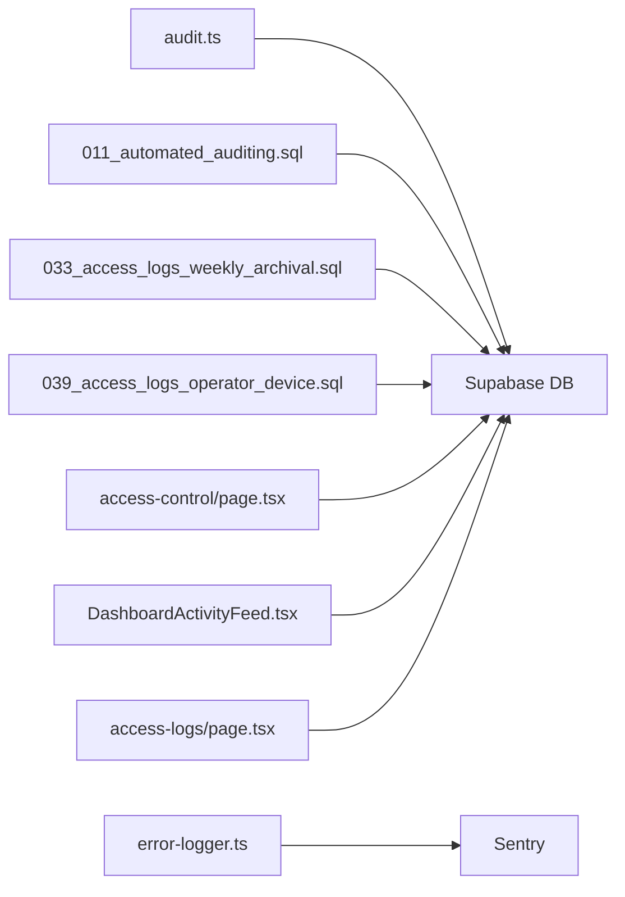

# Security Logs & Audit Trails

<cite>
**Referenced Files in This Document**
- [audit.ts](file://apps/portal/lib/audit.ts)
- [error-logger.ts](file://apps/portal/lib/errors/error-logger.ts)
- [007_audit_logs.sql](file://packages/database/migrations/007_audit_logs.sql)
- [011_automated_auditing.sql](file://packages/database/migrations/011_automated_auditing.sql)
- [033_access_logs_weekly_archival.sql](file://packages/database/migrations/033_access_logs_weekly_archival.sql)
- [039_access_logs_operator_device.sql](file://packages/database/migrations/039_access_logs_operator_device.sql)
- [database-schema.md](file://wiki/concepts/database-schema.md)
- [access-control/page.tsx](file://apps/portal/app/(departments)/access-control/page.tsx)
- [DashboardActivityFeed.tsx](file://apps/portal/app/(departments)/access-control/components/DashboardActivityFeed.tsx)
- [access-logs/page.tsx](file://apps/portal/app/(departments)/access-control/access-logs/page.tsx)
</cite>

## Table of Contents

1. [Introduction](#introduction)
2. [Project Structure](#project-structure)
3. [Core Components](#core-components)
4. [Architecture Overview](#architecture-overview)
5. [Detailed Component Analysis](#detailed-component-analysis)
6. [Dependency Analysis](#dependency-analysis)
7. [Performance Considerations](#performance-considerations)
8. [Troubleshooting Guide](#troubleshooting-guide)
9. [Conclusion](#conclusion)
10. [Appendices](#appendices)

## Introduction

This document describes the security logging and audit trail system, focusing on:

- Log collection mechanisms for application-level audits and access events
- Event types captured by the audit system
- Data retention policies for access logs
- Access log data model including timestamps, user actions, and access attempts
- Filtering, search capabilities, and export functionality
- Real-time streaming considerations, alerting rules, and compliance reporting
- Activity feed components used in security monitoring dashboards

The system combines server-side audit logging with database triggers and a dedicated access log table with weekly archival. It integrates error tracking via an external service and provides UI components for activity feeds and access log browsing.

## Project Structure

Security-related code is primarily located under the portal application and database migrations:

- Server-side audit logging utility
- Error logger integration with an external monitoring service
- Database schema and automated auditing triggers
- Weekly archival process for access logs
- UI components for access control dashboards and activity feeds

**Diagram sources**

- [audit.ts:1-57](file://apps/portal/lib/audit.ts#L1-L57)
- [error-logger.ts:1-242](file://apps/portal/lib/errors/error-logger.ts#L1-L242)
- [007_audit_logs.sql:1-46](file://packages/database/migrations/007_audit_logs.sql#L1-L46)
- [011_automated_auditing.sql:1-97](file://packages/database/migrations/011_automated_auditing.sql#L1-L97)
- [033_access_logs_weekly_archival.sql:1-87](file://packages/database/migrations/033_access_logs_weekly_archival.sql#L1-L87)
- [039_access_logs_operator_device.sql:1-14](file://packages/database/migrations/039_access_logs_operator_device.sql#L1-L14)
- [access-control/page.tsx](<file://apps/portal/app/(departments)/access-control/page.tsx#L77-L119>)
- [DashboardActivityFeed.tsx](<file://apps/portal/app/(departments)/access-control/components/DashboardActivityFeed.tsx#L1-L39>)
- [access-logs/page.tsx](<file://apps/portal/app/(departments)/access-control/access-logs/page.tsx#L128-L162>)

**Section sources**

- [audit.ts:1-57](file://apps/portal/lib/audit.ts#L1-L57)
- [error-logger.ts:1-242](file://apps/portal/lib/errors/error-logger.ts#L1-L242)
- [007_audit_logs.sql:1-46](file://packages/database/migrations/007_audit_logs.sql#L1-L46)
- [011_automated_auditing.sql:1-97](file://packages/database/migrations/011_automated_auditing.sql#L1-L97)
- [033_access_logs_weekly_archival.sql:1-87](file://packages/database/migrations/033_access_logs_weekly_archival.sql#L1-L87)
- [039_access_logs_operator_device.sql:1-14](file://packages/database/migrations/039_access_logs_operator_device.sql#L1-L14)
- [database-schema.md:204-240](file://wiki/concepts/database-schema.md#L204-L240)
- [access-control/page.tsx](<file://apps/portal/app/(departments)/access-control/page.tsx#L77-L119>)
- [DashboardActivityFeed.tsx](<file://apps/portal/app/(departments)/access-control/components/DashboardActivityFeed.tsx#L1-L39>)
- [access-logs/page.tsx](<file://apps/portal/app/(departments)/access-control/access-logs/page.tsx#L128-L162>)

## Core Components

- Server-side audit logging utility writes structured audit events to the audit_logs table and invalidates caches when relevant tables change.
- Automated database triggers capture insert/update/delete operations on core tables into audit_logs without requiring application changes.
- Access logs are maintained in a dedicated table with weekly archival to an archive table and additional fields for operator and device identification.
- Error logger captures structured errors and forwards them to an external monitoring service while preserving console output for local debugging.
- UI components provide activity feeds and access log browsing for security monitoring dashboards.

**Section sources**

- [audit.ts:1-57](file://apps/portal/lib/audit.ts#L1-L57)
- [011_automated_auditing.sql:1-97](file://packages/database/migrations/011_automated_auditing.sql#L1-L97)
- [033_access_logs_weekly_archival.sql:1-87](file://packages/database/migrations/033_access_logs_weekly_archival.sql#L1-L87)
- [039_access_logs_operator_device.sql:1-14](file://packages/database/migrations/039_access_logs_operator_device.sql#L1-L14)
- [error-logger.ts:1-242](file://apps/portal/lib/errors/error-logger.ts#L1-L242)
- [access-control/page.tsx](<file://apps/portal/app/(departments)/access-control/page.tsx#L77-L119>)
- [DashboardActivityFeed.tsx](<file://apps/portal/app/(departments)/access-control/components/DashboardActivityFeed.tsx#L1-L39>)
- [access-logs/page.tsx](<file://apps/portal/app/(departments)/access-control/access-logs/page.tsx#L128-L162>)

## Architecture Overview

The audit and access logging architecture spans application code, database triggers, and UI components:

**Diagram sources**

- [audit.ts:1-57](file://apps/portal/lib/audit.ts#L1-L57)
- [011_automated_auditing.sql:1-97](file://packages/database/migrations/011_automated_auditing.sql#L1-L97)
- [033_access_logs_weekly_archival.sql:1-87](file://packages/database/migrations/033_access_logs_weekly_archival.sql#L1-L87)
- [access-logs/page.tsx](<file://apps/portal/app/(departments)/access-control/access-logs/page.tsx#L128-L162>)

## Detailed Component Analysis

### Audit Logging Utility

- Purpose: Write structured audit events to the audit_logs table from server actions.
- Behavior:
  - Resolves current authenticated user and maps to employee record.
  - Inserts audit event with action, table name, record ID, old/new data, performer, and department context.
  - Invalidates cache tags for affected tables to keep UI consistent.
- Error handling: Throws unauthorized error if no valid session exists.

**Diagram sources**

- [audit.ts:1-57](file://apps/portal/lib/audit.ts#L1-L57)

**Section sources**

- [audit.ts:1-57](file://apps/portal/lib/audit.ts#L1-L57)

### Automated Database Auditing Triggers

- Purpose: Automatically capture all mutations on core tables into audit_logs.
- Mechanism:
  - Generic trigger function serializes old/new data and extracts department context.
  - Maps Supabase auth.uid() to employees.id for performed_by.
  - Applies AFTER INSERT/UPDATE/DELETE triggers on departments, employees, machines, operators, sites, daily_logs.

**Diagram sources**

- [011_automated_auditing.sql:1-97](file://packages/database/migrations/011_automated_auditing.sql#L1-L97)

**Section sources**

- [011_automated_auditing.sql:1-97](file://packages/database/migrations/011_automated_auditing.sql#L1-L97)

### Access Logs Schema and Retention Policy

- Schema highlights:
  - Dedicated access_logs table for gate/device scan events.
  - Additional columns for operator and device_id to attribute scans.
  - Weekly archival moves older rows into access_logs_archive with week identifiers.
- Retention policy:
  - Active logs retained for the current week.
  - Older logs archived weekly; archive table indexed by archived_week_start and scanned_at.
- RLS:
  - Select policies restrict archive access to admins, access_control roles, or users within the same department.

**Diagram sources**

- [033_access_logs_weekly_archival.sql:1-87](file://packages/database/migrations/033_access_logs_weekly_archival.sql#L1-L87)
- [039_access_logs_operator_device.sql:1-14](file://packages/database/migrations/039_access_logs_operator_device.sql#L1-L14)

**Section sources**

- [033_access_logs_weekly_archival.sql:1-87](file://packages/database/migrations/033_access_logs_weekly_archival.sql#L1-L87)
- [039_access_logs_operator_device.sql:1-14](file://packages/database/migrations/039_access_logs_operator_device.sql#L1-L14)

### Error Logging Integration

- Purpose: Capture structured errors and forward them to an external monitoring service.
- Behavior:
  - Determines severity based on status codes and error type.
  - Logs to console for development and sends high-severity errors to Sentry.
  - Provides wrappers for API routes and server actions to ensure consistent logging.

**Diagram sources**

- [error-logger.ts:1-242](file://apps/portal/lib/errors/error-logger.ts#L1-L242)

**Section sources**

- [error-logger.ts:1-242](file://apps/portal/lib/errors/error-logger.ts#L1-L242)

### Activity Feed and Dashboard Components

- Purpose: Display recent access events and key metrics for security monitoring.
- Features:
  - Activity feed shows recent entries with icons per status and entity type pills.
  - Dashboard aggregates counts like access events today and alerts today.
  - Links to detailed access logs page for filtering and deeper inspection.

**Diagram sources**

- [access-control/page.tsx](<file://apps/portal/app/(departments)/access-control/page.tsx#L77-L119>)
- [DashboardActivityFeed.tsx](<file://apps/portal/app/(departments)/access-control/components/DashboardActivityFeed.tsx#L1-L39>)
- [access-logs/page.tsx](<file://apps/portal/app/(departments)/access-control/access-logs/page.tsx#L128-L162>)

**Section sources**

- [access-control/page.tsx](<file://apps/portal/app/(departments)/access-control/page.tsx#L77-L119>)
- [DashboardActivityFeed.tsx](<file://apps/portal/app/(departments)/access-control/components/DashboardActivityFeed.tsx#L1-L39>)
- [access-logs/page.tsx](<file://apps/portal/app/(departments)/access-control/access-logs/page.tsx#L128-L162>)

## Dependency Analysis

- Application-to-database dependencies:
  - Audit utility depends on Supabase client and Redis cache invalidation.
  - Automated triggers depend on Supabase auth context and employees mapping.
  - Weekly archival depends on pg_cron scheduling and indexes on archive table.
- UI-to-data dependencies:
  - Dashboard and activity feed rely on access_logs and related metrics.
  - Access logs page queries active and archived logs with filters.

**Diagram sources**

- [audit.ts:1-57](file://apps/portal/lib/audit.ts#L1-L57)
- [011_automated_auditing.sql:1-97](file://packages/database/migrations/011_automated_auditing.sql#L1-L97)
- [033_access_logs_weekly_archival.sql:1-87](file://packages/database/migrations/033_access_logs_weekly_archival.sql#L1-L87)
- [039_access_logs_operator_device.sql:1-14](file://packages/database/migrations/039_access_logs_operator_device.sql#L1-L14)
- [access-control/page.tsx](<file://apps/portal/app/(departments)/access-control/page.tsx#L77-L119>)
- [DashboardActivityFeed.tsx](<file://apps/portal/app/(departments)/access-control/components/DashboardActivityFeed.tsx#L1-L39>)
- [access-logs/page.tsx](<file://apps/portal/app/(departments)/access-control/access-logs/page.tsx#L128-L162>)
- [error-logger.ts:1-242](file://apps/portal/lib/errors/error-logger.ts#L1-L242)

**Section sources**

- [audit.ts:1-57](file://apps/portal/lib/audit.ts#L1-L57)
- [011_automated_auditing.sql:1-97](file://packages/database/migrations/011_automated_auditing.sql#L1-L97)
- [033_access_logs_weekly_archival.sql:1-87](file://packages/database/migrations/033_access_logs_weekly_archival.sql#L1-L87)
- [039_access_logs_operator_device.sql:1-14](file://packages/database/migrations/039_access_logs_operator_device.sql#L1-L14)
- [access-control/page.tsx](<file://apps/portal/app/(departments)/access-control/page.tsx#L77-L119>)
- [DashboardActivityFeed.tsx](<file://apps/portal/app/(departments)/access-control/components/DashboardActivityFeed.tsx#L1-L39>)
- [access-logs/page.tsx](<file://apps/portal/app/(departments)/access-control/access-logs/page.tsx#L128-L162>)
- [error-logger.ts:1-242](file://apps/portal/lib/errors/error-logger.ts#L1-L242)

## Performance Considerations

- Indexes:
  - audit_logs includes indexes on table_name+record_id, performed_by, department_id, created_at DESC.
  - access_logs_archive includes indexes on archived_week_start and scanned_at DESC.
  - access_logs includes index on device_id for device-based queries.
- Archival:
  - Weekly archival reduces active table size and improves query performance for recent logs.
- Cache invalidation:
  - Audit utility invalidates cache tags for affected tables to maintain UI freshness.

[No sources needed since this section provides general guidance]

## Troubleshooting Guide

- Unauthorized audit logging:
  - If no valid session exists, audit logging throws an unauthorized error. Verify authentication context before calling audit utilities.
- Missing employee mapping:
  - Automated triggers map auth.uid() to employees.id; ensure employee records exist for authenticated users.
- Archive visibility:
  - Archive select policies restrict access to admins, access_control roles, or matching department membership. Confirm user roles and department assignments.
- Error logging not appearing:
  - Only high-severity errors are forwarded to Sentry; lower severities are logged to console. Check environment configuration and severity thresholds.

**Section sources**

- [audit.ts:1-57](file://apps/portal/lib/audit.ts#L1-L57)
- [011_automated_auditing.sql:1-97](file://packages/database/migrations/011_automated_auditing.sql#L1-L97)
- [033_access_logs_weekly_archival.sql:37-87](file://packages/database/migrations/033_access_logs_weekly_archival.sql#L37-L87)
- [error-logger.ts:1-242](file://apps/portal/lib/errors/error-logger.ts#L1-L242)

## Conclusion

The security logging and audit trail system provides comprehensive coverage through:

- Server-side audit logging with cache invalidation
- Automated database triggers capturing critical mutations
- Dedicated access logs with weekly archival and role-based access controls
- Structured error logging integrated with an external monitoring service
- UI components for activity feeds and access log browsing

These mechanisms support security monitoring, compliance reporting, and operational insights while maintaining performance and data governance.

[No sources needed since this section summarizes without analyzing specific files]

## Appendices

### Access Log Data Model Summary

- Key fields include timestamps, entity type/name, status, department context, operator, and device identifier.
- Weekly archival separates historical data with week start identifiers and appropriate indexes.

**Section sources**

- [033_access_logs_weekly_archival.sql:1-87](file://packages/database/migrations/033_access_logs_weekly_archival.sql#L1-L87)
- [039_access_logs_operator_device.sql:1-14](file://packages/database/migrations/039_access_logs_operator_device.sql#L1-L14)
- [database-schema.md:204-240](file://wiki/concepts/database-schema.md#L204-L240)
