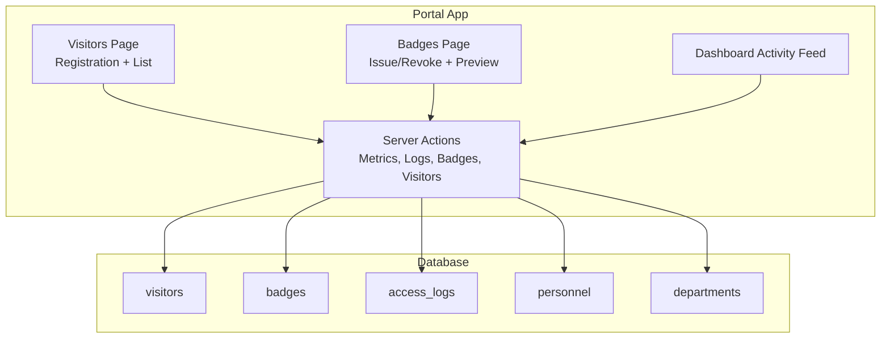
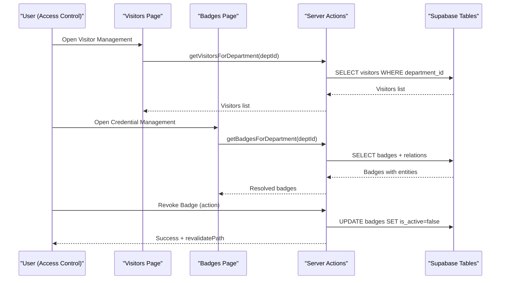
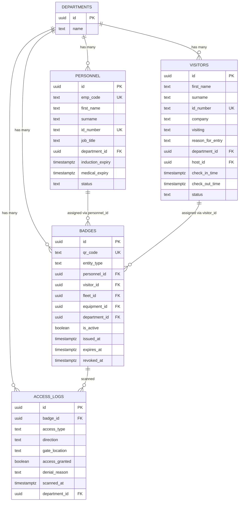
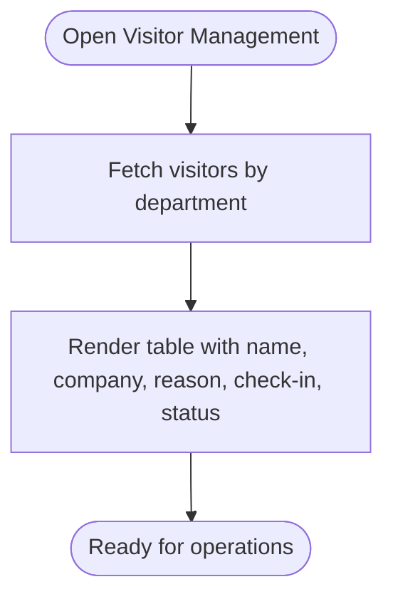
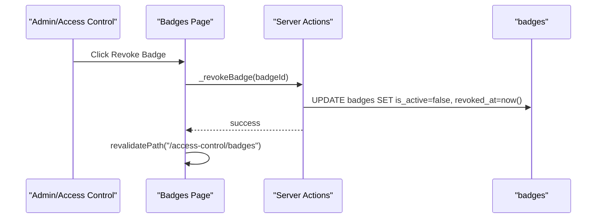
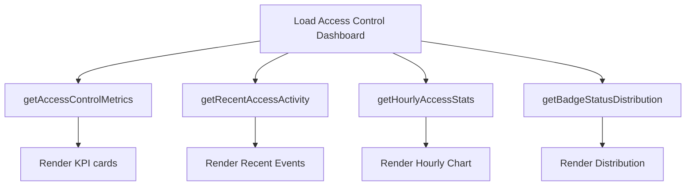
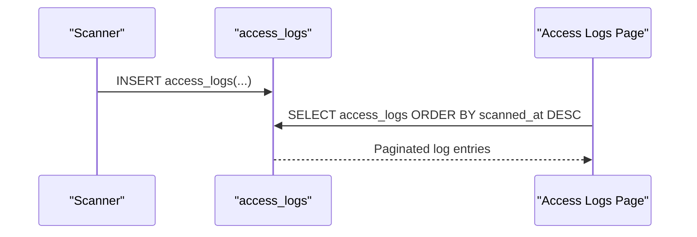
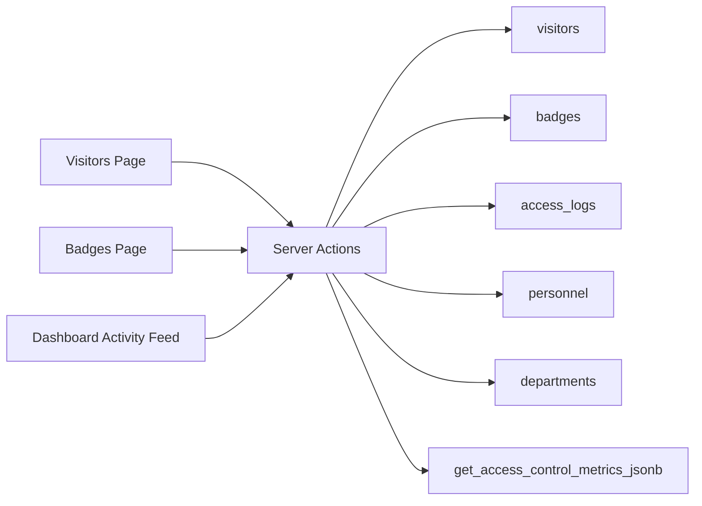

# Visitor Tracking System

<cite>
**Referenced Files in This Document**
- [actions.ts](file://apps/portal/app/(departments)/access-control/actions.ts)
- [visitors_page.tsx](file://apps/portal/app/(departments)/access-control/visitors/page.tsx)
- [badges_page.tsx](file://apps/portal/app/(departments)/access-control/badges/page.tsx)
- [dashboard_activity_feed.tsx](file://apps/portal/app/(departments)/access-control/components/DashboardActivityFeed.tsx)
- [028_access_control_system.sql](file://packages/supabase/migrations/028_access_control_system.sql)
- [034_access_control_schema_updates.sql](file://packages/supabase/migrations/034_access_control_schema_updates.sql)
- [database.types.ts](file://packages/supabase/src/database.types.ts)
- [access_logs_layout.tsx](file://apps/portal/app/(departments)/access-control/access-logs/layout.tsx)
- [access_logs_page.tsx](file://apps/portal/app/(departments)/access-control/access-logs/page.tsx)
</cite>

## Table of Contents

1. [Introduction](#introduction)
2. [Project Structure](#project-structure)
3. [Core Components](#core-components)
4. [Architecture Overview](#architecture-overview)
5. [Detailed Component Analysis](#detailed-component-analysis)
6. [Dependency Analysis](#dependency-analysis)
7. [Performance Considerations](#performance-considerations)
8. [Troubleshooting Guide](#troubleshooting-guide)
9. [Conclusion](#conclusion)
10. [Appendices](#appendices)

## Introduction

This document describes the visitor tracking system implemented within the Access Control module. It covers visitor registration workflows, check-in/check-out processes, temporary access provisioning via QR badges, and the data model that supports host assignments, visit purposes, and time-based restrictions. It also documents the dashboard features for real-time monitoring, automated notifications (as surfaced by UI states), badge generation and revocation flows, escort requirements, compliance reporting hooks, and audit trail maintenance.

## Project Structure

The visitor tracking functionality is part of the Access Control department area in the portal application. The key areas include:

- Server actions for metrics, activity feed, badge status, hourly stats, and CRUD helpers
- Pages for visitor management and credential (badge) management
- Dashboard components for recent access events
- Database migrations defining core tables and RLS policies
- Type definitions generated from the database schema



**Diagram sources**

- [visitors_page.tsx](<file://apps/portal/app/(departments)/access-control/visitors/page.tsx#L1-L222>)
- [badges_page.tsx](<file://apps/portal/app/(departments)/access-control/badges/page.tsx#L1-L209>)
- [dashboard_activity_feed.tsx](<file://apps/portal/app/(departments)/access-control/components/DashboardActivityFeed.tsx#L1-L117>)
- [actions.ts](<file://apps/portal/app/(departments)/access-control/actions.ts#L1-L446>)
- [028_access_control_system.sql:1-67](file://packages/supabase/migrations/028_access_control_system.sql#L1-L67)
- [034_access_control_schema_updates.sql:1-140](file://packages/supabase/migrations/034_access_control_schema_updates.sql#L1-L140)

**Section sources**

- [visitors_page.tsx](<file://apps/portal/app/(departments)/access-control/visitors/page.tsx#L1-L222>)
- [badges_page.tsx](<file://apps/portal/app/(departments)/access-control/badges/page.tsx#L1-L209>)
- [actions.ts](<file://apps/portal/app/(departments)/access-control/actions.ts#L1-L446>)
- [028_access_control_system.sql:1-67](file://packages/supabase/migrations/028_access_control_system.sql#L1-L67)
- [034_access_control_schema_updates.sql:1-140](file://packages/supabase/migrations/034_access_control_schema_updates.sql#L1-L140)

## Core Components

- Visitor Management Page: Provides a registration form and a table listing visitors with company, reason, check-in time, and status.
- Credential (Badge) Management Page: Lists issued badges, shows entity assignment, active/revoked status, and includes placeholders for QR preview/printing and revoke operations.
- Server Actions: Encapsulate role checks, metrics queries, recent access logs, badge status distribution, hourly stats, and badge CRUD helpers.
- Dashboard Activity Feed: Displays recent access events with status icons and links to full logs.

Key responsibilities:

- Enforce role-based access for access control operations
- Aggregate and cache metrics and distributions
- Present real-time-like dashboards using server-side data fetching
- Provide interfaces for issuing and revoking badges

**Section sources**

- [visitors_page.tsx](<file://apps/portal/app/(departments)/access-control/visitors/page.tsx#L1-L222>)
- [badges_page.tsx](<file://apps/portal/app/(departments)/access-control/badges/page.tsx#L1-L209>)
- [actions.ts](<file://apps/portal/app/(departments)/access-control/actions.ts#L1-L446>)
- [dashboard_activity_feed.tsx](<file://apps/portal/app/(departments)/access-control/components/DashboardActivityFeed.tsx#L1-L117>)

## Architecture Overview

The system follows a Next.js server action pattern backed by Supabase. Role enforcement occurs at the server action layer; database-level Row Level Security (RLS) further restricts access. Dashboards consume aggregated metrics and recent logs to provide near-real-time visibility.



**Diagram sources**

- [visitors_page.tsx](<file://apps/portal/app/(departments)/access-control/visitors/page.tsx#L1-L222>)
- [badges_page.tsx](<file://apps/portal/app/(departments)/access-control/badges/page.tsx#L1-L209>)
- [actions.ts](<file://apps/portal/app/(departments)/access-control/actions.ts#L1-L446>)
- [028_access_control_system.sql:1-67](file://packages/supabase/migrations/028_access_control_system.sql#L1-L67)
- [034_access_control_schema_updates.sql:1-140](file://packages/supabase/migrations/034_access_control_schema_updates.sql#L1-L140)

## Detailed Component Analysis

### Data Model

The visitor tracking system centers on four primary tables: personnel, visitors, badges, and access_logs, with relationships to departments. Migrations define constraints, indexes, and RLS policies.



**Diagram sources**

- [028_access_control_system.sql:1-67](file://packages/supabase/migrations/028_access_control_system.sql#L1-L67)
- [034_access_control_schema_updates.sql:1-140](file://packages/supabase/migrations/034_access_control_schema_updates.sql#L1-L140)
- [database.types.ts:8009-8052](file://packages/supabase/src/database.types.ts#L8009-L8052)

**Section sources**

- [028_access_control_system.sql:1-67](file://packages/supabase/migrations/028_access_control_system.sql#L1-L67)
- [034_access_control_schema_updates.sql:1-140](file://packages/supabase/migrations/034_access_control_schema_updates.sql#L1-L140)
- [database.types.ts:8009-8052](file://packages/supabase/src/database.types.ts#L8009-L8052)

### Visitor Registration Workflow

- Entry point: Visitors page renders a registration form and a table of today’s visitors.
- Data flow: The page fetches visitors filtered by department using a server action.
- Status display: Visitors show current status (e.g., Checked In) and check-in time.

Implementation highlights:

- Server action enforces access control roles before querying visitors.
- The page uses dynamic rendering and displays a live-feeling list sorted by check-in time.



**Diagram sources**

- [visitors_page.tsx](<file://apps/portal/app/(departments)/access-control/visitors/page.tsx#L1-L222>)
- [actions.ts](<file://apps/portal/app/(departments)/access-control/actions.ts#L422-L445>)

**Section sources**

- [visitors_page.tsx](<file://apps/portal/app/(departments)/access-control/visitors/page.tsx#L1-L222>)
- [actions.ts](<file://apps/portal/app/(departments)/access-control/actions.ts#L422-L445>)

### Check-In / Check-Out Processes

- Check-in: A visitor record includes a check_in_time and status field. The visitors page displays “Checked In” when applicable.
- Check-out: A check_out_time field exists for completion of visits.
- Enforcement: Roles are enforced via server actions and RLS policies allow only authorized users to modify records.

Operational notes:

- The UI surfaces status visually and formats timestamps consistently.
- Backend functions filter by department to ensure isolation.

**Section sources**

- [028_access_control_system.sql:20-31](file://packages/supabase/migrations/028_access_control_system.sql#L20-L31)
- [034_access_control_schema_updates.sql:10-32](file://packages/supabase/migrations/034_access_control_schema_updates.sql#L10-L32)
- [visitors_page.tsx](<file://apps/portal/app/(departments)/access-control/visitors/page.tsx#L174-L213>)
- [actions.ts](<file://apps/portal/app/(departments)/access-control/actions.ts#L422-L445>)

### Temporary Access Provisioning (Badges)

- Badges link to entities (personnel, visitor, fleet, equipment) and carry an active flag and timestamps for issuance and revocation.
- The Badges page lists badges with resolved entity names and allows revocation.
- Revocation updates is_active and sets revoked_at, then invalidates caches and revalidates paths.



**Diagram sources**

- [badges_page.tsx](<file://apps/portal/app/(departments)/access-control/badges/page.tsx#L1-L209>)
- [actions.ts](<file://apps/portal/app/(departments)/access-control/actions.ts#L378-L395>)
- [028_access_control_system.sql:33-43](file://packages/supabase/migrations/028_access_control_system.sql#L33-L43)
- [034_access_control_schema_updates.sql:48-66](file://packages/supabase/migrations/034_access_control_schema_updates.sql#L48-L66)

**Section sources**

- [badges_page.tsx](<file://apps/portal/app/(departments)/access-control/badges/page.tsx#L1-L209>)
- [actions.ts](<file://apps/portal/app/(departments)/access-control/actions.ts#L378-L395>)
- [028_access_control_system.sql:33-43](file://packages/supabase/migrations/028_access_control_system.sql#L33-L43)
- [034_access_control_schema_updates.sql:48-66](file://packages/supabase/migrations/034_access_control_schema_updates.sql#L48-L66)

### Visitor Dashboard Features and Real-Time Monitoring

- KPIs and metrics: Server actions compute active QR codes, denied today, access events today, expiring soon, expired assigned, and entity coverage.
- Recent activity feed: Aggregates latest access_logs entries, resolves entity names, and maps denial reasons to statuses like Expired Credential or Tailgate Alert.
- Hourly access stats: Aggregates granted vs denied per hour for a given date.
- Badge status distribution: Active, Expiring Soon, Expired, Revoked counts.



**Diagram sources**

- [actions.ts](<file://apps/portal/app/(departments)/access-control/actions.ts#L90-L140>)
- [actions.ts](<file://apps/portal/app/(departments)/access-control/actions.ts#L146-L208>)
- [actions.ts](<file://apps/portal/app/(departments)/access-control/actions.ts#L287-L323>)
- [actions.ts](<file://apps/portal/app/(departments)/access-control/actions.ts#L329-L372>)
- [dashboard_activity_feed.tsx](<file://apps/portal/app/(departments)/access-control/components/DashboardActivityFeed.tsx#L1-L117>)

**Section sources**

- [actions.ts](<file://apps/portal/app/(departments)/access-control/actions.ts#L90-L140>)
- [actions.ts](<file://apps/portal/app/(departments)/access-control/actions.ts#L146-L208>)
- [actions.ts](<file://apps/portal/app/(departments)/access-control/actions.ts#L287-L323>)
- [actions.ts](<file://apps/portal/app/(departments)/access-control/actions.ts#L329-L372>)
- [dashboard_activity_feed.tsx](<file://apps/portal/app/(departments)/access-control/components/DashboardActivityFeed.tsx#L1-L117>)

### Automated Notifications and Escort Requirements

- Automated notifications: The system surfaces alerts through UI states such as “Tailgate Alert,” “Expired Credential,” and “Denied.” These derive from access_logs denial_reason and access_granted flags.
- Escort requirements: The visitors table includes a visiting field and a host_id relationship to personnel, enabling association of visitors with site hosts for escorting.

```mermaid
flowchart TD
Scan["Gate Scan"] --> Log["Write access_logs"]
Log --> Classify{"Denial Reason?"}
Classify --> |Contains "Tailgate"| Alert["Tailgate Alert"]
Classify --> |Contains "Expired"| Expire["Expired Credential"]
Classify --> |Other Deny| Denied["Denied"]
Classify --> |Granted| Granted["Granted"]
```

**Diagram sources**

- [actions.ts](<file://apps/portal/app/(departments)/access-control/actions.ts#L170-L207>)
- [028_access_control_system.sql:45-56](file://packages/supabase/migrations/028_access_control_system.sql#L45-L56)
- [034_access_control_schema_updates.sql:10-27](file://packages/supabase/migrations/034_access_control_schema_updates.sql#L10-L27)

**Section sources**

- [actions.ts](<file://apps/portal/app/(departments)/access-control/actions.ts#L170-L207>)
- [028_access_control_system.sql:45-56](file://packages/supabase/migrations/028_access_control_system.sql#L45-L56)
- [034_access_control_schema_updates.sql:10-27](file://packages/supabase/migrations/034_access_control_schema_updates.sql#L10-L27)

### Visitor History Tracking and Audit Trail Maintenance

- Visitor history: The visitors table stores check_in_time, check_out_time, and status, enabling historical tracking of visits.
- Access history: access_logs captures every scan event with gate_location, access_granted, denial_reason, and scanned_at.
- Audit trail: The broader system includes an audit_logs table for insert/update/delete operations across tables, including performed_by and department scoping.



**Diagram sources**

- [028_access_control_system.sql:45-56](file://packages/supabase/migrations/028_access_control_system.sql#L45-L56)
- [access_logs_layout.tsx](<file://apps/portal/app/(departments)/access-control/access-logs/layout.tsx>)
- [access_logs_page.tsx](<file://apps/portal/app/(departments)/access-control/access-logs/page.tsx>)

**Section sources**

- [028_access_control_system.sql:45-56](file://packages/supabase/migrations/028_access_control_system.sql#L45-L56)
- [access_logs_layout.tsx](<file://apps/portal/app/(departments)/access-control/access-logs/layout.tsx>)
- [access_logs_page.tsx](<file://apps/portal/app/(departments)/access-control/access-logs/page.tsx>)

### Compliance Reporting Hooks

- Metrics endpoints expose counts useful for compliance dashboards (active badges, denied today, access events).
- Access logs and audit logs provide evidence trails for audits and investigations.
- RLS policies enforce least privilege for sensitive operations.

Practical usage:

- Use getAccessControlMetrics and getBadgeStatusDistribution to populate compliance indicators.
- Export access_logs for incident reviews and regulatory reporting.

**Section sources**

- [actions.ts](<file://apps/portal/app/(departments)/access-control/actions.ts#L90-L140>)
- [actions.ts](<file://apps/portal/app/(departments)/access-control/actions.ts#L329-L372>)
- [034_access_control_schema_updates.sql:68-140](file://packages/supabase/migrations/034_access_control_schema_updates.sql#L68-L140)

## Dependency Analysis

The following diagram shows how pages depend on server actions and how server actions depend on database tables and RPC functions.



**Diagram sources**

- [visitors_page.tsx](<file://apps/portal/app/(departments)/access-control/visitors/page.tsx#L1-L222>)
- [badges_page.tsx](<file://apps/portal/app/(departments)/access-control/badges/page.tsx#L1-L209>)
- [dashboard_activity_feed.tsx](<file://apps/portal/app/(departments)/access-control/components/DashboardActivityFeed.tsx#L1-L117>)
- [actions.ts](<file://apps/portal/app/(departments)/access-control/actions.ts#L1-L446>)
- [028_access_control_system.sql:1-67](file://packages/supabase/migrations/028_access_control_system.sql#L1-L67)
- [034_access_control_schema_updates.sql:1-140](file://packages/supabase/migrations/034_access_control_schema_updates.sql#L1-L140)

**Section sources**

- [actions.ts](<file://apps/portal/app/(departments)/access-control/actions.ts#L1-L446>)
- [028_access_control_system.sql:1-67](file://packages/supabase/migrations/028_access_control_system.sql#L1-L67)
- [034_access_control_schema_updates.sql:1-140](file://packages/supabase/migrations/034_access_control_schema_updates.sql#L1-L140)

## Performance Considerations

- Caching: Server actions wrap metric and distribution queries with caching utilities and tag-based invalidation to reduce database load.
- Indexing: Migrations add indexes on frequently queried columns (e.g., qr_code, scanned_at, gate_location, department_id).
- Aggregation: Hourly stats are computed client-side after fetching daily logs to minimize server processing.

Recommendations:

- Continue leveraging cached metrics for dashboard refreshes.
- Ensure RLS policies remain efficient by indexing referenced columns used in policy checks.

[No sources needed since this section provides general guidance]

## Troubleshooting Guide

Common issues and resolutions:

- Unauthorized access: If a user lacks required roles, server actions throw authorization errors. Verify employee role and department membership.
- Missing data: Empty visitor or badge lists may indicate missing department context or insufficient permissions. Confirm department_id filters and RLS policies.
- Stale dashboard data: After revoking badges, ensure path revalidation and cache invalidation occur to reflect updated state.

Operational tips:

- Use the Access Logs page to investigate denied scans and tailgate alerts.
- Validate badge entity associations and expiration fields when troubleshooting access denials.

**Section sources**

- [actions.ts](<file://apps/portal/app/(departments)/access-control/actions.ts#L60-L84>)
- [actions.ts](<file://apps/portal/app/(departments)/access-control/actions.ts#L378-L395>)
- [access_logs_page.tsx](<file://apps/portal/app/(departments)/access-control/access-logs/page.tsx>)

## Conclusion

The visitor tracking system integrates registration, check-in/out, badge provisioning, and comprehensive monitoring into a cohesive Access Control experience. It leverages server actions for secure data access, robust database schemas with RLS, and dashboard components for real-time insights. With clear audit trails and compliance-friendly metrics, it supports both operational efficiency and regulatory needs.

[No sources needed since this section summarizes without analyzing specific files]

## Appendices

### API Surface Summary (Server Actions)

- getAccessControlMetrics(deptId): Returns KPIs for badges and access events.
- getRecentAccessActivity(deptId, limit): Returns recent access events with status mapping.
- getEntityBadgeStatus(deptId): Returns badge status breakdown by entity type.
- getHourlyAccessStats(deptId, date?): Returns hourly granted/denied counts.
- getBadgeStatusDistribution(deptId): Returns distribution of badge statuses.
- getBadgesForDepartment(deptId): Lists badges with entity relations.
- getVisitorsForDepartment(deptId): Lists visitors with visit details.
- \_revokeBadge(badgeId): Internal helper to deactivate a badge.

**Section sources**

- [actions.ts](<file://apps/portal/app/(departments)/access-control/actions.ts#L90-L140>)
- [actions.ts](<file://apps/portal/app/(departments)/access-control/actions.ts#L146-L208>)
- [actions.ts](<file://apps/portal/app/(departments)/access-control/actions.ts#L214-L281>)
- [actions.ts](<file://apps/portal/app/(departments)/access-control/actions.ts#L287-L323>)
- [actions.ts](<file://apps/portal/app/(departments)/access-control/actions.ts#L329-L372>)
- [actions.ts](<file://apps/portal/app/(departments)/access-control/actions.ts#L397-L420>)
- [actions.ts](<file://apps/portal/app/(departments)/access-control/actions.ts#L422-L445>)
- [actions.ts](<file://apps/portal/app/(departments)/access-control/actions.ts#L378-L395>)
