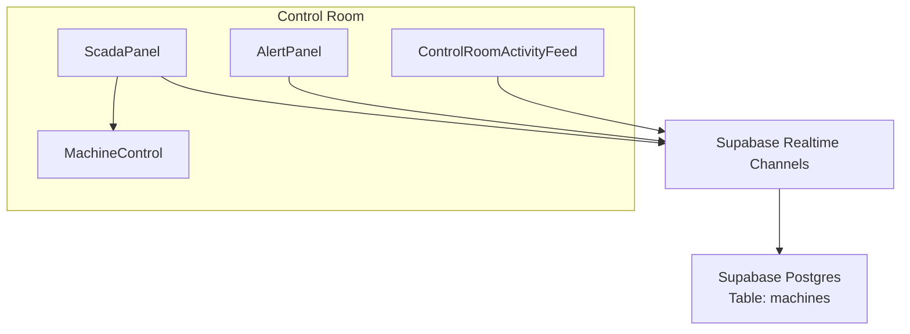
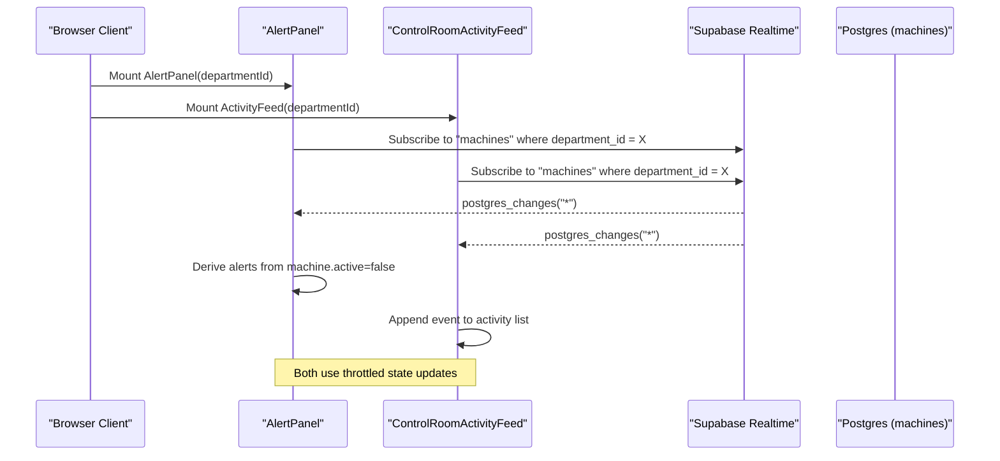
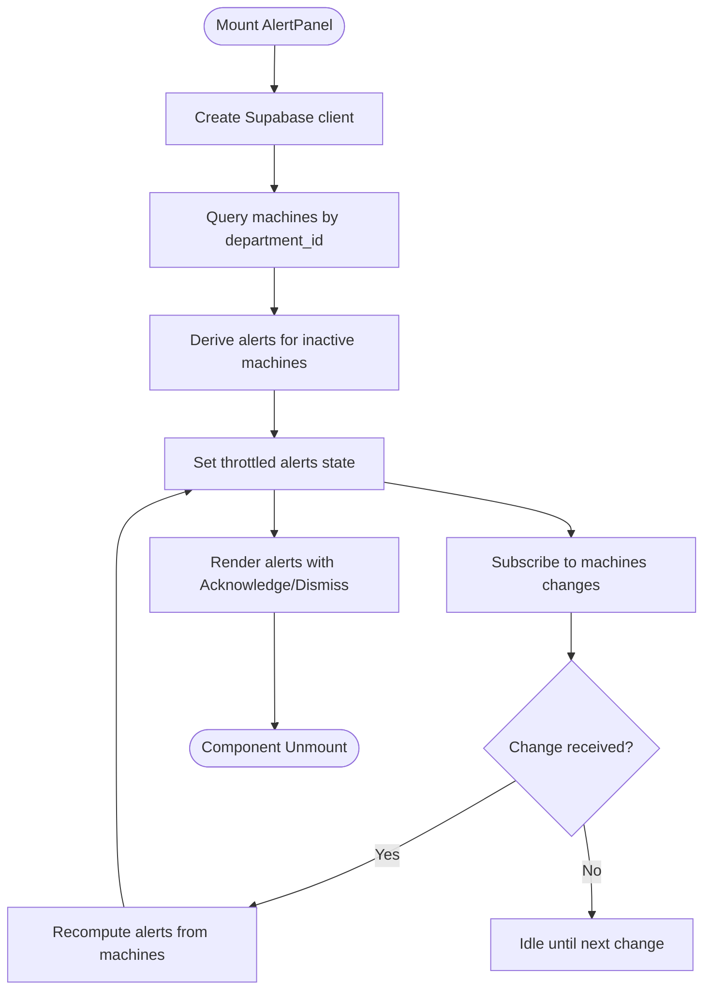
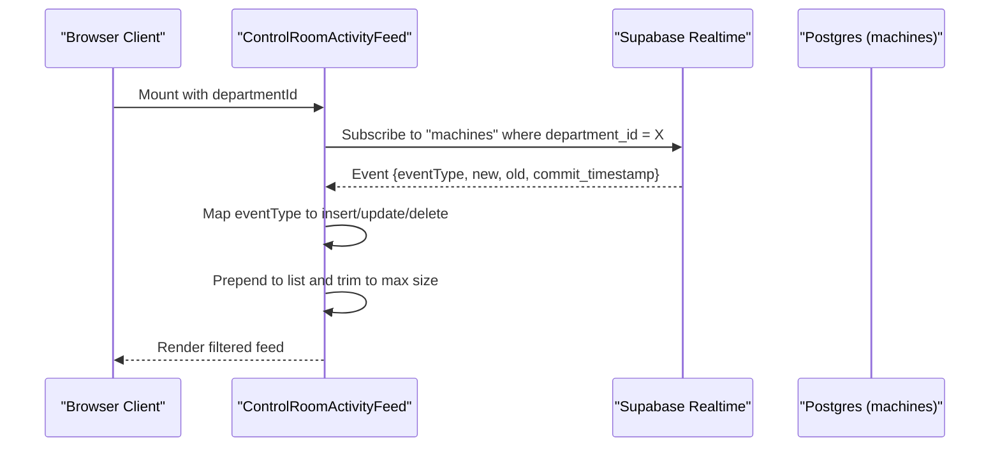
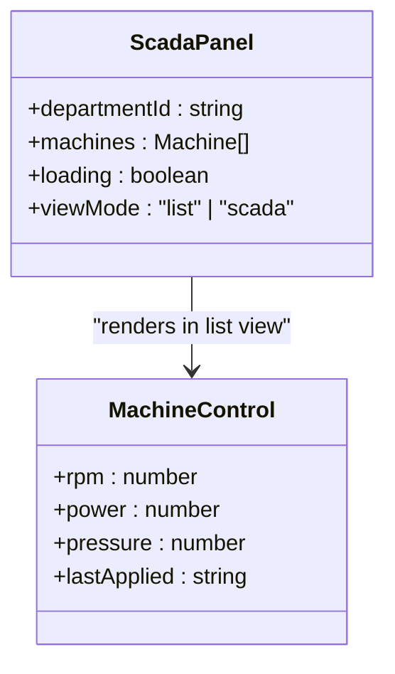
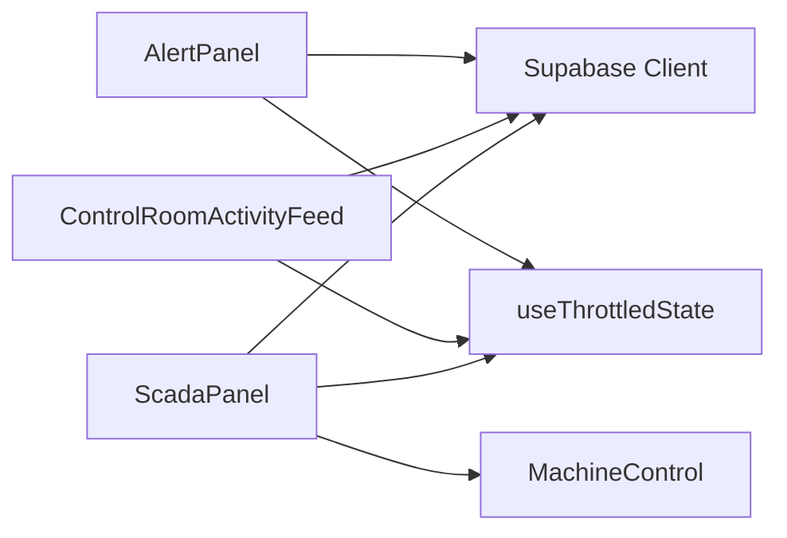

# Incident Response Tools

<cite>
**Referenced Files in This Document**
- [AlertPanel.tsx](file://apps/portal/features/departments/components/control-room/AlertPanel.tsx)
- [ControlRoomActivityFeed.tsx](file://apps/portal/features/departments/components/control-room/ControlRoomActivityFeed.tsx)
- [ScadaPanel.tsx](file://apps/portal/features/departments/components/control-room/ScadaPanel.tsx)
- [MachineControl.tsx](file://apps/portal/features/departments/components/control-room/MachineControl.tsx)
</cite>

## Table of Contents

1. [Introduction](#introduction)
2. [Project Structure](#project-structure)
3. [Core Components](#core-components)
4. [Architecture Overview](#architecture-overview)
5. [Detailed Component Analysis](#detailed-component-analysis)
6. [Dependency Analysis](#dependency-analysis)
7. [Performance Considerations](#performance-considerations)
8. [Troubleshooting Guide](#troubleshooting-guide)
9. [Conclusion](#conclusion)

## Introduction

This document describes the incident response tools implemented in the Control Room, focusing on real-time alerting, operator activity tracking, and machine status monitoring. It explains how alerts are generated from machine state changes, how operators acknowledge and dismiss them, and how a live activity feed records insert/update/delete events for auditability. It also outlines where escalation and external integrations can be added to support automated response workflows.

## Project Structure

The Control Room features are implemented as React client components under the departments feature area. The key files include:

- AlertPanel: Real-time alarm management derived from machine status
- ControlRoomActivityFeed: Live event log for machine lifecycle changes
- ScadaPanel: Machine list and SCADA dashboard entry points
- MachineControl: Operational parameter controls (for context; not part of alerting)

**Diagram sources**

- [AlertPanel.tsx:1-166](file://apps/portal/features/departments/components/control-room/AlertPanel.tsx#L1-L166)
- [ControlRoomActivityFeed.tsx:1-136](file://apps/portal/features/departments/components/control-room/ControlRoomActivityFeed.tsx#L1-L136)
- [ScadaPanel.tsx:1-176](file://apps/portal/features/departments/components/control-room/ScadaPanel.tsx#L1-L176)
- [MachineControl.tsx:1-99](file://apps/portal/features/departments/components/control-room/MachineControl.tsx#L1-L99)

**Section sources**

- [AlertPanel.tsx:1-166](file://apps/portal/features/departments/components/control-room/AlertPanel.tsx#L1-L166)
- [ControlRoomActivityFeed.tsx:1-136](file://apps/portal/features/departments/components/control-room/ControlRoomActivityFeed.tsx#L1-L136)
- [ScadaPanel.tsx:1-176](file://apps/portal/features/departments/components/control-room/ScadaPanel.tsx#L1-L176)
- [MachineControl.tsx:1-99](file://apps/portal/features/departments/components/control-room/MachineControl.tsx#L1-L99)

## Core Components

- AlertPanel
  - Purpose: Displays active alarms based on machine offline status and supports acknowledgment and dismissal.
  - Data source: Subscribes to changes on the machines table filtered by department_id.
  - State: Maintains an in-memory list of alerts with severity, acknowledgment, and timestamp.
  - Actions: Acknowledge and Dismiss buttons update local state immediately.

- ControlRoomActivityFeed
  - Purpose: Provides a real-time, filterable log of machine lifecycle events (insert/update/delete).
  - Data source: Subscribes to the same machines table changes via Supabase Realtime.
  - Filtering: Supports All/Insert/Update/Delete filters.
  - Retention: Keeps a bounded history of recent events.

- ScadaPanel
  - Purpose: Aggregates machine list and SCADA view modes; reflects online/offline counts.
  - Data source: Loads and subscribes to machines table changes for the current department.
  - Integration: Renders MachineControl when in list mode.

- MachineControl
  - Purpose: UI for setting operational parameters (RPM, power, pressure) and applying configuration.
  - Note: Not directly tied to alerting or activity feed in this implementation.

**Section sources**

- [AlertPanel.tsx:1-166](file://apps/portal/features/departments/components/control-room/AlertPanel.tsx#L1-L166)
- [ControlRoomActivityFeed.tsx:1-136](file://apps/portal/features/departments/components/control-room/ControlRoomActivityFeed.tsx#L1-L136)
- [ScadaPanel.tsx:1-176](file://apps/portal/features/departments/components/control-room/ScadaPanel.tsx#L1-L176)
- [MachineControl.tsx:1-99](file://apps/portal/features/departments/components/control-room/MachineControl.tsx#L1-L99)

## Architecture Overview

The system uses Supabase Realtime to propagate database changes to clients. Each component subscribes to the machines table scoped by department_id. Alerts are derived locally from machine.active=false, while the activity feed logs raw change events.

**Diagram sources**

- [AlertPanel.tsx:27-84](file://apps/portal/features/departments/components/control-room/AlertPanel.tsx#L27-L84)
- [ControlRoomActivityFeed.tsx:22-70](file://apps/portal/features/departments/components/control-room/ControlRoomActivityFeed.tsx#L22-L70)
- [ScadaPanel.tsx:23-75](file://apps/portal/features/departments/components/control-room/ScadaPanel.tsx#L23-L75)

## Detailed Component Analysis

### AlertPanel

- Responsibilities
  - Fetch initial machines for the department and derive critical alerts for offline machines.
  - Maintain acknowledgment state per alert and allow dismissal.
  - Display unacknowledged count badge.
- Data model
  - Alert fields: id, machineId, message, severity, acknowledged, timestamp.
- Realtime integration
  - Subscribes to all changes on machines for the department; recomputes alerts on each change.
- User actions
  - Acknowledge: marks alert acknowledged without server write.
  - Dismiss: removes alert from local list.

**Diagram sources**

- [AlertPanel.tsx:27-84](file://apps/portal/features/departments/components/control-room/AlertPanel.tsx#L27-L84)
- [AlertPanel.tsx:86-94](file://apps/portal/features/departments/components/control-room/AlertPanel.tsx#L86-L94)

**Section sources**

- [AlertPanel.tsx:1-166](file://apps/portal/features/departments/components/control-room/AlertPanel.tsx#L1-L166)

### ControlRoomActivityFeed

- Responsibilities
  - Show a live, filterable stream of machine lifecycle events.
  - Limit retained entries to a fixed window.
- Realtime integration
  - Subscribes to all changes on machines for the department.
  - Maps INSERT/UPDATE/DELETE to typed events and constructs human-readable messages.
- Filtering
  - All/Insert/Update/Delete toggles update the displayed subset.

**Diagram sources**

- [ControlRoomActivityFeed.tsx:22-70](file://apps/portal/features/departments/components/control-room/ControlRoomActivityFeed.tsx#L22-L70)
- [ControlRoomActivityFeed.tsx:72-95](file://apps/portal/features/departments/components/control-room/ControlRoomActivityFeed.tsx#L72-L95)

**Section sources**

- [ControlRoomActivityFeed.tsx:1-136](file://apps/portal/features/departments/components/control-room/ControlRoomActivityFeed.tsx#L1-L136)

### ScadaPanel and MachineControl

- ScadaPanel
  - Loads machines and subscribes to changes for the department.
  - Shows online/offline counts and switches between list and SCADA views.
- MachineControl
  - Provides inputs for RPM, power, and pressure with apply/reset actions.
  - Does not currently persist changes or emit alerts in this implementation.

**Diagram sources**

- [ScadaPanel.tsx:1-176](file://apps/portal/features/departments/components/control-room/ScadaPanel.tsx#L1-L176)
- [MachineControl.tsx:1-99](file://apps/portal/features/departments/components/control-room/MachineControl.tsx#L1-L99)

**Section sources**

- [ScadaPanel.tsx:1-176](file://apps/portal/features/departments/components/control-room/ScadaPanel.tsx#L1-L176)
- [MachineControl.tsx:1-99](file://apps/portal/features/departments/components/control-room/MachineControl.tsx#L1-L99)

## Dependency Analysis

- External dependencies
  - Supabase client and Realtime channels for live data.
  - Shared UI primitives (GlassCard, AnimatedList) for consistent presentation.
  - Local hook for throttling frequent state updates.
- Coupling
  - AlertPanel and ControlRoomActivityFeed both depend on the machines table schema and department_id filtering.
  - ScadaPanel composes MachineControl but does not share alerting logic.
- Potential circularities
  - None observed; components subscribe independently to the same channel.

**Diagram sources**

- [AlertPanel.tsx:1-10](file://apps/portal/features/departments/components/control-room/AlertPanel.tsx#L1-L10)
- [ControlRoomActivityFeed.tsx:1-10](file://apps/portal/features/departments/components/control-room/ControlRoomActivityFeed.tsx#L1-L10)
- [ScadaPanel.tsx:1-10](file://apps/portal/features/departments/components/control-room/ScadaPanel.tsx#L1-L10)
- [MachineControl.tsx:1-10](file://apps/portal/features/departments/components/control-room/MachineControl.tsx#L1-L10)

**Section sources**

- [AlertPanel.tsx:1-166](file://apps/portal/features/departments/components/control-room/AlertPanel.tsx#L1-L166)
- [ControlRoomActivityFeed.tsx:1-136](file://apps/portal/features/departments/components/control-room/ControlRoomActivityFeed.tsx#L1-L136)
- [ScadaPanel.tsx:1-176](file://apps/portal/features/departments/components/control-room/ScadaPanel.tsx#L1-L176)
- [MachineControl.tsx:1-99](file://apps/portal/features/departments/components/control-room/MachineControl.tsx#L1-L99)

## Performance Considerations

- Throttled state updates reduce re-renders during high-frequency realtime events.
- Bounded activity feed length prevents unbounded memory growth.
- Single subscription per component is appropriate; consider consolidating subscriptions if multiple panels coexist to minimize channel overhead.
- Avoid heavy computations inside realtime callbacks; keep derivation simple and offload to memoized functions if needed.

[No sources needed since this section provides general guidance]

## Troubleshooting Guide

- No alerts appearing
  - Verify machines table contains rows for the department and that inactive machines exist.
  - Ensure the realtime channel is subscribed and not removed prematurely.
- Activity feed empty
  - Confirm inserts/updates/deletes occur on the machines table for the department.
  - Check browser console for realtime connection errors.
- Acknowledge/dismiss not reflected
  - These actions are local-only; they do not persist to the server. If persistence is required, implement a backend endpoint and update the component accordingly.
- Excessive re-renders
  - Confirm throttled state usage and avoid unnecessary re-renders in child components.

**Section sources**

- [AlertPanel.tsx:86-94](file://apps/portal/features/departments/components/control-room/AlertPanel.tsx#L86-L94)
- [ControlRoomActivityFeed.tsx:22-70](file://apps/portal/features/departments/components/control-room/ControlRoomActivityFeed.tsx#L22-L70)

## Conclusion

The Control Room’s incident response tooling centers on two primary components: AlertPanel for deriving and managing alarms from machine status, and ControlRoomActivityFeed for auditing machine lifecycle changes in real time. Both rely on Supabase Realtime subscriptions scoped by department. While alert acknowledgment and dismissal are currently local-only, the architecture allows straightforward extension to server-side persistence, escalation rules, and external notification channels.

[No sources needed since this section summarizes without analyzing specific files]
