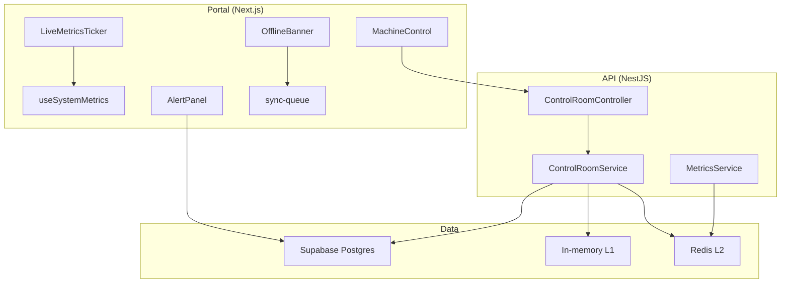
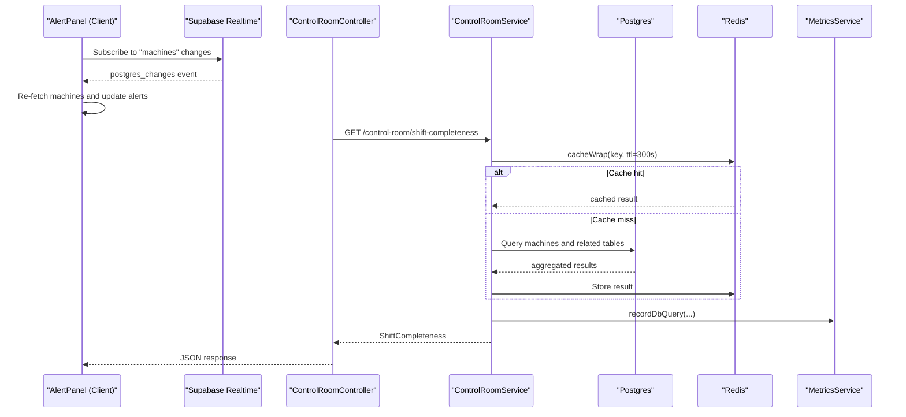
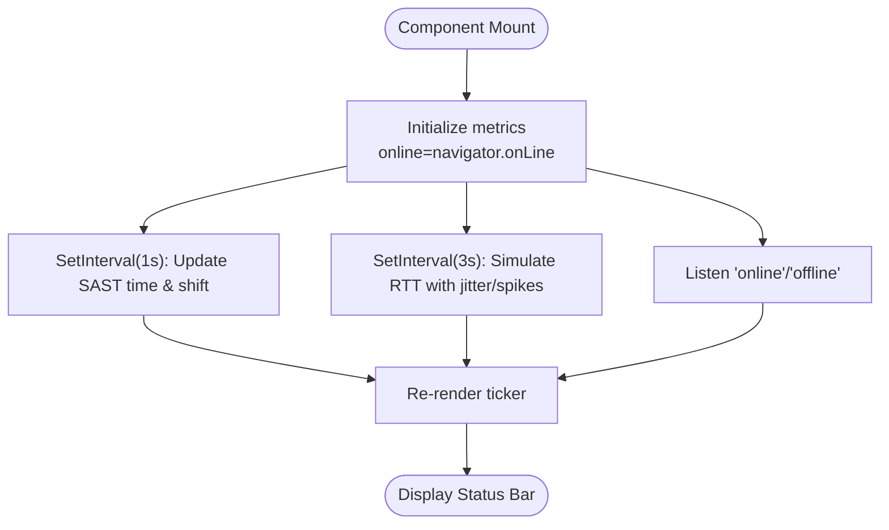
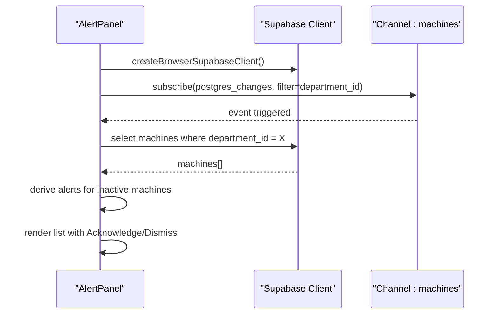
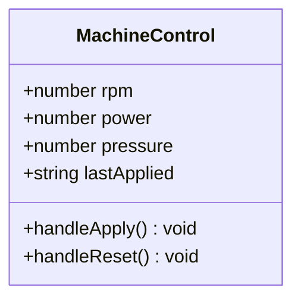
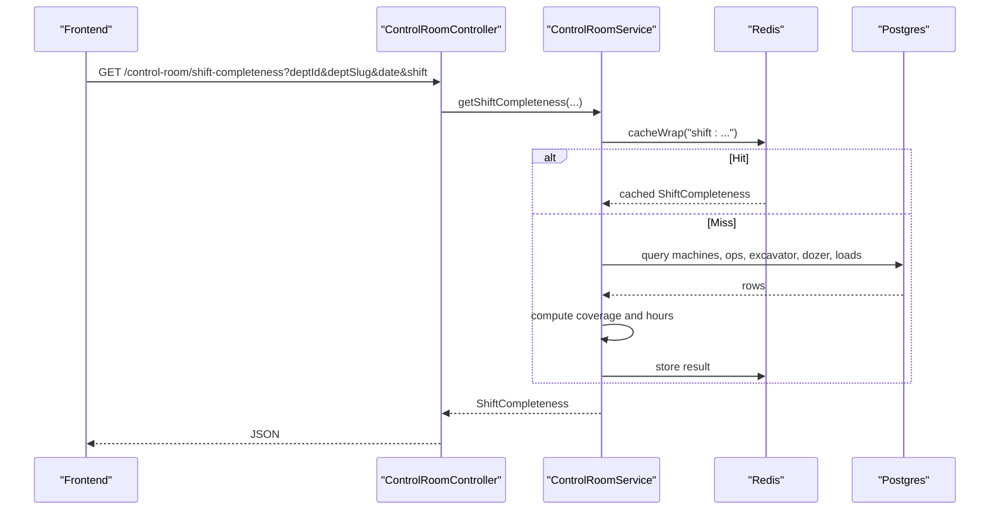
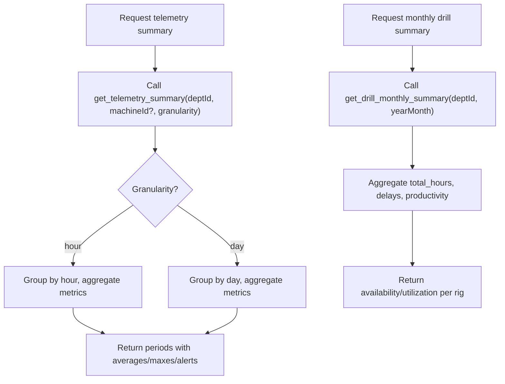
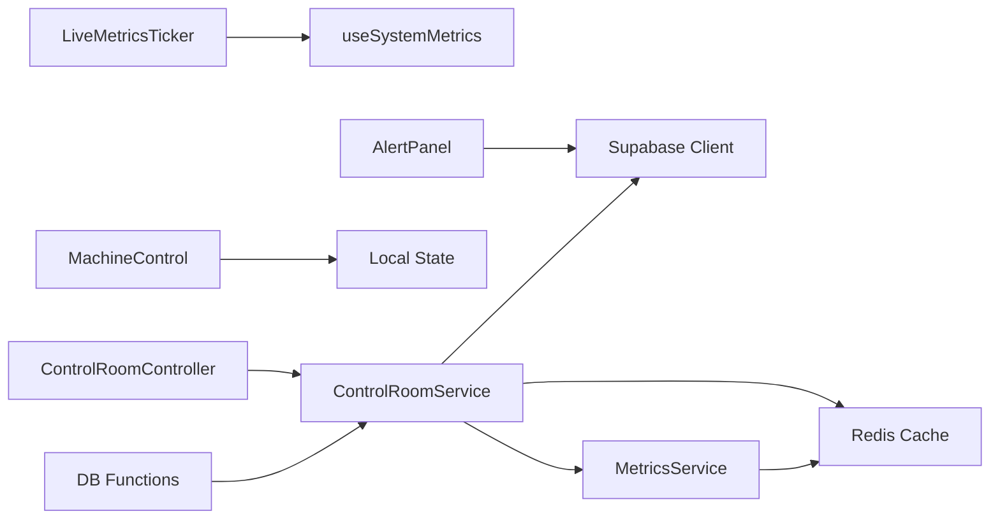

# Real-time Monitoring Dashboard

<cite>
**Referenced Files in This Document**
- [LiveMetricsTicker.tsx](file://apps/portal/components/system/LiveMetricsTicker.tsx)
- [useSystemMetrics.ts](file://apps/portal/hooks/useSystemMetrics.ts)
- [AlertPanel.tsx](file://apps/portal/features/departments/components/control-room/AlertPanel.tsx)
- [MachineControl.tsx](file://apps/portal/features/departments/components/control-room/MachineControl.tsx)
- [control-room.controller.ts](file://apps/api/src/control-room/control-room.controller.ts)
- [control-room.service.ts](file://apps/api/src/control-room/control-room.service.ts)
- [monitoring-api.ts](file://apps/portal/lib/monitoring-api.ts)
- [machine-telemetry/page.tsx](file://apps/portal/app/(departments)/drilling/machine-telemetry/page.tsx)
- [025_machine_telemetry.sql](file://packages/database/migrations/025_machine_telemetry.sql)
- [056_drill_operations_v2.sql](file://packages/database/migrations/056_drill_operations_v2.sql)
- [cache.ts](file://packages/redis/src/cache.ts)
- [stats.ts](file://packages/redis/src/stats.ts)
- [metrics.service.ts](file://apps/api/src/observability/metrics.service.ts)
- [OfflineBanner.tsx](file://apps/portal/components/OfflineBanner.tsx)
- [sync-queue.ts](file://apps/portal/lib/sync/sync-queue.ts)
</cite>

## Table of Contents

1. [Introduction](#introduction)
2. [Project Structure](#project-structure)
3. [Core Components](#core-components)
4. [Architecture Overview](#architecture-overview)
5. [Detailed Component Analysis](#detailed-component-analysis)
6. [Dependency Analysis](#dependency-analysis)
7. [Performance Considerations](#performance-considerations)
8. [Troubleshooting Guide](#troubleshooting-guide)
9. [Conclusion](#conclusion)

## Introduction

This document explains the real-time monitoring dashboard with a focus on live data streaming, WebSocket-like connections via Supabase Realtime, state synchronization, and operator interactions for equipment control. It covers:

- Live metrics ticker and system health indicators
- Machine control UI for setting operational parameters
- Alert panel that reacts to machine status changes
- Control room API endpoints for shift completeness and coverage
- Data aggregation strategies using database functions and caching layers
- Performance optimizations including multi-level caching and server-side metrics
- Resilience features such as offline handling and queued sync replay

## Project Structure

The monitoring dashboard spans client components, hooks, feature pages, an API layer, and shared infrastructure (database functions and Redis cache). The key areas are:

- Client UI: Live ticker, alert panel, machine control
- State and connectivity: System metrics hook, offline banner, sync queue
- API: NestJS controller/service for control room queries
- Data: Database functions for telemetry summaries and drill operations
- Caching and observability: Redis-based cache and metrics service

**Diagram sources**

- [LiveMetricsTicker.tsx:1-56](file://apps/portal/components/system/LiveMetricsTicker.tsx#L1-L56)
- [useSystemMetrics.ts:1-107](file://apps/portal/hooks/useSystemMetrics.ts#L1-L107)
- [AlertPanel.tsx:1-166](file://apps/portal/features/departments/components/control-room/AlertPanel.tsx#L1-L166)
- [MachineControl.tsx:1-99](file://apps/portal/features/departments/components/control-room/MachineControl.tsx#L1-L99)
- [control-room.controller.ts:1-33](file://apps/api/src/control-room/control-room.controller.ts#L1-L33)
- [control-room.service.ts:1-158](file://apps/api/src/control-room/control-room.service.ts#L1-L158)
- [cache.ts:101-150](file://packages/redis/src/cache.ts#L101-L150)
- [stats.ts:59-108](file://packages/redis/src/stats.ts#L59-L108)
- [metrics.service.ts:39-60](file://apps/api/src/observability/metrics.service.ts#L39-L60)
- [OfflineBanner.tsx:1-45](file://apps/portal/components/OfflineBanner.tsx#L1-L45)
- [sync-queue.ts:152-199](file://apps/portal/lib/sync/sync-queue.ts#L152-L199)

**Section sources**

- [LiveMetricsTicker.tsx:1-56](file://apps/portal/components/system/LiveMetricsTicker.tsx#L1-L56)
- [useSystemMetrics.ts:1-107](file://apps/portal/hooks/useSystemMetrics.ts#L1-L107)
- [AlertPanel.tsx:1-166](file://apps/portal/features/departments/components/control-room/AlertPanel.tsx#L1-L166)
- [MachineControl.tsx:1-99](file://apps/portal/features/departments/components/control-room/MachineControl.tsx#L1-L99)
- [control-room.controller.ts:1-33](file://apps/api/src/control-room/control-room.controller.ts#L1-L33)
- [control-room.service.ts:1-158](file://apps/api/src/control-room/control-room.service.ts#L1-L158)
- [cache.ts:101-150](file://packages/redis/src/cache.ts#L101-L150)
- [stats.ts:59-108](file://packages/redis/src/stats.ts#L59-L108)
- [metrics.service.ts:39-60](file://apps/api/src/observability/metrics.service.ts#L39-L60)
- [OfflineBanner.tsx:1-45](file://apps/portal/components/OfflineBanner.tsx#L1-L45)
- [sync-queue.ts:152-199](file://apps/portal/lib/sync/sync-queue.ts#L152-L199)

## Core Components

- LiveMetricsTicker: Displays system connection health, simulated websocket latency, server time in SAST, and current shift.
- useSystemMetrics: Provides runtime metrics including online status, clock updates, and latency simulation.
- AlertPanel: Subscribes to machine table changes and shows alerts when machines are offline; supports acknowledge/dismiss.
- MachineControl: Operator interface to set target RPM, power allocation, and hydraulic pressure with apply/reset actions.
- Control Room API: Endpoint to compute shift completeness across required forms per machine type.
- Telemetry Aggregation: Database functions summarize machine telemetry and drill operations for dashboards.
- Caching and Observability: Multi-level cache (in-memory + Redis) and metrics recording for performance insights.

**Section sources**

- [LiveMetricsTicker.tsx:1-56](file://apps/portal/components/system/LiveMetricsTicker.tsx#L1-L56)
- [useSystemMetrics.ts:1-107](file://apps/portal/hooks/useSystemMetrics.ts#L1-L107)
- [AlertPanel.tsx:1-166](file://apps/portal/features/departments/components/control-room/AlertPanel.tsx#L1-L166)
- [MachineControl.tsx:1-99](file://apps/portal/features/departments/components/control-room/MachineControl.tsx#L1-L99)
- [control-room.controller.ts:1-33](file://apps/api/src/control-room/control-room.controller.ts#L1-L33)
- [control-room.service.ts:1-158](file://apps/api/src/control-room/control-room.service.ts#L1-L158)
- [025_machine_telemetry.sql:230-274](file://packages/database/migrations/025_machine_telemetry.sql#L230-L274)
- [056_drill_operations_v2.sql:23-68](file://packages/database/migrations/056_drill_operations_v2.sql#L23-L68)
- [cache.ts:101-150](file://packages/redis/src/cache.ts#L101-L150)
- [stats.ts:59-108](file://packages/redis/src/stats.ts#L59-L108)
- [metrics.service.ts:39-60](file://apps/api/src/observability/metrics.service.ts#L39-L60)

## Architecture Overview

The dashboard uses a hybrid approach:

- Real-time updates via Supabase Realtime channels for machine status changes
- Server-side aggregation through database functions for telemetry and drill operations
- Multi-level caching (L1 memory, L2 Redis) to reduce DB load and improve response times
- Offline resilience with queued actions and background replay

**Diagram sources**

- [AlertPanel.tsx:1-166](file://apps/portal/features/departments/components/control-room/AlertPanel.tsx#L1-L166)
- [control-room.controller.ts:1-33](file://apps/api/src/control-room/control-room.controller.ts#L1-L33)
- [control-room.service.ts:1-158](file://apps/api/src/control-room/control-room.service.ts#L1-L158)
- [metrics.service.ts:39-60](file://apps/api/src/observability/metrics.service.ts#L39-L60)

## Detailed Component Analysis

### LiveMetricsTicker and System Metrics

- LiveMetricsTicker renders a compact status bar showing:
  - Connection indicator (green/red pulsing dot)
  - Server time in SAST
  - Simulated websocket round-trip time
  - Current shift label and time window
- useSystemMetrics provides:
  - Online/offline detection via browser events
  - One-second tick for SAST time and shift calculation
  - Periodic latency updates with jitter and occasional spikes

**Diagram sources**

- [LiveMetricsTicker.tsx:1-56](file://apps/portal/components/system/LiveMetricsTicker.tsx#L1-L56)
- [useSystemMetrics.ts:1-107](file://apps/portal/hooks/useSystemMetrics.ts#L1-L107)

**Section sources**

- [LiveMetricsTicker.tsx:1-56](file://apps/portal/components/system/LiveMetricsTicker.tsx#L1-L56)
- [useSystemMetrics.ts:1-107](file://apps/portal/hooks/useSystemMetrics.ts#L1-L107)

### Alert Panel and Real-time Updates

- Subscribes to Supabase Realtime channel for the machines table filtered by department_id
- On change, re-fetches active machines and generates critical alerts for offline machines
- Supports acknowledging and dismissing alerts locally

**Diagram sources**

- [AlertPanel.tsx:1-166](file://apps/portal/features/departments/components/control-room/AlertPanel.tsx#L1-L166)

**Section sources**

- [AlertPanel.tsx:1-166](file://apps/portal/features/departments/components/control-room/AlertPanel.tsx#L1-L166)

### MachineControl Operator Interface

- Provides inputs for target rotation speed (RPM), power allocation (%), and hydraulic pressure (PSI)
- Apply action records timestamp; Reset defaults restores initial values
- Designed for integration with backend controls or SCADA systems

**Diagram sources**

- [MachineControl.tsx:1-99](file://apps/portal/features/departments/components/control-room/MachineControl.tsx#L1-L99)

**Section sources**

- [MachineControl.tsx:1-99](file://apps/portal/features/departments/components/control-room/MachineControl.tsx#L1-L99)

### Control Room API Layer

- GET /control-room/shift-completeness returns coverage status for required forms per machine type
- Service computes coverage by querying multiple tables and applying business rules based on machine type keywords
- Results are cached in Redis with a TTL and served from cache when available

**Diagram sources**

- [control-room.controller.ts:1-33](file://apps/api/src/control-room/control-room.controller.ts#L1-L33)
- [control-room.service.ts:1-158](file://apps/api/src/control-room/control-room.service.ts#L1-L158)

**Section sources**

- [control-room.controller.ts:1-33](file://apps/api/src/control-room/control-room.controller.ts#L1-L33)
- [control-room.service.ts:1-158](file://apps/api/src/control-room/control-room.service.ts#L1-L158)

### Telemetry Aggregation and Drill Operations

- Database function get_telemetry_summary aggregates engine RPM, temperature, hydraulic pressure, penetration rate, depths, and alert counts by period and machine
- Function get_drill_monthly_summary calculates scheduled, productive, and downtime hours with derived availability/utilization percentages

**Diagram sources**

- [025_machine_telemetry.sql:230-274](file://packages/database/migrations/025_machine_telemetry.sql#L230-L274)
- [056_drill_operations_v2.sql:23-68](file://packages/database/migrations/056_drill_operations_v2.sql#L23-L68)

**Section sources**

- [025_machine_telemetry.sql:230-274](file://packages/database/migrations/025_machine_telemetry.sql#L230-L274)
- [056_drill_operations_v2.sql:23-68](file://packages/database/migrations/056_drill_operations_v2.sql#L23-L68)
- [machine-telemetry/page.tsx:146-208](<file://apps/portal/app/(departments)/drilling/machine-telemetry/page.tsx#L146-L208>)

### Satellite Monitoring API (Contextual)

- The satellite monitoring API module defines types and helpers for STAC queries, WMTS tile URLs, deformation classification, and synthetic readings generation
- Useful for geospatial overlays and deformation analysis within the broader monitoring context

**Section sources**

- [monitoring-api.ts:1-398](file://apps/portal/lib/monitoring-api.ts#L1-L398)

## Dependency Analysis

- Client dependencies:
  - LiveMetricsTicker depends on useSystemMetrics for runtime metrics
  - AlertPanel depends on Supabase client and Realtime channels
  - MachineControl is self-contained UI with local state
- Server dependencies:
  - ControlRoomController delegates to ControlRoomService
  - ControlRoomService depends on Supabase client and Redis cache
  - MetricsService records DB operation metrics and syncs to Redis
- Data dependencies:
  - Database functions provide pre-aggregated views for telemetry and drill operations
  - Caching reduces repeated DB reads and improves responsiveness

**Diagram sources**

- [LiveMetricsTicker.tsx:1-56](file://apps/portal/components/system/LiveMetricsTicker.tsx#L1-L56)
- [useSystemMetrics.ts:1-107](file://apps/portal/hooks/useSystemMetrics.ts#L1-L107)
- [AlertPanel.tsx:1-166](file://apps/portal/features/departments/components/control-room/AlertPanel.tsx#L1-L166)
- [MachineControl.tsx:1-99](file://apps/portal/features/departments/components/control-room/MachineControl.tsx#L1-L99)
- [control-room.controller.ts:1-33](file://apps/api/src/control-room/control-room.controller.ts#L1-L33)
- [control-room.service.ts:1-158](file://apps/api/src/control-room/control-room.service.ts#L1-L158)
- [metrics.service.ts:39-60](file://apps/api/src/observability/metrics.service.ts#L39-L60)

**Section sources**

- [LiveMetricsTicker.tsx:1-56](file://apps/portal/components/system/LiveMetricsTicker.tsx#L1-L56)
- [useSystemMetrics.ts:1-107](file://apps/portal/hooks/useSystemMetrics.ts#L1-L107)
- [AlertPanel.tsx:1-166](file://apps/portal/features/departments/components/control-room/AlertPanel.tsx#L1-L166)
- [MachineControl.tsx:1-99](file://apps/portal/features/departments/components/control-room/MachineControl.tsx#L1-L99)
- [control-room.controller.ts:1-33](file://apps/api/src/control-room/control-room.controller.ts#L1-L33)
- [control-room.service.ts:1-158](file://apps/api/src/control-room/control-room.service.ts#L1-L158)
- [metrics.service.ts:39-60](file://apps/api/src/observability/metrics.service.ts#L39-L60)

## Performance Considerations

- Multi-level caching:
  - L1 in-memory cache with short TTL accelerates near-term reads
  - L2 Redis cache stores longer-lived results and serves subsequent requests quickly
  - Stats tracking records hits/misses and latencies for observability
- Server-side metrics:
  - DB operation metrics recorded per table and operation, synced to Redis for aggregation
- Database aggregation:
  - Pre-aggregated functions reduce client-side processing and network payload
- Real-time efficiency:
  - Supabase Realtime subscriptions scoped to department_id minimize noise and bandwidth

[No sources needed since this section provides general guidance]

## Troubleshooting Guide

- No real-time updates:
  - Verify Supabase Realtime channel subscription and filters
  - Check network connectivity and browser events
- High latency or frequent spikes:
  - Inspect simulated websocket latency source and consider integrating actual RTT measurement
  - Review Redis cache hit rates and DB query durations
- Offline behavior:
  - Ensure OfflineBanner listens to online/offline events
  - Confirm sync queue processes pending actions when back online

**Section sources**

- [AlertPanel.tsx:1-166](file://apps/portal/features/departments/components/control-room/AlertPanel.tsx#L1-L166)
- [useSystemMetrics.ts:1-107](file://apps/portal/hooks/useSystemMetrics.ts#L1-L107)
- [OfflineBanner.tsx:1-45](file://apps/portal/components/OfflineBanner.tsx#L1-L45)
- [sync-queue.ts:152-199](file://apps/portal/lib/sync/sync-queue.ts#L152-L199)
- [cache.ts:101-150](file://packages/redis/src/cache.ts#L101-L150)
- [stats.ts:59-108](file://packages/redis/src/stats.ts#L59-L108)
- [metrics.service.ts:39-60](file://apps/api/src/observability/metrics.service.ts#L39-L60)

## Conclusion

The real-time monitoring dashboard integrates live UI components, Supabase Realtime for instant updates, robust server-side aggregation, and multi-level caching for performance. Operators can interact with machine parameters through a clear control interface, while alerts keep them informed of equipment status. Offline resilience ensures continuity through queued actions and background replay. Together, these elements deliver a responsive, reliable monitoring experience suitable for industrial operations.
