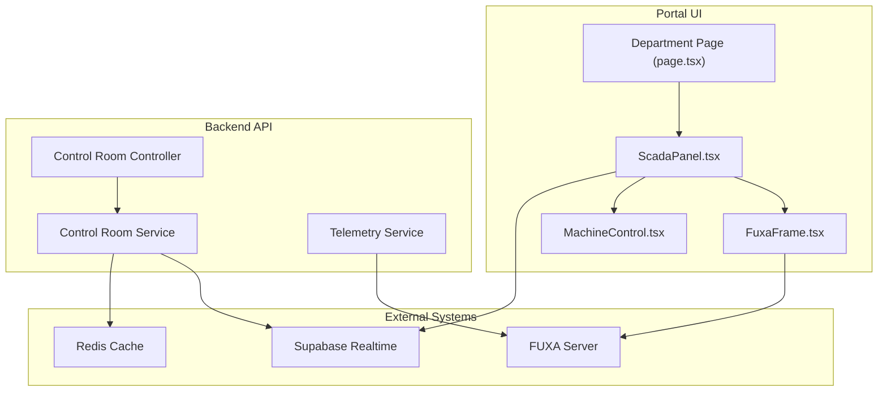
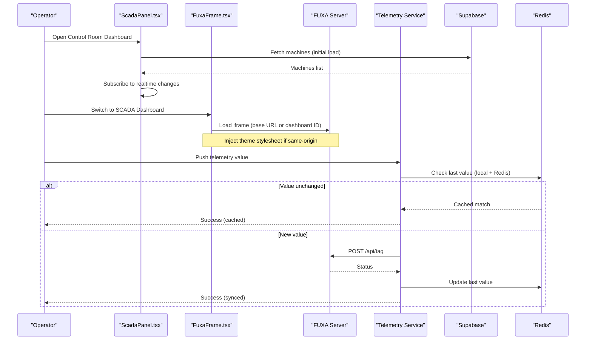
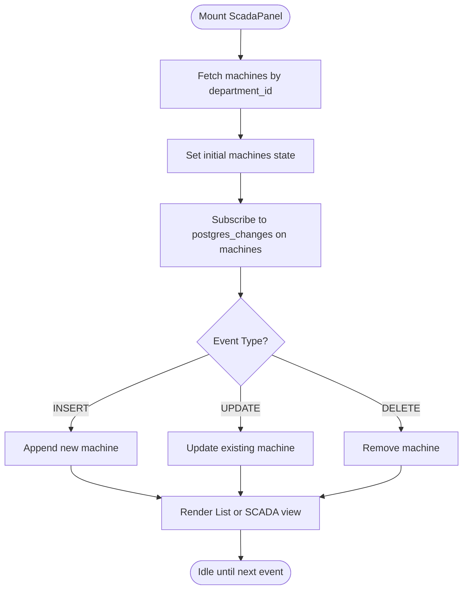
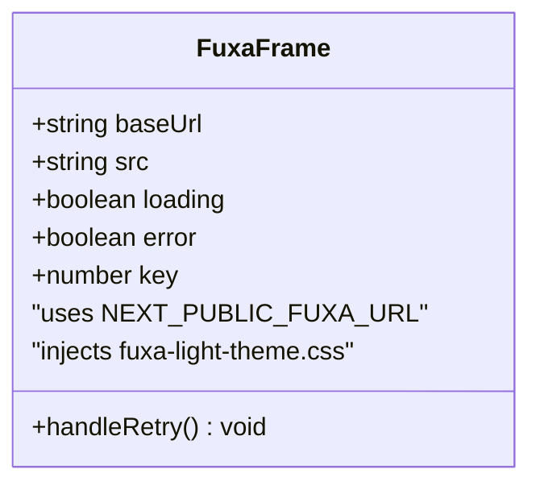
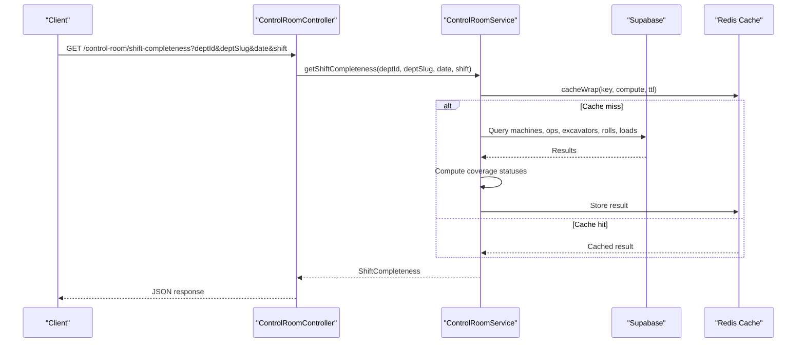
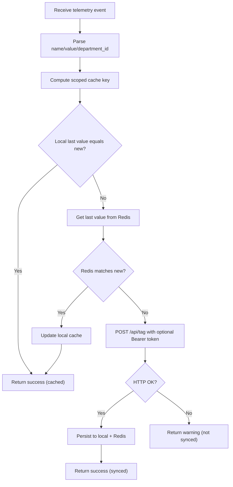
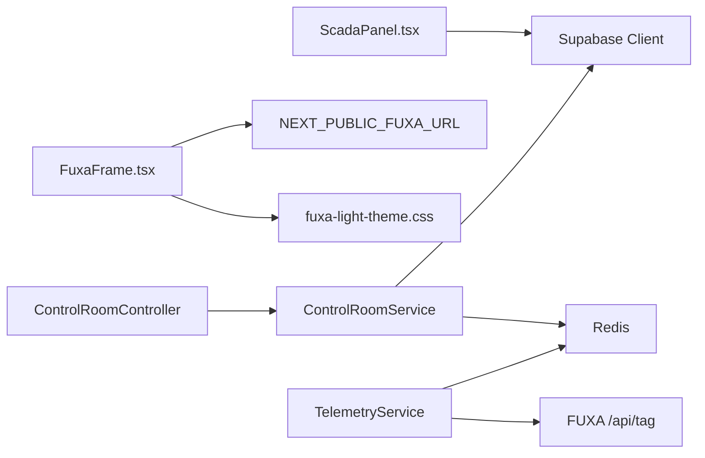

# SCADA System Integration

<cite>
**Referenced Files in This Document**
- [ScadaPanel.tsx](file://apps/portal/features/departments/components/control-room/ScadaPanel.tsx)
- [FuxaFrame.tsx](file://apps/portal/features/departments/components/control-room/FuxaFrame.tsx)
- [fuxa-integration-plan.md](file://docs/fuxa-integration-plan.md)
- [fuxa-light-theme.css](file://apps/portal/public/css/fuxa-light-theme.css)
- [MachineControl.tsx](file://apps/portal/features/departments/components/control-room/MachineControl.tsx)
- [page.tsx](file://apps/portal/app/(departments)/[department]/page.tsx)
- [control-room.controller.ts](file://apps/api/src/control-room/control-room.controller.ts)
- [control-room.service.ts](file://apps/api/src/control-room/control-room.service.ts)
- [telemetry.service.ts](file://apps/api/src/telemetry/telemetry.service.ts)
- [env.ts](file://apps/portal/lib/env.ts)
- [Dockerfile](file://apps/portal/Dockerfile)
</cite>

## Table of Contents

1. [Introduction](#introduction)
2. [Project Structure](#project-structure)
3. [Core Components](#core-components)
4. [Architecture Overview](#architecture-overview)
5. [Detailed Component Analysis](#detailed-component-analysis)
6. [Dependency Analysis](#dependency-analysis)
7. [Performance Considerations](#performance-considerations)
8. [Troubleshooting Guide](#troubleshooting-guide)
9. [Conclusion](#conclusion)
10. [Appendices](#appendices)

## Introduction

This document explains the SCADA system integration for the Control Room department, focusing on the ScadaPanel component architecture, FUXA iframe embedding patterns, and real-time data communication flows. It covers how industrial control system data is ingested, processed, and displayed in the dashboard, including configuration options for different SCADA systems, connection management, error handling, fallback mechanisms, secure communication, authentication with SCADA systems, and data validation processes.

## Project Structure

The SCADA integration spans the portal UI (Next.js), a backend API service (NestJS), and an embedded FUXA SCADA instance:

- Portal UI:
  - ScadaPanel orchestrates machine list view and FUXA dashboard embedding.
  - FuxaFrame manages iframe lifecycle, loading states, errors, and theme injection.
  - MachineControl provides operational parameter controls (UI only).
  - Department page composes ScadaPanel within the Control Room dashboard.
- Backend API:
  - Control Room endpoints compute shift completeness using Supabase and Redis caching.
  - Telemetry service bridges telemetry to FUXA via HTTP tag updates with retries and caching.
- FUXA:
  - Embedded via iframe; supports multiple industrial protocols at the SCADA layer.
  - Theme overrides align FUXA visuals with portal design tokens.

**Diagram sources**

- [ScadaPanel.tsx](file://apps/portal/features/departments/components/control-room/ScadaPanel.tsx)
- [FuxaFrame.tsx](file://apps/portal/features/departments/components/control-room/FuxaFrame.tsx)
- [MachineControl.tsx](file://apps/portal/features/departments/components/control-room/MachineControl.tsx)
- [page.tsx](<file://apps/portal/app/(departments)/[department]/page.tsx>)
- [control-room.controller.ts](file://apps/api/src/control-room/control-room.controller.ts)
- [control-room.service.ts](file://apps/api/src/control-room/control-room.service.ts)
- [telemetry.service.ts](file://apps/api/src/telemetry/telemetry.service.ts)

**Section sources**

- [ScadaPanel.tsx](file://apps/portal/features/departments/components/control-room/ScadaPanel.tsx)
- [FuxaFrame.tsx](file://apps/portal/features/departments/components/control-room/FuxaFrame.tsx)
- [MachineControl.tsx](file://apps/portal/features/departments/components/control-room/MachineControl.tsx)
- [page.tsx](<file://apps/portal/app/(departments)/[department]/page.tsx>)
- [control-room.controller.ts](file://apps/api/src/control-room/control-room.controller.ts)
- [control-room.service.ts](file://apps/api/src/control-room/control-room.service.ts)
- [telemetry.service.ts](file://apps/api/src/telemetry/telemetry.service.ts)

## Core Components

- ScadaPanel:
  - Loads machines for the current department from Supabase and subscribes to real-time changes.
  - Provides a toggle between a machine list view and the FUXA dashboard view.
  - Displays online/offline counts and delegates operational controls to MachineControl.
- FuxaFrame:
  - Embeds FUXA via iframe with configurable base URL and optional dashboard ID.
  - Manages loading and error states, includes retry logic, and injects a light theme stylesheet into the iframe when possible.
- MachineControl:
  - Presents operational parameters (RPM, power allocation, hydraulic pressure) with apply/reset actions.
- Control Room API:
  - Shift completeness endpoint aggregates required forms per machine type and computes coverage status.
  - Uses Supabase for data and Redis for caching results.
- Telemetry Bridge:
  - Bridges telemetry values to FUXA’s tag API with local and Redis deduplication and error reporting.

**Section sources**

- [ScadaPanel.tsx](file://apps/portal/features/departments/components/control-room/ScadaPanel.tsx)
- [FuxaFrame.tsx](file://apps/portal/features/departments/components/control-room/FuxaFrame.tsx)
- [MachineControl.tsx](file://apps/portal/features/departments/components/control-room/MachineControl.tsx)
- [control-room.controller.ts](file://apps/api/src/control-room/control-room.controller.ts)
- [control-room.service.ts](file://apps/api/src/control-room/control-room.service.ts)
- [telemetry.service.ts](file://apps/api/src/telemetry/telemetry.service.ts)

## Architecture Overview

The SCADA integration uses a hybrid approach:

- UI-level embedding: The portal embeds FUXA dashboards via iframes for rich visualization and operator interaction.
- Data-level bridging: The backend pushes telemetry to FUXA tags via HTTP, with caching and error handling.
- Real-time state: The portal subscribes to Supabase changes to reflect machine status live.

**Diagram sources**

- [ScadaPanel.tsx](file://apps/portal/features/departments/components/control-room/ScadaPanel.tsx)
- [FuxaFrame.tsx](file://apps/portal/features/departments/components/control-room/FuxaFrame.tsx)
- [telemetry.service.ts](file://apps/api/src/telemetry/telemetry.service.ts)

## Detailed Component Analysis

### ScadaPanel Component

Responsibilities:

- Initial fetch of machines for the active department.
- Real-time subscription to machine table changes (insert/update/delete).
- View mode toggle between machine list and FUXA dashboard.
- Aggregation of online/inactive counts and delegation to MachineControl.

Data flow:

- Reads from Supabase “machines” filtered by department_id.
- Maintains throttled state to reduce re-renders during high-frequency updates.
- Renders either a grid of machine cards or the FuxaFrame component.

Error handling:

- Loading placeholders while fetching.
- Empty-state messaging when no machines are registered.

**Diagram sources**

- [ScadaPanel.tsx](file://apps/portal/features/departments/components/control-room/ScadaPanel.tsx)

**Section sources**

- [ScadaPanel.tsx](file://apps/portal/features/departments/components/control-room/ScadaPanel.tsx)

### FuxaFrame Component

Responsibilities:

- Configure iframe source based on environment variable NEXT_PUBLIC_FUXA_URL and optional dashboardId.
- Manage loading overlay and timeout-based error state.
- Provide retry mechanism that resets iframe key to force reload.
- Attempt to inject a shared CSS theme stylesheet into the iframe when same-origin allows.

Configuration:

- NEXT_PUBLIC_FUXA_URL: Base URL for the FUXA server.
- dashboardId: Optional path segment to load a specific dashboard.

Error handling:

- Timeout after 15 seconds without load triggers an error overlay with guidance to set NEXT_PUBLIC_FUXA_URL.
- onError handler sets error state to show fallback UI.

**Diagram sources**

- [FuxaFrame.tsx](file://apps/portal/features/departments/components/control-room/FuxaFrame.tsx)
- [fuxa-light-theme.css](file://apps/portal/public/css/fuxa-light-theme.css)

**Section sources**

- [FuxaFrame.tsx](file://apps/portal/features/departments/components/control-room/FuxaFrame.tsx)
- [fuxa-light-theme.css](file://apps/portal/public/css/fuxa-light-theme.css)

### MachineControl Component

Responsibilities:

- Present operational parameters (RPM, power %, hydraulic PSI) with input constraints.
- Apply and reset actions with timestamp feedback.

Notes:

- Currently client-side only; no direct write-back to SCADA is implemented here.

**Section sources**

- [MachineControl.tsx](file://apps/portal/features/departments/components/control-room/MachineControl.tsx)

### Control Room API (Shift Completeness)

Responsibilities:

- Endpoint to compute shift completeness for a given department, date, and shift.
- Determines required form per machine type (excavator, dozer, dumper, others).
- Aggregates entries across multiple tables and calculates coverage metrics.
- Caches results in Redis with a TTL.

Validation:

- Validates required query parameters and allowed shift values.

**Diagram sources**

- [control-room.controller.ts](file://apps/api/src/control-room/control-room.controller.ts)
- [control-room.service.ts](file://apps/api/src/control-room/control-room.service.ts)

**Section sources**

- [control-room.controller.ts](file://apps/api/src/control-room/control-room.controller.ts)
- [control-room.service.ts](file://apps/api/src/control-room/control-room.service.ts)

### Telemetry Bridge to FUXA

Responsibilities:

- Receives telemetry events and pushes values to FUXA’s tag API.
- Deduplicates updates using local memory and Redis to avoid redundant writes.
- Handles non-OK responses and unreachable server scenarios gracefully.

Security:

- Supports optional Authorization header with a bearer token for FUXA API access.

**Diagram sources**

- [telemetry.service.ts](file://apps/api/src/telemetry/telemetry.service.ts)

**Section sources**

- [telemetry.service.ts](file://apps/api/src/telemetry/telemetry.service.ts)

## Dependency Analysis

Key dependencies and relationships:

- ScadaPanel depends on Supabase client for initial load and realtime subscriptions.
- FuxaFrame depends on NEXT_PUBLIC_FUXA_URL and optionally injects a theme stylesheet.
- Control Room Service depends on Supabase and Redis for data aggregation and caching.
- Telemetry Service depends on FUXA HTTP API and Redis for deduplication.

**Diagram sources**

- [ScadaPanel.tsx](file://apps/portal/features/departments/components/control-room/ScadaPanel.tsx)
- [FuxaFrame.tsx](file://apps/portal/features/departments/components/control-room/FuxaFrame.tsx)
- [fuxa-light-theme.css](file://apps/portal/public/css/fuxa-light-theme.css)
- [control-room.controller.ts](file://apps/api/src/control-room/control-room.controller.ts)
- [control-room.service.ts](file://apps/api/src/control-room/control-room.service.ts)
- [telemetry.service.ts](file://apps/api/src/telemetry/telemetry.service.ts)

**Section sources**

- [ScadaPanel.tsx](file://apps/portal/features/departments/components/control-room/ScadaPanel.tsx)
- [FuxaFrame.tsx](file://apps/portal/features/departments/components/control-room/FuxaFrame.tsx)
- [fuxa-light-theme.css](file://apps/portal/public/css/fuxa-light-theme.css)
- [control-room.controller.ts](file://apps/api/src/control-room/control-room.controller.ts)
- [control-room.service.ts](file://apps/api/src/control-room/control-room.service.ts)
- [telemetry.service.ts](file://apps/api/src/telemetry/telemetry.service.ts)

## Performance Considerations

- Throttled state updates in ScadaPanel reduce re-render overhead during frequent realtime events.
- Redis-backed caching in Control Room Service avoids repeated database queries for shift completeness.
- Local and Redis deduplication in Telemetry Service minimizes unnecessary calls to FUXA.
- Iframe loading timeout prevents indefinite spinner states and improves user experience.

## Troubleshooting Guide

Common issues and resolutions:

- FUXA Unavailable:
  - Symptom: Error overlay in FuxaFrame indicating the SCADA server could not be reached.
  - Resolution: Ensure NEXT_PUBLIC_FUXA_URL points to a reachable FUXA instance; use Retry Connection to reload.
- Cross-origin theme injection:
  - Symptom: Theme stylesheet fails to inject due to cross-origin restrictions.
  - Behavior: Gracefully bypassed; FUXA still renders without custom theme.
- Missing environment configuration:
  - Symptom: Default localhost URL used in development; production requires explicit env var.
  - Resolution: Set NEXT_PUBLIC_FUXA_URL in portal environment variables and Docker build args.
- Telemetry sync failures:
  - Symptom: Warning returned when FUXA returns non-OK or is unreachable.
  - Resolution: Verify FUXA API availability and optional bearer token configuration.

**Section sources**

- [FuxaFrame.tsx](file://apps/portal/features/departments/components/control-room/FuxaFrame.tsx)
- [env.ts](file://apps/portal/lib/env.ts)
- [Dockerfile](file://apps/portal/Dockerfile)
- [telemetry.service.ts](file://apps/api/src/telemetry/telemetry.service.ts)

## Conclusion

The SCADA integration combines a robust UI embedding strategy with a resilient data bridge. ScadaPanel provides real-time visibility and seamless switching to FUXA dashboards, while the backend ensures efficient, validated, and secure updates to SCADA tags. Configuration via environment variables and clear error handling make the system adaptable to various deployment environments and SCADA setups.

## Appendices

### Configuration Options

- NEXT_PUBLIC_FUXA_URL:
  - Purpose: Base URL for the FUXA server.
  - Scope: Frontend (iframe src) and backend (telemetry bridge).
  - Validation: Enforced as optional URL in frontend env schema.
- FUXA API Authentication:
  - Mechanism: Optional Bearer token passed in Authorization header when configured.
- Docker Build Args:
  - NEXT_PUBLIC_FUXA_URL can be injected at build time for the portal image.

**Section sources**

- [env.ts](file://apps/portal/lib/env.ts)
- [Dockerfile](file://apps/portal/Dockerfile)
- [telemetry.service.ts](file://apps/api/src/telemetry/telemetry.service.ts)

### Deployment Notes

- FUXA runs as a separate container and is accessible via reverse proxy or embedded iframe.
- Design tokens are shared through a dedicated stylesheet applied to the iframe content when same-origin allows.

**Section sources**

- [fuxa-integration-plan.md](file://docs/fuxa-integration-plan.md)
- [fuxa-light-theme.css](file://apps/portal/public/css/fuxa-light-theme.css)
