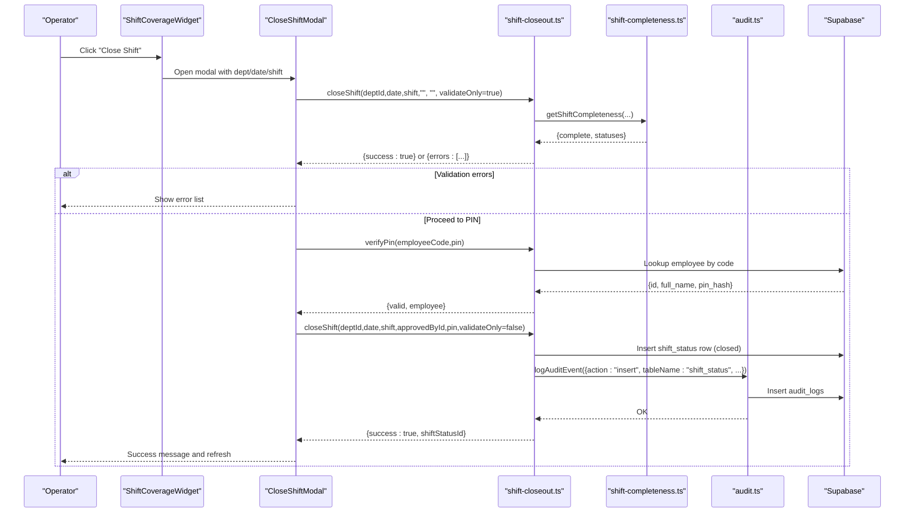
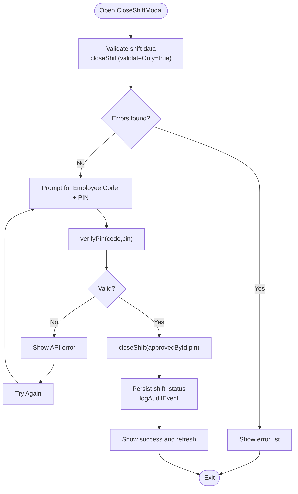
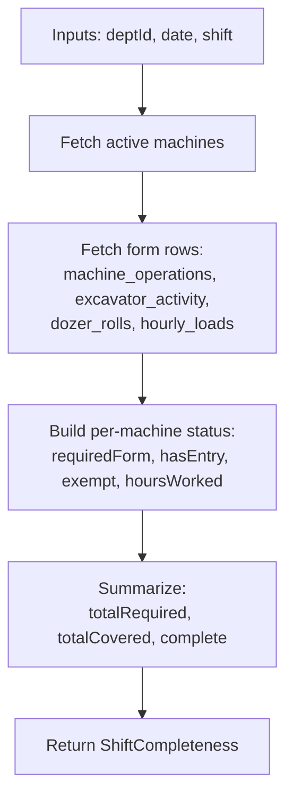
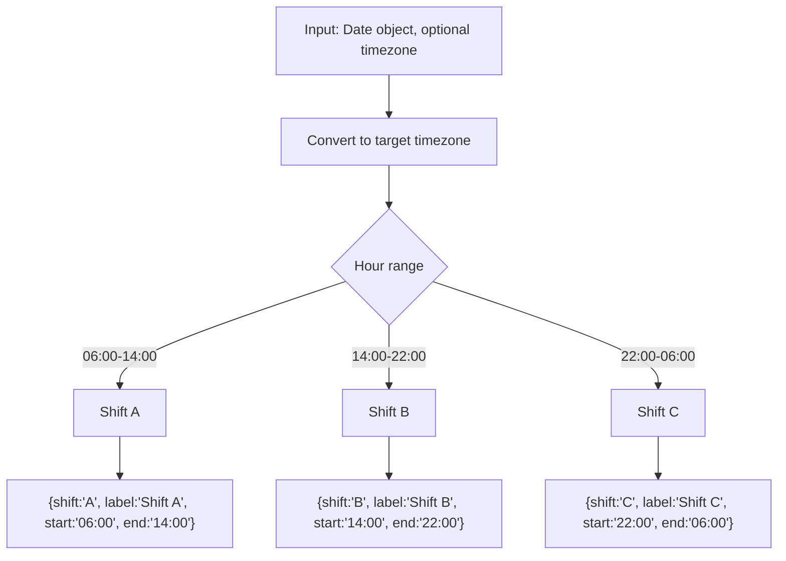
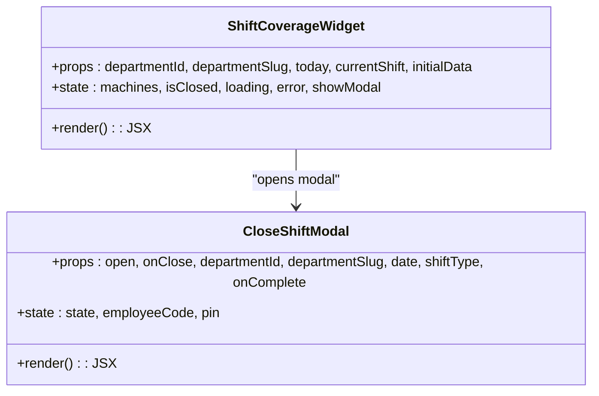
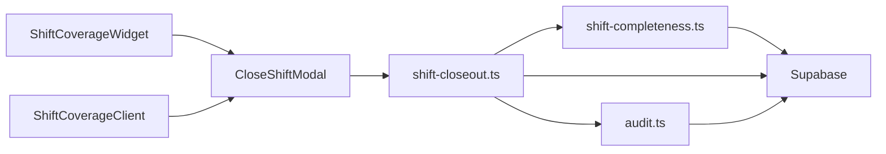

# Shift Handover Management

<cite>
**Referenced Files in This Document**
- [ShiftCoverageWidget.tsx](file://apps/portal/features/departments/components/control-room/ShiftCoverageWidget.tsx)
- [CloseShiftModal.tsx](file://apps/portal/features/departments/components/control-room/CloseShiftModal.tsx)
- [ShiftCoverageClient.tsx](file://apps/portal/app/(departments)/[department]/shift-coverage/ShiftCoverageClient.tsx)
- [shift-closeout.ts](file://apps/portal/lib/shift-closeout.ts)
- [shift-completeness.ts](file://apps/portal/lib/shift-completeness.ts)
- [audit.ts](file://apps/portal/lib/audit.ts)
- [shift-calculation.test.ts](file://apps/portal/lib/shift-calculation.test.ts)
</cite>

## Table of Contents

1. Introduction
2. Project Structure
3. Core Components
4. Architecture Overview
5. Detailed Component Analysis
6. Dependency Analysis
7. Performance Considerations
8. Troubleshooting Guide
9. Conclusion

## Introduction

This document explains the shift handover management features, focusing on:

- CloseShiftModal workflow for closing a shift with supervisor PIN approval
- Shift coverage tracking and completeness validation across machine forms
- Automated reporting generation via audit logging and cache invalidation
- ShiftCoverageWidget for visualizing shift assignments and gaps
- Data persistence during handovers and audit trail maintenance

The system supports day and night shifts, enforces completeness rules per machine type, and ensures secure closure through PIN verification.

## Project Structure

Key files involved in shift handover management:

- UI components:
  - ShiftCoverageWidget (control room widget)
  - CloseShiftModal (close-shift wizard)
  - ShiftCoverageClient (department shift coverage page)
- Server logic:
  - closeShift, verifyPin, setPin, validateShiftData
  - getShiftCompleteness (completeness calculation and caching)
  - logAuditEvent (audit trail and cache invalidation)
- Tests:
  - shift-calculation tests for three-shift classification

```mermaid
graph TB
subgraph "UI"
W["ShiftCoverageWidget"]
M["CloseShiftModal"]
C["ShiftCoverageClient"]
end
subgraph "Server Logic"
S1["shift-closeout.ts<br/>closeShift / verifyPin / setPin"]
S2["shift-completeness.ts<br/>getShiftCompleteness"]
S3["audit.ts<br/>logAuditEvent"]
end
subgraph "Data"
DB["Supabase Tables<br/>machines, machine_operations,<br/>excavator_activity, dozer_rolls,<br/>hourly_loads, shift_status,<br/>employees, audit_logs"]
end
W --> M
C --> M
M --> S1
S1 --> S2
S1 --> S3
S2 --> DB
S1 --> DB
S3 --> DB
```

**Diagram sources**

- [ShiftCoverageWidget.tsx:1-265](file://apps/portal/features/departments/components/control-room/ShiftCoverageWidget.tsx#L1-L265)
- [CloseShiftModal.tsx:1-324](file://apps/portal/features/departments/components/control-room/CloseShiftModal.tsx#L1-L324)
- [ShiftCoverageClient.tsx:1-424](<file://apps/portal/app/(departments)/[department]/shift-coverage/ShiftCoverageClient.tsx#L1-L424>)
- [shift-closeout.ts:1-245](file://apps/portal/lib/shift-closeout.ts#L1-L245)
- [shift-completeness.ts:1-324](file://apps/portal/lib/shift-completeness.ts#L1-L324)
- [audit.ts:1-57](file://apps/portal/lib/audit.ts#L1-L57)

**Section sources**

- [ShiftCoverageWidget.tsx:1-265](file://apps/portal/features/departments/components/control-room/ShiftCoverageWidget.tsx#L1-L265)
- [CloseShiftModal.tsx:1-324](file://apps/portal/features/departments/components/control-room/CloseShiftModal.tsx#L1-L324)
- [ShiftCoverageClient.tsx:1-424](<file://apps/portal/app/(departments)/[department]/shift-coverage/ShiftCoverageClient.tsx#L1-L424>)
- [shift-closeout.ts:1-245](file://apps/portal/lib/shift-closeout.ts#L1-L245)
- [shift-completeness.ts:1-324](file://apps/portal/lib/shift-completeness.ts#L1-L324)
- [audit.ts:1-57](file://apps/portal/lib/audit.ts#L1-L57)

## Core Components

- CloseShiftModal: Orchestrates the close-shift flow, including pre-validation, PIN verification, submission, and success handling.
- ShiftCoverageWidget: Displays current shift coverage status, lists machines, hours worked, and opens the CloseShiftModal when not closed.
- ShiftCoverageClient: Full-page view with date/shift navigation, coverage table, close-out history, and modal integration.
- shift-closeout server actions: Enforce business rules, validate completeness, verify PIN, persist shift closure, and emit audit events.
- shift-completeness engine: Determines required forms per machine type, aggregates entries, and computes completeness metrics.
- audit logger: Records audit events and invalidates caches by tags.

**Section sources**

- [CloseShiftModal.tsx:1-324](file://apps/portal/features/departments/components/control-room/CloseShiftModal.tsx#L1-L324)
- [ShiftCoverageWidget.tsx:1-265](file://apps/portal/features/departments/components/control-room/ShiftCoverageWidget.tsx#L1-L265)
- [ShiftCoverageClient.tsx:1-424](<file://apps/portal/app/(departments)/[department]/shift-coverage/ShiftCoverageClient.tsx#L1-L424>)
- [shift-closeout.ts:1-245](file://apps/portal/lib/shift-closeout.ts#L1-L245)
- [shift-completeness.ts:1-324](file://apps/portal/lib/shift-completeness.ts#L1-L324)
- [audit.ts:1-57](file://apps/portal/lib/audit.ts#L1-L57)

## Architecture Overview

End-to-end close-shift sequence:

**Diagram sources**

- [ShiftCoverageWidget.tsx:1-265](file://apps/portal/features/departments/components/control-room/ShiftCoverageWidget.tsx#L1-L265)
- [CloseShiftModal.tsx:1-324](file://apps/portal/features/departments/components/control-room/CloseShiftModal.tsx#L1-L324)
- [shift-closeout.ts:1-245](file://apps/portal/lib/shift-closeout.ts#L1-L245)
- [shift-completeness.ts:1-324](file://apps/portal/lib/shift-completeness.ts#L1-L324)
- [audit.ts:1-57](file://apps/portal/lib/audit.ts#L1-L57)

## Detailed Component Analysis

### CloseShiftModal Workflow

- States: validating -> has_errors | pin_entry -> verifying -> verified -> submitting -> success | api_error
- Pre-validation: Calls closeShift with validateOnly=true; if errors exist, displays them and blocks closure.
- PIN verification: Calls verifyPin with employee code and PIN; shows approver name upon success.
- Submission: Calls closeShift with approvedById and PIN; inserts shift_status record and logs audit event.
- Post-success: Refreshes route and closes modal after brief delay.

**Diagram sources**

- [CloseShiftModal.tsx:1-324](file://apps/portal/features/departments/components/control-room/CloseShiftModal.tsx#L1-L324)
- [shift-closeout.ts:1-245](file://apps/portal/lib/shift-closeout.ts#L1-L245)
- [audit.ts:1-57](file://apps/portal/lib/audit.ts#L1-L57)

**Section sources**

- [CloseShiftModal.tsx:1-324](file://apps/portal/features/departments/components/control-room/CloseShiftModal.tsx#L1-L324)
- [shift-closeout.ts:1-245](file://apps/portal/lib/shift-closeout.ts#L1-L245)
- [audit.ts:1-57](file://apps/portal/lib/audit.ts#L1-L57)

### Shift Coverage Tracking and Completeness Validation

- Required forms per machine type:
  - Excavators -> excavator-activity
  - Dozers -> roll-over
  - Dumpers/Haul trucks -> hourly-loads
  - Others -> machine-operations
- Completeness computation:
  - Aggregates entries from multiple tables for the selected department, date, and shift
  - Marks each machine as covered or not based on presence of required form entry
  - Computes totalRequired, totalCovered, and complete flag
- Hours worked:
  - Extracted from machine_operations and dozer_rolls where applicable
  - Used for validation (e.g., maximum 12h) and display

**Diagram sources**

- [shift-completeness.ts:1-324](file://apps/portal/lib/shift-completeness.ts#L1-L324)

**Section sources**

- [shift-completeness.ts:1-324](file://apps/portal/lib/shift-completeness.ts#L1-L324)

### Shift Calculation Logic (Three-Shift Classification)

- Utility determines shift label and time windows based on local timezone
- Supports custom timezone parameter
- Tests cover morning, afternoon, and overnight periods

**Diagram sources**

- [shift-calculation.test.ts:1-53](file://apps/portal/lib/shift-calculation.test.ts#L1-L53)

**Section sources**

- [shift-calculation.test.ts:1-53](file://apps/portal/lib/shift-calculation.test.ts#L1-L53)

### ShiftCoverageWidget

- Loads active machines and their operations for the current shift
- Shows reported count, hours worked, and status icons
- Opens CloseShiftModal unless the shift is already closed
- Handles loading and error states

**Diagram sources**

- [ShiftCoverageWidget.tsx:1-265](file://apps/portal/features/departments/components/control-room/ShiftCoverageWidget.tsx#L1-L265)
- [CloseShiftModal.tsx:1-324](file://apps/portal/features/departments/components/control-room/CloseShiftModal.tsx#L1-L324)

**Section sources**

- [ShiftCoverageWidget.tsx:1-265](file://apps/portal/features/departments/components/control-room/ShiftCoverageWidget.tsx#L1-L265)

### ShiftCoverageClient (Full Page View)

- Provides date and shift navigation
- Displays machine coverage table and close-out history
- Integrates CloseShiftModal for closure

**Section sources**

- [ShiftCoverageClient.tsx:1-424](<file://apps/portal/app/(departments)/[department]/shift-coverage/ShiftCoverageClient.tsx#L1-L424>)

### Data Persistence During Handovers

- On successful close:
  - Inserts a shift_status record with department_id, shift_date, shift_type, status="closed", timestamps, and approver/closer IDs
  - Logs an audit event for insert on shift_status
  - Revalidates department routes to reflect updated state

**Section sources**

- [shift-closeout.ts:149-245](file://apps/portal/lib/shift-closeout.ts#L149-L245)
- [audit.ts:1-57](file://apps/portal/lib/audit.ts#L1-L57)

### Audit Trail Maintenance

- logAuditEvent records action, table, record id, old/new data, performer, and department
- Invalidates Redis cache tags and Next.js tags for affected tables
- Requires authenticated user context

**Section sources**

- [audit.ts:1-57](file://apps/portal/lib/audit.ts#L1-L57)
- [shift-closeout.ts:230-245](file://apps/portal/lib/shift-closeout.ts#L230-L245)

## Dependency Analysis

- UI depends on server actions for validation, PIN verification, and closure
- Server actions depend on completeness engine and database tables
- Audit logger depends on Supabase auth and emits cache invalidations

**Diagram sources**

- [ShiftCoverageWidget.tsx:1-265](file://apps/portal/features/departments/components/control-room/ShiftCoverageWidget.tsx#L1-L265)
- [CloseShiftModal.tsx:1-324](file://apps/portal/features/departments/components/control-room/CloseShiftModal.tsx#L1-L324)
- [ShiftCoverageClient.tsx:1-424](<file://apps/portal/app/(departments)/[department]/shift-coverage/ShiftCoverageClient.tsx#L1-L424>)
- [shift-closeout.ts:1-245](file://apps/portal/lib/shift-closeout.ts#L1-L245)
- [shift-completeness.ts:1-324](file://apps/portal/lib/shift-completeness.ts#L1-L324)
- [audit.ts:1-57](file://apps/portal/lib/audit.ts#L1-L57)

**Section sources**

- [ShiftCoverageWidget.tsx:1-265](file://apps/portal/features/departments/components/control-room/ShiftCoverageWidget.tsx#L1-L265)
- [CloseShiftModal.tsx:1-324](file://apps/portal/features/departments/components/control-room/CloseShiftModal.tsx#L1-L324)
- [ShiftCoverageClient.tsx:1-424](<file://apps/portal/app/(departments)/[department]/shift-coverage/ShiftCoverageClient.tsx#L1-L424>)
- [shift-closeout.ts:1-245](file://apps/portal/lib/shift-closeout.ts#L1-L245)
- [shift-completeness.ts:1-324](file://apps/portal/lib/shift-completeness.ts#L1-L324)
- [audit.ts:1-57](file://apps/portal/lib/audit.ts#L1-L57)

## Performance Considerations

- Completeness calculation uses parallel queries and caches results by department, date, and shift with tag-based invalidation
- UI components avoid unnecessary re-renders by using initialData when provided
- Route revalidation is scoped to relevant department paths after closure

[No sources needed since this section provides general guidance]

## Troubleshooting Guide

Common issues and resolutions:

- Cannot close shift due to missing reports:
  - Review completeness errors displayed in the modal and submit required forms for uncovered machines
- Exceeded maximum hours:
  - Ensure no machine exceeds the allowed maximum hours before closing
- Invalid supervisor PIN:
  - Confirm employee code and PIN are correct; ensure approver has a PIN set
- Not authenticated:
  - Ensure the operator session is valid before attempting to close a shift
- Database errors:
  - Check network connectivity and Supabase availability; review server logs for detailed messages

**Section sources**

- [shift-closeout.ts:18-69](file://apps/portal/lib/shift-closeout.ts#L18-L69)
- [shift-closeout.ts:149-245](file://apps/portal/lib/shift-closeout.ts#L149-L245)
- [CloseShiftModal.tsx:1-324](file://apps/portal/features/departments/components/control-room/CloseShiftModal.tsx#L1-L324)

## Conclusion

The shift handover management system integrates robust validation, secure PIN-based approvals, and comprehensive audit logging. The UI components provide clear visibility into coverage and gaps, while server-side logic ensures data integrity and consistent state transitions. Cache-aware design improves performance and keeps dashboards up to date after closures.
