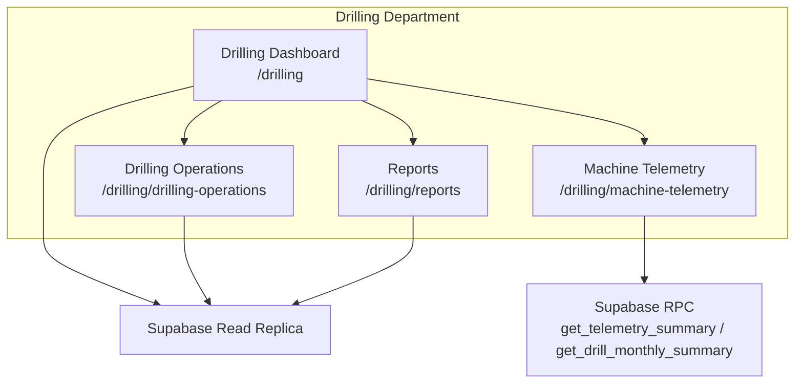
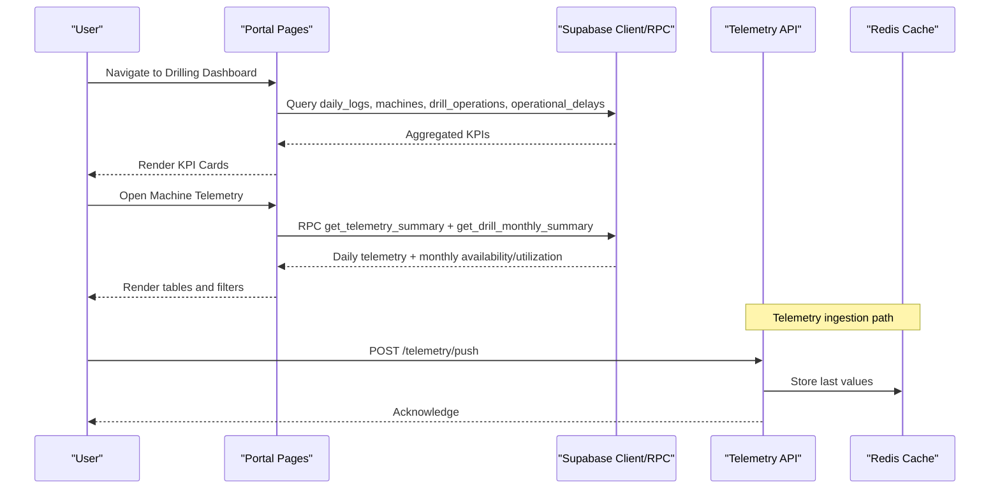
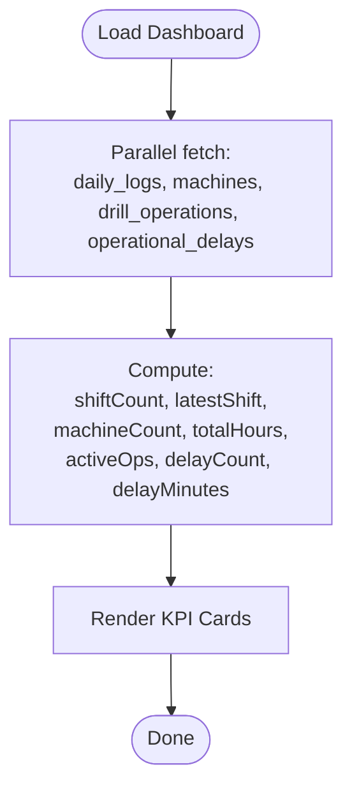
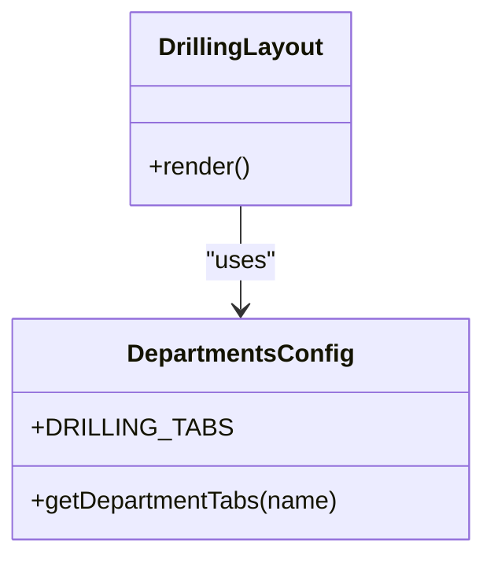
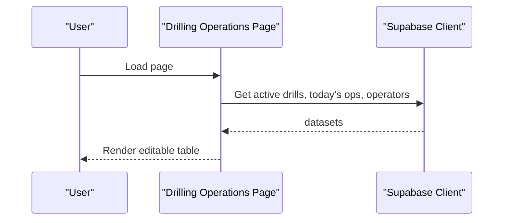
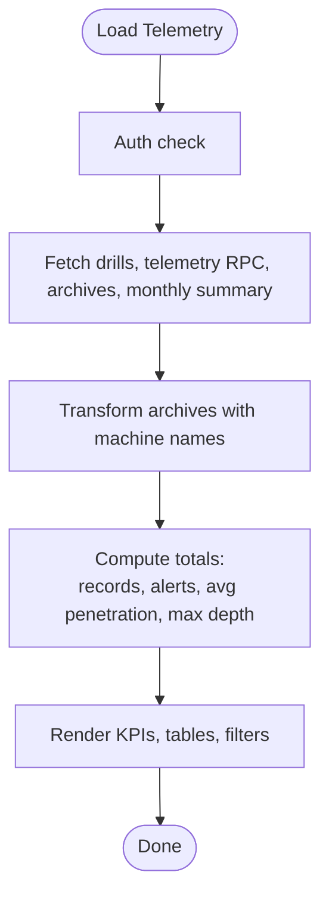
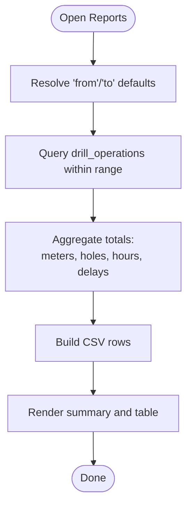
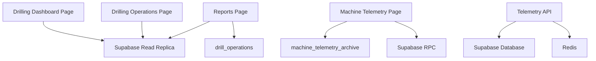

# Drilling Dashboard

<cite>
**Referenced Files in This Document**
- [page.tsx](file://apps/portal/app/(departments)/drilling/page.tsx)
- [layout.tsx](file://apps/portal/app/(departments)/drilling/layout.tsx)
- [departments.ts](file://apps/portal/lib/departments.ts)
- [machine-telemetry/page.tsx](file://apps/portal/app/(departments)/drilling/machine-telemetry/page.tsx)
- [drilling-operations/page.tsx](file://apps/portal/app/(departments)/drilling/drilling-operations/page.tsx)
- [reports/page.tsx](file://apps/portal/app/(departments)/drilling/reports/page.tsx)
- [dashboard-service.ts](file://apps/portal/lib/dashboard-service.ts)
- [telemetry.controller.ts](file://apps/api/src/telemetry/telemetry.controller.ts)
- [telemetry.service.ts](file://apps/api/src/telemetry/telemetry.service.ts)
</cite>

## Table of Contents

1. [Introduction](#introduction)
2. [Project Structure](#project-structure)
3. [Core Components](#core-components)
4. [Architecture Overview](#architecture-overview)
5. [Detailed Component Analysis](#detailed-component-analysis)
6. [Dependency Analysis](#dependency-analysis)
7. [Performance Considerations](#performance-considerations)
8. [Troubleshooting Guide](#troubleshooting-guide)
9. [Conclusion](#conclusion)

## Introduction

The Drilling Department dashboard provides a centralized overview of drilling operations, key performance indicators (KPIs), and real-time status updates. It aggregates data from daily logs, active machines, operational hours, delays, telemetry summaries, and monthly availability/utilization metrics. The interface is organized with a tabbed navigation system that includes the main dashboard, drilling operations, machine telemetry, and reports. It integrates with telemetry ingestion endpoints to support live monitoring and historical analysis.

## Project Structure

The Drilling department is implemented as a Next.js App Router feature under the portal application. Key routes include:

- Drilling Dashboard: high-level KPIs for today’s shifts, active drills, hours worked, and delays
- Drilling Operations: per-rig, per-shift inline logging and editing
- Machine Telemetry: aggregated daily telemetry, monthly availability/utilization, and archived months
- Reports: production report with date range filtering and CSV export

**Diagram sources**

- [page.tsx](<file://apps/portal/app/(departments)/drilling/page.tsx#L8-L65>)
- [machine-telemetry/page.tsx](<file://apps/portal/app/(departments)/drilling/machine-telemetry/page.tsx#L64-L153>)
- [drilling-operations/page.tsx](<file://apps/portal/app/(departments)/drilling/drilling-operations/page.tsx#L8-L54>)
- [reports/page.tsx](<file://apps/portal/app/(departments)/drilling/reports/page.tsx#L30-L64>)

**Section sources**

- [layout.tsx](<file://apps/portal/app/(departments)/drilling/layout.tsx#L1-L27>)
- [departments.ts:253-261](file://apps/portal/lib/departments.ts#L253-L261)

## Core Components

- Drilling Dashboard Page: Displays four primary KPI cards (today’s log status, active drills, hours today, and delays). Data is fetched concurrently from daily logs, machines, drill operations, and operational delays for the current day.
- Drilling Operations Page: Loads active drill rigs, today’s shift records, and operators; renders an interactive table for inline edits.
- Machine Telemetry Page: Aggregates daily telemetry via Supabase RPC, computes monthly availability/utilization from drill operations, and lists archived months. Supports filtering by specific drill rig.
- Reports Page: Produces a production summary over a selected date range with totals for meters drilled, holes, operating hours, and categorized delays; supports CSV download.

Key responsibilities:

- Data aggregation across multiple tables using parallel queries
- Real-time or near-real-time presentation through server-side rendering with dynamic caching where applicable
- Integration points for telemetry ingestion and archival workflows

**Section sources**

- [page.tsx](<file://apps/portal/app/(departments)/drilling/page.tsx#L8-L65>)
- [drilling-operations/page.tsx](<file://apps/portal/app/(departments)/drilling/drilling-operations/page.tsx#L8-L54>)
- [machine-telemetry/page.tsx](<file://apps/portal/app/(departments)/drilling/machine-telemetry/page.tsx#L64-L153>)
- [reports/page.tsx](<file://apps/portal/app/(departments)/drilling/reports/page.tsx#L30-L97>)

## Architecture Overview

The dashboard follows a server-rendered architecture with direct database access via Supabase clients. It uses read replicas for dashboard reads and RPC functions for complex aggregations. Telemetry ingestion is handled by a separate API service that persists values and exposes computation endpoints.

**Diagram sources**

- [page.tsx](<file://apps/portal/app/(departments)/drilling/page.tsx#L8-L65>)
- [machine-telemetry/page.tsx](<file://apps/portal/app/(departments)/drilling/machine-telemetry/page.tsx#L64-L153>)
- [telemetry.controller.ts:11-25](file://apps/api/src/telemetry/telemetry.controller.ts#L11-L25)
- [telemetry.service.ts:32-39](file://apps/api/src/telemetry/telemetry.service.ts#L32-L39)

## Detailed Component Analysis

### Drilling Dashboard Page

- Purpose: Provide a quick snapshot of today’s drilling activity and health.
- Data Sources:
  - daily_logs: count and latest shift
  - machines: count of active Drill Rigs
  - drill_operations: total hours and active operation count
  - operational_delays: count and total minutes lost
- Rendering: Four GlassCard widgets arranged in a responsive grid.

**Diagram sources**

- [page.tsx](<file://apps/portal/app/(departments)/drilling/page.tsx#L8-L65>)

**Section sources**

- [page.tsx](<file://apps/portal/app/(departments)/drilling/page.tsx#L8-L65>)

### Tabbed Navigation System

- The Drilling layout configures department-specific tabs including Dashboard, Drilling Operations, Machine Telemetry, and Reports.
- Tabs are resolved via a central configuration function that returns the appropriate set for each department.

**Diagram sources**

- [departments.ts:253-309](file://apps/portal/lib/departments.ts#L253-L309)
- [layout.tsx](<file://apps/portal/app/(departments)/drilling/layout.tsx#L12-L21>)

**Section sources**

- [departments.ts:253-309](file://apps/portal/lib/departments.ts#L253-L309)
- [layout.tsx](<file://apps/portal/app/(departments)/drilling/layout.tsx#L12-L21>)

### Drilling Operations Page

- Purpose: Manage per-rig, per-shift entries for the current operational day.
- Data Sources:
  - machines: active Drill Rigs
  - drill_operations: today’s shift records
  - employees: available operators
- Features: Inline editing with blur-save behavior (as indicated by page header text).

**Diagram sources**

- [drilling-operations/page.tsx](<file://apps/portal/app/(departments)/drilling/drilling-operations/page.tsx#L8-L54>)

**Section sources**

- [drilling-operations/page.tsx](<file://apps/portal/app/(departments)/drilling/drilling-operations/page.tsx#L8-L54>)

### Machine Telemetry Page

- Purpose: Display aggregated daily telemetry, monthly availability/utilization, and archived months.
- Data Sources:
  - machines: active Drill Rigs
  - Supabase RPC: get_telemetry_summary (daily averages, alerts, record counts)
  - Supabase RPC: get_drill_monthly_summary (availability/utilization derived from drill operations)
  - machine_telemetry_archive: recent archives
- Features:
  - Filter by specific drill rig
  - Color-coded thresholds for engine temperature and RPM
  - Export button placeholder

**Diagram sources**

- [machine-telemetry/page.tsx](<file://apps/portal/app/(departments)/drilling/machine-telemetry/page.tsx#L64-L153>)

**Section sources**

- [machine-telemetry/page.tsx](<file://apps/portal/app/(departments)/drilling/machine-telemetry/page.tsx#L64-L153>)

### Reports Page

- Purpose: Generate a production report for a selected date range with totals and CSV export.
- Data Sources:
  - drill_operations: filtered by date range and department
- Features:
  - Date range inputs
  - Summary cards for meters, holes, hours, and delays
  - CSV generation and download

**Diagram sources**

- [reports/page.tsx](<file://apps/portal/app/(departments)/drilling/reports/page.tsx#L30-L97>)

**Section sources**

- [reports/page.tsx](<file://apps/portal/app/(departments)/drilling/reports/page.tsx#L30-L97>)

### Conceptual Overview

This section summarizes how the dashboard aggregates information without referencing specific files. The dashboard combines:

- Shift completeness and timing from daily logs
- Equipment readiness from active machines
- Operational throughput from drill operations
- Delay impact from operational delays
- Telemetry insights from aggregated sensor readings and monthly summaries

[No sources needed since this section doesn't analyze specific files]

## Dependency Analysis

The following diagram shows dependencies between pages, services, and external systems.

**Diagram sources**

- [page.tsx](<file://apps/portal/app/(departments)/drilling/page.tsx#L8-L65>)
- [machine-telemetry/page.tsx](<file://apps/portal/app/(departments)/drilling/machine-telemetry/page.tsx#L64-L153>)
- [drilling-operations/page.tsx](<file://apps/portal/app/(departments)/drilling/drilling-operations/page.tsx#L8-L54>)
- [reports/page.tsx](<file://apps/portal/app/(departments)/drilling/reports/page.tsx#L30-L64>)
- [telemetry.controller.ts:11-25](file://apps/api/src/telemetry/telemetry.controller.ts#L11-L25)
- [telemetry.service.ts:32-39](file://apps/api/src/telemetry/telemetry.service.ts#L32-L39)

**Section sources**

- [dashboard-service.ts:84-99](file://apps/portal/lib/dashboard-service.ts#L84-L99)

## Performance Considerations

- Parallel Queries: The dashboard uses concurrent fetching to minimize latency when assembling KPIs.
- Server-Side Rendering: Pages are rendered on the server with dynamic content, ensuring up-to-date metrics.
- Caching: A monolithized dashboard service demonstrates caching patterns for department dashboards; similar strategies can be applied to telemetry and reports if needed.
- Indexing: Ensure indexes on frequently filtered columns such as department_id, operation_date, and machine_type to optimize query performance.
- Archive Strategy: Monthly archival reduces load on active telemetry tables and improves query speed for current-month views.

[No sources needed since this section provides general guidance]

## Troubleshooting Guide

Common issues and resolutions:

- Unauthorized Access: If authentication fails during server-side requests, users will be redirected to login. Verify session validity and ensure proper auth middleware.
- Missing Department Context: If the drilling department is not found, the layout will return a not-found response. Confirm department configuration exists.
- Empty Data Sets: When no telemetry or operations exist for the selected period, pages render empty states with helpful messages. Validate data ingestion pipelines and schedules.
- Telemetry Ingestion Failures: Check the telemetry controller/service for errors and Redis connectivity. Ensure required fields are present in payloads.

**Section sources**

- [machine-telemetry/page.tsx](<file://apps/portal/app/(departments)/drilling/machine-telemetry/page.tsx#L70-L95>)
- [drilling-operations/page.tsx](<file://apps/portal/app/(departments)/drilling/drilling-operations/page.tsx#L8-L23>)
- [layout.tsx](<file://apps/portal/app/(departments)/drilling/layout.tsx#L12-L15>)
- [telemetry.controller.ts:11-25](file://apps/api/src/telemetry/telemetry.controller.ts#L11-L25)
- [telemetry.service.ts:32-39](file://apps/api/src/telemetry/telemetry.service.ts#L32-L39)

## Conclusion

The Drilling Dashboard consolidates critical operational insights into a cohesive interface, enabling operators and managers to monitor shifts, equipment utilization, delays, and telemetry trends. Its modular structure, clear tabbed navigation, and integration with telemetry ingestion provide both immediate visibility and deeper analytical capabilities. By leveraging parallel queries, server-side rendering, and optional caching, the system balances responsiveness with accuracy.
