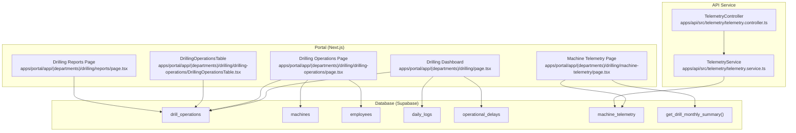
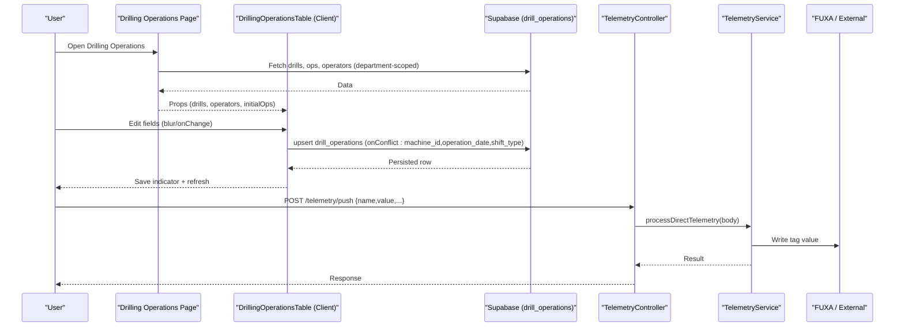
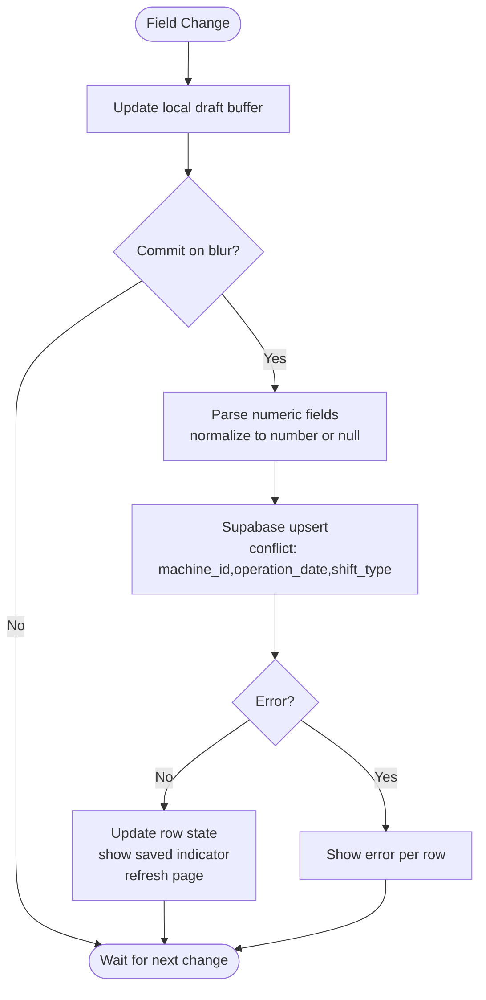
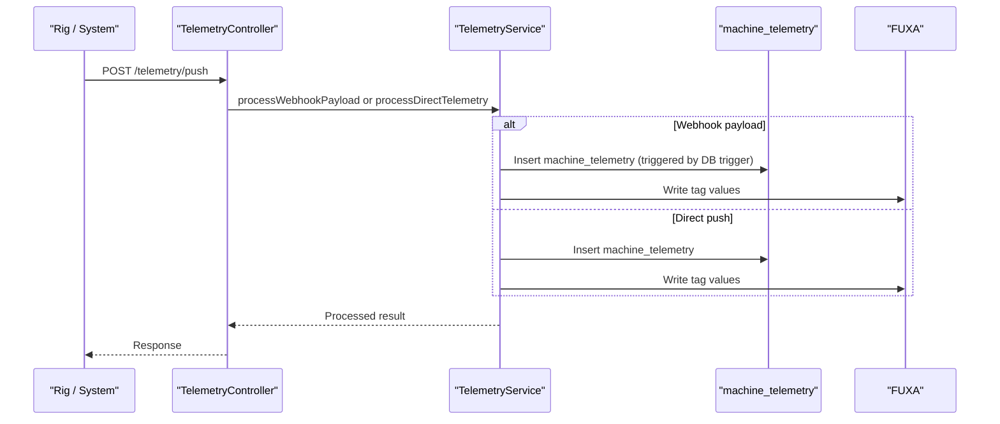
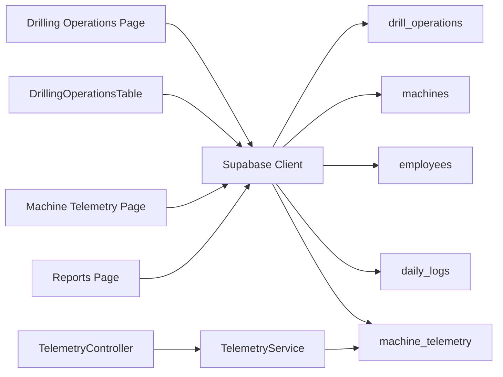
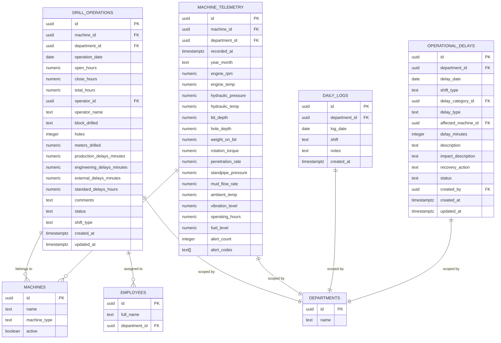

# Drilling Operations Management

<cite>
**Referenced Files in This Document**
- [page.tsx](file://apps/portal/app/(departments)/drilling/page.tsx)
- [page.tsx](file://apps/portal/app/(departments)/drilling/drilling-operations/page.tsx)
- [DrillingOperationsTable.tsx](file://apps/portal/app/(departments)/drilling/drilling-operations/DrillingOperationsTable.tsx)
- [page.tsx](file://apps/portal/app/(departments)/drilling/machine-telemetry/page.tsx)
- [page.tsx](file://apps/portal/app/(departments)/drilling/reports/page.tsx)
- [024_drill_operations.sql](file://packages/supabase/migrations/024_drill_operations.sql)
- [027_drill_shifts_and_archiving.sql](file://packages/supabase/migrations/027_drill_shifts_and_archiving.sql)
- [056_drill_operations_v2.sql](file://packages/supabase/migrations/056_drill_operations_v2.sql)
- [025_machine_telemetry.sql](file://packages/supabase/migrations/025_machine_telemetry.sql)
- [053_machine_telemetry_webhook.sql](file://packages/supabase/migrations/053_machine_telemetry_webhook.sql)
- [database.types.ts](file://packages/supabase/src/database.types.ts)
- [telemetry.controller.ts](file://apps/api/src/telemetry/telemetry.controller.ts)
- [telemetry.service.ts](file://apps/api/src/telemetry/telemetry.service.ts)
- [schemas.ts](file://apps/api/src/common/schemas.ts)
- [drilling-department.md](file://wiki/entities/drilling-department.md)
</cite>

## Table of Contents

1. [Introduction](#introduction)
2. [Project Structure](#project-structure)
3. [Core Components](#core-components)
4. [Architecture Overview](#architecture-overview)
5. [Detailed Component Analysis](#detailed-component-analysis)
6. [Dependency Analysis](#dependency-analysis)
7. [Performance Considerations](#performance-considerations)
8. [Troubleshooting Guide](#troubleshooting-guide)
9. [Conclusion](#conclusion)
10. [Appendices](#appendices)

## Introduction

This document describes the Drilling Operations Management system, focusing on the operations table interface for managing drilling activities, job scheduling, and workflow coordination. It explains CRUD operations for drilling jobs, status tracking, assignment management, progress monitoring, data model details, form validations, bulk operations, reporting capabilities, and integration with machine telemetry and daily logging systems.

The system provides:

- A per-shift, per-rig operations log with inline editing and auto-save on blur
- Status tracking and operator assignment
- Monthly availability and utilization summaries
- Machine telemetry ingestion and archival
- Daily shift logs and operational delays
- Reporting and CSV export

## Project Structure

The drilling feature is implemented under the portal app’s department routes and supported by database migrations and an API service for telemetry processing.

**Diagram sources**

- [page.tsx](<file://apps/portal/app/(departments)/drilling/page.tsx>)
- [page.tsx](<file://apps/portal/app/(departments)/drilling/drilling-operations/page.tsx>)
- [DrillingOperationsTable.tsx](<file://apps/portal/app/(departments)/drilling/drilling-operations/DrillingOperationsTable.tsx>)
- [page.tsx](<file://apps/portal/app/(departments)/drilling/machine-telemetry/page.tsx>)
- [page.tsx](<file://apps/portal/app/(departments)/drilling/reports/page.tsx>)
- [024_drill_operations.sql](file://packages/supabase/migrations/024_drill_operations.sql)
- [025_machine_telemetry.sql](file://packages/supabase/migrations/025_machine_telemetry.sql)
- [056_drill_operations_v2.sql](file://packages/supabase/migrations/056_drill_operations_v2.sql)
- [telemetry.controller.ts](file://apps/api/src/telemetry/telemetry.controller.ts)
- [telemetry.service.ts](file://apps/api/src/telemetry/telemetry.service.ts)

**Section sources**

- [page.tsx](<file://apps/portal/app/(departments)/drilling/page.tsx>)
- [page.tsx](<file://apps/portal/app/(departments)/drilling/drilling-operations/page.tsx>)
- [DrillingOperationsTable.tsx](<file://apps/portal/app/(departments)/drilling/drilling-operations/DrillingOperationsTable.tsx>)
- [page.tsx](<file://apps/portal/app/(departments)/drilling/machine-telemetry/page.tsx>)
- [page.tsx](<file://apps/portal/app/(departments)/drilling/reports/page.tsx>)
- [drilling-department.md](file://wiki/entities/drilling-department.md)

## Core Components

- Drilling Dashboard: Aggregates today’s shifts, active rigs, total hours, and delays.
- Drilling Operations Table: Per-rig, per-shift inline editing with upsert to the database; supports day/night shifts and operator assignment.
- Machine Telemetry: Displays current month telemetry summaries, archived months, and monthly availability/utilization computed from drill operations.
- Reports: Date-range filtered view of drill operations with CSV export.

Key responsibilities:

- Data fetching via Supabase client (server-side pages) and browser client (client component).
- Form validation and numeric parsing before persistence.
- Conflict-aware upsert keyed by machine_id, operation_date, and shift_type.
- RLS-scoped queries using department context.

**Section sources**

- [page.tsx](<file://apps/portal/app/(departments)/drilling/page.tsx>)
- [page.tsx](<file://apps/portal/app/(departments)/drilling/drilling-operations/page.tsx>)
- [DrillingOperationsTable.tsx](<file://apps/portal/app/(departments)/drilling/drilling-operations/DrillingOperationsTable.tsx>)
- [page.tsx](<file://apps/portal/app/(departments)/drilling/machine-telemetry/page.tsx>)
- [page.tsx](<file://apps/portal/app/(departments)/drilling/reports/page.tsx>)

## Architecture Overview

The system follows a Next.js App Router pattern with server components for data loading and a client component for interactive editing. Database access uses Supabase clients with RLS policies scoped by department. Telemetry ingestion flows through a dedicated API endpoint that validates payloads and forwards values to SCADA while persisting to the database.

**Diagram sources**

- [page.tsx](<file://apps/portal/app/(departments)/drilling/drilling-operations/page.tsx>)
- [DrillingOperationsTable.tsx](<file://apps/portal/app/(departments)/drilling/drilling-operations/DrillingOperationsTable.tsx>)
- [telemetry.controller.ts](file://apps/api/src/telemetry/telemetry.controller.ts)
- [telemetry.service.ts](file://apps/api/src/telemetry/telemetry.service.ts)

## Detailed Component Analysis

### Drilling Operations Table Interface

- Purpose: Provide a compact, per-rig, per-shift log with inline editing and immediate persistence.
- Key features:
  - Shift toggle (day/night) per rig.
  - Live total hours preview based on open/close inputs.
  - Operator selection with immediate commit.
  - Numeric field normalization and null handling.
  - Error feedback per row.
  - Upsert conflict key: machine_id, operation_date, shift_type.

**Diagram sources**

- [DrillingOperationsTable.tsx](<file://apps/portal/app/(departments)/drilling/drilling-operations/DrillingOperationsTable.tsx>)

**Section sources**

- [DrillingOperationsTable.tsx](<file://apps/portal/app/(departments)/drilling/drilling-operations/DrillingOperationsTable.tsx>)
- [page.tsx](<file://apps/portal/app/(departments)/drilling/drilling-operations/page.tsx>)

### Data Model for Drilling Operations

- Primary entity: drill_operations
  - Time tracking: open_hours, close_hours, total_hours (generated)
  - Operator assignment: operator_id, operator_name
  - Drilling metrics: block_drilled, holes, meters_drilled
  - Delay tracking: production_delays_minutes, engineering_delays_minutes, external_delays_minutes, standard_delays_hours
  - Context: department_id, machine_id, operation_date, shift_type
  - Status: active/completed/cancelled/maintenance
  - Notes/comments: comments
  - Audit: created_at, updated_at, created_by, updated_by
- Constraints and indexes:
  - Unique per shift: (machine_id, operation_date, shift_type)
  - Indexes on (machine_id, operation_date), (department_id, operation_date), operator, shift
- Archival:
  - drill_operations_archive mirrors structure without uniqueness constraints for historical storage.

Related tables:

- machines: drill rig inventory
- employees: operator reference
- daily_logs: shift-level parent log
- operational_delays: delay records with categories and statuses
- machine_telemetry: high-frequency telemetry with year_month derived column and alert metadata

**Section sources**

- [024_drill_operations.sql](file://packages/supabase/migrations/024_drill_operations.sql)
- [027_drill_shifts_and_archiving.sql](file://packages/supabase/migrations/027_drill_shifts_and_archiving.sql)
- [056_drill_operations_v2.sql](file://packages/supabase/migrations/056_drill_operations_v2.sql)
- [025_machine_telemetry.sql](file://packages/supabase/migrations/025_machine_telemetry.sql)
- [database.types.ts](file://packages/supabase/src/database.types.ts)

### Form Validations and Business Rules

- Numeric fields are normalized to numbers or null; invalid values become null.
- Default standard_delays_hours set on first save if not present.
- Total hours computed server-side when both open and close are valid and ordered.
- Status constrained to allowed values.
- Shift type constrained to 'day' or 'night'.

**Section sources**

- [DrillingOperationsTable.tsx](<file://apps/portal/app/(departments)/drilling/drilling-operations/DrillingOperationsTable.tsx>)
- [024_drill_operations.sql](file://packages/supabase/migrations/024_drill_operations.sql)
- [027_drill_shifts_and_archiving.sql](file://packages/supabase/migrations/027_drill_shifts_and_archiving.sql)

### Assignment Management

- Operators are loaded from employees within the same department.
- Selection updates operator_name immediately and persists via upsert.
- UI shows operator name in reports and operations table.

**Section sources**

- [page.tsx](<file://apps/portal/app/(departments)/drilling/drilling-operations/page.tsx>)
- [DrillingOperationsTable.tsx](<file://apps/portal/app/(departments)/drilling/drilling-operations/DrillingOperationsTable.tsx>)

### Progress Monitoring and Status Tracking

- Status values: active, completed, cancelled, maintenance.
- Dashboard aggregates active operations and total hours for the day.
- Reports visualize status with color-coded badges.

**Section sources**

- [page.tsx](<file://apps/portal/app/(departments)/drilling/page.tsx>)
- [page.tsx](<file://apps/portal/app/(departments)/drilling/reports/page.tsx>)
- [024_drill_operations.sql](file://packages/supabase/migrations/024_drill_operations.sql)

### Bulk Operations

- Current implementation focuses on single-row upserts triggered by field blur or select changes.
- No explicit multi-row bulk mutation is exposed in the UI; batch operations can be achieved by iterating rows client-side and issuing sequential upserts.

**Section sources**

- [DrillingOperationsTable.tsx](<file://apps/portal/app/(departments)/drilling/drilling-operations/DrillingOperationsTable.tsx>)

### Reporting Capabilities

- Date-range filtering for drill operations.
- Summary cards: total meters drilled, holes, operating hours, and aggregated delays.
- CSV export including drill rig, operator, block, hours, holes, meters, and categorized delays.
- Monthly availability and utilization summary computed via SQL function get_drill_monthly_summary.

**Section sources**

- [page.tsx](<file://apps/portal/app/(departments)/drilling/reports/page.tsx>)
- [056_drill_operations_v2.sql](file://packages/supabase/migrations/056_drill_operations_v2.sql)

### Integration with Machine Telemetry and Daily Logging

- Telemetry ingestion:
  - Endpoint POST /telemetry/push accepts direct tag writes or Supabase webhook payloads.
  - Validation via Zod schema ensures required fields and types.
  - Webhook path processes machine_telemetry inserts and forwards relevant tags to FUXA.
  - Direct path validates payload and persists to machine_telemetry.
- Archival:
  - machine_telemetry includes a generated year_month column for easy archival.
  - Archived months are displayed with record counts and archive timestamps.
- Daily logging:
  - daily_logs serves as a parent container for shift-level operational data.
  - Operational delays tracked separately with categories and statuses.

**Diagram sources**

- [telemetry.controller.ts](file://apps/api/src/telemetry/telemetry.controller.ts)
- [telemetry.service.ts](file://apps/api/src/telemetry/telemetry.service.ts)
- [025_machine_telemetry.sql](file://packages/supabase/migrations/025_machine_telemetry.sql)
- [053_machine_telemetry_webhook.sql](file://packages/supabase/migrations/053_machine_telemetry_webhook.sql)

**Section sources**

- [telemetry.controller.ts](file://apps/api/src/telemetry/telemetry.controller.ts)
- [telemetry.service.ts](file://apps/api/src/telemetry/telemetry.service.ts)
- [schemas.ts](file://apps/api/src/common/schemas.ts)
- [025_machine_telemetry.sql](file://packages/supabase/migrations/025_machine_telemetry.sql)
- [053_machine_telemetry_webhook.sql](file://packages/supabase/migrations/053_machine_telemetry_webhook.sql)
- [drilling-department.md](file://wiki/entities/drilling-department.md)

## Dependency Analysis

- Frontend dependencies:
  - Server components fetch from Supabase using department-scoped queries.
  - Client component uses browser Supabase client for upserts.
- Backend dependencies:
  - API controller delegates to service for validation and forwarding.
  - Service interacts with Redis cache and external SCADA.
- Database dependencies:
  - Foreign keys link drill_operations to machines and employees.
  - RLS policies restrict access by department.
  - Generated columns and stored functions compute totals and summaries.

**Diagram sources**

- [page.tsx](<file://apps/portal/app/(departments)/drilling/drilling-operations/page.tsx>)
- [DrillingOperationsTable.tsx](<file://apps/portal/app/(departments)/drilling/drilling-operations/DrillingOperationsTable.tsx>)
- [page.tsx](<file://apps/portal/app/(departments)/drilling/machine-telemetry/page.tsx>)
- [page.tsx](<file://apps/portal/app/(departments)/drilling/reports/page.tsx>)
- [telemetry.controller.ts](file://apps/api/src/telemetry/telemetry.controller.ts)
- [telemetry.service.ts](file://apps/api/src/telemetry/telemetry.service.ts)

**Section sources**

- [page.tsx](<file://apps/portal/app/(departments)/drilling/drilling-operations/page.tsx>)
- [DrillingOperationsTable.tsx](<file://apps/portal/app/(departments)/drilling/drilling-operations/DrillingOperationsTable.tsx>)
- [page.tsx](<file://apps/portal/app/(departments)/drilling/machine-telemetry/page.tsx>)
- [page.tsx](<file://apps/portal/app/(departments)/drilling/reports/page.tsx>)
- [telemetry.controller.ts](file://apps/api/src/telemetry/telemetry.controller.ts)
- [telemetry.service.ts](file://apps/api/src/telemetry/telemetry.service.ts)

## Performance Considerations

- Use read replicas for dashboard reads where available to reduce write load.
- Leverage generated columns and stored functions for heavy aggregations (e.g., total_hours, monthly summary).
- Keep active telemetry table small by archiving previous months.
- Avoid unnecessary re-renders by committing only changed fields and refreshing at appropriate times.

[No sources needed since this section provides general guidance]

## Troubleshooting Guide

- Upsert conflicts: Ensure unique constraint (machine_id, operation_date, shift_type) is respected; duplicate saves will update existing rows.
- Numeric input errors: Invalid numbers are coerced to null; verify user input formatting.
- Access denied: Confirm RLS policies allow access by department; ensure user belongs to the correct department or has admin rights.
- Telemetry not appearing: Check API endpoint responses and SCADA connectivity; validate payload against Zod schema.

**Section sources**

- [DrillingOperationsTable.tsx](<file://apps/portal/app/(departments)/drilling/drilling-operations/DrillingOperationsTable.tsx>)
- [024_drill_operations.sql](file://packages/supabase/migrations/024_drill_operations.sql)
- [telemetry.controller.ts](file://apps/api/src/telemetry/telemetry.controller.ts)
- [telemetry.service.ts](file://apps/api/src/telemetry/telemetry.service.ts)
- [schemas.ts](file://apps/api/src/common/schemas.ts)

## Conclusion

The Drilling Operations Management system provides a robust, user-friendly interface for shift-based drilling logs, real-time telemetry ingestion, and actionable reporting. Its design emphasizes data integrity through constraints and RLS, performance via generated columns and archival, and usability with inline editing and clear feedback. The modular architecture separates concerns between UI, database, and API services, enabling maintainability and extensibility.

[No sources needed since this section summarizes without analyzing specific files]

## Appendices

### API Definitions

- POST /telemetry/push
  - Accepts either:
    - Supabase webhook payload for machine_telemetry insertions
    - Direct tag write with name, value, optional timestamp, machine_id, department_id, tags
  - Validates against Zod schema
  - Forwards values to SCADA and persists to database

**Section sources**

- [telemetry.controller.ts](file://apps/api/src/telemetry/telemetry.controller.ts)
- [schemas.ts](file://apps/api/src/common/schemas.ts)

### Data Models Diagram

**Diagram sources**

- [024_drill_operations.sql](file://packages/supabase/migrations/024_drill_operations.sql)
- [025_machine_telemetry.sql](file://packages/supabase/migrations/025_machine_telemetry.sql)
- [027_drill_shifts_and_archiving.sql](file://packages/supabase/migrations/027_drill_shifts_and_archiving.sql)
- [056_drill_operations_v2.sql](file://packages/supabase/migrations/056_drill_operations_v2.sql)
