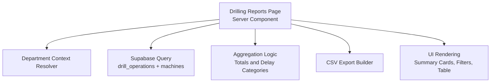
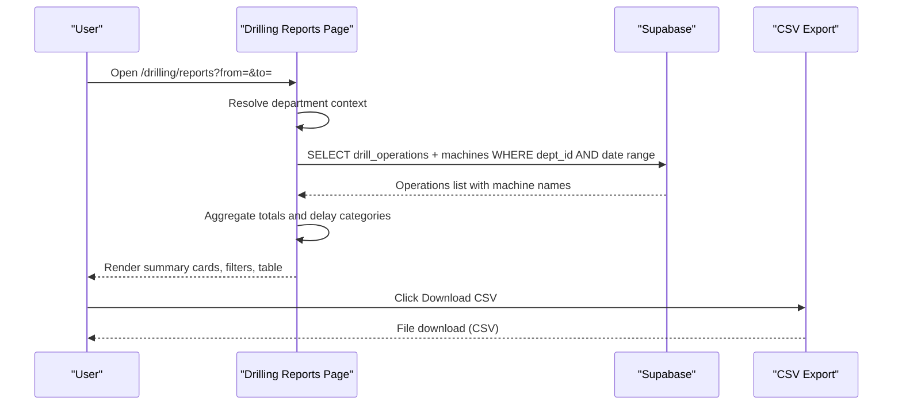
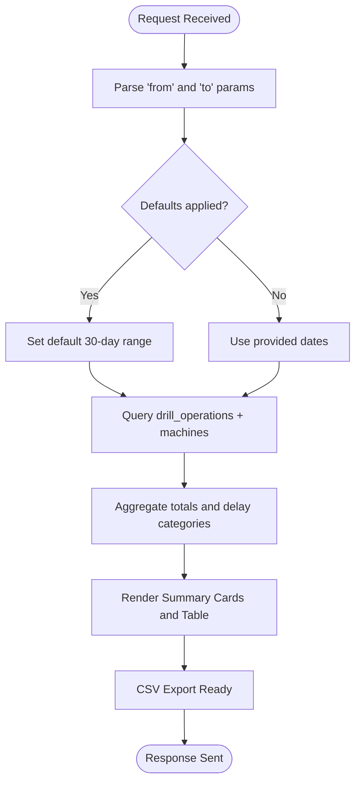
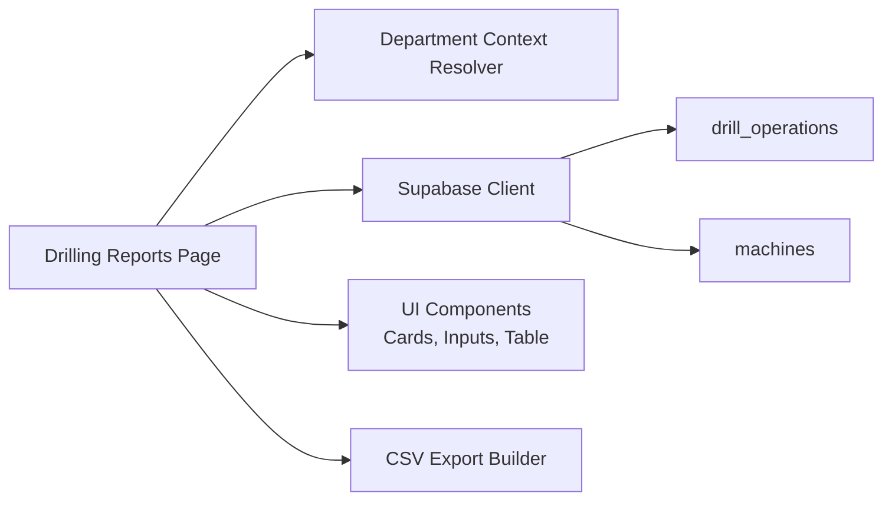

# Drilling Reports & Analytics

<cite>
**Referenced Files in This Document**
- [drilling-department.md](file://wiki/entities/drilling-department.md)
- [analytics-reporting.md](file://wiki/concepts/analytics-reporting.md)
- [page.tsx](file://apps/portal/app/(departments)/drilling/reports/page.tsx)
- [layout.tsx](file://apps/portal/app/(departments)/drilling/reports/layout.tsx)
</cite>

## Table of Contents

1. [Introduction](#introduction)
2. [Project Structure](#project-structure)
3. [Core Components](#core-components)
4. [Architecture Overview](#architecture-overview)
5. [Detailed Component Analysis](#detailed-component-analysis)
6. [Dependency Analysis](#dependency-analysis)
7. [Performance Considerations](#performance-considerations)
8. [Troubleshooting Guide](#troubleshooting-guide)
9. [Conclusion](#conclusion)
10. [Appendices](#appendices)

## Introduction

This document describes the Drilling Reports and Analytics system within the portal application. It focuses on reporting capabilities for drilling operations, including production summaries, efficiency metrics, equipment utilization analysis, and performance trends. It also documents the current report generation approach, export formats, filtering options, data aggregation methods, charting considerations, and planned enhancements such as scheduled reporting and custom report creation.

The system is implemented as a Next.js server-rendered page that queries operational data from Supabase, aggregates key metrics client-side, and provides CSV export functionality. The broader analytics roadmap includes executive dashboards, automated PDF/Excel exports via n8n, trend analysis with forecasting overlays, and predictive maintenance integrations.

## Project Structure

Drilling reports are provided under the drilling department route. The primary entry point is a server component that:

- Resolves the active department context for “drilling”
- Accepts date range filters via URL search parameters
- Queries drill operation records and related machine names
- Aggregates totals for meters drilled, holes, operating hours, and categorized delays
- Renders summary cards, a filter form, and a tabular report
- Exposes a CSV download link built from the same dataset

**Diagram sources**

- [page.tsx](<file://apps/portal/app/(departments)/drilling/reports/page.tsx#L1-L418>)
- [layout.tsx](<file://apps/portal/app/(departments)/drilling/reports/layout.tsx#L1-L8>)

**Section sources**

- [page.tsx:1-418](<file://apps/portal/app/(departments)/drilling/reports/page.tsx#L1-L418>)
- [layout.tsx:1-8](<file://apps/portal/app/(departments)/drilling/reports/layout.tsx#L1-L8>)

## Core Components

- Drilling Reports Page (server component): Provides the core reporting UI and logic for drilling operations over a selected date range.
- Department Context Resolver: Supplies the current department ID and database client scoped to the drilling department.
- Data Aggregation Engine: Computes totals and delay categories across rows returned by the query.
- CSV Exporter: Builds a downloadable CSV file from the aggregated dataset.
- Date Range Filter Form: Allows users to select “From” and “To” dates and refresh the report.

Key responsibilities:

- Fetch drill operations and associated machine names
- Summarize total meters drilled, holes, operating hours, and delays
- Present results in summary cards and a detailed table
- Generate CSV export for the filtered dataset

**Section sources**

- [page.tsx:1-418](<file://apps/portal/app/(departments)/drilling/reports/page.tsx#L1-L418>)

## Architecture Overview

The reporting flow is straightforward and efficient:

- The server component resolves the drilling department context
- It queries drill operations within the selected date range, joining machine names
- It computes totals and categorizes delays into production, non-production, and engineering groups
- It renders KPI-style summary cards and a detailed table
- It offers a CSV download link constructed from the same dataset

**Diagram sources**

- [page.tsx:1-418](<file://apps/portal/app/(departments)/drilling/reports/page.tsx#L1-L418>)

## Detailed Component Analysis

### Drilling Reports Page

Responsibilities:

- Route-level server component for drilling reports
- Accepts optional date range parameters; defaults to last 30 days if not provided
- Queries drill operations and joins machine names
- Aggregates totals for meters drilled, holes, operating hours, and delays
- Renders summary cards and a detailed table
- Provides CSV export for the filtered dataset

Data model usage:

- Primary table: drill_operations
- Related table: machines (joined for name)
- Key fields used include operation_date, total_hours, holes, meters_drilled, operator_name, block_drilled, status, and multiple delay columns

Delay categorization:

- Production delays: blasting, no_operator, natural, tramming, get
- Non-production delays: supply, power, other
- Engineering delays: mechanical, electrical, hydraulic, scheduled_maintenance, unscheduled_maintenance

Filtering:

- From/To date inputs submitted via GET to refresh the report

Export:

- Client-side CSV generation using a data URI and anchor element for download

Complexity:

- Time complexity: O(n) for aggregations and CSV row construction where n is number of operations in the selected range
- Space complexity: O(n) for building CSV rows

Error handling:

- Empty result sets render an informative message
- Null or missing numeric fields are treated as zero during aggregation

**Section sources**

- [page.tsx:1-418](<file://apps/portal/app/(departments)/drilling/reports/page.tsx#L1-L418>)

### Drill Operations Data Flow

**Diagram sources**

- [page.tsx:1-418](<file://apps/portal/app/(departments)/drilling/reports/page.tsx#L1-L418>)

### Reporting Capabilities

- Production reports: Total meters drilled, holes, operating hours, and delay breakdowns per operation
- Efficiency metrics: Hours worked vs. meters drilled; delay category totals to identify bottlenecks
- Equipment utilization analysis: Machine names joined to drill operations for per-rig insights
- Performance trends: Date-range filtering enables trend analysis across time windows

Chart libraries:

- The current drilling reports page does not embed charts; it focuses on tabular data and CSV export
- The broader analytics roadmap references Tremor AreaChart for trend visualization in executive dashboards

Filtering options:

- Date range selection via “From” and “To” inputs
- Server-side filtering by department_id and operation_date bounds

Export formats:

- CSV export available directly from the page
- Planned PDF and Excel exports via n8n workflows and additional components

Scheduled reporting:

- Not yet implemented in this page
- Roadmap includes n8n workflow triggers for monthly PDF/Excel reports

Custom report creation:

- Current implementation uses a fixed schema and layout
- Future extensibility could add user-defined column selection and saved templates

**Section sources**

- [page.tsx:1-418](<file://apps/portal/app/(departments)/drilling/reports/page.tsx#L1-L418>)
- [analytics-reporting.md:1-161](file://wiki/concepts/analytics-reporting.md#L1-L161)

### Executive Dashboard and Advanced Analytics (Roadmap)

- Executive KPI dashboard route exists at /hub/executive with cross-department KPIs
- Uses existing KPI card components and read replica clients for SELECTs
- Includes CSV export for 30-day production trend and a production trend chart with forecast overlay
- Planned features include automated PDF/Excel exports via n8n, rolling averages, and ML-based predictive maintenance

**Section sources**

- [analytics-reporting.md:1-161](file://wiki/concepts/analytics-reporting.md#L1-L161)

## Dependency Analysis

High-level dependencies:

- Department context resolver supplies department-scoped access and Supabase client
- Supabase client performs queries against drill_operations and machines tables
- UI components render summary cards, input controls, and tables
- CSV export is generated client-side from the fetched dataset

**Diagram sources**

- [page.tsx:1-418](<file://apps/portal/app/(departments)/drilling/reports/page.tsx#L1-L418>)

**Section sources**

- [page.tsx:1-418](<file://apps/portal/app/(departments)/drilling/reports/page.tsx#L1-L418>)

## Performance Considerations

- Server-side filtering reduces payload size by limiting rows to the selected date range
- Aggregations are linear in the number of rows; consider materialized views or pre-aggregated tables for large datasets
- Avoid unnecessary re-renders by memoizing derived values if migrating to client-side interactivity
- For future charting, prefer incremental updates and virtualized lists when rendering large datasets

[No sources needed since this section provides general guidance]

## Troubleshooting Guide

Common issues and resolutions:

- No data displayed: Ensure the selected date range contains drill operations for the current department
- Incorrect totals: Verify delay column values are numeric and non-null; nulls are treated as zero in aggregation
- CSV export empty: Confirm the dataset is not empty after applying filters; check browser security settings for downloads
- Slow loading: Large date ranges can increase query time; narrow the range or implement pagination/server-side aggregation

**Section sources**

- [page.tsx:1-418](<file://apps/portal/app/(departments)/drilling/reports/page.tsx#L1-L418>)

## Conclusion

The Drilling Reports and Analytics system currently delivers a robust, server-rendered production report with date-range filtering, summary metrics, and CSV export. It leverages Supabase for data retrieval and simple client-side aggregation for performance. The broader analytics roadmap introduces executive dashboards, automated PDF/Excel exports via n8n, trend analysis with forecasting overlays, and predictive maintenance integrations. These enhancements will expand reporting flexibility, scheduling, and advanced analytics for drilling operations.

[No sources needed since this section summarizes without analyzing specific files]

## Appendices

### Data Model Notes

- drill_operations: Contains daily drilling activity including hours, holes, meters, operator, block, status, and multiple delay categories
- machines: Provides drill rig inventory details, including names used in reports

**Section sources**

- [drilling-department.md:1-71](file://wiki/entities/drilling-department.md#L1-L71)

### Charting and Visualization

- Current drilling reports page does not embed charts
- Executive dashboard references Tremor AreaChart for trend visualization and forecast overlays

**Section sources**

- [analytics-reporting.md:1-161](file://wiki/concepts/analytics-reporting.md#L1-L161)
